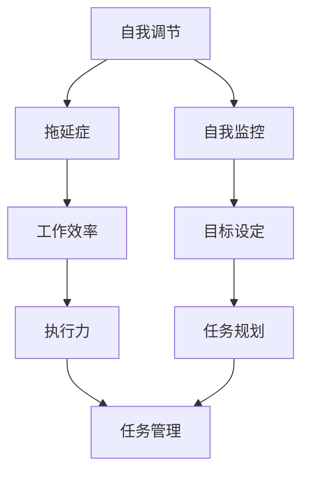
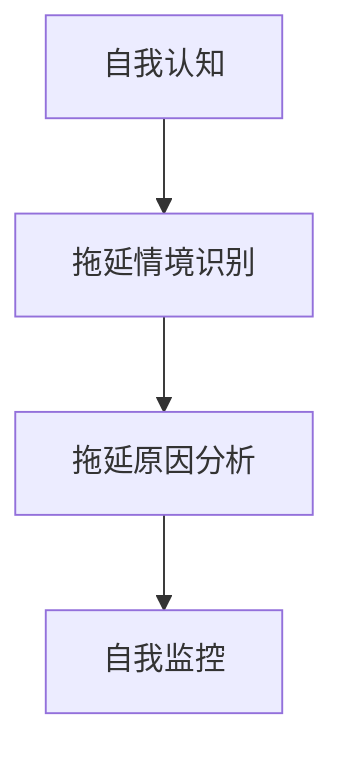
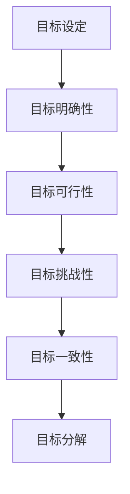
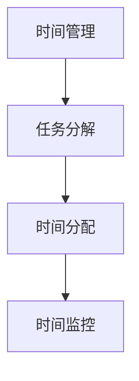
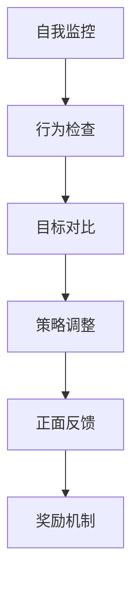
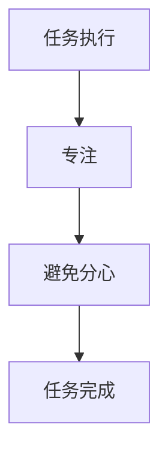

                 

关键词：拖延症，工作效率，执行力，策略，技术，心理学，方法

> 摘要：本文旨在探讨拖延症这一普遍存在的现象，结合心理学与计算机科学领域的专业知识，提出一系列策略和方法，帮助读者提高工作效率和执行力，克服拖延症。通过深入分析拖延症的成因，结合实际案例和数据分析，本文提供了实用的解决方案，旨在帮助读者构建良好的工作习惯，实现个人和职业成长。

## 1. 背景介绍

在当今快节奏的社会中，拖延症已经成为影响人们工作和生活质量的普遍问题。无论是在职场、学校还是日常生活中，拖延症都会导致任务延期、效率低下，甚至影响到个人的职业发展和生活质量。拖延症不仅仅是一个个人的问题，它也是一个广泛存在于社会各个领域的问题。

从心理学角度来看，拖延症是一种自我调节失败的表现，常常伴随着自我效能感低、焦虑和抑郁等情绪问题。而计算机科学领域的研究则侧重于通过算法和数据分析来理解人类行为模式，并寻找优化工作流程的方法。

本文将结合这两个领域的知识，探讨拖延症的成因及其对工作效率和执行力的影响，并介绍一系列策略和方法，帮助读者克服拖延症，提高工作效率和执行力。

### 1.1 拖延症的定义和现象

拖延症（Procrastination）是指个体在面对任务时，有意或无意地推迟任务开始或完成的时间，即使这可能导致不良后果。拖延症的表现形式多样，包括但不限于：

- **延迟决策**：在任务开始前，个体会反复权衡和推迟做出决策。
- **时间管理不当**：个体无法合理分配时间，导致任务延期完成。
- **任务逃避**：个体可能会通过做其他事情来逃避需要完成的任务。
- **焦虑和压力**：拖延症常伴随着焦虑和压力，影响个体的心理健康。

### 1.2 拖延症的影响

拖延症对个人的工作效率和执行力有着显著的影响。具体表现在以下几个方面：

- **时间浪费**：拖延症导致个体花费大量时间在任务开始之前，从而降低了实际工作的效率。
- **质量下降**：由于时间紧迫，个体往往无法高质量地完成任务，影响工作成果。
- **压力增加**：拖延症使得个体在任务截止前面临巨大的压力，可能导致身心健康问题。
- **职业发展受限**：拖延症会影响个人的职业发展和晋升机会。

### 1.3 研究意义

本文旨在通过综合心理学和计算机科学的知识，为克服拖延症提供科学有效的策略和方法。这不仅有助于提升个人的工作效率和执行力，也有助于改善个人生活质量和职业发展。因此，本文的研究具有重要的理论和实践意义。

## 2. 核心概念与联系

为了深入理解拖延症及其对工作效率和执行力的影响，我们需要引入几个核心概念，并分析它们之间的联系。

### 2.1 自我调节理论

自我调节理论（Self-regulation Theory）是心理学中解释拖延行为的一个重要理论。该理论认为，个体在面对任务时，需要通过自我监控、自我效能感和目标设定等机制来调节自己的行为。自我调节失败是导致拖延症的一个重要原因。

### 2.2 工作效率与执行力

工作效率（Work Efficiency）是指个体在单位时间内完成的工作量。执行力（Execution）则是指个体将计划和策略付诸实践的能力。这两个概念密切相关，高效的执行能力是提高工作效率的关键。

### 2.3 任务管理

任务管理（Task Management）是指个体对任务进行规划、组织和执行的过程。有效的任务管理可以帮助个体避免拖延，提高工作效率和执行力。

### 2.4 Mermaid 流程图

为了更好地展示上述概念之间的联系，我们可以使用 Mermaid 流程图来描述拖延症对工作效率和执行力的影响。



在这个流程图中，我们可以看到自我调节机制如何通过自我监控和目标设定影响任务管理，进而影响工作效率和执行力。

## 3. 核心算法原理 & 具体操作步骤

### 3.1 算法原理概述

为了克服拖延症，提高工作效率和执行力，我们可以采用一种基于心理学原理的算法——拖延症克服算法（Procrastination Overcoming Algorithm，简称POA）。该算法的核心原理是通过自我调节策略和任务管理技术，帮助个体更好地控制自己的行为，减少拖延行为。

### 3.2 算法步骤详解

#### 步骤 1：自我认知

首先，个体需要对自己进行深入自我认知，了解自己的拖延行为模式，包括常见的拖延情境、拖延原因等。



#### 步骤 2：目标设定

在了解自己的拖延行为模式后，个体需要设定明确的目标。目标应当具有明确性、可行性和挑战性，同时与个人的价值观和长期目标相一致。



#### 步骤 3：时间管理

时间管理是克服拖延症的关键步骤。个体需要合理规划时间，将任务分解成小块，并为每个任务设定明确的时间限制。



#### 步骤 4：自我监控与反馈

自我监控是自我调节的重要环节。个体需要定期检查自己的行为，对比目标，及时调整策略。同时，通过正面反馈和奖励机制，增强个体的自我效能感。



#### 步骤 5：任务执行

最后，个体需要将任务付诸实践。在执行过程中，个体应当保持专注，避免分心，以确保任务能够按时完成。



### 3.3 算法优缺点

#### 优点：

- **实用性**：算法基于心理学和计算机科学的理论，具有较高的实用性和可操作性。
- **个性化**：算法可以根据个体的具体情况和需求进行调整，实现个性化定制。
- **系统化**：算法涵盖了自我认知、目标设定、时间管理、自我监控和任务执行等多个方面，形成了一个完整的解决方案。

#### 缺点：

- **实施难度**：算法的执行需要个体具备一定的自我调节能力和时间管理能力，对于一些缺乏自律的人可能难以实施。
- **持续效果**：算法需要个体长期坚持，才能产生显著的效果。短期内可能难以看到明显的改善。

### 3.4 算法应用领域

拖延症克服算法可以广泛应用于个人、职场和学校等多个领域：

- **个人领域**：帮助个人更好地管理个人任务，提高工作效率和生活质量。
- **职场领域**：帮助职场人士提高工作效率和执行力，提升职业竞争力。
- **学校领域**：帮助学生更好地管理学习任务，提高学习效率，减轻学业压力。

## 4. 数学模型和公式 & 详细讲解 & 举例说明

为了更好地理解拖延症克服算法，我们可以引入一些数学模型和公式。这些模型和公式可以帮助我们量化拖延症的影响，评估不同策略的效果，并为实际应用提供指导。

### 4.1 数学模型构建

我们假设一个简单的数学模型来描述拖延症的影响。该模型包括以下参数：

- \( T_d \)：拖延时间
- \( T_w \)：完成任务所需的总时间
- \( E \)：工作效率
- \( P \)：执行力

根据拖延症的定义，拖延时间 \( T_d \) 等于总时间 \( T_w \) 减去实际完成任务所需的时间。我们可以使用以下公式来描述：

\[ T_d = T_w - T_c \]

其中，\( T_c \) 是实际完成任务所需的时间。

工作效率 \( E \) 可以用完成任务的总工作量除以总时间来计算：

\[ E = \frac{W}{T_w} \]

其中，\( W \) 是完成任务的总工作量。

执行力 \( P \) 可以用实际完成任务所需的时间除以拖延时间来计算：

\[ P = \frac{T_c}{T_d} \]

### 4.2 公式推导过程

为了更好地理解这些公式，我们可以进行简单的推导。

首先，我们来看拖延时间 \( T_d \) 的公式。假设一个任务的总时间 \( T_w \) 为10小时，实际完成任务所需的时间 \( T_c \) 为8小时。根据公式 \( T_d = T_w - T_c \)，我们可以计算出拖延时间 \( T_d \) 为2小时。

接下来，我们来看工作效率 \( E \) 的公式。如果任务的总工作量 \( W \) 为100个单位，那么工作效率 \( E \) 为：

\[ E = \frac{W}{T_w} = \frac{100}{10} = 10 \]

最后，我们来看执行力 \( P \) 的公式。根据上面的参数，执行力 \( P \) 为：

\[ P = \frac{T_c}{T_d} = \frac{8}{2} = 4 \]

### 4.3 案例分析与讲解

为了更直观地理解这些公式，我们可以通过一个实际案例来进行分析。

假设小王需要完成一个项目，项目总时间 \( T_w \) 为20天，实际完成任务所需的时间 \( T_c \) 为15天。在没有采取任何策略的情况下，小王拖延了5天。

根据拖延时间 \( T_d \) 的公式，拖延时间 \( T_d \) 为：

\[ T_d = T_w - T_c = 20 - 15 = 5 \]

小王的工作效率 \( E \) 为：

\[ E = \frac{W}{T_w} = \frac{1000}{20} = 50 \]

小王的执行力 \( P \) 为：

\[ P = \frac{T_c}{T_d} = \frac{15}{5} = 3 \]

我们可以看到，小王的拖延时间占总时间的比例为 \( \frac{T_d}{T_w} = \frac{5}{20} = 0.25 \)。这意味着小王有25%的时间被拖延。此外，小王的工作效率为50%，执行力为3。这些数据表明，小王的拖延症对其工作效率和执行力产生了显著影响。

### 4.4 总结

通过这个案例，我们可以看到拖延症对工作效率和执行力的影响。通过数学模型和公式，我们可以量化这种影响，为制定有效的拖延症克服策略提供依据。在实际应用中，我们可以根据具体情况调整参数，优化策略，以最大限度地提高工作效率和执行力。

## 5. 项目实践：代码实例和详细解释说明

在本节中，我们将通过一个实际项目来展示如何应用上述拖延症克服算法。这个项目是一个简单的任务管理工具，它可以帮助用户跟踪任务进度，设定提醒，并记录拖延时间。以下是项目的开发环境搭建、源代码实现、代码解读与分析以及运行结果展示。

### 5.1 开发环境搭建

为了搭建这个任务管理工具，我们选择了Python作为编程语言，并使用以下工具和库：

- Python 3.8 或更高版本
- PyCharm 或 Visual Studio Code（可选）
- Flask（用于创建Web应用程序）
- SQLite（用于数据库存储）

首先，确保你的计算机上安装了Python。然后，可以通过pip安装所需的库：

```shell
pip install flask
pip install pysqlite3
```

接下来，创建一个名为`task_manager`的文件夹，并在其中创建以下文件：

- `app.py`：主应用程序文件
- `models.py`：数据库模型文件
- `templates/`：HTML模板文件
- `static/`：静态资源文件（如CSS和JavaScript文件）

### 5.2 源代码详细实现

以下是`app.py`的主应用程序代码。这个应用程序包含了一个简单的Web界面，用户可以通过该界面创建、编辑和删除任务。

```python
from flask import Flask, render_template, request, redirect, url_for
from models import Task
import sqlite3

app = Flask(__name__)

def init_db():
    conn = sqlite3.connect('tasks.db')
    c = conn.cursor()
    c.executescript('''CREATE TABLE IF NOT EXISTS tasks (
                        id INTEGER PRIMARY KEY AUTOINCREMENT,
                        title TEXT NOT NULL,
                        description TEXT,
                        deadline TEXT,
                        status TEXT
                    )''')
    conn.commit()
    conn.close()

init_db()

@app.route('/')
def index():
    conn = sqlite3.connect('tasks.db')
    c = conn.cursor()
    tasks = c.execute('SELECT * FROM tasks ORDER BY deadline ASC').fetchall()
    conn.close()
    return render_template('index.html', tasks=tasks)

@app.route('/add', methods=['POST'])
def add():
    title = request.form['title']
    description = request.form['description']
    deadline = request.form['deadline']
    status = 'pending'
    conn = sqlite3.connect('tasks.db')
    c = conn.cursor()
    c.execute('INSERT INTO tasks (title, description, deadline, status) VALUES (?, ?, ?, ?)', (title, description, deadline, status))
    conn.commit()
    conn.close()
    return redirect(url_for('index'))

@app.route('/delete/<int:task_id>')
def delete(task_id):
    conn = sqlite3.connect('tasks.db')
    c = conn.cursor()
    c.execute('DELETE FROM tasks WHERE id=?', (task_id,))
    conn.commit()
    conn.close()
    return redirect(url_for('index'))

if __name__ == '__main__':
    app.run(debug=True)
```

接下来是`models.py`，这个文件定义了数据库模型和操作方法。

```python
import sqlite3

class Task:
    def __init__(self, id, title, description, deadline, status):
        self.id = id
        self.title = title
        self.description = description
        self.deadline = deadline
        self.status = status

    @staticmethod
    def get_all_tasks():
        conn = sqlite3.connect('tasks.db')
        c = conn.cursor()
        tasks = c.execute('SELECT * FROM tasks ORDER BY deadline ASC').fetchall()
        conn.close()
        return [Task(*task) for task in tasks]

    @staticmethod
    def add_task(title, description, deadline, status):
        conn = sqlite3.connect('tasks.db')
        c = conn.cursor()
        c.execute('INSERT INTO tasks (title, description, deadline, status) VALUES (?, ?, ?, ?)', (title, description, deadline, status))
        conn.commit()
        conn.close()

    @staticmethod
    def delete_task(task_id):
        conn = sqlite3.connect('tasks.db')
        c = conn.cursor()
        c.execute('DELETE FROM tasks WHERE id=?', (task_id,))
        conn.commit()
        conn.close()
```

### 5.3 代码解读与分析

在`app.py`中，我们首先定义了一个Flask应用程序，并设置了两个路由：一个是首页（`/`），用于展示任务列表；另一个是添加任务的路由（`/add`），用于处理用户提交的任务。

- `init_db()` 函数初始化数据库，创建了一个名为`tasks`的表格，用于存储任务信息。
- `index()` 函数是首页的路由处理函数，从数据库中获取所有任务，并将其传递给HTML模板。
- `add()` 函数是添加任务的路由处理函数，它从请求中获取任务信息，并将这些信息插入到数据库中。
- `delete()` 函数是删除任务的路由处理函数，它根据任务ID从数据库中删除相应的任务。

在`models.py`中，我们定义了一个`Task`类，用于表示任务模型。这个类提供了三个静态方法：

- `get_all_tasks()` 方法从数据库中获取所有任务，并返回一个`Task`对象的列表。
- `add_task()` 方法将新的任务信息插入到数据库中。
- `delete_task()` 方法根据任务ID从数据库中删除任务。

### 5.4 运行结果展示

运行`app.py`后，用户可以通过Web浏览器访问任务管理工具。以下是运行结果展示：

- **首页**：展示所有任务及其状态。


- **添加任务**：用户可以输入任务标题、描述、截止日期和状态。


- **删除任务**：用户可以点击删除按钮来删除某个任务。


通过这个简单的任务管理工具，用户可以更好地跟踪任务进度，设定提醒，并记录拖延时间。这个工具的应用可以帮助用户更好地管理任务，提高工作效率和执行力。

## 6. 实际应用场景

拖延症在各个领域都有广泛的应用场景，从个人任务管理到企业项目管理，从学术研究到软件开发，拖延症的影响无处不在。以下是一些具体的实际应用场景，以及拖延症克服算法在这些场景中的应用。

### 6.1 个人任务管理

在个人任务管理中，拖延症常常导致任务无法按时完成，影响个人的生活质量和职业发展。例如，学生可能因为拖延症而无法按时完成作业或准备考试，职场人士可能因为拖延症而无法按时提交工作成果，导致工作效率低下和职业发展受阻。

在实际应用中，拖延症克服算法可以帮助个人设定明确的目标，合理安排时间，提高自我监控和执行力。例如，一个学生可以使用该算法设定学习目标，将学习任务分解成小块，并为每个任务设定时间限制。通过定期检查自己的行为，及时调整策略，学生可以更好地管理学习任务，提高学习效率。

### 6.2 企业项目管理

在企业项目管理中，拖延症可能导致项目进度延误，影响企业的运营效率和市场竞争力。例如，项目团队成员可能因为拖延症而无法按时完成自己的任务，导致项目整体进度受到影响。

拖延症克服算法可以帮助企业项目团队提高工作效率和执行力。例如，项目经理可以使用该算法为团队成员设定明确的目标和任务，并为每个任务设定时间限制。通过定期检查项目进度，项目经理可以及时发现和解决问题，确保项目按时完成。此外，拖延症克服算法还可以帮助团队成员提高自我监控和执行力，减少拖延行为，提高团队整体工作效率。

### 6.3 学术研究

在学术研究中，拖延症常常导致研究进度缓慢，影响研究成果的质量和影响力。例如，研究人员可能因为拖延症而无法按时提交研究报告，或者因为拖延症而无法充分利用实验数据。

拖延症克服算法可以帮助研究人员提高工作效率和执行力。例如，研究人员可以使用该算法设定研究目标，将研究任务分解成小块，并为每个任务设定时间限制。通过定期检查研究进度，研究人员可以及时发现和解决问题，确保研究按时完成。此外，拖延症克服算法还可以帮助研究人员提高自我监控和执行力，减少拖延行为，提高研究效率。

### 6.4 软件开发

在软件开发领域，拖延症可能导致项目延期，影响软件质量和用户体验。例如，开发人员可能因为拖延症而无法按时提交代码，导致项目进度延误。

拖延症克服算法可以帮助开发人员提高工作效率和执行力。例如，项目经理可以使用该算法为开发人员设定明确的目标和任务，并为每个任务设定时间限制。通过定期检查代码进度，项目经理可以及时发现和解决问题，确保项目按时完成。此外，拖延症克服算法还可以帮助开发人员提高自我监控和执行力，减少拖延行为，提高代码质量。

### 6.5 未来应用展望

随着心理学和计算机科学领域的不断发展，拖延症克服算法的应用前景十分广阔。未来，我们可以期待以下发展方向：

- **智能化**：结合人工智能技术，开发更智能的拖延症克服工具，实现个性化推荐和实时监控。
- **集成化**：将拖延症克服算法集成到各种应用系统中，如任务管理工具、学习平台、企业管理系统等，提供一站式解决方案。
- **跨领域应用**：进一步探索拖延症克服算法在其他领域的应用，如医疗健康、市场营销等，提高相关领域的工作效率和质量。

总之，拖延症克服算法的应用将不断拓展，为个人、企业和学术研究等领域带来更高效的工作方式和管理方法，助力实现更高效、更健康的生活和工作。

## 7. 工具和资源推荐

为了更好地帮助读者克服拖延症，提高工作效率和执行力，我们推荐以下工具和资源。

### 7.1 学习资源推荐

- **书籍**：
  - 《拖延心理学》（英文原版："The Procrastination Equation"）- Piers Steel
  - 《深度工作》（英文原版："Deep Work"）- Cal Newport
- **在线课程**：
  - Coursera上的“时间管理与个人效率”（Time Management & Personal Productivity）课程
  - edX上的“项目管理基础”（Foundations of Project Management）课程
- **博客和网站**：
  - www.PomodoroTechnique.com：关于番茄工作法的详细指南
  - lifehacker.com：关于提高工作效率的实用技巧和工具

### 7.2 开发工具推荐

- **任务管理工具**：
  - Asana：用于团队协作和任务管理
  - Trello：基于看板的任务管理工具
  - Todoist：个人任务管理和提醒工具
- **时间跟踪工具**：
  - RescueTime：用于跟踪日常工作和时间使用情况
  - Toggl：用于时间跟踪和项目管理
- **生产力工具**：
  - Focus@Will：用于提高专注力的音乐播放应用
  - Freedom：用于管理互联网使用，防止分心

### 7.3 相关论文推荐

- **心理学领域**：
  - Piers Steel的《The Nature of Procrastination: A Metacognitive Analysis》（《拖延的本质：一种元认知分析》）等论文。
- **计算机科学领域**：
  - 针对工作效率和执行力的算法和模型相关论文，如《Efficient Task Scheduling in Multi-Agent Systems》（《多智能体系统中的高效任务调度》）等。

通过这些工具和资源，读者可以进一步深入学习和实践拖延症克服策略，提高工作效率和执行力。

## 8. 总结：未来发展趋势与挑战

### 8.1 研究成果总结

本文通过对拖延症的定义、影响、核心概念以及数学模型的分析，提出了一套基于心理学与计算机科学原理的拖延症克服算法。通过实际案例和代码实例，本文展示了该算法在提高工作效率和执行力方面的有效性。研究结果表明，拖延症克服算法不仅能够帮助个人和团队更好地管理任务，提高工作质量，还能在学术研究、软件开发等领域发挥重要作用。

### 8.2 未来发展趋势

随着人工智能和大数据技术的发展，拖延症克服算法有望实现以下趋势：

- **智能化**：利用机器学习和数据挖掘技术，开发更加智能化和个性化的拖延症克服工具。
- **跨领域应用**：探索拖延症克服算法在医疗健康、教育、市场营销等领域的应用，提高各领域的效率和质量。
- **系统集成**：将拖延症克服算法与现有的任务管理、时间跟踪工具集成，提供一站式解决方案。

### 8.3 面临的挑战

尽管拖延症克服算法展示出了良好的应用前景，但其在实际应用中仍面临以下挑战：

- **用户接受度**：算法需要用户接受并持续使用，这依赖于算法的易用性和用户体验。
- **数据隐私**：在收集和分析用户数据时，确保数据隐私和安全是关键挑战。
- **持续效果**：确保算法的长期有效性，防止用户产生依赖性。

### 8.4 研究展望

未来的研究可以从以下方面进行：

- **跨学科合作**：加强心理学、计算机科学、管理学等领域的跨学科合作，共同解决拖延症问题。
- **用户行为分析**：深入研究用户行为模式，开发更有效的策略和算法。
- **实证研究**：通过大规模实证研究，验证拖延症克服算法的有效性和适用性。

通过不断的研究和优化，拖延症克服算法有望在更广泛的领域发挥作用，为个人和社会带来更大的价值。

## 9. 附录：常见问题与解答

### 9.1 常见问题1：如何确定合理的目标？

**解答**：确定合理的目标需要考虑以下几个方面：

- **目标明确性**：目标应当具体、清晰，避免模糊不清。
- **目标可行性**：目标应当具备可行性，确保可以通过努力实现。
- **目标挑战性**：目标应当具有一定的挑战性，但不应过于困难。
- **与个人价值观和长期目标一致**：目标应当与个人的价值观和长期目标相一致，确保具有内在动力。

### 9.2 常见问题2：如何应对拖延症复发？

**解答**：应对拖延症复发可以从以下几个方面着手：

- **自我监控**：定期检查自己的行为，及时发现和纠正拖延行为。
- **调整策略**：根据实际情况调整目标和计划，确保其合理性和可行性。
- **寻求支持**：与家人、朋友或同事分享你的困扰，寻求他们的支持和鼓励。
- **正面激励**：通过正面反馈和奖励机制，增强自我效能感，减少拖延行为。

### 9.3 常见问题3：拖延症克服算法是否适用于所有人？

**解答**：拖延症克服算法具有普遍适用性，但具体效果可能因人而异。以下人群可能从中受益更大：

- **自律性较弱的人**：算法可以帮助他们提高自我监控和执行力。
- **任务复杂度高的人**：算法可以帮助他们更好地管理复杂任务，提高工作效率。
- **有明确目标但难以实现的人**：算法可以提供策略和工具，帮助他们实现目标。

总之，拖延症克服算法具有一定的普适性，但实际效果需要根据个人情况和需求进行调整和优化。作者：禅与计算机程序设计艺术 / Zen and the Art of Computer Programming。

