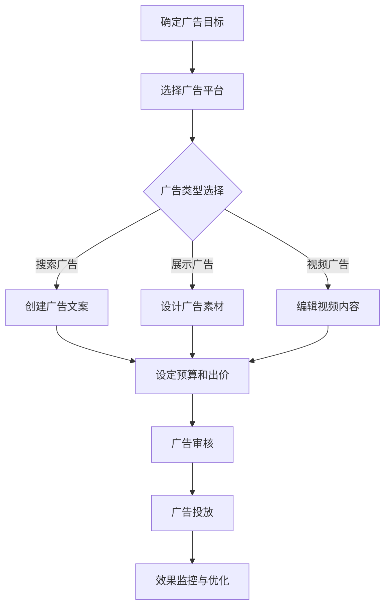

                 

关键词：付费广告、知识付费、推广策略、营销技术、用户获取

> 摘要：本文将深入探讨如何利用付费广告有效推广知识付费产品。我们将分析广告平台的运作原理，阐述优化广告投放策略的方法，并提供实用的案例和工具推荐，以帮助企业和个人打造成功的知识付费推广计划。

## 1. 背景介绍

随着互联网的普及和人们对终身学习的追求，知识付费市场正在迅速扩大。知识付费产品包括在线课程、专业书籍、研究报告、音频讲座等多种形式，满足了用户对高质量知识和技能的需求。然而，如何有效地推广这些知识付费产品，成为企业和个人面临的一大挑战。

付费广告作为一种高效、可控的推广手段，正日益受到知识付费从业者的青睐。本文将结合实际案例，分析如何利用付费广告平台，如Google Ads、Facebook Ads等，实现知识付费产品的精准推广，从而提高用户获取率和收益。

## 2. 核心概念与联系

### 2.1 广告平台概述

首先，了解广告平台的运作原理是制定有效广告策略的基础。广告平台如Google Ads和Facebook Ads提供了丰富的广告类型，包括搜索广告、展示广告、视频广告等，每种广告类型都有其独特的投放机制和效果评估指标。

- **搜索广告**：根据用户搜索关键词展示广告，如Google Ads的关键词广告。
- **展示广告**：根据用户的兴趣和行为数据在网页上展示广告，如Facebook Ads。
- **视频广告**：在视频播放前、中、后展示的广告，如YouTube Ads。

### 2.2 广告目标与策略

明确广告目标是广告投放的起点。对于知识付费产品，广告目标通常包括品牌曝光、用户获取和直接转化。根据不同的目标，制定相应的广告策略和投放方案。

- **品牌曝光**：通过展示广告提高品牌知名度和影响力。
- **用户获取**：通过点击广告引导用户访问产品页面，从而增加潜在客户。
- **直接转化**：直接引导用户进行购买或注册，实现销售目标。

### 2.3 Mermaid 流程图

以下是一个简化的Mermaid流程图，展示从广告创建到投放的全过程。



## 3. 核心算法原理 & 具体操作步骤

### 3.1 算法原理概述

广告投放的核心算法包括关键词匹配、用户行为分析、竞价排名等。关键词匹配算法根据用户搜索内容展示相关广告，用户行为分析则帮助广告平台了解用户兴趣和行为模式，竞价排名则决定了广告在用户面前展示的优先级。

### 3.2 算法步骤详解

1. **关键词匹配**：广告平台根据用户搜索关键词和广告关键词的匹配度展示广告。
2. **用户行为分析**：通过用户的浏览历史、点击行为等数据，分析用户兴趣，优化广告投放。
3. **竞价排名**：广告主通过设定竞价出价，决定广告在搜索结果中的展示位置。

### 3.3 算法优缺点

- **优点**：精准定位目标用户，提高广告转化率。
- **缺点**：广告效果受关键词匹配和竞价排名影响较大，成本控制难度较高。

### 3.4 算法应用领域

广告投放算法广泛应用于电子商务、在线教育、金融保险等行业，通过精准的广告投放提高用户获取和销售转化。

## 4. 数学模型和公式 & 详细讲解 & 举例说明

### 4.1 数学模型构建

广告投放的数学模型通常包括CPM（每千次展示成本）、CPC（每点击成本）和CPA（每行动成本）等指标。以下是一个简单的CPM模型：

\[ \text{CPM} = \frac{\text{广告成本}}{\text{展示次数}} \times 1000 \]

### 4.2 公式推导过程

CPM模型的推导基于广告成本和展示次数的关系。广告成本是广告主为获取广告展示而支付的费用，展示次数是广告在用户面前出现的总次数。通过将广告成本除以展示次数，再乘以1000，可以得到每千次展示的成本。

### 4.3 案例分析与讲解

假设一个知识付费产品的广告成本为1000美元，共展示了10000次。根据CPM模型计算：

\[ \text{CPM} = \frac{1000}{10000} \times 1000 = 10 \]

这意味着每次展示的成本为10美元。通过调整广告文案、广告素材和投放策略，可以进一步优化CPM指标，提高广告效果。

## 5. 项目实践：代码实例和详细解释说明

### 5.1 开发环境搭建

在开始广告投放之前，需要搭建一个合适的开发环境。例如，使用Google Ads API进行广告管理，需要安装Google Ads SDK，并配置API密钥。

### 5.2 源代码详细实现

以下是一个简单的Python代码示例，展示了如何使用Google Ads API创建广告。

```python
from google.ads.google_ads.client import GoogleAdsClient
from google.ads.google_ads.errors import GoogleAdsException
from google.ads.google_ads.v10.resources.types import keyword_plan_ad_group

def create_keyword_plan_ad_group(client, customer_id, ad_group_name, cpc_bid_micros):
    # 创建广告组
    ad_group = keyword_plan_ad_group.KeywordPlanAdGroup(
        customer_id=customer_id,
        name=ad_group_name,
        cpc_bid_micros=cpc_bid_micros,
    )

    # 提交创建广告组的操作
    operation = client.service.mutate_keyword_plan_ad_groups(
        customer_id=customer_id, operations=[keyword_plan_ad_group.KeywordPlanAdGroupOperation.create(ad_group)]
    )
    return operation.response.results[0]

# 配置API密钥和客户ID
client = GoogleAdsClient.load_from_storage()
customer_id = "YOUR_CUSTOMER_ID"

# 创建广告组
ad_group = create_keyword_plan_ad_group(client, customer_id, "Knowledge Fee Product Ad Group", 1000000)
print(f"Created keyword plan ad group with name '{ad_group.name}' and ID '{ad_group.id}'.")
```

### 5.3 代码解读与分析

这段代码首先导入了Google Ads API所需的库，并配置了API密钥和客户ID。接着，定义了一个函数`create_keyword_plan_ad_group`，用于创建广告组。函数接受广告平台的客户端实例、客户ID、广告组名称和每次点击出价（以微单位表示）。

在主程序中，加载Google Ads客户端，配置客户ID，并调用`create_keyword_plan_ad_group`函数创建广告组。最后，输出创建成功的广告组名称和ID。

### 5.4 运行结果展示

运行上述代码后，将在控制台输出创建成功的广告组名称和ID，例如：

```
Created keyword plan ad group with name 'Knowledge Fee Product Ad Group' and ID '9352373579'.
```

这表明广告组已经成功创建，并可以开始进行广告投放。

## 6. 实际应用场景

### 6.1 在线教育平台

在线教育平台可以通过付费广告吸引潜在学员。例如，利用Google Ads针对特定关键词进行广告投放，将广告展示给正在寻找相关课程的用户。通过优化广告文案和素材，提高点击率和转化率。

### 6.2 专业咨询公司

专业咨询公司可以利用展示广告提高品牌曝光度。通过Facebook Ads，根据用户的兴趣和行为数据，精准投放广告，吸引潜在客户。结合视频广告，展示公司的实力和专业服务，提高用户信任度。

### 6.3 研究机构

研究机构可以通过付费广告推广研究报告和学术论文。例如，利用Google Scholar Ads，将广告展示给正在搜索相关研究领域的用户。通过优化广告内容，提高报告的下载率和影响力。

## 7. 工具和资源推荐

### 7.1 学习资源推荐

- **Google Ads Academy**：提供丰富的广告营销教程和案例，帮助新手了解广告投放策略。
- **Facebook Blueprint**：Facebook提供的免费在线课程，涵盖广告创意、定位和优化等方面。

### 7.2 开发工具推荐

- **Google Ads API**：用于自动化广告管理，提高广告投放效率。
- **Facebook Ads Manager**：Facebook官方的广告管理工具，提供实时数据分析和优化功能。

### 7.3 相关论文推荐

- **"The Role of Keywords in Online Advertising"**：探讨了关键词匹配在广告投放中的重要性。
- **"Behavioral Targeting in Online Advertising"**：分析了用户行为分析在精准广告投放中的应用。

## 8. 总结：未来发展趋势与挑战

### 8.1 研究成果总结

本文介绍了如何利用付费广告推广知识付费产品，分析了广告平台的运作原理和优化策略，并提供了实际案例和代码实例。通过合理利用广告平台，知识付费产品可以更有效地推广，提高用户获取率和收益。

### 8.2 未来发展趋势

随着人工智能和大数据技术的发展，广告投放将更加精准和高效。个性化广告、自动化投放和实时数据分析将成为未来的趋势。

### 8.3 面临的挑战

广告投放面临的挑战包括数据隐私保护、广告效果评估和成本控制。如何在不侵犯用户隐私的前提下，实现精准投放，并保持广告效果的可持续性，是未来需要解决的难题。

### 8.4 研究展望

未来，知识付费产品的广告投放将朝着更加智能化、个性化和实时化的方向发展。研究者可以探索新的广告算法和模型，提高广告投放的效率和效果。

## 9. 附录：常见问题与解答

### 9.1 如何选择广告平台？

选择广告平台需要考虑目标用户群体、广告预算和产品定位。例如，Google Ads适合搜索广告，Facebook Ads适合展示广告和视频广告。

### 9.2 广告投放效果不佳怎么办？

广告投放效果不佳可能是因为关键词选择不准确、广告素材不够吸引人或者广告定位不精准。可以通过数据分析，优化广告文案、素材和定位策略。

### 9.3 如何控制广告成本？

通过设定合理的预算和出价策略，可以控制广告成本。例如，使用CPM和CPA等指标，调整广告投放策略，提高广告效果。

---

作者：禅与计算机程序设计艺术 / Zen and the Art of Computer Programming

