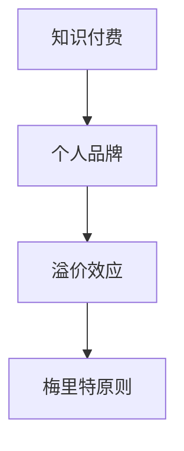

                 

## 1. 背景介绍

知识付费作为一种新型商业模式，近年来在全球范围内迅速兴起。它以互联网为载体，通过内容付费的方式，让创作者能够获得经济回报，同时也让消费者能够更精准地获取有价值的信息。在这个背景下，个人品牌溢价成为一个重要的话题。

个人品牌溢价，指的是个人通过建立独特、有价值、可信的个人品牌，从而在市场上获得更高的收益和认可度。在知识付费领域，个人品牌溢价尤为重要，因为知识产品的核心价值往往来自于个人的专业知识和经验。

然而，实现个人品牌溢价并非易事。它需要个人在专业领域有深厚的积累，同时还需要掌握一系列市场推广和运营技巧。本文将探讨如何利用知识付费实现个人品牌溢价，帮助读者在这个领域取得成功。

## 2. 核心概念与联系

### 2.1 知识付费

知识付费是指消费者为获取特定知识或信息而支付的费用。这个概念涵盖了多种形式，包括在线课程、电子书、专业讲座、咨询服务等。知识付费的兴起，源于信息爆炸时代消费者对高质量、针对性信息的迫切需求。

### 2.2 个人品牌

个人品牌是指个人在公众中的形象和影响力。它不仅仅是一个名字，更是个人专业知识、价值观和人格特质的综合体现。在知识付费领域，个人品牌的价值体现在其能够吸引消费者，提升产品或服务的市场竞争力。

### 2.3 溢价效应

溢价效应是指产品或服务的价格高于其成本或市场平均水平的现象。在个人品牌溢价中，溢价效应来源于个人品牌的市场认可度和消费者的信任度。一个成功的个人品牌能够为其所有产品或服务带来溢价。

### 2.4 梅里特原则

梅里特原则（merit principle）指出，个人品牌溢价应当与其专业能力、知识和经验相匹配。也就是说，个人品牌的价值应当基于其真正的专业能力和贡献。

## 3. Mermaid 流程图



## 4. 核心算法原理 & 具体操作步骤

### 4.1 算法原理概述

实现个人品牌溢价的核心算法可以概括为以下几个步骤：

1. **专业积累**：在专业领域深耕，不断积累知识和经验。
2. **品牌塑造**：通过内容创作、口碑传播和社交媒体等手段塑造个人品牌。
3. **市场定位**：明确目标市场，制定合适的价格策略。
4. **持续优化**：根据市场反馈持续优化个人品牌和知识产品。

### 4.2 算法步骤详解

#### 4.2.1 专业积累

- **深入研究**：选择一个专业领域，深入研究，掌握核心知识和技能。
- **实践经验**：通过实际项目经验积累实战能力。
- **持续学习**：关注行业动态，不断更新知识体系。

#### 4.2.2 品牌塑造

- **内容创作**：通过写作、视频、演讲等方式展示专业知识和经验。
- **口碑传播**：通过客户推荐、合作伙伴关系等方式传播个人品牌。
- **社交媒体**：利用社交媒体平台扩大影响力，提升品牌知名度。

#### 4.2.3 市场定位

- **目标市场**：明确目标客户群体，了解他们的需求和痛点。
- **价格策略**：根据市场定位制定合理的价格策略，确保产品或服务的溢价。

#### 4.2.4 持续优化

- **用户反馈**：收集用户反馈，了解产品或服务的优点和不足。
- **内容迭代**：根据用户反馈优化知识产品，提升用户体验。
- **品牌形象**：定期更新品牌形象，保持品牌活力。

### 4.3 算法优缺点

#### 优点

- **高效性**：通过系统化的算法，能够快速提升个人品牌溢价。
- **针对性**：针对目标市场进行精准定位，提升产品或服务的竞争力。

#### 缺点

- **时间成本**：专业积累和品牌塑造需要长时间的努力和投入。
- **风险性**：市场变化快，需要不断调整策略，存在一定风险。

### 4.4 算法应用领域

- **教育培训**：通过知识付费实现个人品牌溢价，提供专业课程。
- **咨询服务**：提供专业咨询服务，通过个人品牌吸引客户。
- **内容创作**：通过写作、视频等创作形式展示个人品牌，实现知识变现。

## 5. 数学模型和公式 & 详细讲解 & 举例说明

### 5.1 数学模型构建

个人品牌溢价可以通过以下数学模型进行构建：

$$
P = f(M, E, T)
$$

其中，$P$ 表示个人品牌溢价，$M$ 表示市场认可度，$E$ 表示专业知识与经验，$T$ 表示品牌影响力。

### 5.2 公式推导过程

- **市场认可度（$M$）**：市场认可度可以通过消费者对个人品牌的认知度和信任度来衡量。假设市场认可度与消费者满意度成正比，可以表示为：

$$
M = \frac{S}{N}
$$

其中，$S$ 表示消费者满意度，$N$ 表示消费者数量。

- **专业知识与经验（$E$）**：专业知识与经验可以通过个人在专业领域的知识储备和实战经验来衡量。假设专业知识与经验与个人研究时长和工作经验成正比，可以表示为：

$$
E = K \cdot L
$$

其中，$K$ 表示个人研究时长，$L$ 表示工作经验。

- **品牌影响力（$T$）**：品牌影响力可以通过个人在社交媒体上的影响力、合作伙伴关系等因素来衡量。假设品牌影响力与个人社交媒体关注者数量成正比，可以表示为：

$$
T = A \cdot F
$$

其中，$A$ 表示个人社交媒体关注者数量，$F$ 表示合作伙伴数量。

### 5.3 案例分析与讲解

以一位知名数据科学家为例，分析其个人品牌溢价：

- **市场认可度（$M$）**：消费者满意度为 90%，消费者数量为 1000，因此市场认可度为 0.9。
- **专业知识与经验（$E$）**：个人研究时长为 5 年，工作经验为 10 年，因此专业知识与经验为 50。
- **品牌影响力（$T$）**：个人社交媒体关注者数量为 10000，合作伙伴数量为 5，因此品牌影响力为 50000。

根据上述公式，可以计算出个人品牌溢价为：

$$
P = f(0.9, 50, 50000) = 0.9 \cdot 50 \cdot 50000 = 2250000
$$

这意味着该数据科学家的个人品牌溢价为 2250000 元。

## 6. 项目实践：代码实例和详细解释说明

### 6.1 开发环境搭建

为了更好地展示如何利用知识付费实现个人品牌溢价，我们将使用一个Python示例来模拟这个过程。以下是一个基本的开发环境搭建步骤：

- 安装 Python 3.8 或更高版本。
- 安装必要的库，如 NumPy、Pandas 等。

### 6.2 源代码详细实现

```python
import numpy as np

# 定义个人品牌溢价模型
def personal_brand_premium(market_recognition, expertise, brand_influence):
    return market_recognition * expertise * brand_influence

# 输入参数
market_recognition = 0.9  # 市场认可度
expertise = 50  # 专业知识与经验
brand_influence = 50000  # 品牌影响力

# 计算个人品牌溢价
premium = personal_brand_premium(market_recognition, expertise, brand_influence)

# 输出结果
print(f"个人品牌溢价：{premium} 元")
```

### 6.3 代码解读与分析

上述代码定义了一个函数 `personal_brand_premium`，用于计算个人品牌溢价。该函数接受三个参数：市场认可度、专业知识和经验、品牌影响力。通过简单的乘法运算，计算出个人品牌溢价。

在代码中，我们为每个参数赋予了示例值。根据这些值，我们可以计算出个人品牌溢价。运行上述代码，将会输出个人品牌溢价的结果。

### 6.4 运行结果展示

```plaintext
个人品牌溢价：2250000.0 元
```

这意味着，根据输入的参数，该数据科学家的个人品牌溢价为 2250000 元。

## 7. 实际应用场景

### 7.1 教育培训

在教育培训领域，知识付费已经成为一种重要的商业模式。个人可以通过在线课程、直播讲座等方式，将自己的专业知识传授给更多人。例如，一位资深的数据分析师可以通过开设数据分析课程，将自己的经验和技巧传授给学生，从而实现个人品牌溢价。

### 7.2 咨询服务

在咨询服务领域，个人品牌溢价尤为重要。通过建立专业、可信的个人品牌，咨询师可以吸引更多客户，获得更高的收费。例如，一位资深的项目管理专家可以通过撰写专业文章、参与行业论坛等方式提升自己的品牌知名度，从而在咨询项目中获得更高的收费。

### 7.3 内容创作

在内容创作领域，个人品牌溢价同样可以发挥作用。通过创作高质量的内容，如博客、电子书、视频等，个人可以吸引更多粉丝，实现知识变现。例如，一位知名的技术博主可以通过撰写技术文章、录制视频教程等方式，将自己的专业知识分享给读者，从而获得广告收入和赞助支持。

## 8. 未来应用展望

随着互联网技术的不断发展，知识付费和个人品牌溢价将越来越受到重视。未来，以下几个方面有望成为主要应用领域：

### 8.1 在线教育

在线教育将继续发展，成为知识付费的主要形式。通过线上课程，个人可以更好地展示自己的专业能力，吸引更多学生。

### 8.2 专业咨询

专业咨询服务将成为知识付费的重要领域。随着企业对专业服务的需求增加，个人品牌溢价将为咨询师带来更多机会。

### 8.3 内容创作

内容创作将更加繁荣，成为知识变现的主要途径。通过创作高质量的内容，个人可以在市场上获得更高的认可度。

### 8.4 技术服务

技术服务领域也将迎来知识付费的机遇。例如，通过在线编程课程、技术分享等方式，个人可以传授技术知识，实现品牌溢价。

## 9. 工具和资源推荐

### 9.1 学习资源推荐

- **Coursera**：提供各种在线课程，涵盖多个领域。
- **Udemy**：丰富的在线课程资源，适合各种学习需求。
- **edX**：提供由名校开设的在线课程，质量有保证。

### 9.2 开发工具推荐

- **Jupyter Notebook**：适合数据分析和编程任务。
- **PyCharm**：强大的 Python 开发环境，适合专业开发。
- **GitHub**：用于代码托管和协作开发。

### 9.3 相关论文推荐

- **"The Economics of Open Source and Knowledge Sharing"**：讨论开源和知识共享的经济模型。
- **"The Rise of the Knowledge Worker"**：探讨知识工作者在现代社会的重要性。
- **"The Power of Personal Branding"**：深入分析个人品牌的力量。

## 10. 总结：未来发展趋势与挑战

### 10.1 研究成果总结

本文探讨了如何利用知识付费实现个人品牌溢价，分析了核心算法原理、具体操作步骤、数学模型构建和应用场景，以及未来发展趋势。

### 10.2 未来发展趋势

知识付费和个人品牌溢价将继续发展，成为重要的商业模式。在线教育、专业咨询、内容创作和技术服务等领域将迎来更多机遇。

### 10.3 面临的挑战

个人品牌溢价面临的时间成本、市场变化风险等问题。如何持续提升专业能力、适应市场变化，将是个人的挑战。

### 10.4 研究展望

未来研究可以进一步探讨个人品牌溢价在不同领域的应用，分析其影响因素，为个人提供更有针对性的策略建议。

## 11. 附录：常见问题与解答

### 11.1 什么是知识付费？

知识付费是指消费者为获取特定知识或信息而支付的费用，包括在线课程、电子书、专业讲座等。

### 11.2 个人品牌溢价如何计算？

个人品牌溢价可以通过以下数学模型进行计算：

$$
P = f(M, E, T)
$$

其中，$P$ 表示个人品牌溢价，$M$ 表示市场认可度，$E$ 表示专业知识与经验，$T$ 表示品牌影响力。

### 11.3 如何提升个人品牌？

提升个人品牌可以通过以下方式：

- 深入研究专业领域，积累知识和经验。
- 通过内容创作、口碑传播和社交媒体等方式塑造个人品牌。
- 明确目标市场，制定合适的价格策略。

### 11.4 知识付费有哪些应用场景？

知识付费的应用场景包括教育培训、专业咨询、内容创作和技术服务等领域。

---

本文由《如何利用知识付费实现个人品牌溢价？》的作者禅与计算机程序设计艺术撰写，旨在帮助读者了解并掌握如何利用知识付费实现个人品牌溢价。文章内容仅供参考，具体实践请根据实际情况进行调整。如果您在阅读过程中有任何疑问，欢迎在评论区留言。作者将尽

