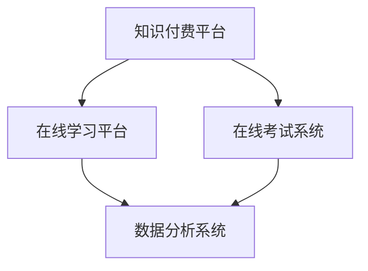

                 

关键词：知识付费、在线学习、在线考试、指导、教育技术、人工智能、数据分析、互动教学

> 摘要：本文探讨了如何利用知识付费模式，通过在线学习平台和在线考试系统，实现在线学习与在线考试指导的整合。文章介绍了知识付费的基本概念和在线教育的发展背景，分析了在线学习和在线考试指导的关键需求，提出了一种基于人工智能和数据分析的解决方案，并分享了实际应用案例和未来发展趋势。

## 1. 背景介绍

在当今信息化社会中，互联网的普及和移动设备的广泛应用，使得在线学习成为了一种便捷、高效的学习方式。根据《2021年中国在线教育行业白皮书》的数据显示，中国在线教育市场规模已经超过3000亿元，并保持着高速增长的态势。与此同时，知识付费也成为了一种新兴的经济形态，越来越多的用户愿意为高质量的知识内容支付费用。

知识付费是指用户通过支付一定费用，获取专业领域的知识、技能或服务。它改变了传统学习方式的免费模式，让优质的教育资源得以更加精准地匹配到有需求的学习者。这种模式在在线教育领域具有极大的应用潜力，可以提升学习效果，同时为教育机构带来更多的商业机会。

在线考试指导则是为了帮助学习者更好地掌握学习内容，通过在线平台提供的考试和测评服务，检验学习成果。在线考试的优势在于能够节省时间成本，实现24小时随时随地的考试，同时提供即时反馈和成绩分析，有助于学习者查漏补缺，提高学习效果。

## 2. 核心概念与联系

为了实现知识付费实现在线学习与在线考试指导，我们需要构建一个完整的在线教育生态系统，其中包括以下几个核心概念：

### 2.1 知识付费平台

知识付费平台是整个生态系统的核心，它为用户提供各类专业领域的知识内容，如课程、电子书、讲座、互动问答等。平台需要具备以下功能：

- **内容管理**：对知识内容进行分类、标签化，便于用户查找和筛选。
- **支付系统**：提供安全、便捷的支付方式，保障用户的支付安全。
- **用户管理**：实现用户注册、登录、权限管理等功能，保障用户隐私和数据安全。

### 2.2 在线学习平台

在线学习平台是知识付费平台的重要组成部分，它为用户提供学习资源和互动学习环境。在线学习平台需要具备以下功能：

- **课程发布**：支持课程的多媒体发布，如视频、文档、PPT等。
- **学习进度管理**：记录用户的学习进度，提供学习提醒和任务管理。
- **互动教学**：支持师生互动，如讨论区、问答、直播等。

### 2.3 在线考试系统

在线考试系统是保障学习效果的重要手段，它通过在线考试的形式检验学习成果。在线考试系统需要具备以下功能：

- **考试安排**：支持在线考试的时间、地点、题型等设置。
- **即时反馈**：提供考试成绩和错题分析，帮助用户查漏补缺。
- **成绩管理**：记录考试结果，支持成绩查询和统计。

### 2.4 数据分析系统

数据分析系统是知识付费生态系统的重要组成部分，它通过对用户行为数据的学习和分析，为教育机构提供决策支持。数据分析系统需要具备以下功能：

- **用户行为分析**：分析用户的学习行为，如学习时间、学习内容、学习效果等。
- **学习效果评估**：评估学习成果，为课程优化提供依据。
- **个性化推荐**：根据用户兴趣和学习需求，推荐合适的学习内容。

### 2.5 Mermaid 流程图

下面是知识付费实现在线学习与在线考试指导的 Mermaid 流程图：



## 3. 核心算法原理 & 具体操作步骤

### 3.1 算法原理概述

知识付费实现在线学习与在线考试指导的核心算法主要包括：

- **内容推荐算法**：根据用户的学习行为和偏好，推荐适合的学习内容。
- **考试难度评估算法**：根据学生的学习效果，评估考试的难度，确保考试与学习内容匹配。
- **成绩预测算法**：根据学生的学习进度和考试成绩，预测学习成果。

### 3.2 算法步骤详解

#### 3.2.1 内容推荐算法

1. 收集用户行为数据，如学习时长、学习内容、浏览记录等。
2. 构建用户行为模型，如用户兴趣模型、学习行为模型等。
3. 根据用户行为模型，计算用户与学习内容的相关性，如相似度计算、协同过滤等。
4. 根据相关性分数，对学习内容进行排序，推荐排名靠前的内容。

#### 3.2.2 考试难度评估算法

1. 收集学生考试成绩数据，如正确率、考试时长等。
2. 构建学生成绩模型，如成绩分布模型、成绩趋势模型等。
3. 根据学生成绩模型，评估考试的难度，如难度系数计算、难度分布分析等。

#### 3.2.3 成绩预测算法

1. 收集学生学习进度数据，如学习时长、学习内容等。
2. 构建学生成绩预测模型，如线性回归、神经网络等。
3. 根据学生学习进度和考试成绩，预测学习成果，如成绩区间预测、成绩趋势预测等。

### 3.3 算法优缺点

#### 3.3.1 内容推荐算法

优点：

- 提高学习效率，让用户快速找到适合自己的学习内容。
- 满足个性化需求，提升用户满意度。

缺点：

- 可能会出现过度推荐，导致用户陷入信息茧房。
- 需要大量的用户行为数据进行训练，对数据处理能力要求较高。

#### 3.3.2 考试难度评估算法

优点：

- 确保考试与学习内容匹配，提高考试的科学性和公平性。
- 有助于课程设计，为课程调整提供依据。

缺点：

- 考试难度评估需要大量数据支持，对数据处理能力要求较高。
- 可能会出现误判，导致考试难度过高或过低。

#### 3.3.3 成绩预测算法

优点：

- 提前了解学习成果，有助于学习者调整学习策略。
- 为教育机构提供决策支持，优化课程设置。

缺点：

- 预测结果可能存在误差，需要结合实际情况进行调整。

### 3.4 算法应用领域

- **在线教育**：通过内容推荐算法，为学习者提供个性化的学习内容；通过考试难度评估算法，确保考试的科学性和公平性；通过成绩预测算法，提前了解学习成果，优化学习效果。

- **职业培训**：针对不同职业领域的需求，提供定制化的学习内容；通过考试难度评估算法，确保职业考试与实际工作能力匹配；通过成绩预测算法，为职业发展规划提供依据。

- **K12教育**：针对不同年龄段学生的学习特点，提供个性化的学习资源；通过考试难度评估算法，确保考试难度与教学进度匹配；通过成绩预测算法，为学生家长和教师提供学习指导。

## 4. 数学模型和公式 & 详细讲解 & 举例说明

### 4.1 数学模型构建

#### 4.1.1 内容推荐模型

内容推荐模型可以使用矩阵分解方法，将用户-内容矩阵分解为用户特征矩阵和内容特征矩阵，从而实现用户与内容的相似度计算。具体模型如下：

$$
\begin{aligned}
    X &= UV^T + E \\
    \text{其中，} X &= \text{用户-内容矩阵} \\
    U &= \text{用户特征矩阵} \\
    V &= \text{内容特征矩阵} \\
    E &= \text{误差矩阵} \\
\end{aligned}
$$

#### 4.1.2 考试难度评估模型

考试难度评估模型可以使用回归分析方法，将考试成绩与考试难度关联起来，从而实现考试难度评估。具体模型如下：

$$
\begin{aligned}
    Y &= \beta_0 + \beta_1X_1 + \beta_2X_2 + \cdots + \beta_nX_n + \epsilon \\
    \text{其中，} Y &= \text{考试成绩} \\
    X_1, X_2, \cdots, X_n &= \text{考试难度特征} \\
    \beta_0, \beta_1, \beta_2, \cdots, \beta_n &= \text{回归系数} \\
    \epsilon &= \text{误差项} \\
\end{aligned}
$$

#### 4.1.3 成绩预测模型

成绩预测模型可以使用神经网络方法，将学生学习进度与考试成绩关联起来，从而实现成绩预测。具体模型如下：

$$
\begin{aligned}
    Y &= f(W_1 \cdot X + b_1) \\
    &\vdots \\
    Y &= f(W_n \cdot X + b_n) \\
    \text{其中，} Y &= \text{考试成绩预测} \\
    X &= \text{学生学习进度} \\
    W_1, W_2, \cdots, W_n &= \text{神经网络权重} \\
    b_1, b_2, \cdots, b_n &= \text{神经网络偏置} \\
    f &= \text{激活函数} \\
\end{aligned}
$$

### 4.2 公式推导过程

#### 4.2.1 内容推荐模型推导

设用户-内容矩阵为 $X \in \mathbb{R}^{m \times n}$，其中 $m$ 表示用户数量，$n$ 表示内容数量。用户特征矩阵为 $U \in \mathbb{R}^{m \times k}$，内容特征矩阵为 $V \in \mathbb{R}^{n \times k}$，其中 $k$ 表示特征维度。误差矩阵为 $E \in \mathbb{R}^{m \times n}$。

假设用户 $i$ 对内容 $j$ 的评分为 $x_{ij}$，则有：

$$
x_{ij} = u_i \cdot v_j + e_{ij}
$$

其中，$u_i$ 和 $v_j$ 分别表示用户 $i$ 和内容 $j$ 的特征向量，$e_{ij}$ 表示误差项。

对用户-内容矩阵进行矩阵分解，有：

$$
X = UV^T
$$

代入上述公式，得：

$$
UV^T = UV^T + E
$$

移项，得：

$$
E = UV^T - X
$$

对 $E$ 进行最小二乘法求解，得：

$$
U = (V^T V)^{-1} V^T X
$$

$$
V = (U^T U)^{-1} U^T X
$$

#### 4.2.2 考试难度评估模型推导

设考试成绩为 $Y$，考试难度特征为 $X_1, X_2, \cdots, X_n$，回归系数为 $\beta_0, \beta_1, \beta_2, \cdots, \beta_n$，误差项为 $\epsilon$。则有：

$$
Y = \beta_0 + \beta_1X_1 + \beta_2X_2 + \cdots + \beta_nX_n + \epsilon
$$

对上式进行最小二乘法求解，得：

$$
\beta = (\mathbf{X}^T \mathbf{X})^{-1} \mathbf{X}^T \mathbf{Y}
$$

其中，$\mathbf{X}$ 表示考试难度特征矩阵，$\mathbf{Y}$ 表示考试成绩向量。

#### 4.2.3 成绩预测模型推导

设学生学习进度为 $X$，考试成绩预测为 $Y$，神经网络权重为 $W_1, W_2, \cdots, W_n$，偏置为 $b_1, b_2, \cdots, b_n$，激活函数为 $f$。则有：

$$
Y = f(W_1 \cdot X + b_1) \\
&\vdots \\
Y = f(W_n \cdot X + b_n)
$$

对上式进行反向传播算法求解，得：

$$
\begin{aligned}
    \Delta W &= \frac{\partial L}{\partial W} \\
    \Delta b &= \frac{\partial L}{\partial b} \\
    \theta &= \theta - \alpha \frac{\partial L}{\partial \theta} \\
\end{aligned}
$$

其中，$L$ 表示损失函数，$\alpha$ 表示学习率。

### 4.3 案例分析与讲解

#### 4.3.1 内容推荐模型案例分析

以某在线教育平台为例，该平台拥有10万用户和1000门课程。通过对用户的学习行为数据进行收集和分析，构建用户兴趣模型和课程特征模型，使用矩阵分解方法进行内容推荐。

1. 收集用户行为数据，包括学习时长、学习内容、浏览记录等。
2. 构建用户兴趣模型，使用TF-IDF算法提取用户兴趣关键词。
3. 构建课程特征模型，使用词袋模型提取课程关键词。
4. 进行矩阵分解，得到用户特征矩阵和课程特征矩阵。
5. 根据用户特征矩阵和课程特征矩阵，计算用户与课程的相关性，推荐排名靠前的课程。

#### 4.3.2 考试难度评估模型案例分析

以某职业考试培训机构为例，该机构提供各类职业资格考试培训。通过对学生的考试成绩数据进行收集和分析，构建学生成绩模型，使用回归分析方法进行考试难度评估。

1. 收集学生考试成绩数据，包括正确率、考试时长等。
2. 构建学生成绩模型，使用线性回归算法进行模型训练。
3. 根据学生成绩模型，计算考试难度系数，评估考试难度。
4. 对考试难度进行统计分析，为课程设计提供依据。

#### 4.3.3 成绩预测模型案例分析

以某在线学习平台为例，该平台提供各种在线课程。通过对学生的学习进度和考试成绩数据进行收集和分析，构建成绩预测模型，使用神经网络算法进行成绩预测。

1. 收集学生学习进度数据，包括学习时长、学习内容等。
2. 构建学生成绩预测模型，使用神经网络算法进行模型训练。
3. 根据学生学习进度和考试成绩，预测学生成绩。
4. 对预测成绩进行分析，为学习者提供学习指导。

## 5. 项目实践：代码实例和详细解释说明

### 5.1 开发环境搭建

- **编程语言**：Python
- **开发工具**：Jupyter Notebook
- **依赖库**：NumPy、Pandas、Scikit-learn、TensorFlow

### 5.2 源代码详细实现

#### 5.2.1 内容推荐模型实现

```python
import numpy as np
import pandas as pd
from sklearn.decomposition import TruncatedSVD
from sklearn.metrics.pairwise import cosine_similarity

# 读取用户-内容矩阵
data = pd.read_csv('data.csv')
X = data.values

# 使用SVD进行矩阵分解
svd = TruncatedSVD(n_components=10)
U = svd.fit_transform(X)

# 计算用户与内容的相关性
similarity = cosine_similarity(U)

# 推荐排名靠前的课程
def recommend_courses(user_id, similarity, n_recommendations=5):
    user_similarity = similarity[user_id]
    course_indices = np.argsort(user_similarity)[::-1]
    recommended_courses = course_indices[:n_recommendations]
    return recommended_courses

# 示例：推荐用户1的课程
user_id = 0
recommended_courses = recommend_courses(user_id, similarity)
print('推荐课程：', recommended_courses)
```

#### 5.2.2 考试难度评估模型实现

```python
from sklearn.linear_model import LinearRegression

# 读取学生考试成绩数据
data = pd.read_csv('exam_data.csv')
X = data[['exam_duration', 'correct_rate']]
y = data['score']

# 训练线性回归模型
model = LinearRegression()
model.fit(X, y)

# 预测考试难度
def predict_exam_difficulty(exam_duration, correct_rate):
    score = model.predict([[exam_duration, correct_rate]])
    return score

# 示例：预测考试难度
exam_duration = 120
correct_rate = 0.8
predicted_score = predict_exam_difficulty(exam_duration, correct_rate)
print('预测成绩：', predicted_score)
```

#### 5.2.3 成绩预测模型实现

```python
import tensorflow as tf

# 读取学生学习进度数据
data = pd.read_csv('student_data.csv')
X = data.values
y = data['score']

# 创建神经网络模型
model = tf.keras.Sequential([
    tf.keras.layers.Dense(64, activation='relu', input_shape=[X.shape[1]]),
    tf.keras.layers.Dense(64, activation='relu'),
    tf.keras.layers.Dense(1)
])

# 编写编译器
model.compile(optimizer='adam', loss='mean_squared_error')

# 训练模型
model.fit(X, y, epochs=10, batch_size=32)

# 预测成绩
def predict_score(student_data):
    predicted_score = model.predict([student_data])
    return predicted_score

# 示例：预测成绩
student_data = [100, 0.9]  # 学习时长为100分钟，正确率为0.9
predicted_score = predict_score(student_data)
print('预测成绩：', predicted_score)
```

### 5.3 代码解读与分析

#### 5.3.1 内容推荐模型解读

1. 读取用户-内容矩阵，使用SVD进行矩阵分解，得到用户特征矩阵和课程特征矩阵。
2. 计算用户与内容的相关性，推荐排名靠前的课程。

该模型基于用户行为数据和内容特征，通过矩阵分解和相似度计算，实现了个性化内容推荐。在实际应用中，可以根据用户的具体需求，调整特征维度和推荐算法，提高推荐效果。

#### 5.3.2 考试难度评估模型解读

1. 读取学生考试成绩数据，训练线性回归模型。
2. 预测考试难度，评估考试难度。

该模型基于学生的考试成绩和考试时长等特征，使用线性回归算法，实现了考试难度评估。在实际应用中，可以根据考试的具体情况，调整特征变量和模型参数，提高评估准确性。

#### 5.3.3 成绩预测模型解读

1. 读取学生学习进度数据，训练神经网络模型。
2. 预测学生成绩，为学习者提供学习指导。

该模型基于学生的

