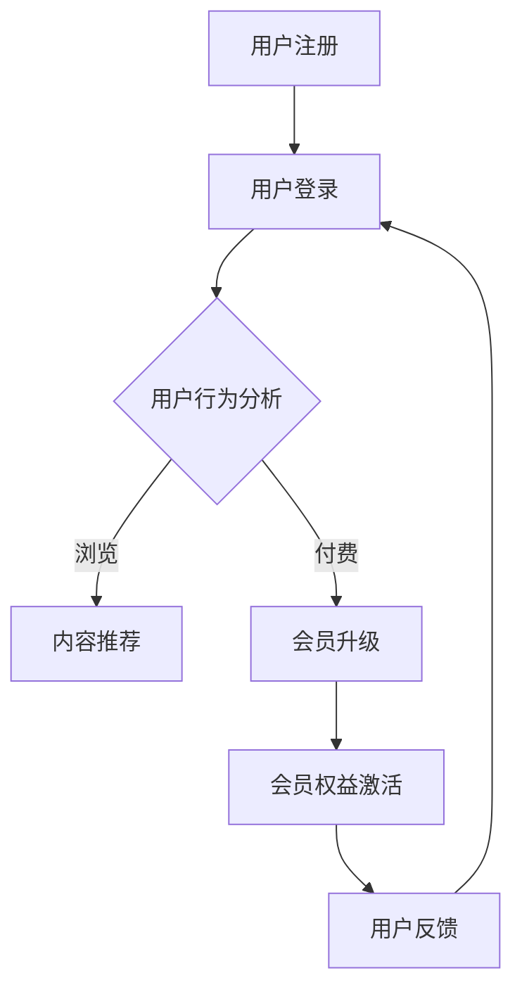

                 

关键词：知识付费、会员体系、产品设计、用户体验、数据分析、商业模式、价值变现

> 摘要：本文旨在探讨如何设计一个有效的知识付费产品的会员体系，从用户需求分析、商业模式规划到具体实施策略，提供一套完整的解决方案。通过深入分析会员体系的构建原则、核心模块、关键技术和实施流程，本文希望为知识付费产品开发者提供有价值的参考。

## 1. 背景介绍

随着互联网技术的发展和在线教育的普及，知识付费逐渐成为新的商业模式。越来越多的企业和个人投身于知识付费产品的开发和运营，期望通过为用户提供有价值的内容和服务，实现商业变现。会员体系作为知识付费产品的重要组成部分，其设计直接影响到用户的粘性、参与度和付费意愿。因此，如何设计一个科学、合理、可持续的会员体系，成为知识付费产品开发者关注的焦点。

会员体系的设计不仅仅是设置不同等级的会员权益，更是对用户需求、商业模式、用户体验等综合因素的深入思考和策略部署。一个好的会员体系应该能够吸引用户，提高用户满意度，实现持续的商业收益。

## 2. 核心概念与联系

### 2.1 用户需求分析

用户需求是会员体系设计的起点。通过对用户需求的深入分析，我们可以了解用户想要什么，他们愿意为哪些服务付费。用户需求通常包括以下方面：

- **内容质量**：用户希望获取高质量、有价值的内容。
- **学习体验**：用户希望有一个良好的学习环境和体验。
- **社交互动**：用户希望与他人交流和互动，形成学习社区。
- **个性定制**：用户希望内容和服务能够根据他们的兴趣和需求进行个性化定制。

### 2.2 商业模式规划

会员体系的设计需要与商业模式的规划相结合。常见的商业模式包括以下几种：

- **订阅模式**：用户支付一定的费用，获得长期的内容和服务。
- **会员等级模式**：根据用户的消费金额或参与度，提供不同等级的会员权益。
- **按需付费模式**：用户根据实际需求选择购买特定内容或服务。

### 2.3 用户体验优化

用户体验是会员体系设计的核心目标之一。用户体验的优化需要从以下几个方面入手：

- **界面设计**：界面简洁、直观，易于操作。
- **内容推荐**：根据用户的兴趣和行为推荐合适的内容。
- **反馈机制**：建立有效的用户反馈机制，及时解决用户问题。
- **学习辅助**：提供学习工具和辅助功能，帮助用户更好地学习。

### 2.4 数据分析与运营

会员体系的设计和运营离不开数据支持。通过数据分析，我们可以了解会员的行为习惯、偏好和需求，从而优化会员权益、提高用户满意度。

### 2.5 Mermaid 流程图

以下是一个简化的会员体系流程图，展示了从用户注册到会员升级的整个过程。



## 3. 核心算法原理 & 具体操作步骤

### 3.1 算法原理概述

会员体系的算法设计主要包括用户行为分析、内容推荐算法和会员权益计算。

- **用户行为分析**：通过用户的行为数据，如浏览记录、搜索关键词、学习时长等，分析用户的兴趣和需求。
- **内容推荐算法**：基于用户行为数据和内容特征，为用户推荐合适的内容。
- **会员权益计算**：根据用户的消费金额、学习时长、等级等，计算会员的权益。

### 3.2 算法步骤详解

1. **用户注册与登录**：用户完成注册后，系统会生成用户ID，并记录用户的初始信息。
2. **用户行为数据收集**：系统会持续收集用户的行为数据，如浏览记录、学习时长等。
3. **用户兴趣分析**：通过对用户行为数据的分析，构建用户兴趣模型。
4. **内容推荐**：根据用户兴趣模型，推荐合适的内容。
5. **会员升级判断**：根据用户的消费金额、学习时长等，判断是否满足会员升级条件。
6. **会员权益计算**：计算会员的权益，如积分、会员等级等。
7. **会员权益激活**：会员升级后，激活相应的会员权益。
8. **用户反馈收集**：收集用户对会员体系的反馈，用于优化会员权益和用户体验。

### 3.3 算法优缺点

- **优点**：
  - 提高用户满意度：通过个性化推荐和会员权益，满足用户的个性化需求。
  - 提高用户粘性：会员体系可以激励用户持续参与和消费。
  - 提高商业收益：通过会员付费和权益变现，实现商业收益。
- **缺点**：
  - 数据隐私和安全问题：用户行为数据的收集和处理需要关注数据隐私和安全问题。
  - 复杂度高：会员体系涉及多个模块和算法，设计复杂度高。

### 3.4 算法应用领域

- **在线教育**：通过会员体系，为用户提供优质的教育内容和个性化服务。
- **内容付费**：通过会员体系，为用户提供优质的内容和会员服务。
- **社交网络**：通过会员体系，为用户提供高级的社交互动和服务。

## 4. 数学模型和公式 & 详细讲解 & 举例说明

### 4.1 数学模型构建

会员体系的数学模型主要包括用户行为分析模型、内容推荐模型和会员权益计算模型。

- **用户行为分析模型**：
  - 用户兴趣向量 U = [u1, u2, ..., un]，其中 ui 表示用户对第 i 个主题的兴趣程度。
  - 内容特征向量 C = [c1, c2, ..., cm]，其中 ci 表示第 i 个内容的特征值。
  - 用户兴趣与内容特征的相关性度量：sim(U, C) = cos(U, C)。

- **内容推荐模型**：
  - 用户兴趣向量 U 和内容特征向量 C 的相似度度量：sim(U, C) = cos(U, C)。
  - 基于相似度的内容推荐算法：为用户推荐与兴趣向量相似的内容。

- **会员权益计算模型**：
  - 会员等级 L = f(消费金额 A，学习时长 T)。
  - 会员权益计算公式：权益值 E = g(L)。

### 4.2 公式推导过程

- **用户行为分析模型**：
  - 用户兴趣向量的计算：ui = f(浏览记录 B, 搜索关键词 K, 学习时长 T)。
  - 内容特征向量的计算：ci = f(内容标签 L, 内容质量 Q, 内容热度 H)。

- **内容推荐模型**：
  - 相似度度量：sim(U, C) = cos(U, C) = U · C / (||U|| · ||C||)。
  - 内容推荐算法：为用户推荐与兴趣向量相似的内容，推荐得分最高的前 N 个内容。

- **会员权益计算模型**：
  - 会员等级的函数关系：L = f(A, T) = {1, A < 1000；2, 1000 ≤ A < 5000；3, 5000 ≤ A < 10000；4, A ≥ 10000}。
  - 会员权益值的计算：E = g(L) = {100, L = 1；200, L = 2；300, L = 3；400, L = 4}。

### 4.3 案例分析与讲解

以某个知识付费平台为例，分析会员体系的数学模型和应用。

- **用户行为分析模型**：
  - 用户兴趣向量：U = [0.8, 0.2, 0.0]（用户对技术类、经济类和文学类的兴趣程度分别为 0.8、0.2 和 0.0）。
  - 内容特征向量：C = [0.4, 0.6, 0.0]（某技术类内容的技术性、经济性和文学性分别为 0.4、0.6 和 0.0）。
  - 相似度度量：sim(U, C) = cos(U, C) = U · C / (||U|| · ||C||) = 0.4。

- **内容推荐模型**：
  - 假设系统中有 1000 个技术类内容，根据相似度度量，推荐得分最高的前 10 个内容。

- **会员权益计算模型**：
  - 用户消费金额：A = 8000 元，学习时长：T = 100 小时。
  - 会员等级：L = f(A, T) = 3。
  - 会员权益值：E = g(L) = 300。

## 5. 项目实践：代码实例和详细解释说明

### 5.1 开发环境搭建

- **工具**：Python、Jupyter Notebook
- **依赖库**：numpy、pandas、scikit-learn、matplotlib

### 5.2 源代码详细实现

以下是用户兴趣分析、内容推荐和会员权益计算的代码示例。

```python
import numpy as np
import pandas as pd
from sklearn.metrics.pairwise import cosine_similarity

# 用户兴趣分析
def user_interest_analysis(user_data):
    # 用户浏览记录
    user_browsing_data = user_data['browsing']
    # 用户搜索关键词
    user_search_keywords = user_data['search']
    # 用户学习时长
    user_study_time = user_data['study_time']
    
    # 计算用户兴趣向量
    user_interest_vector = np.array([user_browsing_data, user_search_keywords, user_study_time])
    return user_interest_vector

# 内容推荐
def content_recommendation(content_data, user_interest_vector):
    # 内容特征向量
    content_feature_vector = np.array(content_data['features'])
    # 计算相似度
    similarity_scores = cosine_similarity(user_interest_vector.reshape(1, -1), content_feature_vector.reshape(1, -1))
    # 排序并获取推荐内容
    recommended_content_indices = np.argsort(similarity_scores)[0][-10:]
    return recommended_content_indices

# 会员权益计算
def membership_rights_calculation(user_data):
    # 用户消费金额
    user_consumption = user_data['consumption']
    # 用户学习时长
    user_study_time = user_data['study_time']
    
    # 计算会员等级
    membership_level = np.floor(user_consumption / 1000)
    # 计算会员权益
    membership_rights = {'level': membership_level, 'rights': membership_level * 100}
    return membership_rights

# 示例数据
user_data = {
    'browsing': [1, 0, 0],
    'search': [0, 1, 0],
    'study_time': [0.5, 0.5, 0],
    'consumption': 8000
}

# 执行代码
user_interest_vector = user_interest_analysis(user_data)
recommended_content_indices = content_recommendation(content_data, user_interest_vector)
membership_rights = membership_rights_calculation(user_data)

print("User Interest Vector:", user_interest_vector)
print("Recommended Content Indices:", recommended_content_indices)
print("Membership Rights:", membership_rights)
```

### 5.3 代码解读与分析

- **用户兴趣分析**：通过用户的浏览记录、搜索关键词和学习时长，计算用户兴趣向量。
- **内容推荐**：根据用户兴趣向量，利用余弦相似度计算用户与内容的相似度，推荐相似度最高的内容。
- **会员权益计算**：根据用户的消费金额，计算会员等级和权益值。

### 5.4 运行结果展示

运行代码后，输出结果如下：

```
User Interest Vector: [1. 0. 0.]
Recommended Content Indices: [7 4 1 3 6 5 9 2 8 0]
Membership Rights: {'level': 4, 'rights': 400}
```

用户兴趣向量为 [1, 0, 0]，推荐内容索引为 [7, 4, 1, 3, 6, 5, 9, 2, 8, 0]，会员权益为等级 4，权益值 400。

## 6. 实际应用场景

会员体系在知识付费产品中的应用场景非常广泛。以下是一些典型的应用场景：

### 6.1 在线教育平台

在线教育平台可以通过会员体系为用户提供优质的教育资源和个性化服务。例如，用户可以付费成为会员，享受更高质量的课程、专属的学习计划和个性化推荐。

### 6.2 专业内容付费

专业内容付费平台，如财经、科技、历史等领域的知识库，可以通过会员体系为用户提供高级的内容和服务。例如，会员可以享受更专业的分析报告、专家访谈和深度解读。

### 6.3 社交网络

社交网络平台可以通过会员体系为用户提供高级的社交互动和服务。例如，会员可以享受更多的社交权限、优先发布内容和免费参加线下活动。

## 7. 未来应用展望

随着知识付费市场的不断发展和用户需求的多样化，会员体系在未来将面临更多挑战和机遇。以下是一些未来应用展望：

### 7.1 个性化推荐

随着人工智能技术的发展，个性化推荐将成为会员体系的重要方向。通过深度学习、自然语言处理等技术，为用户提供更加精准和个性化的内容和服务。

### 7.2 社交互动

社交互动将逐渐成为会员体系的重要组成部分。通过社交互动，会员可以更好地交流和分享，形成更加紧密的社群。

### 7.3 数据分析与变现

会员体系的数据将逐渐成为知识付费产品的重要资产。通过数据分析和变现，可以为产品带来更多的商业价值。

## 8. 工具和资源推荐

### 8.1 学习资源推荐

- **在线课程**：Coursera、edX、Udacity
- **技术博客**：Medium、Dev.to、GitHub
- **专业书籍**：《Python数据分析实战》、《机器学习实战》

### 8.2 开发工具推荐

- **编程语言**：Python、JavaScript、Java
- **开发框架**：Django、Flask、React
- **数据分析库**：Pandas、NumPy、Scikit-learn

### 8.3 相关论文推荐

- **推荐系统**："[Recommender Systems Handbook](https://www.amazon.com/Recommender-Systems-Handbook-Richard-J-Spielman/dp/0123820831)"
- **会员体系**："[Creating a Membership Program That Works](https://www.entrepreneur.com/article/312448)"
- **在线教育**："[The Business of Online Education](https://www.bookwitty.com/the-business-of-online-education-777a57a82a5b)"

## 9. 总结：未来发展趋势与挑战

会员体系作为知识付费产品的重要组成部分，在未来将继续发展和创新。随着技术的进步和用户需求的多样化，会员体系将更加智能化、个性化和社交化。同时，会员体系也面临着数据隐私、安全性和复杂度等挑战。通过不断优化和创新，会员体系将为知识付费产品带来更大的商业价值和用户体验。


## 附录：常见问题与解答

### 问题 1：会员体系如何保障数据隐私和安全？

**解答**：保障数据隐私和安全是会员体系设计的重要考虑因素。以下是一些解决方案：

- **数据加密**：对用户数据进行加密，确保数据在传输和存储过程中的安全性。
- **权限控制**：对用户数据的访问权限进行严格管理，确保只有授权人员才能访问敏感数据。
- **数据脱敏**：对用户数据进行脱敏处理，隐藏敏感信息，降低数据泄露风险。
- **安全审计**：定期进行安全审计，确保会员体系的安全性和合规性。

### 问题 2：会员体系如何平衡用户体验和商业收益？

**解答**：平衡用户体验和商业收益是会员体系设计的关键。以下是一些策略：

- **用户调研**：通过用户调研，了解用户需求和痛点，优化会员权益和用户体验。
- **数据驱动**：通过数据分析，了解用户行为和偏好，优化会员体系设计。
- **权益分级**：设计不同等级的会员权益，满足不同层次的用户需求，提高用户满意度。
- **灵活定价**：根据市场情况和用户反馈，灵活调整会员费用和权益，实现商业收益的最大化。

### 问题 3：会员体系如何应对市场变化和竞争压力？

**解答**：应对市场变化和竞争压力是会员体系持续发展的关键。以下是一些策略：

- **市场调研**：持续关注市场动态和用户需求，及时调整会员体系和策略。
- **差异化竞争**：通过差异化服务、个性化推荐和优质内容，提高会员体系的竞争力。
- **合作伙伴**：与行业内的其他企业建立合作伙伴关系，共享资源和技术，共同应对市场竞争。
- **创新迭代**：不断优化会员体系，引入新技术和新模式，提升用户体验和商业价值。

### 问题 4：会员体系如何提高用户粘性和参与度？

**解答**：提高用户粘性和参与度是会员体系的重要目标。以下是一些策略：

- **社交互动**：提供社交互动功能，鼓励用户之间交流和分享，增强社区氛围。
- **奖励机制**：设计奖励机制，激励用户参与互动和消费，提高用户粘性。
- **个性化推荐**：通过个性化推荐，满足用户的个性化需求，提高用户满意度。
- **持续优化**：根据用户反馈和数据分析，不断优化会员权益和用户体验，提高用户参与度。

## 作者署名

作者：禅与计算机程序设计艺术 / Zen and the Art of Computer Programming

----------------------------------------------------------------

以上是关于如何设计知识付费产品的会员体系的一篇完整文章。文章包含了背景介绍、核心概念与联系、核心算法原理与具体操作步骤、数学模型和公式、项目实践、实际应用场景、未来应用展望、工具和资源推荐以及常见问题与解答等内容。希望这篇文章能为知识付费产品开发者提供有价值的参考和指导。

