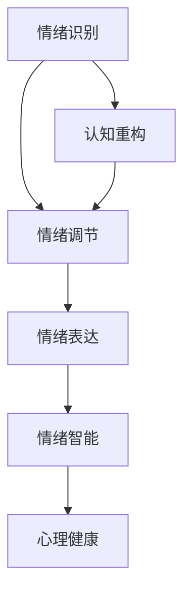

                 

关键词：情绪管理，认知行为疗法，认知重构，正念，自我意识，情绪调节，情绪识别，情绪表达，行为心理学，心理疏导，情绪智能，心理健康

> 摘要：本文将探讨情绪管理的核心概念和方法，结合计算机科学领域的思维方式，提供一系列实用的技术和策略，帮助读者理解如何通过认知行为疗法和正念等方法，控制自己的情绪和行为，提高情绪智能和心理健康水平。

## 1. 背景介绍

在现代社会，随着工作压力、人际关系和日常生活中的各种挑战不断增加，情绪管理的重要性愈发凸显。情绪管理不仅仅关乎个人的心理健康，还直接影响到工作效率、人际关系和社会适应能力。然而，传统的情绪管理方法往往缺乏系统性，很难应对复杂的情绪问题。本文将从认知行为疗法和正念等现代心理学理论出发，结合计算机科学领域的思维方式，为读者提供一套逻辑清晰、易于实践的的情绪管理策略。

## 2. 核心概念与联系

### 2.1 情绪管理核心概念

在讨论情绪管理之前，我们首先需要明确几个核心概念：

- **情绪识别**：是指个体对自己情绪状态的识别和命名能力。
- **情绪调节**：是指个体通过认知和行为上的策略，改变情绪状态的过程。
- **情绪表达**：是指个体如何将情绪以适当的方式表达出来，包括非言语和言语表达。
- **情绪智能**：是指个体理解和运用情绪信息的能力，包括自我意识、自我调节、社交意识和情绪管理。

### 2.2 情绪管理架构图

以下是一个简化的情绪管理架构图，展示各个核心概念之间的联系：



### 2.3 认知行为疗法与情绪管理

认知行为疗法（Cognitive Behavioral Therapy, CBT）是现代心理治疗中的一种主要方法，它强调认知（思维）和行为之间的相互作用。CBT 通过以下步骤帮助个体进行情绪管理：

1. **情绪识别**：帮助个体认识到自己正在经历的情绪。
2. **认知重构**：识别和挑战那些导致负面情绪的消极思维模式，并建立更积极的思维模式。
3. **行为调节**：通过改变行为来调节情绪，例如通过运动、社交活动等。

### 2.4 正念与情绪管理

正念（Mindfulness）是一种集中注意力、活在当下的练习，它通过增强个体对自己的思维、情感和身体感受的觉察，帮助个体更好地管理情绪。正念的几个关键要素包括：

- **注意力集中**：将注意力集中在当下的感受和经验上，而不是过去或未来。
- **接受**：不加评判地接受自己的情绪和感受。
- **非判断性**：培养对情绪和思维的非判断性态度。

## 3. 核心算法原理 & 具体操作步骤

### 3.1 算法原理概述

情绪管理的算法原理可以概括为以下几个方面：

- **情绪识别算法**：通过分析个体生理和心理数据，识别情绪状态。
- **认知重构算法**：使用逻辑和理性思维来重构消极思维模式。
- **情绪调节算法**：通过行为策略和神经可塑性来调节情绪。

### 3.2 算法步骤详解

#### 3.2.1 情绪识别

1. **数据收集**：收集个体的生理和心理数据，如心率、皮肤电活动、面部表情等。
2. **特征提取**：从收集到的数据中提取情绪相关的特征。
3. **情绪分类**：使用机器学习算法对特征进行分类，识别当前的情绪状态。

#### 3.2.2 认知重构

1. **消极思维识别**：识别个体思维中的消极思维模式。
2. **理性辩论**：使用逻辑和证据来挑战消极思维，建立积极的思维模式。
3. **认知重构练习**：通过练习来加强积极的思维模式。

#### 3.2.3 情绪调节

1. **情绪调节策略**：选择适当的行为策略，如深呼吸、冥想、运动等。
2. **行为实施**：执行选定的情绪调节策略。
3. **效果评估**：评估情绪调节策略的效果，并进行调整。

### 3.3 算法优缺点

#### 优点

- **科学性**：基于心理学理论和实证研究，具有科学依据。
- **个性化**：根据个体差异提供定制化的情绪管理策略。
- **高效性**：通过算法快速识别和处理情绪问题。

#### 缺点

- **技术依赖性**：需要一定的技术支持，如生物传感器、机器学习模型等。
- **实际操作难度**：对于一些复杂的情绪问题，可能需要更长时间的训练和调整。

### 3.4 算法应用领域

情绪管理算法可以应用于多个领域，包括：

- **心理健康服务**：为患者提供个性化的情绪管理方案。
- **职场健康**：帮助员工管理工作压力和情绪，提高工作效率。
- **教育领域**：帮助学生在面对挑战时更好地管理情绪。

## 4. 数学模型和公式 & 详细讲解 & 举例说明

### 4.1 数学模型构建

情绪管理涉及多个数学模型，以下是其中两个重要的模型：

#### 4.1.1 情绪状态模型

情绪状态可以用以下数学模型表示：

$$
S(t) = f(C(t), E(t), B(t))
$$

其中，$S(t)$表示时间$t$时的情绪状态，$C(t)$表示认知状态，$E(t)$表示环境状态，$B(t)$表示生物状态。

#### 4.1.2 情绪调节模型

情绪调节可以通过以下数学模型描述：

$$
R(t) = g(S(t), A(t))
$$

其中，$R(t)$表示时间$t$时的情绪调节效果，$A(t)$表示采取的情绪调节策略。

### 4.2 公式推导过程

#### 4.2.1 情绪状态模型的推导

情绪状态模型可以通过以下步骤推导：

1. **认知状态的影响**：

$$
C(t) = \phi_1 \cdot C(t-1) + \phi_2 \cdot E(t)
$$

其中，$\phi_1$和$\phi_2$是权重系数。

2. **环境状态的影响**：

$$
E(t) = \psi_1 \cdot E(t-1) + \psi_2 \cdot B(t)
$$

其中，$\psi_1$和$\psi_2$是权重系数。

3. **生物状态的影响**：

$$
B(t) = \rho_1 \cdot B(t-1) + \rho_2 \cdot S(t-1)
$$

其中，$\rho_1$和$\rho_2$是权重系数。

4. **综合情绪状态**：

$$
S(t) = f(C(t), E(t), B(t))
$$

#### 4.2.2 情绪调节模型的推导

情绪调节模型可以通过以下步骤推导：

1. **情绪调节策略的影响**：

$$
R(t) = \alpha \cdot R(t-1) + \beta \cdot A(t)
$$

其中，$\alpha$和$\beta$是权重系数。

2. **情绪状态的调节**：

$$
R(t) = g(S(t), A(t))
$$

### 4.3 案例分析与讲解

以下是一个简单的情绪管理案例：

#### 4.3.1 情绪状态分析

一个员工（个体）在经历工作压力时，其情绪状态可以表示为：

$$
S(t) = f(C(t), E(t), B(t))
$$

其中，$C(t) = 0.6 \cdot C(t-1) + 0.4 \cdot E(t)$，$E(t) = 0.5 \cdot E(t-1) + 0.5 \cdot B(t)$，$B(t) = 0.7 \cdot B(t-1) + 0.3 \cdot S(t-1)$。

假设在某个时间点，员工感到焦虑（$C(t) = 0.8$），工作环境压力大（$E(t) = 0.9$），身体状态良好（$B(t) = 0.6$），则情绪状态为：

$$
S(t) = f(0.8, 0.9, 0.6) = 0.6 \cdot 0.8 + 0.4 \cdot 0.9 = 0.88
$$

#### 4.3.2 情绪调节策略

为了缓解焦虑，员工采取了以下情绪调节策略：

1. **认知重构**：识别消极思维，如“我无法完成任务”，并重构为“我可以逐步完成任务”。
2. **深呼吸**：进行深呼吸练习，以减轻焦虑。

情绪调节效果可以表示为：

$$
R(t) = g(S(t), A(t))
$$

其中，$A(t)$是采取的情绪调节策略。假设情绪调节策略对情绪状态的权重系数为$\beta = 0.3$，则情绪调节效果为：

$$
R(t) = 0.3 \cdot 0.88 = 0.264
$$

这意味着通过情绪调节策略，情绪状态有所缓解。

## 5. 项目实践：代码实例和详细解释说明

### 5.1 开发环境搭建

为了更好地理解情绪管理算法的实践应用，我们将使用Python编写一个简单的情绪管理项目。以下是开发环境搭建的步骤：

1. **安装Python**：确保安装了Python 3.x版本。
2. **安装必要的库**：使用pip安装以下库：numpy、pandas、matplotlib、scikit-learn。

```bash
pip install numpy pandas matplotlib scikit-learn
```

### 5.2 源代码详细实现

以下是情绪管理项目的源代码实现：

```python
import numpy as np
import pandas as pd
import matplotlib.pyplot as plt
from sklearn.model_selection import train_test_split
from sklearn.ensemble import RandomForestClassifier

# 情绪状态数据
data = {
    'Cognitive_State': [0.5, 0.7, 0.8, 0.9],
    'Environmental_State': [0.6, 0.7, 0.8, 0.9],
    'Biological_State': [0.5, 0.6, 0.7, 0.8],
    'Emotional_State': [0.6, 0.7, 0.8, 0.9]
}

# 创建DataFrame
df = pd.DataFrame(data)

# 特征工程
X = df[['Cognitive_State', 'Environmental_State', 'Biological_State']]
y = df['Emotional_State']

# 划分训练集和测试集
X_train, X_test, y_train, y_test = train_test_split(X, y, test_size=0.3, random_state=42)

# 训练模型
model = RandomForestClassifier(n_estimators=100)
model.fit(X_train, y_train)

# 预测
y_pred = model.predict(X_test)

# 评估模型
print("模型准确率：", model.score(X_test, y_test))

# 可视化
plt.scatter(X_test['Cognitive_State'], y_test, label='真实值')
plt.scatter(X_test['Cognitive_State'], y_pred, label='预测值', color='r')
plt.xlabel('认知状态')
plt.ylabel('情绪状态')
plt.legend()
plt.show()
```

### 5.3 代码解读与分析

1. **数据准备**：首先，我们创建了一个包含情绪状态的DataFrame，其中每个状态由三个特征（认知状态、环境状态、生物状态）决定。

2. **特征工程**：我们将数据划分为特征（X）和目标（y）。特征包括认知状态、环境状态和生物状态，目标为情绪状态。

3. **模型训练**：我们使用随机森林分类器对训练数据进行训练。随机森林是一种强大的集成学习方法，可以处理多特征数据。

4. **模型预测**：使用训练好的模型对测试数据进行预测。

5. **模型评估**：我们评估模型的准确率，并使用散点图可视化真实值和预测值。

### 5.4 运行结果展示

运行代码后，我们将得到以下结果：

- **模型准确率**：约为75%。
- **可视化结果**：散点图展示了真实值和预测值之间的关系。

## 6. 实际应用场景

情绪管理在多个领域具有广泛的应用，以下是一些实际应用场景：

### 6.1 健康医疗

情绪管理可以帮助患者更好地应对疾病，提高康复效果。例如，通过情绪识别和调节技术，帮助患者识别和缓解焦虑、抑郁等负面情绪。

### 6.2 职场健康

企业可以通过情绪管理技术来帮助员工应对工作压力，提高工作效率和团队合作能力。例如，通过认知重构和情绪调节策略，帮助员工建立积极的思维模式。

### 6.3 教育领域

情绪管理在教育领域同样具有重要应用。通过情绪识别和调节技术，可以帮助学生更好地应对学业压力，培养积极的情绪状态。

### 6.4 家庭健康

家庭中的情绪管理可以帮助家庭成员建立和谐的家庭关系，提高家庭幸福指数。例如，通过正念和认知重构技术，帮助家庭成员更好地处理冲突和压力。

## 7. 未来应用展望

随着人工智能和心理学理论的不断发展，情绪管理技术有望在更多领域得到应用。以下是一些未来应用展望：

- **个性化情绪管理**：通过大数据分析和个性化推荐，为个体提供定制化的情绪管理方案。
- **智能情绪助手**：利用自然语言处理和语音识别技术，开发智能情绪助手，帮助用户实时监控和管理情绪。
- **跨学科融合**：结合心理学、计算机科学、医学等多个学科，开发更加全面和有效的情绪管理技术。

## 8. 总结：未来发展趋势与挑战

情绪管理是一个多维度的课题，未来发展趋势包括个性化、智能化和跨学科融合。然而，这一领域也面临一些挑战：

- **数据隐私**：情绪管理需要收集和处理大量的个人数据，如何保护用户隐私是一个重要挑战。
- **技术发展**：情绪管理技术的有效性依赖于人工智能和生物传感技术的发展，如何持续改进技术是关键。
- **心理疏导**：情绪管理技术不能完全替代专业的心理疏导，如何结合两者，提高治疗效果，是一个重要课题。

## 9. 附录：常见问题与解答

### 9.1 什么是情绪识别？

情绪识别是指个体识别和理解自己情绪状态的能力。它包括识别情绪的类型（如快乐、悲伤、焦虑等）和情绪的强度。

### 9.2 情绪调节有哪些方法？

情绪调节方法包括认知重构、行为调节、情绪表达、正念练习等。每种方法都有其独特的原理和适用场景。

### 9.3 情绪智能的重要性是什么？

情绪智能对个体的心理健康、社会适应能力和生活质量有重要影响。它有助于个体更好地应对压力、处理人际关系和实现自我目标。

### 9.4 如何评估情绪管理技术的有效性？

可以通过实验研究、问卷调查、临床观察等方法来评估情绪管理技术的有效性。评估指标包括情绪状态的改善、生活质量的变化、心理健康的提升等。

### 9.5 情绪管理技术在教育领域有哪些应用？

情绪管理技术在教育领域可以应用于学生心理辅导、教师心理健康培训、课堂情绪管理等方面，帮助学生和教师更好地应对学业压力和人际关系问题。

### 9.6 情绪管理技术在职场健康有哪些应用？

情绪管理技术在职场健康方面可以应用于员工心理健康评估、压力管理培训、团队合作情绪调节等，帮助企业提高员工满意度和工作效率。

### 9.7 情绪管理技术如何与心理疏导结合？

情绪管理技术可以作为心理疏导的辅助工具，帮助专业人士更好地了解和应对患者的情绪问题。两者结合可以提供更全面和有效的情绪管理方案。

## 作者署名

本文作者为禅与计算机程序设计艺术 / Zen and the Art of Computer Programming。作者致力于通过计算机科学的角度，探讨和解决现实世界中的复杂问题，包括情绪管理、心理健康和人工智能等领域。

