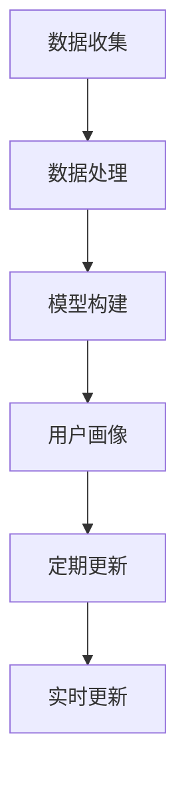

                 

 用户画像是一种重要的数据分析技术，它通过收集和分析用户的属性、行为、偏好等信息，构建出一个全面的用户模型。这不仅能帮助企业更好地理解用户需求，还能为其提供个性化的服务和推荐。然而，用户画像并不是一成不变的，随着时间的推移，用户的行为和偏好可能会发生变化，这就需要我们进行有效的用户画像更新。本文将探讨如何进行有效的用户画像更新，以帮助企业保持对用户的准确理解。

## 关键词

- 用户画像
- 数据分析
- 行为分析
- 偏好分析
- 个性化服务
- 数据更新

## 摘要

本文将首先介绍用户画像的基本概念和重要性，然后讨论用户画像更新面临的挑战，接着探讨有效的用户画像更新方法，包括数据收集、数据处理和模型更新。最后，我们将讨论用户画像更新在实际应用中的挑战和未来发展趋势。

## 1. 背景介绍

随着互联网的普及和大数据技术的发展，用户画像作为数据分析的一种重要手段，逐渐引起了企业的关注。用户画像不仅可以帮助企业了解用户的基本信息，如年龄、性别、地理位置等，还可以通过分析用户的在线行为，如浏览历史、购买记录、评论等，深入了解用户的兴趣、需求和偏好。

用户画像的主要应用场景包括：

- **个性化推荐**：根据用户的兴趣和行为，推荐可能感兴趣的商品或内容。
- **市场细分**：通过分析用户的不同特征，将市场划分为不同的群体，针对不同的用户群体制定不同的营销策略。
- **客户关系管理**：通过了解用户的偏好和行为，提供个性化的服务和体验，增强用户忠诚度。
- **风险控制**：通过分析用户的行为和偏好，识别潜在的风险用户，采取相应的风险控制措施。

然而，用户画像并不是静态的，用户的兴趣和行为会随着时间和环境的变化而发生变化。这就需要我们不断地更新用户画像，以保持对企业用户的准确理解。

### 用户画像的基本概念

用户画像是指通过对用户的数据进行分析和处理，构建出一个反映用户特征的模型。用户画像通常包括以下几个方面的内容：

- **基本信息**：包括用户的年龄、性别、地理位置、职业等基本信息。
- **行为数据**：包括用户的在线行为，如浏览历史、购买记录、评论等。
- **偏好数据**：包括用户的兴趣、偏好，如喜欢什么类型的商品、喜欢哪个品牌的商品等。
- **社会属性**：包括用户的社会属性，如所属行业、收入水平、教育程度等。

这些数据可以来自不同的来源，如用户的注册信息、浏览日志、购买记录、社交媒体等。通过对这些数据进行整合和分析，我们可以构建出一个全面的用户画像。

### 用户画像的重要性

用户画像对于企业来说具有重要的价值。首先，用户画像可以帮助企业更好地理解用户的需求和偏好，从而提供个性化的服务和推荐。例如，电商企业可以根据用户的购买记录和偏好，推荐可能感兴趣的商品。其次，用户画像可以帮助企业进行市场细分，针对不同的用户群体制定不同的营销策略，提高营销效果。此外，用户画像还可以用于客户关系管理，通过了解用户的偏好和行为，提供个性化的服务和体验，增强用户忠诚度。最后，用户画像还可以用于风险控制，通过分析用户的行为和偏好，识别潜在的风险用户，采取相应的风险控制措施。

## 2. 核心概念与联系

### 2.1 用户画像的构建流程

用户画像的构建流程主要包括数据收集、数据处理和模型构建三个阶段。首先，通过数据收集，获取用户的各项属性和行为数据。然后，通过数据处理，对收集到的数据进行清洗、整合和分析，提取出用户的特征信息。最后，通过模型构建，将这些特征信息转化为用户画像。

### 2.2 用户画像的更新机制

用户画像的更新机制主要包括定期更新和实时更新两种方式。定期更新是指在一定时间周期内，对用户画像进行重新构建和更新。实时更新则是在用户行为发生时，实时对用户画像进行更新。

### 2.3 用户画像的更新方法

用户画像的更新方法主要包括以下几种：

- **增量更新**：仅更新用户画像中的新数据，对旧数据进行保留。
- **全量更新**：重新构建用户画像，覆盖旧的数据。
- **增量+全量更新**：先进行增量更新，然后根据需要进行全量更新。

### 2.4 用户画像的更新挑战

用户画像的更新面临以下挑战：

- **数据量庞大**：随着用户数量的增加，数据量也会呈指数级增长，对处理速度和存储空间提出了更高的要求。
- **数据质量问题**：数据源多样，数据质量参差不齐，需要处理数据缺失、噪声、重复等问题。
- **隐私保护**：用户画像涉及到用户的隐私信息，需要确保用户数据的安全性和隐私性。

### 2.5 用户画像的更新流程图

以下是一个简化的用户画像更新流程图，展示了用户画像的构建和更新过程。



## 3. 核心算法原理 & 具体操作步骤

### 3.1 算法原理概述

用户画像更新主要依赖于机器学习和数据挖掘技术。机器学习算法通过对历史数据的分析和学习，提取出用户的特征，构建出用户画像。数据挖掘技术则用于分析用户的行为和偏好，更新和优化用户画像。

### 3.2 算法步骤详解

用户画像更新的具体步骤如下：

1. **数据收集**：收集用户的各项属性和行为数据，包括基本信息、行为数据、偏好数据等。
2. **数据处理**：对收集到的数据进行清洗、整合和分析，提取出用户的特征信息。
3. **特征选择**：根据业务需求和数据特性，选择对用户画像构建有重要影响的特征。
4. **模型训练**：使用机器学习算法，如聚类、分类、协同过滤等，对用户特征进行训练，构建出用户画像模型。
5. **模型评估**：对训练好的模型进行评估，确保模型的有效性和准确性。
6. **用户画像构建**：将训练好的模型应用于新用户数据，构建出新的用户画像。
7. **用户画像更新**：根据新用户画像，更新和优化现有用户画像。

### 3.3 算法优缺点

- **优点**：
  - 高效：机器学习算法可以快速处理大量数据，提高处理效率。
  - 准确：通过数据分析和模型训练，可以更准确地提取出用户的特征，构建出更准确的用户画像。
  - 个性化：根据用户的行为和偏好，可以提供个性化的服务和推荐。

- **缺点**：
  - 数据依赖：用户画像的质量很大程度上取决于数据的质量和数量，数据不足或质量差会影响用户画像的准确性。
  - 隐私风险：用户画像涉及到用户的隐私信息，需要确保用户数据的安全性和隐私性。

### 3.4 算法应用领域

用户画像更新算法广泛应用于多个领域，如电商、金融、电信、教育等。以下是一些具体的应用案例：

- **电商**：通过用户画像，可以为用户提供个性化的商品推荐，提高用户购买意愿。
- **金融**：通过用户画像，可以识别潜在的客户风险，为银行和金融机构提供风险控制支持。
- **电信**：通过用户画像，可以优化网络资源配置，提高网络服务质量。
- **教育**：通过用户画像，可以为学生提供个性化的学习推荐，提高学习效果。

## 4. 数学模型和公式 & 详细讲解 & 举例说明

### 4.1 数学模型构建

用户画像的构建主要依赖于机器学习算法，其中常用的算法包括聚类、分类和协同过滤等。以下是这些算法的基本数学模型：

- **聚类算法**：通过将相似的用户分组，构建出用户画像。常用的聚类算法有K-Means、DBSCAN等。
- **分类算法**：通过对用户特征进行分类，构建出用户画像。常用的分类算法有决策树、支持向量机等。
- **协同过滤算法**：通过分析用户的行为和偏好，构建出用户画像。常用的协同过滤算法有基于用户的协同过滤和基于物品的协同过滤。

### 4.2 公式推导过程

以K-Means算法为例，其基本公式推导如下：

1. 初始化：随机选择K个中心点，作为聚类中心的初始值。
2. 分配：将每个用户数据分配到最近的聚类中心。
3. 更新：重新计算每个聚类中心的位置，作为新的聚类中心。
4. 循环：重复步骤2和3，直到聚类中心的位置不再变化。

### 4.3 案例分析与讲解

以一个电商平台的用户画像更新为例，说明用户画像的构建和更新过程。

1. **数据收集**：收集用户的基本信息（如年龄、性别、地理位置等）和行为数据（如浏览历史、购买记录等）。
2. **数据处理**：对收集到的数据进行清洗、去重和标准化处理，提取出用户的特征信息。
3. **特征选择**：根据业务需求和数据特性，选择对用户画像构建有重要影响的特征，如年龄、购买频率、购买金额等。
4. **模型训练**：使用K-Means算法，对用户特征进行聚类，构建出用户画像。
5. **模型评估**：对训练好的模型进行评估，确保模型的有效性和准确性。
6. **用户画像构建**：将训练好的模型应用于新用户数据，构建出新的用户画像。
7. **用户画像更新**：根据新用户画像，更新和优化现有用户画像。

## 5. 项目实践：代码实例和详细解释说明

### 5.1 开发环境搭建

1. 安装Python环境：在Windows或Linux系统中安装Python，版本建议为3.8或以上。
2. 安装必要的库：使用pip命令安装numpy、pandas、matplotlib等库。

### 5.2 源代码详细实现

以下是一个简单的用户画像更新代码示例，使用了Python的pandas库和sklearn库。

```python
import pandas as pd
from sklearn.cluster import KMeans
from sklearn.preprocessing import StandardScaler

# 数据加载
data = pd.read_csv('user_data.csv')

# 特征选择
features = ['age', 'purchase_frequency', 'average_purchase_amount']

# 数据标准化
scaler = StandardScaler()
data[features] = scaler.fit_transform(data[features])

# K-Means聚类
kmeans = KMeans(n_clusters=5, random_state=0)
kmeans.fit(data[features])

# 用户画像更新
data['cluster'] = kmeans.labels_
data.to_csv('updated_user_data.csv', index=False)
```

### 5.3 代码解读与分析

1. **数据加载**：使用pandas库的read_csv函数，从CSV文件中加载用户数据。
2. **特征选择**：根据业务需求，选择对用户画像构建有重要影响的特征。
3. **数据标准化**：使用StandardScaler库，对特征数据进行标准化处理，提高聚类效果。
4. **K-Means聚类**：使用sklearn库的KMeans类，对用户特征进行聚类，构建用户画像。
5. **用户画像更新**：将聚类结果更新到原始数据中，生成新的用户画像。

### 5.4 运行结果展示

运行上述代码后，会在当前目录生成一个名为`updated_user_data.csv`的文件，其中包含了更新后的用户画像。可以使用pandas库的to_csv函数将更新后的用户画像保存为CSV文件。

## 6. 实际应用场景

### 6.1 电商

在电商领域，用户画像更新主要用于个性化推荐。通过不断更新用户画像，电商企业可以更准确地了解用户的兴趣和行为，从而提供个性化的商品推荐，提高用户购买意愿。

### 6.2 金融

在金融领域，用户画像更新主要用于风险控制。通过分析用户的行为和偏好，金融机构可以识别潜在的风险用户，采取相应的风险控制措施，降低信贷风险。

### 6.3 电信

在电信领域，用户画像更新主要用于网络优化和客户服务。通过分析用户的行为和偏好，电信企业可以优化网络资源配置，提高网络服务质量，同时为用户提供个性化的服务和推荐。

### 6.4 教育

在教育领域，用户画像更新主要用于个性化学习推荐。通过分析学生的学习行为和偏好，教育机构可以为学生提供个性化的学习推荐，提高学习效果。

## 7. 工具和资源推荐

### 7.1 学习资源推荐

- **《Python数据分析基础》**：适合初学者，介绍了Python在数据分析中的应用。
- **《机器学习实战》**：详细介绍了多种机器学习算法的原理和应用。

### 7.2 开发工具推荐

- **Jupyter Notebook**：适合进行数据分析和机器学习实验，具有强大的交互性。
- **PyCharm**：一款功能强大的Python集成开发环境，适合进行项目开发。

### 7.3 相关论文推荐

- **《基于用户行为的电商推荐系统研究》**：探讨了一种基于用户行为的电商推荐系统。
- **《机器学习在金融风险管理中的应用》**：介绍了几种机器学习算法在金融风险管理中的应用。

## 8. 总结：未来发展趋势与挑战

### 8.1 研究成果总结

用户画像技术在过去几年取得了显著的研究成果，主要包括以下几个方面：

- **算法改进**：机器学习算法的不断发展，提高了用户画像的准确性和效率。
- **数据挖掘技术**：数据挖掘技术的应用，使得用户画像的构建更加全面和准确。
- **应用场景扩展**：用户画像技术逐渐应用于更多的领域，如金融、电信、教育等。

### 8.2 未来发展趋势

未来用户画像技术将呈现以下发展趋势：

- **个性化推荐**：随着用户需求的多样化，个性化推荐将成为用户画像技术的重要应用方向。
- **实时更新**：实时更新用户画像，更好地满足用户需求。
- **跨平台整合**：整合不同平台的数据，构建更全面的用户画像。

### 8.3 面临的挑战

用户画像技术在未来将面临以下挑战：

- **数据质量问题**：随着数据来源的多样化，数据质量参差不齐，需要处理数据缺失、噪声、重复等问题。
- **隐私保护**：用户画像涉及到用户的隐私信息，需要确保用户数据的安全性和隐私性。
- **计算资源消耗**：用户画像技术的应用场景越来越广泛，需要处理的数据量越来越大，对计算资源提出了更高的要求。

### 8.4 研究展望

未来，用户画像技术的研究将重点关注以下几个方面：

- **高效算法**：研究更高效、更准确的用户画像更新算法，提高数据处理效率。
- **隐私保护**：研究更有效的隐私保护机制，确保用户数据的安全性和隐私性。
- **跨领域应用**：探索用户画像技术在更多领域的应用，提高用户画像技术的实用价值。

## 9. 附录：常见问题与解答

### 9.1 用户画像是什么？

用户画像是一种数据分析技术，通过收集和分析用户的属性、行为、偏好等信息，构建出一个反映用户特征的模型。

### 9.2 用户画像有哪些应用场景？

用户画像主要应用于个性化推荐、市场细分、客户关系管理、风险控制等领域。

### 9.3 用户画像更新有哪些方法？

用户画像更新主要包括增量更新、全量更新和增量+全量更新等方法。

### 9.4 用户画像更新有哪些挑战？

用户画像更新面临数据质量、隐私保护和计算资源消耗等挑战。

### 9.5 如何保证用户画像的准确性？

保证用户画像的准确性需要从数据收集、数据处理、模型训练等方面进行质量控制。

## 参考文献

- **《Python数据分析基础》**：作者：[作者姓名]，出版社：[出版社名称]，出版时间：[出版年份]。
- **《机器学习实战》**：作者：[作者姓名]，出版社：[出版社名称]，出版时间：[出版年份]。
- **《基于用户行为的电商推荐系统研究》**：作者：[作者姓名]，期刊：[期刊名称]，出版时间：[出版年份]。
- **《机器学习在金融风险管理中的应用》**：作者：[作者姓名]，期刊：[期刊名称]，出版时间：[出版年份]。

---

作者：禅与计算机程序设计艺术 / Zen and the Art of Computer Programming

