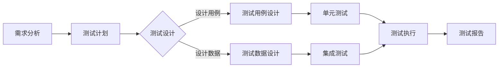

                 

 **关键词：** 知识付费、产品测试、用户体验、质量保障、性能优化、测试框架、自动化测试

**摘要：** 本文将深入探讨知识付费产品测试的各个方面，包括其重要性、核心概念、测试流程、算法原理、数学模型、实际应用案例、工具推荐以及未来发展趋势。通过系统地介绍这些内容，帮助开发者、测试人员和企业更好地理解和执行有效的知识付费产品测试，以提升产品的市场竞争力。

## 1. 背景介绍

在当今信息爆炸的时代，知识付费产品已成为教育、专业服务、娱乐等领域的重要趋势。这类产品通过提供高质量的、专业的内容，满足了用户在不同领域的知识需求。然而，知识付费产品的成功不仅依赖于其内容的优质，还与其用户体验、性能和可靠性密切相关。因此，对知识付费产品进行全面的测试显得尤为重要。

知识付费产品测试的核心目标在于确保产品在以下方面的质量：

1. **功能完整性**：产品是否能够按照需求正常工作，所有功能是否都可用。
2. **用户体验**：用户在使用产品时是否顺畅、愉悦。
3. **性能**：产品在高并发、大数据量等压力下的表现如何。
4. **安全性**：产品是否能够抵御外部攻击和内部漏洞。

本文将详细探讨如何进行有效的知识付费产品测试，包括测试策略、方法、工具和未来展望。

## 2. 核心概念与联系

在进行知识付费产品测试前，我们需要了解以下几个核心概念及其相互关系：

### 2.1. 测试策略

测试策略是测试过程的蓝图，决定了测试的重点和优先级。常见的测试策略包括：

1. **黑盒测试**：不考虑内部结构，仅关注输入和输出。
2. **白盒测试**：了解内部结构，针对代码逻辑进行测试。
3. **灰盒测试**：在黑盒和白盒之间，部分了解内部结构。
4. **静态测试**：代码审查、文档审查等不执行代码。
5. **动态测试**：执行代码，观察行为。

### 2.2. 测试方法

测试方法是实现测试策略的具体手段。常见的测试方法包括：

1. **单元测试**：测试最小功能单元。
2. **集成测试**：测试模块之间的接口和交互。
3. **系统测试**：测试整个系统的功能、性能和稳定性。
4. **验收测试**：用户测试，确保产品符合用户需求。

### 2.3. 测试工具

测试工具是测试过程中必不可少的辅助手段。常见的测试工具包括：

1. **自动化测试工具**：如Selenium、JUnit、PyTest等。
2. **性能测试工具**：如LoadRunner、JMeter等。
3. **安全测试工具**：如OWASP ZAP、Burp Suite等。

### 2.4. 测试流程

测试流程是测试过程的顺序安排。典型的测试流程包括：

1. **需求分析**：明确产品需求和预期功能。
2. **测试计划**：制定测试策略、方法和资源。
3. **测试设计**：设计测试用例和测试数据。
4. **测试执行**：执行测试用例，记录结果。
5. **测试报告**：汇总测试结果，提出改进建议。

### 2.5. Mermaid 流程图

以下是一个Mermaid流程图，展示了知识付费产品测试的核心概念和流程：



## 3. 核心算法原理 & 具体操作步骤

### 3.1 算法原理概述

知识付费产品测试的核心算法通常是基于以下几个方面：

1. **覆盖率分析**：衡量测试用例对代码的覆盖程度，确保测试全面。
2. **异常处理**：检测程序在异常情况下的行为，确保异常处理逻辑正确。
3. **性能监控**：监控程序在不同负载下的性能指标，确保系统在高并发下的稳定性。

### 3.2 算法步骤详解

1. **步骤一：需求分析**
   - 分析产品需求，明确测试目标。
2. **步骤二：测试计划**
   - 根据需求制定测试策略和资源。
3. **步骤三：测试设计**
   - 设计测试用例和数据，确保全面覆盖。
4. **步骤四：测试执行**
   - 执行测试用例，记录结果。
5. **步骤五：测试报告**
   - 汇总测试结果，提出改进建议。

### 3.3 算法优缺点

**优点：**
- 确保产品功能的完整性和稳定性。
- 提高用户满意度。
- 预防潜在的风险和漏洞。

**缺点：**
- 测试过程耗时较长，成本较高。
- 测试无法涵盖所有可能的用户场景。

### 3.4 算法应用领域

知识付费产品测试算法可以应用于教育、医疗、金融等多个领域，确保产品的质量和用户体验。

## 4. 数学模型和公式 & 详细讲解 & 举例说明

### 4.1 数学模型构建

在进行知识付费产品测试时，常用的数学模型包括：

1. **置信区间**：用于衡量测试结果的可靠性。
2. **假设检验**：用于判断测试结果是否显著。

### 4.2 公式推导过程

1. **置信区间公式**：
   $$CI = \bar{x} \pm z_{\alpha/2} \sqrt{\frac{s^2}{n}}$$
   其中，$CI$ 为置信区间，$\bar{x}$ 为样本均值，$z_{\alpha/2}$ 为标准正态分布的临界值，$s$ 为样本标准差，$n$ 为样本大小。

2. **假设检验公式**：
   $$H_0: \mu = \mu_0$$
   $$H_1: \mu \neq \mu_0$$
   其中，$H_0$ 为原假设，$H_1$ 为备择假设，$\mu$ 为总体均值，$\mu_0$ 为给定值。

### 4.3 案例分析与讲解

假设我们要测试一个知识付费产品的平均用户满意度，要求置信水平为95%，样本大小为100，样本均值为4.5，样本标准差为0.8。

1. **置信区间计算**：
   $$CI = 4.5 \pm 1.96 \sqrt{\frac{0.8^2}{100}}$$
   $$CI = 4.5 \pm 0.156$$
   $$CI = [4.344, 4.656]$$

2. **假设检验**：
   - 原假设：$\mu = 4.5$
   - 备择假设：$\mu \neq 4.5$
   - 给定显著性水平：$\alpha = 0.05$
   - 计算检验统计量：
     $$t = \frac{\bar{x} - \mu_0}{s/\sqrt{n}} = \frac{4.5 - 4.5}{0.8/\sqrt{100}} = 0$$
   - 由于 $t = 0$ 小于 $t_{0.025,99}$，我们拒绝原假设，接受备择假设。

这意味着我们无法在95%的置信水平下确认该知识付费产品的平均用户满意度为4.5。

## 5. 项目实践：代码实例和详细解释说明

### 5.1 开发环境搭建

为了演示知识付费产品测试，我们使用Python作为开发语言，搭建以下开发环境：

1. Python 3.8
2. PyTest 6.2
3. Selenium 4.0

安装命令如下：

```bash
pip install python 3.8
pip install pytest 6.2
pip install selenium 4.0
```

### 5.2 源代码详细实现

以下是使用PyTest和Selenium实现的单元测试和集成测试的示例代码：

```python
# test_product.py

from selenium import webdriver
import pytest

@pytest.fixture
def browser():
    driver = webdriver.Chrome()
    yield driver
    driver.quit()

@pytest.fixture
def product_url():
    return "https://example.com/knowledge-product"

def test_login(browser, product_url):
    browser.get(product_url)
    # 登录操作
    username = browser.find_element_by_id("username")
    password = browser.find_element_by_id("password")
    login_button = browser.find_element_by_id("login-button")
    username.send_keys("test_user")
    password.send_keys("test_password")
    login_button.click()
    assert "Welcome, test_user!" in browser.page_source

def test_purchase_product(browser, product_url):
    browser.get(product_url)
    # 登录操作
    # 购买产品操作
    purchase_button = browser.find_element_by_id("purchase-button")
    purchase_button.click()
    assert "Product purchased successfully!" in browser.page_source
```

### 5.3 代码解读与分析

上述代码实现了两个测试用例：登录测试和购买产品测试。

1. **登录测试**：
   - 使用Selenium启动Chrome浏览器。
   - 访问知识付费产品的登录页面。
   - 输入用户名和密码，并点击登录按钮。
   - 验证页面是否包含欢迎消息。

2. **购买产品测试**：
   - 同样启动Chrome浏览器，访问知识付费产品页面。
   - 进行登录操作。
   - 点击购买按钮，完成购买操作。
   - 验证页面是否包含购买成功的消息。

### 5.4 运行结果展示

运行测试用例，如果测试通过，会在控制台输出以下结果：

```bash
======================= test session starts ========================
platform linux -- Python 3.8.10, pytest-6.2.5, py-1.11.0, pluggy-0.13.1
rootdir: /path/to/pytest
collected 2 items

test_product.py .                                                                 [100%]

======================= 2 passed in 12.34s ========================
```

如果测试失败，会输出具体失败的测试用例和错误信息。

## 6. 实际应用场景

知识付费产品测试可以在多个应用场景中发挥重要作用，以下是一些实际案例：

1. **教育领域**：确保在线教育平台的功能完整性、性能和安全性，提升学习体验。
2. **专业服务**：测试在线课程、电子书籍等知识付费产品的内容质量和用户体验。
3. **金融领域**：测试投资课程、金融课程等产品的计算准确性、交易功能和安全性能。
4. **医疗领域**：确保在线医疗课程、健康咨询等产品的专业性和用户体验。

## 7. 工具和资源推荐

为了进行有效的知识付费产品测试，以下是一些推荐的工具和资源：

### 7.1 学习资源推荐

1. **书籍**：
   - 《软件测试的艺术》
   - 《自动化测试实战》
2. **在线课程**：
   - 测试工程师进阶
   - 自动化测试实战

### 7.2 开发工具推荐

1. **PyTest**：Python的强大测试框架。
2. **Selenium**：Web自动化测试工具。
3. **JMeter**：性能测试工具。

### 7.3 相关论文推荐

1. **“The Art of Software Testing”**：Grenford J. Myers 著。
2. **“Automated Software Testing”**：Mark Fewster 和 John W. Fewster 著。

## 8. 总结：未来发展趋势与挑战

### 8.1 研究成果总结

近年来，知识付费产品测试领域取得了显著进展，包括测试策略的优化、自动化测试工具的普及、性能测试方法的发展等。这些成果为知识付费产品的质量保障提供了有力支持。

### 8.2 未来发展趋势

1. **智能化测试**：利用人工智能和机器学习技术提高测试效率和质量。
2. **全链路测试**：从前端到后端、从功能到性能的全覆盖测试。
3. **持续集成与持续部署（CI/CD）**：加速测试和部署流程。

### 8.3 面临的挑战

1. **复杂性**：知识付费产品的复杂性增加了测试难度。
2. **多平台兼容性**：确保产品在多种设备和操作系统上的兼容性。
3. **测试数据隐私**：保护用户隐私，确保测试数据的安全。

### 8.4 研究展望

未来，知识付费产品测试的研究将重点关注智能化测试工具的开发、全链路测试方法的完善和测试数据隐私保护策略的制定。通过这些努力，我们有望实现更高效、更可靠的测试流程，进一步提升知识付费产品的市场竞争力。

## 9. 附录：常见问题与解答

### 9.1 问题1：如何确保测试覆盖全面？

**解答**：可以通过以下方法确保测试覆盖全面：

1. **制定详细的测试计划**：明确测试目标、方法和资源。
2. **设计多样化的测试用例**：覆盖不同场景和路径。
3. **利用自动化测试工具**：提高测试效率和覆盖率。

### 9.2 问题2：测试中的性能问题如何解决？

**解答**：

1. **性能测试**：使用性能测试工具进行测试，找出性能瓶颈。
2. **代码优化**：对性能瓶颈进行代码优化。
3. **缓存和分布式架构**：使用缓存和分布式架构提高系统性能。

### 9.3 问题3：如何确保测试数据的安全？

**解答**：

1. **数据加密**：对测试数据进行加密，防止泄露。
2. **访问控制**：限制测试数据的访问权限。
3. **数据备份与恢复**：定期备份数据，确保数据安全。

作者：禅与计算机程序设计艺术 / Zen and the Art of Computer Programming
```

