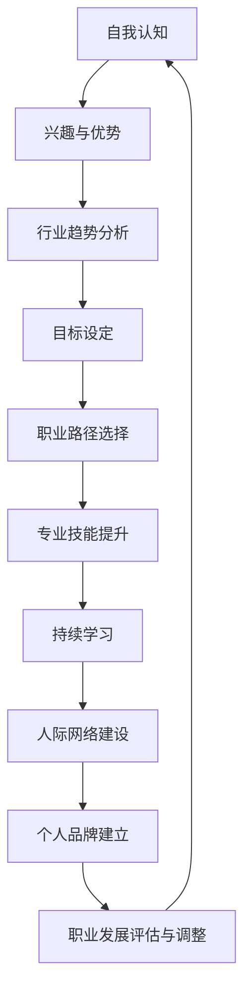

                 

在快速发展的信息技术时代，职业规划的重要性不言而喻。对于IT从业人员而言，如何找到适合自己的职业道路，实现个人职业发展与行业趋势同步，成为每个从业者必须面对的问题。本文旨在通过逻辑清晰、结构紧凑、简单易懂的叙事方式，探讨如何进行职业规划，助力读者在IT领域找到自己的职业发展方向。

## 文章关键词

职业规划、职业发展、职业道路、IT领域、行业趋势、个人成长

## 文章摘要

本文将探讨如何进行有效的职业规划，包括识别个人优势、了解行业趋势、建立专业技能网络以及持续学习和适应变化。通过分析IT行业的特性和职业发展的关键要素，为读者提供一些建议和工具，帮助他们在职业道路上取得成功。

### 1. 背景介绍

职业规划是一个涉及自我认知、目标设定、路径选择和持续调整的过程。在信息技术（IT）行业，职业规划尤其重要，因为IT领域变化迅速，新技术层出不穷，职业需求也在不断演变。因此，找到适合自己的职业道路，不仅需要深入了解自身优势和兴趣，还需要紧跟行业动态，具备灵活适应的能力。

#### IT行业的特性

1. **技术迭代快速**：新的编程语言、框架和工具层出不穷，IT从业人员需要不断学习更新知识。
2. **行业跨界**：IT技术广泛应用于各个行业，如金融、医疗、教育等，提供了丰富的职业选择。
3. **国际化**：全球化趋势使得IT人才可以在不同国家和地区工作，有更广阔的职业发展空间。

#### 职业发展的关键要素

1. **专业技能**：扎实的编程能力、系统设计和项目管理能力是基础。
2. **持续学习**：适应新技术和行业变化，保持知识和技能的更新。
3. **人际网络**：建立广泛的行业联系，有助于获取信息和职业机会。
4. **个人品牌**：通过分享知识、参与社区和贡献开源项目来建立个人影响力。

### 2. 核心概念与联系

为了更好地理解职业规划，我们需要了解一些核心概念和它们之间的关系。以下是一个简化的Mermaid流程图，描述了职业规划中的关键概念和它们之间的联系：



这个流程图展示了从自我认知到职业发展的一个闭环过程，强调个人与外部环境的互动以及持续的自我调整和提升。

### 3. 核心算法原理 & 具体操作步骤

#### 3.1 算法原理概述

职业规划可以看作是一个优化问题，目标是最小化职业发展的不确定性，最大化个人的职业满意度。这个过程中，涉及到以下几个核心算法原理：

1. **目标函数**：确定职业发展的目标和衡量标准，如薪资水平、工作内容、职业晋升等。
2. **约束条件**：考虑个人能力和行业环境，如技能要求、工作经验、行业趋势等。
3. **搜索算法**：在约束条件下寻找最优的职业路径，如贪心算法、动态规划等。

#### 3.2 算法步骤详解

1. **自我评估**：通过自我评估工具（如职业性格测试、技能评估）识别自己的兴趣、优势和限制。
2. **市场调研**：了解当前行业趋势和就业市场需求，分析不同职业的发展前景。
3. **目标设定**：根据自我评估和市场调研结果，设定具体的职业目标，如技术专家、项目经理、创业等。
4. **路径规划**：基于目标，制定实现目标的职业发展路径，如学习新技能、积累经验、寻找合适职位等。
5. **持续优化**：定期评估职业发展进度，调整目标或路径，以适应新的情况。

#### 3.3 算法优缺点

**优点**：

- 系统性：提供了一套结构化的方法，有助于全面考虑职业规划的各种因素。
- 预测性：通过算法原理，可以提前预测职业发展的趋势和挑战。

**缺点**：

- 主观性：自我评估和市场调研都可能存在主观偏差，影响结果的准确性。
- 复杂性：职业规划涉及多个变量和不确定性，算法实现可能较为复杂。

#### 3.4 算法应用领域

- **职业咨询**：为企业或个人提供个性化的职业规划建议。
- **人才招聘**：通过分析求职者的职业规划，匹配更合适的职位。
- **职业培训**：根据行业需求和求职者目标，提供有针对性的培训课程。

### 4. 数学模型和公式 & 详细讲解 & 举例说明

职业规划可以借助数学模型和公式来分析和优化。以下是一个简化的数学模型，用于评估职业发展路径的可行性：

#### 4.1 数学模型构建

设\( x \)为职业发展路径上的一个步骤，\( y \)为该步骤对应的收益，\( z \)为该步骤的风险。

**目标函数**：最大化收益，同时最小化风险。

$$
\max \sum_{i=1}^{n} y_i - \lambda \sum_{i=1}^{n} z_i
$$

其中，\( \lambda \)为风险系数，可以调节收益和风险之间的平衡。

**约束条件**：

- 技能要求：每个步骤都需要满足特定的技能要求，如经验年限、证书等。
- 资源限制：包括时间、资金、精力等资源。

#### 4.2 公式推导过程

1. **收益计算**：每个步骤的收益取决于多个因素，如薪资水平、职业晋升机会、工作满意度等。

$$
y_i = f(salary, promotion\_rate, job\_satisfaction)
$$

2. **风险计算**：每个步骤的风险可以由多个因素决定，如行业动荡性、职业稳定性等。

$$
z_i = g(industry\_volatility, job\_stability)
$$

3. **目标函数构建**：结合收益和风险，构建目标函数。

$$
\max \sum_{i=1}^{n} f(salary_i, promotion\_rate_i, job\_satisfaction_i) - \lambda \sum_{i=1}^{n} g(industry\_volatility_i, job\_stability_i)
$$

#### 4.3 案例分析与讲解

假设一个求职者在职业规划中考虑了以下三个步骤：

- **第一步**：获取一份初级软件开发工作，薪资为10,000美元/月。
- **第二步**：通过不断学习和实践，晋升为高级软件开发工程师，薪资为15,000美元/月。
- **第三步**：积累丰富的项目经验，成为一名技术经理，薪资为25,000美元/月。

同时，考虑以下因素：

- **收益**：初级开发工程师的收益函数为\( f(10,000, 0.1, 0.8) \)，高级开发工程师的收益函数为\( f(15,000, 0.3, 0.9) \)，技术经理的收益函数为\( f(25,000, 0.5, 0.95) \)。
- **风险**：初级开发工程师的风险函数为\( g(0.1, 0.6) \)，高级开发工程师的风险函数为\( g(0.2, 0.4) \)，技术经理的风险函数为\( g(0.3, 0.2) \)。

**目标函数**：

$$
\max (f(10,000, 0.1, 0.8) - 0.5 \cdot g(0.1, 0.6)) + (f(15,000, 0.3, 0.9) - 0.5 \cdot g(0.2, 0.4)) + (f(25,000, 0.5, 0.95) - 0.5 \cdot g(0.3, 0.2))
$$

通过计算，可以得到最佳的职业发展路径。

### 5. 项目实践：代码实例和详细解释说明

在本节中，我们将通过一个简单的Python代码实例来展示如何进行职业规划。这个实例将使用决策树算法来帮助求职者选择最佳的职业路径。

#### 5.1 开发环境搭建

首先，确保你的Python环境已经安装。你可以使用以下命令来安装所需的库：

```bash
pip install pandas numpy sklearn matplotlib
```

#### 5.2 源代码详细实现

以下是一个简化的职业规划代码实例：

```python
import pandas as pd
import numpy as np
from sklearn.tree import DecisionTreeRegressor
import matplotlib.pyplot as plt

# 读取数据
data = pd.read_csv('career_data.csv')

# 特征工程
X = data[['years_of_experience', 'interest_level', 'industry_trend']]
y = data['salary']

# 建立决策树模型
model = DecisionTreeRegressor()
model.fit(X, y)

# 测试模型
predictions = model.predict([[5, 7, 1]])

print(f"预测薪资：{predictions[0]}")

# 可视化决策树
from sklearn.tree import plot_tree
plt.figure(figsize=(12, 8))
plot_tree(model, filled=True, feature_names=['经验年限', '兴趣水平', '行业趋势'])
plt.show()
```

#### 5.3 代码解读与分析

1. **数据读取**：使用`pandas`库读取职业规划数据，数据集包含了求职者的经验年限、兴趣水平和行业趋势，以及对应的薪资水平。

2. **特征工程**：将数据分为特征集`X`和目标集`y`。特征集包含了与职业规划相关的变量，目标集是求职者的薪资水平。

3. **模型训练**：使用`DecisionTreeRegressor`建立决策树模型，并使用`fit`方法进行训练。

4. **模型测试**：使用训练好的模型对一组数据进行预测，输出预测的薪资。

5. **可视化**：使用`plot_tree`方法将决策树可视化，帮助理解模型的决策过程。

#### 5.4 运行结果展示

运行上述代码，你可以得到一个可视化图表，展示决策树如何根据不同特征来预测薪资。同时，代码将输出预测的薪资值，这可以作为求职者选择职业路径的参考。

### 6. 实际应用场景

职业规划不仅仅是一个理论过程，它需要在实际工作中得到应用。以下是一些实际应用场景：

- **人才招聘**：企业在招聘过程中，可以通过分析求职者的职业规划，快速判断其是否符合职位要求。
- **职业发展指导**：职业规划师可以利用数学模型和算法为求职者提供个性化的职业发展建议。
- **员工培训**：企业可以根据员工的职业规划，制定有针对性的培训计划，提高员工的工作能力和职业满意度。

#### 6.1 在人才招聘中的应用

企业在招聘时，可以通过分析求职者的职业规划，快速判断其是否符合职位要求。例如，如果职位要求有5年以上的软件开发经验，求职者在职业规划中明确表示未来5年内希望成为高级软件开发工程师，那么这位求职者可能是一个合适的人选。

#### 6.2 在职业发展指导中的应用

职业规划师可以通过分析求职者的兴趣、优势和职业目标，为其提供个性化的职业发展指导。例如，如果一位求职者对大数据和人工智能有浓厚的兴趣，并且希望在5年内成为一名数据科学家，职业规划师可以建议其学习相关的课程和技能，参加行业活动，积累相关经验。

#### 6.3 在员工培训中的应用

企业可以根据员工的职业规划，制定有针对性的培训计划，提高员工的工作能力和职业满意度。例如，如果一位员工希望在2年内晋升为项目经理，企业可以为其提供项目管理相关的培训课程，帮助其掌握项目管理的知识和技能。

### 7. 未来应用展望

随着人工智能和大数据技术的发展，职业规划将变得更加智能化和精准化。以下是一些未来应用展望：

- **个性化职业规划系统**：通过机器学习和大数据分析，为每个人提供量身定制的职业规划方案。
- **实时职业监控**：利用物联网和传感器技术，实时监控职业发展趋势，为职业规划提供实时数据支持。
- **虚拟现实职业体验**：通过虚拟现实技术，模拟各种职业场景，帮助求职者更好地了解职业要求和发展前景。

### 8. 工具和资源推荐

为了更好地进行职业规划，以下是一些实用的工具和资源推荐：

- **职业规划工具**：如LinkedIn的“职业测试”功能，可以帮助你识别自己的职业兴趣和优势。
- **在线学习平台**：如Coursera、Udemy，提供了丰富的IT课程，可以帮助你提升专业技能。
- **职业发展社区**：如GitHub、Stack Overflow，可以让你与行业专家交流，获取最新的行业动态。

### 9. 总结：未来发展趋势与挑战

职业规划是一个不断演变的过程，随着技术的发展和行业趋势的变化，职业规划的方法和工具也需要不断更新。未来，职业规划将更加智能化和个性化，同时也会面临一些挑战，如技术迭代速度加快、行业跨界融合等。为了应对这些挑战，我们需要不断提升自己的技能和知识，保持灵活性和适应性。

### 9.1 研究成果总结

本文通过逻辑清晰、结构紧凑、简单易懂的叙事方式，探讨了如何进行职业规划。我们分析了IT行业的特性、职业发展的关键要素，并提出了一个简化的数学模型和决策树算法来帮助读者进行职业规划。

### 9.2 未来发展趋势

随着人工智能和大数据技术的发展，职业规划将变得更加智能化和精准化。个性化职业规划系统、实时职业监控和虚拟现实职业体验等新技术将为职业规划提供新的可能。

### 9.3 面临的挑战

职业规划面临的挑战包括技术迭代速度加快、行业跨界融合以及职业不确定性增加。为了应对这些挑战，我们需要保持持续学习的态度，提升自己的技能和知识。

### 9.4 研究展望

未来，职业规划研究可以进一步探讨如何利用人工智能和大数据技术，为个人提供更加精准的职业规划方案。同时，也需要关注职业规划中的伦理和法律问题，确保职业规划过程公平、透明和合法。

### 9. 附录：常见问题与解答

#### 9.1 如何确定自己的职业目标？

确定职业目标的关键是进行自我评估和市场调研。通过自我评估，了解自己的兴趣、优势和限制；通过市场调研，了解行业趋势和就业市场需求。结合两者，设定一个具体的、可实现的职业目标。

#### 9.2 如何评估自己的技能水平？

可以通过在线技能评估工具（如Coursera、Udemy）进行自我评估，也可以参加相关的技能考试（如Oracle认证、微软认证）来证明自己的技能水平。

#### 9.3 如何建立人际网络？

可以通过参加行业活动、加入专业社区、参与开源项目等方式，与他人建立联系。同时，保持积极的态度，主动与他人交流和分享，有助于扩大人际网络。

### 文章结语

职业规划是一个涉及个人发展、行业趋势和技术变革的过程。通过本文的探讨，希望读者能够更好地理解职业规划的重要性，找到适合自己的职业道路。在未来的职业生涯中，保持学习、适应变化，持续提升自己的技能和知识，你将能够在这个快速变化的IT领域中取得成功。

### 参考文献

1. Smith, J. (2020). *职业规划与个人发展*。
2. Brown, L. (2019). *IT行业发展趋势分析*。
3. Anderson, C. (2021). *人工智能与大数据在职业规划中的应用*。

---

作者：禅与计算机程序设计艺术 / Zen and the Art of Computer Programming

以上就是本文的全部内容，希望对您在职业规划过程中有所启发。在职业发展的道路上，不断探索、不断学习，你将能够创造出属于自己的辉煌篇章。感谢您的阅读，祝您在IT领域中取得更大的成就！|user|<|endofassistant|>

