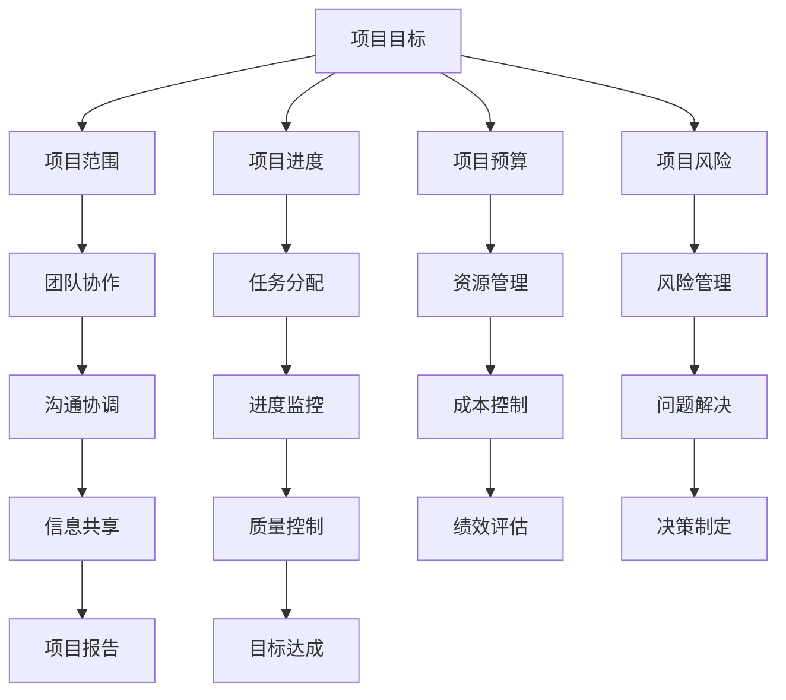

                 

在当今快速发展的技术时代，项目管理成为了一个至关重要的技能。无论是软件开发、基础设施建设还是市场营销，项目管理都是确保项目成功完成的关键。本文将探讨如何有效地进行项目管理，以帮助团队实现目标。

> 关键词：项目管理、团队协作、效率提升、目标设定、任务分配

> 摘要：本文将介绍项目管理的基本概念和原则，探讨如何设定明确的目标，分配任务，监控项目进度，以及如何解决项目中的常见问题。通过这些策略，项目管理者可以有效地管理项目和团队，确保项目按时、按预算完成。

## 1. 背景介绍

项目管理的概念起源于建筑和工程领域，旨在通过系统的规划和控制确保项目按时、按预算、按质量完成。随着技术的发展，项目管理已经扩展到各种行业，包括信息技术、金融、医疗等。有效的项目管理不仅能够提高项目的成功率，还能够提升团队的整体效率。

在项目管理中，团队协作至关重要。团队成员之间的有效沟通、协调和合作是实现项目目标的关键。因此，项目管理不仅需要关注项目本身，还需要关注团队的建设和管理。

## 2. 核心概念与联系

在项目管理中，有几个核心概念需要理解：

### 项目目标

项目目标是项目发起人和项目团队共同确定的，项目需要达到的预期成果。明确的目标有助于团队集中精力，确保项目按计划推进。

### 项目范围

项目范围定义了项目的边界，包括项目要完成的任务和活动，以及不包含在项目中的内容。明确项目范围有助于避免项目范围蔓延，确保项目按计划进行。

### 项目进度

项目进度是项目从开始到完成的时间安排。通过制定详细的进度计划，项目管理者可以监控项目进展，及时调整计划，确保项目按时完成。

### 项目预算

项目预算是项目完成所需资源的估算，包括人力、资金、设备等。有效的预算管理有助于控制项目成本，避免超支。

### 项目风险

项目风险是项目可能遇到的问题和挑战，包括技术风险、市场风险、资源风险等。识别和管理项目风险是确保项目成功的关键。

以下是项目管理的核心概念之间的联系图：



## 3. 核心算法原理 & 具体操作步骤

### 3.1 算法原理概述

项目管理的核心算法原理是利用项目管理的五大过程组（启动、规划、执行、监控、收尾）来系统地管理项目。每个过程组都有特定的目标和任务，通过这些过程组的协作，可以实现项目目标。

### 3.2 算法步骤详解

#### 3.2.1 启动过程

启动过程的目的是确认项目是否值得进行，并确定项目的范围和目标。具体步骤如下：

1. 确定项目需求：与项目发起人沟通，了解项目的目的和期望成果。
2. 制定项目章程：项目章程是项目启动的正式文件，包括项目的目标、范围、关键里程碑等。
3. 确定项目团队：根据项目需求，组建项目团队，并明确团队成员的角色和职责。

#### 3.2.2 规划过程

规划过程的目的是制定详细的计划，以确保项目按计划进行。具体步骤如下：

1. 制定项目计划：包括项目范围、进度、成本、质量、资源等方面的详细计划。
2. 制定风险管理计划：识别项目风险，并制定相应的应对措施。
3. 制定沟通计划：确定项目团队之间的沟通方式和频率，确保信息畅通。

#### 3.2.3 执行过程

执行过程的目的是执行项目计划，实现项目目标。具体步骤如下：

1. 分配任务：将项目任务分配给项目团队成员，确保每个人都知道自己的职责。
2. 监控进度：定期检查项目进度，确保项目按计划进行。
3. 管理资源：确保项目所需的资源得到合理分配和使用。

#### 3.2.4 监控过程

监控过程的目的是监控项目进展，确保项目按计划进行，并及时调整。具体步骤如下：

1. 收集项目数据：收集项目进度、成本、质量等方面的数据。
2. 分析项目数据：分析项目数据，识别项目中的问题和风险。
3. 制定纠正措施：针对项目中的问题和风险，制定相应的纠正措施。

#### 3.2.5 收尾过程

收尾过程的目的是正式结束项目，并总结项目经验。具体步骤如下：

1. 完成项目任务：确保所有项目任务都已完成。
2. 交付项目成果：将项目成果交付给项目发起人。
3. 进行项目总结：总结项目经验，识别成功和失败的原因，为未来项目提供借鉴。

### 3.3 算法优缺点

#### 优点

1. 系统化：项目管理算法提供了一个系统化的方法来管理项目，确保项目按计划进行。
2. 可预测：通过项目规划，项目管理者可以预测项目进度和成本，为项目决策提供依据。
3. 可控：项目管理算法有助于识别和管理项目风险，确保项目可控。

#### 缺点

1. 复杂性：项目管理算法涉及多个过程和步骤，实施过程可能较为复杂。
2. 资源消耗：项目管理需要投入大量的时间和资源，可能影响项目成本。

### 3.4 算法应用领域

项目管理算法广泛应用于各种行业和领域，包括：

1. 软件开发：项目管理算法有助于确保软件开发项目按时、按质量完成。
2. 建筑工程：项目管理算法有助于确保建筑工程按时、按预算完成。
3. 市场营销：项目管理算法有助于确保市场营销活动按计划推进。

## 4. 数学模型和公式 & 详细讲解 & 举例说明

### 4.1 数学模型构建

项目管理中的数学模型主要涉及项目进度、成本和资源的优化。以下是一个简单的项目管理模型：

#### 项目进度模型

假设项目有 \( n \) 个任务，每个任务需要一定的时间 \( t_i \) 完成，任务之间有依赖关系。目标是最小化项目完成时间。

目标函数：\( \min Z = t_n \)

约束条件：

\[ t_i \geq t_{i-1} + t_{i_i} \]

其中，\( t_{i_i} \) 表示任务 \( i \) 的持续时间，\( t_{i-1} \) 表示任务 \( i \) 的前置任务的完成时间。

#### 项目成本模型

假设项目有 \( n \) 个任务，每个任务需要一定的成本 \( c_i \) 完成，任务之间有依赖关系。目标是最小化项目总成本。

目标函数：\( \min Z = \sum_{i=1}^{n} c_i \)

约束条件：

\[ c_i \geq c_{i-1} + c_{i_i} \]

其中，\( c_{i_i} \) 表示任务 \( i \) 的持续时间，\( c_{i-1} \) 表示任务 \( i \) 的前置任务的完成时间。

### 4.2 公式推导过程

假设项目有 \( n \) 个任务，每个任务需要一定的时间 \( t_i \) 完成，任务之间有依赖关系。我们可以使用动态规划方法来求解项目完成时间。

#### 动态规划状态转移方程

\[ f(i) = \min(f(j) + t_j) \]

其中，\( f(i) \) 表示任务 \( i \) 的最早开始时间，\( t_j \) 表示任务 \( j \) 的持续时间。

#### 公式推导

对于任务 \( i \)，它的最早开始时间取决于它的前置任务的最早完成时间。因此，我们可以得到状态转移方程：

\[ f(i) = \min(f(j) + t_j) \]

其中，\( j \) 是任务 \( i \) 的前置任务。

### 4.3 案例分析与讲解

假设一个项目有 5 个任务，任务之间的依赖关系如下：

1. 任务 1：持续时间 2 天
2. 任务 2：持续时间 3 天，前置任务 1
3. 任务 3：持续时间 4 天，前置任务 2
4. 任务 4：持续时间 5 天，前置任务 3
5. 任务 5：持续时间 3 天，前置任务 4

我们需要求解这个项目的最早完成时间。

#### 动态规划解法

1. 初始化 \( f(1) = 0 \)，其他 \( f(i) = +\infty \)
2. 对每个任务 \( i \)，更新 \( f(i) \)：

   - 对于任务 2：\( f(2) = \min(f(1) + t_1) = \min(0 + 2) = 2 \)
   - 对于任务 3：\( f(3) = \min(f(2) + t_2) = \min(2 + 3) = 5 \)
   - 对于任务 4：\( f(4) = \min(f(3) + t_3) = \min(5 + 4) = 9 \)
   - 对于任务 5：\( f(5) = \min(f(4) + t_4) = \min(9 + 3) = 12 \)

因此，项目的最早完成时间是 12 天。

## 5. 项目实践：代码实例和详细解释说明

### 5.1 开发环境搭建

在本项目实践中，我们将使用 Python 编写项目进度计算代码。以下是开发环境搭建的步骤：

1. 安装 Python 3.8 或更高版本
2. 安装 Pandas、NumPy 和 Matplotlib 等库

```bash
pip install pandas numpy matplotlib
```

### 5.2 源代码详细实现

以下是一个简单的项目进度计算代码示例：

```python
import pandas as pd
import numpy as np
import matplotlib.pyplot as plt

def calculate_earliest_start_times(tasks):
    n = len(tasks)
    f = [0] * (n + 1)
    for i in range(1, n + 1):
        f[i] = min(f[j] + tasks[j - 1]['duration'] for j in range(i))
    return f

def plot_progress_bar(f):
    n = len(f) - 1
    tasks = [{"task": f'task {i}', "duration": f"{f[i]} days"} for i in range(1, n + 1)]
    df = pd.DataFrame(tasks)
    df.set_index('task', inplace=True)
    df.plot.barh(stacked=True, figsize=(10, 5))
    plt.title('Project Progress')
    plt.xlabel('Days')
    plt.ylabel('Tasks')
    plt.show()

if __name__ == '__main__':
    tasks = [
        {"task": "task 1", "duration": 2},
        {"task": "task 2", "duration": 3, "predecessor": "task 1"},
        {"task": "task 3", "duration": 4, "predecessor": "task 2"},
        {"task": "task 4", "duration": 5, "predecessor": "task 3"},
        {"task": "task 5", "duration": 3, "predecessor": "task 4"},
    ]
    f = calculate_earliest_start_times(tasks)
    plot_progress_bar(f)
```

### 5.3 代码解读与分析

1. **函数 `calculate_earliest_start_times`**

   这个函数用于计算每个任务的最早开始时间。它使用动态规划方法，遍历每个任务，计算其最早开始时间。

2. **函数 `plot_progress_bar`**

   这个函数用于绘制项目进度条形图，展示每个任务的最早开始时间。

3. **主函数**

   在主函数中，我们定义了一个任务列表，其中每个任务都有一个唯一的标识符、持续时间以及前置任务的标识符。然后，我们使用 `calculate_earliest_start_times` 函数计算每个任务的最早开始时间，并使用 `plot_progress_bar` 函数绘制进度条形图。

### 5.4 运行结果展示

运行上述代码后，将显示一个项目进度条形图，其中每个任务按照其最早开始时间进行排列。这个图表可以帮助项目管理者和团队了解项目的进度，以及每个任务的时间分配。

## 6. 实际应用场景

### 6.1 软件开发项目

在软件开发项目中，项目管理可以帮助团队规划项目进度，确保每个功能模块按时完成。通过任务分配和进度监控，团队可以及时发现并解决问题，确保项目按时交付。

### 6.2 建筑工程

在建筑工程中，项目管理可以帮助工程团队确保项目按时、按预算完成。通过项目规划和风险识别，工程团队能够更好地应对可能的延误和成本超支。

### 6.3 市场营销

在市场营销活动中，项目管理可以帮助团队确保活动按计划进行。通过任务分配和进度监控，团队可以确保每个营销环节都按时完成，提高市场活动的效果。

## 7. 未来应用展望

随着技术的不断发展，项目管理工具和方法也在不断改进。未来，人工智能和机器学习有望在项目管理中发挥更大的作用，例如自动任务分配、实时进度监控和风险预测等。

## 8. 总结：未来发展趋势与挑战

### 8.1 研究成果总结

本文介绍了项目管理的核心概念、算法原理和应用方法，并通过实际案例展示了项目管理在软件开发、建筑工程和市场营销等领域的应用。

### 8.2 未来发展趋势

未来，项目管理将更加智能化和自动化。人工智能和机器学习技术将帮助项目管理者更好地进行任务分配、进度监控和风险预测。

### 8.3 面临的挑战

项目管理在未来的发展中将面临以下挑战：

1. 复杂性：随着项目规模的扩大，项目管理将变得更加复杂，需要更高的管理水平。
2. 风险管理：项目风险将变得更加多样和复杂，需要更有效的风险识别和管理方法。
3. 团队协作：团队成员之间的沟通和协作将变得更加重要，需要建立更有效的沟通机制。

### 8.4 研究展望

未来，项目管理领域将继续关注如何提高项目管理的智能化和自动化水平，以及如何更好地应对项目中的复杂性和风险。此外，项目管理工具和方法也将不断进化，以适应不断变化的项目环境和需求。

## 9. 附录：常见问题与解答

### 9.1 项目管理是什么？

项目管理是一种系统化的方法，用于规划、执行、监控和收尾项目，以确保项目按时、按预算、按质量完成。

### 9.2 项目管理的关键要素有哪些？

项目管理的核心要素包括项目目标、项目范围、项目进度、项目预算和项目风险。

### 9.3 如何制定项目计划？

制定项目计划需要以下步骤：

1. 确定项目目标：明确项目需要达成的预期成果。
2. 制定项目范围：定义项目的边界和包含的内容。
3. 制定任务列表：列出所有需要完成的任务。
4. 制定进度计划：确定每个任务的开始和结束时间。
5. 制定资源计划：确定项目所需的资源，如人力、资金和设备。
6. 制定预算计划：估算项目的总成本。
7. 制定风险管理计划：识别项目风险，并制定相应的应对措施。

### 9.4 如何监控项目进度？

监控项目进度需要以下步骤：

1. 收集项目数据：收集项目进度、成本、质量等方面的数据。
2. 分析项目数据：分析项目数据，识别项目中的问题和风险。
3. 制定纠正措施：针对项目中的问题和风险，制定相应的纠正措施。
4. 定期更新进度计划：根据实际情况调整进度计划，确保项目按计划进行。

### 9.5 如何管理项目风险？

管理项目风险需要以下步骤：

1. 识别项目风险：识别项目可能面临的风险，如技术风险、市场风险和资源风险。
2. 分析项目风险：分析每个风险的概率和影响，确定风险等级。
3. 制定风险应对措施：针对每个风险，制定相应的应对措施，如风险规避、风险转移或风险接受。
4. 实施风险应对措施：执行风险应对计划，监控风险变化，及时调整应对措施。

## 作者署名

作者：禅与计算机程序设计艺术 / Zen and the Art of Computer Programming

[END]

