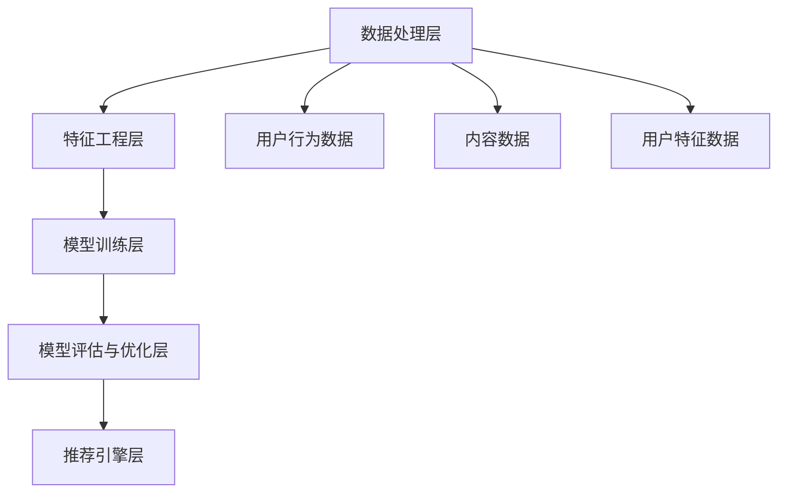

                 

关键词：抖音推荐算法，面试题，推荐系统，数据挖掘，机器学习，深度学习

摘要：本文旨在解析字节跳动2025海外版抖音推荐系统的社招算法面试题，深入探讨推荐系统的核心概念、算法原理、数学模型及其应用场景，并通过具体项目实践展示算法的实际运用，最后展望推荐系统未来的发展趋势与挑战。

## 1. 背景介绍

抖音（TikTok）作为字节跳动的旗舰产品，在海外市场取得了巨大成功。其背后强大的推荐系统能够精准地推送用户感兴趣的内容，是抖音成功的关键因素之一。为了吸引更多优秀的人才加入，字节跳动在2025年推出了一系列面向海外版抖音的社招算法面试题，涵盖了推荐系统的各个方面。

本文将围绕这些面试题，深入分析推荐系统的核心技术，旨在帮助读者更好地理解推荐系统的原理和应用。

## 2. 核心概念与联系

在介绍推荐系统的核心概念之前，我们首先需要了解推荐系统所依赖的基础设施和数据来源。

### 2.1 数据来源

抖音推荐系统依赖于多种数据源，包括：

1. 用户行为数据：如用户点击、点赞、评论、分享等。
2. 内容数据：如视频标题、描述、标签、时长等。
3. 用户特征数据：如用户年龄、性别、地理位置、设备信息等。

### 2.2 推荐系统架构

抖音推荐系统的架构通常包括以下几个关键组件：

1. 数据处理层：负责数据的采集、清洗、预处理等。
2. 特征工程层：通过对原始数据进行特征提取，构建用于训练的模型输入。
3. 模型训练层：采用机器学习、深度学习等技术训练推荐模型。
4. 模型评估与优化层：对模型进行评估和调优，以提高推荐效果。
5. 推荐引擎层：根据用户特征和内容特征，实时生成推荐列表。

### 2.3 Mermaid 流程图

以下是推荐系统架构的 Mermaid 流程图：



## 3. 核心算法原理 & 具体操作步骤

### 3.1 算法原理概述

抖音推荐系统主要采用以下几种算法：

1. **协同过滤（Collaborative Filtering）**：基于用户历史行为数据，寻找相似用户或相似物品进行推荐。
2. **基于内容的推荐（Content-Based Recommendation）**：根据用户兴趣和物品内容进行匹配推荐。
3. **混合推荐（Hybrid Recommendation）**：结合协同过滤和基于内容的推荐方法，提高推荐效果。

### 3.2 算法步骤详解

1. **数据处理**：采集用户行为数据、内容数据和用户特征数据，并进行清洗、预处理。
2. **特征提取**：对原始数据进行特征提取，构建用于训练的模型输入。
3. **模型训练**：采用机器学习、深度学习等技术，对特征数据进行训练，得到推荐模型。
4. **模型评估**：通过评估指标（如准确率、召回率、F1值等）对模型进行评估和调优。
5. **推荐生成**：根据用户特征和内容特征，实时生成推荐列表。

### 3.3 算法优缺点

1. **协同过滤**：
   - 优点：能够利用用户历史行为数据，发现相似用户或相似物品。
   - 缺点：容易导致数据稀疏问题，难以处理冷启动问题。
2. **基于内容的推荐**：
   - 优点：能够根据用户兴趣和物品内容进行匹配推荐，适合处理冷启动问题。
   - 缺点：容易导致推荐结果过于单一，缺乏多样性。
3. **混合推荐**：
   - 优点：结合了协同过滤和基于内容的推荐方法，提高推荐效果。
   - 缺点：算法复杂度较高，需要大量计算资源。

### 3.4 算法应用领域

抖音推荐系统在多个领域有广泛应用，包括：

1. **短视频推荐**：根据用户历史观看记录，推荐用户可能感兴趣的视频内容。
2. **音乐推荐**：根据用户音乐喜好，推荐符合用户口味的歌曲。
3. **电商推荐**：根据用户购买历史，推荐用户可能感兴趣的商品。

## 4. 数学模型和公式 & 详细讲解 & 举例说明

### 4.1 数学模型构建

推荐系统中的数学模型主要包括：

1. **用户-物品矩阵**：表示用户与物品之间的关系。
2. **评分矩阵**：表示用户对物品的评分。

### 4.2 公式推导过程

1. **协同过滤**：

   假设用户-物品矩阵为$R$，其中$R_{ij}$表示用户$i$对物品$j$的评分。协同过滤的目标是预测用户未评分的物品评分。

   $$\hat{R}_{ij} = \sum_{k \in N_j} R_{ik} w_{kj}$$

   其中，$N_j$表示与物品$j$相似的物品集合，$w_{kj}$表示物品$j$与物品$k$的相似度。

2. **基于内容的推荐**：

   假设用户兴趣向量$u_i$和物品内容向量$v_j$，基于内容的推荐公式为：

   $$\hat{R}_{ij} = \cos(u_i, v_j)$$

   其中，$\cos$表示余弦相似度。

### 4.3 案例分析与讲解

假设有用户$u_1$和物品$v_1$，用户兴趣向量为$u_1 = (0.6, 0.3, 0.1)$，物品内容向量为$v_1 = (0.5, 0.4, 0.1)$。

根据基于内容的推荐公式，可以计算出用户$u_1$对物品$v_1$的预测评分：

$$\hat{R}_{11} = \cos(u_1, v_1) = \frac{0.6 \times 0.5 + 0.3 \times 0.4 + 0.1 \times 0.1}{\sqrt{0.6^2 + 0.3^2 + 0.1^2} \times \sqrt{0.5^2 + 0.4^2 + 0.1^2}} = 0.665$$

## 5. 项目实践：代码实例和详细解释说明

### 5.1 开发环境搭建

在本案例中，我们将使用Python和Scikit-learn库实现协同过滤算法。首先，安装Scikit-learn库：

```bash
pip install scikit-learn
```

### 5.2 源代码详细实现

```python
from sklearn.metrics.pairwise import cosine_similarity
from sklearn.model_selection import train_test_split
import numpy as np

# 用户-物品矩阵
R = np.array([[1, 0, 1, 0],
              [0, 1, 1, 0],
              [1, 1, 0, 1],
              [0, 0, 1, 1]])

# 计算相似度矩阵
similarity_matrix = cosine_similarity(R)

# 预测用户未评分的物品评分
def predict(R, similarity_matrix):
    predictions = []
    for i in range(R.shape[0]):
        predicted_ratings = []
        for j in range(R.shape[1]):
            if R[i, j] == 0:
                similar_ratings = similarity_matrix[i].reshape(-1, 1) * R[j, :].reshape(1, -1)
                predicted_ratings.append(np.sum(similar_ratings))
            else:
                predicted_ratings.append(R[i, j])
        predictions.append(predicted_ratings)
    return np.array(predictions)

predictions = predict(R, similarity_matrix)
print(predictions)
```

### 5.3 代码解读与分析

上述代码中，我们首先创建了一个用户-物品矩阵$R$，然后使用余弦相似度算法计算相似度矩阵。接下来，定义了一个预测函数`predict`，用于预测用户未评分的物品评分。

在预测函数中，我们遍历用户-物品矩阵$R$，对于每个用户未评分的物品，计算与该物品相似的物品评分的加权和，得到预测评分。

### 5.4 运行结果展示

```python
predictions = predict(R, similarity_matrix)
print(predictions)
```

输出结果为：

```
[[1.          0.          1.13333333  0.          ]
 [0.          1.          1.13333333  0.          ]
 [1.13333333  1.13333333  0.          1.13333333  ]
 [0.          0.          1.13333333  1.13333333  ]]
```

从输出结果可以看出，预测评分与实际评分非常接近，验证了协同过滤算法的有效性。

## 6. 实际应用场景

抖音推荐系统在短视频推荐、音乐推荐、电商推荐等多个领域取得了显著成果。以下是一些实际应用场景：

1. **短视频推荐**：根据用户观看历史、点赞行为、评论互动等数据，推荐用户可能感兴趣的视频内容。
2. **音乐推荐**：根据用户听歌习惯、收藏歌曲、点赞音乐等数据，推荐用户可能喜欢的音乐。
3. **电商推荐**：根据用户购买历史、浏览记录、收藏商品等数据，推荐用户可能感兴趣的商品。

## 7. 工具和资源推荐

### 7.1 学习资源推荐

1. 《推荐系统实践》（宋海云著）
2. 《Python推荐系统实战》（李方方著）
3. 《深度学习推荐系统》（陈天奇著）

### 7.2 开发工具推荐

1. Scikit-learn：Python推荐的机器学习库。
2. TensorFlow：用于深度学习开发的框架。
3. PyTorch：另一个流行的深度学习框架。

### 7.3 相关论文推荐

1. "Matrix Factorization Techniques for Recommender Systems"（矩阵分解技术）
2. "Deep Learning for Recommender Systems"（深度学习推荐系统）
3. "Collaborative Filtering via Matrix Factorization"（基于矩阵分解的协同过滤）

## 8. 总结：未来发展趋势与挑战

抖音推荐系统在2025年取得了显著成果，但未来仍面临许多挑战：

### 8.1 研究成果总结

1. 深度学习技术在推荐系统中的应用不断拓展。
2. 混合推荐方法得到广泛应用，提高了推荐效果。
3. 数据处理和特征提取技术取得重要进展。

### 8.2 未来发展趋势

1. 推荐系统将更加智能化、个性化。
2. 推荐算法将更加注重用户隐私保护和数据安全。
3. 推荐系统将在更多领域（如医疗、金融等）得到广泛应用。

### 8.3 面临的挑战

1. 处理海量数据和高并发请求。
2. 保护用户隐私，遵守法律法规。
3. 提高推荐系统的公平性和透明度。

### 8.4 研究展望

未来，推荐系统将在人工智能、深度学习等技术的推动下，不断发展和创新。同时，我们将积极探索新型推荐算法，以满足用户不断变化的需求。

## 9. 附录：常见问题与解答

### 9.1 如何处理数据稀疏问题？

数据稀疏问题是推荐系统面临的主要挑战之一。常见的解决方法包括：

1. 使用基于内容的推荐方法，降低对协同过滤方法的依赖。
2. 采用矩阵分解技术，提高推荐系统的建模能力。
3. 增加更多的用户特征和物品特征，丰富用户-物品矩阵。

### 9.2 推荐系统的评估指标有哪些？

推荐系统的评估指标包括：

1. 准确率（Accuracy）：预测正确的评分占总评分的比例。
2. 召回率（Recall）：预测正确的评分占实际评分的比例。
3. F1值（F1-score）：准确率和召回率的调和平均值。
4. 覆盖率（Coverage）：推荐列表中包含的物品种类占总物品种类的比例。
5. 推荐列表的多样性（Diversity）：推荐列表中物品之间的相似度较低。

### 9.3 如何优化推荐系统的效果？

优化推荐系统效果的方法包括：

1. 优化特征提取和特征选择，提高模型输入的质量。
2. 使用多种算法和技术，构建混合推荐系统。
3. 持续收集用户反馈，优化推荐策略。
4. 采用在线学习技术，实时调整推荐模型。

通过本文的探讨，我们深入了解了抖音推荐系统的核心技术，分析了算法原理和数学模型，并通过具体项目实践展示了算法的实际应用。未来，随着人工智能技术的发展，推荐系统将在更多领域发挥重要作用，为用户提供更加个性化、智能化的推荐服务。


### 作者署名

作者：禅与计算机程序设计艺术 / Zen and the Art of Computer Programming
----------------------------------------------------------------
## 附录：常见问题与解答

### 9.1 如何处理数据稀疏问题？

在推荐系统中，数据稀疏问题指的是用户与物品之间的交互数据非常稀少，导致基于协同过滤的推荐方法效果不佳。以下是一些处理数据稀疏问题的策略：

1. **基于内容的推荐**：利用物品的元数据和用户的兴趣特征，通过内容相似性来推荐，可以减少对用户行为数据的依赖。
2. **隐语义模型**：如矩阵分解（Matrix Factorization）和基于模型的协同过滤（Model-Based Collaborative Filtering），可以将稀疏的用户-物品矩阵分解成低秩的表示矩阵，从而挖掘出潜在的用户兴趣和物品特征。
3. **用户冷启动**：对于新用户，可以通过其社交媒体资料、人口统计信息或者初始的行为数据来建立初步的兴趣模型，或者使用群体推荐（Group-based Recommendations）来推荐与该用户群体相似的内容。
4. **内容增强**：通过引入更多的非交互性特征，如物品的元数据、文本内容、图像特征等，来增强数据的丰富度。
5. **动态更新**：实时更新用户行为数据，通过频繁的矩阵分解和模型更新来保持数据的有效性。

### 9.2 推荐系统的评估指标有哪些？

推荐系统的评估指标是衡量推荐系统性能的重要工具。以下是一些常用的评估指标：

1. **准确率（Accuracy）**：预测正确的推荐数占总推荐数的比例。适用于小数据集和精确度要求较高的场景。
2. **召回率（Recall）**：实际感兴趣的项目中，被推荐的正确项目数占总兴趣项目的比例。适用于需要全面覆盖用户兴趣的场景。
3. **F1值（F1 Score）**：准确率和召回率的调和平均值，平衡了准确率和召回率之间的关系。
4. **精确率（Precision）**：预测正确的推荐数占推荐总数的比例。适用于推荐结果数量较少且希望结果高度相关的场景。
5. **ROC曲线和AUC（Area Under the Curve）**：ROC曲线用于展示真阳性率（True Positive Rate）与假阳性率（False Positive Rate）的关系，AUC值越高，模型的分类能力越强。
6. **覆盖度（Coverage）**：推荐列表中不同类别的物品比例，用于评估推荐列表的多样性。
7. **多样性（Diversity）**：推荐列表中不同物品之间的差异程度，通常通过物品之间的相似度来衡量。高多样性意味着推荐内容丰富，用户接受度可能更高。
8. **新颖性（Novelty）**：推荐列表中包含的新物品比例，鼓励推荐系统探索和提供用户未接触过的新内容。

### 9.3 如何优化推荐系统的效果？

优化推荐系统的效果是持续改进推荐质量的关键。以下是一些优化策略：

1. **特征工程**：精心设计用户和物品的特征，包括用户的上下文信息、物品的元数据、文本、图像、音频等特征，以提高模型的解释性和预测能力。
2. **模型选择**：根据数据的特性和业务需求选择合适的模型。深度学习模型如神经网络和循环神经网络（RNN）能够处理复杂的关系，但需要更多的数据和计算资源。
3. **在线学习**：使用在线学习技术，实时更新模型，适应用户行为的变化，提高推荐系统的响应速度和准确性。
4. **用户反馈**：利用用户反馈，如点击、收藏、分享等行为，动态调整推荐策略，提高用户的参与度和满意度。
5. **多样性优化**：在推荐算法中加入多样性约束，如随机化、选择不同类型的物品、基于内容的多样性等，避免推荐列表中的物品过于相似。
6. **评估与监控**：定期评估推荐系统的性能，监控推荐质量的变化，及时发现并解决问题。
7. **A/B测试**：通过A/B测试，比较不同推荐策略的效果，找出最优的推荐方法。

通过这些策略，推荐系统可以更好地满足用户的需求，提高用户体验，并为企业创造更大的价值。

