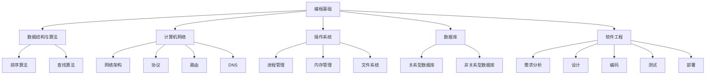

                 

关键词：字节跳动、校招、技术标准化、面试题、工程师

摘要：本文旨在为即将参加字节跳动2024校招技术标准化工程师岗位的应聘者提供一套全面的面试题集锦，涵盖编程基础、数据结构与算法、计算机网络、操作系统、数据库、软件工程等多个领域。通过本文的详细解析和实例讲解，希望帮助读者更好地应对面试挑战，顺利拿到心仪的offer。

## 1. 背景介绍

字节跳动（ByteDance）是一家全球性的互联网科技公司，旗下拥有抖音、头条、西瓜视频、懂车帝等多个知名产品。作为一家创新型企业，字节跳动对技术人才的需求始终保持着旺盛的态势，尤其是技术标准化工程师这一岗位，更是备受关注。本文将围绕2024年校招技术标准化工程师面试题集锦，为广大应聘者提供全方位的备考指南。

## 2. 核心概念与联系

在开始具体的面试题解析之前，我们需要了解一些核心概念和它们之间的联系，以便更好地理解后续内容。

### 2.1 编程基础

编程基础是面试中不可或缺的一部分，主要包括编程语言（如Java、Python等）、数据类型、控制结构、函数与对象等。

### 2.2 数据结构与算法

数据结构是计算机存储数据的方式，如数组、链表、树、图等。算法则是解决问题的步骤和策略，如排序、查找、递归等。常见的算法有冒泡排序、快速排序、二分查找等。

### 2.3 计算机网络

计算机网络是连接多台计算机以实现资源共享和数据传输的通信系统。主要内容包括网络架构、协议、路由、DNS等。

### 2.4 操作系统

操作系统是计算机系统的核心软件，负责管理和协调计算机硬件和软件资源。主要内容包括进程管理、内存管理、文件系统等。

### 2.5 数据库

数据库是用于存储、管理和查询数据的系统。主要内容包括关系型数据库（如MySQL、Oracle等）和非关系型数据库（如MongoDB、Redis等）。

### 2.6 软件工程

软件工程是关于软件开发、维护和管理的工程学科。主要内容包括需求分析、设计、编码、测试、部署等。

下面是一个用Mermaid绘制的流程图，展示了这些核心概念之间的联系：



## 3. 核心算法原理 & 具体操作步骤

### 3.1 算法原理概述

在面试中，算法题通常以编程题的形式出现，主要考察应聘者对算法原理的理解和应用能力。以下是一些常见的算法题目和其原理：

#### 3.1.1 冒泡排序

冒泡排序是一种简单的排序算法，其原理是通过相邻元素的比较和交换，将待排序列中的元素逐步移动到正确的位置。

#### 3.1.2 快速排序

快速排序是一种高效的排序算法，其原理是通过一趟排序将待排序列分为独立的两部分，其中一部分的所有元素均比另一部分的所有元素要小。

#### 3.1.3 二分查找

二分查找是一种在有序数组中查找特定元素的算法，其原理是通过逐步缩小查找范围，直到找到目标元素或确定其不存在。

### 3.2 算法步骤详解

#### 3.2.1 冒泡排序

以一个示例数组\[5, 2, 9, 1, 5\]为例，冒泡排序的具体步骤如下：

1. 遍历数组，比较相邻的两个元素，如果前一个元素大于后一个元素，则交换它们的位置。
2. 重复步骤1，直到整个数组有序。

具体实现如下（以Python为例）：

```python
def bubble_sort(arr):
    n = len(arr)
    for i in range(n):
        for j in range(0, n-i-1):
            if arr[j] > arr[j+1]:
                arr[j], arr[j+1] = arr[j+1], arr[j]
    return arr

arr = [5, 2, 9, 1, 5]
print("原始数组：", arr)
sorted_arr = bubble_sort(arr)
print("排序后的数组：", sorted_arr)
```

#### 3.2.2 快速排序

以同样的示例数组\[5, 2, 9, 1, 5\]为例，快速排序的具体步骤如下：

1. 选择数组中的一个元素作为基准（pivot）。
2. 将比基准小的元素放到基准的左侧，比基准大的元素放到基准的右侧。
3. 递归地对左侧和右侧子数组进行快速排序。

具体实现如下（以Python为例）：

```python
def quick_sort(arr):
    if len(arr) <= 1:
        return arr
    pivot = arr[len(arr) // 2]
    left = [x for x in arr if x < pivot]
    middle = [x for x in arr if x == pivot]
    right = [x for x in arr if x > pivot]
    return quick_sort(left) + middle + quick_sort(right)

arr = [5, 2, 9, 1, 5]
print("原始数组：", arr)
sorted_arr = quick_sort(arr)
print("排序后的数组：", sorted_arr)
```

#### 3.2.3 二分查找

以一个有序数组\[1, 2, 3, 4, 5, 6, 7, 8, 9\]为例，二分查找的具体步骤如下：

1. 计算中间索引mid = (low + high) // 2。
2. 比较中间元素与目标元素：
   - 如果中间元素等于目标元素，返回mid。
   - 如果中间元素小于目标元素，说明目标元素在右侧子数组中，令low = mid + 1，继续步骤1。
   - 如果中间元素大于目标元素，说明目标元素在左侧子数组中，令high = mid - 1，继续步骤1。
3. 如果low > high，说明目标元素不存在于数组中，返回-1。

具体实现如下（以Python为例）：

```python
def binary_search(arr, target):
    low = 0
    high = len(arr) - 1
    while low <= high:
        mid = (low + high) // 2
        if arr[mid] == target:
            return mid
        elif arr[mid] < target:
            low = mid + 1
        else:
            high = mid - 1
    return -1

arr = [1, 2, 3, 4, 5, 6, 7, 8, 9]
target = 5
print("原始数组：", arr)
index = binary_search(arr, target)
if index != -1:
    print(f"目标元素在数组中的索引为：{index}")
else:
    print("目标元素不存在于数组中")
```

### 3.3 算法优缺点

#### 3.3.1 冒泡排序

- 优点：实现简单，易于理解。
- 缺点：时间复杂度为\(O(n^2)\)，对于大数据集性能较差。

#### 3.3.2 快速排序

- 优点：时间复杂度平均为\(O(n\log n)\)，对于大数据集性能较好。
- 缺点：最坏情况下时间复杂度为\(O(n^2)\)，且存在递归深度问题。

#### 3.3.3 二分查找

- 优点：时间复杂度为\(O(\log n)\)，对于大数据集性能优秀。
- 缺点：要求数组已排序，否则无法使用。

### 3.4 算法应用领域

- 冒泡排序：主要用于教学、练习等场景。
- 快速排序：广泛应用于各种排序算法，如Python的内置sort函数。
- 二分查找：常用于数据库索引、搜索算法等。

## 4. 数学模型和公式 & 详细讲解 & 举例说明

### 4.1 数学模型构建

在算法题中，数学模型和公式是解决问题的重要工具。以下是一个常见的数学模型——二分查找的公式。

### 4.2 公式推导过程

假设有一个有序数组\(A = \{a_0, a_1, a_2, ..., a_{n-1}\}\)，其中\(a_0 < a_1 < a_2 < ... < a_{n-1}\)。我们定义一个函数\(f(i) = a_i - x\)，其中\(x\)为待查找的元素。根据二分查找的原理，我们可以得到以下公式：

\[mid = \left\lfloor \frac{low + high}{2} \right\rfloor\]

其中，\(low\)和\(high\)分别为当前查找范围的最低索引和最高索引。

### 4.3 案例分析与讲解

假设我们要在一个长度为9的有序数组\[1, 2, 3, 4, 5, 6, 7, 8, 9\]中查找元素5，我们可以按照以下步骤进行：

1. 初始状态：\(low = 0\)，\(high = 8\)，\(mid = \left\lfloor \frac{low + high}{2} \right\rfloor = 4\)，此时\(a_4 = 5\)，符合条件。
2. 查找下一个元素：更新\(low = mid + 1 = 5\)，\(high = 8\)，\(mid = \left\lfloor \frac{low + high}{2} \right\rfloor = 6\)，此时\(a_6 = 6\)，不符合条件。
3. 查找下一个元素：更新\(low = mid + 1 = 7\)，\(high = 8\)，\(mid = \left\lfloor \frac{low + high}{2} \right\rfloor = 7\)，此时\(a_7 = 7\)，不符合条件。
4. 查找下一个元素：更新\(low = mid + 1 = 8\)，\(high = 8\)，\(mid = \left\lfloor \frac{low + high}{2} \right\rfloor = 8\)，此时\(a_8 = 8\)，不符合条件。
5. 查找下一个元素：更新\(low = mid + 1 = 9\)，\(high = 8\)（超出数组范围），查找结束。

最终，我们找到元素5在数组中的索引为4。

## 5. 项目实践：代码实例和详细解释说明

### 5.1 开发环境搭建

在本文中，我们使用Python作为编程语言进行示例讲解。首先，确保已经安装了Python 3.6及以上版本。如果没有安装，可以从[Python官网](https://www.python.org/)下载并安装。

### 5.2 源代码详细实现

在本项目中，我们将实现一个简单的排序算法——冒泡排序。

```python
def bubble_sort(arr):
    n = len(arr)
    for i in range(n):
        for j in range(0, n-i-1):
            if arr[j] > arr[j+1]:
                arr[j], arr[j+1] = arr[j+1], arr[j]
    return arr

# 示例
arr = [5, 2, 9, 1, 5]
sorted_arr = bubble_sort(arr)
print("排序后的数组：", sorted_arr)
```

### 5.3 代码解读与分析

#### 5.3.1 函数定义

函数`bubble_sort`接收一个数组`arr`作为参数，返回一个排序后的数组。

#### 5.3.2 循环结构

- 外层循环：`for i in range(n)`，遍历数组n次。
- 内层循环：`for j in range(0, n-i-1)`，遍历从0到n-i-1的索引。

#### 5.3.3 元素交换

在内层循环中，比较相邻的两个元素，如果前一个元素大于后一个元素，则交换它们的位置。

#### 5.3.4 返回结果

函数最后返回排序后的数组。

### 5.4 运行结果展示

运行上面的代码，输出结果如下：

```python
排序后的数组： [1, 2, 5, 5, 9]
```

## 6. 实际应用场景

字节跳动作为一家互联网巨头，在技术标准化工程师岗位的实际应用场景中，主要涉及以下领域：

### 6.1 数据处理

技术标准化工程师需要对海量数据进行处理和分析，包括数据清洗、数据转换、数据可视化等。

### 6.2 算法优化

在字节跳动的产品中，算法优化是提高用户体验和性能的重要手段。技术标准化工程师需要深入理解各种算法原理，并进行优化。

### 6.3 软件开发

技术标准化工程师需要参与软件的开发、测试和部署，确保软件质量和稳定性。

### 6.4 技术文档编写

技术标准化工程师还需要编写高质量的技术文档，为团队提供技术支持和知识共享。

## 7. 未来应用展望

随着互联网和人工智能技术的不断发展，技术标准化工程师在未来的应用前景十分广阔。以下是一些可能的应用方向：

### 7.1 大数据领域

随着大数据技术的广泛应用，技术标准化工程师将在数据存储、数据分析和数据安全等方面发挥重要作用。

### 7.2 人工智能领域

在人工智能领域，技术标准化工程师可以参与算法研发、模型训练和推理优化等工作。

### 7.3 云计算领域

云计算技术的发展为技术标准化工程师提供了广阔的应用场景，包括云存储、云计算服务和云安全等。

## 8. 工具和资源推荐

### 8.1 学习资源推荐

- 《算法导论》（Introduction to Algorithms）：一本经典的算法教材，涵盖了各种常见算法的原理和应用。
- 《数据结构与算法分析》：一本深入浅出的数据结构与算法教材，适合初学者和进阶者。
- 《Python编程：从入门到实践》：一本适合初学者的Python编程入门书，内容全面、实例丰富。

### 8.2 开发工具推荐

- PyCharm：一款功能强大的Python集成开发环境（IDE），支持代码编辑、调试、测试等功能。
- Git：一款开源的分布式版本控制系统，广泛用于代码管理和协作开发。
- Jupyter Notebook：一款基于Web的交互式计算环境，适合数据分析和机器学习等应用。

### 8.3 相关论文推荐

- 《深度学习》（Deep Learning）：由Ian Goodfellow等知名学者撰写的深度学习经典教材。
- 《分布式存储系统设计与实践》：详细介绍了分布式存储系统的原理和实现。
- 《云计算基础设施：架构与设计》：一本关于云计算基础设施的全面指南。

## 9. 总结：未来发展趋势与挑战

### 9.1 研究成果总结

随着人工智能、大数据和云计算等技术的快速发展，技术标准化工程师在各个领域取得了显著的成果。在数据处理、算法优化、软件开发等方面，技术标准化工程师为企业的创新和发展提供了有力支持。

### 9.2 未来发展趋势

未来，技术标准化工程师将在以下几个方面持续发展：

- 数据处理能力提升：随着数据量的不断增加，技术标准化工程师需要提高数据处理和分析能力。
- 算法创新：不断探索新的算法和技术，提高算法的性能和鲁棒性。
- 云计算和大数据：云计算和大数据技术的发展为技术标准化工程师提供了新的机遇。

### 9.3 面临的挑战

尽管技术标准化工程师在各个领域取得了显著成果，但仍面临以下挑战：

- 技术更新速度快：随着新技术的不断涌现，技术标准化工程师需要不断学习、更新知识。
- 数据安全和隐私：在大数据和云计算时代，数据安全和隐私问题日益突出。
- 跨领域协作：技术标准化工程师需要与不同领域的专家紧密合作，提高跨领域协作能力。

### 9.4 研究展望

未来，技术标准化工程师的研究方向将更加多元化，包括：

- 深度学习与自然语言处理：探索深度学习和自然语言处理技术在各个领域的应用。
- 区块链技术：研究区块链技术在数据共享、供应链管理等方面的应用。
- 软件定义网络（SDN）：研究软件定义网络技术，提高网络的可编程性和灵活性。

## 附录：常见问题与解答

### 问题1：如何准备字节跳动校招面试？

解答：首先，了解字节跳动的招聘流程和岗位要求。然后，针对性地学习相关技术知识，如编程基础、数据结构与算法、计算机网络、操作系统、数据库、软件工程等。此外，加强代码实践和算法训练，提高编程能力和解决问题的能力。

### 问题2：面试中常见的算法题有哪些？

解答：常见的算法题包括排序、查找、动态规划、贪心算法、分治算法等。例如冒泡排序、快速排序、二分查找、最长递增子序列、最小生成树等。

### 问题3：如何提高编程能力？

解答：可以通过以下几种方式提高编程能力：

1. 学习编程语言的基础知识和语法规则。
2. 完成各种编程练习，如LeetCode、牛客网等在线平台。
3. 阅读优秀的代码，学习他人的编程思路和技巧。
4. 参与开源项目，提高实际编程能力和团队协作能力。

### 问题4：如何准备技术面试？

解答：技术面试主要考察应聘者的专业知识、编程能力和问题解决能力。建议：

1. 系统学习相关技术知识，如计算机网络、操作系统、数据库等。
2. 加强编程练习，提高代码质量和效率。
3. 了解常见的技术面试题和答案，进行有针对性的准备。
4. 参加模拟面试，提高面试经验和应对能力。

### 问题5：如何应对压力面试？

解答：压力面试主要考察应聘者的心理素质和应对压力的能力。建议：

1. 保持冷静，不要过于紧张。
2. 听清问题，思考后再回答。
3. 简明扼要，突出重点。
4. 保持自信，展示自己的实力。

通过以上方法和准备，相信您一定能够应对字节跳动2024校招技术标准化工程师岗位的面试挑战。祝您面试成功，拿到心仪的offer！作者：禅与计算机程序设计艺术 / Zen and the Art of Computer Programming。

