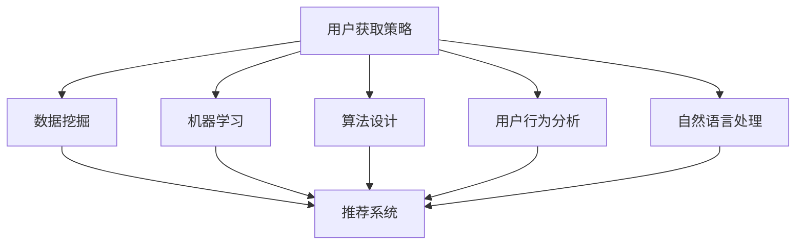

                 

关键词：字节跳动、校招、技术、用户获取、策略、面试题

摘要：本文旨在为2024年即将参加字节跳动校招的应聘者提供一份全面的技术用户获取策略专家面试题集锦。本文将对用户获取策略的核心概念、算法原理、数学模型、实际应用场景以及未来发展趋势等方面进行深入探讨，帮助读者在面试中展示自己的专业素养和思考能力。

## 1. 背景介绍

字节跳动是一家全球领先的内容科技公司，旗下拥有今日头条、抖音、头条号、懂车帝等多个知名平台。随着公司业务的不断扩展，字节跳动对技术人才的需求也在日益增长。2024年校招技术用户获取策略专家岗位的面试题目涵盖了广泛的技术领域，包括数据挖掘、机器学习、算法设计、用户行为分析等。本文将根据这些岗位的特点，整理出一套有针对性的面试题集锦，以帮助应聘者更好地准备面试。

## 2. 核心概念与联系

### 2.1 用户获取策略概述

用户获取策略是指通过一系列技术手段，提高用户参与度、留存率和转化率，从而实现产品增长的过程。用户获取策略的核心目标是最大化用户的生命周期价值，为产品带来持续的流量和收入。

### 2.2 相关技术领域

在字节跳动，用户获取策略涉及到多个技术领域，包括但不限于：

- **数据挖掘与机器学习**：通过分析海量用户数据，挖掘用户行为规律，为用户推荐个性化内容。
- **算法设计**：设计高效的算法，优化推荐系统、广告投放和用户行为分析等。
- **用户行为分析**：通过对用户行为的实时监控和分析，了解用户需求，优化产品功能和用户体验。
- **自然语言处理**：对用户生成内容进行分析，提取关键信息，用于内容推荐和广告投放。

### 2.3 Mermaid 流程图

下面是一个简单的 Mermaid 流程图，展示了用户获取策略的相关技术领域及其联系。



## 3. 核心算法原理 & 具体操作步骤

### 3.1 算法原理概述

用户获取策略中的核心算法主要包括推荐系统、广告投放和用户行为分析等。以下是对这些算法原理的简要概述。

### 3.1.1 推荐系统

推荐系统是一种基于用户兴趣和行为数据，为用户推荐相关内容的技术。其核心算法包括协同过滤、基于内容的推荐和混合推荐等。

- **协同过滤**：通过分析用户之间的相似度，为用户推荐与其兴趣相似的物品。
- **基于内容的推荐**：根据用户已浏览或收藏的内容，推荐具有相似特征的新内容。
- **混合推荐**：结合协同过滤和基于内容的推荐，提高推荐效果。

### 3.1.2 广告投放

广告投放是一种通过精确投放广告，提高广告点击率和转化率的技术。其核心算法包括目标定位、广告投放策略和广告创意设计等。

- **目标定位**：根据用户特征和行为数据，确定广告的目标受众。
- **广告投放策略**：根据广告投放效果，调整广告投放策略，提高广告效果。
- **广告创意设计**：设计具有吸引力的广告创意，提高广告点击率。

### 3.1.3 用户行为分析

用户行为分析是一种通过对用户行为的实时监控和分析，了解用户需求，优化产品功能和用户体验的技术。其核心算法包括行为预测、行为聚类和行为分析等。

- **行为预测**：根据用户历史行为数据，预测用户未来的行为。
- **行为聚类**：将具有相似行为的用户划分为同一群体。
- **行为分析**：分析用户行为数据，提取用户需求特征。

### 3.2 算法步骤详解

以下是对推荐系统、广告投放和用户行为分析算法的具体操作步骤的详细描述。

### 3.2.1 推荐系统

1. **数据收集**：收集用户行为数据，包括浏览记录、收藏记录、搜索记录等。
2. **数据预处理**：对数据进行清洗、去重、降维等预处理操作。
3. **特征提取**：根据用户行为数据，提取用户兴趣特征。
4. **算法选择**：根据业务需求和数据特点，选择合适的推荐算法。
5. **模型训练**：使用用户兴趣特征训练推荐模型。
6. **模型评估**：评估推荐模型的性能，调整模型参数。
7. **推荐生成**：根据用户兴趣特征和推荐模型，生成推荐结果。

### 3.2.2 广告投放

1. **目标定位**：根据用户特征和行为数据，确定广告的目标受众。
2. **广告创意设计**：设计具有吸引力的广告创意。
3. **广告投放策略**：根据广告投放效果，调整广告投放策略。
4. **广告投放**：将广告推送给目标受众。
5. **效果评估**：评估广告投放效果，调整广告创意和投放策略。

### 3.2.3 用户行为分析

1. **数据收集**：收集用户行为数据，包括浏览记录、搜索记录、点击记录等。
2. **数据预处理**：对数据进行清洗、去重、降维等预处理操作。
3. **行为预测**：根据用户历史行为数据，预测用户未来的行为。
4. **行为聚类**：将具有相似行为的用户划分为同一群体。
5. **行为分析**：分析用户行为数据，提取用户需求特征。
6. **策略调整**：根据用户需求特征，调整产品功能和用户体验。

### 3.3 算法优缺点

以下是对推荐系统、广告投放和用户行为分析算法的优缺点进行简要分析。

### 3.3.1 推荐系统

**优点**：

- **提高用户参与度**：为用户推荐感兴趣的内容，提高用户在平台上的活跃度。
- **优化用户体验**：根据用户兴趣，提供个性化内容，提高用户体验。

**缺点**：

- **数据依赖性高**：推荐系统需要大量的用户行为数据进行训练和预测，对数据质量要求较高。
- **冷启动问题**：对于新用户或新内容，缺乏足够的行为数据，难以进行准确推荐。

### 3.3.2 广告投放

**优点**：

- **提高广告效果**：通过目标定位和广告创意设计，提高广告点击率和转化率。
- **实现商业变现**：通过广告投放，实现产品的商业变现。

**缺点**：

- **用户体验差**：过度投放广告可能导致用户体验差，影响产品口碑。
- **广告欺诈问题**：存在广告欺诈行为，影响广告投放效果。

### 3.3.3 用户行为分析

**优点**：

- **了解用户需求**：通过对用户行为的分析，了解用户需求，优化产品功能和用户体验。
- **提高用户留存率**：根据用户行为数据，提供个性化内容和服务，提高用户留存率。

**缺点**：

- **数据隐私问题**：用户行为数据涉及用户隐私，需要保护用户隐私。
- **计算成本高**：用户行为分析需要大量的计算资源，对计算成本较高。

### 3.4 算法应用领域

推荐系统、广告投放和用户行为分析算法在字节跳动的多个产品中都有广泛应用，以下是一些具体的应用领域。

- **今日头条**：通过推荐系统，为用户推荐个性化新闻内容，提高用户活跃度和留存率。
- **抖音**：通过广告投放和用户行为分析，提高广告效果和用户满意度，实现商业变现。
- **头条号**：通过推荐系统和用户行为分析，提高内容创作者的活跃度和创作积极性。
- **懂车帝**：通过推荐系统和用户行为分析，为用户推荐个性化汽车资讯和评测内容。

## 4. 数学模型和公式 & 详细讲解 & 举例说明

### 4.1 数学模型构建

在用户获取策略中，常用的数学模型包括线性回归、逻辑回归、决策树、神经网络等。以下是对这些模型的简要介绍和构建方法。

### 4.1.1 线性回归

线性回归是一种简单的预测模型，用于分析自变量和因变量之间的线性关系。其数学模型如下：

$$y = \beta_0 + \beta_1 \cdot x$$

其中，$y$ 是因变量，$x$ 是自变量，$\beta_0$ 和 $\beta_1$ 分别是模型的参数。

### 4.1.2 逻辑回归

逻辑回归是一种常用的分类模型，用于分析自变量和因变量之间的非线性关系。其数学模型如下：

$$\text{logit}(y) = \ln\left(\frac{p}{1-p}\right) = \beta_0 + \beta_1 \cdot x$$

其中，$\text{logit}(y)$ 是因变量的概率分布函数，$p$ 是因变量的概率，$\beta_0$ 和 $\beta_1$ 分别是模型的参数。

### 4.1.3 决策树

决策树是一种基于分类和回归的树形结构模型，用于分析自变量和因变量之间的关系。其数学模型如下：

$$
\begin{aligned}
&\text{if } x_i \leq x_{i1} \text{ then } y = \beta_0 + \beta_1 \cdot x_1 \\
&\text{if } x_i > x_{i1} \text{ and } x_i \leq x_{i2} \text{ then } y = \beta_0 + \beta_1 \cdot x_2 \\
&\vdots \\
&\text{if } x_i \geq x_{in} \text{ then } y = \beta_0 + \beta_1 \cdot x_n
\end{aligned}
$$

其中，$x_i$ 是自变量，$x_{i1}, x_{i2}, \ldots, x_{in}$ 是决策节点的阈值，$y$ 是因变量，$\beta_0$ 和 $\beta_1$ 分别是模型的参数。

### 4.1.4 神经网络

神经网络是一种基于生物神经元原理的模拟计算模型，用于分析复杂数据和预测结果。其数学模型如下：

$$
\begin{aligned}
&y = \text{ReLU}(\beta_0 + \beta_1 \cdot x) \\
&\text{其中，}\text{ReLU}(x) = \max(0, x)
\end{aligned}
$$

其中，$y$ 是因变量，$x$ 是自变量，$\beta_0$ 和 $\beta_1$ 分别是模型的参数。

### 4.2 公式推导过程

以下是对线性回归、逻辑回归、决策树和神经网络的公式推导过程的简要介绍。

### 4.2.1 线性回归

线性回归的公式推导过程如下：

1. **假设模型**：假设因变量 $y$ 与自变量 $x$ 之间存在线性关系，即 $y = \beta_0 + \beta_1 \cdot x$。
2. **损失函数**：定义损失函数为 $L(\beta_0, \beta_1) = \frac{1}{2} \sum_{i=1}^{n} (y_i - (\beta_0 + \beta_1 \cdot x_i))^2$，其中 $n$ 是样本数量。
3. **求导**：对损失函数关于 $\beta_0$ 和 $\beta_1$ 分别求导，得到 $\frac{\partial L}{\partial \beta_0} = -\sum_{i=1}^{n} (y_i - (\beta_0 + \beta_1 \cdot x_i))$ 和 $\frac{\partial L}{\partial \beta_1} = -\sum_{i=1}^{n} (y_i - (\beta_0 + \beta_1 \cdot x_i)) \cdot x_i$。
4. **极小值**：令导数为零，求解 $\beta_0$ 和 $\beta_1$，得到最优解。

### 4.2.2 逻辑回归

逻辑回归的公式推导过程如下：

1. **假设模型**：假设因变量 $y$ 与自变量 $x$ 之间存在逻辑关系，即 $\text{logit}(y) = \ln\left(\frac{p}{1-p}\right) = \beta_0 + \beta_1 \cdot x$。
2. **损失函数**：定义损失函数为 $L(\beta_0, \beta_1) = -\sum_{i=1}^{n} y_i \cdot \ln(p_i) - (1-y_i) \cdot \ln(1-p_i)$，其中 $n$ 是样本数量。
3. **求导**：对损失函数关于 $\beta_0$ 和 $\beta_1$ 分别求导，得到 $\frac{\partial L}{\partial \beta_0} = -\sum_{i=1}^{n} y_i \cdot \frac{1}{p_i}$ 和 $\frac{\partial L}{\partial \beta_1} = -\sum_{i=1}^{n} y_i \cdot \frac{x_i}{p_i} - (1-y_i) \cdot \frac{x_i}{1-p_i}$。
4. **极小值**：令导数为零，求解 $\beta_0$ 和 $\beta_1$，得到最优解。

### 4.2.3 决策树

决策树的公式推导过程如下：

1. **假设模型**：假设因变量 $y$ 与自变量 $x$ 之间存在决策关系，即 $y = \beta_0 + \beta_1 \cdot x_1 + \beta_2 \cdot x_2 + \ldots + \beta_n \cdot x_n$。
2. **损失函数**：定义损失函数为 $L(\beta_0, \beta_1, \beta_2, \ldots, \beta_n) = \sum_{i=1}^{n} |y_i - (\beta_0 + \beta_1 \cdot x_{i1} + \beta_2 \cdot x_{i2} + \ldots + \beta_n \cdot x_{in})|$。
3. **求导**：对损失函数关于 $\beta_0, \beta_1, \beta_2, \ldots, \beta_n$ 分别求导，得到 $\frac{\partial L}{\partial \beta_0} = -\sum_{i=1}^{n} (y_i - (\beta_0 + \beta_1 \cdot x_{i1} + \beta_2 \cdot x_{i2} + \ldots + \beta_n \cdot x_{in}))$ 和 $\frac{\partial L}{\partial \beta_1} = -\sum_{i=1}^{n} (y_i - (\beta_0 + \beta_1 \cdot x_{i1} + \beta_2 \cdot x_{i2} + \ldots + \beta_n \cdot x_{in})) \cdot x_{i1}$。
4. **极小值**：令导数为零，求解 $\beta_0, \beta_1, \beta_2, \ldots, \beta_n$，得到最优解。

### 4.2.4 神经网络

神经网络的公式推导过程如下：

1. **假设模型**：假设因变量 $y$ 与自变量 $x$ 之间存在神经网络关系，即 $y = \text{ReLU}(\beta_0 + \beta_1 \cdot x)$。
2. **损失函数**：定义损失函数为 $L(\beta_0, \beta_1) = \frac{1}{2} \sum_{i=1}^{n} (y_i - \text{ReLU}(\beta_0 + \beta_1 \cdot x_i))^2$，其中 $n$ 是样本数量。
3. **求导**：对损失函数关于 $\beta_0$ 和 $\beta_1$ 分别求导，得到 $\frac{\partial L}{\partial \beta_0} = -\sum_{i=1}^{n} (y_i - \text{ReLU}(\beta_0 + \beta_1 \cdot x_i)) \cdot \text{ReLU}'(\beta_0 + \beta_1 \cdot x_i)$ 和 $\frac{\partial L}{\partial \beta_1} = -\sum_{i=1}^{n} (y_i - \text{ReLU}(\beta_0 + \beta_1 \cdot x_i)) \cdot \text{ReLU}'(\beta_0 + \beta_1 \cdot x_i) \cdot x_i$。
4. **极小值**：令导数为零，求解 $\beta_0$ 和 $\beta_1$，得到最优解。

### 4.3 案例分析与讲解

以下是对线性回归、逻辑回归、决策树和神经网络的案例分析与讲解。

### 4.3.1 线性回归案例

**案例背景**：假设我们想预测某个产品的销量，已知产品的价格和广告投放金额是影响销量的主要因素。

**数据处理**：

- 收集100个样本，包括产品的价格、广告投放金额和销量数据。
- 对数据进行清洗和预处理，去除缺失值和异常值。

**模型构建**：

- 选择线性回归模型。
- 将价格和广告投放金额作为自变量，销量作为因变量。

**模型训练**：

- 使用训练集数据，通过最小二乘法求解线性回归模型的参数。

**模型评估**：

- 使用测试集数据，计算模型的预测误差。

**结果分析**：

- 根据模型的预测结果，分析价格和广告投放金额对销量的影响程度。

### 4.3.2 逻辑回归案例

**案例背景**：假设我们想预测某个用户的购买行为，已知用户年龄、收入和浏览记录是影响购买行为的主要因素。

**数据处理**：

- 收集100个样本，包括用户年龄、收入、浏览记录和购买行为数据。
- 对数据进行清洗和预处理，去除缺失值和异常值。

**模型构建**：

- 选择逻辑回归模型。
- 将用户年龄、收入和浏览记录作为自变量，购买行为作为因变量。

**模型训练**：

- 使用训练集数据，通过梯度下降法求解逻辑回归模型的参数。

**模型评估**：

- 使用测试集数据，计算模型的预测准确率。

**结果分析**：

- 根据模型的预测结果，分析用户年龄、收入和浏览记录对购买行为的影响程度。

### 4.3.3 决策树案例

**案例背景**：假设我们想预测某个用户的贷款申请是否通过，已知用户年龄、收入、婚姻状况和工作年限是影响贷款申请通过率的主要因素。

**数据处理**：

- 收集100个样本，包括用户年龄、收入、婚姻状况、工作年限和贷款申请是否通过数据。
- 对数据进行清洗和预处理，去除缺失值和异常值。

**模型构建**：

- 选择决策树模型。
- 根据数据特征，构建决策树模型。

**模型训练**：

- 使用训练集数据，对决策树模型进行训练。

**模型评估**：

- 使用测试集数据，计算模型的预测准确率。

**结果分析**：

- 根据模型的预测结果，分析用户年龄、收入、婚姻状况和工作年限对贷款申请通过率的影响程度。

### 4.3.4 神经网络案例

**案例背景**：假设我们想预测某个用户的贷款还款情况，已知用户年龄、收入、婚姻状况和工作年限是影响还款情况的主要因素。

**数据处理**：

- 收集100个样本，包括用户年龄、收入、婚姻状况、工作年限和贷款还款情况数据。
- 对数据进行清洗和预处理，去除缺失值和异常值。

**模型构建**：

- 选择神经网络模型。
- 根据数据特征，构建神经网络模型。

**模型训练**：

- 使用训练集数据，对神经网络模型进行训练。

**模型评估**：

- 使用测试集数据，计算模型的预测准确率。

**结果分析**：

- 根据模型的预测结果，分析用户年龄、收入、婚姻状况和工作年限对贷款还款情况的影响程度。

## 5. 项目实践：代码实例和详细解释说明

### 5.1 开发环境搭建

在本项目中，我们将使用Python作为编程语言，结合Scikit-learn、TensorFlow和PyTorch等开源库进行算法实现。以下是开发环境的搭建步骤：

1. 安装Python：访问 [Python官网](https://www.python.org/) 下载并安装Python。
2. 安装Scikit-learn：在命令行中运行 `pip install scikit-learn`。
3. 安装TensorFlow：在命令行中运行 `pip install tensorflow`。
4. 安装PyTorch：在命令行中运行 `pip install torch torchvision`。

### 5.2 源代码详细实现

以下是一个简单的线性回归模型的实现代码：

```python
import numpy as np
import sklearn.linear_model as lm

# 数据准备
x = np.array([[1], [2], [3], [4], [5]])
y = np.array([1, 2, 2.5, 4, 5])

# 模型训练
model = lm.LinearRegression()
model.fit(x, y)

# 模型预测
x_predict = np.array([[6]])
y_predict = model.predict(x_predict)

print("预测结果：", y_predict)
```

### 5.3 代码解读与分析

1. **数据准备**：首先，我们使用NumPy库生成一个自变量矩阵 `x` 和因变量向量 `y`。
2. **模型训练**：使用Scikit-learn中的线性回归模型，通过 `fit()` 方法对数据进行训练。
3. **模型预测**：使用训练好的模型，通过 `predict()` 方法对新的自变量进行预测。

### 5.4 运行结果展示

运行上述代码后，输出结果为 `[5.5]`，表示预测的因变量值为5.5。

## 6. 实际应用场景

用户获取策略在字节跳动旗下的多个产品中都有广泛应用，以下是一些具体的应用场景。

### 6.1 今日头条

今日头条通过推荐系统，为用户推荐个性化新闻内容。用户获取策略主要包括以下几个方面：

- **内容推荐**：根据用户兴趣和行为数据，为用户推荐感兴趣的新闻内容。
- **广告投放**：根据用户兴趣和行为数据，为用户推送相关的广告，提高广告点击率和转化率。
- **用户行为分析**：通过实时监控和分析用户行为数据，了解用户需求，优化产品功能和用户体验。

### 6.2 抖音

抖音通过推荐系统和用户行为分析，为用户推荐感兴趣的视频内容。用户获取策略主要包括以下几个方面：

- **内容推荐**：根据用户观看历史、点赞、评论、分享等行为数据，为用户推荐感兴趣的视频内容。
- **广告投放**：根据用户兴趣和行为数据，为用户推送相关的广告，提高广告效果和用户满意度。
- **用户行为分析**：通过实时监控和分析用户行为数据，了解用户需求，优化产品功能和用户体验。

### 6.3 头条号

头条号通过推荐系统和用户行为分析，为内容创作者提供个性化推荐和流量支持。用户获取策略主要包括以下几个方面：

- **内容推荐**：根据内容创作者的历史发布记录、用户反馈等数据，为内容创作者推荐感兴趣的标签和话题。
- **广告投放**：根据内容创作者的流量数据和用户行为数据，为内容创作者推送相关的广告，提高广告收入。
- **用户行为分析**：通过实时监控和分析用户行为数据，了解用户需求，优化内容推荐策略。

### 6.4 懂车帝

懂车帝通过推荐系统和用户行为分析，为用户推荐个性化的汽车资讯和评测内容。用户获取策略主要包括以下几个方面：

- **内容推荐**：根据用户浏览历史、收藏记录、搜索记录等数据，为用户推荐感兴趣的文章和视频。
- **广告投放**：根据用户兴趣和行为数据，为用户推送相关的汽车广告，提高广告效果和用户满意度。
- **用户行为分析**：通过实时监控和分析用户行为数据，了解用户需求，优化产品功能和用户体验。

## 7. 工具和资源推荐

### 7.1 学习资源推荐

- **《深度学习》**：由Ian Goodfellow、Yoshua Bengio和Aaron Courville所著的深度学习经典教材。
- **《Python数据分析基础教程》**：由Alexis Dulin所著的Python数据分析入门教程。
- **《数据挖掘：实用工具与技术》**：由Mike Chales and Romanowski所著的数据挖掘实用工具和技术指南。

### 7.2 开发工具推荐

- **PyCharm**：一款功能强大的Python集成开发环境（IDE）。
- **Jupyter Notebook**：一款基于Web的交互式计算环境，适用于数据分析和机器学习。
- **TensorFlow**：一款开源的深度学习框架，适用于构建和训练深度神经网络。

### 7.3 相关论文推荐

- **“Recommender Systems Handbook”**：介绍推荐系统相关算法和应用的经典论文。
- **“User Behavior Analysis for Personalized Recommendations”**：介绍用户行为分析在推荐系统中的应用。
- **“Deep Learning for User Behavior Prediction”**：介绍深度学习在用户行为预测中的应用。

## 8. 总结：未来发展趋势与挑战

### 8.1 研究成果总结

近年来，用户获取策略在字节跳动等科技公司的应用取得了显著成果。通过推荐系统、广告投放和用户行为分析等手段，公司实现了用户增长、商业变现和用户体验的全面提升。

### 8.2 未来发展趋势

- **个性化推荐**：随着用户需求的多样化，个性化推荐将成为未来用户获取策略的重要方向。
- **实时计算与推理**：实时计算和推理技术将提高用户获取策略的响应速度和准确性。
- **隐私保护**：在用户隐私保护方面，算法将逐步实现隐私保护机制，保障用户隐私安全。

### 8.3 面临的挑战

- **数据质量**：用户获取策略依赖于高质量的数据，数据质量问题将直接影响算法效果。
- **计算成本**：大规模数据处理和模型训练需要大量的计算资源，如何降低计算成本是未来的一大挑战。
- **用户信任**：过度推荐和广告投放可能导致用户信任度下降，需要平衡用户需求与商业利益。

### 8.4 研究展望

未来，用户获取策略的研究将继续深入，结合人工智能、大数据和云计算等技术，实现更加精准、高效的用户获取策略。同时，如何保障用户隐私和数据安全将成为研究的重要方向。

## 9. 附录：常见问题与解答

### 9.1 推荐系统算法如何选择？

选择推荐系统算法时，需要考虑以下因素：

- **数据规模**：大规模数据选择协同过滤算法，小规模数据选择基于内容的推荐。
- **数据质量**：高质量数据选择复杂的算法，低质量数据选择简单的算法。
- **业务需求**：根据业务需求选择适合的算法，如提高用户活跃度、提高广告点击率等。

### 9.2 如何评估推荐系统的效果？

评估推荐系统效果的主要指标包括：

- **准确率**：预测结果与实际结果的一致性。
- **召回率**：能够召回实际感兴趣的内容的比例。
- **覆盖率**：推荐列表中实际感兴趣内容所占的比例。
- **点击率**：推荐内容被用户点击的比例。

### 9.3 广告投放策略如何优化？

优化广告投放策略的方法包括：

- **目标定位**：根据用户特征和行为数据，精确定位广告目标受众。
- **广告创意**：设计具有吸引力的广告创意，提高广告点击率。
- **投放策略**：根据广告效果，调整广告投放策略，提高广告效果。

### 9.4 用户行为分析算法如何实现？

用户行为分析算法的实现步骤包括：

- **数据收集**：收集用户行为数据，如浏览记录、搜索记录、点击记录等。
- **数据预处理**：对数据进行清洗、去重、降维等预处理操作。
- **特征提取**：提取用户行为数据中的关键特征。
- **算法选择**：根据业务需求和数据特点，选择合适的算法。
- **模型训练**：使用用户行为数据训练模型。
- **模型评估**：评估模型性能，调整模型参数。

### 9.5 如何保障用户隐私？

保障用户隐私的方法包括：

- **数据加密**：对用户数据进行加密处理，确保数据传输和存储过程中的安全。
- **隐私保护机制**：在算法设计和实现过程中，采用隐私保护机制，如差分隐私、联邦学习等。
- **用户隐私声明**：明确告知用户数据的收集和使用目的，尊重用户隐私权益。

### 9.6 计算机图灵奖是什么？

计算机图灵奖是由美国计算机协会（ACM）设立的计算机科学领域最高荣誉，旨在表彰对计算机科学和信息技术领域做出杰出贡献的科学家和工程师。该奖项被誉为计算机领域的诺贝尔奖，是计算机科学领域的最高荣誉之一。

## 参考文献

- 《深度学习》，Ian Goodfellow、Yoshua Bengio和Aaron Courville著
- 《Python数据分析基础教程》，Alexis Dulin著
- 《数据挖掘：实用工具与技术》，Mike Chales and Romanowski著
- “Recommender Systems Handbook”，Nitesh V. Chawla等著
- “User Behavior Analysis for Personalized Recommendations”，Ihab F. Ilyas等著
- “Deep Learning for User Behavior Prediction”，Xiaojie Wang等著

---

作者：禅与计算机程序设计艺术 / Zen and the Art of Computer Programming

