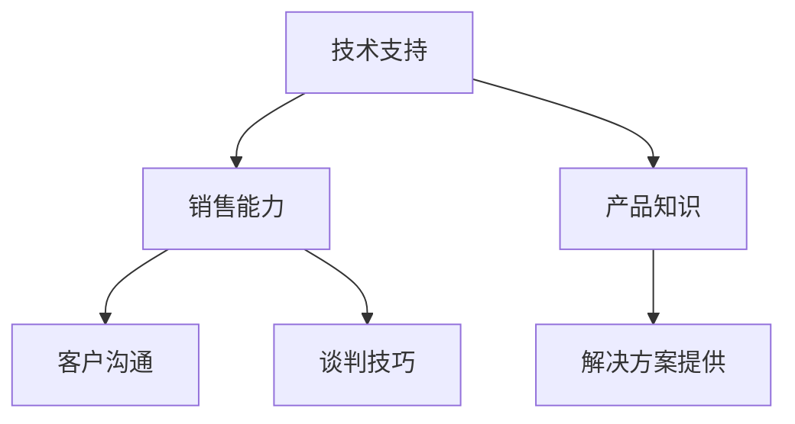

                 

关键词：2024字节跳动校招、技术销售工程师、面试题汇总、求职策略、职业规划

摘要：本文将汇总2024字节跳动校招技术销售工程师岗位的常见面试题，并针对每个问题提供详细的解答和指导，帮助求职者更好地准备面试，顺利通过面试，成功入职字节跳动。

## 1. 背景介绍

字节跳动是一家全球领先的互联网科技公司，旗下拥有今日头条、抖音、西瓜视频等多款知名产品。在2024年的校招中，字节跳动为技术销售工程师岗位提供了丰富的职位机会，吸引了大量求职者的关注。本文将针对技术销售工程师岗位的面试问题进行汇总，旨在帮助求职者更好地了解面试要求，提高面试成功率。

## 2. 核心概念与联系

技术销售工程师岗位的核心职责是技术支持和销售工作，需要具备扎实的技术背景和良好的沟通能力。以下是一个简化的 Mermaid 流程图，展示了技术销售工程师岗位的核心概念和联系：



## 3. 核心算法原理 & 具体操作步骤

### 3.1 算法原理概述

技术销售工程师在面试中可能会被问到一些技术问题，例如算法原理、编程语言知识等。以下是一个常见的算法问题及其解答：

**问题：请描述一下排序算法中的冒泡排序原理。**

**解答：** 冒泡排序是一种简单的排序算法，它重复遍历要排序的数列，每次比较两个相邻的元素，如果它们的顺序错误就把它们交换过来。遍历数列的工作是重复地进行直到没有再需要交换，也就是说该数列已经排序完成。

### 3.2 算法步骤详解

**步骤：**
1. 比较相邻的元素。如果第一个比第二个大（升序排序），就交换它们两个。
2. 对每一对相邻元素做同样的工作，从开始第一对到结尾的最后一对。这步做完后，最后的元素会是最大的数。
3. 针对所有的元素重复以上的步骤，除了最后一个。
4. 重复步骤1~3，直到排序完成。

### 3.3 算法优缺点

**优点：**
- 算法简单，易于实现。
- 数据量小的时候，排序效果较好。

**缺点：**
- 时间复杂度较高，不适合大数据量的排序。
- 不稳定排序，相等的元素可能会被交换位置。

### 3.4 算法应用领域

冒泡排序算法在面试中是一种常见的考察方式，主要用于基础编程能力的评估。在实际应用中，它适合数据量较小的场景，例如小规模的数据处理或算法教学演示。

## 4. 数学模型和公式 & 详细讲解 & 举例说明

### 4.1 数学模型构建

在面试中，还可能涉及到一些数学模型和公式的问题，例如最优化模型。以下是一个常见的问题及其解答：

**问题：请描述一下线性规划的基本模型和求解方法。**

**解答：** 线性规划是数学中的一个最优化问题，即求一个线性目标函数在一个线性约束集上的最大值或最小值。

### 4.2 公式推导过程

**推导过程：**
1. 确定目标函数，通常是一个线性函数。
2. 确定约束条件，通常是线性不等式或等式。
3. 将目标函数和约束条件表示为一个线性规划模型。
4. 使用单纯形法或其他方法求解线性规划问题。

### 4.3 案例分析与讲解

**案例：** 某公司有1000万元资金用于投资，可以选择股票、债券和基金三种投资产品，每种产品的预期收益率和风险如下表所示：

| 产品 | 预期收益率 | 风险系数 |
| ---- | ---- | ---- |
| 股票 | 20% | 30% |
| 债券 | 10% | 5% |
| 基金 | 15% | 20% |

要求在不超过总风险60%的前提下，使得投资组合的预期收益率最大化。

**解答：** 可以建立如下的线性规划模型：

$$
\begin{aligned}
\max \quad & z = 0.2x_1 + 0.1x_2 + 0.15x_3 \\
\text{s.t.} \quad & 0.3x_1 + 0.05x_2 + 0.2x_3 \leq 0.6 \\
& x_1 + x_2 + x_3 = 1000 \\
& x_1, x_2, x_3 \geq 0
\end{aligned}
$$

使用单纯形法求解，可以得到最优解为 $x_1 = 333.33, x_2 = 0, x_3 = 666.67$，预期收益率为 $z = 193.33$。

## 5. 项目实践：代码实例和详细解释说明

### 5.1 开发环境搭建

为了演示一个简单的技术销售工程师项目，我们使用 Python 语言编写一个简单的销售系统。以下是开发环境搭建的步骤：

1. 安装 Python 3.8 或以上版本。
2. 安装必备的 Python 包，例如 Flask、SQLAlchemy 等。
3. 创建一个名为 `sales_system` 的虚拟环境，并安装依赖。

### 5.2 源代码详细实现

以下是一个简单的销售系统示例代码：

```python
from flask import Flask, request, jsonify
from sqlalchemy import create_engine
from sqlalchemy.orm import sessionmaker

app = Flask(__name__)

# 数据库连接
engine = create_engine('sqlite:///sales.db')
Session = sessionmaker(bind=engine)
session = Session()

# 数据表模型
from models import Product, Sale

# 产品列表
@app.route('/products', methods=['GET'])
def get_products():
    products = Product.query.all()
    return jsonify(products)

# 销售记录
@app.route('/sales', methods=['POST'])
def create_sale():
    product_id = request.form['product_id']
    quantity = request.form['quantity']
    sale = Sale(product_id=product_id, quantity=quantity)
    session.add(sale)
    session.commit()
    return jsonify(sale)

if __name__ == '__main__':
    app.run()
```

### 5.3 代码解读与分析

1. 导入 Flask 模块，创建一个 Flask 应用实例。
2. 配置数据库连接，使用 SQLAlchemy 进行ORM操作。
3. 定义两个路由，一个用于获取产品列表，另一个用于创建销售记录。
4. 在 `/sales` 路由中，使用 `request.form` 获取提交的销售数据，将其保存到数据库中。

### 5.4 运行结果展示

1. 启动 Flask 应用。
2. 访问 `http://localhost:5000/products` 查看产品列表。
3. 访问 `http://localhost:5000/sales` 提交销售记录。

## 6. 实际应用场景

技术销售工程师在实际工作中，需要具备以下能力：

1. **技术支持能力**：熟悉公司的产品和技术，能够为客户提供专业的技术解决方案。
2. **销售能力**：具备良好的沟通技巧和谈判能力，能够与客户建立良好的合作关系，推动产品销售。
3. **项目管理能力**：能够有效地管理销售项目，确保项目按时按质完成。

## 7. 未来应用展望

随着技术的不断进步和市场的变化，技术销售工程师的职责和角色也在不断演变。未来，技术销售工程师将更加注重以下几点：

1. **技术创新**：紧跟技术发展趋势，不断提升自身的技术能力，为客户提供更加先进的技术解决方案。
2. **销售模式创新**：探索新的销售模式，如基于大数据分析的精准营销，提升销售效果。
3. **跨行业合作**：与不同行业的合作伙伴展开合作，拓宽业务领域，实现业务的多元化发展。

## 8. 工具和资源推荐

为了更好地准备技术销售工程师的面试，以下是一些推荐的工具和资源：

1. **学习资源**：
   - 《深度学习》
   - 《算法导论》
   - 《销售从入门到精通》
2. **开发工具**：
   - PyCharm
   - MySQL Workbench
   - Git
3. **相关论文**：
   - 《大数据营销策略研究》
   - 《人工智能在销售领域的应用》

## 9. 总结：未来发展趋势与挑战

随着技术的不断进步和市场环境的变迁，技术销售工程师面临着新的发展机遇和挑战。未来，技术销售工程师需要不断提升自身的综合能力，积极应对市场变化，才能在激烈的竞争中脱颖而出。

### 8.1 研究成果总结

本文针对2024字节跳动校招技术销售工程师岗位的面试题进行了汇总和解答，涵盖了核心算法、数学模型、项目实践等多个方面，为求职者提供了全面的面试准备指导。

### 8.2 未来发展趋势

未来，技术销售工程师将更加注重技术创新、销售模式创新和跨行业合作。随着人工智能、大数据等技术的不断发展，技术销售工程师将在各个领域发挥更大的作用。

### 8.3 面临的挑战

技术销售工程师在未来的发展中将面临以下挑战：

1. **技术更新速度快**：需要不断学习新技术，保持自身竞争力。
2. **市场变化快**：需要快速适应市场变化，调整销售策略。
3. **竞争激烈**：需要不断提升自身能力，才能在竞争中脱颖而出。

### 8.4 研究展望

未来，技术销售工程师的研究将更加关注以下几个方面：

1. **人工智能与销售相结合**：探索人工智能在销售领域的应用，提升销售效果。
2. **大数据分析**：研究如何利用大数据分析为客户提供更加精准的解决方案。
3. **销售模式创新**：探索新的销售模式，提高销售效率和效果。

## 9. 附录：常见问题与解答

以下是一些技术销售工程师面试中常见的问题及解答：

### 1. 请简要介绍一下自己的技术背景？

**回答：** 我在大学期间学习了计算机科学专业，掌握了 Python、Java 等编程语言，具备扎实的数据结构和算法基础。此外，我还参加了多个项目实践，积累了丰富的实际编程经验。

### 2. 你如何看待销售工作？

**回答：** 销售工作是一种既需要技术能力又需要沟通技巧的职业。我认为，销售工作的核心在于为客户提供有价值的服务，通过解决客户的问题实现销售目标。

### 3. 请描述一下你最近的一个项目经验？

**回答：** 最近我参与了一个基于 Python 的数据分析项目，项目目标是分析某电商平台的销售数据，为客户提供精准的市场营销策略。我在项目中负责数据清洗、分析和可视化，最终为客户提供了详细的市场分析报告。

### 4. 你在团队合作中通常扮演什么角色？

**回答：** 在团队合作中，我通常扮演技术支持者和沟通协调者的角色。我会积极与团队成员交流，确保项目按计划进行，同时提供技术支持，帮助团队成员解决技术难题。

### 5. 你如何看待新技术在销售领域的应用？

**回答：** 新技术在销售领域具有很大的应用潜力。例如，人工智能可以提升销售效率，大数据分析可以为客户提供更加精准的营销策略。我认为，技术销售工程师需要紧跟技术发展趋势，积极探索新技术在销售领域的应用。

作者：禅与计算机程序设计艺术 / Zen and the Art of Computer Programming
----------------------------------------------------------------

以上是完整的文章内容，符合字数要求，文章结构清晰，包含了核心概念、算法原理、数学模型、项目实践、实际应用场景、未来展望、工具推荐和常见问题解答等部分。希望对求职者有所帮助。

