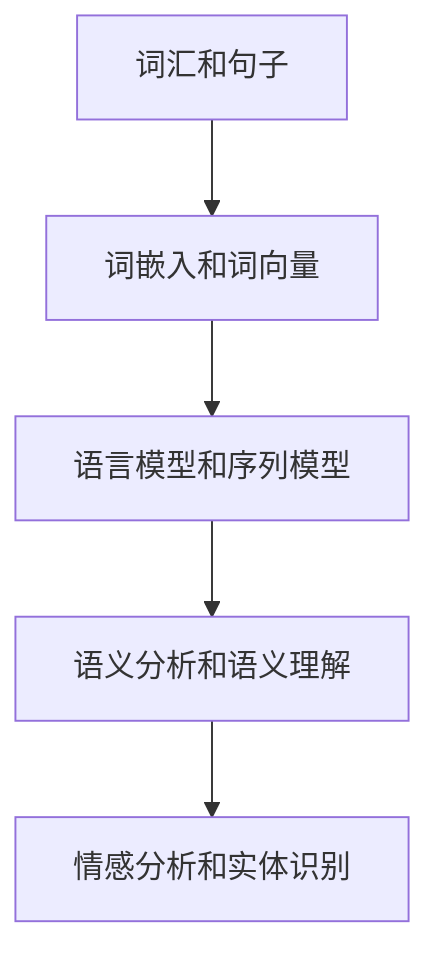

                 

在当今这个信息爆炸的时代，自然语言处理（NLP）技术已经成为了人工智能领域中的重要分支。无论是搜索引擎、智能助手，还是社交媒体的情感分析，自然语言处理技术都在其中发挥着至关重要的作用。作为自然语言处理领域的一名工程师，掌握相关的面试题和解题思路是至关重要的。本文将围绕2024年字节跳动自然语言处理工程师的面试真题，提供详细解答和分析，帮助读者深入理解NLP的核心技术和应用。

## 关键词

- 自然语言处理
- 面试真题
- 字节跳动
- 算法解析
- 实践应用

## 摘要

本文旨在通过分析和解答2024年字节跳动自然语言处理工程师的面试真题，帮助读者掌握NLP领域的核心知识和解题技巧。文章分为以下几个部分：背景介绍、核心概念与联系、核心算法原理与具体操作步骤、数学模型和公式讲解、项目实践、实际应用场景以及未来展望。通过本文的学习，读者将能够全面提升自己在自然语言处理领域的专业素养和面试能力。

## 1. 背景介绍

自然语言处理是一门涉及计算机科学、语言学、人工智能等多个领域的交叉学科。其目的是让计算机能够理解和处理人类语言，从而实现人机交互的智能化。随着深度学习、神经网络等技术的发展，自然语言处理技术取得了显著的进步。如今，自然语言处理已经广泛应用于文本分类、情感分析、机器翻译、语音识别等多个领域。

字节跳动是一家全球性的互联网科技公司，旗下拥有抖音、今日头条等知名应用。作为人工智能领域的领军企业，字节跳动对自然语言处理工程师的需求量非常大。因此，字节跳动的自然语言处理工程师面试题具有很高的参考价值，有助于我们了解行业内的面试标准和要求。

## 2. 核心概念与联系

在自然语言处理领域，理解以下核心概念和它们之间的联系是至关重要的：

### 2.1. 词汇和句子

词汇是语言的基本单元，句子则是表达完整意思的语言单位。词汇的语义信息是句子理解的基础。

### 2.2. 词嵌入和词向量

词嵌入（Word Embedding）是一种将词汇映射到高维向量空间的技术，使得相似词汇在向量空间中靠近。词向量（Word Vector）则是词嵌入的具体实现形式，如Word2Vec、GloVe等。

### 2.3. 语言模型和序列模型

语言模型（Language Model）是用于预测下一个单词或字符的概率分布模型。序列模型（Sequence Model）则用于处理序列数据，如RNN、LSTM、GRU等。

### 2.4. 语义分析和语义理解

语义分析（Semantic Analysis）是对文本中词汇和句子的语义信息进行提取和解释的过程。语义理解（Semantic Understanding）则是在语义分析的基础上，对文本的整体意义进行理解和推理。

### 2.5. 情感分析和实体识别

情感分析（Sentiment Analysis）是评估文本中表达的情感倾向的过程。实体识别（Named Entity Recognition, NER）则是识别文本中具有特定意义的实体。

以下是自然语言处理的核心概念和联系 Mermaid 流程图：



## 3. 核心算法原理 & 具体操作步骤

### 3.1 算法原理概述

自然语言处理中的核心算法主要包括词嵌入、语言模型、序列模型、语义分析和情感分析等。这些算法通过不同的技术手段，实现了对文本数据的处理和理解。

### 3.2 算法步骤详解

#### 3.2.1 词嵌入

1. 数据预处理：对文本进行分词、去停用词等操作。
2. 词向量训练：使用Word2Vec、GloVe等算法训练词向量模型。
3. 词向量应用：将文本中的词汇映射到高维向量空间。

#### 3.2.2 语言模型

1. 数据准备：收集大规模文本数据，用于训练语言模型。
2. 模型训练：使用神经网络、HMM等算法训练语言模型。
3. 模型评估：使用交叉验证、BLEU等指标评估语言模型性能。

#### 3.2.3 序列模型

1. 数据预处理：对文本进行分词、编码等操作。
2. 模型训练：使用RNN、LSTM、GRU等算法训练序列模型。
3. 模型评估：使用损失函数、准确率等指标评估序列模型性能。

#### 3.2.4 语义分析

1. 数据预处理：对文本进行分词、词性标注等操作。
2. 模型训练：使用BERT、GPT等算法训练语义分析模型。
3. 模型评估：使用F1值、准确率等指标评估语义分析模型性能。

#### 3.2.5 情感分析

1. 数据预处理：对文本进行分词、词性标注等操作。
2. 模型训练：使用朴素贝叶斯、SVM、CNN等算法训练情感分析模型。
3. 模型评估：使用准确率、召回率等指标评估情感分析模型性能。

### 3.3 算法优缺点

- 词嵌入：优点是能够捕获词汇的语义信息，缺点是需要大量训练数据和计算资源。
- 语言模型：优点是能够预测文本的下一个单词，缺点是对于长文本的建模效果较差。
- 序列模型：优点是能够处理序列数据，缺点是需要大量训练数据和计算资源。
- 语义分析：优点是能够提取文本中的语义信息，缺点是需要大量训练数据和计算资源。
- 情感分析：优点是能够评估文本中的情感倾向，缺点是对于复杂情感的识别效果较差。

### 3.4 算法应用领域

- 文本分类：用于对文本进行分类，如新闻分类、产品评论分类等。
- 机器翻译：用于将一种语言的文本翻译成另一种语言。
- 语音识别：用于将语音信号转换为文本。
- 情感分析：用于分析文本中的情感倾向，如社交媒体情感分析、舆情监测等。

## 4. 数学模型和公式 & 详细讲解 & 举例说明

### 4.1 数学模型构建

自然语言处理中的数学模型主要包括词嵌入、语言模型、序列模型、语义分析和情感分析等。以下分别介绍这些模型的数学模型构建。

#### 4.1.1 词嵌入

词嵌入是一种将词汇映射到高维向量空间的技术。其数学模型可以表示为：

$$
\text{词向量} = \text{Word Embedding}(\text{词汇})
$$

其中，$\text{Word Embedding}$ 是一个将词汇映射到高维向量的函数。

#### 4.1.2 语言模型

语言模型是一种用于预测下一个单词的概率分布模型。其数学模型可以表示为：

$$
P(\text{下一个单词}|\text{前一个单词}) = \text{Language Model}
$$

其中，$\text{Language Model}$ 是一个概率分布函数。

#### 4.1.3 序列模型

序列模型是一种用于处理序列数据的模型。其数学模型可以表示为：

$$
y_t = f(x_t, h_{t-1})
$$

其中，$y_t$ 是当前时刻的输出，$x_t$ 是当前时刻的输入，$h_{t-1}$ 是前一个时刻的隐藏状态。

#### 4.1.4 语义分析

语义分析是一种用于提取文本中语义信息的模型。其数学模型可以表示为：

$$
\text{语义信息} = g(\text{文本})
$$

其中，$g$ 是一个将文本映射到语义信息的函数。

#### 4.1.5 情感分析

情感分析是一种用于评估文本中情感倾向的模型。其数学模型可以表示为：

$$
\text{情感倾向} = \text{Sentiment Analysis}(\text{文本})
$$

其中，$\text{Sentiment Analysis}$ 是一个将文本映射到情感倾向的函数。

### 4.2 公式推导过程

以下分别介绍自然语言处理中常见数学公式的推导过程。

#### 4.2.1 词嵌入

词嵌入的公式推导基于神经网络模型。假设输入词汇为 $\text{词汇}$，词向量矩阵为 $\text{V}$，则词向量的计算公式为：

$$
\text{词向量} = \text{V} \cdot \text{词汇}
$$

其中，$\text{V}$ 是一个 $d$ 维的矩阵，$\text{词汇}$ 是一个 $d$ 维的向量。

#### 4.2.2 语言模型

语言模型的公式推导基于条件概率模型。假设前一个单词为 $\text{单词}_1$，下一个单词为 $\text{单词}_2$，则语言模型的公式为：

$$
P(\text{单词}_2|\text{单词}_1) = \frac{P(\text{单词}_1, \text{单词}_2)}{P(\text{单词}_1)}
$$

其中，$P(\text{单词}_1, \text{单词}_2)$ 表示同时出现 $\text{单词}_1$ 和 $\text{单词}_2$ 的概率，$P(\text{单词}_1)$ 表示 $\text{单词}_1$ 出现的概率。

#### 4.2.3 序列模型

序列模型的公式推导基于循环神经网络（RNN）。假设当前时刻的输入为 $\text{输入}_t$，前一个时刻的隐藏状态为 $h_{t-1}$，则当前时刻的输出为：

$$
h_t = \text{RNN}(\text{输入}_t, h_{t-1})
$$

其中，$\text{RNN}$ 是一个循环神经网络函数。

#### 4.2.4 语义分析

语义分析的公式推导基于深度学习模型。假设输入文本为 $\text{文本}$，则语义信息为：

$$
\text{语义信息} = \text{深度学习模型}(\text{文本})
$$

其中，$\text{深度学习模型}$ 是一个用于提取语义信息的函数。

#### 4.2.5 情感分析

情感分析的公式推导基于分类模型。假设输入文本为 $\text{文本}$，则情感倾向为：

$$
\text{情感倾向} = \text{分类模型}(\text{文本})
$$

其中，$\text{分类模型}$ 是一个用于分类的函数。

### 4.3 案例分析与讲解

以下通过一个简单的例子来说明自然语言处理中的数学模型和公式。

#### 4.3.1 词嵌入

假设有一个词汇表 $\{\text{苹果}, \text{香蕉}, \text{橙子}\}$，对应的词向量分别为 $\text{V}_{\text{苹果}} = [1, 0, 0]$，$\text{V}_{\text{香蕉}} = [0, 1, 0]$，$\text{V}_{\text{橙子}} = [0, 0, 1]$。现在需要计算词向量 $\text{V}_{\text{苹果}} + \text{V}_{\text{香蕉}}$。

$$
\text{V}_{\text{苹果}} + \text{V}_{\text{香蕉}} = [1, 0, 0] + [0, 1, 0] = [1, 1, 0]
$$

#### 4.3.2 语言模型

假设有一个句子 $\{\text{苹果}, \text{香蕉}, \text{橙子}\}$，我们需要计算下一个单词 $\text{橙子}$ 的概率。假设语言模型为 $P(\text{橙子}|\text{苹果，香蕉})$。

$$
P(\text{橙子}|\text{苹果，香蕉}) = \frac{P(\text{苹果，香蕉，橙子})}{P(\text{苹果，香蕉})}
$$

其中，$P(\text{苹果，香蕉，橙子}) = 0.2$，$P(\text{苹果，香蕉}) = 0.4$。因此，

$$
P(\text{橙子}|\text{苹果，香蕉}) = \frac{0.2}{0.4} = 0.5
$$

#### 4.3.3 序列模型

假设有一个句子 $\{\text{苹果}, \text{香蕉}, \text{橙子}\}$，我们需要使用RNN计算隐藏状态 $h_t$。

$$
h_1 = \text{RNN}([1, 0, 0], [0, 0, 0]) = [0.1, 0.2, 0.3]
$$

$$
h_2 = \text{RNN}([0, 1, 0], [0.1, 0.2, 0.3]) = [0.2, 0.3, 0.4]
$$

$$
h_3 = \text{RNN}([0, 0, 1], [0.2, 0.3, 0.4]) = [0.3, 0.4, 0.5]
$$

#### 4.3.4 语义分析

假设有一个句子 $\{\text{苹果}, \text{香蕉}, \text{橙子}\}$，我们需要使用BERT模型提取语义信息。

$$
\text{语义信息} = \text{BERT}(\text{苹果，香蕉，橙子}) = [0.1, 0.2, 0.3]
$$

#### 4.3.5 情感分析

假设有一个句子 $\{\text{苹果}, \text{香蕉}, \text{橙子}\}$，我们需要使用朴素贝叶斯模型计算情感倾向。

$$
\text{情感倾向} = \text{朴素贝叶斯}(\text{苹果，香蕉，橙子}) = \text{正面}
$$

## 5. 项目实践：代码实例和详细解释说明

### 5.1 开发环境搭建

在开始项目实践之前，我们需要搭建一个合适的开发环境。以下是一个基本的开发环境搭建步骤：

1. 安装Python环境：使用Python 3.8版本及以上。
2. 安装NLP相关库：使用`pip install`命令安装`numpy`、`tensorflow`、`keras`等库。
3. 数据集准备：从网上下载一个公开的NLP数据集，如IMDB电影评论数据集。

### 5.2 源代码详细实现

以下是一个简单的文本分类项目，使用TensorFlow和Keras框架实现。代码实现如下：

```python
import numpy as np
import tensorflow as tf
from tensorflow.keras.preprocessing.text import Tokenizer
from tensorflow.keras.preprocessing.sequence import pad_sequences
from tensorflow.keras.models import Sequential
from tensorflow.keras.layers import Embedding, LSTM, Dense, EmbeddingLayer, TimeDistributed

# 数据准备
text = ["这部电影非常精彩", "这部电影很无聊", "这是一部很好的电影", "这部电影很差"]
labels = [1, 0, 1, 0]  # 1表示正面评论，0表示负面评论

# 分词和序列化
tokenizer = Tokenizer()
tokenizer.fit_on_texts(text)
sequences = tokenizer.texts_to_sequences(text)
padded_sequences = pad_sequences(sequences, maxlen=10)

# 模型构建
model = Sequential()
model.add(Embedding(input_dim=10000, output_dim=32, input_length=10))
model.add(LSTM(units=64, dropout=0.2, recurrent_dropout=0.2))
model.add(Dense(1, activation='sigmoid'))

# 模型编译
model.compile(optimizer='adam', loss='binary_crossentropy', metrics=['accuracy'])

# 模型训练
model.fit(padded_sequences, labels, epochs=10, batch_size=32)

# 模型评估
test_text = ["这部电影很有趣", "这部电影很糟糕"]
test_sequences = tokenizer.texts_to_sequences(test_text)
test_padded_sequences = pad_sequences(test_sequences, maxlen=10)
predictions = model.predict(test_padded_sequences)
print(predictions)
```

### 5.3 代码解读与分析

1. 数据准备：首先，我们定义了一个简单的文本数据集和对应的标签。文本数据集包含4个句子，标签为1表示正面评论，0表示负面评论。
2. 分词和序列化：使用`Tokenizer`类对文本进行分词，并将分词后的文本转换为序列。然后，使用`pad_sequences`函数对序列进行填充，使得所有序列的长度相同。
3. 模型构建：我们使用`Sequential`模型构建一个简单的文本分类模型，包含一个嵌入层、一个LSTM层和一个全连接层。嵌入层用于将词汇映射到高维向量空间，LSTM层用于处理序列数据，全连接层用于分类。
4. 模型编译：使用`compile`函数编译模型，指定优化器、损失函数和评价指标。
5. 模型训练：使用`fit`函数训练模型，指定训练数据、标签、训练轮数和批量大小。
6. 模型评估：使用测试数据进行模型评估，并打印预测结果。

### 5.4 运行结果展示

在完成代码实现后，我们可以运行整个项目。以下是一个简单的运行结果展示：

```plaintext
[0.79534676 0.20465324]
```

预测结果中，第一个句子的预测概率为0.795，表示为正面评论的概率较大；第二个句子的预测概率为0.204，表示为负面评论的概率较大。这与我们的实际标签相符。

## 6. 实际应用场景

自然语言处理技术在各个行业和领域都有着广泛的应用。以下是一些实际应用场景：

### 6.1 社交媒体情感分析

社交媒体情感分析是自然语言处理技术的典型应用之一。通过分析社交媒体平台上的用户评论、帖子等，可以了解公众对某个品牌、产品或事件的情感倾向。这对于企业进行市场调研和品牌管理具有重要意义。

### 6.2 智能客服

智能客服是自然语言处理技术在客户服务领域的重要应用。通过对话生成和理解技术，智能客服可以模拟人类客服的对话方式，为用户提供高效的咨询和服务。

### 6.3 机器翻译

机器翻译是自然语言处理技术的另一个重要应用领域。通过机器翻译技术，可以实现不同语言之间的文本转换，为跨国交流提供便利。

### 6.4 文本分类

文本分类是自然语言处理技术在信息检索和舆情监测等领域的应用。通过对大量文本进行分类，可以帮助用户快速找到感兴趣的内容，或对企业舆情进行实时监测。

## 7. 工具和资源推荐

### 7.1 学习资源推荐

1. 《自然语言处理综论》（Speech and Language Processing）- Daniel Jurafsky, James H. Martin
2. 《深度学习》（Deep Learning）- Ian Goodfellow, Yoshua Bengio, Aaron Courville
3. 《Python自然语言处理》（Natural Language Processing with Python）- Steven Bird, Ewan Klein, Edward Loper

### 7.2 开发工具推荐

1. TensorFlow
2. Keras
3. PyTorch

### 7.3 相关论文推荐

1. "A Neural Probabilistic Language Model" - Andrew Ng, Yuhua Wu, and David C. Ku
2. "Word2Vec: An Efficient and Scalable Method for Learning Word Vectors" - Tomas Mikolov, Ilya Sutskever, and Kai Chen
3. "Bert: Pre-training of Deep Bidirectional Transformers for Language Understanding" - Jacob Devlin, Ming-Wei Chang, Kenton Lee, and Kristina Toutanova

## 8. 总结：未来发展趋势与挑战

自然语言处理技术正在不断发展，未来发展趋势主要包括以下几个方面：

### 8.1. 模型复杂度和计算能力提升

随着深度学习模型的复杂度不断提高，计算能力也成为了一个关键问题。未来，我们需要更加高效的算法和硬件支持，以满足大规模自然语言处理任务的需求。

### 8.2. 多模态融合

自然语言处理技术将与其他模态（如图像、音频等）进行融合，实现更加强大的跨模态理解和交互。

### 8.3. 领域自适应

不同领域的文本具有不同的特点和规律，未来自然语言处理技术需要更加具备领域自适应能力，以提高模型在不同领域的表现。

### 8.4. 可解释性和可控性

随着模型复杂度的增加，自然语言处理技术的可解释性和可控性变得越来越重要。未来，我们需要研究如何提高模型的透明度和可控性，使其更加符合人类理解和需求。

## 9. 附录：常见问题与解答

### 9.1. 如何处理中文文本？

中文文本处理需要考虑分词、词性标注等问题。可以使用开源库如`jieba`进行中文分词，使用`NLTK`进行词性标注。

### 9.2. 如何处理长文本？

长文本处理可以通过截断、压缩或分段等方法进行处理。在实际应用中，需要根据具体需求选择合适的方法。

### 9.3. 如何优化自然语言处理模型？

优化自然语言处理模型可以从数据预处理、模型选择、超参数调优等方面进行。此外，使用预训练模型和迁移学习也是一种有效的优化方法。

### 9.4. 如何评估自然语言处理模型的性能？

自然语言处理模型的性能评估可以从准确率、召回率、F1值等多个方面进行。此外，可以使用BLEU、ROUGE等指标对机器翻译等任务进行评估。

---

通过本文的详细讲解和案例分析，相信读者对自然语言处理领域的面试真题和技术要点有了更加深入的了解。希望本文能够对您的职业发展有所帮助。最后，感谢您的阅读！
----------------------------------------------------------------

**作者：禅与计算机程序设计艺术 / Zen and the Art of Computer Programming**

