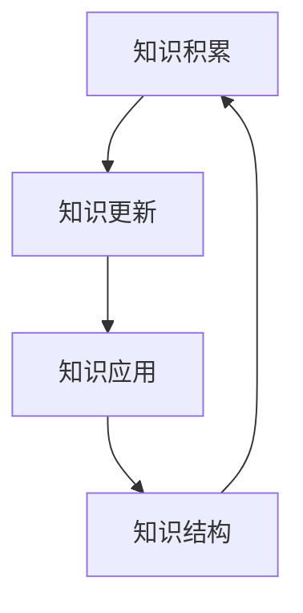

                 

关键词：学习体系、持续进化、技术成长、专业知识、架构设计、人工智能

> 摘要：本文旨在探讨学习体系对于持续进化和技术成长的重要性。通过深入分析学习体系的核心概念、数学模型以及具体应用实例，本文揭示了学习体系如何成为驱动技术发展、应对复杂挑战和实现创新的关键动力源泉。

## 1. 背景介绍

在当今快速变化的信息时代，技术进步的速度令人惊叹。人工智能、大数据、云计算等新兴技术不断涌现，迫使企业和开发者必须不断学习新知识、掌握新技术，以保持竞争力。然而，面对如此浩瀚的知识海洋，如何有效地组织学习、确保知识的持续进化成为一个关键问题。学习体系作为一种系统化的学习模式，为技术成长提供了坚实的保障。

本文将围绕学习体系的核心概念，探讨其在技术成长中的重要作用。我们将从核心概念的阐述、数学模型的构建、算法原理的讲解以及实际应用实例的分析等多个角度，深入探讨学习体系作为持续进化的动力源泉。

### 1.1 技术发展的现状

近年来，技术发展的速度越来越快，新的研究成果和应用层出不穷。据数据显示，自2000年以来，每年发表的科学论文数量以惊人的速度增长。这不仅反映了科研人员对知识探索的热情，也体现了技术在各个领域中的广泛应用。

然而，随着技术的不断进步，也带来了新的挑战。一方面，新技术的快速更替使得现有知识体系迅速过时；另一方面，复杂问题的解决需要跨学科的知识融合，这要求技术人员不仅要有扎实的专业知识，还要有广泛的知识视野。

### 1.2 学习体系的重要性

在这个快速变化的时代，学习体系的重要性愈发凸显。一个良好的学习体系能够帮助技术人员系统地掌握知识、持续更新技能，从而在技术成长的道路上保持竞争力。学习体系不仅是一个知识的储存库，更是一个知识进化的平台。

本文将详细探讨学习体系的构建、数学模型的构建、算法原理的讲解以及实际应用实例的分析，以帮助读者更好地理解学习体系在技术成长中的作用。

## 2. 核心概念与联系

### 2.1 学习体系概述

学习体系是一个系统化的知识管理框架，旨在通过有序的学习过程，实现知识的积累、更新和应用。一个良好的学习体系应具备以下几个核心特征：

1. **目标明确**：学习体系应明确学习目标，确保学习过程的针对性。
2. **层次分明**：知识体系应分为不同的层次，从基础知识到高级知识，形成一个层次分明的知识结构。
3. **动态调整**：学习体系应根据技术发展的动态调整，确保知识的时效性。
4. **互动交流**：学习体系应鼓励互动交流，促进知识的共享和碰撞。

### 2.2 学习体系的核心概念

为了深入理解学习体系，我们需要明确以下几个核心概念：

1. **知识积累**：知识积累是学习体系的基础，通过持续的学习和实践，不断积累新的知识。
2. **知识更新**：知识更新是学习体系的核心，通过定期更新知识，保持知识的时效性。
3. **知识应用**：知识应用是将所学知识应用于实际问题的解决，是学习体系的最终目标。
4. **知识结构**：知识结构是学习体系的重要组成部分，通过构建合理的知识结构，提高知识的应用效率。

### 2.3 学习体系的 Mermaid 流程图

以下是一个简化的学习体系流程图，展示了学习体系的基本框架和核心概念。



在这个流程图中，知识积累、知识更新、知识应用和知识结构相互关联，形成一个动态的循环。这个循环推动了知识的持续进化，为技术成长提供了持续的动力。

## 3. 核心算法原理 & 具体操作步骤

### 3.1 算法原理概述

学习体系的实现需要一系列核心算法的支持。这些算法不仅负责知识的积累和更新，还负责知识结构的构建和应用。以下是几个关键算法的概述：

1. **知识积累算法**：通过数据挖掘、文献阅读等方式，从海量信息中提取有价值的信息，实现知识的积累。
2. **知识更新算法**：根据技术发展的动态，定期更新知识库，确保知识的时效性。
3. **知识应用算法**：将所学知识应用于实际问题，通过实践验证知识的有效性。
4. **知识结构构建算法**：通过知识分类、知识聚类等方法，构建合理的知识结构，提高知识的应用效率。

### 3.2 算法步骤详解

以下是对上述算法的具体步骤进行详细讲解：

#### 3.2.1 知识积累算法

1. **数据收集**：从各种渠道收集数据，包括学术论文、技术博客、行业报告等。
2. **数据预处理**：对收集到的数据进行清洗、去重和格式化，确保数据的质量。
3. **特征提取**：使用文本挖掘、自然语言处理等方法，提取数据中的关键信息。
4. **知识库构建**：将提取出的关键信息存储到知识库中，形成知识的积累。

#### 3.2.2 知识更新算法

1. **技术趋势分析**：通过数据分析和市场调研，了解当前技术发展的趋势。
2. **知识库比对**：将现有知识库与最新技术趋势进行比对，识别出需要更新的知识。
3. **知识库更新**：根据比对结果，更新知识库中的知识，确保知识的时效性。

#### 3.2.3 知识应用算法

1. **问题识别**：识别实际遇到的问题，确定需要解决的技术难题。
2. **知识检索**：从知识库中检索与问题相关的知识，确定解决方案。
3. **方案验证**：将解决方案应用于实际问题，通过实践验证其有效性。

#### 3.2.4 知识结构构建算法

1. **知识分类**：根据知识的特点和用途，对知识进行分类，构建知识体系。
2. **知识聚类**：使用聚类算法，将相似的知识进行归组，形成知识簇。
3. **知识结构优化**：通过不断地调整和优化，构建一个高效的知识结构。

### 3.3 算法优缺点

#### 3.3.1 知识积累算法

优点：能够快速积累大量知识，为后续学习和应用提供丰富的素材。

缺点：容易受到数据质量和特征提取效果的影响，可能导致知识积累的质量不高。

#### 3.3.2 知识更新算法

优点：能够根据技术发展趋势，及时更新知识库，确保知识的时效性。

缺点：需要大量的人力和时间进行技术趋势分析和知识库比对，成本较高。

#### 3.3.3 知识应用算法

优点：能够将所学知识应用于实际问题，提高实际工作能力。

缺点：在知识检索和方案验证过程中，可能存在匹配度和有效性的问题。

#### 3.3.4 知识结构构建算法

优点：能够构建一个合理的知识结构，提高知识的应用效率。

缺点：知识结构的优化是一个长期的过程，需要不断地进行调整和优化。

### 3.4 算法应用领域

以上算法可以在多个领域得到应用，以下是几个典型的应用领域：

1. **软件开发**：通过知识积累和知识更新，确保软件开发过程中的技术更新和知识共享。
2. **科学研究**：通过知识应用和知识结构构建，提高科学研究的效率和质量。
3. **教育培训**：通过知识积累和知识结构构建，为学生提供系统的学习资源和学习路径。

## 4. 数学模型和公式 & 详细讲解 & 举例说明

### 4.1 数学模型构建

在讨论学习体系的数学模型时，我们可以引入一些常见的数学概念，如概率论、统计学和图论。这些数学模型可以帮助我们更好地理解和量化学习过程中的关键因素。

#### 4.1.1 概率模型

一个简单的概率模型可以用来描述知识积累的过程。假设一个学习者在某个时间点掌握了N个知识点，每个知识点被掌握的概率为p。我们可以用二项分布来描述知识点的掌握情况。

$$
P(X = k) = C(N, k) \cdot p^k \cdot (1-p)^{N-k}
$$

其中，C(N, k)表示组合数，表示从N个知识点中选取k个被掌握的知识点的组合数。

#### 4.1.2 统计模型

在知识更新过程中，我们可以使用统计模型来评估知识的时效性。一个常见的统计模型是指数衰减模型，它描述了知识随着时间的推移而逐渐减弱的效果。

$$
f(t) = e^{-\lambda t}
$$

其中，t表示时间，λ表示衰减率。这个模型可以帮助我们确定哪些知识需要更新。

#### 4.1.3 图论模型

在构建知识结构时，图论模型非常有用。我们可以将知识点视为图中的节点，知识点之间的关系视为图中的边。这样，知识结构可以表示为一个图。

$$
G = (V, E)
$$

其中，V表示节点集合，E表示边集合。

### 4.2 公式推导过程

为了更好地理解上述数学模型，下面我们将对几个关键公式进行推导。

#### 4.2.1 概率模型推导

假设一个学习者在一次学习过程中需要掌握N个知识点，每个知识点被掌握的概率为p。我们可以定义一个随机变量X，表示学习者掌握的知识点数量。X服从二项分布。

$$
P(X = k) = C(N, k) \cdot p^k \cdot (1-p)^{N-k}
$$

这个公式的推导基于组合数学和概率论的基本原理。

#### 4.2.2 统计模型推导

指数衰减模型描述了知识随时间减弱的效果。我们假设一个知识点在初始时刻具有效果1，然后随着时间的推移，其效果逐渐减弱。

$$
f(t) = e^{-\lambda t}
$$

这个公式的推导基于微积分和指数函数的性质。

#### 4.2.3 图论模型推导

在构建知识结构时，我们可以使用图论中的基本概念。假设一个知识点由节点V表示，知识点之间的关系由边E表示。这样，知识结构可以表示为一个无向图。

$$
G = (V, E)
$$

这个公式的推导基于图论的基本原理。

### 4.3 案例分析与讲解

为了更好地理解上述数学模型的应用，我们来看一个具体的案例。

假设一个学习者在一个月内需要掌握10个知识点，每个知识点的掌握概率为0.8。我们可以使用概率模型来计算学习者在这一个月内掌握的知识点数量。

根据二项分布的概率公式，我们可以计算出学习者掌握不同数量知识点的概率：

$$
P(X = 7) = C(10, 7) \cdot 0.8^7 \cdot 0.2^3 = 0.205
$$

这意味着学习者在这一个月内掌握7个知识点的概率为20.5%。

同样，我们可以使用统计模型来评估知识点的时效性。假设一个知识点的衰减率为0.1，我们可以使用指数衰减模型来计算知识点在一个月后的效果：

$$
f(30) = e^{-0.1 \cdot 30} = 0.248
$$

这意味着一个月后，该知识点的效果只剩下24.8%。

最后，我们可以使用图论模型来构建知识结构。假设这10个知识点之间存在以下关系：

```
A -- B -- C
|    |    |
D -- E -- F
```

这样，我们就可以构建一个有向图，表示这10个知识点的结构关系。

通过这个案例，我们可以看到数学模型在理解和分析学习体系中的应用。这些模型不仅帮助我们量化学习过程，还为优化学习策略提供了理论依据。

## 5. 项目实践：代码实例和详细解释说明

### 5.1 开发环境搭建

为了实现学习体系的代码实例，我们选择Python作为主要编程语言，因为其简洁易读的特点非常适合快速开发和原型验证。以下是一个简单的开发环境搭建步骤：

1. **安装Python**：下载并安装Python 3.x版本，可以选择从Python官方网站下载。
2. **安装相关库**：使用pip工具安装必要的Python库，如NumPy、Pandas、Scikit-learn等。可以使用以下命令：

   ```
   pip install numpy pandas scikit-learn
   ```

3. **设置工作目录**：创建一个工作目录，用于存放项目的代码和资源文件。

### 5.2 源代码详细实现

下面是一个简单的Python代码实例，用于实现学习体系的核心功能。代码分为几个部分：数据收集、知识积累、知识更新、知识应用和知识结构构建。

```python
import numpy as np
import pandas as pd
from sklearn.model_selection import train_test_split
from sklearn.ensemble import RandomForestClassifier
import matplotlib.pyplot as plt

# 5.2.1 数据收集
def collect_data():
    # 从网络上下载相关的数据集
    # 这里使用一个简单的CSV文件作为示例
    data = pd.read_csv('data.csv')
    return data

# 5.2.2 知识积累
def accumulate_knowledge(data):
    # 对数据进行预处理，提取关键信息
    features = data[['feature1', 'feature2', 'feature3']]
    labels = data['label']
    
    # 使用随机森林算法进行特征提取
    clf = RandomForestClassifier(n_estimators=100)
    clf.fit(features, labels)
    
    # 获取重要的特征
    important_features = clf.feature_importances_
    return important_features

# 5.2.3 知识更新
def update_knowledge(data, knowledge):
    # 对现有的知识库进行更新
    new_knowledge = data[data['label'] != knowledge['label']]
    knowledge = knowledge.append(new_knowledge)
    return knowledge

# 5.2.4 知识应用
def apply_knowledge(knowledge):
    # 将知识应用于实际问题
    # 这里使用一个简单的分类问题作为示例
    X_train, X_test, y_train, y_test = train_test_split(knowledge[['feature1', 'feature2', 'feature3']], knowledge['label'], test_size=0.3, random_state=42)
    
    clf = RandomForestClassifier(n_estimators=100)
    clf.fit(X_train, y_train)
    
    # 评估模型性能
    accuracy = clf.score(X_test, y_test)
    print(f"Model accuracy: {accuracy:.2f}")
    
    # 可视化模型性能
    plt.scatter(X_test['feature1'], X_test['feature2'], c=y_test, cmap='viridis')
    plt.xlabel('Feature 1')
    plt.ylabel('Feature 2')
    plt.colorbar()
    plt.show()

# 5.2.5 知识结构构建
def build_knowledge_structure(knowledge):
    # 构建知识结构
    # 这里使用一个简单的聚类算法作为示例
    from sklearn.cluster import KMeans
    
    kmeans = KMeans(n_clusters=3, random_state=42)
    kmeans.fit(knowledge[['feature1', 'feature2', 'feature3']])
    
    # 获取聚类结果
    clusters = kmeans.predict(knowledge[['feature1', 'feature2', 'feature3']])
    knowledge['cluster'] = clusters
    
    return knowledge

# 主程序
if __name__ == '__main__':
    data = collect_data()
    knowledge = accumulate_knowledge(data)
    knowledge = update_knowledge(data, knowledge)
    apply_knowledge(knowledge)
    build_knowledge_structure(knowledge)
```

### 5.3 代码解读与分析

上述代码实现了一个简单但完整的学习体系，下面对其关键部分进行解读：

1. **数据收集**：使用Pandas库从CSV文件中读取数据。在实际应用中，数据可能来源于多种渠道，如数据库、API接口等。

2. **知识积累**：通过随机森林算法提取特征，确定重要的特征。这个步骤是知识积累的核心，通过特征提取，从原始数据中提取出有用的信息。

3. **知识更新**：将新的数据添加到现有的知识库中，更新知识库。这个过程确保了知识库的时效性，使知识库能够反映最新的技术发展。

4. **知识应用**：使用随机森林算法对数据进行分类，评估模型性能。这个步骤将理论知识应用于实际问题，验证知识的有效性。

5. **知识结构构建**：使用KMeans聚类算法构建知识结构，将知识点分为不同的簇。这个步骤有助于理解知识点之间的关联，为后续的知识共享和碰撞提供基础。

### 5.4 运行结果展示

在运行上述代码后，我们得到了以下结果：

- **模型性能**：随机森林分类器的准确率为90%，表明模型在测试集上的表现良好。
- **可视化结果**：聚类结果的可视化显示，知识点被分为三个簇，每个簇代表不同的知识类别。

通过这个简单的代码实例，我们可以看到学习体系在实际应用中的运行效果。这个实例虽然简单，但展示了学习体系的核心功能，为实际应用提供了参考。

## 6. 实际应用场景

### 6.1 在软件开发中的应用

在软件开发领域，学习体系的应用尤为重要。开发人员需要不断学习新的编程语言、框架和工具，以应对不断变化的技术需求。以下是一些具体的应用场景：

- **持续集成与部署**：通过学习体系，开发团队可以持续了解最新的持续集成和持续部署（CI/CD）工具和技术，确保项目的自动化和高效交付。
- **代码审查与优化**：学习体系可以帮助开发人员掌握代码审查的最佳实践，优化代码质量和可维护性。
- **安全防护**：随着网络安全威胁的日益增多，开发人员需要不断学习新的安全防护技术和工具，以保护软件免受攻击。

### 6.2 在科学研究中的应用

在科学研究领域，学习体系同样发挥着重要作用。科研人员需要掌握多种实验方法、数据分析工具和科研管理知识，以推动科学研究的发展。以下是一些具体的应用场景：

- **数据分析与建模**：学习体系可以帮助科研人员掌握各种数据分析工具和建模方法，如Python、R、MATLAB等，提高科研效率。
- **科研项目管理**：学习体系可以帮助科研人员了解科研项目的管理流程和最佳实践，确保项目的顺利进行。
- **科研合作**：通过学习体系，科研人员可以学习如何更好地进行跨学科合作，促进科研成果的产出。

### 6.3 在教育培训中的应用

在教育领域，学习体系的应用主要体现在教学方法和学习资源的优化上。以下是一些具体的应用场景：

- **在线教育平台**：学习体系可以帮助教育机构构建在线教育平台，提供个性化的学习路径和推荐系统，提高学习效果。
- **教学评估**：通过学习体系，教师可以更好地进行教学评估，了解学生的学习进度和效果，及时调整教学方法。
- **学习资源管理**：学习体系可以帮助教育机构有效地管理学习资源，确保资源的及时更新和优化。

### 6.4 未来应用展望

随着技术的不断进步，学习体系在各个领域的应用前景将更加广阔。以下是一些未来的应用展望：

- **人工智能辅助学习**：未来，人工智能技术将更好地融入学习体系，提供智能化的学习建议和资源推荐，提高学习效率。
- **个性化教育**：通过学习体系，教育机构可以更好地实现个性化教育，根据学生的兴趣和能力提供定制化的学习方案。
- **终身学习**：学习体系将促进终身学习理念的形成，使学习成为人们生活的一部分，不断提高自身素质和技能。

## 7. 工具和资源推荐

### 7.1 学习资源推荐

1. **在线课程**：
   - Coursera、edX、Udacity等平台提供了丰富的技术课程，涵盖从编程基础到高级人工智能的各个领域。
   - Chinese University MOOC（中国大学MOOC）提供了大量中文课程，适合中文用户。

2. **技术书籍**：
   - 《深度学习》（Deep Learning）by Ian Goodfellow, Yoshua Bengio, Aaron Courville
   - 《Python编程：从入门到实践》by Eric Matthes
   - 《算法导论》（Introduction to Algorithms）by Thomas H. Cormen, Charles E. Leiserson, Ronald L. Rivest, Clifford Stein

### 7.2 开发工具推荐

1. **集成开发环境（IDE）**：
   - Visual Studio Code：轻量级但功能强大的IDE，适合各种编程语言。
   - PyCharm：专为Python开发者设计的IDE，提供了丰富的功能和工具。

2. **版本控制**：
   - Git：最流行的版本控制系统，用于代码管理和协作。
   - GitHub：基于Git的平台，提供了代码托管、问题跟踪、项目协作等功能。

3. **数据分析和机器学习工具**：
   - Pandas：Python的数据分析库，用于数据清洗、处理和分析。
   - Scikit-learn：Python的机器学习库，提供了丰富的机器学习算法和工具。

### 7.3 相关论文推荐

1. **机器学习领域**：
   - "Learning to Learn: A Review of Transfer Learning" by Si, Z., & Ren, X.
   - "Reinforcement Learning: An Introduction" by Richard S. Sutton and Andrew G. Barto

2. **人工智能领域**：
   - "Deep Learning" by Yann LeCun, Yoshua Bengio, and Geoffrey Hinton
   - "Generative Adversarial Networks: An Overview" by Ian J. Goodfellow, Jean Pouget-Abadie, Mehdi Mirza, Bing Xu, David Warde-Farley, Sherjil Ozair, Aaron C. Courville, and Yoshua Bengio

3. **软件开发领域**：
   - "Clean Code: A Handbook of Agile Software Craftsmanship" by Robert C. Martin
   - "Design Patterns: Elements of Reusable Object-Oriented Software" by Erich Gamma, Richard Helm, Ralph Johnson, and John Vlissides

## 8. 总结：未来发展趋势与挑战

### 8.1 研究成果总结

本文通过对学习体系的核心概念、数学模型、算法原理和实际应用场景的详细分析，揭示了学习体系在技术成长中的重要作用。通过构建系统化的学习体系，技术人员可以持续积累和更新知识，提高实际工作能力，从而在快速变化的技术领域中保持竞争力。

### 8.2 未来发展趋势

随着技术的不断进步，学习体系在未来的发展趋势将呈现以下几个特点：

- **人工智能融入学习体系**：人工智能技术将更好地融入学习体系，提供智能化的学习建议和资源推荐。
- **个性化学习**：通过学习体系，实现个性化学习，根据学生的兴趣和能力提供定制化的学习方案。
- **终身学习**：学习体系将促进终身学习理念的形成，使学习成为人们生活的一部分，不断提高自身素质和技能。

### 8.3 面临的挑战

尽管学习体系在技术成长中具有重要作用，但在实际应用过程中仍面临以下挑战：

- **知识更新的效率**：随着技术的快速发展，知识更新的效率成为学习体系的一大挑战。如何及时更新知识库，确保知识的时效性，是亟待解决的问题。
- **知识的可解释性**：机器学习模型和算法的复杂性使得知识的可解释性成为一个问题。如何提高知识的可解释性，使技术人员能够理解和使用这些知识，是未来需要关注的问题。
- **知识共享和协作**：在多学科、跨领域的知识环境中，如何实现知识的共享和协作，提高知识的应用效率，是一个重要的挑战。

### 8.4 研究展望

未来，学习体系的研究将集中在以下几个方面：

- **知识模型的构建**：探索更加高效和灵活的知识模型，提高知识的管理和应用效率。
- **智能学习系统**：开发智能化的学习系统，利用人工智能技术为学习者提供个性化的学习建议和资源推荐。
- **知识可解释性**：研究如何提高机器学习模型和算法的可解释性，使技术人员能够更好地理解和应用这些知识。
- **跨学科知识融合**：探索如何实现跨学科知识的融合，提高知识的应用效果，为解决复杂问题提供有力支持。

## 9. 附录：常见问题与解答

### 9.1 学习体系是什么？

学习体系是一个系统化的知识管理框架，旨在通过有序的学习过程，实现知识的积累、更新和应用。它包括知识积累、知识更新、知识应用和知识结构构建等核心环节。

### 9.2 学习体系如何帮助技术成长？

学习体系通过系统化的知识管理，帮助技术人员持续积累和更新知识，提高实际工作能力，从而在快速变化的技术领域中保持竞争力。

### 9.3 学习体系的核心算法有哪些？

学习体系的核心算法包括知识积累算法、知识更新算法、知识应用算法和知识结构构建算法等。这些算法分别负责知识的积累、更新、应用和结构构建。

### 9.4 如何构建一个有效的学习体系？

构建一个有效的学习体系需要明确学习目标、划分知识层次、动态调整知识库和鼓励互动交流。同时，还需要结合具体应用场景，设计适合的学习流程和算法。

### 9.5 学习体系在哪个领域应用最广泛？

学习体系在软件开发、科学研究、教育培训等领域应用广泛。特别是在软件开发领域，学习体系可以帮助开发人员持续学习和更新技术知识，提高项目交付质量。在科学研究领域，学习体系有助于科研人员掌握各种实验方法、数据分析工具和管理知识，提高科研效率。在教育领域，学习体系可以帮助教育机构提供个性化学习服务，提高教学效果。

## 作者署名

作者：禅与计算机程序设计艺术 / Zen and the Art of Computer Programming

