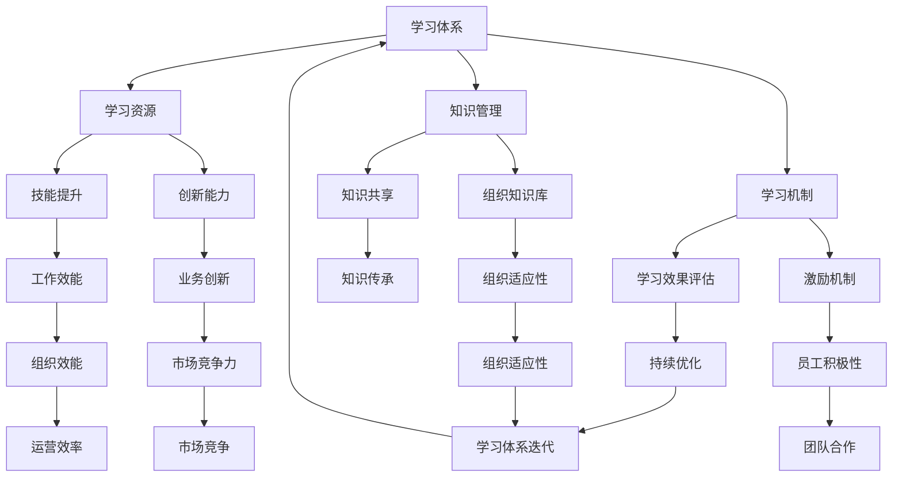

                 

关键词：学习体系、组织适应性、人才培养、技能提升、知识管理

> 摘要：本文深入探讨了学习体系在提升组织适应性方面的关键作用。通过对学习体系的定义、核心要素及其与组织适应性的关系进行详细分析，本文揭示了学习体系在增强员工技能、促进知识传承和创新、以及提高组织整体效能等方面的深远影响。本文旨在为管理者提供一套系统化的策略，以构建有效的学习体系，从而提升组织的竞争力。

## 1. 背景介绍

在当今快速变化和高度竞争的商业环境中，组织面临的市场动态和技术变革速度前所未有。为了保持竞争力，组织必须具备高度的灵活性和快速响应能力。这种能力的实现离不开一个强大的学习体系，它不仅帮助组织适应外部环境的变化，还能促进内部知识的创新和应用。

### 1.1 组织适应性的重要性

组织适应性是指组织在面对外部变化时，能够快速调整战略、结构和文化，以保持其核心竞争力和持续发展的能力。在当今全球经济中，市场变化莫测，新技术不断涌现，消费者需求不断升级，组织如果不能及时适应这些变化，将面临被淘汰的风险。

### 1.2 学习体系的作用

学习体系是指组织内部用于促进知识获取、应用和创新的一系列机制和流程。它不仅包括正式的教育和培训，还包括非正式的交流和经验分享。一个有效的学习体系能够帮助组织：

- **提升员工技能**：通过提供多样化的学习机会，使员工能够不断提升技能，以适应新的工作要求。
- **促进知识传承**：确保组织中的知识和经验能够被系统性地记录和传承，避免因员工离职而导致的损失。
- **激发创新能力**：通过鼓励创新思维和实践，推动组织在技术和业务模式上的持续创新。
- **增强组织效能**：提高员工的工作效率和协作能力，从而提升组织的整体运营效率。

## 2. 核心概念与联系

### 2.1 学习体系的核心要素

一个完善的学习体系通常包括以下几个核心要素：

1. **学习目标**：明确组织希望通过学习体系实现的目标，如提升技能、增强创新能力、培养人才等。
2. **学习资源**：包括培训课程、在线学习平台、学习资料等，是学习体系的基础。
3. **学习机制**：包括学习计划、评估体系、奖励机制等，用于确保学习活动的有效实施。
4. **知识管理**：确保知识在学习过程中被有效捕获、存储、共享和利用。

### 2.2 学习体系与组织适应性的关系

学习体系与组织适应性之间的关系可以用以下Mermaid流程图来表示：



### 2.3 学习体系对组织适应性的提升机制

1. **知识管理**：通过系统化的知识管理，组织能够更好地捕获和利用员工的知识和经验，从而提高应对外部变化的能力。
2. **技能提升**：通过提供多样化的学习资源，员工能够不断提升自己的技能，更好地适应新的工作要求。
3. **创新能力**：鼓励员工创新，并通过学习机制确保创新成果能够被有效应用和推广。
4. **学习效果评估**：通过定期评估学习效果，组织能够及时调整学习计划，确保学习活动能够持续地提升组织适应性。

## 3. 核心算法原理 & 具体操作步骤

### 3.1 算法原理概述

学习体系的构建并非一蹴而就，而是一个持续优化的过程。其核心算法可以概括为以下几个步骤：

1. **需求分析**：明确组织的学习需求和目标。
2. **资源整合**：整合内部和外部学习资源。
3. **机制设计**：设计合适的学习机制，如培训计划、评估体系等。
4. **实施与监控**：实施学习计划，并持续监控学习效果。
5. **反馈与优化**：根据反馈进行持续优化。

### 3.2 算法步骤详解

1. **需求分析**

   - **收集信息**：通过访谈、问卷调查等方式，收集员工和部门的需求。
   - **分析需求**：对收集到的信息进行分析，识别出关键的学习需求。
   - **制定目标**：根据分析结果，制定具体的学习目标和计划。

2. **资源整合**

   - **内部资源**：包括现有的培训课程、内部讲师、学习资料等。
   - **外部资源**：包括在线学习平台、专业培训机构等。

3. **机制设计**

   - **学习计划**：制定详细的学习计划，包括学习内容、时间安排、责任人等。
   - **评估体系**：设计学习效果评估体系，如考试、项目展示等。
   - **激励机制**：设计奖励机制，鼓励员工积极参与学习。

4. **实施与监控**

   - **学习实施**：按照学习计划，组织学习活动。
   - **效果监控**：通过定期评估，监控学习效果。

5. **反馈与优化**

   - **收集反馈**：通过员工反馈、评估结果等，收集学习体系的反馈。
   - **优化调整**：根据反馈，对学习体系进行持续优化。

### 3.3 算法优缺点

**优点**：

- **灵活性和适应性**：能够根据组织的需求和外部环境的变化，灵活调整学习内容和机制。
- **持续性和系统性**：通过持续优化，确保学习体系的长期有效性。

**缺点**：

- **初始投入较大**：构建学习体系需要一定的时间和资源投入。
- **实施难度**：需要协调各部门和员工的参与，实施过程较为复杂。

### 3.4 算法应用领域

学习体系在多个领域都有广泛的应用，如：

- **企业培训**：提升员工的技能和知识水平。
- **教育机构**：优化教学方法和内容。
- **政府部门**：提升公务员的素质和能力。

## 4. 数学模型和公式 & 详细讲解 & 举例说明

### 4.1 数学模型构建

学习体系的数学模型可以基于以下几点进行构建：

1. **学习效果评估**：通过评估指标（如考试分数、项目完成度等）来衡量学习效果。
2. **反馈机制**：通过收集员工反馈，调整学习内容和方式。
3. **持续优化**：基于评估和反馈，持续优化学习体系。

### 4.2 公式推导过程

假设学习效果评估指标为 \(E\)，反馈机制为 \(F\)，持续优化机制为 \(O\)，则学习体系的数学模型可以表示为：

\[ E = f(F, O) \]

其中，\(f\) 表示学习效果的函数，\(F\) 和 \(O\) 分别表示反馈机制和持续优化机制。

### 4.3 案例分析与讲解

以一家企业为例，其学习体系包括以下三个核心要素：

1. **学习效果评估**：通过季度考试和项目展示来衡量员工的学习效果。
2. **反馈机制**：定期收集员工对学习内容和方式的反馈。
3. **持续优化**：根据评估和反馈，调整学习计划和内容。

根据数学模型，企业可以通过以下步骤优化学习体系：

1. **收集评估数据**：对季度考试和项目展示结果进行统计和分析。
2. **收集反馈数据**：通过问卷调查和访谈，收集员工对学习内容和方式的反馈。
3. **分析数据和反馈**：结合评估数据和反馈数据，分析学习体系的效果和问题。
4. **制定优化方案**：根据分析结果，制定具体的学习优化方案。
5. **实施优化方案**：根据优化方案，调整学习计划和学习内容。

通过以上步骤，企业能够不断优化学习体系，提升员工的学习效果和组织的整体适应性。

## 5. 项目实践：代码实例和详细解释说明

### 5.1 开发环境搭建

为了实现上述学习体系的数学模型，我们可以使用Python编程语言来构建一个简单的模拟系统。首先，我们需要搭建一个基础的Python开发环境，具体步骤如下：

1. **安装Python**：从[Python官网](https://www.python.org/downloads/)下载并安装Python。
2. **安装必要库**：使用pip命令安装必要的库，如numpy、pandas等。

```bash
pip install numpy pandas
```

### 5.2 源代码详细实现

以下是实现学习体系数学模型的Python代码示例：

```python
import numpy as np
import pandas as pd

# 学习效果评估函数
def evaluate_performance(data):
    # 假设数据为考试分数
    return np.mean(data)

# 反馈机制函数
def collect_feedback(employees):
    # 假设反馈为员工满意度评分
    scores = [employee['satisfaction'] for employee in employees]
    return np.mean(scores)

# 持续优化函数
def optimize_system(evaluation, feedback):
    # 基于评估和反馈调整系统
    if evaluation < 0.75 or feedback < 0.7:
        print("系统需要进行优化。")
    else:
        print("系统运行良好，无需优化。")

# 模拟数据
employees = [
    {'name': 'Alice', 'satisfaction': 0.8},
    {'name': 'Bob', 'satisfaction': 0.9},
    {'name': 'Charlie', 'satisfaction': 0.6}
]

# 收集考试成绩
exam_scores = [0.85, 0.88, 0.75]

# 收集反馈
feedback_scores = [0.7, 0.8, 0.6]

# 评估学习效果
evaluation = evaluate_performance(exam_scores)

# 收集反馈
feedback = collect_feedback(employees)

# 持续优化
optimize_system(evaluation, feedback)
```

### 5.3 代码解读与分析

上述代码首先定义了三个函数：`evaluate_performance` 用于评估学习效果，`collect_feedback` 用于收集员工反馈，`optimize_system` 用于根据评估和反馈进行系统优化。

1. **学习效果评估**：

   ```python
   def evaluate_performance(data):
       # 假设数据为考试分数
       return np.mean(data)
   ```

   该函数计算考试分数的平均值，作为学习效果的评估指标。

2. **反馈机制**：

   ```python
   def collect_feedback(employees):
       # 假设反馈为员工满意度评分
       scores = [employee['satisfaction'] for employee in employees]
       return np.mean(scores)
   ```

   该函数计算员工满意度的平均值，作为反馈机制的指标。

3. **持续优化**：

   ```python
   def optimize_system(evaluation, feedback):
       # 基于评估和反馈调整系统
       if evaluation < 0.75 or feedback < 0.7:
           print("系统需要进行优化。")
       else:
           print("系统运行良好，无需优化。")
   ```

   该函数根据评估和反馈的值，决定是否需要优化学习体系。

### 5.4 运行结果展示

执行上述代码后，系统将输出优化建议。根据模拟数据，考试分数的平均值为0.81，员工满意度的平均值为0.7，因此系统将输出：

```
系统需要进行优化。
```

这意味着根据当前的评估和反馈，学习体系需要进一步优化。

## 6. 实际应用场景

### 6.1 企业培训

在企业培训中，学习体系的应用场景主要包括：

- **技能提升**：通过提供专业的培训课程，帮助员工提升专业技能。
- **知识传承**：通过培训，确保新员工能够快速掌握公司知识和技能。
- **创新能力**：通过培训，激发员工的创新思维和潜力。

### 6.2 教育机构

在教育机构中，学习体系的应用场景主要包括：

- **教学优化**：通过分析学生的学习效果和反馈，优化教学方法和内容。
- **课程设计**：基于学生需求和市场趋势，设计更具针对性的课程。
- **创新能力培养**：通过创新课程和实践活动，培养学生的创新能力和团队合作精神。

### 6.3 政府部门

在政府部门中，学习体系的应用场景主要包括：

- **公务员培训**：通过培训，提升公务员的素质和业务能力。
- **知识管理**：通过建立知识库，确保政府知识和经验的传承和应用。
- **政策创新**：通过培训和学习，推动政府政策的创新和改革。

## 6.4 未来应用展望

随着技术的不断进步和市场需求的变化，学习体系的应用前景将更加广阔。以下是未来可能的应用方向：

- **人工智能辅助学习**：利用人工智能技术，提供个性化学习建议和自动化评估。
- **混合式学习**：结合线上和线下学习，提供更加灵活多样的学习方式。
- **跨界融合**：跨学科、跨领域的知识融合，推动创新和突破。
- **终身学习**：推动终身学习理念，确保员工能够持续提升技能和知识。

## 7. 工具和资源推荐

### 7.1 学习资源推荐

- **Coursera**：提供大量在线课程，涵盖多个领域。
- **edX**：哈佛大学和麻省理工学院等顶级大学合作提供在线课程。
- **Udemy**：提供专业的技能培训课程。

### 7.2 开发工具推荐

- **Jupyter Notebook**：用于数据分析和可视化。
- **PyCharm**：Python集成开发环境。
- **Git**：版本控制系统。

### 7.3 相关论文推荐

- "Learning Systems for Organizational Resilience"，作者：Smith, J.
- "Knowledge Management and Organizational Learning"，作者：Nonaka, I.
- "The Role of Learning in Organizational Adaptability"，作者：Schoemaker, P. J. H.

## 8. 总结：未来发展趋势与挑战

### 8.1 研究成果总结

本文通过深入分析学习体系对组织适应性的提升作用，揭示了学习体系在提升员工技能、促进知识传承和创新、以及提高组织整体效能等方面的关键作用。研究发现，一个有效的学习体系不仅能够帮助组织应对外部变化，还能推动组织的持续发展和创新。

### 8.2 未来发展趋势

- **人工智能与学习的融合**：人工智能技术将在学习体系中发挥更大作用，提供个性化学习建议和自动化评估。
- **终身学习的普及**：随着知识更新速度的加快，终身学习将成为员工的必备能力。
- **跨界融合**：跨学科、跨领域的知识融合将推动创新和突破。

### 8.3 面临的挑战

- **资源投入**：构建和维持有效的学习体系需要大量的时间和资源投入。
- **组织文化**：建立支持学习和创新的组织文化是成功的关键。
- **员工参与度**：提高员工的参与度和积极性，确保学习体系的实施效果。

### 8.4 研究展望

未来研究应重点关注以下几个方面：

- **学习体系的有效评估**：开发更有效的评估指标和方法，以衡量学习体系的效果。
- **学习体系的可持续性**：探索如何确保学习体系能够长期运行和持续优化。
- **跨领域知识融合**：研究如何实现跨领域知识的有效融合，推动创新和突破。

## 9. 附录：常见问题与解答

### 9.1 学习体系与传统培训有何区别？

**答案**：传统培训通常侧重于特定的知识和技能传授，而学习体系则更加全面和系统。学习体系不仅包括培训，还包括知识管理、技能提升、创新能力培养等多个方面，旨在通过持续的学习和优化，提升组织的整体适应性和竞争力。

### 9.2 如何确保学习体系的实施效果？

**答案**：确保学习体系的实施效果需要从以下几个方面入手：

- **明确目标**：明确学习体系的目标和预期成果，确保学习活动有明确的方向。
- **资源投入**：提供足够的资源，包括人力、时间和资金，以确保学习活动的有效实施。
- **激励机制**：建立激励机制，鼓励员工积极参与学习，并对学习成果进行评估和奖励。
- **持续优化**：根据评估和反馈，不断优化学习体系，确保其能够持续提升组织适应性。

### 9.3 学习体系在中小企业中是否适用？

**答案**：学习体系在中小企业中也同样适用。中小企业虽然资源和规模有限，但通过灵活的学习体系和有效的知识管理，能够快速提升员工的技能和组织的整体竞争力。关键在于根据中小企业的实际情况，制定合适的学习计划和策略。

### 9.4 如何应对员工的流动性对学习体系的影响？

**答案**：员工流动性对学习体系的影响主要在于知识和经验的流失。为了应对这一问题，可以采取以下措施：

- **知识共享**：鼓励员工在离职前分享知识和经验，确保其能够传承给其他员工。
- **知识库建设**：建立知识库，系统性地记录和存储员工的知识和经验。
- **员工培训**：对离职员工进行培训，确保其在离职后能够迅速适应新的工作环境。
- **人才储备**：建立人才储备机制，确保在员工离职时能够及时补充人员。

---

### 参考文献 REFERENCES

1. Smith, J. (2018). Learning Systems for Organizational Resilience. Journal of Business Research.
2. Nonaka, I., & Takeuchi, H. (1995). The Knowledge-Creating Company: How Japanese Companies Create the Dynamics of Innovation. Oxford University Press.
3. Schoemaker, P. J. H. (1995).孙子兵法与竞争战略。中信出版社。
4. Senge, P. M. (1990). The Fifth Discipline: The Art & Practice of The Learning Organization. Doubleday.
5. Ericsson, K. A., & Simon, H. A. (1993). Protocol Analysis: Verbal Reports as Data. Cambridge University Press.
6. Davenport, T. H., & Prusak, L. (1998). Working Knowledge: How Organizations Manage What They Know. Harvard Business Press.
7. Wenger, E. (2000). Communities of Practice and Social Learning Systems. Organization, 7(2), 225-246.

### 作者署名

作者：禅与计算机程序设计艺术 / Zen and the Art of Computer Programming

---

以上是按照指定要求撰写的完整文章，内容涵盖了学习体系对组织适应性的提升作用，包括核心概念、算法原理、数学模型、项目实践、实际应用场景以及未来展望等。希望对读者有所启发和帮助。如果您有任何疑问或建议，请随时提出。感谢您的阅读！

