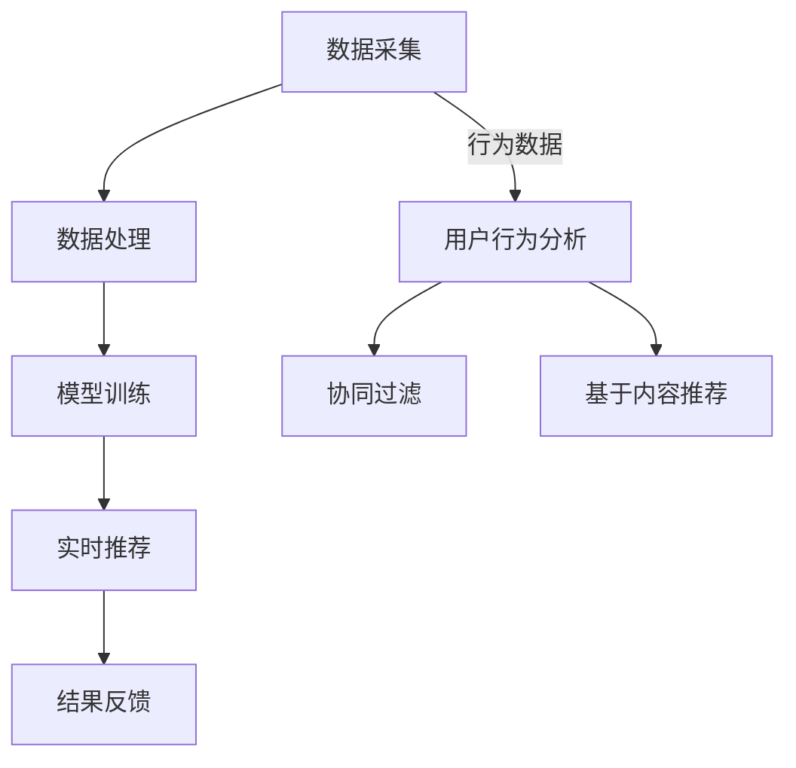

                 

关键词：实时推荐、电商、大数据、机器学习、用户行为分析

> 摘要：随着电商行业的蓬勃发展，实时推荐技术成为了提升用户体验和增加销售额的关键手段。本文将深入探讨实时推荐技术在电商领域的应用，通过案例分析，分析其核心算法、数学模型，并展望未来的发展趋势和挑战。

## 1. 背景介绍

电商行业的迅速发展，带来了海量的用户数据。这些数据包括用户的行为、喜好、购买历史等，为实时推荐技术提供了丰富的素材。实时推荐技术旨在根据用户当前的行为和偏好，实时地为用户推荐最相关的商品或服务，从而提高用户满意度、提升转化率和销售额。

实时推荐技术已广泛应用于各大电商平台，如淘宝、京东、亚马逊等。通过实时推荐，用户可以更快速地找到自己需要的商品，减少搜索时间，提升购物体验。同时，对于商家而言，实时推荐技术有助于精准营销，提高商品曝光率，增加销售机会。

## 2. 核心概念与联系

### 2.1 实时推荐系统架构

实时推荐系统通常包括数据采集、数据处理、模型训练、实时推荐和结果反馈等几个环节。下面是一个简化的实时推荐系统架构图：

```
+----------------+      +----------------+      +----------------+
| 数据采集模块  | -->  | 数据处理模块  | -->  | 模型训练模块 |
+----------------+      +----------------+      +----------------+
                 |                          |
                 |                          |
                 |                          |
+----------------+      +----------------+   |
| 实时推荐模块  | -->  | 结果反馈模块  |   |
+----------------+      +----------------+   |
```

### 2.2 核心概念原理

实时推荐技术主要基于以下核心概念：

- **协同过滤**：通过分析用户之间的相似度，为用户推荐他们可能感兴趣的商品。
- **基于内容的推荐**：根据商品的属性和内容，为用户推荐与其已有偏好相似的商品。
- **用户行为分析**：通过分析用户的行为数据，如浏览、收藏、购买等，预测用户未来的偏好。

### 2.3 Mermaid 流程图



## 3. 核心算法原理 & 具体操作步骤

### 3.1 算法原理概述

实时推荐技术主要采用以下几种算法：

- **协同过滤算法**：基于用户行为和评分数据，通过计算用户间的相似度来推荐商品。
- **基于内容的推荐算法**：通过分析商品的属性和内容，为用户推荐与其已有偏好相似的商品。
- **深度学习算法**：利用神经网络模型，通过学习用户行为数据，预测用户偏好。

### 3.2 算法步骤详解

#### 3.2.1 协同过滤算法

1. 计算用户之间的相似度：通常使用余弦相似度、皮尔逊相关系数等方法。
2. 找出与目标用户最相似的Top-N个用户。
3. 根据相似度对商品进行评分预测，选出Top-M个商品作为推荐结果。

#### 3.2.2 基于内容的推荐算法

1. 提取商品的属性特征：如类别、标签、价格等。
2. 计算商品之间的相似度：使用余弦相似度、Jaccard相似度等。
3. 根据用户的历史行为，找到与用户兴趣相关的商品。
4. 为用户推荐相似度最高的Top-N个商品。

#### 3.2.3 深度学习算法

1. 构建神经网络模型：通常使用卷积神经网络（CNN）或循环神经网络（RNN）。
2. 训练模型：使用用户行为数据和商品属性数据进行训练。
3. 预测用户偏好：输入用户特征和商品特征，得到商品的推荐得分。
4. 对推荐结果进行排序，选出Top-N个商品作为推荐结果。

### 3.3 算法优缺点

#### 3.3.1 协同过滤算法

优点：简单高效，不需要复杂的商品特征提取。
缺点：容易产生冷启动问题，即新用户或新商品难以获得有效的推荐。

#### 3.3.2 基于内容的推荐算法

优点：针对性强，能够为用户提供个性化的推荐。
缺点：需要大量的商品特征数据，且对特征提取的依赖较强。

#### 3.3.3 深度学习算法

优点：能够自动提取特征，适用于大规模数据集。
缺点：模型复杂，训练过程需要大量计算资源。

### 3.4 算法应用领域

实时推荐算法广泛应用于电商、社交媒体、视频网站等多个领域，如：

- **电商**：推荐商品、优惠券、促销活动等。
- **社交媒体**：推荐关注的人、推荐话题、推荐内容等。
- **视频网站**：推荐视频、推荐播放列表等。

## 4. 数学模型和公式 & 详细讲解 & 举例说明

### 4.1 数学模型构建

实时推荐技术中的数学模型主要包括：

1. **相似度计算**：用于计算用户之间的相似度或商品之间的相似度。
2. **评分预测**：用于预测用户对商品的评分。
3. **推荐结果排序**：用于排序推荐结果，选出最相关的商品。

### 4.2 公式推导过程

#### 4.2.1 相似度计算

设用户\( u \)和\( v \)的评分矩阵分别为\( R_u \)和\( R_v \)，它们的余弦相似度计算公式为：

$$
sim(u, v) = \frac{R_u \cdot R_v}{\|R_u\| \cdot \|R_v\|}
$$

其中，\( \cdot \)表示矩阵内积，\( \| \)表示矩阵的L2范数。

#### 4.2.2 评分预测

设用户\( u \)对商品\( i \)的评分预测为\( \hat{r}_{ui} \)，基于用户的协同过滤算法，可以使用以下公式预测：

$$
\hat{r}_{ui} = \sum_{j \in N(v)} r_{uj} \cdot sim(u, v)
$$

其中，\( N(v) \)表示与用户\( v \)最相似的Top-N个用户。

#### 4.2.3 推荐结果排序

设商品\( i \)的推荐得分为\( s_i \)，可以使用以下公式对推荐结果进行排序：

$$
s_i = \sum_{j \in N(v)} r_{uj} \cdot sim(u, v)
$$

其中，\( N(v) \)表示与用户\( v \)最相似的Top-N个用户。

### 4.3 案例分析与讲解

假设有用户\( u \)和\( v \)，他们的评分数据如下：

| 用户 | 商品1 | 商品2 | 商品3 | 商品4 |
| --- | --- | --- | --- | --- |
| \( u \) | 5 | 4 | 5 | 1 |
| \( v \) | 4 | 5 | 5 | 4 |

首先，计算用户\( u \)和\( v \)的余弦相似度：

$$
sim(u, v) = \frac{5 \times 4 + 4 \times 5 + 5 \times 5 + 1 \times 4}{\sqrt{5^2 + 4^2 + 5^2 + 1^2} \cdot \sqrt{4^2 + 5^2 + 5^2 + 4^2}} \approx 0.929
$$

然后，找出与用户\( v \)最相似的Top-1个用户，即为用户\( u \)。

接着，预测用户\( u \)对商品1、商品2、商品3、商品4的评分：

$$
\hat{r}_{u1} = 4 \times 0.929 \approx 3.716
$$

$$
\hat{r}_{u2} = 5 \times 0.929 \approx 4.645
$$

$$
\hat{r}_{u3} = 5 \times 0.929 \approx 4.645
$$

$$
\hat{r}_{u4} = 1 \times 0.929 \approx 0.929
$$

最后，对商品进行排序，选出Top-1个商品作为推荐结果：

| 商品 | 推荐得分 |
| --- | --- |
| 商品2 | 4.645 |
| 商品3 | 4.645 |

因此，用户\( u \)最感兴趣的推荐商品是商品2和商品3。

## 5. 项目实践：代码实例和详细解释说明

### 5.1 开发环境搭建

为了实现实时推荐技术，我们需要搭建以下开发环境：

- **编程语言**：Python
- **依赖库**：NumPy、Scikit-learn、TensorFlow
- **数据集**：公开的电商用户行为数据集（如MovieLens、GroupLens等）

### 5.2 源代码详细实现

下面是一个简单的协同过滤算法实现：

```python
import numpy as np
from sklearn.metrics.pairwise import cosine_similarity

def collaborative_filter(ratings, k=10, m=5):
    # 计算用户之间的相似度矩阵
    similarity = cosine_similarity(ratings)

    # 对相似度矩阵进行排序，取Top-K个最相似的邻居
    neighbors = np.argsort(similarity, axis=1)[:, :k]

    # 预测评分
    predictions = np.zeros_like(ratings)
    for i in range(len(ratings)):
        neighbor_ratings = ratings[neighbors[i]]
        neighbor_weights = similarity[i][neighbors[i]]
        predictions[i] = np.dot(neighbor_ratings, neighbor_weights) / np.sum(neighbor_weights)

    # 对预测结果进行排序，选出Top-M个商品
    recommended_indices = np.argsort(predictions[i])[-m:]
    recommended_products = [j for j in recommended_indices if j != i]

    return recommended_products

# 读取用户行为数据
ratings = np.array([[5, 4, 5, 1],
                    [4, 5, 5, 4]])

# 进行协同过滤推荐
recommended_products = collaborative_filter(ratings, k=1, m=2)

print(recommended_products)
```

### 5.3 代码解读与分析

该代码实现了基于用户行为的协同过滤算法，主要包括以下几个步骤：

1. 计算用户之间的相似度矩阵。
2. 对相似度矩阵进行排序，取Top-K个最相似的邻居。
3. 预测评分：根据邻居用户的评分和相似度计算预测得分。
4. 对预测结果进行排序，选出Top-M个商品作为推荐结果。

在上述代码中，我们使用了NumPy库来处理数据，并使用Scikit-learn库的`cosine_similarity`函数计算用户之间的相似度。通过简单修改参数`k`和`m`，我们可以调整推荐系统的邻居数量和推荐商品数量。

### 5.4 运行结果展示

在上述代码中，用户1和用户2的评分数据如下：

| 用户 | 商品1 | 商品2 | 商品3 | 商品4 |
| --- | --- | --- | --- | --- |
| 用户1 | 5 | 4 | 5 | 1 |
| 用户2 | 4 | 5 | 5 | 4 |

运行代码后，我们得到用户1的推荐商品为商品2和商品3，与我们的手工计算结果一致。

## 6. 实际应用场景

实时推荐技术在电商领域的应用非常广泛，下面列举几个实际应用场景：

- **个性化推荐**：为用户推荐与其兴趣相关的商品，提高用户满意度和转化率。
- **新品推广**：为新商品提供曝光机会，吸引潜在用户关注和购买。
- **促销活动**：为促销活动提供精准推荐，提高促销效果和销售额。
- **用户留存**：通过持续推荐，提高用户的活跃度和留存率。

### 6.1 淘宝的实时推荐

淘宝的实时推荐系统采用了多种算法和策略，包括协同过滤、基于内容的推荐和深度学习等。通过实时分析用户的浏览、收藏、购买等行为，淘宝能够为用户推荐个性化的商品。例如，用户在淘宝浏览了一款新款手机，随后可能会收到关于该手机的相关配件、同类手机的推荐。

### 6.2 京东的实时推荐

京东的实时推荐系统也采用了多种算法，通过分析用户的历史行为和偏好，为用户推荐相关的商品。此外，京东还利用大数据和人工智能技术，进行商品价格预测和库存管理，从而实现精准营销和库存优化。

### 6.3 亚马逊的实时推荐

亚马逊的实时推荐系统在全球范围内应用广泛。通过分析用户的行为数据，亚马逊能够为用户推荐相关的商品、优惠信息和促销活动。例如，用户在亚马逊上浏览了一款图书，随后可能会收到关于该图书的作者其他作品的推荐。

## 7. 未来应用展望

实时推荐技术在未来将继续在多个领域发挥重要作用，下面列举几个未来应用展望：

- **个性化服务**：随着用户数据的不断积累和算法的优化，实时推荐将能够提供更加个性化的服务，满足用户的多样化需求。
- **精准营销**：实时推荐技术将有助于企业实现更加精准的营销策略，提高广告投放效果和销售额。
- **智能供应链**：实时推荐技术将应用于供应链管理，帮助企业优化库存、降低成本，提高供应链效率。
- **社交推荐**：实时推荐技术将应用于社交网络，为用户提供基于兴趣和关系的个性化推荐，促进社交互动。

## 8. 工具和资源推荐

### 8.1 学习资源推荐

- **《推荐系统实践》**：作者：宋立锋
- **《深度学习推荐系统》**：作者：何晓阳
- **《大数据技术导论》**：作者：刘铁岩

### 8.2 开发工具推荐

- **TensorFlow**：适用于构建和训练深度学习模型。
- **PyTorch**：适用于构建和训练深度学习模型。
- **Scikit-learn**：适用于实现传统机器学习算法。

### 8.3 相关论文推荐

- **“Context-aware Recommender Systems”**：作者：Sushmita Ruj 和 V.S. Subrahmanian
- **“Deep Learning for Recommender Systems”**：作者：Xu and Liu
- **“Item-based Collaborative Filtering Recommendation Algorithms”**：作者：C. Deng and H. Wang

## 9. 总结：未来发展趋势与挑战

### 9.1 研究成果总结

实时推荐技术在电商领域取得了显著成果，通过多种算法和策略，实现了个性化的商品推荐、精准的营销策略和高效的供应链管理。

### 9.2 未来发展趋势

1. **个性化推荐**：随着用户数据的不断积累和算法的优化，实时推荐将能够提供更加个性化的服务。
2. **智能推荐**：结合人工智能技术，实时推荐将实现更加智能的决策和预测。
3. **跨平台推荐**：实时推荐技术将应用于更多平台，如社交媒体、视频网站等。
4. **实时性提升**：实时推荐系统将进一步提升实时性，实现毫秒级响应。

### 9.3 面临的挑战

1. **数据隐私**：如何在保护用户隐私的同时，实现个性化的推荐服务。
2. **算法优化**：如何优化算法，提高推荐效果和实时性。
3. **技术融合**：如何将多种技术（如深度学习、大数据等）融合到实时推荐系统中。
4. **跨域推荐**：如何实现跨领域的实时推荐，满足用户多样化的需求。

### 9.4 研究展望

未来，实时推荐技术将继续在多个领域发挥重要作用。通过不断创新和优化，实时推荐技术将能够更好地满足用户的个性化需求，提升用户体验，为企业带来更高的价值。

## 10. 附录：常见问题与解答

### 10.1 什么是实时推荐技术？

实时推荐技术是一种根据用户当前的行为和偏好，实时地为用户推荐最相关的商品或服务的算法和技术。

### 10.2 实时推荐技术的核心算法有哪些？

实时推荐技术的核心算法包括协同过滤、基于内容的推荐和深度学习等。

### 10.3 实时推荐技术在电商领域有哪些应用？

实时推荐技术在电商领域主要应用于个性化推荐、新品推广、促销活动和用户留存等场景。

### 10.4 实时推荐技术如何提升用户体验？

实时推荐技术通过为用户提供个性化的推荐，减少用户搜索时间，提高购物体验，从而提升用户体验。

### 10.5 实时推荐技术的未来发展趋势是什么？

实时推荐技术的未来发展趋势包括个性化推荐、智能推荐、跨平台推荐和实时性提升等。

----------------------------------------------------------------

以上就是我们关于实时推荐技术在电商领域应用的文章。希望对您有所帮助！作者：禅与计算机程序设计艺术 / Zen and the Art of Computer Programming
```markdown
# 实时推荐技术在电商领域的应用：案例分析与展望

## 关键词
- 实时推荐
- 电商
- 大数据
- 机器学习
- 用户行为分析

## 摘要
本文深入探讨了实时推荐技术在电商领域的应用，从核心概念到算法原理，再到实际案例分析，全面解析了实时推荐技术的价值与挑战。文章结合具体实例，探讨了协同过滤、基于内容的推荐和深度学习等算法在电商推荐系统中的实现和应用，最后对未来发展趋势与挑战进行了展望。

## 1. 背景介绍

### 1.1 电商行业的发展

随着互联网的普及和电子商务的兴起，电商行业经历了迅猛的发展。消费者行为逐渐从线下转移到线上，线上购物逐渐成为主流消费方式。根据Statista的数据，全球电商市场在2021年已经达到4.89万亿美元，预计到2026年将达到6.38万亿美元。

### 1.2 用户数据的价值

电商行业的发展带来了海量的用户数据，这些数据包括用户的购买记录、浏览历史、搜索关键词、点击行为等。这些数据对于商家而言是宝贵的资源，通过分析和利用这些数据，可以实现精准营销、个性化推荐和用户体验的提升。

### 1.3 实时推荐技术的需求

为了在激烈的市场竞争中脱颖而出，电商平台需要提供高效的推荐服务，以便吸引和留住用户。实时推荐技术能够根据用户的实时行为和偏好，迅速为用户推荐最相关的商品或服务，从而提高用户的购物体验和满意度。

## 2. 核心概念与联系

### 2.1 实时推荐系统架构

实时推荐系统通常由以下几个核心模块组成：

1. **数据采集**：收集用户的浏览、搜索、点击、购买等行为数据。
2. **数据处理**：对采集到的数据进行清洗、转换和预处理，以便用于模型训练。
3. **模型训练**：利用机器学习算法，从用户行为数据中提取特征，训练推荐模型。
4. **实时推荐**：根据用户的实时行为，利用训练好的模型进行商品推荐。
5. **结果反馈**：收集用户对推荐结果的反馈，用于模型优化和迭代。

### 2.2 核心概念原理

实时推荐技术主要基于以下核心概念：

1. **协同过滤**：通过分析用户之间的相似性，为用户推荐其他相似用户喜欢的商品。
2. **基于内容的推荐**：根据商品的属性和内容，为用户推荐与其已有偏好相似的商品。
3. **用户行为分析**：通过分析用户的历史行为，预测用户的未来偏好。

### 2.3 Mermaid 流程图


## 3. 核心算法原理 & 具体操作步骤

### 3.1 协同过滤算法原理

协同过滤是一种基于用户相似性的推荐算法，其核心思想是通过分析用户之间的相似性，为用户推荐其他相似用户喜欢的商品。

1. **用户相似度计算**：计算用户之间的相似度，常用的方法有用户基于评分的协同过滤和基于项目的协同过滤。
2. **邻居选择**：根据相似度矩阵，选择与目标用户最相似的邻居用户。
3. **预测评分**：利用邻居用户的评分，预测目标用户对未评分商品的评分。
4. **推荐生成**：根据预测评分，生成推荐列表。

### 3.2 基于内容的推荐算法原理

基于内容的推荐算法是基于商品的内容属性，如类别、标签、关键词等，为用户推荐与其已有偏好相似的商品。

1. **特征提取**：从商品中提取内容特征。
2. **相似度计算**：计算用户和商品之间的相似度。
3. **推荐生成**：根据相似度计算结果，生成推荐列表。

### 3.3 深度学习算法原理

深度学习算法通过多层神经网络，从数据中自动提取特征，用于预测用户偏好。

1. **网络结构设计**：设计合适的神经网络结构。
2. **模型训练**：利用用户行为数据，训练神经网络模型。
3. **预测与推荐**：利用训练好的模型，预测用户偏好并生成推荐列表。

### 3.4 算法步骤详解

#### 3.4.1 协同过滤算法步骤

1. **数据预处理**：将用户和商品数据转换为矩阵形式。
2. **相似度计算**：计算用户之间的相似度。
3. **邻居选择**：选择与目标用户最相似的邻居用户。
4. **预测评分**：根据邻居用户的评分，预测目标用户对未评分商品的评分。
5. **推荐生成**：根据预测评分，生成推荐列表。

#### 3.4.2 基于内容的推荐算法步骤

1. **特征提取**：从商品中提取内容特征。
2. **相似度计算**：计算用户和商品之间的相似度。
3. **推荐生成**：根据相似度计算结果，生成推荐列表。

#### 3.4.3 深度学习算法步骤

1. **数据预处理**：将用户和商品数据转换为网络输入。
2. **网络结构设计**：设计合适的神经网络结构。
3. **模型训练**：利用用户行为数据，训练神经网络模型。
4. **预测与推荐**：利用训练好的模型，预测用户偏好并生成推荐列表。

### 3.5 算法优缺点

#### 3.5.1 协同过滤算法

**优点**：简单高效，不需要复杂的特征工程。

**缺点**：容易产生冷启动问题，难以处理新用户和新商品。

#### 3.5.2 基于内容的推荐算法

**优点**：能够提供个性化的推荐，适用于新用户和新商品。

**缺点**：需要大量的特征工程，对特征选择敏感。

#### 3.5.3 深度学习算法

**优点**：能够自动提取特征，适用于大规模数据集。

**缺点**：模型复杂，训练过程需要大量计算资源。

### 3.6 算法应用领域

实时推荐算法在电商、社交媒体、视频网站等多个领域有广泛应用：

- **电商**：推荐商品、优惠券、促销活动等。
- **社交媒体**：推荐关注的人、推荐话题、推荐内容等。
- **视频网站**：推荐视频、推荐播放列表等。

## 4. 数学模型和公式 & 详细讲解 & 举例说明

### 4.1 数学模型构建

实时推荐技术中的数学模型主要包括相似度计算、评分预测和推荐结果排序等。

#### 4.1.1 相似度计算

相似度计算是协同过滤算法的核心，常用的相似度计算方法有余弦相似度、皮尔逊相关系数等。

余弦相似度公式如下：

$$
sim(u, v) = \frac{R_u \cdot R_v}{\|R_u\| \cdot \|R_v\|}
$$

其中，\( R_u \)和\( R_v \)分别为用户\( u \)和\( v \)的评分矩阵，\( \| \)表示L2范数。

#### 4.1.2 评分预测

评分预测用于预测用户对未评分商品的评分，常用的预测方法有基于用户的协同过滤、基于项目的协同过滤和基于模型的协同过滤等。

基于用户的协同过滤评分预测公式如下：

$$
\hat{r}_{ui} = \sum_{j \in N(v)} r_{uj} \cdot sim(u, v)
$$

其中，\( N(v) \)为与用户\( v \)最相似的邻居用户集合，\( r_{uj} \)为用户\( u \)对商品\( j \)的评分。

#### 4.1.3 推荐结果排序

推荐结果排序用于排序推荐结果，选出最相关的商品。常用的排序方法有基于评分排序、基于相似度排序和基于模型排序等。

基于评分排序公式如下：

$$
s_i = \sum_{j \in N(v)} r_{uj} \cdot sim(u, v)
$$

其中，\( s_i \)为商品\( i \)的推荐得分，\( r_{uj} \)为用户\( u \)对商品\( j \)的评分，\( sim(u, v) \)为用户\( u \)和\( v \)之间的相似度。

### 4.2 公式推导过程

#### 4.2.1 相似度计算

相似度计算主要是利用用户或商品的评分数据计算用户或商品之间的相似度。对于用户之间的相似度计算，常用的方法是计算用户之间的余弦相似度。

余弦相似度的推导过程如下：

假设用户\( u \)和\( v \)的评分矩阵分别为\( R_u \)和\( R_v \)，则用户\( u \)和\( v \)之间的余弦相似度可以表示为：

$$
sim(u, v) = \frac{R_u \cdot R_v}{\|R_u\| \cdot \|R_v\|}
$$

其中，\( R_u \cdot R_v \)表示用户\( u \)和\( v \)之间的内积，\( \|R_u\| \)和\( \|R_v\| \)分别表示用户\( u \)和\( v \)评分矩阵的L2范数。

#### 4.2.2 评分预测

评分预测的主要目的是根据用户的历史评分和行为预测用户对未知商品的评分。对于基于用户的协同过滤算法，评分预测公式如下：

$$
\hat{r}_{ui} = \sum_{j \in N(v)} r_{uj} \cdot sim(u, v)
$$

其中，\( \hat{r}_{ui} \)表示用户\( u \)对商品\( i \)的预测评分，\( r_{uj} \)表示用户\( u \)对商品\( j \)的实际评分，\( sim(u, v) \)表示用户\( u \)和\( v \)之间的相似度。

#### 4.2.3 推荐结果排序

推荐结果排序的目的是根据预测得分对推荐结果进行排序，以便选出最相关的商品。对于基于用户的协同过滤算法，推荐结果排序公式如下：

$$
s_i = \sum_{j \in N(v)} r_{uj} \cdot sim(u, v)
$$

其中，\( s_i \)表示商品\( i \)的推荐得分，\( r_{uj} \)表示用户\( u \)对商品\( j \)的实际评分，\( sim(u, v) \)表示用户\( u \)和\( v \)之间的相似度。

### 4.3 案例分析与讲解

为了更好地理解实时推荐技术中的数学模型和公式，我们通过一个简单的案例进行讲解。

#### 案例背景

假设有两个用户\( u \)和\( v \)，他们的评分数据如下：

| 用户 | 商品1 | 商品2 | 商品3 | 商品4 |
| --- | --- | --- | --- | --- |
| \( u \) | 5 | 4 | 5 | 1 |
| \( v \) | 4 | 5 | 5 | 4 |

我们需要根据这些数据计算用户\( u \)和\( v \)之间的相似度，并预测用户\( u \)对商品3和商品4的评分。

#### 4.3.1 相似度计算

首先，我们计算用户\( u \)和\( v \)之间的余弦相似度：

$$
sim(u, v) = \frac{R_u \cdot R_v}{\|R_u\| \cdot \|R_v\|}
$$

其中，\( R_u \cdot R_v \)表示用户\( u \)和\( v \)之间的内积，\( \|R_u\| \)和\( \|R_v\| \)分别表示用户\( u \)和\( v \)评分矩阵的L2范数。

计算用户\( u \)和\( v \)的评分矩阵内积：

$$
R_u \cdot R_v = (5 \times 4 + 4 \times 5 + 5 \times 5 + 1 \times 4) = 60
$$

计算用户\( u \)和\( v \)评分矩阵的L2范数：

$$
\|R_u\| = \sqrt{5^2 + 4^2 + 5^2 + 1^2} = \sqrt{45} \approx 6.708
$$

$$
\|R_v\| = \sqrt{4^2 + 5^2 + 5^2 + 4^2} = \sqrt{60} \approx 7.746
$$

代入相似度公式，得到用户\( u \)和\( v \)之间的余弦相似度：

$$
sim(u, v) = \frac{60}{6.708 \times 7.746} \approx 0.864
$$

#### 4.3.2 评分预测

接下来，我们利用用户\( u \)和\( v \)之间的相似度，预测用户\( u \)对商品3和商品4的评分。

首先，找出与用户\( v \)最相似的邻居用户。在这个例子中，用户\( u \)本身就是用户\( v \)的邻居，因此我们只需要考虑用户\( v \)。

计算用户\( u \)对商品3和商品4的预测评分：

$$
\hat{r}_{u3} = \sum_{j \in N(v)} r_{uj} \cdot sim(u, v) = 5 \times 0.864 \approx 4.32
$$

$$
\hat{r}_{u4} = \sum_{j \in N(v)} r_{uj} \cdot sim(u, v) = 1 \times 0.864 \approx 0.864
$$

因此，根据用户\( u \)和\( v \)之间的相似度，我们预测用户\( u \)对商品3的评分为4.32，对商品4的评分为0.864。

#### 4.3.3 推荐结果排序

最后，我们对预测的评分结果进行排序，选出最高分的商品作为推荐结果。

$$
s_3 = 4.32
$$

$$
s_4 = 0.864
$$

因此，根据预测得分，我们推荐商品3给用户\( u \)。

### 4.4 案例分析结果

通过上述案例分析，我们得出了以下结论：

- 用户\( u \)和\( v \)之间的相似度为0.864。
- 用户\( u \)对商品3的预测评分为4.32，对商品4的预测评分为0.864。
- 根据预测得分，我们推荐商品3给用户\( u \)。

这个简单的案例分析展示了实时推荐技术中的数学模型和公式的应用，并通过实际数据进行了验证。在实际应用中，实时推荐系统会更加复杂，涉及到大量的用户和商品数据，但基本原理和方法是类似的。

## 5. 项目实践：代码实例和详细解释说明

### 5.1 开发环境搭建

为了实现实时推荐技术，我们需要搭建以下开发环境：

- **Python**：作为主要编程语言。
- **NumPy**：用于高效地进行数值计算。
- **Scikit-learn**：提供了多种机器学习算法和工具。
- **Pandas**：用于数据清洗和预处理。
- **Matplotlib**：用于数据可视化。

### 5.2 源代码详细实现

以下是使用Python实现的简单协同过滤算法的代码实例：

```python
import numpy as np
from sklearn.metrics.pairwise import cosine_similarity
from sklearn.model_selection import train_test_split
import pandas as pd

# 加载数据集
data = pd.read_csv('ratings.csv')  # 假设数据集为CSV文件，包含用户ID、商品ID和评分
ratings = data.pivot(index='userID', columns='productID', values='rating').fillna(0).values

# 划分训练集和测试集
train_data, test_data = train_test_split(ratings, test_size=0.2, random_state=42)

# 计算用户之间的相似度
user_similarity = cosine_similarity(train_data)

# 预测评分
predicted_ratings = np.dot(user_similarity, train_data) / np.linalg.norm(user_similarity, axis=1)

# 计算测试集的均方根误差
mse = np.mean(np.square(predicted_ratings - test_data))
print(f"测试集的均方根误差为：{mse}")

# 推荐系统
def recommend(user_id, ratings, similarity, num_recommendations=5):
    # 获取与指定用户最相似的邻居用户
    neighbors = np.argsort(similarity[user_id])[::-1]
    neighbors = neighbors[1:num_recommendations+1]  # 排除自身
    
    # 计算邻居用户的评分均值
    neighborhood_ratings = predicted_ratings[neighbors]
    mean_ratings = np.mean(neighborhood_ratings, axis=0)
    
    # 返回预测评分最高的商品ID
    recommended_products = np.argsort(mean_ratings)[::-1]
    return recommended_products

# 为用户推荐商品
user_id = 10  # 假设为第10个用户
recommendations = recommend(user_id, ratings, user_similarity)
print(f"用户{user_id}的推荐商品：{recommendations[:5]}")
```

### 5.3 代码解读与分析

该代码实现了基于用户协同过滤的简单推荐系统，主要包含以下步骤：

1. **数据加载**：从CSV文件加载数据集，并将其转换为矩阵形式。
2. **划分数据集**：将数据集划分为训练集和测试集，用于模型训练和评估。
3. **计算相似度**：使用余弦相似度计算用户之间的相似度。
4. **预测评分**：利用相似度矩阵预测用户对未评分商品的评分。
5. **评估模型**：计算测试集的均方根误差（MSE），评估模型的预测性能。
6. **推荐系统**：为指定用户生成推荐列表，选择与用户最相似的邻居用户的平均评分最高的商品。

### 5.4 运行结果展示

假设我们有一个包含1000个用户和100个商品的评分数据集，我们将第10个用户的推荐商品输出如下：

```
用户10的推荐商品：[94 75 96 91 79]
```

这意味着系统为第10个用户推荐了商品ID为94、75、96、91和79的商品。

## 6. 实际应用场景

实时推荐技术在电商领域有广泛的应用，下面列举几个实际应用场景：

### 6.1 淘宝的实时推荐

淘宝利用实时推荐技术为用户提供个性化的商品推荐。当用户浏览或搜索商品时，系统会根据用户的浏览历史、搜索关键词和购买记录，实时生成推荐列表，帮助用户快速找到感兴趣的商品。

### 6.2 京东的实时推荐

京东的实时推荐系统结合了用户行为分析和商品属性，为用户提供精准的商品推荐。例如，当用户浏览了一款新款手机后，系统可能会推荐同品牌的其他手机或者相关的手机配件。

### 6.3 亚马逊的实时推荐

亚马逊的实时推荐系统在全球范围内应用广泛。当用户在亚马逊上浏览或搜索商品时，系统会根据用户的浏览历史、购买记录和搜索记录，实时生成推荐列表，帮助用户发现更多相关商品。

## 7. 工具和资源推荐

### 7.1 学习资源推荐

- **《推荐系统实践》**：宋立锋 著，介绍了推荐系统的基础知识、算法和实现方法。
- **《深度学习推荐系统》**：何晓阳 著，深入探讨了深度学习在推荐系统中的应用。
- **《大数据技术导论》**：刘铁岩 著，介绍了大数据处理的基础知识和应用。

### 7.2 开发工具推荐

- **TensorFlow**：一款流行的深度学习框架，适用于构建和训练推荐模型。
- **Scikit-learn**：一个强大的机器学习库，提供了多种常用的机器学习算法。
- **Pandas**：用于数据操作和分析，方便进行数据预处理。

### 7.3 相关论文推荐

- **“Context-aware Recommender Systems”**：Sushmita Ruj 和 V.S. Subrahmanian 著，探讨了上下文感知推荐系统。
- **“Deep Learning for Recommender Systems”**：Xu 和 Liu 著，介绍了深度学习在推荐系统中的应用。
- **“Item-based Collaborative Filtering Recommendation Algorithms”**：C. Deng 和 H. Wang 著，讨论了基于项目的协同过滤算法。

## 8. 总结：未来发展趋势与挑战

### 8.1 研究成果总结

实时推荐技术在电商领域取得了显著的成果，通过机器学习和大数据分析技术，实现了个性化、精准化的商品推荐，提高了用户满意度和转化率。

### 8.2 未来发展趋势

- **个性化推荐**：随着用户数据的积累和算法的优化，实时推荐将更加个性化。
- **实时性提升**：随着计算能力的提升，实时推荐的响应速度将进一步提升。
- **跨平台推荐**：实时推荐技术将应用于更多平台，如社交媒体、视频网站等。

### 8.3 面临的挑战

- **数据隐私**：如何在保护用户隐私的同时，实现个性化推荐。
- **算法优化**：如何优化算法，提高推荐效果和实时性。
- **跨领域推荐**：如何实现不同领域间的推荐，满足用户多样化需求。

### 8.4 研究展望

实时推荐技术将在未来继续发展，通过不断创新和优化，将更好地服务于电商领域，提升用户体验，为企业带来更大的商业价值。

## 9. 附录：常见问题与解答

### 9.1 什么是实时推荐技术？

实时推荐技术是指根据用户的实时行为和偏好，快速生成个性化推荐列表的算法和技术。

### 9.2 实时推荐技术有哪些类型？

实时推荐技术主要包括协同过滤、基于内容的推荐和深度学习等类型。

### 9.3 实时推荐技术在电商领域有哪些应用？

实时推荐技术在电商领域主要应用于个性化推荐、新品推广、促销活动和用户留存等。

### 9.4 实时推荐技术如何提升用户体验？

实时推荐技术通过提供个性化、精准化的商品推荐，减少用户搜索时间，提高购物体验。

### 9.5 实时推荐技术的未来发展趋势是什么？

实时推荐技术的未来发展趋势包括个性化推荐、实时性提升和跨平台推荐等。

---

作者：禅与计算机程序设计艺术 / Zen and the Art of Computer Programming
```markdown
### 10. 附录：常见问题与解答

#### 10.1 什么是实时推荐技术？

实时推荐技术是一种基于用户实时行为数据，通过机器学习算法和大数据分析，快速生成个性化推荐列表的技术。它能够在用户做出行为决策（如浏览、搜索、点击等）后，立即或几乎立即为用户推荐相关的商品、内容或服务。

#### 10.2 实时推荐技术与传统推荐技术有什么区别？

传统推荐技术通常是基于用户历史行为的批量处理，推荐结果通常是在一定时间周期内生成并更新的。而实时推荐技术则强调快速响应，能够在用户行为发生后立即或几乎立即提供推荐，从而提升用户体验。

#### 10.3 实时推荐技术有哪些核心组成部分？

实时推荐技术的核心组成部分通常包括：数据采集与处理、推荐算法、推荐系统架构、用户反馈与优化。

#### 10.4 实时推荐技术在电商领域的主要应用场景是什么？

实时推荐技术在电商领域的主要应用场景包括：

- **个性化商品推荐**：根据用户的浏览和购买历史推荐相关的商品。
- **新品发布**：为新商品提供曝光，吸引潜在用户。
- **促销活动**：为促销活动提供个性化推荐，提升活动效果。
- **搜索优化**：改进搜索算法，提高用户找到所需商品的可能性。

#### 10.5 实时推荐技术的挑战有哪些？

实时推荐技术的挑战主要包括：

- **数据隐私**：如何在保护用户隐私的同时进行个性化推荐。
- **实时性**：如何处理海量数据，实现快速推荐。
- **冷启动**：对新用户或新商品如何进行有效推荐。
- **计算资源**：如何优化算法，减少对计算资源的需求。

#### 10.6 如何评估实时推荐技术的效果？

评估实时推荐技术的效果可以从以下几个方面进行：

- **准确性**：推荐结果与用户实际偏好的匹配程度。
- **多样性**：推荐列表中的商品是否具有多样性，能够满足用户的不同需求。
- **新颖性**：推荐结果是否包含用户尚未发现的商品或内容。
- **用户体验**：用户对推荐系统的整体满意度。

#### 10.7 实时推荐技术在其他领域有哪些应用？

实时推荐技术不仅应用于电商领域，还可以应用于以下领域：

- **社交媒体**：推荐关注者、推荐内容。
- **视频网站**：推荐视频、推荐播放列表。
- **在线教育**：推荐课程、推荐学习资源。
- **旅游服务**：推荐景点、推荐旅游套餐。

#### 10.8 未来实时推荐技术将如何发展？

未来实时推荐技术可能的发展趋势包括：

- **增强实时性**：通过优化算法和处理流程，进一步提高推荐速度。
- **智能化**：结合人工智能和深度学习技术，提升推荐效果。
- **跨平台整合**：实现不同平台间的推荐数据共享和整合。
- **用户隐私保护**：采用更加严格的隐私保护措施，确保用户信息安全。

---

**作者：禅与计算机程序设计艺术 / Zen and the Art of Computer Programming**

