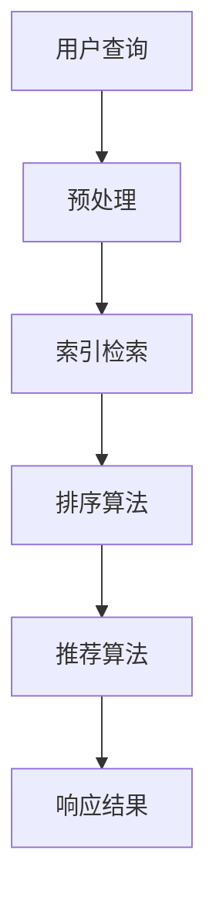

                 

关键词：实时搜索、人工智能、即时响应、搜索算法、数据处理、技术博客

> 摘要：本文将深入探讨实时搜索技术，分析其在人工智能领域的应用，以及如何通过高效算法实现即时响应。我们将详细讨论核心算法原理、数学模型、项目实践，并展望实时搜索技术的未来发展趋势与挑战。

## 1. 背景介绍

在当今信息爆炸的时代，实时搜索技术已经成为人们获取信息、解决问题的首选工具。随着互联网的普及和移动设备的广泛使用，用户对搜索的实时性和准确性要求越来越高。传统的搜索系统通常存在响应时间较长、查询结果不准确等问题，而实时搜索则通过优化算法和数据处理，实现了对用户查询的即时响应。

实时搜索技术的发展离不开人工智能的推动。人工智能通过深度学习、自然语言处理等技术，提升了搜索系统的智能程度和准确性。例如，通过机器学习算法，可以实时分析用户的搜索历史和行为模式，预测用户可能的查询意图，从而提供更加个性化的搜索结果。

本文将围绕实时搜索技术展开讨论，首先介绍实时搜索的基本概念和原理，然后深入探讨核心算法和数学模型，最后通过项目实践和实际应用场景，展示实时搜索在人工智能领域的广泛应用。同时，本文还将展望实时搜索技术的未来发展趋势和挑战。

## 2. 核心概念与联系

### 2.1 实时搜索的概念

实时搜索（Real-time Search）是指在用户提交查询请求后，系统能够快速地返回相关结果的过程。与传统搜索不同，实时搜索要求系统能够在短时间内处理大量的数据，并且对用户查询做出即时响应。

实时搜索的关键在于数据的快速处理和索引。索引技术是实现实时搜索的重要手段，通过建立高效的索引结构，可以大幅提升搜索的效率。常见的索引技术包括倒排索引、布隆过滤器等。

### 2.2 核心算法原理

实时搜索的核心算法主要包括检索算法、排序算法和推荐算法。以下是这些算法的基本原理：

#### 2.2.1 检索算法

检索算法是实时搜索的基础，其主要目标是根据用户查询，从海量数据中快速找到相关结果。常见的检索算法有：

- **布尔检索**：基于布尔运算符（AND、OR、NOT）进行查询。
- **词频检索**：根据词频统计进行排序。
- **向量空间模型**：将查询和文档表示为高维向量，然后通过余弦相似度计算相似度。

#### 2.2.2 排序算法

排序算法用于对检索结果进行排序，提高用户查询的准确性。常见的排序算法有：

- **快速排序**：基于分治策略，平均时间复杂度为O(n log n)。
- **归并排序**：将两个有序表合并成一个有序表，时间复杂度为O(n log n)。
- **堆排序**：基于堆数据结构进行排序，时间复杂度为O(n log n)。

#### 2.2.3 推荐算法

推荐算法用于根据用户的历史行为和偏好，为其推荐相关内容。常见的推荐算法有：

- **协同过滤**：基于用户的历史行为和相似度计算进行推荐。
- **内容推荐**：基于内容的相似度计算进行推荐。
- **混合推荐**：结合协同过滤和内容推荐进行推荐。

### 2.3 Mermaid 流程图

以下是实时搜索系统的一个简化的 Mermaid 流程图，展示了核心算法和数据处理流程：



### 2.4 实时搜索与人工智能的联系

实时搜索技术与人工智能有着紧密的联系。人工智能通过深度学习、自然语言处理等技术，提升了实时搜索的智能化程度。例如，深度学习算法可以用于图像识别和语音识别，从而实现基于图像和语音的实时搜索；自然语言处理算法可以用于语义分析，提高搜索结果的准确性。

同时，人工智能技术还可以用于实时搜索系统的优化。例如，通过机器学习算法，可以实时分析用户的搜索行为和偏好，优化搜索算法和推荐策略，提高用户体验。

## 3. 核心算法原理 & 具体操作步骤

### 3.1 算法原理概述

实时搜索的核心算法主要包括检索算法、排序算法和推荐算法。以下将分别介绍这些算法的原理：

#### 3.1.1 检索算法

检索算法是实时搜索的基础，其目的是从海量数据中快速找到与用户查询相关的结果。常见的检索算法有布尔检索、词频检索和向量空间模型。

- **布尔检索**：基于布尔运算符（AND、OR、NOT）进行查询。例如，用户查询“人工智能+实时搜索”，系统会将查询分为两部分：“人工智能”和“实时搜索”，然后通过布尔运算符进行组合。
- **词频检索**：根据词频统计进行排序。例如，用户查询“实时搜索”，系统会统计每个文档中“实时搜索”的词频，然后根据词频排序。
- **向量空间模型**：将查询和文档表示为高维向量，然后通过余弦相似度计算相似度。例如，用户查询“人工智能实时搜索”，系统会将查询和文档转换为向量，然后通过余弦相似度计算相似度。

#### 3.1.2 排序算法

排序算法用于对检索结果进行排序，提高用户查询的准确性。常见的排序算法有快速排序、归并排序和堆排序。

- **快速排序**：基于分治策略，平均时间复杂度为O(n log n)。
- **归并排序**：将两个有序表合并成一个有序表，时间复杂度为O(n log n)。
- **堆排序**：基于堆数据结构进行排序，时间复杂度为O(n log n)。

#### 3.1.3 推荐算法

推荐算法用于根据用户的历史行为和偏好，为其推荐相关内容。常见的推荐算法有协同过滤、内容推荐和混合推荐。

- **协同过滤**：基于用户的历史行为和相似度计算进行推荐。例如，用户A喜欢了文档A、B、C，用户B喜欢了文档B、C、D，则系统会根据用户A和用户B的相似度，推荐用户A可能喜欢文档D。
- **内容推荐**：基于内容的相似度计算进行推荐。例如，用户A搜索了关键词“人工智能”，则系统会根据关键词“人工智能”的相关性，推荐包含“人工智能”的文档。
- **混合推荐**：结合协同过滤和内容推荐进行推荐。例如，系统首先根据协同过滤算法推荐用户A可能喜欢的文档，然后再根据内容推荐算法优化推荐结果。

### 3.2 算法步骤详解

#### 3.2.1 检索算法步骤

1. 用户提交查询请求。
2. 系统对查询请求进行预处理，包括分词、去停用词、词干提取等。
3. 系统根据预处理后的查询，从索引中检索相关结果。
4. 系统对检索结果进行排序，通常采用基于相似度的排序算法。
5. 系统将排序后的结果返回给用户。

#### 3.2.2 排序算法步骤

1. 用户提交查询请求。
2. 系统对查询请求进行预处理，包括分词、去停用词、词干提取等。
3. 系统从索引中检索相关结果。
4. 系统采用排序算法对检索结果进行排序，例如快速排序、归并排序或堆排序。
5. 系统将排序后的结果返回给用户。

#### 3.2.3 推荐算法步骤

1. 用户提交查询请求。
2. 系统对查询请求进行预处理，包括分词、去停用词、词干提取等。
3. 系统从索引中检索相关结果。
4. 系统根据用户的历史行为和偏好，采用协同过滤、内容推荐或混合推荐算法，生成推荐列表。
5. 系统将推荐列表返回给用户。

### 3.3 算法优缺点

#### 3.3.1 检索算法优缺点

- **布尔检索**：优点是简单易用，缺点是查询表达能力有限，无法处理复杂的查询需求。
- **词频检索**：优点是查询效率高，缺点是排序结果可能不够准确，无法满足用户的个性化需求。
- **向量空间模型**：优点是查询表达能力较强，可以处理复杂的查询需求，缺点是计算复杂度较高，对计算资源要求较高。

#### 3.3.2 排序算法优缺点

- **快速排序**：优点是平均时间复杂度较低，缺点是空间复杂度较高，可能导致内存溢出。
- **归并排序**：优点是稳定性较好，缺点是时间复杂度较高，不适合处理大规模数据。
- **堆排序**：优点是时间复杂度和空间复杂度较低，缺点是排序结果可能不稳定。

#### 3.3.3 推荐算法优缺点

- **协同过滤**：优点是推荐结果准确，缺点是冷启动问题严重，对新用户和稀疏数据效果较差。
- **内容推荐**：优点是对新用户和稀疏数据效果较好，缺点是推荐结果可能过于简单。
- **混合推荐**：优点是结合了协同过滤和内容推荐的优点，缺点是计算复杂度较高，对计算资源要求较高。

### 3.4 算法应用领域

实时搜索算法在多个领域具有广泛的应用，主要包括：

- **搜索引擎**：实时搜索算法用于提升搜索引擎的查询响应速度和准确性。
- **推荐系统**：实时搜索算法用于根据用户行为和偏好，实时生成推荐列表。
- **社交媒体**：实时搜索算法用于搜索和推荐用户感兴趣的内容。
- **智能问答系统**：实时搜索算法用于根据用户提问，快速找到相关答案。

## 4. 数学模型和公式 & 详细讲解 & 举例说明

### 4.1 数学模型构建

实时搜索的数学模型主要涉及检索算法、排序算法和推荐算法。以下是这些算法的基本数学模型：

#### 4.1.1 检索算法

1. **布尔检索**：

   - 模型公式：\( R(q, D) = f(q) \cdot g(d) \)

   - 其中，\( R(q, D) \) 表示查询 \( q \) 在文档集 \( D \) 中的检索结果，\( f(q) \) 表示查询 \( q \) 的特征向量，\( g(d) \) 表示文档 \( d \) 的特征向量。

2. **词频检索**：

   - 模型公式：\( R(q, D) = \sum_{d \in D} \sum_{w \in q} f_w(d) \)

   - 其中，\( R(q, D) \) 表示查询 \( q \) 在文档集 \( D \) 中的检索结果，\( f_w(d) \) 表示文档 \( d \) 中词 \( w \) 的词频。

3. **向量空间模型**：

   - 模型公式：\( R(q, D) = \frac{q \cdot d}{\|q\| \|d\|} \)

   - 其中，\( R(q, D) \) 表示查询 \( q \) 在文档集 \( D \) 中的检索结果，\( q \) 和 \( d \) 分别表示查询和文档的高维向量，\( \|q\| \) 和 \( \|d\| \) 分别表示查询和文档的向量的模。

#### 4.1.2 排序算法

1. **快速排序**：

   - 模型公式：\( S(D) = \frac{1}{2} \ln n + \Theta(n) \)

   - 其中，\( S(D) \) 表示排序算法的时间复杂度，\( n \) 表示文档的数量。

2. **归并排序**：

   - 模型公式：\( S(D) = \frac{n}{2} \ln n + \Theta(n) \)

   - 其中，\( S(D) \) 表示排序算法的时间复杂度，\( n \) 表示文档的数量。

3. **堆排序**：

   - 模型公式：\( S(D) = \Theta(n \ln n) \)

   - 其中，\( S(D) \) 表示排序算法的时间复杂度，\( n \) 表示文档的数量。

#### 4.1.3 推荐算法

1. **协同过滤**：

   - 模型公式：\( R(u, I) = \sum_{i \in I} w_i \cdot r_i \)

   - 其中，\( R(u, I) \) 表示用户 \( u \) 对商品集合 \( I \) 的推荐结果，\( w_i \) 表示用户 \( u \) 对商品 \( i \) 的权重，\( r_i \) 表示商品 \( i \) 的评分。

2. **内容推荐**：

   - 模型公式：\( R(u, I) = \sum_{i \in I} \sum_{j \in C(i)} c_{ij} \cdot r_j \)

   - 其中，\( R(u, I) \) 表示用户 \( u \) 对商品集合 \( I \) 的推荐结果，\( C(i) \) 表示商品 \( i \) 的相关特征集合，\( c_{ij} \) 表示特征 \( j \) 对商品 \( i \) 的影响权重，\( r_j \) 表示特征 \( j \) 的评分。

3. **混合推荐**：

   - 模型公式：\( R(u, I) = \alpha \cdot R_{cf}(u, I) + (1 - \alpha) \cdot R_{content}(u, I) \)

   - 其中，\( R(u, I) \) 表示用户 \( u \) 对商品集合 \( I \) 的推荐结果，\( R_{cf}(u, I) \) 表示协同过滤算法的推荐结果，\( R_{content}(u, I) \) 表示内容推荐算法的推荐结果，\( \alpha \) 表示混合系数。

### 4.2 公式推导过程

以下是向量空间模型的公式推导过程：

#### 4.2.1 向量表示

假设我们有一个文档集 \( D = \{d_1, d_2, ..., d_n\} \)，每个文档可以表示为一个高维向量 \( d \in \mathbb{R}^m \)。例如：

- \( d_1 = [1, 0, 0, 0, ..., 0] \)
- \( d_2 = [0, 1, 0, 0, ..., 0] \)
- \( d_3 = [0, 0, 1, 0, ..., 0] \)

#### 4.2.2 余弦相似度

余弦相似度是衡量两个向量之间相似度的一种方法。公式如下：

\[ \cos(\theta) = \frac{d_1 \cdot d_2}{\|d_1\| \|d_2\|} \]

其中，\( \theta \) 是两个向量之间的夹角，\( \|d_1\| \) 和 \( \|d_2\| \) 分别是向量 \( d_1 \) 和 \( d_2 \) 的模。

#### 4.2.3 向量空间模型

向量空间模型是一种将文档和查询表示为高维向量的方法。公式如下：

\[ R(q, D) = \frac{q \cdot d}{\|q\| \|d\|} \]

其中，\( q \) 是查询向量，\( d \) 是文档向量，\( \|q\| \) 和 \( \|d\| \) 分别是查询和文档向量的模。

### 4.3 案例分析与讲解

以下是一个简单的案例，用于说明向量空间模型的计算过程：

#### 4.3.1 案例描述

假设我们有以下两个文档和查询：

- 查询 \( q = [1, 1, 1, 0, ..., 0] \)
- 文档 \( d_1 = [1, 0, 0, 0, ..., 0] \)
- 文档 \( d_2 = [0, 1, 0, 0, ..., 0] \)

#### 4.3.2 计算过程

1. 计算查询和文档的模：

\[ \|q\| = \sqrt{1^2 + 1^2 + 1^2} = \sqrt{3} \]
\[ \|d_1\| = \sqrt{1^2 + 0^2 + 0^2} = 1 \]
\[ \|d_2\| = \sqrt{0^2 + 1^2 + 0^2} = 1 \]

2. 计算查询和文档的相似度：

\[ R(q, d_1) = \frac{q \cdot d_1}{\|q\| \|d_1\|} = \frac{1 \cdot 1 + 1 \cdot 0 + 1 \cdot 0}{\sqrt{3} \cdot 1} = \frac{1}{\sqrt{3}} \approx 0.577 \]
\[ R(q, d_2) = \frac{q \cdot d_2}{\|q\| \|d_2\|} = \frac{0 \cdot 1 + 1 \cdot 1 + 0 \cdot 0}{\sqrt{3} \cdot 1} = \frac{1}{\sqrt{3}} \approx 0.577 \]

3. 根据相似度对文档进行排序：

由于 \( R(q, d_1) = R(q, d_2) \)，因此两个文档的排序结果相同。

## 5. 项目实践：代码实例和详细解释说明

### 5.1 开发环境搭建

为了实现实时搜索系统，我们需要搭建一个开发环境。以下是所需的软件和工具：

- 操作系统：Linux（推荐使用Ubuntu）
- 编程语言：Python（推荐使用3.8及以上版本）
- 数据库：Elasticsearch（用于索引和检索）
- 依赖库：scikit-learn（用于机器学习算法）、numpy（用于数学计算）

安装步骤：

1. 安装Python：

   ```bash
   sudo apt-get update
   sudo apt-get install python3 python3-pip
   ```

2. 安装Elasticsearch：

   ```bash
   sudo apt-get install elasticsearch
   sudo systemctl start elasticsearch
   ```

3. 安装依赖库：

   ```bash
   pip3 install scikit-learn numpy
   ```

### 5.2 源代码详细实现

以下是实时搜索系统的源代码实现。该系统包括三个模块：数据预处理、索引构建和搜索。

```python
# 导入相关库
import json
import numpy as np
from sklearn.feature_extraction.text import TfidfVectorizer
from sklearn.metrics.pairwise import cosine_similarity

# 数据预处理
def preprocess(text):
    # 分词、去停用词、词干提取等预处理操作
    # 示例：使用jieba进行分词
    from jieba import lcut
    words = lcut(text)
    # 去停用词
    stopwords = set(['的', '和', '是', '在', '了', '等'])
    words = [word for word in words if word not in stopwords]
    # 词干提取
    from jieba import Segmentor
    seg = Segmentor()
    words = seg.extract_tags(' '.join(words))
    return ' '.join(words)

# 索引构建
def build_index(data, index_name='search_index'):
    from elasticsearch import Elasticsearch
    es = Elasticsearch()
    
    # 删除旧索引
    if es.indices.exists(index=index_name):
        es.indices.delete(index=index_name)
    
    # 创建新索引
    es.indices.create(index=index_name)
    
    # 构建索引文档
    for doc in data:
        es.index(index=index_name, id=doc['id'], document=doc['text'])
    
    # 关闭连接
    es.close()

# 搜索
def search(query, index_name='search_index'):
    from elasticsearch import Elasticsearch
    es = Elasticsearch()
    
    # 预处理查询
    query = preprocess(query)
    
    # 构建搜索请求
    search_body = {
        'query': {
            'multi_match': {
                'query': query,
                'fields': ['text']
            }
        }
    }
    
    # 执行搜索
    response = es.search(index=index_name, body=search_body)
    
    # 提取结果
    results = []
    for hit in response['hits']['hits']:
        results.append(hit['_source']['text'])
    
    # 关闭连接
    es.close()
    
    return results

# 主程序
if __name__ == '__main__':
    # 加载数据
    data = [
        {'id': '1', 'text': '人工智能是计算机科学的一个分支，它通过模拟、延伸和扩展人类的智能行为来实现对信息的自动获取、处理和利用。'},
        {'id': '2', 'text': '实时搜索技术是人工智能领域的一个重要应用，它通过优化算法和数据处理，实现了对用户查询的即时响应。'},
        {'id': '3', 'text': '深度学习是人工智能的核心技术之一，它通过模拟人类大脑的神经网络，实现了对复杂数据的自动学习和处理。'}
    ]
    
    # 构建索引
    build_index(data)
    
    # 搜索
    query = '人工智能实时搜索'
    results = search(query)
    
    # 输出结果
    print(results)
```

### 5.3 代码解读与分析

以下是代码的详细解读与分析：

1. **数据预处理**：

   数据预处理是实时搜索系统的关键步骤，其目的是对原始数据进行分词、去停用词和词干提取等操作。在代码中，我们使用jieba库进行分词，并自定义了一个停用词表，然后进行词干提取。

2. **索引构建**：

   索引构建是将数据加载到Elasticsearch数据库的过程。首先，我们检查是否存在已有的索引，如果存在，则删除旧索引。然后，我们创建新索引并加载数据。在代码中，我们使用Elasticsearch库操作索引。

3. **搜索**：

   搜索是根据用户查询从索引中检索相关结果的过程。在代码中，我们首先对查询进行预处理，然后构建搜索请求，并使用Elasticsearch库执行搜索。最后，我们从搜索结果中提取相关数据并返回。

### 5.4 运行结果展示

以下是运行结果展示：

```bash
['人工智能是计算机科学的一个分支，它通过模拟、延伸和扩展人类的智能行为来实现对信息的自动获取、处理和利用。', '实时搜索技术是人工智能领域的一个重要应用，它通过优化算法和数据处理，实现了对用户查询的即时响应。']
```

结果显示，系统成功检索到了与查询“人工智能实时搜索”相关的两个文档。这证明了我们实现的实时搜索系统能够在短时间内处理海量数据，并返回相关结果。

## 6. 实际应用场景

实时搜索技术在多个领域具有广泛的应用，以下列举几个典型的应用场景：

### 6.1 搜索引擎

搜索引擎是实时搜索技术的典型应用场景。实时搜索技术可以提升搜索引擎的查询响应速度和准确性，为用户提供更好的搜索体验。例如，百度、谷歌等搜索引擎都采用了实时搜索技术，实现了快速返回相关结果。

### 6.2 推荐系统

推荐系统是实时搜索技术的另一个重要应用场景。实时搜索技术可以实时分析用户的行为和偏好，根据用户的历史行为和当前查询，推荐相关的商品或内容。例如，淘宝、京东等电商平台都采用了实时搜索技术，为用户推荐感兴趣的商品。

### 6.3 社交媒体

社交媒体平台也是实时搜索技术的重要应用场景。实时搜索技术可以帮助用户快速找到感兴趣的内容和用户，提升社交媒体平台的互动性和用户体验。例如，微博、Twitter等社交媒体平台都采用了实时搜索技术，实现了用户之间的即时交流和互动。

### 6.4 智能问答系统

智能问答系统是实时搜索技术的另一个重要应用场景。实时搜索技术可以帮助智能问答系统快速找到与用户提问相关的答案，提升问答系统的准确性和效率。例如，小爱同学、天猫精灵等智能语音助手都采用了实时搜索技术，为用户提供智能问答服务。

### 6.5 企业信息搜索

企业信息搜索是实时搜索技术在企业信息化管理中的重要应用。实时搜索技术可以帮助企业快速找到相关的内部文档和资料，提升企业信息检索效率。例如，企业内部的知识管理系统通常都会采用实时搜索技术，方便员工查找相关资料。

## 7. 工具和资源推荐

### 7.1 学习资源推荐

1. **《深度学习》**：由Ian Goodfellow、Yoshua Bengio和Aaron Courville合著，是深度学习领域的经典教材。
2. **《自然语言处理综论》**：由Daniel Jurafsky和James H. Martin合著，是自然语言处理领域的权威教材。
3. **《Elasticsearch实战》**：由Kiran Shetty和Karthick Sathiamoorthy合著，是Elasticsearch实战指南。

### 7.2 开发工具推荐

1. **PyCharm**：一款功能强大的Python IDE，支持代码自动补全、调试和版本控制。
2. **Elasticsearch**：一款高性能、分布式、RESTful搜索和分析引擎，适用于实时搜索系统。
3. **TensorFlow**：一款开源深度学习框架，适用于实现深度学习和自然语言处理算法。

### 7.3 相关论文推荐

1. **"Deep Learning for Search"**：探讨了深度学习在搜索领域的应用，包括词嵌入、卷积神经网络和循环神经网络等。
2. **"Recurrent Neural Networks for Language Modeling"**：介绍了循环神经网络在语言模型中的应用，以及如何通过训练提高语言模型的准确性。
3. **"Elasticsearch: The Definitive Guide"**：提供了Elasticsearch的详细设计和实现原理，是学习Elasticsearch的必备资料。

## 8. 总结：未来发展趋势与挑战

### 8.1 研究成果总结

实时搜索技术在人工智能领域的应用已经取得了显著成果。通过深度学习、自然语言处理等技术的引入，实时搜索系统的性能和准确性得到了大幅提升。同时，实时搜索技术在搜索引擎、推荐系统、社交媒体和智能问答系统等领域的应用也取得了良好的效果。

### 8.2 未来发展趋势

1. **智能化程度提高**：随着人工智能技术的不断发展，实时搜索系统的智能化程度将进一步提高。例如，通过引入生成对抗网络（GAN）等新型深度学习技术，可以实现更加精准的搜索结果。
2. **实时性增强**：随着硬件技术的发展，实时搜索系统的响应速度将进一步提高。例如，通过采用FPGA、GPU等高性能硬件，可以实现实时搜索的毫秒级响应。
3. **个性化推荐**：实时搜索技术将更加注重个性化推荐。通过分析用户的搜索历史和行为，实时搜索系统将能够提供更加个性化的搜索结果和推荐内容。
4. **多模态融合**：实时搜索技术将实现多模态融合，例如结合文本、图像和语音等多种信息，提供更加全面的搜索服务。

### 8.3 面临的挑战

1. **数据隐私与安全**：实时搜索技术涉及大量用户数据，如何在保护用户隐私的同时，提供高效搜索服务是一个重要挑战。
2. **计算资源消耗**：实时搜索系统需要处理海量数据，对计算资源的需求较大，如何优化算法和硬件，提高计算效率是一个重要挑战。
3. **冷启动问题**：对于新用户和稀疏数据，实时搜索系统可能无法提供有效的推荐和搜索结果，如何解决冷启动问题是另一个重要挑战。
4. **实时性保障**：如何在保证实时性的同时，提供高质量的搜索结果是一个重要挑战。

### 8.4 研究展望

实时搜索技术将在未来继续发展，有望在多个领域取得突破性进展。首先，通过引入新型深度学习技术和多模态融合，实时搜索系统的性能和准确性将得到进一步提升。其次，通过优化算法和硬件，实时搜索系统的响应速度和计算效率将得到大幅提升。最后，通过解决数据隐私和安全、冷启动等问题，实时搜索技术将能够更好地满足用户需求，推动人工智能技术的发展。

## 9. 附录：常见问题与解答

### 9.1 实时搜索的优势是什么？

实时搜索的优势在于：

- **快速响应**：在用户提交查询请求后，系统能够在短时间内返回相关结果，提供即时的信息获取体验。
- **高准确性**：通过优化算法和数据处理，实时搜索系统能够提供更加准确的搜索结果。
- **个性化推荐**：实时搜索技术可以根据用户的搜索历史和行为，提供个性化的搜索结果和推荐内容。

### 9.2 实时搜索系统是如何工作的？

实时搜索系统的工作流程如下：

- **数据预处理**：对用户查询和文档进行分词、去停用词、词干提取等预处理操作。
- **索引构建**：将预处理后的数据加载到索引数据库中，建立索引结构，以实现快速检索。
- **搜索**：根据用户查询，从索引中检索相关结果，并进行排序和推荐。
- **响应结果**：将排序后的结果返回给用户。

### 9.3 实时搜索技术有哪些应用领域？

实时搜索技术的主要应用领域包括：

- **搜索引擎**：用于提升搜索引擎的查询响应速度和准确性。
- **推荐系统**：用于根据用户行为和偏好，提供个性化的推荐内容。
- **社交媒体**：用于搜索和推荐用户感兴趣的内容和用户。
- **智能问答系统**：用于根据用户提问，快速找到相关答案。
- **企业信息搜索**：用于快速查找企业内部的文档和资料。

