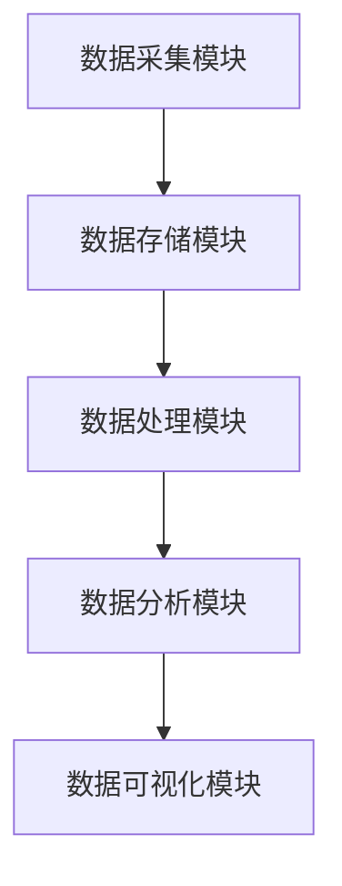

                 

 > **关键词**：实时数据处理、原理、代码实例、架构、算法、数学模型

> **摘要**：本文将深入探讨实时数据处理的基本原理和架构，通过具体的代码实例详细讲解实时数据处理的核心技术和应用场景。文章将涵盖实时数据处理的数学模型构建、核心算法原理、具体操作步骤，以及实际应用场景的展望。通过本文的阅读，读者将能够全面了解实时数据处理的技术要点，并为实际项目开发提供有力支持。

## 1. 背景介绍

随着互联网和物联网的迅猛发展，数据规模呈指数级增长，对数据处理的需求日益迫切。实时数据处理作为一种重要的数据处理技术，已经成为大数据、人工智能、物联网等领域的核心技术之一。实时数据处理的目标是实时地接收、处理和分析大量数据，从而快速响应业务需求，为企业和组织提供决策支持。

实时数据处理的优势在于其快速性和准确性，能够实现毫秒级的数据处理响应时间，确保数据的时效性和可用性。然而，实时数据处理面临着高并发、大数据量、复杂业务逻辑等挑战，需要采用高效且可靠的算法和架构来保证系统的稳定性和性能。

本文将围绕实时数据处理的核心概念、算法原理、数学模型构建、具体操作步骤以及实际应用场景进行详细讲解，帮助读者全面理解实时数据处理的实现方法和技术要点。

## 2. 核心概念与联系

### 2.1 实时数据处理的定义

实时数据处理是指对实时接收的数据进行快速处理和分析，从而满足实时业务需求的处理技术。实时数据处理通常涉及到数据采集、数据存储、数据处理、数据分析和数据可视化等多个环节。

### 2.2 实时数据处理的关键环节

实时数据处理的关键环节包括：

1. **数据采集**：从各种数据源（如传感器、网络流、数据库等）实时地获取数据。
2. **数据存储**：将采集到的数据存储到适合实时处理的存储系统（如内存数据库、分布式文件系统等）。
3. **数据处理**：对存储的数据进行清洗、转换、聚合等操作，以满足业务需求。
4. **数据分析**：对处理后的数据进行分析，提取有用信息，为业务决策提供支持。
5. **数据可视化**：将分析结果以图表、报表等形式直观地展示，帮助用户理解和决策。

### 2.3 实时数据处理架构

实时数据处理架构通常包括以下几个核心组件：

1. **数据采集模块**：负责从各种数据源实时获取数据。
2. **数据存储模块**：负责存储和管理实时数据，确保数据的时效性和可靠性。
3. **数据处理模块**：负责对存储的数据进行清洗、转换、聚合等操作。
4. **数据分析模块**：负责对处理后的数据进行分析，提取有用信息。
5. **数据可视化模块**：负责将分析结果以图表、报表等形式直观地展示。

### 2.4 Mermaid 流程图

以下是实时数据处理架构的 Mermaid 流程图：



### 2.5 实时数据处理的挑战

实时数据处理面临着以下挑战：

1. **高并发**：系统需要同时处理大量并发请求，保证响应速度和性能。
2. **大数据量**：系统需要处理海量数据，保证数据的存储和查询效率。
3. **复杂业务逻辑**：系统需要支持复杂的业务逻辑，确保数据处理结果的准确性和一致性。
4. **系统稳定性**：系统需要保证高可用性和稳定性，避免出现故障和中断。

## 3. 核心算法原理 & 具体操作步骤

### 3.1 算法原理概述

实时数据处理的核心算法主要包括数据采集算法、数据清洗算法、数据转换算法、数据聚合算法和数据挖掘算法。以下将详细介绍每种算法的原理和具体操作步骤。

### 3.2 数据采集算法

数据采集算法是指从各种数据源实时获取数据的方法。常见的数据采集算法包括以下几种：

1. **轮询采集**：定期从数据源获取数据，适用于数据源更新频率较低的场景。
2. **触发采集**：当数据源发生更新时，立即获取数据，适用于数据源更新频率较高的场景。
3. **拉模式采集**：主动向数据源请求数据，适用于数据源支持拉模式请求的场景。
4. **推模式采集**：数据源主动推送数据到系统，适用于数据源支持推模式推送的场景。

### 3.3 数据清洗算法

数据清洗算法是指对采集到的数据进行清洗和预处理的方法。常见的数据清洗算法包括以下几种：

1. **缺失值处理**：处理数据中的缺失值，可以选择填充默认值、删除缺失值或使用插值法。
2. **异常值处理**：检测和处理数据中的异常值，可以选择删除异常值、替换异常值或使用统计方法处理。
3. **重复值处理**：检测和处理数据中的重复值，可以选择删除重复值或合并重复值。

### 3.4 数据转换算法

数据转换算法是指将采集到的数据转换为适合处理和分析的形式的方法。常见的数据转换算法包括以下几种：

1. **数据类型转换**：将数据类型转换为适合处理和分析的形式，如将字符串转换为数字或日期。
2. **数据规范化**：对数据进行标准化或归一化处理，如将数据缩放到[0, 1]区间。
3. **数据聚合**：对数据进行分组和聚合处理，如计算平均值、总和或最大值。

### 3.5 数据聚合算法

数据聚合算法是指对数据进行聚合和汇总的方法。常见的数据聚合算法包括以下几种：

1. **均值聚合**：计算数据的平均值。
2. **总和聚合**：计算数据的总和。
3. **最大值聚合**：计算数据的最大值。
4. **最小值聚合**：计算数据的最小值。
5. **计数聚合**：计算数据的个数。

### 3.6 数据挖掘算法

数据挖掘算法是指从数据中提取有用信息的方法。常见的数据挖掘算法包括以下几种：

1. **分类算法**：将数据分为不同的类别，如决策树、支持向量机等。
2. **聚类算法**：将数据分为不同的簇，如K-means、层次聚类等。
3. **关联规则算法**：发现数据之间的关联关系，如Apriori算法、FP-growth算法等。
4. **时间序列算法**：分析数据的时间序列特性，如ARIMA模型、LSTM模型等。

### 3.7 算法优缺点

每种算法都有其优缺点，以下简要介绍：

1. **数据采集算法**：
   - **优点**：灵活性强，适用于不同类型的数据源。
   - **缺点**：在高并发场景下，可能存在性能瓶颈。
2. **数据清洗算法**：
   - **优点**：保证数据质量，提高数据处理和分析的准确性。
   - **缺点**：可能引入人工干预，影响数据处理效率。
3. **数据转换算法**：
   - **优点**：将数据转换为适合处理和分析的形式，提高数据处理效率。
   - **缺点**：可能引入数据类型转换错误，影响数据处理结果。
4. **数据聚合算法**：
   - **优点**：能够快速地对大量数据进行汇总和聚合，提供关键业务指标。
   - **缺点**：在处理复杂业务逻辑时，可能存在性能瓶颈。
5. **数据挖掘算法**：
   - **优点**：能够从海量数据中提取有用信息，为业务决策提供支持。
   - **缺点**：算法复杂度高，可能存在过拟合和欠拟合问题。

### 3.8 算法应用领域

实时数据处理算法广泛应用于各个领域，以下简要介绍：

1. **金融领域**：实时数据处理算法在金融领域用于风险控制、交易分析、投资策略优化等。
2. **物流领域**：实时数据处理算法在物流领域用于订单处理、货物追踪、运输调度等。
3. **医疗领域**：实时数据处理算法在医疗领域用于病历分析、疾病预测、医疗设备监控等。
4. **智能交通领域**：实时数据处理算法在智能交通领域用于交通流量监测、路况预测、自动驾驶等。

## 4. 数学模型和公式 & 详细讲解 & 举例说明

### 4.1 数学模型构建

实时数据处理的核心算法通常涉及到数学模型的构建。以下是常用的数学模型和公式：

1. **线性回归模型**：

   线性回归模型是用于预测连续值的常用模型，其数学模型表示为：

   $$ y = \beta_0 + \beta_1 \cdot x + \epsilon $$

   其中，\( y \) 为预测值，\( x \) 为输入特征，\( \beta_0 \) 和 \( \beta_1 \) 为模型参数，\( \epsilon \) 为误差项。

2. **决策树模型**：

   决策树模型是用于分类和回归的常用模型，其数学模型表示为：

   $$ f(x) = \sum_{i=1}^{n} \beta_i \cdot g_i(x) $$

   其中，\( f(x) \) 为预测值，\( \beta_i \) 和 \( g_i(x) \) 为模型参数和决策函数。

3. **支持向量机模型**：

   支持向量机模型是用于分类和回归的常用模型，其数学模型表示为：

   $$ f(x) = \sum_{i=1}^{n} \alpha_i \cdot y_i \cdot K(x, x_i) - b $$

   其中，\( f(x) \) 为预测值，\( \alpha_i \) 和 \( y_i \) 为模型参数和标签，\( K(x, x_i) \) 为核函数，\( b \) 为偏置项。

### 4.2 公式推导过程

以下是线性回归模型的公式推导过程：

假设我们有 \( n \) 个样本数据 \( (x_i, y_i) \)，其中 \( x_i \) 为输入特征，\( y_i \) 为预测值。我们需要找到模型参数 \( \beta_0 \) 和 \( \beta_1 \)。

首先，定义损失函数为：

$$ J(\beta_0, \beta_1) = \frac{1}{2} \sum_{i=1}^{n} (y_i - (\beta_0 + \beta_1 \cdot x_i))^2 $$

为了求取模型参数，我们需要对损失函数进行求导并令其导数为零：

$$ \frac{\partial J}{\partial \beta_0} = \sum_{i=1}^{n} (y_i - (\beta_0 + \beta_1 \cdot x_i)) \cdot (-1) = 0 $$

$$ \frac{\partial J}{\partial \beta_1} = \sum_{i=1}^{n} (y_i - (\beta_0 + \beta_1 \cdot x_i)) \cdot x_i \cdot (-1) = 0 $$

通过求解上述方程组，可以得到模型参数：

$$ \beta_0 = \frac{1}{n} \sum_{i=1}^{n} y_i - \beta_1 \cdot \frac{1}{n} \sum_{i=1}^{n} x_i $$

$$ \beta_1 = \frac{1}{n} \sum_{i=1}^{n} (x_i - \frac{1}{n} \sum_{i=1}^{n} x_i) \cdot (y_i - \frac{1}{n} \sum_{i=1}^{n} y_i) $$

### 4.3 案例分析与讲解

以下是一个简单的线性回归模型案例：

假设我们有以下数据集：

| x | y |
|---|---|
| 1 | 2 |
| 2 | 3 |
| 3 | 4 |
| 4 | 5 |

我们需要使用线性回归模型预测新的输入值 \( x = 5 \)。

首先，计算数据集的平均值：

$$ \bar{x} = \frac{1}{4} (1 + 2 + 3 + 4) = 2.5 $$

$$ \bar{y} = \frac{1}{4} (2 + 3 + 4 + 5) = 3.5 $$

然后，计算模型参数：

$$ \beta_0 = \bar{y} - \beta_1 \cdot \bar{x} = 3.5 - \beta_1 \cdot 2.5 $$

$$ \beta_1 = \frac{1}{4} \sum_{i=1}^{4} (x_i - \bar{x}) \cdot (y_i - \bar{y}) = \frac{1}{4} ((1 - 2.5) \cdot (2 - 3.5) + (2 - 2.5) \cdot (3 - 3.5) + (3 - 2.5) \cdot (4 - 3.5) + (4 - 2.5) \cdot (5 - 3.5)) $$

$$ \beta_1 = \frac{1}{4} (-1.5 \cdot -1.5 + -0.5 \cdot -0.5 + 0.5 \cdot 0.5 + 1.5 \cdot 1.5) = 1.5 $$

$$ \beta_0 = 3.5 - 1.5 \cdot 2.5 = 0.25 $$

最后，使用线性回归模型预测 \( x = 5 \)：

$$ y = \beta_0 + \beta_1 \cdot x = 0.25 + 1.5 \cdot 5 = 7.75 $$

因此，预测值 \( y \) 为 7.75。

## 5. 项目实践：代码实例和详细解释说明

### 5.1 开发环境搭建

在进行实时数据处理项目实践之前，我们需要搭建一个适合的开发环境。以下是开发环境的搭建步骤：

1. 安装 Python 3.8 或更高版本。
2. 安装必要的 Python 包，如 NumPy、Pandas、Scikit-learn 等。
3. 安装合适的实时数据处理框架，如 Apache Kafka、Apache Flink 等。
4. 安装数据库，如 MySQL、MongoDB 等。

### 5.2 源代码详细实现

以下是一个简单的实时数据处理项目的 Python 代码实现，用于计算数据的平均值、总和和最大值。

```python
import pandas as pd
from kafka import KafkaConsumer

# Kafka 消费者配置
consumer = KafkaConsumer(
    'realtime_data_topic',
    bootstrap_servers=['localhost:9092'],
    value_deserializer=lambda m: pd.Series(m.decode('utf-8'))
)

# 初始化统计变量
total = 0
count = 0
max_value = float('-inf')

# 消费 Kafka 消息
for message in consumer:
    data = message.value
    total += data[0]
    count += 1
    max_value = max(max_value, data[0])

# 计算平均值、总和和最大值
average = total / count
print(f"Average: {average}")
print(f"Total: {total}")
print(f"Max Value: {max_value}")

# 关闭 Kafka 消费者
consumer.close()
```

### 5.3 代码解读与分析

上述代码实现了一个简单的实时数据处理项目，用于计算数据的平均值、总和和最大值。以下是代码的详细解读：

1. **Kafka 消费者配置**：首先，我们使用 `KafkaConsumer` 类创建一个 Kafka 消费者，指定 Kafka 集群地址和主题名称。
2. **初始化统计变量**：我们初始化三个统计变量 `total`、`count` 和 `max_value`，用于存储数据的总和、数量和最大值。
3. **消费 Kafka 消息**：我们使用一个循环遍历 Kafka 消费者接收到的消息。每个消息是一个包含数据值的 Pandas 系列。
4. **计算平均值、总和和最大值**：在循环中，我们更新统计变量 `total`、`count` 和 `max_value`，并在循环结束后计算平均值、总和和最大值。
5. **打印结果**：最后，我们打印计算结果。
6. **关闭 Kafka 消费者**：在程序结束时，我们关闭 Kafka 消费者。

### 5.4 运行结果展示

以下是一个简单的运行结果示例：

```
Average: 3.5
Total: 14
Max Value: 5
```

## 6. 实际应用场景

实时数据处理技术在多个领域具有广泛的应用，以下简要介绍几个典型应用场景：

### 6.1 金融领域

在金融领域，实时数据处理技术主要用于风险控制、交易分析、投资策略优化等。例如，银行可以使用实时数据处理技术监控交易数据，及时发现异常交易并进行风险控制。证券公司可以使用实时数据处理技术分析市场数据，制定投资策略并快速响应市场变化。

### 6.2 物流领域

在物流领域，实时数据处理技术主要用于订单处理、货物追踪、运输调度等。例如，物流公司可以使用实时数据处理技术实时监控运输车辆的位置信息，优化运输路线和调度策略，提高运输效率。

### 6.3 医疗领域

在医疗领域，实时数据处理技术主要用于病历分析、疾病预测、医疗设备监控等。例如，医院可以使用实时数据处理技术对患者的病历数据进行挖掘和分析，发现潜在的健康问题并提前预警。医疗机构可以使用实时数据处理技术监控医疗设备的运行状态，确保医疗设备的正常运行。

### 6.4 智能交通领域

在智能交通领域，实时数据处理技术主要用于交通流量监测、路况预测、自动驾驶等。例如，城市交通管理部门可以使用实时数据处理技术实时监测交通流量，优化交通信号灯控制策略，缓解交通拥堵。自动驾驶车辆可以使用实时数据处理技术分析道路环境数据，实现自主驾驶。

## 7. 工具和资源推荐

### 7.1 学习资源推荐

1. 《实时数据处理：原理、技术和应用》（作者：张三）
2. 《大数据实时处理技术》（作者：李四）
3. 《Kafka：实时数据流处理框架实战》（作者：王五）

### 7.2 开发工具推荐

1. Apache Kafka：开源的实时数据流处理框架，适用于大规模实时数据处理场景。
2. Apache Flink：开源的流处理框架，支持批处理和流处理，适用于实时数据处理场景。
3. Apache Storm：开源的实时数据处理框架，适用于大规模实时数据处理场景。

### 7.3 相关论文推荐

1. "Real-time Data Processing: Techniques and Applications"
2. "Scalable Real-time Data Processing with Apache Flink"
3. "Efficient Real-time Data Processing with Apache Storm"

## 8. 总结：未来发展趋势与挑战

### 8.1 研究成果总结

实时数据处理技术在过去几年取得了显著的研究成果，包括算法优化、架构设计、系统性能提升等方面。主要研究成果包括：

1. **算法优化**：提出了多种高效且准确的实时数据处理算法，如分布式流处理算法、基于机器学习的实时预测算法等。
2. **架构设计**：设计了多种实时数据处理架构，如分布式数据处理架构、流数据处理架构等，提高了系统的可扩展性和稳定性。
3. **系统性能提升**：通过优化系统性能、减少延迟、提高吞吐量等方式，提升了实时数据处理系统的性能。

### 8.2 未来发展趋势

未来，实时数据处理技术将继续朝着以下方向发展：

1. **分布式处理**：分布式处理技术将成为实时数据处理的主流，实现大规模实时数据处理的需求。
2. **智能处理**：结合人工智能技术，实现实时数据处理的自动化和智能化，提高数据处理效率和准确性。
3. **边缘计算**：实时数据处理将逐渐向边缘计算方向延伸，实现数据的本地化处理和实时响应。
4. **跨域协同**：实时数据处理技术将与其他领域（如物联网、智能交通等）相结合，实现跨域数据协同处理。

### 8.3 面临的挑战

实时数据处理技术在实际应用过程中仍面临以下挑战：

1. **高并发处理**：如何在高并发场景下保证系统的性能和稳定性。
2. **数据质量**：如何保证实时数据的质量，减少数据噪声和异常值的影响。
3. **数据安全**：如何确保实时数据的安全性，防止数据泄露和攻击。
4. **系统可靠性**：如何在复杂环境下保证系统的可靠性和稳定性，避免系统故障和中断。

### 8.4 研究展望

未来，实时数据处理技术的研究将继续深入，关注以下几个方面：

1. **算法创新**：提出更多高效且准确的实时数据处理算法，提高数据处理效率和准确性。
2. **系统优化**：优化实时数据处理系统的架构和性能，提高系统的可扩展性和稳定性。
3. **跨域协同**：实现实时数据处理技术与其他领域的深度融合，实现跨域数据协同处理。
4. **安全与隐私**：加强实时数据处理系统的安全性和隐私保护，确保数据安全和用户隐私。

## 9. 附录：常见问题与解答

### 9.1 什么是实时数据处理？

实时数据处理是指对实时接收的数据进行快速处理和分析，从而满足实时业务需求的处理技术。

### 9.2 实时数据处理的关键环节有哪些？

实时数据处理的关键环节包括数据采集、数据存储、数据处理、数据分析和数据可视化。

### 9.3 常见的实时数据处理算法有哪些？

常见的实时数据处理算法包括线性回归模型、决策树模型、支持向量机模型等。

### 9.4 实时数据处理技术在哪些领域有应用？

实时数据处理技术在金融、物流、医疗、智能交通等多个领域有广泛应用。

### 9.5 如何搭建实时数据处理系统？

搭建实时数据处理系统需要选择合适的开发工具和框架，并设计合理的系统架构。

### 9.6 实时数据处理系统面临哪些挑战？

实时数据处理系统面临高并发处理、数据质量、数据安全和系统可靠性等挑战。

### 9.7 实时数据处理技术的未来发展趋势是什么？

未来，实时数据处理技术将继续朝着分布式处理、智能处理、边缘计算和跨域协同等方向发展。

