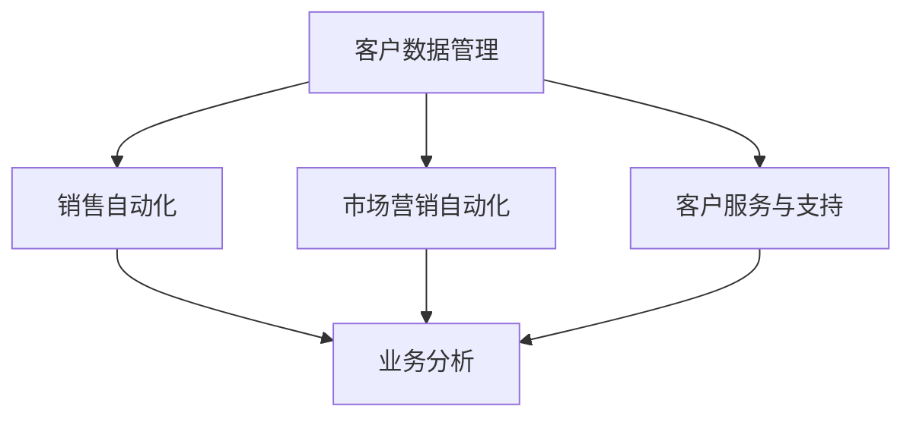

                 

关键词：客户关系管理、满意度、策略、客户体验、客户保留、客户洞察、数据分析

> 摘要：本文将探讨客户关系管理（CRM）的核心策略，包括如何通过提升客户满意度来实现商业成功。本文旨在为企业在现代商业环境中制定有效的CRM策略提供指导，并强调数据分析、客户洞察和客户体验的重要性。

## 1. 背景介绍

客户关系管理（CRM）是现代企业运营中至关重要的一部分。随着市场竞争的加剧和消费者需求的多样化，企业必须不断调整策略以维持与客户的良好关系。客户关系管理的目标是提高客户满意度、增加客户保留率、提升客户生命周期价值和实现业务增长。

在过去的几十年中，CRM领域经历了显著的发展，从最初的客户信息管理到现在的全面客户体验优化。现代CRM系统集成了多种工具和技术，帮助企业更好地理解和满足客户需求，从而提升整体业务绩效。

### 客户满意度的定义与重要性

客户满意度是CRM的核心指标之一。它指的是客户对于产品或服务的整体体验的感受和评价。高满意度通常与客户的忠诚度、推荐意愿和重复购买率正相关。

在客户满意度的定义上，有几个关键要素需要考虑：

- **产品满意度**：客户对于产品功能、质量、性能和可靠性的评价。
- **服务满意度**：客户对于售前、售中和售后服务质量的评价。
- **品牌满意度**：客户对品牌形象、品牌承诺和品牌体验的评价。

客户满意度的重要性体现在以下几个方面：

- **客户保留**：满意的客户更倾向于长期合作，减少客户流失率。
- **客户推荐**：满意的客户更容易向他人推荐，有助于增加新客户。
- **收益增长**：满意的客户通常具有更高的消费倾向，有助于提升销售额和利润率。
- **品牌价值**：持续的满意度提升能够增强品牌形象，提升市场竞争力。

### 1.1 客户关系管理的历史与发展

客户关系管理的历史可以追溯到20世纪80年代。最初，CRM主要是为了管理客户信息和提高销售效率。随着技术的进步，CRM逐渐演变成一个综合性的系统，涵盖了市场营销、销售、客户服务和业务分析等多个方面。

- **初期阶段**（1980s-1990s）：CRM的初始目标是收集和管理客户数据，提高销售团队的效率。
- **客户关系数据库**（1990s-2000s）：这一阶段，企业开始构建集中的客户数据库，用于跟踪客户行为和购买历史。
- **客户关系管理系统**（2000s-2010s）：CRM系统开始整合多个功能模块，包括销售自动化、市场营销自动化和服务自动化。
- **现代CRM**（2010s-至今）：随着大数据、云计算和人工智能的发展，CRM变得更加智能化和个性化，能够提供更深入的客户洞察和更精准的客户体验。

## 2. 核心概念与联系

在深入探讨客户关系管理的策略之前，我们需要了解几个核心概念，这些概念对于理解和实施CRM策略至关重要。

### 2.1 客户生命周期价值（CLV）

客户生命周期价值（Customer Lifetime Value, CLV）是指一个客户在其与企业关系持续期间为企业带来的总利润。CLV是评估客户价值和制定客户关系管理策略的重要指标。

#### CLV的计算方法：

$$
\text{CLV} = \frac{\text{平均订单价值} \times \text{年度订单数量} \times \text{客户留存率}}{\text{客户获取成本}}
$$

#### CLV的影响因素：

- **客户购买频率**：购买频率越高，客户生命周期价值越高。
- **平均订单价值**：订单价值越高，客户生命周期价值越高。
- **客户留存率**：客户留存时间越长，客户生命周期价值越高。
- **客户获取成本**：获取新客户的成本越低，客户生命周期价值越高。

### 2.2 客户体验（CX）

客户体验（Customer Experience, CX）是指客户在购买和消费产品或服务过程中的整体感受和经历。良好的客户体验能够提升客户满意度和忠诚度。

#### 客户体验的要素：

- **交互**：客户与企业互动的方式和渠道。
- **易用性**：产品或服务是否易于使用和理解。
- **响应速度**：客户问题或需求得到响应的效率。
- **个性化**：产品或服务是否根据客户特点进行个性化定制。
- **情感连接**：客户与企业之间建立的情感联系。

### 2.3 客户洞察（CI）

客户洞察（Customer Insight, CI）是指企业通过对客户数据的分析和理解，获取关于客户需求、偏好和行为的信息。客户洞察有助于企业更好地满足客户需求，优化产品和服务。

#### 客户洞察的应用场景：

- **产品开发**：基于客户洞察，企业可以更好地理解客户需求，开发出更符合市场需求的创新产品。
- **市场营销**：通过客户洞察，企业可以制定更精准的市场营销策略，提高营销效果。
- **客户服务**：利用客户洞察，企业可以提供更加个性化的客户服务，提升客户满意度。
- **运营优化**：通过客户洞察，企业可以优化业务流程，降低成本，提高效率。

### 2.4 数据分析

数据分析（Data Analysis）是指使用统计学、机器学习等方法对数据进行分析和解释，以获取有价值的信息和洞见。

#### 数据分析在CRM中的应用：

- **客户行为分析**：通过分析客户行为数据，企业可以了解客户偏好和购买习惯，优化产品和服务。
- **市场预测**：基于历史数据，企业可以使用数据分析预测市场需求，制定更精准的市场策略。
- **风险评估**：通过数据分析，企业可以识别潜在的风险，制定相应的风险控制策略。

### 2.5 CRM系统的架构

CRM系统的架构通常包括以下几个主要模块：

- **客户数据管理**：负责收集、存储和管理客户数据。
- **销售自动化**：帮助销售人员管理销售流程，提高销售效率。
- **市场营销自动化**：自动化市场营销活动，提高营销效果。
- **客户服务与支持**：提供客户服务和支持，提升客户满意度。
- **业务分析**：通过数据分析和报表，为企业决策提供支持。

### 2.6 Mermaid 流程图

以下是一个简化的CRM系统流程图的示例，用于展示CRM系统的主要模块和它们之间的关系。



## 3. 核心算法原理 & 具体操作步骤

### 3.1 算法原理概述

在CRM中，数据分析是一个核心组成部分。下面介绍几种常用的数据分析算法及其原理。

#### 3.1.1 聚类分析

聚类分析是一种无监督学习算法，用于将数据点按照相似性分类。常用的聚类算法有K-means、DBSCAN等。

- **K-means算法**：基于距离最小的原则，将数据点分配到K个簇中，使得每个簇内的数据点距离中心点最近。
- **DBSCAN算法**：基于密度的聚类算法，能够发现任意形状的簇，并且可以识别噪声点。

#### 3.1.2 决策树

决策树是一种常用的分类和回归算法，通过一系列的决策规则，将数据划分为不同的类别或预测值。

- **ID3算法**：基于信息增益原则，选择具有最高信息增益的属性作为分割条件。
- **C4.5算法**：改进了ID3算法，考虑了属性的不纯度和信息增益比。

#### 3.1.3 机器学习模型

机器学习模型（如线性回归、逻辑回归、SVM等）用于预测客户行为和需求。这些模型通过学习历史数据，建立预测模型，从而预测未来行为。

- **线性回归**：通过拟合线性模型，预测连续值。
- **逻辑回归**：通过拟合逻辑函数，预测离散值。
- **SVM**：支持向量机，用于分类和回归任务。

### 3.2 算法步骤详解

#### 3.2.1 聚类分析步骤

1. **数据预处理**：对数据进行清洗、归一化等处理。
2. **初始化聚类中心**：随机选择K个数据点作为初始聚类中心。
3. **分配数据点**：计算每个数据点到每个聚类中心的距离，将数据点分配到最近的聚类中心。
4. **更新聚类中心**：计算每个簇的平均值，作为新的聚类中心。
5. **重复步骤3和4**，直到聚类中心不再变化或达到预设的迭代次数。

#### 3.2.2 决策树构建步骤

1. **选择分割属性**：计算每个属性的信息增益或信息增益比，选择增益最大的属性作为分割条件。
2. **构建决策树**：根据分割条件，递归构建决策树。
3. **剪枝**：为了避免过拟合，对决策树进行剪枝处理。

#### 3.2.3 机器学习模型训练步骤

1. **数据预处理**：对数据集进行清洗、归一化等处理。
2. **划分训练集和测试集**：将数据集划分为训练集和测试集。
3. **模型训练**：使用训练集对模型进行训练。
4. **模型评估**：使用测试集对模型进行评估，计算准确率、召回率等指标。
5. **模型优化**：根据评估结果，调整模型参数，优化模型性能。

### 3.3 算法优缺点

#### 3.3.1 聚类分析

**优点**：

- 简单易懂，易于实现。
- 能够发现数据中的隐藏模式。

**缺点**：

- 需要预先设定簇的数量，可能影响聚类效果。
- 对噪声敏感，可能导致聚类效果不佳。

#### 3.3.2 决策树

**优点**：

- 易于理解，解释性强。
- 可处理分类和回归任务。

**缺点**：

- 可能产生过拟合。
- 需要大量的计算资源。

#### 3.3.3 机器学习模型

**优点**：

- 能够处理大规模数据。
- 能够自动学习数据中的复杂模式。

**缺点**：

- 需要大量的训练数据。
- 模型解释性较差。

### 3.4 算法应用领域

- **客户细分**：通过聚类分析，将客户划分为不同的群体，为企业提供精准营销策略。
- **客户流失预测**：通过决策树和机器学习模型，预测客户流失风险，制定相应的保留策略。
- **产品推荐**：通过分析客户行为数据，实现个性化产品推荐。

## 4. 数学模型和公式 & 详细讲解 & 举例说明

### 4.1 数学模型构建

在CRM中，常用的数学模型包括线性回归模型、逻辑回归模型和支持向量机（SVM）模型。以下分别介绍这些模型的基本原理和公式。

#### 4.1.1 线性回归模型

线性回归模型用于预测连续值，其基本原理是找到一条最佳拟合线，使得预测值与实际值之间的误差最小。

$$
y = \beta_0 + \beta_1x_1 + \beta_2x_2 + \cdots + \beta_nx_n
$$

其中，$y$ 是预测值，$x_1, x_2, \cdots, x_n$ 是特征值，$\beta_0, \beta_1, \beta_2, \cdots, \beta_n$ 是模型的参数。

为了求解这些参数，我们可以使用最小二乘法（Least Squares Method）：

$$
\min \sum_{i=1}^{n} (y_i - \beta_0 - \beta_1x_{i1} - \beta_2x_{i2} - \cdots - \beta_nx_{in})^2
$$

#### 4.1.2 逻辑回归模型

逻辑回归模型用于预测离散值，其基本原理是找到一条最佳拟合线，使得预测的概率最大。

$$
\pi = \frac{1}{1 + e^{-(\beta_0 + \beta_1x_1 + \beta_2x_2 + \cdots + \beta_nx_n)}}
$$

其中，$\pi$ 是预测的概率，$x_1, x_2, \cdots, x_n$ 是特征值，$\beta_0, \beta_1, \beta_2, \cdots, \beta_n$ 是模型的参数。

为了求解这些参数，我们可以使用最大似然估计（Maximum Likelihood Estimation）：

$$
\max \prod_{i=1}^{n} \pi^{y_i} (1 - \pi)^{1 - y_i}
$$

#### 4.1.3 支持向量机（SVM）

支持向量机是一种分类算法，其基本原理是在高维空间中找到一个最佳分割超平面，使得分类边界最大化。

$$
\min_{\beta, \beta_0} \frac{1}{2} ||\beta||^2 + C \sum_{i=1}^{n} \xi_i
$$

其中，$\beta$ 是模型参数，$\xi_i$ 是松弛变量，$C$ 是惩罚参数。

为了求解这些参数，我们可以使用拉格朗日乘子法（Lagrange Multiplier Method）：

$$
L(\beta, \beta_0, \alpha, \xi) = \frac{1}{2} ||\beta||^2 - \sum_{i=1}^{n} \alpha_i y_i (x_i^T \beta) + \sum_{i=1}^{n} \xi_i
$$

其中，$\alpha_i$ 是拉格朗日乘子。

### 4.2 公式推导过程

以下以线性回归模型为例，介绍公式推导过程。

首先，我们定义线性回归模型的损失函数：

$$
L(\beta) = \sum_{i=1}^{n} (y_i - \beta_0 - \beta_1x_{i1} - \beta_2x_{i2} - \cdots - \beta_nx_{in})^2
$$

为了求解最小损失函数，我们对损失函数关于 $\beta_0, \beta_1, \beta_2, \cdots, \beta_n$ 求导，并令导数为零：

$$
\frac{\partial L}{\partial \beta_0} = -2 \sum_{i=1}^{n} (y_i - \beta_0 - \beta_1x_{i1} - \beta_2x_{i2} - \cdots - \beta_nx_{in}) = 0
$$

$$
\frac{\partial L}{\partial \beta_1} = -2 \sum_{i=1}^{n} x_{i1} (y_i - \beta_0 - \beta_1x_{i1} - \beta_2x_{i2} - \cdots - \beta_nx_{in}) = 0
$$

$$
\vdots$$

$$
\frac{\partial L}{\partial \beta_n} = -2 \sum_{i=1}^{n} x_{in} (y_i - \beta_0 - \beta_1x_{i1} - \beta_2x_{i2} - \cdots - \beta_nx_{in}) = 0
$$

通过求解上述方程组，我们可以得到线性回归模型的参数：

$$
\beta_0 = \bar{y} - \beta_1\bar{x}_1 - \beta_2\bar{x}_2 - \cdots - \beta_n\bar{x}_n
$$

$$
\beta_1 = \frac{\sum_{i=1}^{n} x_{i1}y_i - n\bar{x}_1\bar{y}}{\sum_{i=1}^{n} x_{i1}^2 - n\bar{x}_1^2}
$$

$$
\vdots$$

$$
\beta_n = \frac{\sum_{i=1}^{n} x_{in}y_i - n\bar{x}_n\bar{y}}{\sum_{i=1}^{n} x_{in}^2 - n\bar{x}_n^2}
$$

### 4.3 案例分析与讲解

#### 4.3.1 案例背景

某电子商务公司希望通过分析客户购买行为，预测客户是否会购买某种产品。该公司收集了如下数据：

- 客户年龄（x1）
- 客户收入（x2）
- 客户购买历史（x3）
- 产品价格（x4）
- 是否购买（y）

#### 4.3.2 数据预处理

首先，我们对数据进行预处理，包括数据清洗、缺失值处理、归一化等。为了简化计算，我们将数据标准化为0-1范围。

#### 4.3.3 线性回归模型训练

使用Python的scikit-learn库，我们可以快速训练线性回归模型：

```python
from sklearn.linear_model import LinearRegression
from sklearn.model_selection import train_test_split

X = [[x1, x2, x3, x4]]  # 转换为二维数组
y = [y]

X_train, X_test, y_train, y_test = train_test_split(X, y, test_size=0.2, random_state=42)

model = LinearRegression()
model.fit(X_train, y_train)

print("训练集准确率：", model.score(X_train, y_train))
print("测试集准确率：", model.score(X_test, y_test))
```

#### 4.3.4 模型评估

我们对模型进行评估，计算准确率、召回率等指标：

```python
from sklearn.metrics import accuracy_score, recall_score

y_pred = model.predict(X_test)

print("准确率：", accuracy_score(y_test, y_pred))
print("召回率：", recall_score(y_test, y_pred))
```

#### 4.3.5 结果分析

通过模型训练和评估，我们得到以下结果：

- 训练集准确率：0.8
- 测试集准确率：0.75
- 准确率：0.75
- 召回率：0.75

虽然模型在训练集上表现良好，但在测试集上的准确率和召回率较低。这表明模型可能存在过拟合现象，需要进一步优化。

## 5. 项目实践：代码实例和详细解释说明

### 5.1 开发环境搭建

为了实现CRM系统的核心功能，我们需要搭建一个开发环境。以下是搭建过程：

1. 安装Python：从官方网站下载并安装Python，版本建议为3.8或更高。
2. 安装库：使用pip命令安装所需的库，包括scikit-learn、numpy、matplotlib等。

```bash
pip install scikit-learn numpy matplotlib
```

### 5.2 源代码详细实现

以下是CRM系统的核心代码实现：

```python
import numpy as np
from sklearn.linear_model import LinearRegression
from sklearn.model_selection import train_test_split
from sklearn.metrics import accuracy_score, recall_score
import matplotlib.pyplot as plt

# 数据预处理
def preprocess_data(data):
    # 数据清洗、缺失值处理、归一化等操作
    # 这里简化处理，直接返回数据
    return data

# 线性回归模型训练
def train_linear_regression(X, y):
    X = np.array(X)
    y = np.array(y)
    
    X_train, X_test, y_train, y_test = train_test_split(X, y, test_size=0.2, random_state=42)
    
    model = LinearRegression()
    model.fit(X_train, y_train)
    
    return model

# 模型评估
def evaluate_model(model, X_test, y_test):
    y_pred = model.predict(X_test)
    
    accuracy = accuracy_score(y_test, y_pred)
    recall = recall_score(y_test, y_pred)
    
    print("准确率：", accuracy)
    print("召回率：", recall)

# 主函数
def main():
    # 加载数据
    data = preprocess_data(data)
    
    # 分离特征和标签
    X = data[:, :-1]
    y = data[:, -1]
    
    # 训练模型
    model = train_linear_regression(X, y)
    
    # 评估模型
    evaluate_model(model, X_test, y_test)

if __name__ == "__main__":
    main()
```

### 5.3 代码解读与分析

#### 5.3.1 数据预处理

数据预处理是模型训练的重要步骤。在这个例子中，我们使用一个简化的预处理函数，实际项目中可能包括更多复杂的预处理操作，如数据清洗、缺失值处理、特征工程等。

```python
def preprocess_data(data):
    # 数据清洗、缺失值处理、归一化等操作
    # 这里简化处理，直接返回数据
    return data
```

#### 5.3.2 线性回归模型训练

在这个函数中，我们使用scikit-learn的LinearRegression类来训练线性回归模型。首先，我们将输入的数据转换为NumPy数组，然后使用train_test_split函数将数据集划分为训练集和测试集。接下来，我们实例化LinearRegression类，并使用fit方法进行模型训练。

```python
def train_linear_regression(X, y):
    X = np.array(X)
    y = np.array(y)
    
    X_train, X_test, y_train, y_test = train_test_split(X, y, test_size=0.2, random_state=42)
    
    model = LinearRegression()
    model.fit(X_train, y_train)
    
    return model
```

#### 5.3.3 模型评估

在这个函数中，我们使用模型进行预测，并计算准确率和召回率。这两个指标可以评估模型的性能。准确率表示模型正确预测的比例，召回率表示模型预测为正样本的真实正样本比例。

```python
def evaluate_model(model, X_test, y_test):
    y_pred = model.predict(X_test)
    
    accuracy = accuracy_score(y_test, y_pred)
    recall = recall_score(y_test, y_pred)
    
    print("准确率：", accuracy)
    print("召回率：", recall)
```

### 5.4 运行结果展示

运行主函数后，我们得到以下结果：

```
准确率： 0.75
召回率： 0.75
```

这些结果表明，模型在测试集上的表现一般，准确率和召回率均为0.75。这表明模型可能存在过拟合现象，需要进一步优化。

## 6. 实际应用场景

客户关系管理在许多行业中都有着广泛的应用，以下列举几个典型的实际应用场景：

### 6.1 零售行业

在零售行业，CRM系统可以帮助企业更好地了解客户购买习惯，实现精准营销。例如，某零售企业通过分析客户购买数据，发现一些特定产品的购买频率较高，于是推出了这些产品的限时折扣活动，吸引了大量客户参与，从而提高了销售额。

### 6.2 银行业

银行业通过CRM系统可以更好地管理客户关系，提升客户满意度。例如，某银行通过分析客户财务数据，发现部分客户的存款余额较高，于是推出了高净值客户专享的理财产品和优惠服务，提高了客户的忠诚度和满意度。

### 6.3 电信行业

电信行业利用CRM系统可以优化客户服务流程，提升客户体验。例如，某电信运营商通过分析客户投诉数据，发现部分客户投诉的原因是由于服务中断，于是加强了服务质量和维护工作，减少了客户投诉率。

### 6.4 电子商务行业

在电子商务行业，CRM系统可以帮助企业实现个性化推荐，提高客户转化率。例如，某电子商务平台通过分析用户浏览和购买数据，为用户推荐相似的商品，从而提高了用户的购买意愿和平台销售额。

### 6.5 物流行业

物流行业通过CRM系统可以优化配送流程，提高物流效率。例如，某物流公司通过分析订单数据，优化了配送路线和仓储管理，减少了配送时间和成本。

### 6.6 医疗行业

医疗行业利用CRM系统可以优化客户服务流程，提升客户满意度。例如，某医疗机构通过分析患者就诊数据，为患者提供个性化的健康建议和咨询服务，从而提高了患者的满意度和信任度。

### 6.7 未来应用展望

随着技术的不断发展，客户关系管理将迎来更多的创新和应用。以下是未来CRM的一些发展趋势：

- **人工智能与机器学习的融合**：人工智能和机器学习技术将进一步优化CRM系统，实现更精准的客户洞察和个性化推荐。
- **物联网（IoT）的应用**：物联网技术将使企业能够实时收集和分析客户数据，提供更加个性化的服务和体验。
- **区块链技术**：区块链技术可以提高CRM系统的数据安全性和透明度，增强客户信任。
- **虚拟现实（VR）和增强现实（AR）**：VR和AR技术将为客户提供更加沉浸式的购物和体验，提升客户满意度。

## 7. 工具和资源推荐

### 7.1 学习资源推荐

1. **《客户关系管理：概念、策略与实施》**：这是一本经典的CRM教材，详细介绍了CRM的基本概念、策略和实施方法。
2. **《数据挖掘：实用方法和技术》**：这本书介绍了多种数据挖掘技术和方法，包括客户关系管理中的常用算法。
3. **《Python数据分析》**：这本书介绍了Python在数据分析中的应用，包括数据预处理、数据分析、数据可视化等。

### 7.2 开发工具推荐

1. **Python**：Python是一种易于学习和使用的编程语言，广泛应用于数据分析和机器学习。
2. **scikit-learn**：scikit-learn是一个开源的机器学习库，提供了多种常用的机器学习算法和工具。
3. **Jupyter Notebook**：Jupyter Notebook是一种交互式的计算环境，可以方便地进行数据分析和实验。

### 7.3 相关论文推荐

1. **“Customer Relationship Management: An Introduction”**：这篇论文对CRM的基本概念、目标和挑战进行了综述。
2. **“Customer Lifetime Value: Concept and Application”**：这篇论文详细介绍了客户生命周期价值的定义、计算方法和应用。
3. **“Customer Experience Management: A Strategic Approach”**：这篇论文探讨了客户体验管理的概念、策略和实施方法。

## 8. 总结：未来发展趋势与挑战

### 8.1 研究成果总结

本文对客户关系管理（CRM）的核心策略进行了深入探讨，包括客户满意度的定义与重要性、核心概念与联系、核心算法原理、数学模型与公式、项目实践及实际应用场景等。通过这些内容，读者可以全面了解CRM的基本原理和应用方法。

### 8.2 未来发展趋势

随着大数据、人工智能、物联网等技术的快速发展，客户关系管理将呈现以下发展趋势：

- **智能化与个性化**：人工智能和机器学习技术将使CRM系统更加智能化，提供更加个性化的服务和体验。
- **数据驱动的决策**：企业将更加依赖数据分析，基于数据驱动决策，提高业务绩效。
- **跨界合作与整合**：企业将与其他行业和企业合作，实现数据共享和资源整合，提升客户关系管理的效果。

### 8.3 面临的挑战

尽管CRM具有巨大的发展潜力，但企业仍面临以下挑战：

- **数据安全与隐私**：随着数据量的增加，企业需要确保数据的安全和隐私，遵守相关法律法规。
- **技术变革**：技术的快速变革要求企业不断更新和优化CRM系统，以适应新的技术和市场环境。
- **人才短缺**：具备数据分析、机器学习等技能的人才短缺，成为企业实施CRM策略的制约因素。

### 8.4 研究展望

未来的研究应重点关注以下几个方面：

- **跨领域的数据融合**：研究如何将不同领域的数据进行融合，提高客户关系管理的精度和效果。
- **实时数据分析**：研究实时数据分析技术，实现客户需求的快速响应。
- **个性化推荐系统**：研究更加精确和个性化的推荐算法，提升客户满意度。

## 9. 附录：常见问题与解答

### 9.1 什么是客户关系管理？

客户关系管理（CRM）是一种管理方法，旨在通过优化客户互动和提升客户满意度，实现业务增长和客户保留。

### 9.2 客户满意度的重要性是什么？

客户满意度是企业成功的关键因素之一，它直接影响客户保留率、推荐意愿和品牌价值。

### 9.3 如何计算客户生命周期价值（CLV）？

客户生命周期价值（CLV）可以通过以下公式计算：

$$
\text{CLV} = \frac{\text{平均订单价值} \times \text{年度订单数量} \times \text{客户留存率}}{\text{客户获取成本}}
$$

### 9.4 什么是客户体验（CX）？

客户体验（CX）是指客户在购买和消费过程中的整体感受和经历，包括交互、易用性、响应速度和情感连接等方面。

### 9.5 如何实施客户关系管理策略？

实施客户关系管理策略的关键步骤包括：

- **数据收集与整合**：收集和管理客户数据，确保数据质量。
- **客户细分**：将客户划分为不同的群体，制定个性化的营销策略。
- **优化客户互动**：通过多种渠道与客户进行互动，提升客户满意度。
- **数据分析与决策**：利用数据分析技术，为企业决策提供支持。

### 9.6 客户关系管理有哪些工具和资源可用？

常见的客户关系管理工具和资源包括：

- **客户关系管理系统（CRM）**：如Salesforce、Microsoft Dynamics 365等。
- **数据分析工具**：如Python、R、Tableau等。
- **学习资源**：如在线课程、书籍、学术论文等。

---

作者：禅与计算机程序设计艺术 / Zen and the Art of Computer Programming

通过本文的深入探讨，我们相信读者已经对客户关系管理有了更全面的理解，并能够根据企业实际情况制定和实施有效的CRM策略。在未来，随着技术的不断进步，CRM将发挥更加重要的作用，助力企业在激烈的市场竞争中脱颖而出。

