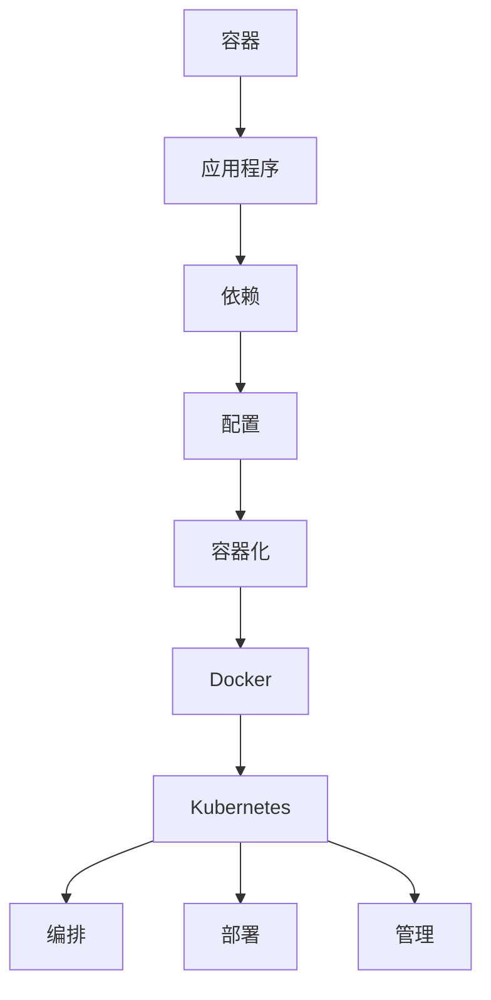

                 

关键词：容器化，Kubernetes，应用程序部署，DevOps，微服务架构，持续集成和持续部署（CI/CD）

> 摘要：本文将深入探讨容器化和Kubernetes在应用程序部署中的作用，分析其核心概念、架构设计以及在实际应用中的优势与挑战。通过详细的操作步骤和实例分析，帮助读者理解如何在现代软件开发中有效地利用这些技术。

## 1. 背景介绍

### 容器化的兴起

容器化是近年来软件开发领域的革命性变革之一。它提供了一种轻量级、可移植且与宿主机环境无关的运行环境，使得开发者可以将应用程序及其依赖打包在一起，形成一个独立的运行单元。这种独立性和可移植性极大地简化了应用程序的部署和运维过程，推动了DevOps文化的普及。

### Kubernetes的发展

随着容器化技术的广泛应用，Kubernetes作为容器编排和管理平台的重要性日益凸显。Kubernetes提供了一个强大的平台，用于自动化容器的部署、扩展和管理，解决了容器环境下大规模应用部署的难题。它支持水平扩展、故障转移、负载均衡等功能，使得开发者和运维人员能够轻松地管理复杂的分布式系统。

## 2. 核心概念与联系

### 容器

容器是一种轻量级的虚拟化技术，通过隔离操作系统环境来运行应用程序。它不仅封装了应用程序及其依赖，还保留了应用程序的运行状态，确保在不同的环境中都能一致地运行。

### Docker

Docker是容器化技术中最流行的实现，它提供了一个简洁的接口来创建、运行和分发容器。Docker容器使用Linux容器技术（LCTraces）来提供隔离，并通过Dockerfile和Docker Compose等工具来管理容器。

### Kubernetes

Kubernetes是一个开源的容器编排平台，用于自动化容器的部署、扩展和管理。它提供了一个集群管理的抽象层，使得开发者可以轻松地管理由多个容器组成的应用程序。Kubernetes的核心组件包括：

- **Master**：负责集群的管理和协调。
- **Node**：运行容器的服务器。
- **Pod**：Kubernetes中的最小部署单位，一组相关联的容器。
- **Service**：用于外部访问容器的抽象层。

### Mermaid 流程图



## 3. 核心算法原理 & 具体操作步骤

### 3.1 算法原理概述

容器化和Kubernetes的核心原理是基于微服务架构和DevOps理念。微服务架构通过将应用程序分解为小型、独立的模块，使得每个模块都可以独立开发和部署。而DevOps则强调开发与运维的无缝协作，通过自动化工具来简化应用程序的部署和管理。

### 3.2 算法步骤详解

1. **容器化应用程序**：
   - 使用Dockerfile定义应用程序的构建过程。
   - 构建并运行容器，确保应用程序及其依赖在容器中正确运行。

2. **部署到Kubernetes集群**：
   - 创建Kubernetes配置文件（如YAML）来定义应用程序的部署。
   - 使用kubectl工具部署应用程序到Kubernetes集群。

3. **管理应用程序**：
   - 监控应用程序的运行状态。
   - 进行水平扩展或故障转移。

### 3.3 算法优缺点

**优点**：
- **可移植性**：容器化和Kubernetes使得应用程序可以在不同的环境中一致地运行。
- **自动化**：Kubernetes提供了自动化部署、扩展和管理功能，简化了运维工作。
- **灵活性**：支持微服务架构，使得应用程序可以灵活扩展和更新。

**缺点**：
- **学习曲线**：Kubernetes和容器化技术的复杂度较高，需要一定的学习和实践。
- **资源消耗**：容器化会增加一定的资源消耗，尤其是在大规模部署时。

### 3.4 算法应用领域

容器化和Kubernetes在以下领域具有广泛的应用：

- **Web应用程序**：通过容器化来简化部署和扩展。
- **大数据处理**：使用Kubernetes来管理分布式数据处理任务。
- **云计算**：在云环境中部署和管理应用程序。

## 4. 数学模型和公式 & 详细讲解 & 举例说明

### 4.1 数学模型构建

在容器化环境中，我们可以使用以下数学模型来评估应用程序的性能：

- **CPU利用率**：\( \frac{CPU\_used}{CPU\_total} \)
- **内存利用率**：\( \frac{Memory\_used}{Memory\_total} \)
- **网络带宽**：\( \frac{Network\_bandwidth}{Network\_throughput} \)

### 4.2 公式推导过程

CPU利用率的公式基于应用程序在一段时间内使用的CPU时间与总CPU时间的比值。内存利用率和网络带宽的公式同理，分别反映了内存使用情况和网络吞吐量。

### 4.3 案例分析与讲解

假设我们有一个Web应用程序，其CPU利用率在高峰期达到80%，内存利用率为60%，网络带宽利用率为40%。根据上述公式，我们可以计算出：

- **CPU利用率**：\( \frac{80\%}{100\%} = 0.8 \)
- **内存利用率**：\( \frac{60\%}{100\%} = 0.6 \)
- **网络带宽利用率**：\( \frac{40\%}{100\%} = 0.4 \)

这些指标可以帮助我们了解应用程序的性能瓶颈，从而进行优化。

## 5. 项目实践：代码实例和详细解释说明

### 5.1 开发环境搭建

在本项目中，我们将使用Docker和Kubernetes进行应用程序部署。首先，确保安装了Docker和Kubernetes集群。

### 5.2 源代码详细实现

以下是一个简单的Web应用程序的Dockerfile：

```dockerfile
FROM node:12-alpine
WORKDIR /app
COPY package.json ./
RUN npm install
COPY . .
CMD ["npm", "start"]
```

### 5.3 代码解读与分析

Dockerfile定义了应用程序的构建过程，基于Node.js的Alpine镜像，安装了依赖，并复制了应用程序的代码。CMD指令指定了启动命令。

### 5.4 运行结果展示

通过以下命令构建和运行容器：

```bash
docker build -t my-app .
docker run -d -p 8080:80 my-app
```

应用程序将在8080端口上运行，可以通过浏览器访问。

## 6. 实际应用场景

### 6.1 Web应用程序

容器化和Kubernetes在Web应用程序中具有广泛的应用。通过容器化，可以轻松地部署和管理多个服务，如API网关、后端服务和前端应用程序。Kubernetes提供水平扩展和负载均衡功能，确保应用程序的高可用性和性能。

### 6.2 大数据处理

在大数据处理领域，容器化和Kubernetes可以用于管理分布式计算任务。Kubernetes集群可以动态地分配计算资源，确保数据处理任务的高效运行。

### 6.3 云计算

在云计算环境中，容器化和Kubernetes可以帮助开发者快速部署和管理应用程序。通过云服务提供商提供的Kubernetes服务，可以轻松地管理应用程序的扩展和迁移。

## 7. 工具和资源推荐

### 7.1 学习资源推荐

- Kubernetes官方文档：[https://kubernetes.io/docs/](https://kubernetes.io/docs/)
- Docker官方文档：[https://docs.docker.com/](https://docs.docker.com/)

### 7.2 开发工具推荐

- Visual Studio Code：适用于编写Kubernetes配置文件和Dockerfile。
- Kubernetes CLI工具：kubectl、kubeadm等。

### 7.3 相关论文推荐

- "Docker: Lightweight Linux Containers for Developing, Shipping, and Running Applications" by Solomon et al.
- "Kubernetes: The Definitive Guide to Container Orchestration" by R. S.aat et al.

## 8. 总结：未来发展趋势与挑战

### 8.1 研究成果总结

容器化和Kubernetes在现代软件开发中发挥着重要作用。它们提供了高效、可移植和自动化的应用程序部署和管理方案，推动了DevOps文化的普及。

### 8.2 未来发展趋势

- 容器化技术将继续发展，提供更多的功能和服务。
- Kubernetes将变得更加成熟和易用，支持更多的平台和生态系统。

### 8.3 面临的挑战

- **复杂性**：容器化和Kubernetes的复杂度较高，需要更多的学习和实践。
- **安全性**：确保容器和Kubernetes集群的安全性是一个重要挑战。

### 8.4 研究展望

未来，容器化和Kubernetes将在更多领域得到应用，如边缘计算、物联网和人工智能。此外，开源社区将继续推动这些技术的发展，提供更多创新和改进。

## 9. 附录：常见问题与解答

### 9.1 Kubernetes是什么？

Kubernetes是一个开源的容器编排平台，用于自动化容器的部署、扩展和管理。它提供了一个集群管理的抽象层，使得开发者可以轻松地管理由多个容器组成的应用程序。

### 9.2 容器化和虚拟化有什么区别？

容器化是一种轻量级的虚拟化技术，通过隔离操作系统环境来运行应用程序。而虚拟化是一种更通用的技术，可以在虚拟机中运行整个操作系统。

### 9.3 如何学习容器化和Kubernetes？

可以通过阅读官方文档、参加在线课程和实际操作来学习容器化和Kubernetes。此外，参与开源社区和加入相关的技术论坛也是很好的学习方式。

----------------------------------------------------------------

作者：禅与计算机程序设计艺术 / Zen and the Art of Computer Programming

