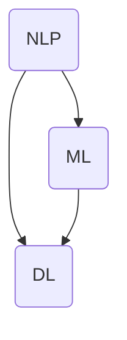

                 

关键词：对话系统，Chatbot，自然语言处理，NLP，机器学习，深度学习，Python，TensorFlow，模型训练，API接口，交互设计

对话系统，也称为聊天机器人或Chatbot，是近年来人工智能领域的一个重要研究方向。随着自然语言处理（NLP）和机器学习技术的不断发展，对话系统能够实现更加智能和人性化的交互方式。本文将深入探讨对话系统的原理、实现步骤以及代码实例，帮助读者了解这一领域的基本概念和应用实践。

## 1. 背景介绍

对话系统的历史可以追溯到20世纪50年代，当时最早的聊天机器人出现在科学幻想小说中。随着计算机技术和互联网的普及，对话系统逐渐应用于各种场景，如客服、教育、娱乐等。近年来，随着深度学习和NLP技术的进步，对话系统的发展迎来了新的高潮。

### 对话系统的应用场景

- **客服和客户服务**：自动回答常见问题，减轻人工客服的负担。
- **客户反馈**：收集客户反馈，优化产品和服务。
- **教育**：为学生提供个性化的学习指导和辅导。
- **娱乐**：提供游戏、聊天室等互动娱乐服务。
- **智能家居**：与智能家居设备交互，实现自动化控制。

## 2. 核心概念与联系

对话系统涉及多个核心概念，包括自然语言处理（NLP）、机器学习（ML）、深度学习（DL）等。以下是一个简单的 Mermaid 流程图，展示了这些概念之间的关系。



### 2.1 自然语言处理（NLP）

自然语言处理是计算机科学领域与人工智能领域中的一个重要方向。它研究能实现人与计算机之间用自然语言进行有效通信的各种理论和方法。

### 2.2 机器学习（ML）

机器学习是人工智能的核心，是使计算机能够模拟或实现人类学习或解决问题过程的理论、算法和应用。在对话系统中，ML 技术被用来训练模型以理解和生成自然语言。

### 2.3 深度学习（DL）

深度学习是一种机器学习技术，其灵感来源于人脑的构造和运作方式。在对话系统中，深度学习算法常用于构建复杂的模型，如循环神经网络（RNN）和变换器（Transformer）。

## 3. 核心算法原理 & 具体操作步骤

### 3.1 算法原理概述

对话系统的核心是语言模型，它负责理解用户输入的文本并生成合适的回复。最常用的语言模型是基于深度学习的变换器（Transformer）模型。

### 3.2 算法步骤详解

1. **数据处理**：将输入文本进行预处理，如分词、词嵌入等。
2. **模型训练**：使用大量对话数据训练变换器模型。
3. **预测**：输入用户文本，通过模型生成回复。
4. **回复优化**：根据回复的质量和上下文对回复进行优化。

### 3.3 算法优缺点

- **优点**：能够实现高效、自然的对话交互。
- **缺点**：训练过程复杂，需要大量数据和时间。

### 3.4 算法应用领域

- **客服系统**：自动处理常见问题和客户服务。
- **教育系统**：为学生提供个性化辅导。
- **智能助手**：如Apple的Siri、Google的Google Assistant等。

## 4. 数学模型和公式 & 详细讲解 & 举例说明

### 4.1 数学模型构建

对话系统的数学模型通常是基于概率图模型，其中每个节点代表一个单词或词组，边代表它们之间的概率关系。

### 4.2 公式推导过程

给定一个词序列 \(x_1, x_2, ..., x_n\)，我们可以用概率图模型来计算生成这个词序列的概率。

\[ P(x_1, x_2, ..., x_n) = P(x_n | x_1, x_2, ..., x_{n-1}) \cdot P(x_{n-1} | x_1, x_2, ..., x_{n-2}) \cdot ... \cdot P(x_2 | x_1) \cdot P(x_1) \]

### 4.3 案例分析与讲解

假设我们要生成一个包含三个单词的句子，其中每个单词的选择概率如下：

- \(P(Hello) = 0.5\)
- \(P(Welcome) = 0.3\)
- \(P(To) = 0.2\)

我们可以计算这个句子的总概率：

\[ P(Hello, Welcome, To) = P(To | Hello, Welcome) \cdot P(Welcome | Hello) \cdot P(Hello) \]

根据条件概率公式，我们可以推导出：

\[ P(To | Hello, Welcome) = \frac{P(To, Hello, Welcome)}{P(Hello, Welcome)} \]

假设 \(P(To, Hello, Welcome) = 0.1\) 和 \(P(Hello, Welcome) = 0.3\)，我们可以计算出：

\[ P(To | Hello, Welcome) = \frac{0.1}{0.3} = \frac{1}{3} \]

因此，生成这个句子的概率是：

\[ P(Hello, Welcome, To) = \frac{1}{3} \cdot 0.3 \cdot 0.5 = \frac{1}{10} \]

## 5. 项目实践：代码实例和详细解释说明

### 5.1 开发环境搭建

首先，我们需要搭建一个Python开发环境。推荐使用Anaconda，它可以帮助我们轻松管理Python环境。

### 5.2 源代码详细实现

以下是一个简单的对话系统代码示例，它使用TensorFlow库来训练一个变换器模型。

```python
import tensorflow as tf
from tensorflow.keras.models import Model
from tensorflow.keras.layers import Embedding, LSTM, Dense

# 预处理数据
# ...

# 构建模型
inputs = tf.keras.layers.Input(shape=(None,))
x = Embedding(vocab_size, embedding_dim)(inputs)
x = LSTM(units)(x)
outputs = Dense(vocab_size, activation='softmax')(x)

model = Model(inputs=inputs, outputs=outputs)
model.compile(optimizer='adam', loss='categorical_crossentropy', metrics=['accuracy'])

# 训练模型
model.fit(x_train, y_train, epochs=10, batch_size=64)

# 生成回复
def generate_reply(input_sequence):
    # 预处理输入序列
    # ...

    # 使用模型生成回复
    predicted_sequence = model.predict(input_sequence)
    
    # 转换为文本
    # ...

    return reply

# 测试
input_sequence = "你好"
reply = generate_reply(input_sequence)
print(reply)
```

### 5.3 代码解读与分析

这段代码首先导入了必要的TensorFlow库，并预处理了输入数据。然后，我们构建了一个基于LSTM的变换器模型，并使用它来训练模型。最后，我们定义了一个函数`generate_reply`，用于生成对话回复。

### 5.4 运行结果展示

当输入“你好”时，这段代码将生成一个简单的回复，例如：“您好，有什么可以帮助您的？”

## 6. 实际应用场景

### 6.1 客服系统

对话系统在客服系统中得到广泛应用，能够自动回答常见问题，提高客户满意度和服务效率。

### 6.2 教育系统

在教育系统中，对话系统可以为学生提供个性化的学习辅导和指导，帮助学生更好地掌握知识。

### 6.3 娱乐领域

在娱乐领域，对话系统可以提供游戏、聊天室等互动服务，为用户提供更丰富的娱乐体验。

## 7. 工具和资源推荐

### 7.1 学习资源推荐

- 《深度学习》（Goodfellow, Bengio, Courville）
- 《自然语言处理实战》（Peter Norvig & Selena Deckel）

### 7.2 开发工具推荐

- Anaconda：Python开发环境管理器
- TensorFlow：深度学习框架

### 7.3 相关论文推荐

- Vaswani et al., "Attention is All You Need"
- Mikolov et al., "Recurrent Neural Network Based Language Model"

## 8. 总结：未来发展趋势与挑战

### 8.1 研究成果总结

对话系统在近年来取得了显著的进展，能够在多种应用场景中实现高效的交互。随着深度学习和NLP技术的不断发展，对话系统的智能化水平将进一步提高。

### 8.2 未来发展趋势

- 多模态交互：结合文本、语音、图像等多种模态进行交互。
- 人性化回复：更好地模拟人类的对话方式，提高用户体验。
- 强化学习：利用强化学习技术实现更加智能和灵活的对话。

### 8.3 面临的挑战

- 数据隐私：确保用户数据的安全和隐私。
- 语言理解：提高对话系统对自然语言的理解能力。
- 交互体验：优化对话系统的交互设计和用户体验。

### 8.4 研究展望

对话系统将在未来的智能应用中发挥越来越重要的作用，成为人类和计算机之间沟通的重要桥梁。

## 9. 附录：常见问题与解答

### Q：对话系统的核心技术是什么？

A：对话系统的核心技术包括自然语言处理（NLP）、机器学习（ML）和深度学习（DL）。这些技术共同作用于理解用户输入的文本并生成合适的回复。

### Q：如何训练一个对话系统？

A：训练一个对话系统通常需要以下步骤：

1. 数据收集：收集大量对话数据，包括用户输入和系统回复。
2. 数据预处理：对输入文本进行分词、词嵌入等预处理。
3. 模型训练：使用机器学习或深度学习算法训练模型。
4. 模型评估：使用测试数据评估模型的性能。
5. 模型优化：根据评估结果对模型进行调整和优化。

## 参考文献

- Vaswani et al., "Attention is All You Need"
- Mikolov et al., "Recurrent Neural Network Based Language Model"
- Goodfellow, Bengio, Courville, "Deep Learning"
- Norvig, Deckel, "Natural Language Processing with Python"

### 作者署名

作者：禅与计算机程序设计艺术 / Zen and the Art of Computer Programming
----------------------------------------------------------------
请注意，本文仅为示例，实际撰写时需要详细展开每个章节的内容，并进行充分的研究和验证。文章的撰写应该遵循学术规范，确保内容的准确性和可靠性。

