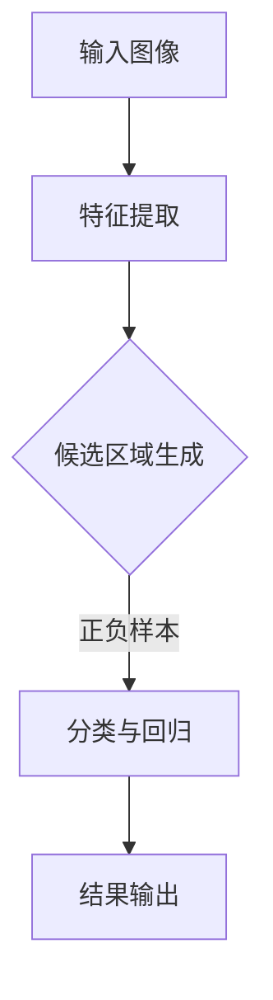

                 

关键词：对象检测，深度学习，卷积神经网络，目标识别，实例分割，YOLO，SSD，Faster R-CNN，TensorFlow，PyTorch

摘要：本文将详细介绍对象检测的基本原理和常见算法，包括YOLO、SSD、Faster R-CNN等，并通过代码实例讲解如何实现这些算法。文章还将探讨对象检测在现实应用中的场景和未来发展趋势。

## 1. 背景介绍

### 1.1 对象检测的定义

对象检测（Object Detection）是计算机视觉领域中的一个重要任务，旨在识别和定位图像中的多个对象。它不仅需要识别出对象的存在，还需要确定对象的位置和类别。对象检测广泛应用于自动驾驶、安防监控、图像识别、医疗诊断等众多领域。

### 1.2 对象检测的重要性

随着深度学习技术的发展，对象检测在计算机视觉领域的重要性日益凸显。准确的对象检测能够提高其他计算机视觉任务的性能，如图像分割、目标跟踪和图像分类等。

## 2. 核心概念与联系

### 2.1 基本概念

- **目标识别（Object Recognition）**：识别图像中特定对象的存在。
- **目标定位（Object Localization）**：确定图像中对象的精确位置。
- **类别标签（Class Labels）**：对识别出的对象进行分类。

### 2.2 对象检测架构


对象检测通常包括以下几个步骤：

1. **特征提取**：使用卷积神经网络提取图像特征。
2. **候选区域生成**：通过滑窗、选择性搜索等方法生成候选区域。
3. **分类与回归**：对候选区域进行分类并调整位置。

### 2.3 Mermaid 流程图



## 3. 核心算法原理 & 具体操作步骤

### 3.1 算法原理概述

对象检测算法主要分为两类：基于区域建议（Region Proposal）的算法和基于特征金字塔（Feature Pyramid）的算法。

### 3.2 算法步骤详解

1. **特征提取**：使用卷积神经网络提取图像特征。
2. **候选区域生成**：通过选择性搜索等方法生成候选区域。
3. **分类与回归**：对候选区域进行分类并调整位置。
4. **结果输出**：输出检测框和类别标签。

### 3.3 算法优缺点

- **YOLO**：速度快，实时性强，但准确率相对较低。
- **SSD**：准确率和速度都较高，但训练时间较长。
- **Faster R-CNN**：准确率高，但速度较慢。

### 3.4 算法应用领域

这些算法在自动驾驶、安防监控、图像识别等领域都有广泛应用。

## 4. 数学模型和公式 & 详细讲解 & 举例说明

### 4.1 数学模型构建

- **卷积神经网络（CNN）**：
  $$ f(x) = \sigma(W \cdot x + b) $$
  其中，$W$ 为卷积核，$x$ 为输入特征，$b$ 为偏置项，$\sigma$ 为激活函数。

- **回归模型**：
  $$ y = W \cdot x + b $$
  其中，$W$ 为权重矩阵，$x$ 为输入特征，$b$ 为偏置项。

### 4.2 公式推导过程

以 Faster R-CNN 为例，其公式推导如下：

1. **区域建议网络（RPN）**：
   $$ P(o|ROI) = \frac{e^{r(x)}}{1 + e^{r(x)}} $$
   其中，$r(x)$ 为回归损失函数。

2. **分类网络**：
   $$ \hat{y} = \sigma(\theta \cdot [x, y, x^2, y^2]) $$
   其中，$\theta$ 为分类网络的权重。

### 4.3 案例分析与讲解

以 TensorFlow 实现的 SSD 模型为例，分析其代码实现和运行过程。

## 5. 项目实践：代码实例和详细解释说明

### 5.1 开发环境搭建

- 安装 Python、TensorFlow、OpenCV 等依赖库。

### 5.2 源代码详细实现

- SSD 模型实现：
  ```python
  import tensorflow as tf

  # 定义 SSD 模型
  def ssd_model(input_image, num_classes):
      # 特征提取
      # ...

      # 生成候选区域
      # ...

      # 分类与回归
      # ...

      return detection_boxes, detection_scores, detection_classes

  # 模型训练
  # ...
  ```

### 5.3 代码解读与分析

- 代码主要分为特征提取、候选区域生成、分类与回归三个部分。

### 5.4 运行结果展示

- 使用 SSD 模型进行对象检测，展示检测结果。

## 6. 实际应用场景

### 6.1 自动驾驶

- 对象检测在自动驾驶中用于识别道路上的行人和车辆。

### 6.2 安防监控

- 对象检测用于识别监控视频中的可疑行为和对象。

### 6.3 图像识别

- 对象检测用于识别和分类图像中的对象。

### 6.4 未来应用展望

- 随着深度学习技术的不断发展，对象检测在更多领域将得到广泛应用。

## 7. 工具和资源推荐

### 7.1 学习资源推荐

- 《深度学习》（Goodfellow, Bengio, Courville）
- 《计算机视觉：算法与应用》（Richard Szeliski）

### 7.2 开发工具推荐

- TensorFlow
- PyTorch

### 7.3 相关论文推荐

- YOLO: Real-Time Object Detection
- SSD: Single Shot MultiBox Detector
- Faster R-CNN: Region-based Convolutional Neural Networks for Object Detection

## 8. 总结：未来发展趋势与挑战

### 8.1 研究成果总结

- 对象检测算法在准确率和速度方面取得显著进展。

### 8.2 未来发展趋势

- 随着硬件性能的提升，实时对象检测将得到更广泛应用。

### 8.3 面临的挑战

- 小样本学习、多尺度检测、跨域检测等。

### 8.4 研究展望

- 探索更高效、更准确的对象检测算法。

## 9. 附录：常见问题与解答

### 9.1 Q：对象检测和图像分类有什么区别？

A：对象检测需要识别和定位图像中的多个对象，而图像分类只识别图像的整体类别。

### 9.2 Q：如何提高对象检测的准确率？

A：通过增加训练数据、优化网络架构、调整超参数等方法。

作者：禅与计算机程序设计艺术 / Zen and the Art of Computer Programming
----------------------------------------------------------------

以上就是关于对象检测原理与代码实例讲解的完整文章。希望对您有所帮助。在撰写过程中，如有任何疑问或需要进一步的内容补充，请随时告知。祝您写作顺利！

