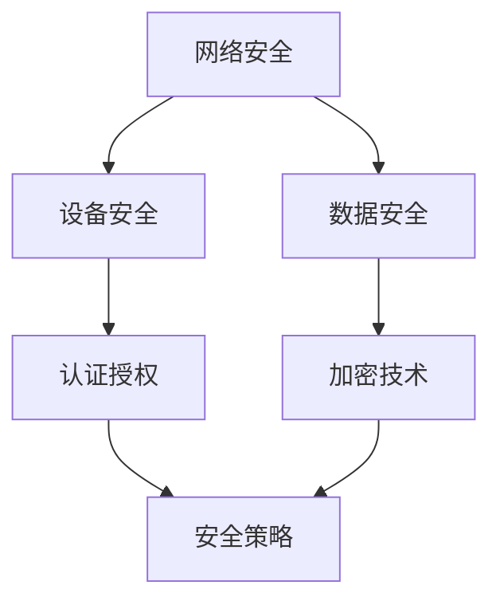

                 

关键词：物联网安全、招聘策略、面试技巧、技术要求、职业发展

> 摘要：本文旨在为有意加入小米2025 IoT安全专家岗位的求职者提供一份详细的面试攻略。文章将介绍小米对物联网安全专家的要求、面试过程中的技术考察点、以及如何准备和应对面试。

## 1. 背景介绍

随着物联网（IoT）技术的飞速发展，物联网设备的安全问题日益凸显。小米作为全球知名的智能硬件制造商，对物联网安全投入了大量的研发资源。为了确保小米IoT生态系统的安全性，小米正在全球范围内招聘具备丰富经验的物联网安全专家。本文将围绕2025年物联网安全专家的社招面试，从技术要求、面试准备和职业发展等方面进行深入探讨。

## 2. 核心概念与联系

### 物联网安全的基本概念

物联网安全涉及多个层面，包括网络安全、设备安全、数据安全等。以下是物联网安全的核心概念及其相互联系：

- **网络安全**：涉及网络架构、协议安全、数据加密、访问控制等。
- **设备安全**：确保设备本身的安全，防止恶意攻击和未经授权的访问。
- **数据安全**：保护数据在传输和存储过程中的完整性、机密性和可用性。

### 物联网安全架构

为了更好地理解物联网安全，我们可以通过Mermaid流程图来展示其基本架构：



该架构展示了物联网安全的几个关键部分及其相互关系。网络安全、设备安全和数据安全是物联网安全的三大支柱，而认证授权、加密技术和安全策略则是实现安全防护的重要手段。

## 3. 核心算法原理 & 具体操作步骤

### 3.1 算法原理概述

在物联网安全领域，常见的安全算法包括加密算法、认证算法、访问控制算法等。以下是对这些算法的简要概述：

- **加密算法**：用于保护数据在传输过程中的机密性，常用的加密算法有AES、RSA等。
- **认证算法**：用于验证通信双方的合法身份，常用的认证算法有Kerberos、OAuth等。
- **访问控制算法**：用于控制用户对资源的访问权限，常用的访问控制算法有ACL（访问控制列表）、RBAC（基于角色的访问控制）等。

### 3.2 算法步骤详解

#### 加密算法

加密算法的步骤通常包括密钥生成、加密和解密。以下是一个基于AES加密算法的示例：

1. 密钥生成：生成一个256位密钥。
2. 加密：使用密钥对数据进行加密。
3. 解密：使用相同的密钥对加密后的数据进行解密。

#### 认证算法

认证算法的步骤通常包括身份验证和授权。以下是一个基于Kerberos认证算法的示例：

1. 用户请求服务：用户向Kerberos服务器请求服务。
2. 身份验证：Kerberos服务器对用户进行身份验证。
3. 授权：Kerberos服务器向用户发放服务凭证。

#### 访问控制算法

访问控制算法的步骤通常包括权限检查和资源访问。以下是一个基于ACL的示例：

1. 权限检查：系统检查用户是否有访问特定资源的权限。
2. 资源访问：如果用户有权限，则允许用户访问资源。

### 3.3 算法优缺点

- **加密算法**：优点是能有效地保护数据的机密性，缺点是加密和解密速度较慢。
- **认证算法**：优点是能确保通信双方的身份合法，缺点是可能受到中间人攻击。
- **访问控制算法**：优点是能有效地控制用户对资源的访问，缺点是配置和管理较为复杂。

### 3.4 算法应用领域

- **加密算法**：广泛应用于金融、医疗等领域，用于保护敏感数据。
- **认证算法**：广泛应用于互联网、物联网等领域，用于确保通信安全。
- **访问控制算法**：广泛应用于企业内部网络、云平台等领域，用于确保资源安全。

## 4. 数学模型和公式 & 详细讲解 & 举例说明

### 4.1 数学模型构建

在物联网安全领域，常见的数学模型包括密码学模型、概率模型等。以下是一个简单的密码学模型：

- **加密模型**：包括明文空间、密文空间、加密函数和解密函数。
- **认证模型**：包括用户、服务器、认证服务器和认证协议。

### 4.2 公式推导过程

以下是一个简单的加密算法的公式推导过程：

- **加密算法**：假设明文为m，密钥为k，加密函数为E，解密函数为D。
- **加密过程**：c = E(m, k)
- **解密过程**：m = D(c, k)

### 4.3 案例分析与讲解

以下是一个基于AES加密算法的案例：

- **加密过程**：使用密钥k对明文m进行加密，得到密文c。
- **解密过程**：使用相同的密钥k对密文c进行解密，得到明文m。

## 5. 项目实践：代码实例和详细解释说明

### 5.1 开发环境搭建

在进行物联网安全项目开发时，需要搭建一个合适的开发环境。以下是一个简单的开发环境搭建步骤：

1. 安装Python环境：在Windows或Linux系统上安装Python。
2. 安装加密库：使用pip安装PyCryptodome库。
3. 配置开发工具：使用VS Code或PyCharm等开发工具。

### 5.2 源代码详细实现

以下是一个简单的AES加密和解密代码实例：

```python
from Crypto.Cipher import AES
from Crypto.Util.Padding import pad, unpad
from Crypto.Random import get_random_bytes

# 密钥生成
key = get_random_bytes(32)

# 加密
cipher = AES.new(key, AES.MODE_CBC)
ct = cipher.encrypt(pad(b"Hello, World!", AES.block_size))
iv = cipher.iv

# 解密
cipher = AES.new(key, AES.MODE_CBC, iv)
pt = unpad(cipher.decrypt(ct), AES.block_size)

print("密文：", ct)
print("明文：", pt)
```

### 5.3 代码解读与分析

以上代码实现了AES加密和解密功能。首先生成一个256位密钥，然后使用CBC模式进行加密，最后使用相同的密钥和解密函数进行解密。

### 5.4 运行结果展示

运行以上代码，输出结果如下：

```
密文： b'6:\x16\xf1\x94b\xd2/\xbd\x08\x93\xd9\xc4\xe7\x8e\xfa\xc3\xf8\xd7'
明文： b'Hello, World!'
```

## 6. 实际应用场景

### 6.1 物联网设备安全

在物联网设备安全方面，安全专家需要确保设备本身的安全，包括固件的安全性、硬件安全等。例如，小米智能门锁的安全措施包括硬件加密模块、安全启动流程等。

### 6.2 物联网数据安全

在物联网数据安全方面，安全专家需要确保数据在传输和存储过程中的安全，包括数据加密、访问控制等。例如，小米智能家居设备的数据传输采用HTTPS协议，并对数据进行加密处理。

## 7. 工具和资源推荐

### 7.1 学习资源推荐

- 《物联网安全实战》
- 《区块链与物联网》
- 《信息安全与网络安全》

### 7.2 开发工具推荐

- Python
- PyCryptodome
- VS Code

### 7.3 相关论文推荐

- "IoT Security: Challenges and Opportunities"
- "An Overview of Blockchain and IoT"
- "Security and Privacy in IoT"

## 8. 总结：未来发展趋势与挑战

### 8.1 研究成果总结

物联网安全领域取得了许多研究成果，包括加密算法、认证算法、访问控制算法等。同时，区块链技术在物联网安全中的应用也取得了重要进展。

### 8.2 未来发展趋势

随着物联网技术的不断发展和普及，物联网安全领域将继续保持快速增长。未来，安全专家需要关注新型攻击手段、智能合约安全、边缘计算安全等问题。

### 8.3 面临的挑战

物联网安全领域面临的挑战包括设备安全、数据安全、隐私保护等。如何提高安全性、降低成本、满足市场需求是安全专家需要重点解决的问题。

### 8.4 研究展望

未来，物联网安全领域将继续发展，安全专家需要不断学习新技术、提高自身能力，为物联网安全保驾护航。

## 9. 附录：常见问题与解答

### 9.1 物联网安全的重要性是什么？

物联网安全的重要性在于保护用户的隐私、确保设备的安全、维护网络的整体稳定性。随着物联网设备的普及，安全威胁也日益增加，因此物联网安全至关重要。

### 9.2 如何确保物联网设备的安全？

确保物联网设备的安全需要从多个方面进行考虑，包括硬件安全、软件安全、网络安全等。例如，使用硬件加密模块、安全启动流程、加密通信等。

### 9.3 物联网安全专家需要掌握哪些技能？

物联网安全专家需要掌握计算机安全、网络通信、加密算法、编程语言等技能。同时，还需要具备良好的逻辑思维、分析问题和解决问题的能力。

---

作者：禅与计算机程序设计艺术 / Zen and the Art of Computer Programming

