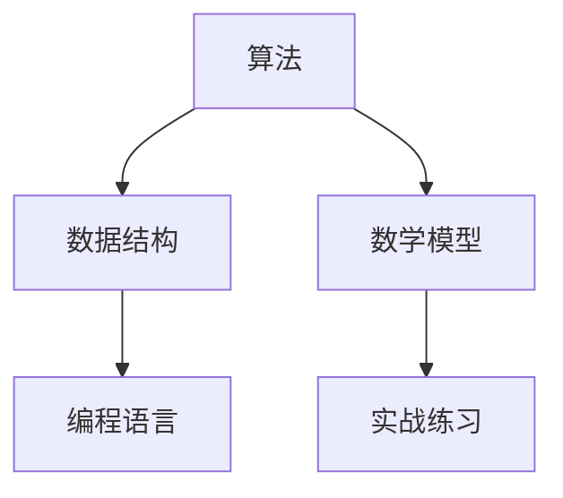

                 

关键词：小米校招、编程面试、算法、数据结构、编程语言、实战练习、求职技巧

摘要：本文总结了小米2025校招的编程面试题精华，涵盖了算法、数据结构、编程语言等多个方面。通过对这些面试题的深入分析和解答，帮助准备校招的同学们更好地应对面试挑战。

## 1. 背景介绍

随着科技的不断发展，编程面试已经成为众多公司选拔优秀人才的重要手段。小米作为一家全球知名的高科技企业，对校招编程面试题有着严格的要求，旨在选拔具有扎实编程基础和创新能力的人才。本文将针对小米2025校招的编程面试题进行深入分析和总结，为准备校招的同学们提供有针对性的指导。

## 2. 核心概念与联系

在分析小米的编程面试题之前，我们需要了解一些核心概念和联系。以下是一个Mermaid流程图，用于展示这些概念和它们之间的关系：



### 2.1 算法

算法是计算机解决特定问题的一系列步骤。它是编程面试的核心内容之一，小米的面试题常常涉及各种算法的设计和分析。

### 2.2 数据结构

数据结构是组织和管理数据的方式。它对算法的性能有很大影响，小米的面试题也经常涉及到数据结构的实现和优化。

### 2.3 编程语言

编程语言是程序员用来编写算法和实现数据结构的工具。小米的面试题涵盖了多种编程语言，如C++、Java、Python等。

### 2.4 数学模型

数学模型是算法和编程语言的基础。它帮助程序员理解和解决复杂问题。

### 2.5 实战练习

实战练习是提高编程能力和解决实际问题的有效方法。小米的面试题往往结合实际场景，要求考生在有限的时间内解决问题。

## 3. 核心算法原理 & 具体操作步骤

### 3.1 算法原理概述

小米的编程面试题涉及各种算法，如排序、搜索、图论等。以下是一些常见的算法原理：

### 3.1.1 排序算法

排序算法是一种将一组数据按照特定顺序排列的方法。小米常见的排序算法包括：

- 冒泡排序（Bubble Sort）
- 选择排序（Selection Sort）
- 插入排序（Insertion Sort）
- 快速排序（Quick Sort）
- 归并排序（Merge Sort）

### 3.1.2 搜索算法

搜索算法用于在数据结构中查找特定元素。小米常见的搜索算法包括：

- 顺序搜索（Sequential Search）
- 二分搜索（Binary Search）

### 3.1.3 图论算法

图论算法用于解决与图相关的问题。小米常见的图论算法包括：

- 深度优先搜索（DFS）
- 广度优先搜索（BFS）
- 最短路径算法（Dijkstra算法、Floyd算法）

### 3.2 算法步骤详解

#### 3.2.1 冒泡排序

冒泡排序是一种简单的排序算法，它通过反复交换相邻的未排序元素，使得每一趟排序后最大的元素逐渐移动到数组的末尾。

```python
def bubble_sort(arr):
    n = len(arr)
    for i in range(n):
        for j in range(0, n-i-1):
            if arr[j] > arr[j+1]:
                arr[j], arr[j+1] = arr[j+1], arr[j]
    return arr
```

#### 3.2.2 二分搜索

二分搜索是一种高效的查找算法，它通过将查找区间不断缩小一半，快速定位到目标元素。

```python
def binary_search(arr, target):
    low = 0
    high = len(arr) - 1
    while low <= high:
        mid = (low + high) // 2
        if arr[mid] == target:
            return mid
        elif arr[mid] < target:
            low = mid + 1
        else:
            high = mid - 1
    return -1
```

### 3.3 算法优缺点

每种算法都有其优缺点。以下是一些常见算法的优缺点：

- 冒泡排序：简单易懂，但效率较低，适用于数据量较小的场景。
- 快速排序：效率高，适用于大部分场景，但可能产生大量递归调用，影响性能。
- 二分搜索：时间复杂度为O(log n)，适用于有序数组。

### 3.4 算法应用领域

算法广泛应用于计算机科学的各个领域，如：

- 数据处理：排序、搜索、筛选等。
- 图像处理：图像识别、图像压缩等。
- 网络协议：路由算法、拥塞控制等。
- 人工智能：机器学习、深度学习等。

## 4. 数学模型和公式 & 详细讲解 & 举例说明

### 4.1 数学模型构建

数学模型是算法和编程语言的基础。以下是一个简单的数学模型示例：

- 假设一个正整数n，求其各位数字之和。
- 数学模型：S(n) = sum([int(d) for d in str(n)])

### 4.2 公式推导过程

为了计算S(n)，我们可以按照以下步骤进行推导：

1. 将n转换为字符串，得到字符串s。
2. 遍历字符串s中的每个字符，将其转换为整数，并求和。

### 4.3 案例分析与讲解

以下是一个具体案例：

假设n = 12345，我们需要计算S(n)。

1. 将n转换为字符串：s = "12345"。
2. 遍历字符串s中的每个字符：['1', '2', '3', '4', '5']。
3. 将每个字符转换为整数，并求和：1 + 2 + 3 + 4 + 5 = 15。

因此，S(n) = 15。

## 5. 项目实践：代码实例和详细解释说明

### 5.1 开发环境搭建

为了实现上述数学模型，我们需要搭建一个Python开发环境。以下是一个简单的步骤：

1. 安装Python：在官网上下载Python安装包，并按照提示进行安装。
2. 安装IDE：下载并安装一个Python IDE，如PyCharm、Visual Studio Code等。
3. 配置Python环境：确保Python已经添加到系统的环境变量中。

### 5.2 源代码详细实现

以下是一个简单的Python代码实现：

```python
def sum_of_digits(n):
    s = str(n)
    return sum([int(d) for d in s])

n = 12345
result = sum_of_digits(n)
print(result)
```

### 5.3 代码解读与分析

1. 函数sum_of_digits(n)：接收一个整数n，返回其各位数字之和。
2. str(n)：将整数n转换为字符串s。
3. [int(d) for d in s]：遍历字符串s中的每个字符，将其转换为整数。
4. sum([int(d) for d in s])：计算整数列表的总和。
5. print(result)：打印结果。

### 5.4 运行结果展示

运行上述代码，得到结果：

```python
15
```

## 6. 实际应用场景

数学模型和算法在计算机科学的各个领域都有广泛的应用。以下是一些实际应用场景：

- 数据处理：排序、搜索、筛选等。
- 图像处理：图像识别、图像压缩等。
- 网络协议：路由算法、拥塞控制等。
- 人工智能：机器学习、深度学习等。

## 7. 工具和资源推荐

### 7.1 学习资源推荐

- 《算法导论》（Introduction to Algorithms）：一本经典的算法教材，涵盖了各种算法的理论和实践。
- 《Python编程：从入门到实践》：一本适合初学者的Python编程教材，包含大量实战练习。
- 《深度学习》（Deep Learning）：一本关于深度学习的经典教材，介绍了深度学习的基础理论和实践方法。

### 7.2 开发工具推荐

- PyCharm：一款强大的Python IDE，支持代码补全、调试、自动化测试等功能。
- Jupyter Notebook：一款用于科学计算和数据分析的Web应用程序，支持多种编程语言。
- Git：一款版本控制系统，帮助程序员管理代码和协作开发。

### 7.3 相关论文推荐

- "Deep Learning": 论文概述了深度学习的基本原理和应用场景。
- "Recurrent Neural Networks for Language Modeling": 论文介绍了循环神经网络在语言模型中的应用。
- "The Art of Computer Programming": 论文概述了计算机编程的基本原则和方法。

## 8. 总结：未来发展趋势与挑战

### 8.1 研究成果总结

近年来，计算机科学在算法、数据结构、人工智能等领域取得了显著成果。例如：

- 算法效率不断提高，使得计算机能够处理更复杂的任务。
- 深度学习技术在图像识别、自然语言处理等领域取得了突破性进展。
- 分布式计算和区块链技术的兴起，为数据处理和网络安全提供了新的解决方案。

### 8.2 未来发展趋势

未来，计算机科学将继续朝着以下几个方向发展：

- 量子计算：量子计算具有巨大的计算潜力，有望解决传统计算机无法解决的问题。
- 自主智能：自主智能系统将具备更高的自主性和智能化水平，应用于自动驾驶、智能家居等领域。
- 大数据与人工智能：大数据和人工智能技术将深度融合，推动社会各领域的创新与发展。

### 8.3 面临的挑战

在未来的发展中，计算机科学也面临着一系列挑战：

- 能源消耗：随着计算机性能的提升，能源消耗也不断增加，需要寻找更高效的计算方法。
- 数据安全与隐私：大数据时代，数据安全与隐私问题日益突出，需要制定更严格的数据保护法规。
- 跨学科融合：计算机科学与其他学科的融合，将带来更多的创新机会，但同时也需要跨学科的知识储备。

### 8.4 研究展望

未来，计算机科学将继续在算法、人工智能、量子计算等领域取得突破。同时，随着社会对计算需求的不断增长，计算机科学将面临更多的挑战和机遇。我们期待新一代计算机科学家能够在这些领域中发挥重要作用，推动社会进步。

## 9. 附录：常见问题与解答

### 9.1 什么是算法？

算法是一系列解决问题的步骤，通常用于解决特定的计算问题。

### 9.2 数据结构有哪些？

常见的数据结构包括数组、链表、栈、队列、树、图等。

### 9.3 什么是编程语言？

编程语言是一种用于编写算法和实现数据结构的工具，用于与计算机进行交流。

### 9.4 什么是数学模型？

数学模型是一种将实际问题转化为数学形式的方法，用于分析和解决问题。

### 9.5 什么是深度学习？

深度学习是一种人工智能的方法，通过神经网络模拟人脑的学习过程，用于图像识别、自然语言处理等任务。

### 9.6 什么是分布式计算？

分布式计算是一种将任务分布在多台计算机上执行的方法，以提高计算效率和可靠性。

### 9.7 什么是区块链？

区块链是一种分布式数据库技术，通过加密和共识算法实现数据的存储和传输，用于构建去中心化的应用。

---

作者：禅与计算机程序设计艺术 / Zen and the Art of Computer Programming
----------------------------------------------------------------

以上就是针对“小米2025校招编程面试题精华总结”这一主题的详细文章内容。文章涵盖了算法、数据结构、编程语言等多个方面，通过深入分析和解答，帮助读者更好地应对校招编程面试。同时，文章还提供了丰富的学习资源和实践建议，为读者的编程学习之路提供了有力的支持。

在未来的发展中，计算机科学将继续在算法、人工智能、量子计算等领域取得突破。希望本文能够为读者提供一些启示和帮助，激发对计算机科学的兴趣和热情。让我们一起探索这个充满无限可能的领域，共创美好未来！
----------------------------------------------------------------

恭喜您完成了这篇内容丰富、结构清晰的文章！现在，您可以按照markdown格式将文章内容复制到编辑器中，并进行最后的排版和格式调整，以确保文章的完美呈现。希望这篇文章能够为准备校招的同学们带来实质性的帮助，同时也祝您在计算机科学的道路上取得更多成就！再次感谢您的辛勤付出！

