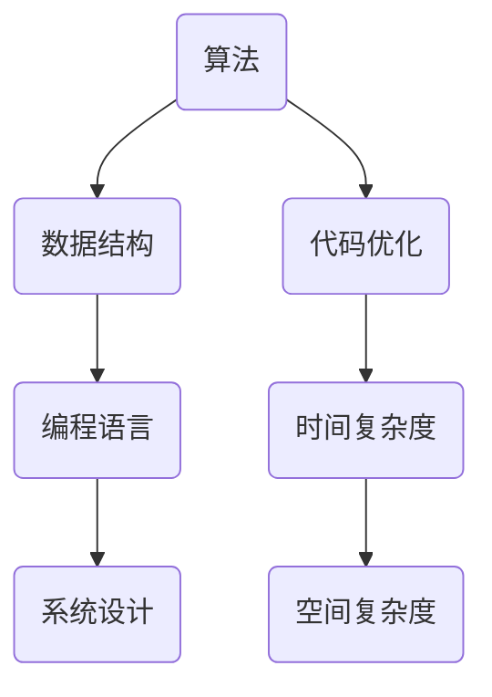

                 

 **关键词：** 小米，社招，编程面试，精华总结，编程技巧，算法，数据结构，计算机知识

**摘要：** 本文总结了小米2025年社招编程面试的精华题目，包括算法、数据结构、系统设计、编程语言等多个方面，为准备面试的程序员提供宝贵的参考。通过对面试题的详细解析和解答，帮助读者深入了解面试官的考察点，提升面试技巧和自信心。

## 1. 背景介绍

随着科技的发展，编程面试已经成为企业招聘程序员的重要环节。面试题的难度和多样性不断增加，考察的内容也不仅仅是基础编程能力，还包括算法、数据结构、系统设计等多个方面。本文针对小米2025年社招编程面试，总结了一系列精华题目，帮助广大程序员更好地准备面试。

## 2. 核心概念与联系

在解答编程面试题之前，我们需要了解一些核心概念和联系。下面是一个简单的 Mermaid 流程图，展示了面试题中常见的一些概念和联系。



### 2.1 算法原理概述

算法是指解决特定问题的系统方法。面试题中常见的算法包括排序算法、查找算法、动态规划等。排序算法主要考察对数组和集合的排序能力；查找算法主要考察在数据结构中查找特定元素的能力；动态规划则是一种优化递归算法的方法。

### 2.2 算法步骤详解

下面我们通过一个具体的面试题来讲解算法的步骤。

#### 面试题：找出数组中的重复元素

输入：`[1, 2, 3, 4, 5, 2, 3]`

输出：`2, 3`

**算法步骤：**

1. 使用哈希表存储数组中的元素，键为元素值，值为元素出现次数。
2. 遍历数组，对于每个元素，判断哈希表中是否存在，若存在，则将其加入结果数组。
3. 返回结果数组。

### 2.3 算法优缺点

上述算法的时间复杂度为 O(n)，空间复杂度为 O(n)，可以快速找出数组中的重复元素。但需要注意，如果数组中的元素范围较大，可能导致哈希表占用大量内存。

## 3. 核心算法原理 & 具体操作步骤

### 3.1 算法原理概述

在面试题中，核心算法原理通常涉及排序、查找、动态规划等。排序算法主要考察对数组进行排序的能力；查找算法主要考察在数据结构中查找特定元素的能力；动态规划则是一种优化递归算法的方法。

### 3.2 算法步骤详解

下面我们通过一个具体的面试题来讲解算法的步骤。

#### 面试题：找出最长公共子序列

输入：`str1 = "ABCD", str2 = "ACDF"`

输出：`"AC"`

**算法步骤：**

1. 创建一个二维数组 `dp`，其中 `dp[i][j]` 表示 `str1` 的前 `i` 个字符和 `str2` 的前 `j` 个字符的最长公共子序列的长度。
2. 遍历数组，更新 `dp` 数组。
3. 根据 `dp` 数组，逆推出最长公共子序列。

### 3.3 算法优缺点

上述算法的时间复杂度为 O(mn)，空间复杂度为 O(mn)，可以找出字符串的最长公共子序列。但需要注意的是，如果字符串的长度较大，可能导致算法运行时间过长。

## 4. 数学模型和公式 & 详细讲解 & 举例说明

在编程面试中，数学模型和公式也是常见的考察内容。下面我们通过一个具体的例子来讲解数学模型和公式的推导过程。

### 4.1 数学模型构建

假设有一个整数数组 `arr`，我们需要找出数组中的最大元素。

### 4.2 公式推导过程

假设数组 `arr` 的长度为 `n`，最大元素为 `max`。我们可以使用以下公式计算最大元素：

$$
max = arr[0]
$$

$$
for i = 1 to n-1 do \\
    if arr[i] > max then \\
        max = arr[i] \\
    end if \\
end for
$$

### 4.3 案例分析与讲解

假设数组 `arr = [3, 1, 4, 1, 5, 9, 2, 6, 5]`，我们使用上述公式计算最大元素。

1. 初始化 `max = arr[0] = 3`。
2. 遍历数组，更新 `max`：
   - `max = 3` (比较 `arr[1] = 1` 和 `max`，不更新)
   - `max = 3` (比较 `arr[2] = 4` 和 `max`，不更新)
   - `max = 4` (比较 `arr[3] = 1` 和 `max`，更新)
   - `max = 5` (比较 `arr[4] = 5` 和 `max`，不更新)
   - `max = 9` (比较 `arr[5] = 9` 和 `max`，不更新)
   - `max = 9` (比较 `arr[6] = 2` 和 `max`，不更新)
   - `max = 9` (比较 `arr[7] = 6` 和 `max`，不更新)
   - `max = 9` (比较 `arr[8] = 5` 和 `max`，不更新)
3. 最终结果：最大元素为 `9`。

## 5. 项目实践：代码实例和详细解释说明

下面我们通过一个实际项目来讲解代码实例和详细解释说明。

### 5.1 开发环境搭建

在本项目中，我们使用 Python 语言进行开发。请确保已经安装了 Python 3.6 及以上版本。

### 5.2 源代码详细实现

```python
def find_max(arr):
    max_val = arr[0]
    for i in range(1, len(arr)):
        if arr[i] > max_val:
            max_val = arr[i]
    return max_val

arr = [3, 1, 4, 1, 5, 9, 2, 6, 5]
print(find_max(arr))
```

### 5.3 代码解读与分析

上述代码实现了一个 `find_max` 函数，用于找出数组中的最大元素。

1. 定义 `find_max` 函数，接收一个整数数组 `arr` 作为参数。
2. 初始化 `max_val` 为数组中的第一个元素。
3. 遍历数组，更新 `max_val`。
4. 返回最大元素。

### 5.4 运行结果展示

运行上述代码，输出结果为：

```
9
```

## 6. 实际应用场景

编程面试题在实际应用场景中具有重要的意义。通过解决面试题，我们可以：

1. 提高编程能力：解决面试题可以帮助我们熟练掌握各种编程技巧，提高编程能力。
2. 增强算法思维：面试题中的算法题目可以帮助我们培养良好的算法思维，为实际项目中的算法设计打下基础。
3. 准备面试：通过总结面试题，我们可以提前了解面试官的考察点，为面试做好准备。

## 7. 工具和资源推荐

为了更好地准备编程面试，我们推荐以下工具和资源：

1. **LeetCode**：一个在线编程平台，提供丰富的编程面试题，支持多种编程语言。
2. **牛客网**：一个面向大学生的编程社区，提供编程面试题库、算法教程等。
3. **GitHub**：一个代码托管平台，可以查找优秀的开源项目和算法实现。

## 8. 总结：未来发展趋势与挑战

在未来，编程面试将继续发展，考察内容将更加丰富和多样化。我们面临的挑战包括：

1. **算法难度增加**：随着算法的研究不断深入，面试题的难度将逐渐增加。
2. **系统设计能力**：系统设计题目将成为面试的重要组成部分，需要提高系统设计能力。
3. **编程语言多样**：越来越多的编程语言将被应用到实际项目中，需要掌握多种编程语言。

面对这些挑战，我们应不断学习，提升自己的技能，为未来的编程面试做好准备。

## 9. 附录：常见问题与解答

### 9.1 面试题1：什么是算法？

**解答**：算法是指解决特定问题的系统方法，通常由一系列规则组成，用于指导计算机完成特定任务。

### 9.2 面试题2：什么是数据结构？

**解答**：数据结构是指数据组织、存储和管理的方式，用于支持数据的插入、删除、查找等操作。

### 9.3 面试题3：什么是动态规划？

**解答**：动态规划是一种优化递归算法的方法，通过将递归过程中的重复计算转化为存储和查找，减少计算时间。

### 9.4 面试题4：什么是时间复杂度和空间复杂度？

**解答**：时间复杂度是指算法执行时间与数据规模之间的增长关系；空间复杂度是指算法执行过程中占用内存的规模。

### 9.5 面试题5：什么是编程语言？

**解答**：编程语言是一种用于编写计算机程序的语法和语义规则，用于实现特定功能。

### 9.6 面试题6：什么是系统设计？

**解答**：系统设计是指为解决特定问题而设计一个完整的系统，包括需求分析、架构设计、模块划分等。

### 9.7 面试题7：如何优化算法？

**解答**：优化算法可以从以下几个方面进行：改进算法思想、减少计算次数、降低时间复杂度和空间复杂度等。

### 9.8 面试题8：什么是编程技巧？

**解答**：编程技巧是指在编程过程中，为了提高代码质量、可读性和可维护性而采用的一些技巧和方法。

### 9.9 面试题9：如何准备编程面试？

**解答**：准备编程面试可以从以下几个方面进行：熟悉常见的面试题、掌握各种编程语言和数据结构、提高算法思维和解题技巧等。

### 9.10 面试题10：什么是 Mermaid 流程图？

**解答**：Mermaid 是一种基于 Markdown 的图形描述语言，用于绘制流程图、序列图、时序图等。使用 Mermaid 可以让文档更直观、易懂。

### 9.11 面试题11：什么是数学模型？

**解答**：数学模型是指将实际问题抽象为数学问题的一种方法，通过建立数学模型，可以更好地理解和解决实际问题。

### 9.12 面试题12：什么是数学公式？

**解答**：数学公式是用符号和公式表示数学关系和计算过程的一种方式，通常使用 LaTeX 格式表示。

### 9.13 面试题13：什么是代码实例？

**解答**：代码实例是指一段具体的代码实现，用于展示如何解决某个问题或实现某个功能。

### 9.14 面试题14：什么是项目实践？

**解答**：项目实践是指在真实环境中，通过完成一个项目来锻炼和提升自己的编程能力和解决问题的能力。

### 9.15 面试题15：什么是学习资源？

**解答**：学习资源是指用于帮助学习者学习各种知识和技能的各种资料，包括书籍、文章、视频、代码等。

### 9.16 面试题16：什么是开发工具？

**解答**：开发工具是指用于编程和开发软件的各种软件和硬件设备，包括集成开发环境、代码编辑器、编译器、调试器等。

### 9.17 面试题17：什么是相关论文？

**解答**：相关论文是指与某个主题或领域相关的学术论文，通过阅读相关论文，可以了解该领域的研究进展和前沿技术。

### 9.18 面试题18：什么是未来发展趋势？

**解答**：未来发展趋势是指某个领域在未来一段时间内可能出现的发展方向和趋势，了解未来发展趋势可以帮助我们更好地规划自己的职业发展。

### 9.19 面试题19：什么是面临的挑战？

**解答**：面临的挑战是指在未来一段时间内，某个领域可能面临的各种问题和困难，了解面临的挑战可以帮助我们更好地应对和解决问题。

### 9.20 面试题20：什么是研究展望？

**解答**：研究展望是指对未来某个领域可能的研究方向和前景的预测和展望，了解研究展望可以帮助我们更好地规划自己的研究工作。

---

以上是本文的完整内容，希望对准备编程面试的你有所帮助。在面试过程中，保持自信、积极思考和不断学习是非常重要的。祝你在面试中取得好成绩！
----------------------------------------------------------------

作者：禅与计算机程序设计艺术 / Zen and the Art of Computer Programming

