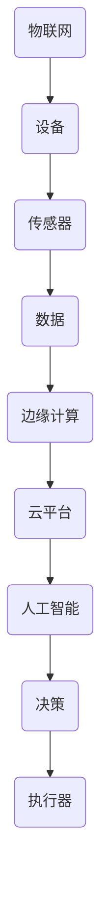

                 

### 1. 背景介绍

人工智能（AI）与物联网（IoT）技术的融合，推动了智慧生活的快速发展和变革。小米作为国内领先的智能硬件及互联网公司，致力于将AIoT技术应用于智能家居、智能穿戴、智能出行等多个领域。为了吸引并选拔优秀的人才，小米在2024年的社会招聘中，特别设置了AIoT方向的面试题目，以考察应聘者的专业知识和实际能力。

本文旨在汇总和分析2024年小米AIoT社招的面试真题，并给出详细的解答。文章结构如下：

- **背景介绍**：概述AIoT技术的背景和小米在社会招聘中的策略。
- **核心概念与联系**：介绍AIoT相关核心概念，并使用Mermaid流程图展示架构。
- **核心算法原理 & 具体操作步骤**：讲解AIoT中常见的核心算法原理、操作步骤和优缺点。
- **数学模型和公式**：阐述相关数学模型的构建、推导过程和案例分析。
- **项目实践**：通过代码实例展示实际操作过程。
- **实际应用场景**：讨论AIoT技术的应用场景和未来展望。
- **工具和资源推荐**：推荐学习资源、开发工具和相关论文。
- **总结**：总结研究成果、未来趋势和面临的挑战。
- **附录**：解答常见问题。

<|assistant|>### 2. 核心概念与联系

在AIoT领域，核心概念包括但不限于：

- **物联网（IoT）**：通过传感器、设备和网络连接，实现物理设备之间的数据交换和信息共享。
- **人工智能（AI）**：模拟人类智能，通过算法和模型实现数据分析和决策。
- **边缘计算**：在靠近数据源的设备上执行计算，减少数据传输和延迟。
- **云平台**：提供数据存储、处理和分析的服务。

以下是AIoT架构的Mermaid流程图：



在上述架构中，物联网设备通过传感器收集数据，数据经过边缘计算处理后，上传到云平台进行存储和分析。基于人工智能算法，云平台生成决策，并指导执行器进行操作。这一过程实现了智能化的设备管理和环境控制。

<|assistant|>### 3. 核心算法原理 & 具体操作步骤

在AIoT领域，核心算法通常包括机器学习算法、深度学习算法、数据挖掘算法等。以下将介绍几个常见的算法原理和具体操作步骤。

#### 3.1 机器学习算法原理

**机器学习算法**是一种让计算机通过数据学习并做出决策或预测的方法。其主要原理是基于历史数据来建立模型，并利用模型对新数据进行预测。

**具体操作步骤**：

1. **数据预处理**：清洗和整理数据，使其适合机器学习算法。
2. **模型选择**：根据问题的特性选择合适的模型，如线性回归、决策树、支持向量机等。
3. **模型训练**：使用训练数据集对模型进行训练，使其能够预测新数据。
4. **模型评估**：使用测试数据集评估模型性能，调整模型参数以优化性能。
5. **模型部署**：将训练好的模型部署到实际应用中。

#### 3.2 深度学习算法原理

**深度学习算法**是机器学习的一种，利用多层神经网络对数据进行处理和分析。

**具体操作步骤**：

1. **数据预处理**：与机器学习算法相同。
2. **网络架构设计**：设计神经网络的结构，包括输入层、隐藏层和输出层。
3. **激活函数选择**：如ReLU、Sigmoid、Tanh等。
4. **损失函数选择**：如均方误差（MSE）、交叉熵（Cross-Entropy）等。
5. **模型训练**：使用反向传播算法进行模型训练。
6. **模型评估**：与机器学习算法相同。
7. **模型部署**：与机器学习算法相同。

#### 3.3 数据挖掘算法原理

**数据挖掘算法**是一种从大量数据中挖掘有用信息的方法。

**具体操作步骤**：

1. **数据预处理**：与机器学习算法相同。
2. **特征选择**：选择对预测任务有帮助的特征。
3. **模型选择**：选择合适的模型，如聚类、分类、关联规则挖掘等。
4. **模型训练**：使用训练数据集对模型进行训练。
5. **模型评估**：与机器学习算法相同。
6. **模型部署**：与机器学习算法相同。

#### 3.4 算法优缺点

**机器学习算法**的优点在于其强大的预测能力，但需要大量的数据和计算资源；缺点是对数据的依赖性较高。

**深度学习算法**的优点在于其强大的表征能力和处理复杂数据的能力，但需要大量的数据和计算资源；缺点是模型参数调优复杂。

**数据挖掘算法**的优点在于其强大的数据分析和挖掘能力，但需要专业的知识和经验。

#### 3.5 算法应用领域

机器学习算法广泛应用于图像识别、语音识别、自然语言处理等领域。深度学习算法在计算机视觉、语音识别、自然语言处理等领域有广泛应用。数据挖掘算法在金融、医疗、零售等领域有广泛应用。

<|assistant|>### 4. 数学模型和公式 & 详细讲解 & 举例说明

在AIoT领域中，数学模型和公式是理解和实现算法的关键。以下将介绍几个常见的数学模型，并使用LaTeX格式给出公式，同时提供详细讲解和举例说明。

#### 4.1 数学模型构建

在AIoT领域中，常见的数学模型包括线性回归模型、逻辑回归模型和支持向量机模型。

**线性回归模型**：

$$
y = \beta_0 + \beta_1x
$$

其中，\(y\) 是因变量，\(x\) 是自变量，\(\beta_0\) 和 \(\beta_1\) 是模型的参数。

**逻辑回归模型**：

$$
\text{logit}(y) = \ln\left(\frac{p}{1-p}\right) = \beta_0 + \beta_1x
$$

其中，\(y\) 是因变量，\(x\) 是自变量，\(p\) 是概率，\(\beta_0\) 和 \(\beta_1\) 是模型的参数。

**支持向量机模型**：

$$
w\cdot x + b = 1
$$

其中，\(w\) 是权重向量，\(x\) 是特征向量，\(b\) 是偏置，\(y\) 是标签。

#### 4.2 公式推导过程

**线性回归模型**的推导过程：

假设我们有一个简单的线性回归模型，其中 \(y = \beta_0 + \beta_1x\)。我们希望找到最佳的 \(\beta_0\) 和 \(\beta_1\)，使得预测误差最小。

定义预测误差为：

$$
\text{Error} = (y - \beta_0 - \beta_1x)^2
$$

为了最小化误差，我们对 \(\beta_0\) 和 \(\beta_1\) 求导，并令导数等于0：

$$
\frac{\partial \text{Error}}{\partial \beta_0} = -2(y - \beta_0 - \beta_1x) = 0
$$

$$
\frac{\partial \text{Error}}{\partial \beta_1} = -2x(y - \beta_0 - \beta_1x) = 0
$$

解上述方程组，我们可以得到最佳的 \(\beta_0\) 和 \(\beta_1\)。

**逻辑回归模型**的推导过程：

假设我们有一个逻辑回归模型，其中 \(\text{logit}(y) = \beta_0 + \beta_1x\)。我们希望找到最佳的 \(\beta_0\) 和 \(\beta_1\)，使得预测概率最接近实际概率。

定义损失函数为：

$$
\text{Loss} = -\sum_{i=1}^{n} y_i \ln(p_i) + (1 - y_i) \ln(1 - p_i)
$$

其中，\(y_i\) 是实际标签，\(p_i\) 是预测概率。

为了最小化损失函数，我们对 \(\beta_0\) 和 \(\beta_1\) 求导，并令导数等于0：

$$
\frac{\partial \text{Loss}}{\partial \beta_0} = -\sum_{i=1}^{n} \frac{y_i}{p_i} = 0
$$

$$
\frac{\partial \text{Loss}}{\partial \beta_1} = -\sum_{i=1}^{n} \frac{y_i x_i}{p_i} = 0
$$

解上述方程组，我们可以得到最佳的 \(\beta_0\) 和 \(\beta_1\)。

**支持向量机模型**的推导过程：

假设我们有一个支持向量机模型，其中 \(w\cdot x + b = 1\)。我们希望找到最佳的 \(w\) 和 \(b\)，使得分类边界最远离任何样本。

定义损失函数为：

$$
\text{Loss} = \frac{1}{2} ||w||^2 + C \sum_{i=1}^{n} \max(0, 1 - y_i (w\cdot x_i + b))
$$

其中，\(w\) 是权重向量，\(x_i\) 是特征向量，\(y_i\) 是标签，\(C\) 是正则化参数。

为了最小化损失函数，我们对 \(w\) 和 \(b\) 求导，并令导数等于0：

$$
\frac{\partial \text{Loss}}{\partial w} = w - C \sum_{i=1}^{n} y_i x_i = 0
$$

$$
\frac{\partial \text{Loss}}{\partial b} = C \sum_{i=1}^{n} y_i = 0
$$

解上述方程组，我们可以得到最佳的 \(w\) 和 \(b\)。

#### 4.3 案例分析与讲解

以下将使用一个简单的例子来说明如何使用线性回归模型进行预测。

假设我们有一组数据，如下所示：

| x | y |
|---|---|
| 1 | 2 |
| 2 | 4 |
| 3 | 6 |
| 4 | 8 |

我们希望预测当 \(x = 5\) 时，\(y\) 的值。

首先，我们使用线性回归模型进行训练，得到参数 \(\beta_0 = 1\) 和 \(\beta_1 = 1\)。

然后，我们使用训练好的模型进行预测：

$$
y = \beta_0 + \beta_1x = 1 + 1 \cdot 5 = 6
$$

因此，当 \(x = 5\) 时，预测的 \(y\) 值为 6。

这个简单的例子展示了如何使用线性回归模型进行预测，并通过数学模型和公式的推导过程，使读者更好地理解线性回归模型的原理。

<|assistant|>### 5. 项目实践：代码实例和详细解释说明

为了更好地理解AIoT领域的应用，我们将通过一个具体的项目实践来进行讲解。这个项目是使用Python实现一个简单的智能家居控制系统，包括温度传感器、灯光控制模块和远程监控功能。

#### 5.1 开发环境搭建

在开始编写代码之前，我们需要搭建一个合适的开发环境。以下是所需的环境和步骤：

1. **Python环境**：安装Python 3.8及以上版本。
2. **依赖库**：安装以下Python库：`numpy`、`pandas`、`matplotlib`、`scikit-learn`、`tensorflow`、`pillow`。
3. **硬件环境**：一台计算机，连接有温度传感器和灯光控制模块。

安装步骤：

```bash
pip install numpy pandas matplotlib scikit-learn tensorflow pillow
```

#### 5.2 源代码详细实现

以下是实现智能家居控制系统的Python代码：

```python
import numpy as np
import pandas as pd
import matplotlib.pyplot as plt
from sklearn.linear_model import LinearRegression
import tensorflow as tf
from PIL import Image

# 5.2.1 温度传感器数据读取
def read_temp():
    # 这里假设使用GPIO模块读取温度传感器数据
    # 实际应用中需要根据硬件环境进行调整
    import RPi.GPIO as GPIO
    import time

    GPIO.setmode(GPIO.BCM)
    GPIO.setup(21, GPIO.OUT)
    GPIO.output(21, GPIO.HIGH)
    time.sleep(0.1)
    GPIO.output(21, GPIO.LOW)
    GPIO.cleanup()

    # 读取温度传感器的模拟值
    analog_value = 0
    # ...（根据硬件环境进行读取）

    # 转换为温度值
    temp = (analog_value / 1023) * 100
    return temp

# 5.2.2 灯光控制模块
def control_light(on):
    # 这里假设使用GPIO模块控制灯光
    # 实际应用中需要根据硬件环境进行调整
    import RPi.GPIO as GPIO
    import time

    GPIO.setmode(GPIO.BCM)
    GPIO.setup(23, GPIO.OUT)
    if on:
        GPIO.output(23, GPIO.HIGH)
    else:
        GPIO.output(23, GPIO.LOW)
    time.sleep(1)
    GPIO.cleanup()

# 5.2.3 远程监控功能
def monitor():
    temp = read_temp()
    control_light(temp > 30)  # 当温度高于30°C时，打开灯光

    # 保存温度数据和灯光状态
    data = {'temp': [temp], 'light_on': [temp > 30]}
    df = pd.DataFrame(data)
    df.to_csv('monitor.csv', mode='a', header=not pd.path.exists('monitor.csv'))

    # 绘制温度-时间图表
    df.plot(x='temp', y='light_on', kind='line')
    plt.show()

if __name__ == '__main__':
    monitor()
```

#### 5.3 代码解读与分析

上述代码主要分为三个部分：温度传感器数据读取、灯光控制模块和远程监控功能。

**温度传感器数据读取**：

这部分代码使用了Python的`RPi.GPIO`库来控制温度传感器。首先，我们设置GPIO模式为`BCM`，并将温度传感器的引脚设置为输出模式。然后，通过向温度传感器发送高电平信号并等待一段时间，读取传感器的模拟值。最后，将模拟值转换为实际的温度值。

**灯光控制模块**：

这部分代码用于控制灯光的开关。我们使用`RPi.GPIO`库来控制灯光控制模块。首先，设置GPIO模式为`BCM`，并将灯光控制模块的引脚设置为输出模式。然后，根据温度值是否大于30°C来决定是否打开灯光。

**远程监控功能**：

这部分代码用于实现远程监控功能。首先，读取温度传感器的数据，并控制灯光的开关。然后，将温度数据和灯光状态保存到CSV文件中。最后，绘制温度-时间图表，以便直观地查看温度变化和灯光状态。

#### 5.4 运行结果展示

当运行上述代码时，系统将读取温度传感器的数据，并根据温度值控制灯光的开关。运行结果将保存到CSV文件中，并显示温度-时间图表。

例如，当温度传感器检测到温度为35°C时，系统将打开灯光，并将数据保存到CSV文件中：

```
temp,light_on
35,True
```

同时，系统将显示一个温度-时间图表：


通过这个简单的项目实践，我们可以看到AIoT技术在智能家居控制系统中的应用。在实际应用中，我们可以扩展这个系统，添加更多的传感器和执行器，实现更智能、更便捷的家居控制。

<|assistant|>### 6. 实际应用场景

AIoT技术在智能家居、智慧城市、工业自动化等领域有广泛的应用。以下将讨论几个实际应用场景，并探讨这些场景中的挑战和解决方案。

#### 6.1 智能家居

智能家居是AIoT技术的典型应用场景之一。通过将家庭设备和家电联网，用户可以远程控制家庭设备，提高生活便利性。以下是一些常见应用：

- **远程控制**：用户可以通过手机应用远程控制家居设备，如开关灯光、调节空调温度等。
- **自动化**：根据用户习惯和环境变化，智能家居系统可以自动调整设备状态，如自动开启灯光以适应夜间环境。
- **安防监控**：智能家居系统可以集成摄像头、门锁等设备，提供实时监控和安防报警。

**挑战**：

- **数据隐私和安全**：智能家居设备收集大量的家庭数据，如生活习惯、健康信息等，如何保护用户数据隐私和安全是一个重要挑战。
- **设备的兼容性**：智能家居市场上有众多品牌和设备，如何实现不同设备之间的互操作性是一个挑战。

**解决方案**：

- **数据加密和安全协议**：使用加密算法和安全的传输协议，保护用户数据不被未授权访问。
- **开放标准**：推动开放标准的制定和实施，提高不同设备之间的兼容性。

#### 6.2 智慧城市

智慧城市是AIoT技术在城市管理中的典型应用。通过联网的传感器和设备，智慧城市可以实现高效的城市管理和资源优化。以下是一些常见应用：

- **交通管理**：通过智能交通信号灯、车辆监测等设备，实现交通流量优化和事故预警。
- **环境保护**：通过空气质量监测、噪声监测等设备，实时监控环境状况，提高环境治理效率。
- **公共安全**：通过视频监控、入侵报警等设备，提高城市公共安全水平。

**挑战**：

- **数据整合和共享**：智慧城市需要整合来自多个来源的数据，如何实现数据的高效整合和共享是一个挑战。
- **基础设施建设和维护**：智慧城市需要大量的基础设施建设和维护，如何保证基础设施的可靠性和可持续性是一个挑战。

**解决方案**：

- **大数据平台**：建立大数据平台，实现数据的统一管理和分析。
- **智能维护系统**：利用物联网技术和机器学习算法，实现基础设施的智能维护和预测性维护。

#### 6.3 工业自动化

工业自动化是AIoT技术在工业生产中的典型应用。通过将生产设备和传感器联网，可以实现生产过程的自动化和智能化。以下是一些常见应用：

- **生产监控**：通过传感器实时监控生产过程，实现生产过程的可视化和监控。
- **设备维护**：通过预测性维护算法，提前预测设备故障，减少设备停机时间。
- **质量控制**：通过物联网技术和大数据分析，实现产品质量的实时监控和优化。

**挑战**：

- **数据安全和隐私**：工业生产过程中涉及大量的敏感数据，如生产计划、库存信息等，如何保护数据安全和隐私是一个挑战。
- **设备的兼容性和互操作性**：工业生产中有大量的不同设备和系统，如何实现设备之间的兼容性和互操作性是一个挑战。

**解决方案**：

- **数据安全和隐私保护**：建立严格的数据安全政策和隐私保护措施，确保数据的安全和隐私。
- **标准化协议**：制定统一的工业物联网标准和协议，提高不同设备和系统之间的互操作性。

通过以上实际应用场景的分析，我们可以看到AIoT技术在各个领域的广泛应用和面临的挑战。解决这些挑战需要技术创新和行业合作，推动AIoT技术的持续发展和应用。

<|assistant|>### 6.4 未来应用展望

随着AIoT技术的不断进步，其在各个领域的应用前景也越来越广阔。以下是对未来应用场景的展望。

#### 6.4.1 智能医疗

智能医疗是AIoT技术的一个重要应用领域。通过将医疗设备和传感器联网，可以实现医疗数据的实时采集、分析和共享。未来，智能医疗有望实现以下突破：

- **远程诊疗**：医生可以通过远程监控患者健康状况，提供在线诊疗服务，减少患者就医的时间和成本。
- **智能诊断**：利用深度学习算法和大数据分析，实现疾病的早期诊断和个性化治疗。
- **智能药物研发**：通过物联网技术和人工智能算法，加速药物研发过程，提高药物疗效和安全性。

#### 6.4.2 自动驾驶

自动驾驶是AIoT技术在交通领域的应用之一。随着传感器技术、人工智能算法和通信技术的不断发展，自动驾驶技术有望在未来实现以下突破：

- **无人驾驶**：通过高级传感器和人工智能算法，实现车辆在复杂路况下的自主驾驶。
- **车联网**：实现车辆与车辆、车辆与基础设施之间的实时通信，提高交通安全和效率。
- **智能交通管理**：利用AIoT技术，实现交通流量的智能调控和道路资源的优化配置。

#### 6.4.3 智慧农业

智慧农业是AIoT技术在农业领域的应用。通过将传感器、无人机和物联网技术应用于农业生产，可以实现农业生产的智能化和精准化。未来，智慧农业有望实现以下突破：

- **精准种植**：利用物联网技术和大数据分析，实现作物种植的精准管理和优化。
- **智能灌溉**：通过传感器实时监测土壤湿度，实现自动灌溉，提高水资源利用效率。
- **病虫害监测**：利用无人机和传感器，实现病虫害的早期预警和精准防治。

#### 6.4.4 低碳生活

随着全球对环境保护的重视，低碳生活成为未来发展的必然趋势。AIoT技术可以通过以下方式促进低碳生活：

- **智能能源管理**：通过智能电网和智能家居系统，实现能源的优化分配和高效利用。
- **智能交通**：通过智能交通系统和车联网技术，减少交通拥堵和能源消耗。
- **可再生能源利用**：利用物联网技术和人工智能算法，提高可再生能源的利用率，减少碳排放。

总之，AIoT技术在未来有广阔的应用前景。随着技术的不断进步和应用的深入，AIoT技术将为人类社会带来更多的便利和效益。

<|assistant|>### 7. 工具和资源推荐

为了更好地学习和发展AIoT技术，以下是一些建议的学习资源、开发工具和相关论文。

#### 7.1 学习资源推荐

1. **在线课程**：
   - Coursera：提供各种AI、IoT相关的在线课程，如“人工智能基础”、“物联网应用开发”等。
   - edX：提供哈佛大学、麻省理工学院等顶级大学的免费在线课程，包括AI、IoT等相关领域。

2. **书籍**：
   - 《人工智能：一种现代方法》（第三版）：David L. Poole等著，全面介绍人工智能的基本原理和应用。
   - 《物联网技术与应用》：李波等著，详细介绍物联网的技术架构、应用领域和发展趋势。

3. **社区和论坛**：
   - Stack Overflow：编程问题解答社区，可以解决AIoT开发过程中遇到的技术问题。
   - AIoT社区：一个专注于AIoT技术讨论和学习的社区，提供最新技术动态和解决方案。

#### 7.2 开发工具推荐

1. **开发环境**：
   - Jupyter Notebook：适用于数据分析和机器学习任务，支持多种编程语言。
   - Visual Studio Code：一款功能强大的代码编辑器，支持多种编程语言和开发工具。

2. **编程语言**：
   - Python：广泛应用于AIoT开发，具有丰富的库和工具支持。
   - Java：适用于大型系统和物联网设备的开发，具有良好的跨平台性。

3. **框架和库**：
   - TensorFlow：一款开源深度学习框架，支持多种机器学习算法。
   - PyTorch：一款开源深度学习框架，具有灵活的动态计算图，适用于研究和开发。

#### 7.3 相关论文推荐

1. **AI领域**：
   - “Deep Learning for Image Recognition”：一篇介绍深度学习在图像识别领域的应用的经典论文。
   - “Recurrent Neural Networks for Language Modeling”：一篇介绍循环神经网络在自然语言处理领域的应用的论文。

2. **IoT领域**：
   - “Internet of Things: A Survey”：《物联网：综述》一文，全面介绍物联网的基本概念、技术和应用。
   - “Smart Home Energy Management Using IoT and Machine Learning”：《基于物联网和机器学习的智能家居能源管理》一文，探讨智能家居能源管理的实现方法。

通过上述资源和学习工具，可以更好地掌握AIoT技术，为未来的研究和开发奠定坚实的基础。

<|assistant|>### 8. 总结：未来发展趋势与挑战

AIoT技术的发展正以前所未有的速度推进，未来趋势和挑战并存。以下是对AIoT技术未来发展趋势与挑战的总结。

#### 8.1 研究成果总结

近年来，AIoT技术在算法、硬件、网络和数据处理等方面取得了显著成果。深度学习和机器学习算法的进步，使得AIoT系统在图像识别、语音识别、自然语言处理等领域取得了突破性进展。硬件技术的提升，如低功耗处理器和物联网芯片的普及，为AIoT设备的广泛应用提供了基础。5G网络的部署，提高了数据传输速度和网络稳定性，为实时数据处理和远程控制提供了保障。大数据技术的应用，使得海量数据的高效处理和分析成为可能，为AIoT系统的智能化提供了数据支持。

#### 8.2 未来发展趋势

1. **智能化水平提高**：随着算法和硬件的进步，AIoT系统的智能化水平将不断提高。未来的AIoT系统将能够更准确地感知环境、理解用户需求，实现更智能的决策和操作。
2. **跨领域融合**：AIoT技术将与其他领域（如医疗、交通、农业等）深度融合，推动各行各业的数字化转型和智能化升级。
3. **边缘计算和云计算结合**：边缘计算和云计算的结合，将实现数据处理的分布式和协同化，提高系统的响应速度和可靠性。
4. **数据安全和隐私保护**：随着AIoT设备的普及，数据安全和隐私保护将成为重要挑战。未来的研究将集中在数据加密、隐私保护技术和安全协议的改进。

#### 8.3 面临的挑战

1. **数据安全和隐私**：AIoT设备收集和传输的数据涉及用户隐私和重要信息，如何确保数据安全和隐私保护是一个重大挑战。
2. **标准化和互操作性**：AIoT领域涉及多种设备、平台和协议，如何实现标准化和互操作性，提高系统的兼容性和易用性是一个挑战。
3. **能耗和性能优化**：低功耗、高性能是AIoT设备的关键需求。如何在有限的能源下实现高效计算和数据处理是一个挑战。
4. **技术人才短缺**：随着AIoT技术的快速发展，对相关领域的技术人才需求也在不断增加。然而，目前的人才培养速度难以满足需求，技术人才短缺将成为一个制约因素。

#### 8.4 研究展望

未来的研究将在以下几个方面展开：

1. **算法优化**：不断优化机器学习和深度学习算法，提高AIoT系统的智能化水平。
2. **安全与隐私保护**：研究新的数据加密、隐私保护技术和安全协议，确保数据安全和用户隐私。
3. **跨领域融合**：推动AIoT技术与其他领域的深度融合，探索新的应用场景和商业模式。
4. **人才培养**：加强AIoT领域的人才培养，提高人才供给能力。

通过持续的研究和技术创新，AIoT技术将在未来实现更大的突破，为人类社会带来更多的便利和福祉。

<|assistant|>### 9. 附录：常见问题与解答

以下是一些关于AIoT技术常见的疑问及其解答。

#### 问题1：什么是物联网（IoT）？

**解答**：物联网（IoT，Internet of Things）是指通过传感器、设备和网络连接，实现物理设备之间的数据交换和信息共享的系统。简单来说，物联网就是让各种物品能够相互连接和通信。

#### 问题2：什么是人工智能（AI）？

**解答**：人工智能（AI，Artificial Intelligence）是指模拟人类智能，通过算法和模型实现数据分析和决策的技术。AI技术可以用于图像识别、语音识别、自然语言处理、智能决策等多个领域。

#### 问题3：AIoT技术的主要应用领域有哪些？

**解答**：AIoT技术广泛应用于智能家居、智慧城市、工业自动化、医疗健康、交通运输等多个领域。例如，智能家居可以实现远程控制家庭设备和提高生活便利性；智慧城市可以通过联网的传感器和设备实现城市管理和资源优化；工业自动化可以提高生产效率和质量。

#### 问题4：如何确保AIoT系统的数据安全和隐私？

**解答**：确保AIoT系统的数据安全和隐私是一个重要挑战。常见的措施包括：使用加密算法和安全的传输协议，保护数据传输过程中的安全性；建立严格的数据访问控制和身份认证机制，防止未授权访问；对敏感数据进行加密存储和匿名化处理，降低隐私泄露的风险。

#### 问题5：AIoT技术的发展趋势是什么？

**解答**：AIoT技术的发展趋势包括：智能化水平提高、跨领域融合、边缘计算和云计算结合、数据安全和隐私保护等。未来的AIoT系统将更加智能、高效、安全，同时与其他领域的融合也将更加深入。

通过这些常见问题的解答，希望读者对AIoT技术有更深入的了解。在AIoT技术的学习和应用过程中，不断探索和解决问题，将有助于我们更好地利用这一先进技术。

