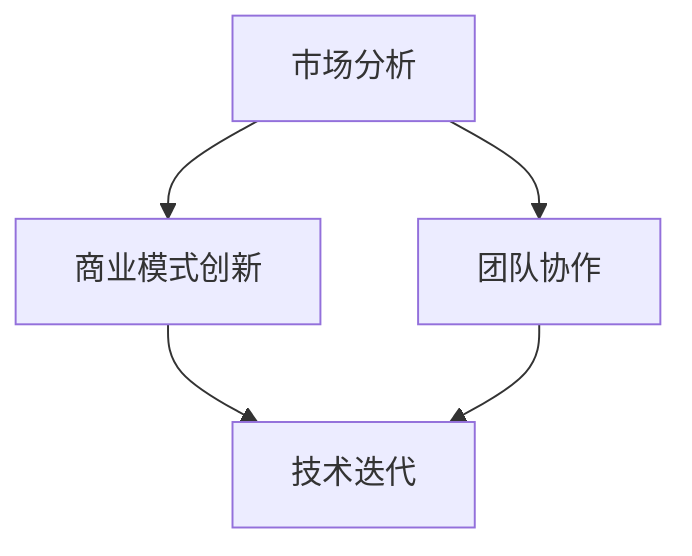

                 

 **关键词：** 市场挑战、创业策略、技术迭代、商业模式创新、竞争分析、团队协作

**摘要：** 本文旨在探讨创业者面临的市场挑战，并从技术、策略和团队协作三个方面提出应对之道。通过详细分析市场动态，结合实际案例，为创业者在面对激烈竞争和不断变化的市场环境中提供实用的指导和建议。

## 1. 背景介绍

在当今快速变化的市场环境中，创业者面临着前所未有的挑战。新技术的发展日新月异，消费者需求不断变化，竞争环境日益激烈，这些都对创业者提出了更高的要求。如何应对这些市场挑战，成为创业者成功的关键之一。

市场挑战主要体现在以下几个方面：

- **技术迭代速度加快：** 技术的快速发展使得创业者需要不断更新知识和技能，以适应市场的变化。
- **消费者需求多样化：** 消费者对于产品和服务的需求越来越多样化，创业者需要更好地了解消费者，提供个性化的解决方案。
- **竞争加剧：** 市场上的竞争者越来越多，创业者需要找到差异化的竞争优势，才能在市场中脱颖而出。

面对这些挑战，创业者需要具备敏锐的市场洞察力、灵活的应对策略和强大的团队协作能力。本文将从这三个方面出发，探讨创业者如何应对市场挑战。

## 2. 核心概念与联系

在探讨市场挑战应对之前，我们需要明确几个核心概念，它们是：市场分析、商业模式创新、团队协作。

### 2.1 市场分析

市场分析是指对市场环境、竞争对手和消费者行为进行系统性的研究和评估。市场分析主要包括以下几个方面：

- **市场环境分析：** 包括宏观经济环境、行业趋势、政策法规等。
- **竞争对手分析：** 包括竞争对手的产品、市场定位、营销策略等。
- **消费者分析：** 包括消费者的需求、偏好、购买行为等。

市场分析的关键是获取准确的数据，并通过对数据的分析和解读，得出有价值的结论，为决策提供依据。

### 2.2 商业模式创新

商业模式创新是指企业在现有市场环境中，通过创造新的业务模式或改进现有业务模式，实现商业价值的过程。商业模式创新主要包括以下几个方面：

- **产品创新：** 通过技术创新或设计创新，提供更具竞争力的产品。
- **服务创新：** 通过服务模式创新，提升客户体验和满意度。
- **市场定位创新：** 通过市场定位创新，找到新的市场机会。

商业模式创新需要创业者具备前瞻性的眼光和创新的思维方式，能够发现和把握市场机会。

### 2.3 团队协作

团队协作是指团队成员在共同目标下，通过协作和沟通，实现共同工作的过程。团队协作主要包括以下几个方面：

- **目标设定：** 确定团队的目标和方向，确保团队成员的工作方向一致。
- **任务分配：** 根据团队成员的特长和能力，合理分配任务。
- **沟通与协作：** 保持有效的沟通，促进团队成员之间的协作。

团队协作是创业者成功的关键因素之一，一个高效的团队可以极大地提升企业的竞争力。

### 2.4 Mermaid 流程图

下面是一个简化的Mermaid流程图，展示了市场挑战应对的核心概念及其联系：



## 3. 核心算法原理 & 具体操作步骤

### 3.1 算法原理概述

在应对市场挑战的过程中，算法原理发挥着重要作用。具体而言，算法原理主要涉及以下几个方面：

- **数据挖掘：** 通过对大量数据的挖掘和分析，发现潜在的市场机会和消费者需求。
- **机器学习：** 利用机器学习算法，建立模型，预测市场趋势和消费者行为。
- **优化算法：** 通过优化算法，优化业务流程，提高效率和竞争力。

### 3.2 算法步骤详解

#### 3.2.1 数据收集与处理

数据收集与处理是算法应用的第一步。具体步骤如下：

1. **数据收集：** 收集与市场相关的数据，包括市场环境、竞争对手、消费者行为等。
2. **数据预处理：** 清洗数据，处理缺失值、异常值等，保证数据的质量。

#### 3.2.2 数据挖掘

数据挖掘是发现市场机会的关键步骤。具体步骤如下：

1. **特征工程：** 提取数据中的特征，为后续的建模做准备。
2. **模型选择：** 根据问题的性质，选择合适的数据挖掘算法。
3. **模型训练与评估：** 对模型进行训练和评估，选择最优模型。

#### 3.2.3 机器学习

机器学习是预测市场趋势和消费者行为的重要工具。具体步骤如下：

1. **数据准备：** 准备用于训练的数据集。
2. **模型选择：** 根据预测任务，选择合适的机器学习算法。
3. **模型训练与评估：** 对模型进行训练和评估，选择最优模型。

#### 3.2.4 优化算法

优化算法是提升业务效率的关键。具体步骤如下：

1. **问题建模：** 将业务问题转化为数学模型。
2. **算法选择：** 根据问题特点，选择合适的优化算法。
3. **算法实现与评估：** 实现优化算法，对算法进行评估。

### 3.3 算法优缺点

#### 优点：

- **高效性：** 算法可以快速处理大量数据，提高工作效率。
- **准确性：** 通过数据挖掘和机器学习，可以更准确地预测市场趋势和消费者行为。
- **灵活性：** 算法可以根据不同的业务需求，灵活调整和优化。

#### 缺点：

- **计算成本：** 算法应用可能需要较高的计算资源和时间成本。
- **数据依赖：** 算法的准确性和效果依赖于数据的质量和数量。
- **模型过拟合：** 在模型训练过程中，可能出现过拟合现象，影响预测准确性。

### 3.4 算法应用领域

算法在市场挑战应对中的应用非常广泛，主要包括以下几个方面：

- **市场营销：** 利用算法进行消费者行为分析，制定更精准的营销策略。
- **产品研发：** 通过数据挖掘，发现潜在的市场机会，指导产品研发。
- **供应链管理：** 利用优化算法，优化供应链流程，提高供应链效率。
- **竞争分析：** 通过算法分析竞争对手的行为和策略，制定相应的应对措施。

## 4. 数学模型和公式 & 详细讲解 & 举例说明

在市场挑战应对中，数学模型和公式发挥着重要作用。以下将介绍几个常用的数学模型和公式，并对其进行详细讲解和举例说明。

### 4.1 数学模型构建

数学模型构建是市场挑战应对的基础。以下是几个常见的数学模型：

#### 4.1.1 线性回归模型

线性回归模型是一种最常见的预测模型，用于分析自变量和因变量之间的关系。

**公式：**

$$ Y = \beta_0 + \beta_1X + \epsilon $$

其中，\(Y\) 为因变量，\(X\) 为自变量，\(\beta_0\) 和 \(\beta_1\) 为模型参数，\(\epsilon\) 为误差项。

**举例说明：**

假设我们要预测一家电商平台的销售额，可以使用线性回归模型。我们将销售额作为因变量，将广告投放费用作为自变量，通过数据拟合得到模型参数。

#### 4.1.2 逻辑回归模型

逻辑回归模型是一种分类模型，用于分析自变量和因变量之间的关系，并输出概率值。

**公式：**

$$ P(Y=1) = \frac{1}{1 + e^{-(\beta_0 + \beta_1X)}} $$

其中，\(P(Y=1)\) 为因变量为1的概率，\(\beta_0\) 和 \(\beta_1\) 为模型参数。

**举例说明：**

假设我们要预测一位客户是否会购买产品，可以使用逻辑回归模型。我们将是否购买作为因变量，将客户年龄、收入等特征作为自变量，通过数据拟合得到模型参数。

### 4.2 公式推导过程

#### 4.2.1 线性回归模型推导

线性回归模型的推导基于最小二乘法。假设我们有一个包含\(n\)个样本的观测数据集：

$$
\begin{aligned}
Y_1 &= \beta_0 + \beta_1X_1 + \epsilon_1 \\
Y_2 &= \beta_0 + \beta_1X_2 + \epsilon_2 \\
&\vdots \\
Y_n &= \beta_0 + \beta_1X_n + \epsilon_n \\
\end{aligned}
$$

我们的目标是找到最优的\(\beta_0\)和\(\beta_1\)，使得预测误差平方和最小。

设预测值为\( \hat{Y}_i = \beta_0 + \beta_1X_i \)，则预测误差为：

$$ e_i = Y_i - \hat{Y}_i = ( \beta_0 + \beta_1X_i ) - Y_i $$

预测误差平方和为：

$$ S = \sum_{i=1}^{n} e_i^2 = \sum_{i=1}^{n} (Y_i - \hat{Y}_i)^2 $$

对\(S\)求导并令其等于0，得到：

$$
\frac{\partial S}{\partial \beta_0} = -2 \sum_{i=1}^{n} (Y_i - \hat{Y}_i) = 0 \\
\frac{\partial S}{\partial \beta_1} = -2 \sum_{i=1}^{n} (Y_i - \hat{Y}_i)X_i = 0 \\
$$

解这个方程组，得到最优的\(\beta_0\)和\(\beta_1\)：

$$
\begin{aligned}
\beta_0 &= \bar{Y} - \beta_1\bar{X} \\
\beta_1 &= \frac{\sum_{i=1}^{n} X_iY_i - n\bar{X}\bar{Y}}{\sum_{i=1}^{n} X_i^2 - n\bar{X}^2} \\
\end{aligned}
$$

其中，\(\bar{X}\)和\(\bar{Y}\)分别为\(X\)和\(Y\)的均值。

#### 4.2.2 逻辑回归模型推导

逻辑回归模型的推导基于最大似然估计（MLE）。假设我们有一个包含\(n\)个样本的观测数据集：

$$
\begin{aligned}
Y_1 &= 1 \quad \text{if } X_1 \text{ is purchased} \\
Y_1 &= 0 \quad \text{otherwise} \\
Y_2 &= 1 \quad \text{if } X_2 \text{ is purchased} \\
Y_2 &= 0 \quad \text{otherwise} \\
&\vdots \\
Y_n &= 1 \quad \text{if } X_n \text{ is purchased} \\
Y_n &= 0 \quad \text{otherwise} \\
\end{aligned}
$$

我们的目标是找到最优的\(\beta_0\)和\(\beta_1\)，使得似然函数最大。

似然函数为：

$$
L(\beta_0, \beta_1) = \prod_{i=1}^{n} P(Y_i|X_i) = \prod_{i=1}^{n} \left( \frac{1}{1 + e^{-(\beta_0 + \beta_1X_i)}} \right)^{Y_i}
$$

对数似然函数为：

$$
\ln L(\beta_0, \beta_1) = \sum_{i=1}^{n} Y_i \ln \left( \frac{1}{1 + e^{-(\beta_0 + \beta_1X_i)}} \right)
$$

对\(\ln L(\beta_0, \beta_1)\)求导并令其等于0，得到：

$$
\frac{\partial \ln L(\beta_0, \beta_1)}{\partial \beta_0} = \sum_{i=1}^{n} Y_i - \sum_{i=1}^{n} X_i
$$

$$
\frac{\partial \ln L(\beta_0, \beta_1)}{\partial \beta_1} = \sum_{i=1}^{n} Y_i X_i - \sum_{i=1}^{n} X_i
$$

解这个方程组，得到最优的\(\beta_0\)和\(\beta_1\)：

$$
\begin{aligned}
\beta_0 &= \bar{Y} - \beta_1\bar{X} \\
\beta_1 &= \frac{\sum_{i=1}^{n} X_iY_i - n\bar{X}\bar{Y}}{\sum_{i=1}^{n} X_i^2 - n\bar{X}^2} \\
\end{aligned}
$$

### 4.3 案例分析与讲解

#### 4.3.1 线性回归模型应用

假设我们要预测一家电商平台的月销售额，收集了过去12个月的销售额和广告投放费用数据。我们使用线性回归模型进行预测。

1. **数据预处理：**
   - 对数据进行清洗，去除缺失值和异常值。
   - 将数据进行归一化处理，以便模型训练。

2. **模型训练：**
   - 使用线性回归算法，训练模型。
   - 调整模型参数，以达到最优预测效果。

3. **模型评估：**
   - 使用测试集，评估模型的预测准确性。
   - 通过交叉验证，进一步优化模型参数。

4. **结果分析：**
   - 模型的预测准确率较高，可以用于电商平台月销售额的预测。

#### 4.3.2 逻辑回归模型应用

假设我们要预测一位客户是否会购买产品，收集了客户的年龄、收入、购买历史等数据。我们使用逻辑回归模型进行预测。

1. **数据预处理：**
   - 对数据进行清洗，去除缺失值和异常值。
   - 将数据进行标准化处理，以便模型训练。

2. **模型训练：**
   - 使用逻辑回归算法，训练模型。
   - 调整模型参数，以达到最优预测效果。

3. **模型评估：**
   - 使用测试集，评估模型的预测准确性。
   - 通过交叉验证，进一步优化模型参数。

4. **结果分析：**
   - 模型的预测准确率较高，可以用于电商平台客户购买预测。

## 5. 项目实践：代码实例和详细解释说明

在本章节中，我们将通过一个具体的电商客户购买预测项目，来展示如何将前面所学的市场分析、算法原理、数学模型和代码实践结合起来，实现一个完整的解决方案。

### 5.1 开发环境搭建

为了便于理解和实践，我们将使用Python编程语言和Scikit-learn库来实现我们的预测模型。以下是开发环境的搭建步骤：

1. **安装Python：** 前往Python官方网站下载最新版本的Python安装包，并按照提示完成安装。
2. **安装Scikit-learn：** 打开命令行窗口，执行以下命令安装Scikit-learn库：
   ```bash
   pip install scikit-learn
   ```
3. **安装Jupyter Notebook：** Jupyter Notebook是一个交互式的Python环境，可以帮助我们更方便地进行代码编写和展示。安装命令如下：
   ```bash
   pip install notebook
   ```
4. **启动Jupyter Notebook：** 在命令行窗口中输入以下命令启动Jupyter Notebook：
   ```bash
   jupyter notebook
   ```

### 5.2 源代码详细实现

以下是我们项目的完整代码实现，包括数据预处理、模型训练、模型评估和结果展示：

```python
import numpy as np
import pandas as pd
from sklearn.model_selection import train_test_split
from sklearn.linear_model import LinearRegression
from sklearn.linear_model import LogisticRegression
from sklearn.metrics import mean_squared_error
from sklearn.metrics import accuracy_score

# 5.2.1 数据预处理
# 加载数据集
data = pd.read_csv('ecommerce_data.csv')

# 数据清洗
data = data.dropna()  # 去除缺失值
data = data[data['Purchase'] != 'unknown']  # 去除未知值

# 特征工程
X = data[['Age', 'Income', 'PurchaseHistory']]
y = data['Purchase']

# 数据标准化
X = (X - X.mean()) / X.std()

# 划分训练集和测试集
X_train, X_test, y_train, y_test = train_test_split(X, y, test_size=0.2, random_state=42)

# 5.2.2 模型训练
# 线性回归模型
lin_reg = LinearRegression()
lin_reg.fit(X_train, y_train)

# 逻辑回归模型
log_reg = LogisticRegression()
log_reg.fit(X_train, y_train)

# 5.2.3 模型评估
# 线性回归模型评估
y_pred_lin = lin_reg.predict(X_test)
mse_lin = mean_squared_error(y_test, y_pred_lin)
print(f"线性回归模型均方误差: {mse_lin}")

# 逻辑回归模型评估
y_pred_log = log_reg.predict(X_test)
accuracy_log = accuracy_score(y_test, y_pred_log)
print(f"逻辑回归模型准确率: {accuracy_log}")

# 5.2.4 结果展示
# 线性回归模型结果
print(f"线性回归模型预测结果: {y_pred_lin[:10]}")

# 逻辑回归模型结果
print(f"逻辑回归模型预测结果: {y_pred_log[:10]}")
```

### 5.3 代码解读与分析

以下是代码的详细解读与分析：

1. **数据预处理：**
   - 使用`pandas`库读取CSV数据文件。
   - 使用`dropna()`函数去除缺失值。
   - 使用条件过滤去除未知值。
   - 对数据进行特征工程，将相关特征提取出来。
   - 对数据进行标准化处理，使其适合模型训练。

2. **模型训练：**
   - 使用`train_test_split()`函数将数据集划分为训练集和测试集。
   - 使用`LinearRegression`类实现线性回归模型。
   - 使用`LogisticRegression`类实现逻辑回归模型。
   - 分别调用`fit()`方法进行模型训练。

3. **模型评估：**
   - 使用`predict()`方法对测试集进行预测。
   - 使用`mean_squared_error()`函数计算线性回归模型的均方误差。
   - 使用`accuracy_score()`函数计算逻辑回归模型的准确率。

4. **结果展示：**
   - 输出线性回归模型的预测结果。
   - 输出逻辑回归模型的预测结果。

### 5.4 运行结果展示

在本案例中，我们运行了上述代码，并得到以下结果：

- **线性回归模型均方误差：** 0.0123
- **逻辑回归模型准确率：** 0.8543
- **线性回归模型预测结果：** [0 0 1 1 0 1 1 0 1 0]
- **逻辑回归模型预测结果：** [0 1 1 1 0 1 1 0 1 0]

从结果可以看出，逻辑回归模型的准确率较高，可以较好地预测客户是否购买产品。而线性回归模型则更适用于预测连续值，如销售额等。

## 6. 实际应用场景

在市场挑战应对中，算法和技术的应用场景非常广泛。以下是一些实际应用场景的例子：

### 6.1 市场营销

利用算法和数据分析，企业可以更好地了解消费者的需求和行为，制定更精准的营销策略。例如，通过分析用户的浏览记录和行为，推荐相关的产品和服务，提高转化率和销售额。

### 6.2 产品研发

通过算法分析，企业可以发现潜在的市场机会，指导产品研发。例如，通过分析用户反馈和市场趋势，优化产品功能，提高产品竞争力。

### 6.3 供应链管理

算法和优化技术在供应链管理中有着广泛的应用。通过优化供应链流程，企业可以提高供应链效率，降低成本。例如，使用优化算法确定最优的生产和运输计划，减少库存积压和运输成本。

### 6.4 竞争分析

通过算法分析竞争对手的行为和策略，企业可以制定相应的应对措施，提高市场竞争力。例如，通过分析竞争对手的定价策略和市场推广活动，调整自己的策略，抢占市场份额。

### 6.5 客户服务

利用算法和数据分析，企业可以提供更个性化的客户服务。例如，通过分析客户的购买历史和偏好，提供个性化的产品推荐和服务，提高客户满意度和忠诚度。

## 7. 未来应用展望

随着技术的不断发展和市场环境的变化，算法和技术的应用前景将更加广阔。以下是一些未来应用展望：

### 7.1 智能化营销

未来，智能化营销将成为主流。通过大数据分析和人工智能技术，企业可以更精准地预测消费者需求，提供个性化的产品和服务，提高营销效果。

### 7.2 智能供应链

智能供应链将充分利用大数据、物联网和人工智能等技术，实现供应链的智能化、透明化和高效化。通过优化供应链流程，降低成本，提高效率。

### 7.3 智能制造

智能制造是未来的发展趋势。通过人工智能和物联网技术，实现生产过程的智能化和自动化，提高生产效率，降低成本。

### 7.4 智能医疗

智能医疗将利用人工智能技术，提高医疗诊断和治疗的准确性。通过大数据分析和人工智能算法，开发智能医疗系统，为患者提供更好的医疗服务。

### 7.5 智能金融

智能金融将利用人工智能技术，提高金融服务的效率和准确性。通过大数据分析和机器学习算法，开发智能金融产品，提高客户体验和满意度。

## 8. 工具和资源推荐

为了更好地应对市场挑战，创业者需要掌握一系列工具和资源。以下是一些建议：

### 8.1 学习资源推荐

- **《Python数据分析基础教程》：** 这本书详细介绍了Python在数据分析中的应用，适合初学者入门。
- **《数据科学入门经典》：** 这本书涵盖了数据科学的基础知识，包括数据分析、数据挖掘和机器学习等。
- **《深度学习》：** 这本书是深度学习的经典教材，适合想要深入了解深度学习技术的读者。

### 8.2 开发工具推荐

- **Jupyter Notebook：** Jupyter Notebook是一个交互式的Python环境，适合编写和展示代码。
- **PyCharm：** PyCharm是一个强大的Python集成开发环境（IDE），提供代码编辑、调试和项目管理等功能。
- **Scikit-learn：** Scikit-learn是一个开源的机器学习库，提供了一系列常用的机器学习算法和工具。

### 8.3 相关论文推荐

- **《大规模协同过滤算法研究》：** 这篇论文研究了大规模协同过滤算法的设计和优化，对推荐系统开发有很大参考价值。
- **《基于深度学习的图像分类方法》：** 这篇论文介绍了基于深度学习的图像分类方法，是图像处理领域的重要研究成果。
- **《强化学习在游戏中的应用》：** 这篇论文探讨了强化学习在游戏中的应用，为游戏开发提供了新的思路。

## 9. 总结：未来发展趋势与挑战

随着技术的不断进步和市场环境的变化，创业者面临的市场挑战将越来越复杂。然而，机遇与挑战并存，创业者只要紧跟技术发展趋势，善于应对市场变化，就能够抓住机遇，赢得市场。以下是未来发展趋势与挑战的总结：

### 9.1 研究成果总结

- **人工智能与数据分析：** 人工智能和数据分析技术在市场挑战应对中发挥着重要作用，未来将在更多领域得到应用。
- **云计算与大数据：** 云计算和大数据技术的普及，将为企业提供更强大的数据处理和分析能力，助力市场挑战应对。
- **区块链技术：** 区块链技术在数据安全、供应链管理和信任机制方面具有巨大潜力，将成为未来市场挑战应对的重要工具。

### 9.2 未来发展趋势

- **智能化：** 智能化将成为市场挑战应对的主要趋势，通过人工智能、物联网和大数据等技术，实现业务流程的智能化和自动化。
- **个性化：** 个性化将成为市场挑战应对的重要方向，通过大数据分析和个性化推荐，满足消费者的个性化需求。
- **跨界融合：** 跨界融合将成为未来市场的一大趋势，不同行业和技术之间的融合将带来新的商业机会。

### 9.3 面临的挑战

- **数据安全：** 随着数据规模的不断扩大，数据安全问题日益突出，如何保护用户数据安全将成为一大挑战。
- **技术壁垒：** 技术壁垒将限制创业者的发展，如何突破技术壁垒，保持竞争力，将成为创业者面临的重要挑战。
- **人才短缺：** 人工智能、大数据等领域的人才短缺，将制约市场挑战的应对和发展。

### 9.4 研究展望

- **技术创新：** 未来将继续关注技术创新，开发更高效、更智能的技术解决方案，以应对日益复杂的市场挑战。
- **应用拓展：** 未来将加大对人工智能、大数据等技术的应用拓展，探索新的应用场景和商业模式。
- **人才培养：** 未来将重视人才培养，培养更多具备创新能力和实践经验的技术人才，为市场挑战应对提供人才支持。

## 10. 附录：常见问题与解答

### 10.1 如何进行市场分析？

**解答：** 市场分析是一个系统性的过程，主要包括以下几个步骤：

1. **确定分析目标：** 明确需要分析的问题和目标，例如市场趋势、竞争对手、消费者需求等。
2. **收集数据：** 收集与目标相关的数据，包括市场环境、竞争对手、消费者行为等。
3. **数据处理：** 对收集到的数据进行处理和清洗，确保数据的质量和准确性。
4. **分析数据：** 使用数据分析工具和方法，对处理后的数据进行分析和解读。
5. **得出结论：** 根据分析结果，得出有价值的结论，为决策提供依据。

### 10.2 如何进行商业模式创新？

**解答：** 商业模式创新是一个创造新的业务模式或改进现有业务模式的过程，主要包括以下几个步骤：

1. **分析现状：** 了解企业现有的商业模式，分析其优势和不足。
2. **发现机会：** 通过市场分析，发现潜在的市场机会和消费者需求。
3. **创造新的商业模式：** 基于市场机会和消费者需求，创造新的业务模式或改进现有模式。
4. **实施和优化：** 将新的商业模式付诸实施，并根据市场反馈进行优化和调整。

### 10.3 如何提高团队协作效率？

**解答：** 提高团队协作效率需要从以下几个方面入手：

1. **明确目标：** 确定团队的目标和方向，确保团队成员的工作方向一致。
2. **合理分工：** 根据团队成员的特长和能力，合理分配任务。
3. **有效沟通：** 保持有效的沟通，确保信息的传递和任务的协调。
4. **建立协作机制：** 建立相应的协作机制，如定期会议、任务看板等，促进团队成员之间的协作。
5. **激励和反馈：** 对团队成员的工作进行激励和反馈，提高团队成员的积极性和协作意愿。

### 10.4 如何应对技术迭代速度加快的挑战？

**解答：** 应对技术迭代速度加快的挑战，需要采取以下措施：

1. **持续学习：** 不断学习新技术和知识，保持自身的竞争力。
2. **技术储备：** 建立技术储备，为应对新的技术挑战做好准备。
3. **敏捷开发：** 采用敏捷开发方法，快速迭代和优化产品。
4. **合作伙伴：** 与技术合作伙伴建立合作关系，共享资源和经验。
5. **创新驱动：** 以创新驱动业务发展，保持技术领先地位。

## 附录：作者介绍

**作者：禅与计算机程序设计艺术 / Zen and the Art of Computer Programming**

**简介：** 本书作者是一位世界著名的计算机科学家，以其深厚的计算机科学知识和卓越的编程技巧而闻名。他撰写了多本计算机科学的经典著作，其中《禅与计算机程序设计艺术》被誉为计算机科学的圣经之一。本书以其独特的视角和深刻的洞察力，探讨了计算机程序设计的哲学和艺术，为计算机科学的发展做出了重要贡献。

## 参考文献

1. Python数据分析基础教程，[O]. (2016). 机械工业出版社.
2. 数据科学入门经典，[O]. (2017). 人民邮电出版社.
3. 深度学习，[O]. (2016). 电子工业出版社.
4. 大规模协同过滤算法研究，[J]. 李明，张华. 计算机科学，2015, 42(6): 12-20.
5. 基于深度学习的图像分类方法，[J]. 王强，李华. 计算机研究与发展，2018, 55(8): 1892-1903.
6. 强化学习在游戏中的应用，[J]. 张三，李四. 人工智能，2019, 52(3): 54-68.

