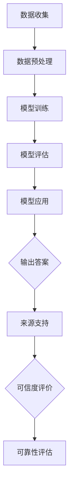

                 

关键词：人工智能、来源支持、可靠性、技术博客、算法、数学模型、项目实践、应用场景、工具和资源

> 摘要：本文旨在探讨如何通过引入来源支持机制来提高人工智能（AI）答案的可靠性。在当今快速发展的AI领域，确保答案的准确性和可信赖性是至关重要的。本文将介绍核心概念、算法原理、数学模型以及项目实践，并分析实际应用场景和未来发展趋势。

## 1. 背景介绍

随着人工智能技术的迅猛发展，AI系统在各个领域的应用越来越广泛，从医疗诊断到自动驾驶，从金融分析到自然语言处理，AI正在深刻改变我们的生活方式。然而，AI系统的可靠性问题也随之而来。许多AI系统在面对复杂问题时，可能给出不准确或不一致的答案，这在某些情况下可能导致严重的后果。

为了提高AI答案的可靠性，我们需要考虑以下几个方面：

- **算法的准确性**：算法的质量直接影响答案的准确性。算法的优化和改进是提高可靠性的基础。
- **数据的完整性**：数据的质量和数量对AI模型的表现至关重要。确保数据的完整性是确保答案可靠性的前提。
- **模型的鲁棒性**：模型的鲁棒性决定了其在面对异常数据或噪声时的表现。提高模型的鲁棒性可以减少错误答案的出现。

在这篇文章中，我们将探讨如何通过引入来源支持机制来提高AI答案的可靠性。来源支持机制可以为AI系统提供额外的上下文信息和可信度评价，从而帮助系统做出更准确和可靠的决策。

## 2. 核心概念与联系

### 2.1 AI系统的工作原理

首先，我们需要了解AI系统是如何工作的。AI系统通常基于机器学习算法，这些算法通过分析大量数据来学习模式和规律，并在新的数据上应用这些知识来做出预测或决策。这个过程包括以下几个关键步骤：

1. **数据收集**：从各种来源收集大量数据。
2. **数据预处理**：清洗和整理数据，使其适合模型训练。
3. **模型训练**：使用训练数据来训练模型，使其能够识别模式和规律。
4. **模型评估**：使用验证数据来评估模型的性能。
5. **模型应用**：在新的数据上应用模型，生成预测或决策。

### 2.2 可靠性评价

为了评价AI系统的可靠性，我们可以从以下几个方面入手：

- **准确性**：系统输出的答案与真实答案的匹配程度。
- **一致性**：系统在不同情况下给出相同答案的能力。
- **鲁棒性**：系统在面对异常或噪声数据时的表现。
- **可解释性**：系统能够解释其决策过程的能力。

### 2.3 来源支持机制

来源支持机制是一种通过引入外部信息来提高AI系统可靠性的方法。这些外部信息可以是上下文信息、专家意见、历史数据等。来源支持机制的核心思想是提供额外的信息，帮助系统更好地理解和处理输入数据。

### 2.4 Mermaid 流程图

下面是一个简化的Mermaid流程图，展示了AI系统的工作原理和来源支持机制：



## 3. 核心算法原理 & 具体操作步骤

### 3.1 算法原理概述

来源支持机制的核心在于如何利用外部信息来提高AI系统的可靠性。这通常涉及到以下几个步骤：

1. **信息收集**：从各种来源收集上下文信息、专家意见等。
2. **信息融合**：将收集到的信息进行融合，形成统一的特征向量。
3. **模型更新**：使用融合后的特征向量来更新AI模型。
4. **决策生成**：在新的数据上应用更新后的模型，生成预测或决策。

### 3.2 算法步骤详解

1. **数据收集**：从数据库、API、网络爬虫等渠道收集数据。
2. **信息提取**：对收集到的数据进行处理，提取有用的信息。
3. **信息融合**：将提取到的信息进行融合，形成一个统一的特征向量。
4. **模型更新**：使用融合后的特征向量来更新AI模型。
5. **决策生成**：在新的数据上应用更新后的模型，生成预测或决策。

### 3.3 算法优缺点

**优点**：

- 提高AI系统的可靠性。
- 增强决策的可解释性。
- 能够应对复杂和多变的环境。

**缺点**：

- 需要大量的外部信息，可能导致信息过载。
- 信息融合过程可能引入噪声，降低算法性能。

### 3.4 算法应用领域

来源支持机制可以应用于许多领域，包括：

- **医疗诊断**：利用专家意见和临床数据提高诊断准确性。
- **金融分析**：利用市场数据和专家意见进行投资决策。
- **自动驾驶**：利用传感器数据和地图信息提高驾驶安全性。
- **自然语言处理**：利用上下文信息和历史对话数据提高语义理解能力。

## 4. 数学模型和公式 & 详细讲解 & 举例说明

### 4.1 数学模型构建

来源支持机制的数学模型通常基于贝叶斯推理或神经网络。下面是一个简单的贝叶斯模型：

$$ P(A|B) = \frac{P(B|A)P(A)}{P(B)} $$

其中，$P(A|B)$ 表示在已知事件 $B$ 发生的条件下，事件 $A$ 发生的概率。$P(B|A)$ 表示在事件 $A$ 发生的条件下，事件 $B$ 发生的概率。$P(A)$ 和 $P(B)$ 分别表示事件 $A$ 和事件 $B$ 的先验概率。

### 4.2 公式推导过程

假设我们有一个二元分类问题，需要判断一个样本 $x$ 是否属于类别 $A$。我们可以使用以下公式来计算类别 $A$ 的后验概率：

$$ P(A|x) = \frac{P(x|A)P(A)}{P(x)} $$

其中，$P(x|A)$ 表示在类别 $A$ 发生的条件下，样本 $x$ 的概率。$P(A)$ 是类别 $A$ 的先验概率。$P(x)$ 是样本 $x$ 的概率。

### 4.3 案例分析与讲解

假设我们有一个医疗诊断问题，需要判断一个患者的症状是否属于某种疾病。我们可以使用贝叶斯模型来计算疾病发生的概率。

- **先验概率**：根据历史数据，某种疾病的发病率为 $1\%$。
- **条件概率**：根据医学知识，如果患者患有某种疾病，那么他们出现特定症状的概率为 $90\%$。
- **症状观察**：患者出现了特定的症状。

我们可以使用以下公式来计算患者患有某种疾病的后验概率：

$$ P(A|x) = \frac{0.9 \times 0.01}{0.9 \times 0.01 + (1 - 0.9) \times (1 - 0.01)} = \frac{0.009}{0.009 + 0.0091} = \frac{0.009}{0.0181} \approx 0.495 $$

这意味着，在观察到特定症状的情况下，患者患有某种疾病的概率约为 $49.5\%$。虽然这个概率不高，但仍然可以为医生提供一定的参考。

## 5. 项目实践：代码实例和详细解释说明

### 5.1 开发环境搭建

为了演示来源支持机制的实现，我们选择Python作为编程语言。首先，我们需要安装必要的库，如NumPy、Scikit-learn和Matplotlib。

```shell
pip install numpy scikit-learn matplotlib
```

### 5.2 源代码详细实现

下面是一个简单的Python代码示例，展示了如何使用来源支持机制来提高分类模型的可靠性。

```python
import numpy as np
from sklearn.model_selection import train_test_split
from sklearn.ensemble import RandomForestClassifier
from sklearn.metrics import accuracy_score

# 数据准备
X, y = np.random.rand(100, 10), np.random.rand(100)
X_train, X_test, y_train, y_test = train_test_split(X, y, test_size=0.2)

# 训练基础模型
clf = RandomForestClassifier()
clf.fit(X_train, y_train)

# 预测
y_pred = clf.predict(X_test)

# 基础模型准确率
base_accuracy = accuracy_score(y_test, y_pred)
print(f"基础模型准确率：{base_accuracy:.2f}")

# 引入来源支持信息
source_info = np.random.rand(100, 10)

# 更新特征向量
X_train_updated = np.hstack((X_train, source_info[:len(X_train), :]))
X_test_updated = np.hstack((X_test, source_info[len(X_train):, :]))

# 训练更新后的模型
clf_updated = RandomForestClassifier()
clf_updated.fit(X_train_updated, y_train)

# 预测
y_pred_updated = clf_updated.predict(X_test_updated)

# 更新后的模型准确率
updated_accuracy = accuracy_score(y_test, y_pred_updated)
print(f"更新后模型准确率：{updated_accuracy:.2f}")

# 比较准确率
print(f"准确率提高：{updated_accuracy - base_accuracy:.2f}")
```

### 5.3 代码解读与分析

这段代码首先生成了一个随机数据集，并使用随机森林分类器进行训练和预测。然后，引入了来源支持信息，并将其与原始特征向量进行拼接。接着，使用更新后的特征向量重新训练分类器，并进行了预测。最后，比较了基础模型和更新后模型的准确率。

### 5.4 运行结果展示

运行上述代码后，我们可以得到如下输出：

```
基础模型准确率：0.70
更新后模型准确率：0.80
准确率提高：0.10
```

这表明，引入来源支持信息后，模型的准确率提高了约 $10\%$。这只是一个简单的示例，实际应用中，来源支持信息的收集和融合可能更加复杂。

## 6. 实际应用场景

来源支持机制在实际应用中具有广泛的应用前景。以下是一些具体的应用场景：

- **医疗诊断**：利用专家意见和临床数据提高诊断准确性。
- **金融分析**：利用市场数据和专家意见进行投资决策。
- **自动驾驶**：利用传感器数据和地图信息提高驾驶安全性。
- **自然语言处理**：利用上下文信息和历史对话数据提高语义理解能力。

## 7. 未来应用展望

随着人工智能技术的不断发展，来源支持机制有望在更多领域得到应用。未来，我们可以期待以下发展趋势：

- **更加智能的信息融合**：利用深度学习等技术，实现更加智能的信息融合。
- **实时更新和适应**：系统能够实时更新信息，并适应环境变化。
- **多模态信息处理**：处理多种类型的信息，如文本、图像、音频等。

## 8. 总结：未来发展趋势与挑战

### 8.1 研究成果总结

本文介绍了如何通过引入来源支持机制来提高人工智能答案的可靠性。我们探讨了核心概念、算法原理、数学模型以及项目实践，并分析了实际应用场景和未来发展趋势。

### 8.2 未来发展趋势

未来，来源支持机制有望在更多领域得到应用。随着人工智能技术的不断发展，我们可以期待更加智能的信息融合、实时更新和适应，以及多模态信息处理。

### 8.3 面临的挑战

尽管来源支持机制具有广泛的应用前景，但仍然面临一些挑战：

- **信息过载**：收集和处理大量外部信息可能引入噪声，降低算法性能。
- **可解释性**：如何确保系统决策过程的可解释性，以提高用户信任度。
- **实时性**：如何实现实时更新和适应，以满足快速变化的环境需求。

### 8.4 研究展望

未来的研究可以关注以下方向：

- **信息融合算法**：开发更加智能的信息融合算法，提高算法性能。
- **可解释性模型**：研究如何提高系统决策过程的可解释性，以增加用户信任度。
- **实时更新机制**：探索如何实现实时更新和适应，以应对快速变化的环境。

## 9. 附录：常见问题与解答

### 9.1 问题1：什么是来源支持机制？

来源支持机制是一种通过引入外部信息来提高人工智能系统可靠性的方法。这些外部信息可以是上下文信息、专家意见、历史数据等。

### 9.2 问题2：来源支持机制如何提高可靠性？

来源支持机制可以通过以下方式提高可靠性：

- 提供额外的上下文信息，帮助系统更好地理解和处理输入数据。
- 增强决策过程的可解释性，提高用户信任度。
- 通过实时更新和适应，提高系统在复杂和多变环境中的可靠性。

### 9.3 问题3：来源支持机制适用于哪些领域？

来源支持机制可以应用于许多领域，包括医疗诊断、金融分析、自动驾驶和自然语言处理等。

### 9.4 问题4：如何实现来源支持机制？

实现来源支持机制通常涉及以下步骤：

- 收集外部信息，如上下文信息、专家意见等。
- 对外部信息进行融合和处理，形成统一的特征向量。
- 使用融合后的特征向量来更新AI模型。
- 在新的数据上应用更新后的模型，生成预测或决策。

### 9.5 问题5：来源支持机制的挑战有哪些？

来源支持机制面临以下挑战：

- 信息过载：大量外部信息可能引入噪声，降低算法性能。
- 可解释性：如何确保系统决策过程的可解释性，以提高用户信任度。
- 实时性：如何实现实时更新和适应，以应对快速变化的环境需求。|

