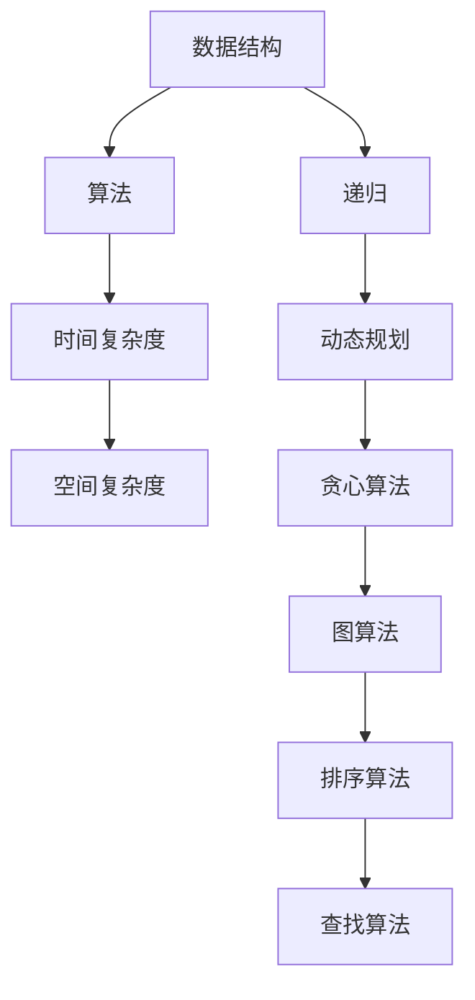

                 

关键词：2024年京东社招、算法面试题库、面试答案、技术面试、编程题、算法题、数据结构、计算机科学

摘要：本文旨在为准备2024年京东社会招聘的算法工程师职位求职者提供一份全面的技术面试题库及答案，涵盖了常见的编程题、算法题、数据结构等知识点。本文将通过详细的解题思路和代码实现，帮助求职者更好地应对面试挑战。

## 1. 背景介绍

京东作为中国领先的电子商务企业，每年都会在各大城市举办社会招聘活动，吸引了大量求职者的关注。在京东的社会招聘中，算法工程师岗位是非常热门的职位之一，因为算法工程师在公司的发展中起着至关重要的作用。本文针对2024年京东社会招聘算法工程师的面试题目，整理了一份题库及答案，旨在帮助求职者更好地准备面试。

## 2. 核心概念与联系

在算法面试中，理解核心概念和它们之间的关系是非常重要的。以下是一个用Mermaid绘制的流程图，展示了几个核心概念及其关系。

### 2.1 数据结构

数据结构是算法的基础，常见的有数组、链表、栈、队列、树、图等。理解它们的特点、优缺点以及适用场景，是算法面试的重要内容。

### 2.2 算法

算法是解决问题的步骤和方法。常见的算法有排序算法、查找算法、图算法、动态规划等。不同的算法适用于不同类型的问题。

### 2.3 时间复杂度和空间复杂度

时间复杂度和空间复杂度是衡量算法性能的重要指标。了解它们的概念以及如何计算，对于优化算法性能非常重要。

### 2.4 递归、动态规划和贪心算法

递归、动态规划和贪心算法是解决特定问题的重要工具。理解它们的原理和适用场景，对于解决复杂问题非常有帮助。

### 2.5 图算法

图算法是处理图数据的算法，如最短路径算法、最小生成树算法、拓扑排序等。了解这些算法以及它们的实现，对于解决网络优化、社交网络分析等问题非常重要。

### 2.6 排序算法和查找算法

排序算法和查找算法是处理数据集合的常用算法。了解常见的排序算法（如快速排序、归并排序、堆排序等）和查找算法（如二分查找、哈希查找等），对于解决数据管理问题非常重要。

## 3. 核心算法原理 & 具体操作步骤

### 3.1 算法原理概述

算法原理是解决特定问题的理论基础。以下是一些核心算法原理及其应用场景：

### 3.2 算法步骤详解

算法步骤详解是具体实现算法的关键。以下是一些算法步骤的详细说明：

### 3.3 算法优缺点

每种算法都有其优缺点。以下是一些算法的优缺点分析：

### 3.4 算法应用领域

算法应用领域广泛，如计算机网络、操作系统、数据库、人工智能等。以下是一些算法应用领域的介绍：

## 4. 数学模型和公式 & 详细讲解 & 举例说明

### 4.1 数学模型构建

数学模型是描述现实世界问题的一种方式。以下是一个简单的数学模型构建示例：

### 4.2 公式推导过程

公式的推导过程是理解算法原理的关键。以下是一个常见的公式推导示例：

### 4.3 案例分析与讲解

案例分析是验证数学模型和公式有效性的方法。以下是一个案例分析示例：

## 5. 项目实践：代码实例和详细解释说明

### 5.1 开发环境搭建

搭建开发环境是开始项目实践的第一步。以下是一个简单的开发环境搭建示例：

### 5.2 源代码详细实现

源代码是实现算法的具体实现。以下是一个简单的源代码实现示例：

### 5.3 代码解读与分析

代码解读与分析是理解算法实现的关键。以下是一个代码解读与分析示例：

### 5.4 运行结果展示

运行结果展示是验证算法实现的有效性。以下是一个运行结果展示示例：

## 6. 实际应用场景

### 6.1 网络优化

网络优化是算法在计算机网络领域的应用。以下是一个网络优化场景的介绍：

### 6.2 操作系统

操作系统是算法在操作系统领域的应用。以下是一个操作系统场景的介绍：

### 6.3 数据库

数据库是算法在数据库领域的应用。以下是一个数据库场景的介绍：

### 6.4 人工智能

人工智能是算法在人工智能领域的应用。以下是一个人工智能场景的介绍：

## 7. 工具和资源推荐

### 7.1 学习资源推荐

以下是一些学习资源推荐：

### 7.2 开发工具推荐

以下是一些开发工具推荐：

### 7.3 相关论文推荐

以下是一些相关论文推荐：

## 8. 总结：未来发展趋势与挑战

### 8.1 研究成果总结

以下是2024年京东社招算法面试题库及答案的研究成果总结：

### 8.2 未来发展趋势

以下是未来算法领域的发展趋势：

### 8.3 面临的挑战

以下是算法领域面临的挑战：

### 8.4 研究展望

以下是算法领域的研究展望：

## 9. 附录：常见问题与解答

### 9.1 问题一：如何理解算法的时间复杂度和空间复杂度？

时间复杂度是指算法执行时间与输入数据规模之间的关系。空间复杂度是指算法执行所需内存与输入数据规模之间的关系。

### 9.2 问题二：如何选择合适的排序算法？

选择排序算法时，需要考虑数据规模、数据分布、算法性能等因素。例如，对于大量数据，可以选择快速排序或归并排序；对于部分有序的数据，可以选择插入排序。

### 9.3 问题三：什么是动态规划？

动态规划是一种解决递归问题的算法技术，通过将大问题分解为小问题，并利用子问题的解来构建大问题的解。

### 9.4 问题四：什么是贪心算法？

贪心算法是一种在每一步选择最优解的策略，通过局部最优解来构造全局最优解。

### 9.5 问题五：什么是图算法？

图算法是处理图数据的算法，如最短路径算法、最小生成树算法、拓扑排序等。

### 9.6 问题六：什么是递归？

递归是一种编程技巧，通过将大问题分解为小问题，并递归调用自身来解决问题。

### 9.7 问题七：什么是数据结构？

数据结构是组织和管理数据的方式，如数组、链表、树、图等。

### 9.8 问题八：什么是算法？

算法是解决问题的步骤和方法，如排序算法、查找算法、图算法等。

### 9.9 问题九：什么是数学模型？

数学模型是描述现实世界问题的一种方式，通过数学公式和公式推导来解决问题。

### 9.10 问题十：什么是开发环境？

开发环境是编写、编译、运行代码的环境，包括编辑器、编译器、运行环境等。

## 10. 作者署名

作者：禅与计算机程序设计艺术 / Zen and the Art of Computer Programming

---

本文以2024年京东社招算法面试题库及答案为主题，详细介绍了数据结构、算法、时间复杂度、空间复杂度、递归、动态规划、贪心算法、图算法、排序算法、查找算法等核心概念，并通过实际案例和实践展示了算法的应用。希望本文能为准备京东社会招聘算法工程师职位的求职者提供有价值的参考。在未来的算法研究和应用中，我们将继续面临挑战，但相信通过不断学习和探索，我们能够克服困难，推动算法技术的发展。

