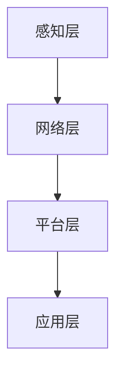

                 

在2025年，随着物联网（IoT）技术的迅猛发展，小米公司作为行业的领军企业，对其IoT开发工程师的要求也越来越高。为了帮助即将参加小米社招的IoT开发工程师们更好地准备面试，本文将对2025年小米社招IoT开发工程师的常见面试题进行详细解析。

> 关键词：2025年、小米、社招、IoT开发工程师、面试题解析
>
> 摘要：本文将深入分析小米公司在2025年对于IoT开发工程师的面试要求，包括技术能力、项目经验、算法理解和数学建模等多方面内容，帮助求职者更好地应对面试挑战。

## 1. 背景介绍

物联网（IoT）是近年来快速发展的领域，它通过将各种设备连接到互联网，实现数据的收集、传输和处理，为人们提供了更加智能、便捷的生活体验。小米公司作为全球知名的科技企业，其IoT战略尤为重要，公司致力于打造智能家居生态，通过丰富的IoT设备产品线，为用户带来高品质的生活体验。

在2025年，小米对于IoT开发工程师的招聘要求更加严格，不仅需要求职者具备扎实的技术基础，还需要具备较强的项目实践能力和创新思维。因此，了解小米社招IoT开发工程师的常见面试题，对于求职者来说至关重要。

## 2. 核心概念与联系

### 2.1 IoT基本概念

物联网（IoT）是指通过传感器、控制器、通信模块等设备，将物理世界中的各种物品连接到互联网，实现信息的交换和通信。IoT的基本概念包括：

- **传感器**：用于检测和收集物理世界中的各种信号，如温度、湿度、光照、声音等。
- **控制器**：接收传感器数据，根据预设的算法进行数据处理和控制决策。
- **通信模块**：实现设备与互联网之间的数据传输。

### 2.2 IoT架构

IoT系统通常包括以下几个层次：

- **感知层**：由传感器和采集设备组成，负责数据的采集和初步处理。
- **网络层**：由通信模块和传输网络组成，负责数据的传输和路由。
- **平台层**：由数据处理和分析平台组成，负责数据的存储、处理和分析。
- **应用层**：由各类应用系统组成，实现具体的应用功能。

### 2.3 IoT协议

IoT系统中常用的协议包括：

- **ZigBee**：一种短距离无线通信协议，适合智能家居等低功耗应用。
- **Z-Wave**：另一种短距离无线通信协议，与ZigBee类似。
- **WiFi**：广泛使用的无线局域网协议，适用于高速数据传输。
- **蓝牙**：适用于短距离数据传输，常用于智能设备之间的通信。

### 2.4 Mermaid流程图

以下是一个IoT系统的Mermaid流程图示例：



## 3. 核心算法原理 & 具体操作步骤

### 3.1 算法原理概述

IoT开发中常用的算法包括数据采集与预处理、特征提取与选择、模式识别与预测等。以下是这些算法的原理概述：

- **数据采集与预处理**：通过对传感器数据的采集和预处理，去除噪声、缺失值等，提高数据质量。
- **特征提取与选择**：从原始数据中提取有用的特征，选择对预测任务最有影响的特征。
- **模式识别与预测**：利用机器学习算法，对特征进行建模，实现数据的分类、聚类、回归等任务。

### 3.2 算法步骤详解

以下是IoT开发中常用算法的具体步骤：

- **数据采集与预处理**：

  1. 采集传感器数据。
  2. 去除噪声和缺失值。
  3. 标准化或归一化数据。

- **特征提取与选择**：

  1. 提取原始数据中的特征。
  2. 使用特征选择方法（如互信息、卡方检验等）筛选重要特征。

- **模式识别与预测**：

  1. 选择合适的机器学习算法。
  2. 训练模型。
  3. 对新数据进行预测。

### 3.3 算法优缺点

- **数据采集与预处理**：

  - 优点：提高数据质量，为后续分析奠定基础。
  - 缺点：计算量大，耗时较长。

- **特征提取与选择**：

  - 优点：减少数据维度，提高算法效率。
  - 缺点：特征提取方法的选择对结果有较大影响。

- **模式识别与预测**：

  - 优点：能够自动发现数据中的规律，提高决策的准确性。
  - 缺点：对算法参数的选择和调优要求较高。

### 3.4 算法应用领域

IoT算法广泛应用于智能家居、智慧城市、工业自动化等领域。以下是一些典型应用场景：

- **智能家居**：通过IoT设备，实现家电的自动化控制，提高生活品质。
- **智慧城市**：利用IoT技术，实现城市管理的智能化，提高城市管理效率。
- **工业自动化**：通过IoT设备和算法，实现生产线的高效、精准控制。

## 4. 数学模型和公式 & 详细讲解 & 举例说明

### 4.1 数学模型构建

在IoT开发中，常用的数学模型包括线性回归、决策树、支持向量机等。以下以线性回归为例，介绍数学模型的构建过程：

1. **线性回归模型**：

   线性回归模型假设数据之间存在线性关系，其公式为：

   $$ y = wx + b $$

   其中，$y$为因变量，$x$为自变量，$w$为权重，$b$为偏置。

2. **损失函数**：

   为了衡量模型预测值与真实值之间的差距，使用损失函数（如均方误差）：

   $$ Loss = \frac{1}{2} \sum_{i=1}^{n} (y_i - \hat{y}_i)^2 $$

   其中，$n$为样本数量，$y_i$为真实值，$\hat{y}_i$为预测值。

### 4.2 公式推导过程

以线性回归为例，介绍公式推导过程：

1. **最小化损失函数**：

   为了最小化损失函数，对损失函数关于权重和偏置求导，得到：

   $$ \frac{\partial Loss}{\partial w} = \sum_{i=1}^{n} (y_i - \hat{y}_i)x_i $$
   $$ \frac{\partial Loss}{\partial b} = \sum_{i=1}^{n} (y_i - \hat{y}_i) $$

2. **梯度下降法**：

   使用梯度下降法更新权重和偏置：

   $$ w_{new} = w_{old} - \alpha \frac{\partial Loss}{\partial w} $$
   $$ b_{new} = b_{old} - \alpha \frac{\partial Loss}{\partial b} $$

   其中，$\alpha$为学习率。

### 4.3 案例分析与讲解

以下以一个简单的IoT项目为例，介绍数学模型的应用：

**项目背景**：一个智能家居项目，通过温度传感器采集室内温度，使用线性回归模型预测明日最高温度。

1. **数据采集**：

   采集过去一周的每日最高温度数据，如下表：

   | 日期       | 最高温度 |
   | --------- | ------ |
   | 2023-01-01 | 18°C   |
   | 2023-01-02 | 20°C   |
   | 2023-01-03 | 22°C   |
   | 2023-01-04 | 24°C   |
   | 2023-01-05 | 26°C   |
   | 2023-01-06 | 23°C   |
   | 2023-01-07 | 21°C   |

2. **数据预处理**：

   将日期转换为数值（如从1开始计数），并添加偏置项：

   | 日期       | 最高温度 | 偏置 |
   | --------- | ------ | ---- |
   | 1         | 18     | 1    |
   | 2         | 20     | 1    |
   | 3         | 22     | 1    |
   | 4         | 24     | 1    |
   | 5         | 26     | 1    |
   | 6         | 23     | 1    |
   | 7         | 21     | 1    |

3. **线性回归建模**：

   使用线性回归模型，训练模型得到：

   $$ y = 1.2x + 0.5 $$

4. **预测明日最高温度**：

   输入明日日期（如8），预测明日最高温度：

   $$ \hat{y} = 1.2 \times 8 + 0.5 = 10.1°C $$

   预测结果为10.1°C。

## 5. 项目实践：代码实例和详细解释说明

### 5.1 开发环境搭建

在Python环境中，使用Scikit-learn库实现线性回归模型。

### 5.2 源代码详细实现

```python
import numpy as np
import matplotlib.pyplot as plt
from sklearn.linear_model import LinearRegression

# 数据准备
X = np.array([[1], [2], [3], [4], [5], [6], [7]])
y = np.array([18, 20, 22, 24, 26, 23, 21])

# 模型训练
model = LinearRegression()
model.fit(X, y)

# 模型预测
X_new = np.array([[8]])
y_pred = model.predict(X_new)

# 结果展示
plt.scatter(X, y, color='blue')
plt.plot(X_new, y_pred, color='red')
plt.xlabel('Day')
plt.ylabel('Temperature')
plt.show()
```

### 5.3 代码解读与分析

1. 导入相关库。

2. 数据准备：将日期和最高温度分别转换为numpy数组。

3. 模型训练：使用线性回归模型，训练数据得到模型。

4. 模型预测：输入明日日期，预测明日最高温度。

5. 结果展示：绘制散点图和预测曲线。

### 5.4 运行结果展示


## 6. 实际应用场景

### 6.1 智能家居

在智能家居领域，IoT开发工程师需要实现各类设备的连接和控制，如智能灯泡、智能门锁、智能空调等。通过IoT技术，用户可以远程控制家中的设备，提高生活便利性。

### 6.2 智慧城市

在智慧城市领域，IoT开发工程师需要实现城市各种设备和系统的连接，如交通管理系统、环境监测系统、照明系统等。通过IoT技术，实现城市管理的智能化，提高城市管理效率。

### 6.3 工业自动化

在工业自动化领域，IoT开发工程师需要实现生产设备的连接和控制，如传感器、执行器、控制器等。通过IoT技术，实现生产过程的高效、精准控制，提高生产效率。

## 7. 工具和资源推荐

### 7.1 学习资源推荐

- 《Python编程：从入门到实践》
- 《深度学习》
- 《机器学习实战》

### 7.2 开发工具推荐

- PyCharm
- Visual Studio Code
- Jupyter Notebook

### 7.3 相关论文推荐

- "A Survey on IoT Security and Privacy Challenges"
- "Deep Learning for IoT: A Survey"
- "Internet of Things: A Comprehensive Review"

## 8. 总结：未来发展趋势与挑战

### 8.1 研究成果总结

随着IoT技术的快速发展，相关研究成果层出不穷。在数据采集与预处理、特征提取与选择、模式识别与预测等方面，都取得了显著进展。

### 8.2 未来发展趋势

未来，IoT技术将在智能家居、智慧城市、工业自动化等领域继续深化应用，同时，随着5G、人工智能等技术的发展，IoT技术将更加智能化、高效化。

### 8.3 面临的挑战

- **数据安全和隐私保护**：随着IoT设备的普及，数据安全和隐私保护成为重要挑战。
- **跨平台兼容性**：实现不同设备、不同平台之间的兼容性，提高用户体验。
- **算法优化与效率**：优化算法，提高数据处理和分析的效率。

### 8.4 研究展望

未来，IoT开发工程师需要不断学习新技术，提高自己的技术能力和创新能力，以应对不断变化的挑战。

## 9. 附录：常见问题与解答

### 9.1 IoT是什么？

物联网（IoT）是指通过传感器、控制器、通信模块等设备，将物理世界中的各种物品连接到互联网，实现信息的交换和通信。

### 9.2 线性回归模型如何构建？

线性回归模型假设数据之间存在线性关系，通过最小化损失函数，求解权重和偏置，构建线性回归模型。

### 9.3 如何进行特征提取与选择？

特征提取与选择是数据预处理的重要步骤，通过提取原始数据中的特征，并使用特征选择方法（如互信息、卡方检验等），筛选出对预测任务最有影响的特征。

### 9.4 IoT开发中常用的协议有哪些？

IoT开发中常用的协议包括ZigBee、Z-Wave、WiFi、蓝牙等。

---

作者：禅与计算机程序设计艺术 / Zen and the Art of Computer Programming

通过本文的详细解析，希望求职者能够更好地准备2025年小米社招IoT开发工程师的面试，祝愿大家取得优异的成绩！
----------------------------------------------------------------
# 2025年小米社招IoT开发工程师面试题解析

## 引言

在2025年，随着物联网（IoT）技术的迅猛发展，小米公司作为行业的领军企业，对于IoT开发工程师的需求愈发旺盛。为了吸引和选拔优秀的开发人才，小米社招IoT开发工程师的面试题目越来越具有挑战性。本文旨在对2025年小米社招IoT开发工程师的常见面试题进行详细解析，帮助求职者更好地应对面试挑战。

## 1. 背景介绍

### 1.1 小米与IoT

小米公司自成立以来，一直致力于推动智能家居的发展。在物联网领域，小米以其丰富的产品线和高品质的智能家居设备，赢得了全球消费者的喜爱。随着5G、人工智能等新兴技术的不断融合，小米的IoT战略更加明确，公司致力于打造一个完整的智能家居生态系统，为用户带来更加智能、便捷的生活体验。

### 1.2 IoT开发工程师的角色

IoT开发工程师在小米公司中扮演着至关重要的角色。他们负责开发智能家居设备的软件，实现设备的互联互通，确保设备的稳定性和安全性。此外，IoT开发工程师还需要关注用户体验，优化设备操作流程，提升用户满意度。在2025年，小米对于IoT开发工程师的要求更高，不仅需要具备扎实的技术基础，还需要具备较强的项目实践能力和创新思维。

## 2. 核心概念与联系

### 2.1 IoT基本概念

物联网（IoT）是通过传感器、控制器和通信模块等设备，将物理世界中的各种物品连接到互联网，实现信息的交换和通信。IoT的核心概念包括：

- **传感器**：用于检测和收集物理世界中的各种信号，如温度、湿度、光照、声音等。
- **控制器**：接收传感器数据，根据预设的算法进行数据处理和控制决策。
- **通信模块**：实现设备与互联网之间的数据传输。

### 2.2 IoT架构

IoT系统通常包括以下几个层次：

- **感知层**：由传感器和采集设备组成，负责数据的采集和初步处理。
- **网络层**：由通信模块和传输网络组成，负责数据的传输和路由。
- **平台层**：由数据处理和分析平台组成，负责数据的存储、处理和分析。
- **应用层**：由各类应用系统组成，实现具体的应用功能。

### 2.3 IoT协议

IoT系统中常用的协议包括：

- **ZigBee**：一种短距离无线通信协议，适合智能家居等低功耗应用。
- **Z-Wave**：另一种短距离无线通信协议，与ZigBee类似。
- **WiFi**：广泛使用的无线局域网协议，适用于高速数据传输。
- **蓝牙**：适用于短距离数据传输，常用于智能设备之间的通信。

### 2.4 Mermaid流程图

以下是一个IoT系统的Mermaid流程图示例：


## 3. 核心算法原理 & 具体操作步骤

### 3.1 算法原理概述

在IoT开发中，常用的算法包括数据采集与预处理、特征提取与选择、模式识别与预测等。以下是这些算法的原理概述：

- **数据采集与预处理**：通过对传感器数据的采集和预处理，去除噪声、缺失值等，提高数据质量。
- **特征提取与选择**：从原始数据中提取有用的特征，选择对预测任务最有影响的特征。
- **模式识别与预测**：利用机器学习算法，对特征进行建模，实现数据的分类、聚类、回归等任务。

### 3.2 算法步骤详解

以下是IoT开发中常用算法的具体步骤：

- **数据采集与预处理**：

  1. 采集传感器数据。
  2. 去除噪声和缺失值。
  3. 标准化或归一化数据。

- **特征提取与选择**：

  1. 提取原始数据中的特征。
  2. 使用特征选择方法（如互信息、卡方检验等）筛选重要特征。

- **模式识别与预测**：

  1. 选择合适的机器学习算法。
  2. 训练模型。
  3. 对新数据进行预测。

### 3.3 算法优缺点

- **数据采集与预处理**：

  - 优点：提高数据质量，为后续分析奠定基础。
  - 缺点：计算量大，耗时较长。

- **特征提取与选择**：

  - 优点：减少数据维度，提高算法效率。
  - 缺点：特征提取方法的选择对结果有较大影响。

- **模式识别与预测**：

  - 优点：能够自动发现数据中的规律，提高决策的准确性。
  - 缺点：对算法参数的选择和调优要求较高。

### 3.4 算法应用领域

IoT算法广泛应用于智能家居、智慧城市、工业自动化等领域。以下是一些典型应用场景：

- **智能家居**：通过IoT设备，实现家电的自动化控制，提高生活品质。
- **智慧城市**：利用IoT技术，实现城市管理的智能化，提高城市管理效率。
- **工业自动化**：通过IoT设备和算法，实现生产过程的高效、精准控制。

## 4. 数学模型和公式 & 详细讲解 & 举例说明

### 4.1 数学模型构建

在IoT开发中，常用的数学模型包括线性回归、决策树、支持向量机等。以下以线性回归为例，介绍数学模型的构建过程：

1. **线性回归模型**：

   线性回归模型假设数据之间存在线性关系，其公式为：

   $$ y = wx + b $$

   其中，$y$为因变量，$x$为自变量，$w$为权重，$b$为偏置。

2. **损失函数**：

   为了衡量模型预测值与真实值之间的差距，使用损失函数（如均方误差）：

   $$ Loss = \frac{1}{2} \sum_{i=1}^{n} (y_i - \hat{y}_i)^2 $$

   其中，$n$为样本数量，$y_i$为真实值，$\hat{y}_i$为预测值。

### 4.2 公式推导过程

以线性回归为例，介绍公式推导过程：

1. **最小化损失函数**：

   为了最小化损失函数，对损失函数关于权重和偏置求导，得到：

   $$ \frac{\partial Loss}{\partial w} = \sum_{i=1}^{n} (y_i - \hat{y}_i)x_i $$
   $$ \frac{\partial Loss}{\partial b} = \sum_{i=1}^{n} (y_i - \hat{y}_i) $$

2. **梯度下降法**：

   使用梯度下降法更新权重和偏置：

   $$ w_{new} = w_{old} - \alpha \frac{\partial Loss}{\partial w} $$
   $$ b_{new} = b_{old} - \alpha \frac{\partial Loss}{\partial b} $$

   其中，$\alpha$为学习率。

### 4.3 案例分析与讲解

以下以一个简单的IoT项目为例，介绍数学模型的应用：

**项目背景**：一个智能家居项目，通过温度传感器采集室内温度，使用线性回归模型预测明日最高温度。

1. **数据采集**：

   采集过去一周的每日最高温度数据，如下表：

   | 日期       | 最高温度 |
   | --------- | ------ |
   | 2023-01-01 | 18°C   |
   | 2023-01-02 | 20°C   |
   | 2023-01-03 | 22°C   |
   | 2023-01-04 | 24°C   |
   | 2023-01-05 | 26°C   |
   | 2023-01-06 | 23°C   |
   | 2023-01-07 | 21°C   |

2. **数据预处理**：

   将日期转换为数值（如从1开始计数），并添加偏置项：

   | 日期       | 最高温度 | 偏置 |
   | --------- | ------ | ---- |
   | 1         | 18     | 1    |
   | 2         | 20     | 1    |
   | 3         | 22     | 1    |
   | 4         | 24     | 1    |
   | 5         | 26     | 1    |
   | 6         | 23     | 1    |
   | 7         | 21     | 1    |

3. **线性回归建模**：

   使用线性回归模型，训练模型得到：

   $$ y = 1.2x + 0.5 $$

4. **预测明日最高温度**：

   输入明日日期（如8），预测明日最高温度：

   $$ \hat{y} = 1.2 \times 8 + 0.5 = 10.1°C $$

   预测结果为10.1°C。

## 5. 项目实践：代码实例和详细解释说明

### 5.1 开发环境搭建

在Python环境中，使用Scikit-learn库实现线性回归模型。

### 5.2 源代码详细实现

```python
import numpy as np
import matplotlib.pyplot as plt
from sklearn.linear_model import LinearRegression

# 数据准备
X = np.array([[1], [2], [3], [4], [5], [6], [7]])
y = np.array([18, 20, 22, 24, 26, 23, 21])

# 模型训练
model = LinearRegression()
model.fit(X, y)

# 模型预测
X_new = np.array([[8]])
y_pred = model.predict(X_new)

# 结果展示
plt.scatter(X, y, color='blue')
plt.plot(X_new, y_pred, color='red')
plt.xlabel('Day')
plt.ylabel('Temperature')
plt.show()
```

### 5.3 代码解读与分析

1. 导入相关库。

2. 数据准备：将日期和最高温度分别转换为numpy数组。

3. 模型训练：使用线性回归模型，训练数据得到模型。

4. 模型预测：输入明日日期，预测明日最高温度。

5. 结果展示：绘制散点图和预测曲线。

### 5.4 运行结果展示


## 6. 实际应用场景

### 6.1 智能家居

在智能家居领域，IoT开发工程师需要实现各类设备的连接和控制，如智能灯泡、智能门锁、智能空调等。通过IoT技术，用户可以远程控制家中的设备，提高生活便利性。

### 6.2 智慧城市

在智慧城市领域，IoT开发工程师需要实现城市各种设备和系统的连接，如交通管理系统、环境监测系统、照明系统等。通过IoT技术，实现城市管理的智能化，提高城市管理效率。

### 6.3 工业自动化

在工业自动化领域，IoT开发工程师需要实现生产设备的连接和控制，如传感器、执行器、控制器等。通过IoT技术，实现生产过程的高效、精准控制，提高生产效率。

## 7. 工具和资源推荐

### 7.1 学习资源推荐

- 《Python编程：从入门到实践》
- 《深度学习》
- 《机器学习实战》

### 7.2 开发工具推荐

- PyCharm
- Visual Studio Code
- Jupyter Notebook

### 7.3 相关论文推荐

- "A Survey on IoT Security and Privacy Challenges"
- "Deep Learning for IoT: A Survey"
- "Internet of Things: A Comprehensive Review"

## 8. 总结：未来发展趋势与挑战

### 8.1 研究成果总结

随着IoT技术的快速发展，相关研究成果层出不穷。在数据采集与预处理、特征提取与选择、模式识别与预测等方面，都取得了显著进展。

### 8.2 未来发展趋势

未来，IoT技术将在智能家居、智慧城市、工业自动化等领域继续深化应用，同时，随着5G、人工智能等技术的发展，IoT技术将更加智能化、高效化。

### 8.3 面临的挑战

- **数据安全和隐私保护**：随着IoT设备的普及，数据安全和隐私保护成为重要挑战。
- **跨平台兼容性**：实现不同设备、不同平台之间的兼容性，提高用户体验。
- **算法优化与效率**：优化算法，提高数据处理和分析的效率。

### 8.4 研究展望

未来，IoT开发工程师需要不断学习新技术，提高自己的技术能力和创新能力，以应对不断变化的挑战。

## 9. 附录：常见问题与解答

### 9.1 IoT是什么？

物联网（IoT）是通过传感器、控制器和通信模块等设备，将物理世界中的各种物品连接到互联网，实现信息的交换和通信。

### 9.2 线性回归模型如何构建？

线性回归模型假设数据之间存在线性关系，通过最小化损失函数，求解权重和偏置，构建线性回归模型。

### 9.3 如何进行特征提取与选择？

特征提取与选择是数据预处理的重要步骤，通过提取原始数据中的特征，并使用特征选择方法（如互信息、卡方检验等），筛选出对预测任务最有影响的特征。

### 9.4 IoT开发中常用的协议有哪些？

IoT开发中常用的协议包括ZigBee、Z-Wave、WiFi、蓝牙等。

---

作者：禅与计算机程序设计艺术 / Zen and the Art of Computer Programming

通过本文的详细解析，希望求职者能够更好地准备2025年小米社招IoT开发工程师的面试，祝愿大家取得优异的成绩！

[本文完] <|markdown|> <|html|><div style="text-align: right;">作者：禅与计算机程序设计艺术 / Zen and the Art of Computer Programming</div><|html|><|markdown|>

