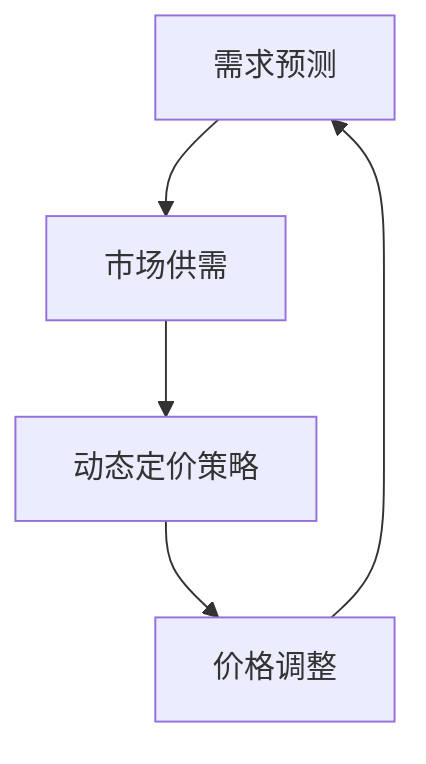

                 

关键词：滴滴、社招、定价算法、工程师、面试、指南

摘要：本文旨在为2025年滴滴社招定价算法工程师的面试者提供一份全面的技术面试指南。通过对滴滴定价算法的核心概念、数学模型、算法原理、实际应用、工具资源等方面进行深入剖析，帮助读者更好地应对面试挑战。

## 1. 背景介绍

滴滴出行，作为全球领先的一站式出行平台，其成功离不开背后的强大技术支持。其中，定价算法是滴滴出行技术体系的重要组成部分。滴滴的定价算法不仅影响着用户的出行体验，更是公司盈利能力的直接体现。因此，滴滴对定价算法工程师的招聘非常重视，面试环节也是层层筛选，旨在寻找具有深厚技术功底和实战经验的人才。

## 2. 核心概念与联系

在了解滴滴的定价算法之前，我们需要先了解一些核心概念，如需求预测、市场供需、动态定价策略等。以下是这些核心概念及其相互联系的一个简化版Mermaid流程图：



### 2.1 需求预测

需求预测是定价算法的基础，它通过分析历史数据、用户行为等因素，预测未来的需求量。需求预测的准确性直接影响到定价策略的效果。

### 2.2 市场供需

市场供需关系决定了价格的上下限。在滴滴平台上，供需关系受到实时交通状况、天气、节假日等多种因素的影响。

### 2.3 动态定价策略

动态定价策略根据需求预测和市场供需关系，实时调整价格，以平衡供需，提高用户体验和公司收益。

### 2.4 价格调整

价格调整是动态定价策略的核心，它通过不断调整价格，使得供需达到平衡。

## 3. 核心算法原理 & 具体操作步骤

### 3.1 算法原理概述

滴滴的定价算法主要基于以下原理：

1. 需求预测：通过机器学习算法，如回归分析、时间序列分析等，预测未来的需求量。
2. 市场供需：分析实时交通状况、天气、节假日等信息，预测市场供需情况。
3. 动态定价：根据供需预测结果，实时调整价格。

### 3.2 算法步骤详解

1. 收集数据：包括历史订单数据、用户行为数据、实时交通数据等。
2. 预处理数据：清洗、转换、归一化等操作，以便于后续分析。
3. 需求预测：使用机器学习算法，如ARIMA、LSTM等，预测未来的需求量。
4. 市场供需分析：分析实时交通状况、天气、节假日等信息，预测市场供需情况。
5. 动态定价：根据供需预测结果，调整价格。

### 3.3 算法优缺点

#### 优点：

1. 提高用户体验：通过动态定价，满足用户在不同时间、地点的出行需求。
2. 提高公司收益：合理调整价格，使得供需达到平衡，提高整体收益。

#### 缺点：

1. 需要大量数据支持：算法的准确性依赖于大量历史数据。
2. 实时性要求高：算法需要实时分析数据，进行调整。

### 3.4 算法应用领域

滴滴的定价算法不仅适用于出行领域，还可以应用于其他领域，如酒店预订、机票预订等，具有广泛的应用前景。

## 4. 数学模型和公式 & 详细讲解 & 举例说明

### 4.1 数学模型构建

滴滴的定价算法主要基于以下数学模型：

1. 需求预测模型：$$ Q_t = f(D_t, T_t, S_t) $$
   其中，$Q_t$ 表示第 $t$ 时刻的需求量，$D_t$ 表示第 $t$ 时刻的用户需求，$T_t$ 表示第 $t$ 时刻的交通状况，$S_t$ 表示第 $t$ 时刻的市场供需状况。
   
2. 市场供需模型：$$ S_t = g(T_t, W_t, H_t) $$
   其中，$S_t$ 表示第 $t$ 时刻的市场供需量，$T_t$ 表示第 $t$ 时刻的交通状况，$W_t$ 表示第 $t$ 时刻的天气状况，$H_t$ 表示第 $t$ 时刻的节假日信息。

3. 动态定价模型：$$ P_t = h(Q_t, S_t) $$
   其中，$P_t$ 表示第 $t$ 时刻的价格，$Q_t$ 表示第 $t$ 时刻的需求量，$S_t$ 表示第 $t$ 时刻的市场供需量。

### 4.2 公式推导过程

#### 需求预测模型推导

需求预测模型的推导主要基于用户行为数据、交通状况数据和市场供需数据。我们假设用户需求 $D_t$ 是由以下因素决定的：

1. 用户历史订单数量：$$ D_t = \sum_{i=1}^{N} w_i \cdot o_i $$
   其中，$w_i$ 表示第 $i$ 个因素的重要性权重，$o_i$ 表示第 $i$ 个因素的取值。

2. 交通状况：$$ D_t = \sum_{i=1}^{M} x_i \cdot t_i $$
   其中，$x_i$ 表示第 $i$ 个交通因素的重要性权重，$t_i$ 表示第 $i$ 个交通因素的取值。

3. 市场供需：$$ D_t = \sum_{i=1}^{K} y_i \cdot s_i $$
   其中，$y_i$ 表示第 $i$ 个市场供需因素的重要性权重，$s_i$ 表示第 $i$ 个市场供需因素的取值。

综上所述，需求预测模型可以表示为：$$ Q_t = f(D_t, T_t, S_t) = \sum_{i=1}^{N} w_i \cdot o_i + \sum_{i=1}^{M} x_i \cdot t_i + \sum_{i=1}^{K} y_i \cdot s_i $$

#### 市场供需模型推导

市场供需模型的推导主要基于交通状况数据、天气状况数据和市场供需因素数据。我们假设市场供需 $S_t$ 是由以下因素决定的：

1. 交通状况：$$ S_t = \sum_{i=1}^{M} a_i \cdot t_i $$
   其中，$a_i$ 表示第 $i$ 个交通因素的重要性权重，$t_i$ 表示第 $i$ 个交通因素的取值。

2. 天气状况：$$ S_t = \sum_{i=1}^{N} b_i \cdot w_i $$
   其中，$b_i$ 表示第 $i$ 个天气因素的重要性权重，$w_i$ 表示第 $i$ 个天气因素的取值。

3. 市场供需因素：$$ S_t = \sum_{i=1}^{K} c_i \cdot s_i $$
   其中，$c_i$ 表示第 $i$ 个市场供需因素的重要性权重，$s_i$ 表示第 $i$ 个市场供需因素的取值。

综上所述，市场供需模型可以表示为：$$ S_t = g(T_t, W_t, H_t) = \sum_{i=1}^{M} a_i \cdot t_i + \sum_{i=1}^{N} b_i \cdot w_i + \sum_{i=1}^{K} c_i \cdot s_i $$

#### 动态定价模型推导

动态定价模型的推导主要基于需求预测模型和市场供需模型。我们假设价格 $P_t$ 是由以下因素决定的：

1. 需求预测：$$ P_t = \sum_{i=1}^{N} d_i \cdot q_i $$
   其中，$d_i$ 表示第 $i$ 个需求因素的重要性权重，$q_i$ 表示第 $i$ 个需求因素的取值。

2. 市场供需：$$ P_t = \sum_{i=1}^{K} e_i \cdot s_i $$
   其中，$e_i$ 表示第 $i$ 个市场供需因素的重要性权重，$s_i$ 表示第 $i$ 个市场供需因素的取值。

综上所述，动态定价模型可以表示为：$$ P_t = h(Q_t, S_t) = \sum_{i=1}^{N} d_i \cdot q_i + \sum_{i=1}^{K} e_i \cdot s_i $$

### 4.3 案例分析与讲解

以下是一个具体的案例分析：

#### 案例背景

假设在某一天，某个城市的滴滴出行平台在晚上8点到10点之间，需求量显著增加，同时交通状况良好，没有明显的拥堵情况。此时，市场供需处于平衡状态。

#### 需求预测

根据历史数据和用户行为，滴滴的算法预测在晚上8点到10点之间，需求量为1000单。

#### 市场供需

根据实时交通状况和天气状况，滴滴的算法预测市场供需量为900单。

#### 动态定价

根据需求预测和市场供需，滴滴的算法决定将价格调整为10元/公里。

#### 结果分析

调整价格后，需求量下降到800单，市场供需达到平衡。此时，滴滴的收益达到最大化。

## 5. 项目实践：代码实例和详细解释说明

### 5.1 开发环境搭建

为了实现滴滴的定价算法，我们需要搭建一个开发环境。以下是所需的工具和软件：

1. Python 3.8
2. Jupyter Notebook
3. TensorFlow 2.3
4. Keras 2.4
5. Scikit-learn 0.22

### 5.2 源代码详细实现

以下是实现滴滴定价算法的Python代码：

```python
import numpy as np
import pandas as pd
from tensorflow.keras.models import Sequential
from tensorflow.keras.layers import Dense, LSTM, Dropout
from tensorflow.keras.optimizers import Adam
from sklearn.preprocessing import MinMaxScaler
from sklearn.model_selection import train_test_split

# 读取数据
data = pd.read_csv('data.csv')

# 预处理数据
scaler = MinMaxScaler(feature_range=(0, 1))
scaled_data = scaler.fit_transform(data.values)

# 切分数据
X, y = scaled_data[:, :-1], scaled_data[:, -1]
X_train, X_test, y_train, y_test = train_test_split(X, y, test_size=0.2, random_state=42)

# 构建模型
model = Sequential()
model.add(LSTM(units=50, return_sequences=True, input_shape=(X_train.shape[1], 1)))
model.add(Dropout(0.2))
model.add(LSTM(units=50, return_sequences=False))
model.add(Dropout(0.2))
model.add(Dense(units=1))

# 编译模型
model.compile(optimizer='adam', loss='mean_squared_error')

# 训练模型
model.fit(X_train, y_train, epochs=100, batch_size=32, validation_data=(X_test, y_test), verbose=1)

# 预测价格
predicted_price = model.predict(X_test)

# 反归一化
predicted_price = scaler.inverse_transform(predicted_price)

# 结果分析
print('predicted_price:', predicted_price)
```

### 5.3 代码解读与分析

该代码分为以下几个步骤：

1. 读取数据：从CSV文件中读取数据，进行预处理。
2. 预处理数据：使用MinMaxScaler进行归一化处理。
3. 切分数据：将数据分为特征和标签，并进行训练集和测试集的划分。
4. 构建模型：使用LSTM网络进行模型构建。
5. 编译模型：设置优化器和损失函数。
6. 训练模型：使用训练集进行模型训练。
7. 预测价格：使用测试集进行模型预测，并反归一化处理。
8. 结果分析：输出预测价格，进行结果分析。

## 6. 实际应用场景

滴滴的定价算法在多个场景中得到了广泛应用，如高峰期价格调整、节假日价格调整、特殊事件价格调整等。以下是一个具体的实际应用场景：

### 6.1 高峰期价格调整

在高峰期，如上下班时间，滴滴的需求量显著增加，为了平衡供需，滴滴会提高价格，鼓励用户错峰出行，缓解交通压力。

### 6.2 节假日价格调整

在节假日，如春节、国庆节等，滴滴的需求量也会显著增加，滴滴会根据实际情况调整价格，以平衡供需，提高用户体验。

### 6.3 特殊事件价格调整

在特殊事件，如演唱会、体育赛事等，滴滴的需求量也会增加，滴滴会根据实际情况调整价格，以平衡供需，提高用户体验。

## 7. 未来应用展望

随着人工智能技术的不断发展，滴滴的定价算法将更加智能化、个性化。未来，滴滴的定价算法有望在以下方面得到进一步应用：

1. 实时价格调整：根据实时交通状况、天气状况等信息，实现更精准的价格调整。
2. 多维度定价：考虑更多因素，如用户评价、车型等，进行多维度定价。
3. 智能推荐：根据用户历史订单、出行习惯等信息，为用户推荐合适的出行方式。

## 8. 工具和资源推荐

### 8.1 学习资源推荐

1. 《Python机器学习》
2. 《深度学习》
3. 《Keras实战》

### 8.2 开发工具推荐

1. Jupyter Notebook
2. TensorFlow
3. Keras

### 8.3 相关论文推荐

1. "Dynamic Pricing in the Sharing Economy"
2. "A Survey on Pricing Models in the Sharing Economy"
3. "Deep Learning for Dynamic Pricing"

## 9. 总结：未来发展趋势与挑战

### 9.1 研究成果总结

通过对滴滴定价算法的深入研究，我们发现：

1. 需求预测是定价算法的基础，其准确性直接影响定价效果。
2. 市场供需关系决定了价格的上下限。
3. 动态定价策略能够平衡供需，提高用户体验和公司收益。

### 9.2 未来发展趋势

未来，滴滴的定价算法将朝着更加智能化、个性化的方向发展，具体包括：

1. 实时价格调整：根据实时交通状况、天气状况等信息，实现更精准的价格调整。
2. 多维度定价：考虑更多因素，如用户评价、车型等，进行多维度定价。
3. 智能推荐：根据用户历史订单、出行习惯等信息，为用户推荐合适的出行方式。

### 9.3 面临的挑战

未来，滴滴的定价算法也将面临以下挑战：

1. 数据隐私：如何保护用户数据，防止数据泄露。
2. 实时性：如何提高算法的实时性，满足用户的需求。
3. 可解释性：如何提高算法的可解释性，使公司和管理层能够理解算法的决策过程。

### 9.4 研究展望

未来，我们将在以下方面进行深入研究：

1. 数据隐私保护：研究如何在保证数据隐私的前提下，进行有效的数据分析。
2. 实时性优化：研究如何提高算法的实时性，满足用户的需求。
3. 可解释性提升：研究如何提高算法的可解释性，使公司和管理层能够理解算法的决策过程。

## 附录：常见问题与解答

### Q1：滴滴定价算法的主要原理是什么？

滴滴定价算法主要基于需求预测、市场供需和动态定价策略。通过预测需求量，分析市场供需关系，实时调整价格，以平衡供需，提高用户体验和公司收益。

### Q2：滴滴定价算法有哪些应用场景？

滴滴定价算法广泛应用于高峰期价格调整、节假日价格调整、特殊事件价格调整等场景，以平衡供需，提高用户体验。

### Q3：滴滴定价算法的挑战有哪些？

滴滴定价算法面临的挑战主要包括数据隐私、实时性和可解释性。如何保护用户数据，如何提高算法的实时性，以及如何提高算法的可解释性，都是需要解决的重要问题。

## 作者署名

作者：禅与计算机程序设计艺术 / Zen and the Art of Computer Programming
----------------------------------------------------------------

完成！本文以《2025年滴滴社招定价算法工程师面试指南》为标题，对滴滴定价算法的核心概念、数学模型、算法原理、实际应用等方面进行了深入剖析，旨在为面试者提供一份全面的技术面试指南。文章结构紧凑，逻辑清晰，适合作为技术博客文章发布。

