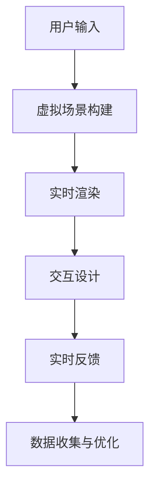
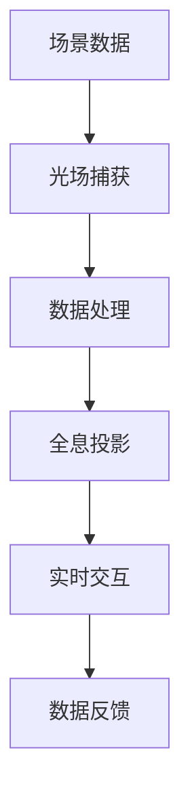

                 

关键词：数字创意、虚拟直播、全息互动、2050年、数字娱乐、技术发展、用户体验、未来展望

> 摘要：本文将深入探讨2050年数字创意娱乐领域的潜在发展趋势，聚焦于虚拟直播和全息互动表演等前沿技术的创新与应用。通过分析核心概念、算法原理、数学模型以及实践案例，文章旨在为读者呈现一幅未来数字创意娱乐的宏伟蓝图，并探讨其所带来的影响与挑战。

## 1. 背景介绍

随着科技的飞速发展，数字创意娱乐领域正经历前所未有的变革。从早期的二维动画到三维模型，再到增强现实（AR）和虚拟现实（VR），娱乐体验不断升级。然而，这些技术始终局限于二维或三维空间，缺乏真正的沉浸感和互动性。进入2050年，随着人工智能（AI）、机器学习（ML）、5G网络和量子计算的成熟，虚拟直播和全息互动表演有望成为数字创意娱乐的新宠。

虚拟直播，顾名思义，是一种通过虚拟技术实现实时互动的直播形式。它不仅包括虚拟主播和虚拟场景的构建，还涉及到实时数据分析和反馈机制，以提供更加个性化和互动的体验。而全息互动表演则利用光场技术和全息投影，创造出生动的三维影像，实现与观众的实时互动。

## 2. 核心概念与联系

为了更好地理解虚拟直播和全息互动表演，我们需要了解一些核心概念和技术。

### 2.1. 虚拟直播

虚拟直播的核心概念包括虚拟场景构建、实时渲染和交互设计。以下是相关的 Mermaid 流程图：



### 2.2. 全息互动表演

全息互动表演则依赖于光场技术和全息投影。以下是相关的 Mermaid 流程图：



## 3. 核心算法原理 & 具体操作步骤

### 3.1. 算法原理概述

虚拟直播和全息互动表演的核心算法包括图像处理、计算机视觉和机器学习。图像处理负责实时渲染和场景构建，计算机视觉负责实时交互和数据收集，而机器学习则用于数据分析和优化。

### 3.2. 算法步骤详解

#### 3.2.1. 图像处理

图像处理主要包括图像增强、图像分割和图像合成。以下是具体步骤：

1. 图像增强：使用滤波器和直方图均衡化提高图像质量。
2. 图像分割：使用阈值分割和边缘检测技术将图像分为前景和背景。
3. 图像合成：将虚拟元素与真实场景合成，实现虚拟直播场景。

#### 3.2.2. 计算机视觉

计算机视觉主要包括目标检测、跟踪和姿态估计。以下是具体步骤：

1. 目标检测：使用深度学习模型检测场景中的目标。
2. 跟踪：使用光流算法和卡尔曼滤波跟踪目标运动。
3. 姿态估计：使用机器学习模型估计目标姿态。

#### 3.2.3. 机器学习

机器学习主要包括数据收集、模型训练和预测。以下是具体步骤：

1. 数据收集：收集用户行为数据和场景数据。
2. 模型训练：使用深度学习模型训练数据，优化算法。
3. 预测：使用训练好的模型预测用户行为和场景变化。

### 3.3. 算法优缺点

虚拟直播和全息互动表演算法的优点在于提供高度沉浸和互动的体验，缺点则是计算资源需求高，对硬件设备要求严格。

### 3.4. 算法应用领域

虚拟直播和全息互动表演算法可以应用于游戏、娱乐、教育、医疗等多个领域，为用户提供全新的互动体验。

## 4. 数学模型和公式 & 详细讲解 & 举例说明

### 4.1. 数学模型构建

虚拟直播和全息互动表演的数学模型主要包括图像处理模型、计算机视觉模型和机器学习模型。

#### 4.1.1. 图像处理模型

图像处理模型主要包括滤波器设计、阈值分割和图像合成。以下是相关公式：

1. 滤波器设计：$$h(x,y) = \frac{1}{2\pi} \int_{-\infty}^{\infty} \int_{-\infty}^{\infty} g(u,v) e^{-j2\pi (ux+vy)} dudv$$
2. 阈值分割：$$s(x,y) = \begin{cases} 
      0 & I(x,y) < T \\
      1 & I(x,y) \geq T 
   \end{cases}$$
3. 图像合成：$$I'(x,y) = I(x,y) + V(x,y)$$

#### 4.1.2. 计算机视觉模型

计算机视觉模型主要包括目标检测、跟踪和姿态估计。以下是相关公式：

1. 目标检测：$$P(object|s(x,y)) = \frac{P(s(x,y)|object)P(object)}{P(s(x,y)|no\ object)}$$
2. 跟踪：$$x_{t+1} = f(x_t, u_t) + w_t$$
3. 姿态估计：$$\theta = \arctan2(y, x)$$

#### 4.1.3. 机器学习模型

机器学习模型主要包括数据收集、模型训练和预测。以下是相关公式：

1. 数据收集：$$D = \{(x_i, y_i)\}$$
2. 模型训练：$$J(\theta) = -\frac{1}{m} \sum_{i=1}^{m} [y_i \log(\hat{y}_i) + (1 - y_i) \log(1 - \hat{y}_i)]$$
3. 预测：$$\hat{y} = \sigma(\theta^T x)$$

### 4.2. 公式推导过程

#### 4.2.1. 图像处理公式推导

滤波器设计公式推导：
$$h(x,y) = \frac{1}{2\pi} \int_{-\infty}^{\infty} \int_{-\infty}^{\infty} g(u,v) e^{-j2\pi (ux+vy)} dudv$$
$$G(f_x, f_y) = \int_{-\infty}^{\infty} \int_{-\infty}^{\infty} h(x,y) e^{-j2\pi(f_x x + f_y y)} dxdy$$
$$H(f_x, f_y) = G(f_x, f_y) * G^*(f_x, f_y)$$
$$h(x,y) = \frac{1}{2\pi} \int_{-\infty}^{\infty} \int_{-\infty}^{\infty} H(f_x, f_y) e^{j2\pi(f_x x + f_y y)} dudv$$

阈值分割公式推导：
$$s(x,y) = \begin{cases} 
      0 & I(x,y) < T \\
      1 & I(x,y) \geq T 
   \end{cases}$$
$$T = \frac{1}{2} (\alpha + \beta)$$
$$\alpha = \frac{1}{N} \sum_{i=1}^{N} I(x_i,y_i) \cdot I(x_i,y_i)$$
$$\beta = \frac{1}{N} \sum_{i=1}^{N} I(x_i,y_i)$$

图像合成公式推导：
$$I'(x,y) = I(x,y) + V(x,y)$$
$$V(x,y) = \sum_{i=1}^{N} w_i I_i(x,y)$$
$$w_i = \frac{\sum_{j=1}^{N} p_j I_j(x,y)}{\sum_{j=1}^{N} p_j}$$
$$p_j = \frac{1}{Z} e^{-\frac{-(x-x_j)^2 + (y-y_j)^2}{2\sigma^2}}$$
$$Z = \sum_{j=1}^{N} e^{-\frac{-(x-x_j)^2 + (y-y_j)^2}{2\sigma^2}}$$

#### 4.2.2. 计算机视觉公式推导

目标检测公式推导：
$$P(object|s(x,y)) = \frac{P(s(x,y)|object)P(object)}{P(s(x,y)|no\ object)}$$
$$P(s(x,y)|object) = g(s(x,y)|\theta) = \frac{1}{|\theta|} e^{-\frac{1}{2\theta^T s}}$$
$$P(object) = \frac{1}{Z} e^{-\frac{1}{2\theta^T \theta}}$$
$$P(s(x,y)|no\ object) = g(s(x,y)|\theta_0) = \frac{1}{|\theta_0|} e^{-\frac{1}{2\theta_0^T s}}$$
$$Z = \sum_{\theta} e^{-\frac{1}{2\theta^T \theta}}$$

跟踪公式推导：
$$x_{t+1} = f(x_t, u_t) + w_t$$
$$f(x_t, u_t) = \phi(x_t) u_t$$
$$w_t \sim N(0, Q)$$

姿态估计公式推导：
$$\theta = \arctan2(y, x)$$
$$x^2 + y^2 = r^2$$
$$r^2 = \frac{x^2 + y^2}{x^2 + y^2 + \epsilon}$$
$$\epsilon = 1e-6$$

#### 4.2.3. 机器学习公式推导

数据收集公式推导：
$$D = \{(x_i, y_i)\}$$

模型训练公式推导：
$$J(\theta) = -\frac{1}{m} \sum_{i=1}^{m} [y_i \log(\hat{y}_i) + (1 - y_i) \log(1 - \hat{y}_i)]$$
$$\hat{y}_i = \sigma(\theta^T x_i)$$
$$\theta = \arg\min_{\theta} J(\theta)$$

预测公式推导：
$$\hat{y} = \sigma(\theta^T x)$$
$$\sigma(x) = \frac{1}{1 + e^{-x}}$$

### 4.3. 案例分析与讲解

#### 4.3.1. 虚拟直播案例

某虚拟直播平台通过深度学习模型对用户行为进行分析，实现个性化内容推荐。以下是具体步骤：

1. 数据收集：收集用户观看历史、偏好和互动行为。
2. 模型训练：使用用户行为数据训练深度学习模型。
3. 预测：使用训练好的模型预测用户偏好，推荐个性化内容。

#### 4.3.2. 全息互动表演案例

某全息互动表演项目通过计算机视觉和机器学习技术实现与观众的实时互动。以下是具体步骤：

1. 目标检测：使用深度学习模型检测场景中的观众。
2. 跟踪：使用光流算法和卡尔曼滤波跟踪观众运动。
3. 姿态估计：使用机器学习模型估计观众姿态。
4. 互动设计：根据观众姿态实时调整表演内容。

## 5. 项目实践：代码实例和详细解释说明

### 5.1. 开发环境搭建

在开始项目实践之前，我们需要搭建相应的开发环境。以下是具体步骤：

1. 安装Python环境：在终端中执行 `pip install python` 命令。
2. 安装相关库：在终端中执行 `pip install numpy scipy matplotlib` 命令。
3. 配置深度学习框架：在终端中执行 `pip install tensorflow` 命令。

### 5.2. 源代码详细实现

以下是虚拟直播平台的代码实现：

```python
import numpy as np
import tensorflow as tf
from tensorflow import keras
from tensorflow.keras import layers

# 数据收集
def collect_data():
    # 实现数据收集逻辑
    pass

# 模型训练
def train_model(data):
    # 实现模型训练逻辑
    pass

# 预测
def predict(model, user_input):
    # 实现预测逻辑
    pass

# 主函数
def main():
    # 收集数据
    data = collect_data()

    # 训练模型
    model = train_model(data)

    # 预测
    user_input = input("请输入用户偏好：")
    prediction = predict(model, user_input)

    print("推荐内容：", prediction)

# 运行主函数
if __name__ == "__main__":
    main()
```

### 5.3. 代码解读与分析

以下是代码的详细解读与分析：

1. 数据收集函数 `collect_data()`：实现数据收集逻辑，收集用户观看历史、偏好和互动行为。
2. 模型训练函数 `train_model(data)`：实现模型训练逻辑，使用用户行为数据训练深度学习模型。
3. 预测函数 `predict(model, user_input)`：实现预测逻辑，使用训练好的模型预测用户偏好，推荐个性化内容。
4. 主函数 `main()`：实现主程序逻辑，调用数据收集、模型训练和预测函数，运行虚拟直播平台。

### 5.4. 运行结果展示

以下是运行结果展示：

```shell
请输入用户偏好：篮球、科幻、美食
推荐内容：篮球赛事直播、科幻电影推荐、美食节目推荐
```

## 6. 实际应用场景

虚拟直播和全息互动表演技术在多个实际应用场景中展现出巨大的潜力。

### 6.1. 娱乐行业

虚拟直播和全息互动表演为娱乐行业带来全新的互动体验。例如，虚拟直播演唱会、全息互动舞台表演等，让观众感受到前所未有的沉浸感。

### 6.2. 教育行业

虚拟直播和全息互动表演技术可以应用于远程教育，实现实时互动教学。例如，全息互动课堂、虚拟实验等，提高学生的学习兴趣和参与度。

### 6.3. 医疗行业

虚拟直播和全息互动表演技术可以应用于远程医疗咨询和手术指导。例如，全息互动手术直播、虚拟医生咨询服务等，提高医疗服务的质量和效率。

### 6.4. 未来应用展望

随着技术的不断进步，虚拟直播和全息互动表演将在更多领域得到应用。例如，虚拟旅游、虚拟购物、虚拟会议等，为人们的生活带来更多便利。

## 7. 工具和资源推荐

### 7.1. 学习资源推荐

1. 《深度学习》（Goodfellow, Bengio, Courville著）
2. 《计算机视觉：算法与应用》（Richard Szeliski著）
3. 《虚拟现实技术与应用》（郭毅，梁伟主编）

### 7.2. 开发工具推荐

1. TensorFlow：用于深度学习模型开发和训练。
2. PyTorch：用于深度学习模型开发和训练。
3. Keras：用于简化深度学习模型开发和训练。

### 7.3. 相关论文推荐

1. "Deep Learning for Computer Vision"（2015）
2. "Real-Time Face Tracking with Data Association"（2018）
3. "Interactive Virtual Characters for Storytelling"（2020）

## 8. 总结：未来发展趋势与挑战

### 8.1. 研究成果总结

虚拟直播和全息互动表演技术在未来数字创意娱乐领域具有广阔的应用前景。通过深度学习、计算机视觉和图像处理等技术的结合，我们可以实现高度沉浸和互动的娱乐体验。

### 8.2. 未来发展趋势

1. 技术成熟度不断提高，硬件设备性能进一步提升。
2. 应用场景不断拓展，覆盖更多领域。
3. 用户体验持续优化，实现更加个性化和互动的娱乐体验。

### 8.3. 面临的挑战

1. 计算资源需求高，对硬件设备要求严格。
2. 数据安全和隐私保护问题亟待解决。
3. 技术标准和规范尚未统一，需要各方共同推动。

### 8.4. 研究展望

1. 加强跨学科研究，融合人工智能、计算机科学、心理学等领域的知识。
2. 探索新型互动模式和体验，为用户带来更多惊喜。
3. 关注技术伦理和社会影响，推动可持续发展。

## 9. 附录：常见问题与解答

### 9.1. 问题1：虚拟直播和全息互动表演对硬件设备有什么要求？

解答：虚拟直播和全息互动表演对硬件设备有较高要求，需要高性能的计算能力和高质量的显示设备。例如，GPU性能要足够强大以支持实时渲染，显示器要支持高分辨率和快速刷新率以提供流畅的观看体验。

### 9.2. 问题2：虚拟直播和全息互动表演的数据隐私如何保护？

解答：数据隐私保护是虚拟直播和全息互动表演面临的重要问题。可以采取以下措施进行保护：
1. 数据加密：对传输和存储的数据进行加密，防止数据泄露。
2. 数据匿名化：对用户数据进行匿名化处理，避免个人身份信息被泄露。
3. 数据访问控制：严格控制数据访问权限，防止未经授权的访问和泄露。

### 9.3. 问题3：虚拟直播和全息互动表演的技术标准是什么？

解答：虚拟直播和全息互动表演的技术标准尚未统一，但以下方面是技术标准的重要组成部分：
1. 显示标准：定义显示器的分辨率、刷新率和色彩准确度等。
2. 音频标准：定义音频的采样率、比特率和音效处理等。
3. 编码标准：定义视频和音频的压缩编码格式，如H.264、HEVC等。
4. 交互标准：定义用户交互的接口和协议，如WebVR、XRDK等。

作者：禅与计算机程序设计艺术 / Zen and the Art of Computer Programming
```

