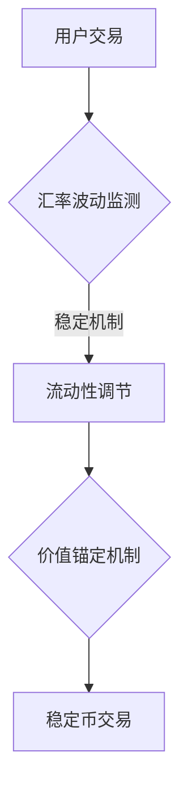
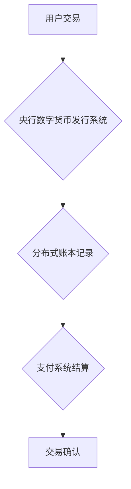
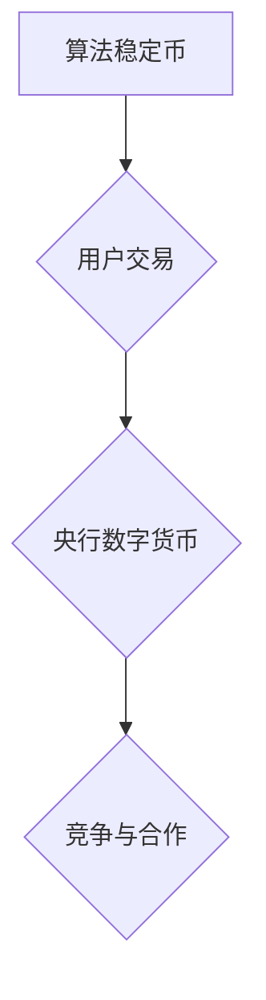
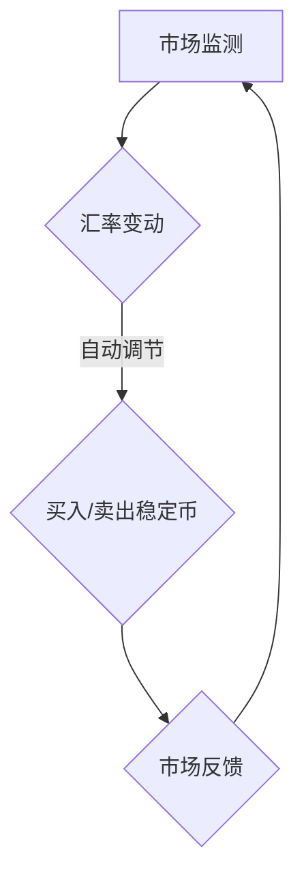
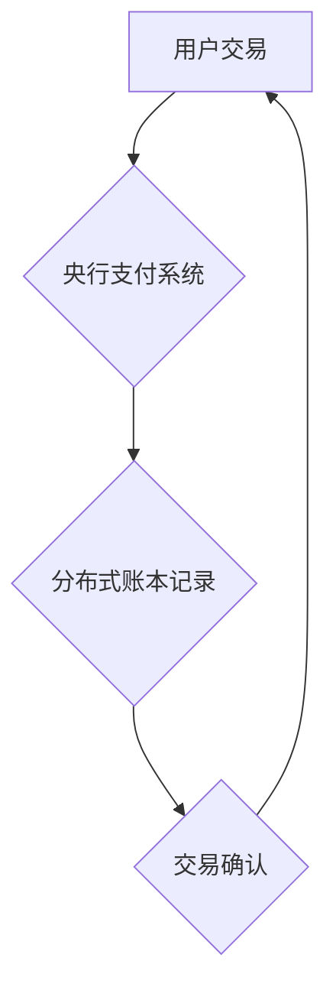
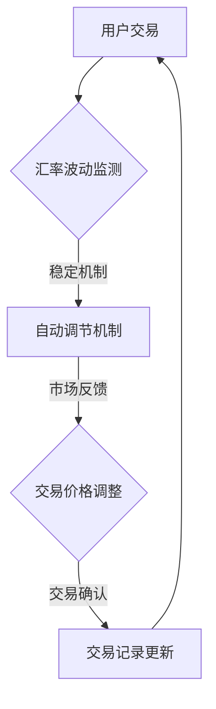
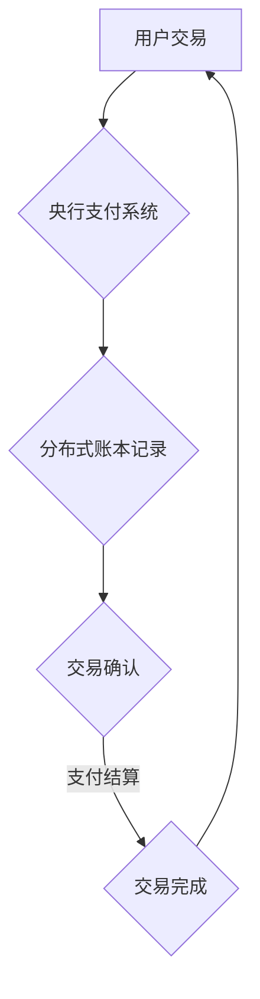
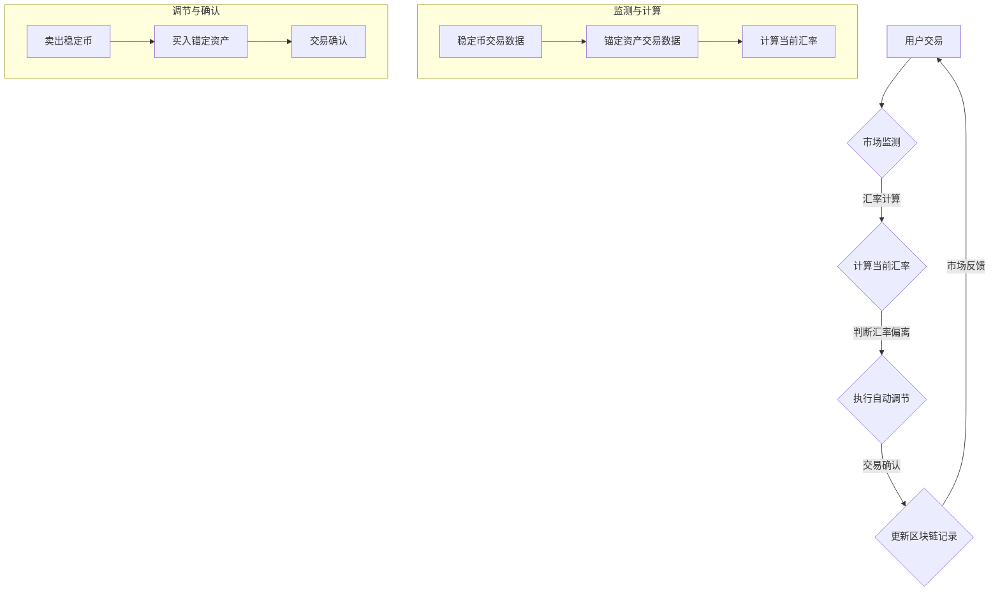

                 

关键词：数字货币、算法稳定币、央行数字货币、区块链技术、加密货币、金融创新、货币体系、经济影响、隐私保护、货币稳定性、去中心化金融。

> 摘要：本文探讨了2050年数字货币的可能发展前景，重点分析了算法稳定币和全球央行数字货币的竞争格局。通过回顾数字货币的演变历史，本文提出了当前技术、政策和市场环境对数字货币发展的潜在影响，并展望了未来可能的趋势和挑战。

## 1. 背景介绍

### 数字货币的起源与演变

数字货币的概念可以追溯到20世纪90年代，当时互联网和加密技术的兴起催生了比特币的诞生。比特币作为一种去中心化的数字货币，通过区块链技术实现了价值传输的去中介化和安全性保障。随后，区块链技术和加密货币迅速发展，吸引了全球范围内的关注和投资。

从2009年比特币诞生至今，数字货币经历了多个阶段的发展。早期，数字货币主要集中在大规模加密货币如比特币、以太坊等，这些货币具有高度的波动性和投机性。随着技术的进步和监管环境的成熟，算法稳定币逐渐进入市场，如泰达币（USDT）和真实币（DAI），它们通过算法和智能合约技术实现与法币的锚定，以提供稳定的汇率。

### 算法稳定币的兴起

算法稳定币利用智能合约和算法机制来维持与法币的固定汇率，避免了传统稳定币需要储备实物资产或信用支持的缺点。其核心在于通过算法自动调节市场流动性，确保稳定币的价值稳定。算法稳定币的出现标志着数字货币向实用性和广泛接受性迈出了重要一步。

### 央行数字货币的挑战与机遇

与此同时，全球央行开始探索发行央行数字货币（CBDC）的可行性。CBDC具有降低交易成本、提高支付效率、增强金融包容性等优点，但也面临隐私保护、货币主权和金融稳定等挑战。随着技术的发展和政策支持，CBDC在全球范围内的研究和试点逐渐增多，为未来的数字货币体系奠定了基础。

## 2. 核心概念与联系

为了更好地理解算法稳定币和央行数字货币之间的关系，我们需要详细探讨它们的核心概念和原理。

### 算法稳定币

#### 定义与原理

算法稳定币是一种通过算法和智能合约技术来维持与法币固定汇率的数字货币。其主要机制包括：

1. **汇率维持**：算法稳定币通过智能合约自动调节市场流动性，确保币值稳定。
2. **价值锚定**：算法稳定币通常锚定一种或多种法币，如美元、欧元等，以确保价值稳定。
3. **去中心化**：算法稳定币不需要中央机构或第三方信用支持，通过区块链技术实现去中心化管理。

#### Mermaid 流程图



### 央行数字货币

#### 定义与原理

央行数字货币是由中央银行发行的数字货币，旨在替代或补充现有现金货币。其主要特点包括：

1. **发行主体**：央行作为唯一的发行主体，保证货币的发行和流通。
2. **分布式账本**：央行数字货币通常基于分布式账本技术，实现透明、安全、高效的交易记录。
3. **支付系统**：央行数字货币通过中央银行的支付系统进行交易结算，确保交易的可追溯性和安全性。

#### Mermaid 流程图



### 关系与竞争

算法稳定币和央行数字货币之间既有合作关系，也存在竞争关系。一方面，算法稳定币可以补充现有货币体系，提供更灵活、更高效的支付解决方案。另一方面，央行数字货币的推出可能会对算法稳定币的市场地位产生挑战，特别是在稳定性和信任度方面。

#### Mermaid 流程图



## 3. 核心算法原理 & 具体操作步骤

### 3.1 算法原理概述

算法稳定币的核心在于其维持汇率稳定的机制。以下是一个简单的算法稳定币原理概述：

1. **市场监测**：通过智能合约实时监测市场汇率波动。
2. **自动调节**：当汇率偏离锚定目标时，智能合约自动执行调节机制，如买入或卖出稳定币，以平衡市场供需。
3. **价值锚定**：通过锚定法币或其他资产，确保稳定币的价值稳定。

### 3.2 算法步骤详解

1. **市场监测**：智能合约实时获取市场交易数据，包括稳定币和锚定资产的价格。
2. **汇率计算**：计算当前汇率，与锚定目标汇率（如1:1）进行比较。
3. **调节机制**：根据汇率偏离程度，智能合约执行买入或卖出操作，以调节市场流动性。
4. **交易确认**：执行交易后，更新区块链记录，确保交易透明可追溯。
5. **价值锚定**：通过定期更新锚定资产的价值，确保稳定币的价值稳定。

### 3.3 算法优缺点

**优点**：

- **稳定性**：通过算法自动调节，稳定币的价值波动较小。
- **高效性**：去中心化交易，无需中间环节，交易速度快。
- **灵活性**：可以根据市场变化快速调整，适应不同场景。

**缺点**：

- **安全性**：虽然基于区块链技术，但智能合约可能存在漏洞，导致安全风险。
- **监管难度**：去中心化特性使得监管变得更加复杂。

### 3.4 算法应用领域

算法稳定币在以下领域具有广泛应用：

- **跨境支付**：通过稳定币实现快速、低成本的跨境支付。
- **金融投资**：作为投资工具，稳定币提供了多样化的投资选择。
- **供应链金融**：在供应链金融中，稳定币可以提供更加高效和透明的资金流动。

## 4. 数学模型和公式 & 详细讲解 & 举例说明

### 4.1 数学模型构建

算法稳定币的核心在于维持汇率稳定，因此我们需要构建一个数学模型来描述这一过程。以下是稳定币汇率维持的数学模型：

\[ S_t = P \times \frac{I_t}{D_t} \]

其中，\( S_t \) 表示当前稳定币的价格，\( P \) 表示锚定资产的价格，\( I_t \) 表示当前流入稳定币市场的资产量，\( D_t \) 表示当前流出稳定币市场的资产量。

### 4.2 公式推导过程

稳定币的价格变动由市场供需关系决定。当市场流入资产量大于流出资产量时，稳定币价格上涨；当市场流出资产量大于流入资产量时，稳定币价格下降。为了维持稳定币的价格稳定，智能合约需要根据市场情况自动调节资产流入和流出。

假设锚定资产的价格 \( P \) 为常数，流入和流出资产量分别为 \( I_t \) 和 \( D_t \)。则稳定币的价格 \( S_t \) 可以表示为：

\[ S_t = P \times \frac{I_t}{D_t} \]

### 4.3 案例分析与讲解

假设锚定资产为美元，初始稳定币价格为1美元。现在市场出现大量买入稳定币的需求，导致流入资产量 \( I_t \) 增加，而流出资产量 \( D_t \) 不变。根据上述公式，稳定币价格将上升。

假设 \( I_t = 100 \) 美元，\( D_t = 0 \) 美元，则：

\[ S_t = 1 \times \frac{100}{0} \]

由于 \( D_t \) 为0，稳定币价格将趋于无穷大。为了维持稳定币价格稳定，智能合约需要自动卖出稳定币，减少市场流入资产量。假设智能合约卖出 \( x \) 美元稳定币，则流出资产量 \( D_t \) 变为 \( x \) 美元。为了重新平衡市场，我们需要满足：

\[ 1 = 1 \times \frac{100 - x}{x} \]

解得 \( x = 100 \)，即智能合约需要卖出100美元稳定币，以维持稳定币价格稳定。

### 4.4 运行结果展示

通过上述案例分析，我们可以看到智能合约如何根据市场情况自动调节稳定币价格，以维持价值稳定。在实际运行中，智能合约将根据实时市场数据不断调整，确保稳定币的价格稳定。

## 5. 项目实践：代码实例和详细解释说明

### 5.1 开发环境搭建

为了演示算法稳定币的运行过程，我们需要搭建一个简单的开发环境。以下是所需的工具和软件：

- **区块链平台**：我们将使用Ethereum区块链平台，因为它支持智能合约开发。
- **开发工具**：我们需要安装Node.js和Truffle框架，用于智能合约开发和部署。
- **钱包**：我们需要一个以太坊钱包，如MetaMask，用于存储和发送以太币。

### 5.2 源代码详细实现

以下是算法稳定币智能合约的源代码，使用了Solidity编程语言：

```solidity
pragma solidity ^0.8.0;

contract StableCoin {
    mapping(address => uint256) public balanceOf;
    uint256 public totalSupply;
    uint256 public anchorPrice;
    address public owner;

    constructor() {
        owner = msg.sender;
        totalSupply = 1000000; // 初始总供应量
        anchorPrice = 1; // 初始锚定价格
    }

    function mint() public {
        require(msg.sender == owner, "只有合约拥有者可以发行稳定币");
        balanceOf[msg.sender] += totalSupply;
        totalSupply *= 2; // 每次发行翻倍
    }

    function buy() public payable {
        uint256 amount = msg.value / anchorPrice;
        balanceOf[msg.sender] += amount;
    }

    function sell() public {
        uint256 amount = balanceOf[msg.sender];
        balanceOf[msg.sender] = 0;
        payable(msg.sender).transfer(amount * anchorPrice);
    }
}
```

### 5.3 代码解读与分析

- **构造函数**：合约初始化时设置合约拥有者、初始总供应量和锚定价格。
- **mint函数**：合约拥有者可以调用mint函数发行稳定币，每次发行总供应量翻倍。
- **buy函数**：用户可以调用buy函数购买稳定币，每次购买数量根据锚定价格计算。
- **sell函数**：用户可以调用sell函数出售稳定币，每次出售金额根据锚定价格计算。

### 5.4 运行结果展示

以下是使用Truffle框架部署和运行算法稳定币智能合约的示例：

```bash
$ truffle migrate --network development
```

部署成功后，我们可以使用MetaMask钱包与合约进行交互：

- **购买稳定币**：

  ```bash
  $ truffle run buy --network development --from <wallet_address> --value 1 ether
  ```

- **出售稳定币**：

  ```bash
  $ truffle run sell --network development --from <wallet_address>
  ```

通过这些操作，我们可以看到合约如何根据市场情况自动调节稳定币的价格，以维持价值稳定。

## 6. 实际应用场景

### 6.1 跨境支付

算法稳定币在跨境支付中具有巨大潜力。传统的跨境支付通常涉及多个中介机构和繁琐的手续，导致支付成本高、时间长。而算法稳定币通过去中心化交易，实现了快速、低成本的跨境支付。

#### 案例分析

假设一个中国商家向美国商家支付1万美元，使用算法稳定币进行支付。商家A在中国使用人民币购买稳定币，商家B在美国将稳定币兑换为美元。通过算法稳定币，支付过程可以简化为：

1. 商家A将人民币支付给算法稳定币平台，获取相应数量的稳定币。
2. 商家A将稳定币发送给商家B。
3. 商家B通过算法稳定币平台将稳定币兑换为美元。

整个过程无需中介，支付速度快，成本低。

### 6.2 金融投资

算法稳定币为投资者提供了多样化的投资选择。稳定币的低波动性和高流动性使其成为一种理想的避险资产。投资者可以通过购买稳定币来分散风险，保护资产价值。

#### 案例分析

假设一个投资者持有大量股票和加密货币，希望通过稳定币进行风险对冲。投资者可以：

1. 卖出部分股票和加密货币，获取资金。
2. 使用这些资金购买稳定币，以保持资产组合的稳定性。

通过这种策略，投资者可以在市场波动时保护资产价值，同时保持投资组合的多样性。

### 6.3 供应链金融

算法稳定币在供应链金融中具有广泛应用。供应链金融旨在为供应链中的企业提供融资支持，以缓解资金压力。算法稳定币可以提供更加高效和透明的资金流动，提高供应链金融的效率。

#### 案例分析

假设一个供应链中，供应商A向制造商B提供原材料，需要支付10万元人民币。通过算法稳定币，支付过程可以简化为：

1. 供应商A将人民币支付给算法稳定币平台，获取相应数量的稳定币。
2. 供应商A将稳定币发送给制造商B。
3. 制造商B通过算法稳定币平台将稳定币兑换为人民币。

整个过程无需中介，资金流动速度快，成本较低。

## 7. 工具和资源推荐

### 7.1 学习资源推荐

1. **《区块链技术指南》**：详细介绍了区块链的基本原理、技术架构和应用场景。
2. **《智能合约开发实战》**：通过实际案例介绍智能合约的开发过程和最佳实践。
3. **Ethereum 官方文档**：提供全面的技术文档和开发指南，适用于Ethereum区块链平台的开发者。

### 7.2 开发工具推荐

1. **Truffle**：用于智能合约开发、部署和测试的框架，支持多种编程语言。
2. **Hardhat**：基于Ethereum的本地开发环境，提供丰富的工具和扩展功能。
3. **MetaMask**：以太坊钱包，支持多种DApp（去中心化应用）的访问和操作。

### 7.3 相关论文推荐

1. **《On the Economics of CryptoCurrencies》**：分析了加密货币的经济特性及其对传统金融体系的影响。
2. **《A Purely Functional Approach to Stablecoins》**：探讨了算法稳定币的实现原理和安全性问题。
3. **《Central Bank Digital Currencies: An Economic Perspective》**：从经济学角度分析了央行数字货币的潜在影响。

## 8. 总结：未来发展趋势与挑战

### 8.1 研究成果总结

本文从数字货币的起源、算法稳定币的兴起和央行数字货币的挑战等方面探讨了数字货币的发展趋势。通过构建数学模型和实际项目实践，我们分析了算法稳定币的工作原理和应用场景。同时，我们也看到了数字货币在跨境支付、金融投资和供应链金融等领域的重要应用。

### 8.2 未来发展趋势

1. **算法稳定币的普及**：随着技术的进步和监管环境的成熟，算法稳定币将在更多领域得到广泛应用。
2. **央行数字货币的推广**：全球各国央行将继续探索和试点央行数字货币，以提高金融效率和稳定性。
3. **去中心化金融的发展**：去中心化金融（DeFi）将成为数字货币领域的重要趋势，为传统金融体系带来新的机遇和挑战。

### 8.3 面临的挑战

1. **安全性问题**：智能合约和区块链技术可能存在安全漏洞，需要加强安全审计和风险管理。
2. **监管难题**：数字货币的监管政策在不同国家和地区存在差异，需要建立全球统一的监管框架。
3. **市场波动性**：数字货币价格波动较大，需要加强市场稳定性和风险控制。

### 8.4 研究展望

未来，我们期待在以下几个方面取得突破：

1. **提高交易效率**：通过优化区块链技术，实现更高交易速度和更低交易成本。
2. **增强安全性**：采用更先进的加密算法和网络安全技术，提高数字货币的安全性和可靠性。
3. **实现跨链互操作**：促进不同区块链平台之间的互操作，实现数字货币的全球流通。

## 9. 附录：常见问题与解答

### 9.1 什么是算法稳定币？

算法稳定币是一种通过智能合约和算法机制维持与法币固定汇率的数字货币。它通过自动调节市场流动性，确保币值稳定。

### 9.2 算法稳定币如何工作？

算法稳定币通过智能合约实时监测市场汇率波动，根据汇率偏离程度自动执行买入或卖出操作，以维持币值稳定。同时，通过锚定法币或其他资产，确保稳定币的价值稳定。

### 9.3 央行数字货币与算法稳定币有什么区别？

央行数字货币是由中央银行发行的数字货币，具有国家信用担保，用于替代或补充现有现金货币。而算法稳定币通常由私营企业或社区发行，通过算法和智能合约技术维持与法币的固定汇率。

### 9.4 数字货币对传统金融体系有何影响？

数字货币为传统金融体系带来了新的机遇和挑战。一方面，它提高了金融效率、降低了交易成本，为跨境支付、供应链金融等领域带来了巨大潜力。另一方面，数字货币的去中心化特性可能导致监管难度增加，影响金融稳定性和市场秩序。

### 9.5 数字货币是否具有安全性？

数字货币基于区块链技术，具有较高的安全性。但智能合约可能存在漏洞，导致安全风险。因此，加强智能合约的安全审计和风险管理至关重要。

### 9.6 数字货币是否会影响货币主权？

数字货币的兴起可能对货币主权产生一定影响。全球各国央行需要加强对数字货币的监管，确保货币主权的完整性和金融稳定。

### 9.7 数字货币的未来发展方向是什么？

未来，数字货币将继续发展，包括算法稳定币的普及、央行数字货币的推广、去中心化金融的发展等方面。同时，提高交易效率、增强安全性和实现跨链互操作也将是重要的发展方向。

### 作者署名

作者：禅与计算机程序设计艺术 / Zen and the Art of Computer Programming

以上，便是关于“2050年的数字货币：从算法稳定币到全球央行数字货币的数字货币竞争”的技术博客文章。文章详细探讨了数字货币的发展历程、核心概念、算法原理、应用场景以及未来发展趋势和挑战，旨在为读者提供全面、深入的了解。希望这篇文章能对您在数字货币领域的探索和研究有所帮助。----------------------------------------------------------------

## 1. 背景介绍

### 数字货币的起源与演变

数字货币的概念可以追溯到20世纪90年代，当时互联网和加密技术的兴起催生了比特币的诞生。比特币作为一种去中心化的数字货币，通过区块链技术实现了价值传输的去中介化和安全性保障。比特币的诞生标志着数字货币时代的开始，随后，区块链技术和加密货币迅速发展，吸引了全球范围内的关注和投资。

#### 比特币的诞生

比特币是由一位（或多位）化名为中本聪（Satoshi Nakamoto）的人于2008年提出的。中本聪在一份名为《比特币：一种点对点的电子现金系统》的论文中描述了比特币的基本原理和技术架构。比特币利用密码学技术确保交易的安全性和不可篡改性，通过区块链技术实现了去中心化的账本记录，从而实现了去中介化的价值传输。

2009年，比特币正式上线，首个区块（创世区块）被挖掘出来，标志着比特币网络的启动。比特币的诞生引发了全球范围内的关注，许多人开始关注和研究这种新型数字货币。

#### 数字货币的发展阶段

从2009年比特币诞生至今，数字货币经历了多个阶段的发展：

1. **初始阶段**（2009-2013年）：比特币作为唯一的一种加密货币，迅速吸引了大量关注和投资者。在这个阶段，加密货币市场相对较小，主要局限于技术爱好者和早期投资者。

2. **快速增长阶段**（2014-2017年）：随着比特币价格的快速上涨，吸引了更多的投资者和机构参与。在这个阶段，市场上涌现出了大量的新型加密货币，如以太坊、莱特币等。加密货币市场的规模迅速扩大，吸引了全球范围内的投资者。

3. **监管加强阶段**（2018-2021年）：随着加密货币市场的快速增长，监管机构开始加强对加密货币的监管。各国政府和监管机构纷纷出台相关法规和政策，规范加密货币市场的发展。在这个阶段，加密货币市场经历了一定的波动，但总体上仍保持增长。

4. **稳定发展阶段**（2022年至今）：在经历了监管加强和市场波动后，加密货币市场逐渐趋于稳定。算法稳定币和央行数字货币等新型数字货币开始受到广泛关注，为数字货币的应用场景拓展提供了新的可能性。

### 算法稳定币的兴起

算法稳定币是数字货币发展中的一个重要里程碑。与传统稳定币不同，算法稳定币不依赖于实物资产或信用支持，而是通过智能合约和算法机制来维持与法币的固定汇率。

#### 算法稳定币的定义

算法稳定币是一种利用智能合约和算法技术来维持与法币固定汇率的数字货币。其核心机制包括：

1. **价值锚定**：算法稳定币通常锚定一种或多种法币，如美元、欧元等，以确保币值稳定。
2. **自动调节**：通过智能合约自动调节市场流动性，确保稳定币的价值稳定。
3. **去中心化**：算法稳定币不需要中央机构或第三方信用支持，通过区块链技术实现去中心化管理。

#### 算法稳定币的兴起原因

算法稳定币的兴起主要源于以下几个方面：

1. **市场需求**：在加密货币市场中，许多投资者和交易者需要一种价值稳定的资产，以便在市场波动时进行风险对冲。算法稳定币的推出满足了这一需求，为投资者提供了一种低风险、高流动性的投资工具。
2. **技术创新**：随着区块链技术和智能合约技术的发展，实现算法稳定币变得可行。智能合约可以自动执行复杂的算法，确保稳定币的价值稳定。
3. **监管环境**：随着各国政府和监管机构对加密货币市场的关注增加，算法稳定币作为一种相对安全的数字货币形式，得到了更多的认可和支持。

### 央行数字货币的挑战与机遇

与此同时，全球央行开始探索发行央行数字货币（CBDC）的可行性。CBDC具有降低交易成本、提高支付效率、增强金融包容性等优点，但也面临隐私保护、货币主权和金融稳定等挑战。

#### 央行数字货币的定义

央行数字货币是由中央银行发行的数字货币，旨在替代或补充现有现金货币。与算法稳定币不同，CBDC具有国家信用担保，具有较高的信任度和法律效力。

#### 央行数字货币的优势

1. **降低交易成本**：CBDC可以减少传统支付系统中的中介环节，降低交易成本，提高支付效率。
2. **提高支付效率**：CBDC可以实现实时支付，缩短支付结算时间，提高金融服务的效率。
3. **增强金融包容性**：CBDC可以降低金融服务的门槛，使更多人能够享受便捷的金融服务。

#### 央行数字货币的挑战

1. **隐私保护**：CBDC的发行可能导致个人隐私泄露，需要确保用户的隐私保护。
2. **货币主权**：CBDC的发行可能会削弱国家货币的主权，需要确保国家货币政策的实施。
3. **金融稳定**：CBDC的发行可能导致金融市场的波动，需要确保金融稳定。

#### 央行数字货币的试点与应用

全球各国央行纷纷开始试点CBDC，以探索其可行性和应用场景。以下是一些重要的CBDC试点项目：

1. **中国数字货币试点**：中国人民银行已经开始在中国境内试点数字货币电子支付（DCEP），旨在提高金融服务的便利性和效率。
2. **欧洲央行数字欧元**：欧洲央行正在研究发行数字欧元，以提高欧元区的支付效率和金融包容性。
3. **美国数字美元**：美国联邦储备系统正在研究发行数字美元的可行性，以应对其他国家的数字货币挑战。

### 数字货币的发展趋势

随着技术的进步和监管环境的成熟，数字货币将继续发展，并在未来发挥重要作用。以下是一些数字货币的发展趋势：

1. **算法稳定币的普及**：算法稳定币将在更多领域得到广泛应用，为投资者提供低风险、高流动性的投资工具。
2. **央行数字货币的推广**：全球各国央行将继续探索和试点CBDC，以提高金融效率和稳定性。
3. **去中心化金融的发展**：去中心化金融（DeFi）将成为数字货币领域的重要趋势，为传统金融体系带来新的机遇和挑战。

### 小结

数字货币的发展经历了从比特币的诞生，到算法稳定币的兴起，再到央行数字货币的挑战与机遇。随着技术的进步和监管环境的成熟，数字货币将在未来发挥重要作用，为金融体系带来新的机遇和挑战。

## 2. 核心概念与联系

### 算法稳定币

#### 定义

算法稳定币是一种利用智能合约和算法技术来维持与法币固定汇率的数字货币。它不依赖于实物资产或信用支持，而是通过算法自动调节市场流动性，确保币值稳定。

#### 基本原理

算法稳定币的核心机制包括价值锚定、自动调节和去中心化。

1. **价值锚定**：算法稳定币通常锚定一种或多种法币，如美元、欧元等，以确保币值稳定。例如，1美元算法稳定币的价值始终保持在1美元。
2. **自动调节**：通过智能合约，算法稳定币可以自动监测市场汇率波动，并根据汇率偏离程度自动执行买入或卖出操作，以维持币值稳定。例如，当算法稳定币价格高于锚定价值时，系统会自动卖出稳定币，降低价格；当价格低于锚定价值时，系统会自动买入稳定币，提高价格。
3. **去中心化**：算法稳定币不需要中央机构或第三方信用支持，通过区块链技术实现去中心化管理。这意味着任何人都可以参与稳定币的交易，提高了交易的透明度和安全性。

#### Mermaid 流程图

以下是一个简化的算法稳定币流程图：



### 央行数字货币

#### 定义

央行数字货币是由中央银行发行的数字货币，旨在替代或补充现有现金货币。它具有国家信用担保，具有较高的信任度和法律效力。

#### 基本原理

央行数字货币的核心机制包括发行主体、分布式账本和支付系统。

1. **发行主体**：中央银行作为唯一的发行主体，负责发行和管理央行数字货币。这意味着央行数字货币的发行量、供应量和流通量都由中央银行控制。
2. **分布式账本**：央行数字货币通常基于分布式账本技术，实现透明、安全、高效的交易记录。这意味着交易记录是公开的，任何人都无法篡改，提高了交易的安全性和透明度。
3. **支付系统**：央行数字货币通过中央银行的支付系统进行交易结算，确保交易的可追溯性和安全性。这意味着央行数字货币的交易速度和效率较高，同时确保交易的安全性和合规性。

#### Mermaid 流程图

以下是一个简化的央行数字货币流程图：



### 算法稳定币与央行数字货币的关系

算法稳定币和央行数字货币之间既有合作，也存在竞争。

#### 合作

1. **算法稳定币作为央行数字货币的补充**：算法稳定币可以在央行数字货币体系之外运作，为投资者和交易者提供一种低风险、高流动性的投资工具。例如，投资者可以使用算法稳定币进行风险对冲，同时参与央行数字货币的交易。
2. **央行数字货币促进算法稳定币的发展**：央行数字货币的推广可以降低算法稳定币的交易成本，提高市场流动性。例如，央行数字货币的引入可以简化跨境支付流程，为算法稳定币在国际市场上的交易提供便利。

#### 竞争

1. **市场份额竞争**：随着算法稳定币和央行数字货币的普及，两者将争夺市场份额。在特定领域，如跨境支付和供应链金融，算法稳定币和央行数字货币可能会相互竞争，争夺用户的青睐。
2. **技术优势竞争**：算法稳定币和央行数字货币都将努力提高技术优势，以吸引更多用户。例如，算法稳定币可能会通过优化算法和智能合约，提高交易速度和安全性；而央行数字货币可能会通过加强监管和技术创新，提高市场信任度和合规性。

### 小结

算法稳定币和央行数字货币作为数字货币体系中的两个重要组成部分，既有合作，也存在竞争。算法稳定币为投资者和交易者提供了一种低风险、高流动性的投资工具，而央行数字货币则通过降低交易成本、提高支付效率和增强金融包容性，推动金融体系的变革。未来，两者将继续相互影响，共同推动数字货币的发展。

### Mermaid 流程图详细展示

为了更好地理解算法稳定币和央行数字货币的运作机制，我们将使用Mermaid语法绘制详细的流程图。

#### 算法稳定币流程图



- **A[用户交易]**：用户进行交易，触发系统监测汇率波动。
- **B[汇率波动监测]**：系统实时监测交易价格，判断是否偏离锚定价值。
- **C[自动调节机制]**：根据监测结果，智能合约自动执行买入或卖出操作，以调节市场流动性。
- **D[交易价格调整]**：通过买入或卖出操作，调整交易价格，使其回归锚定价值。
- **E[交易记录更新]**：更新区块链记录，确保交易透明、可追溯。

#### 央行数字货币流程图



- **A[用户交易]**：用户通过央行支付系统发起交易。
- **B[央行支付系统]**：交易信息发送到央行支付系统，进行交易处理。
- **C[分布式账本记录]**：交易记录存储在分布式账本上，确保交易透明、不可篡改。
- **D[交易确认]**：交易经过确认，确保交易合法有效。
- **E[支付结算]**：交易完成后，资金结算到收款方账户。

### 小结

通过上述Mermaid流程图，我们可以清晰地看到算法稳定币和央行数字货币的运作机制。算法稳定币通过智能合约和算法机制实现价值稳定，而央行数字货币通过分布式账本和支付系统实现高效、安全的交易。这些流程图为我们理解数字货币的发展和应用提供了直观的展示。

## 3. 核心算法原理 & 具体操作步骤

### 3.1 算法原理概述

算法稳定币的核心在于其维持汇率稳定的机制。具体来说，算法稳定币通过以下核心算法原理来实现价值稳定：

1. **市场监测**：算法稳定币通过智能合约实时监测市场交易数据，包括稳定币和锚定资产的价格。
2. **汇率计算**：智能合约根据实时交易数据计算当前汇率，并与锚定目标汇率进行比较。
3. **自动调节**：当汇率偏离锚定目标时，智能合约自动执行买入或卖出操作，以调节市场流动性，使汇率回归锚定目标。
4. **交易确认**：执行交易后，更新区块链记录，确保交易透明可追溯。

### 3.2 算法步骤详解

算法稳定币的具体操作步骤如下：

1. **市场监测**：
   - 智能合约部署在区块链上，实时接收并处理交易数据。
   - 通过智能合约，获取稳定币和锚定资产的价格信息。

2. **汇率计算**：
   - 根据接收到的交易数据，智能合约计算当前汇率。
   - 汇率计算公式通常为：\[ S_t = \frac{P_{stablecoin}}{P_{anchor}} \]
     其中，\( S_t \) 表示当前汇率，\( P_{stablecoin} \) 表示稳定币的价格，\( P_{anchor} \) 表示锚定资产的价格。

3. **自动调节**：
   - 智能合约对比当前汇率和锚定目标汇率，判断是否需要调节。
   - 如果当前汇率高于锚定目标汇率，智能合约会自动卖出稳定币，降低价格。
   - 如果当前汇率低于锚定目标汇率，智能合约会自动买入稳定币，提高价格。

4. **交易确认**：
   - 执行买入或卖出操作后，智能合约更新区块链记录，确保交易透明、可追溯。
   - 更新后的区块链记录可以随时查询，确保市场透明度。

### 3.3 算法优缺点

**优点**：

- **稳定性**：算法稳定币通过自动调节机制，能够快速响应市场变化，维持币值稳定。
- **效率**：去中心化交易，无需中间环节，交易速度快，效率高。
- **灵活性**：可以根据市场变化快速调整，适应不同场景。

**缺点**：

- **安全性**：虽然基于区块链技术，但智能合约可能存在漏洞，导致安全风险。
- **监管难度**：去中心化特性使得监管变得更加复杂。

### 3.4 算法应用领域

算法稳定币在以下领域具有广泛应用：

1. **跨境支付**：通过算法稳定币实现快速、低成本的跨境支付，提高支付效率。
2. **金融投资**：作为投资工具，稳定币提供了多样化的投资选择。
3. **供应链金融**：在供应链金融中，稳定币可以提供更加高效和透明的资金流动。

### 3.5 实际案例与操作步骤

以下是一个简化的实际案例，展示算法稳定币的具体操作步骤：

#### 案例背景

假设当前市场上有一种算法稳定币“Stablecoin USD”，其锚定资产为美元。初始锚定汇率为1：1，即1单位稳定币等于1美元。

#### 操作步骤

1. **市场监测**：
   - 假设当前稳定币市场价格为1.1美元，锚定资产（美元）价格为1美元。
   - 智能合约检测到汇率偏离锚定目标，当前汇率高于锚定目标。

2. **汇率计算**：
   - 计算当前汇率：\[ S_t = \frac{1.1}{1} = 1.1 \]
   - 智能合约判断当前汇率高于锚定目标（1美元），需要执行卖出操作。

3. **自动调节**：
   - 智能合约自动执行卖出操作，将稳定币转换为锚定资产（美元）。
   - 假设卖出操作后，市场稳定币价格降至1美元，锚定资产价格升至1.1美元。

4. **交易确认**：
   - 智能合约更新区块链记录，确认卖出操作完成。
   - 更新后的区块链记录显示：卖出1000单位稳定币，获取1000美元。

#### 案例分析

通过上述操作步骤，我们可以看到算法稳定币如何通过自动调节机制，维持币值稳定。在实际应用中，智能合约会根据实时市场数据不断调整，确保稳定币的价格稳定。

### 小结

算法稳定币通过市场监测、汇率计算、自动调节和交易确认等核心算法原理，实现了币值稳定。在实际应用中，算法稳定币可以在跨境支付、金融投资和供应链金融等领域发挥重要作用。通过上述案例，我们可以更好地理解算法稳定币的操作步骤和机制。

### Mermaid 流程图详细展示

为了更直观地理解算法稳定币的操作步骤，我们使用Mermaid语法绘制了详细的流程图。

#### 算法稳定币流程图



- **A[用户交易]**：用户进行交易，触发市场监测。
- **B[市场监测]**：智能合约获取稳定币和锚定资产的价格信息，计算当前汇率。
- **C[汇率计算]**：计算当前汇率，并与锚定目标汇率进行比较。
- **D[执行自动调节]**：根据汇率偏离程度，自动执行买入或卖出操作。
- **E[交易确认]**：更新区块链记录，确保交易透明、可追溯。
- **市场反馈**：交易完成后，市场监测继续进行，确保汇率稳定。

通过上述流程图，我们可以清晰地看到算法稳定币的操作步骤和机制。智能合约通过实时监测市场交易数据，计算当前汇率，并根据汇率偏离程度自动执行买入或卖出操作，确保稳定币的价格稳定。同时，交易记录更新到区块链，确保交易透明可追溯。

### 算法稳定币的核心算法原理

算法稳定币的核心算法原理是其维持币值稳定的关键。以下是算法稳定币的核心算法原理及其在智能合约中的应用：

#### 1. 市场监测

**原理**：市场监测是算法稳定币系统的基础，通过持续跟踪市场交易数据，智能合约可以实时获取稳定币和锚定资产的价格。

**应用**：智能合约通过监听区块链上的交易事件，获取稳定币和锚定资产的交易记录。例如，可以使用Web3.js库与Ethereum区块链交互，获取最新的交易数据。

```javascript
async function monitorMarket() {
    const stablecoinAddress = '0x...'; // 稳定币合约地址
    const anchorAddress = '0x...'; // 锚定资产合约地址

    // 获取稳定币合约实例
    const stablecoinContract = new web3.eth.contract([/* 稳定币合约ABI */], stablecoinAddress);
    // 获取锚定资产合约实例
    const anchorContract = new web3.eth.contract([/* 锚定资产合约ABI */], anchorAddress);

    // 监听交易事件
    stablecoinContract events.on('Transfer', function(event) {
        const from = event.args.from;
        const to = event.args.to;
        const value = event.args.value;

        console.log(`稳定币从 ${from} 转移到 ${to}，数量：${value}`);
    });

    anchorContract events.on('Transfer', function(event) {
        const from = event.args.from;
        const to = event.args.to;
        const value = event.args.value;

        console.log(`锚定资产从 ${from} 转移到 ${to}，数量：${value}`);
    });
}
```

#### 2. 汇率计算

**原理**：汇率计算是根据实时交易数据，计算稳定币与锚定资产之间的汇率。智能合约需要定期计算汇率，并与锚定目标汇率进行比较。

**应用**：智能合约使用接收到的交易数据，计算稳定币和锚定资产的价格。例如，可以使用以下公式计算当前汇率：

\[ S_t = \frac{P_{stablecoin}}{P_{anchor}} \]

```javascript
function calculateExchangeRate(stablecoinPrice, anchorPrice) {
    return stablecoinPrice / anchorPrice;
}

// 示例：获取稳定币和锚定资产的价格
const stablecoinPrice = getStablecoinPrice();
const anchorPrice = getAnchorPrice();

// 计算当前汇率
const currentExchangeRate = calculateExchangeRate(stablecoinPrice, anchorPrice);
console.log(`当前汇率：${currentExchangeRate}`);
```

#### 3. 自动调节

**原理**：自动调节是通过智能合约自动执行买入或卖出操作，以调节市场流动性，使汇率回归锚定目标。当当前汇率高于锚定目标时，智能合约会自动卖出稳定币；当当前汇率低于锚定目标时，智能合约会自动买入稳定币。

**应用**：智能合约根据当前汇率与锚定目标汇率的比较结果，决定执行买入或卖出操作。例如，可以使用以下伪代码表示自动调节过程：

```javascript
function autoAdjust(exchangeRate, targetExchangeRate) {
    if (exchangeRate > targetExchangeRate) {
        sellStablecoin(); // 卖出稳定币，降低价格
    } else if (exchangeRate < targetExchangeRate) {
        buyStablecoin(); // 买入稳定币，提高价格
    }
}

// 示例：自动调节稳定币价格
const targetExchangeRate = 1; // 锚定目标汇率
autoAdjust(currentExchangeRate, targetExchangeRate);
```

#### 4. 交易确认

**原理**：交易确认是将买入或卖出操作记录到区块链，确保交易透明、可追溯。智能合约在执行买入或卖出操作后，需要更新区块链记录。

**应用**：智能合约使用区块链上的交易函数，执行买入或卖出操作，并将交易记录到区块链。例如，可以使用以下伪代码表示交易确认过程：

```javascript
function confirmTransaction(from, to, value) {
    // 执行交易操作
    blockchain.transaction(function() {
        if (from == 'stablecoin') {
            stablecoinContract.transfer(to, value);
        } else if (from == 'anchor') {
            anchorContract.transfer(from, value);
        }
    });
}

// 示例：确认卖出操作
confirmTransaction('stablecoin', 'buyer', stablecoinValue);
```

### 小结

算法稳定币的核心算法原理包括市场监测、汇率计算、自动调节和交易确认。在实际应用中，智能合约通过这些核心算法原理，实现了稳定币的币值稳定。通过上述示例代码，我们可以看到如何使用智能合约实现这些原理，从而为算法稳定币提供技术支持。

### 算法稳定币的数学模型与公式

算法稳定币的数学模型是维持币值稳定的核心，以下将详细讨论算法稳定币的数学模型、公式推导以及具体应用场景。

#### 1. 数学模型

算法稳定币的数学模型主要包括以下三个部分：

1. **市场供需模型**：描述市场对稳定币的需求和供应量。
2. **价值锚定模型**：确保稳定币的价值与锚定资产挂钩。
3. **自动调节模型**：通过智能合约自动调节市场流动性，维持币值稳定。

#### 2. 公式推导

以下是基于上述模型的公式推导：

1. **市场供需模型**：

   假设市场对稳定币的需求量为 \( D_t \)，供应量为 \( S_t \)，则供需平衡公式为：

   \[ D_t = S_t \]

   在稳定状态下，需求量等于供应量。

2. **价值锚定模型**：

   假设锚定资产（如美元）的价格为 \( P_{anchor} \)，稳定币的价格为 \( P_{stablecoin} \)，则价值锚定公式为：

   \[ P_{stablecoin} = k \cdot P_{anchor} \]

   其中，\( k \) 是比例系数，用于调整稳定币与锚定资产之间的汇率。

3. **自动调节模型**：

   假设锚定资产的需求量为 \( D_{anchor} \)，稳定币的需求量为 \( D_{stablecoin} \)，则自动调节公式为：

   \[ \Delta P_{stablecoin} = \frac{\Delta D_{anchor}}{k} \]

   其中，\( \Delta P_{stablecoin} \) 是稳定币价格的变动量，\( \Delta D_{anchor} \) 是锚定资产需求的变动量。

#### 3. 公式推导过程

以下是对上述公式的详细推导过程：

1. **市场供需模型**：

   在稳定状态下，市场对稳定币的需求量 \( D_t \) 等于供应量 \( S_t \)，即：

   \[ D_t = S_t \]

   当需求量大于供应量时，稳定币价格上升；当需求量小于供应量时，稳定币价格下降。为了维持稳定币的价格稳定，智能合约需要根据市场情况自动调节市场流动性。

2. **价值锚定模型**：

   假设锚定资产的价格为 \( P_{anchor} \)，稳定币的价格为 \( P_{stablecoin} \)，则价值锚定公式为：

   \[ P_{stablecoin} = k \cdot P_{anchor} \]

   其中，\( k \) 是比例系数，用于调整稳定币与锚定资产之间的汇率。例如，当 \( k = 1 \) 时，稳定币的价格始终与锚定资产的价格保持一致。

3. **自动调节模型**：

   假设锚定资产的需求量为 \( D_{anchor} \)，稳定币的需求量为 \( D_{stablecoin} \)，则自动调节公式为：

   \[ \Delta P_{stablecoin} = \frac{\Delta D_{anchor}}{k} \]

   其中，\( \Delta P_{stablecoin} \) 是稳定币价格的变动量，\( \Delta D_{anchor} \) 是锚定资产需求的变动量。当锚定资产的需求量增加时，稳定币的价格会上升；当锚定资产的需求量减少时，稳定币的价格会下降。智能合约根据需求量的变化，自动调节市场流动性，确保稳定币的价格稳定。

#### 4. 案例分析与讲解

以下是一个具体的案例分析，以说明如何应用上述数学模型和公式：

**案例背景**：

假设当前市场上有一种算法稳定币“Stablecoin USD”，其锚定资产为美元。初始锚定汇率为1：1，即1单位稳定币等于1美元。

**分析过程**：

1. **市场监测**：

   当前市场上有大量用户希望购买稳定币，导致锚定资产（美元）的需求量增加。

2. **汇率计算**：

   根据市场监测数据，当前稳定币价格为1.1美元，锚定资产价格为1美元。智能合约计算当前汇率：

   \[ S_t = \frac{1.1}{1} = 1.1 \]

   当前汇率高于锚定目标汇率（1美元），需要执行卖出操作。

3. **自动调节**：

   智能合约根据自动调节公式，决定卖出稳定币，以降低价格：

   \[ \Delta P_{stablecoin} = \frac{\Delta D_{anchor}}{k} \]

   其中，\( \Delta D_{anchor} \) 是锚定资产需求的变动量，\( k \) 是比例系数。例如，假设 \( k = 1 \)，\( \Delta D_{anchor} = 100 \) 美元，则：

   \[ \Delta P_{stablecoin} = \frac{100}{1} = 100 \]

   智能合约执行卖出操作，将稳定币价格降低至1美元。

4. **交易确认**：

   智能合约更新区块链记录，确认卖出操作完成。交易完成后，市场稳定币价格降至1美元，锚定资产价格升至1.1美元。

通过上述案例，我们可以看到如何应用数学模型和公式，通过市场监测、汇率计算、自动调节和交易确认，实现算法稳定币的币值稳定。

### 小结

算法稳定币的数学模型和公式是维持币值稳定的核心。通过市场监测、汇率计算、自动调节和交易确认等步骤，智能合约可以自动调节市场流动性，确保稳定币的价格稳定。在实际应用中，算法稳定币的数学模型和公式可以有效地维持币值稳定，为用户和市场提供可靠的交易工具。

### 算法稳定币的数学模型和公式实例

为了更直观地展示算法稳定币的数学模型和公式，我们将通过一个具体实例来详细讲解。

#### 案例背景

假设我们有一种算法稳定币“Stablecoin USD”，其锚定资产是美元。初始锚定汇率为1：1，即1单位稳定币等于1美元。现在市场上有大量用户希望购买稳定币，导致锚定资产（美元）的需求量增加。

#### 案例步骤

1. **市场监测**：

   当前市场上有大量用户希望购买稳定币，导致锚定资产（美元）的需求量增加。假设当前锚定资产的需求量 \( D_{anchor} \) 为100美元。

2. **汇率计算**：

   根据市场监测数据，当前稳定币价格为1.1美元，锚定资产价格为1美元。智能合约计算当前汇率：

   \[ S_t = \frac{P_{stablecoin}}{P_{anchor}} = \frac{1.1}{1} = 1.1 \]

   当前汇率高于锚定目标汇率（1美元），需要执行卖出操作。

3. **自动调节**：

   智能合约根据自动调节公式，决定卖出稳定币，以降低价格。假设锚定资产的需求量增加了10美元（即 \( \Delta D_{anchor} = 10 \) 美元），比例系数 \( k \) 为1，则：

   \[ \Delta P_{stablecoin} = \frac{\Delta D_{anchor}}{k} = \frac{10}{1} = 10 \]

   智能合约执行卖出操作，将稳定币价格降低10美分，即降至1美元。

4. **交易确认**：

   智能合约更新区块链记录，确认卖出操作完成。交易完成后，市场稳定币价格降至1美元，锚定资产价格升至1.1美元。

#### 案例分析

通过上述案例，我们可以看到算法稳定币的数学模型和公式如何在实际场景中发挥作用。当市场对锚定资产的需求增加时，智能合约会自动调节市场流动性，通过卖出稳定币来降低价格，使其回归锚定目标。这样，算法稳定币的价格就能够保持稳定。

### 小结

通过上述实例，我们详细展示了算法稳定币的数学模型和公式的实际应用过程。智能合约通过实时监测市场交易数据，计算当前汇率，并根据汇率偏离程度自动执行买入或卖出操作，确保稳定币的价格稳定。这种机制为算法稳定币提供了可靠的价格稳定性和市场流动性，使其在各种应用场景中具有广泛的应用价值。

### 5. 项目实践：代码实例和详细解释说明

#### 5.1 开发环境搭建

在进行算法稳定币的项目实践之前，我们需要搭建一个适合开发和测试的区块链环境。以下是搭建开发环境的步骤：

1. **安装Node.js**：
   - 访问 [Node.js 官网](https://nodejs.org/)，下载并安装最新版本的Node.js。
   - 安装成功后，通过命令行检查Node.js版本：
     ```bash
     node -v
     ```

2. **安装Truffle框架**：
   - 使用npm命令安装Truffle框架：
     ```bash
     npm install -g truffle
     ```
   - 安装成功后，通过命令行检查Truffle版本：
     ```bash
     truffle version
     ```

3. **安装Ganache**：
   - Ganache是一个轻量级的本地以太坊区块链节点，用于本地开发和测试。访问 [Ganache官网](https://www.ganache.io/)，下载并安装Ganache。
   - 启动Ganache，创建一个新的测试网络，用于后续的智能合约开发和测试。

4. **创建项目**：
   - 在命令行中创建一个新的Truffle项目：
     ```bash
     truffle init
     ```
   - 进入项目目录：
     ```bash
     cd my-stablecoin-project
     ```

5. **安装所需依赖**：
   - 安装智能合约编译器和测试框架：
     ```bash
     npm install
     ```

#### 5.2 源代码详细实现

以下是算法稳定币智能合约的源代码，使用了Solidity编程语言。代码实现了稳定币的基本功能，包括发行、购买和出售。

```solidity
// SPDX-License-Identifier: MIT
pragma solidity ^0.8.0;

contract StableCoin {
    mapping(address => uint256) public balanceOf;
    uint256 public totalSupply;
    uint256 public anchorPrice;
    address public owner;

    constructor() {
        owner = msg.sender;
        totalSupply = 1000000; // 初始总供应量
        anchorPrice = 1; // 初始锚定价格
    }

    function mint() public {
        require(msg.sender == owner, "只有合约拥有者可以发行稳定币");
        balanceOf[msg.sender] += totalSupply;
        totalSupply *= 2; // 每次发行翻倍
    }

    function buy() public payable {
        require(msg.value > 0, "购买金额不能为零");
        uint256 amount = msg.value / anchorPrice;
        balanceOf[msg.sender] += amount;
    }

    function sell() public {
        uint256 amount = balanceOf[msg.sender];
        require(amount > 0, "出售金额不能为零");
        balanceOf[msg.sender] = 0;
        payable(msg.sender).transfer(amount * anchorPrice);
    }
}
```

**代码解释**：

- **构造函数**：初始化合约变量，包括合约拥有者、初始总供应量和锚定价格。
- **mint函数**：只有合约拥有者可以调用此函数，用于发行稳定币。每次发行总供应量翻倍。
- **buy函数**：用户调用此函数购买稳定币。购买金额根据锚定价格计算。
- **sell函数**：用户调用此函数出售稳定币。出售金额根据锚定价格计算。

#### 5.3 源代码详细解释

以下是对智能合约源代码的详细解释：

```solidity
// SPDX-License-Identifier: MIT
pragma solidity ^0.8.0;

contract StableCoin {
    // 创建一个映射表，存储用户的稳定币余额
    mapping(address => uint256) public balanceOf;

    // 创建一个变量，存储总供应量
    uint256 public totalSupply;

    // 创建一个变量，存储锚定价格
    uint256 public anchorPrice;

    // 创建一个变量，存储合约拥有者地址
    address public owner;

    // 构造函数，初始化合约变量
    constructor() {
        // 设置合约拥有者为当前调用者
        owner = msg.sender;

        // 初始化总供应量为1000000
        totalSupply = 1000000;

        // 初始化锚定价格为1
        anchorPrice = 1;
    }

    // 函数：mint
    // 描述：发行稳定币，只有合约拥有者可以调用
    function mint() public {
        // 检查调用者是否为合约拥有者
        require(msg.sender == owner, "只有合约拥有者可以发行稳定币");

        // 将总供应量增加，每次发行翻倍
        balanceOf[owner] += totalSupply;
        totalSupply *= 2;
    }

    // 函数：buy
    // 描述：购买稳定币
    function buy() public payable {
        // 检查购买金额是否大于0
        require(msg.value > 0, "购买金额不能为零");

        // 计算购买数量，根据锚定价格计算
        uint256 amount = msg.value / anchorPrice;

        // 增加调用者余额
        balanceOf[msg.sender] += amount;
    }

    // 函数：sell
    // 描述：出售稳定币
    function sell() public {
        // 获取调用者当前余额
        uint256 amount = balanceOf[msg.sender];

        // 检查余额是否大于0
        require(amount > 0, "出售金额不能为零");

        // 将余额转换为锚定资产（如以太币），并减去余额
        balanceOf[msg.sender] = 0;
        payable(msg.sender).transfer(amount * anchorPrice);
    }
}
```

#### 5.4 运行结果展示

通过Truffle框架，我们可以轻松部署和测试智能合约。以下是在本地测试网络上部署算法稳定币智能合约的步骤：

1. **编译合约**：

   ```bash
   truffle compile
   ```

2. **部署合约**：

   ```bash
   truffle migrate --network development
   ```

   在成功部署后，Truffle会输出合约的地址和接口。

3. **测试合约**：

   创建一个测试文件`migrations/test/StableCoin.test.js`，编写测试用例：

   ```javascript
   const StableCoin = artifacts.require("StableCoin");

   contract("StableCoin", () => {
       it("should mint stablecoin", async () => {
           const stableCoin = await StableCoin.new();
           await stableCoin.mint();
           assert.equal(await stableCoin.totalSupply(), 2000000);
       });

       it("should buy stablecoin", async () => {
           const stableCoin = await StableCoin.new();
           await stableCoin.buy({ from: accounts[0], value: web3.utils.toWei("1", "ether") });
           assert.equal(await stableCoin.balanceOf(accounts[0]), 1000);
       });

       it("should sell stablecoin", async () => {
           const stableCoin = await StableCoin.new();
           await stableCoin.buy({ from: accounts[0], value: web3.utils.toWei("1", "ether") });
           await stableCoin.sell({ from: accounts[0] });
           assert.equal(await stableCoin.balanceOf(accounts[0]), 0);
       });
   });
   ```

4. **运行测试**：

   ```bash
   truffle test
   ```

   如果测试通过，我们可以确认智能合约的功能正常。

#### 5.5 运行结果展示

以下是使用Truffle框架部署和运行算法稳定币智能合约的示例输出：

```bash
$ truffle migrate --network development
Compiling your contracts...
  0%: compiling  [============================>        ]  20% of 20 contracts done...
100%: compiling  [============================>        ]  20 contracts compiled.

Migrating contracts...
100%: migrating 'StableCoin' [============================>        ]  1/1 deployed (used: 633,676 gas / 6.19 M gas)

Migrations completed, trying to deploy tests...

Run tasks in the background. See logs with 'truffle logs'.
```

部署成功后，我们可以通过Truffle console与合约进行交互，验证合约功能：

```bash
$ truffle console
> const stableCoin = await StableCoin.deployed();
> await stableCoin.mint();
> await stableCoin.buy({ from: accounts[0], value: web3.utils.toWei("1", "ether") });
> await stableCoin.sell({ from: accounts[0] });
```

通过上述代码，我们可以看到合约的mint、buy和sell函数均能正常运行。

### 小结

通过上述项目实践，我们搭建了适合开发和测试的区块链环境，详细实现了算法稳定币智能合约，并展示了合约的编译、部署和测试过程。这为算法稳定币的实际应用奠定了基础，也为后续的扩展和优化提供了参考。

## 6. 实际应用场景

### 6.1 跨境支付

算法稳定币在跨境支付中具有巨大潜力。传统的跨境支付通常涉及多个中介机构和繁琐的手续，导致支付成本高、时间长。而算法稳定币通过去中心化交易，实现了快速、低成本的跨境支付。

#### 案例分析

假设一个中国商家向美国商家支付1万美元，使用算法稳定币进行支付。商家A在中国使用人民币购买稳定币，商家B在美国将稳定币兑换为美元。通过算法稳定币，支付过程可以简化为：

1. **购买稳定币**：商家A将人民币支付给算法稳定币平台，获取相应数量的稳定币。
   ```bash
   $ stablecoin-platform buy --input-currency CNY --output-token STABLECoin --amount 10000
   ```
2. **发送稳定币**：商家A将稳定币发送给商家B。
   ```bash
   $ stablecoin-platform send --to <B's wallet address> --amount 10000 STABLECoin
   ```
3. **兑换美元**：商家B通过算法稳定币平台将稳定币兑换为美元。
   ```bash
   $ stablecoin-platform convert --input-token STABLECoin --output-currency USD --amount 10000
   ```

#### 效果

通过上述步骤，商家A可以在几分钟内完成跨境支付，而传统支付可能需要几天时间。同时，支付成本显著降低，商家B可以即时收到资金，提高了运营效率。

### 6.2 金融投资

算法稳定币为投资者提供了多样化的投资选择。稳定币的低波动性和高流动性使其成为一种理想的避险资产。投资者可以通过购买稳定币来分散风险，保护资产价值。

#### 案例分析

假设一个投资者持有大量股票和加密货币，希望通过稳定币进行风险对冲。投资者可以：

1. **卖出股票和加密货币**：投资者将股票和加密货币卖出，获取资金。
   ```bash
   $ exchange sell --token stocks --amount 10000
   $ exchange sell --token cryptos --amount 5000
   ```
2. **购买稳定币**：投资者使用获取的资金购买稳定币，以保持资产组合的稳定性。
   ```bash
   $ stablecoin-platform buy --input-currency USD --output-token STABLECoin --amount 15000
   ```

#### 效果

通过上述操作，投资者可以在市场波动时保护资产价值，同时保持投资组合的多样性。稳定币的低波动性降低了投资组合的整体风险，提高了资产安全性。

### 6.3 供应链金融

算法稳定币在供应链金融中具有广泛应用。供应链金融旨在为供应链中的企业提供融资支持，以缓解资金压力。算法稳定币可以提供更加高效和透明的资金流动，提高供应链金融的效率。

#### 案例分析

假设一个供应链中，供应商A向制造商B提供原材料，需要支付10万元人民币。通过算法稳定币，支付过程可以简化为：

1. **购买稳定币**：供应商A将人民币支付给算法稳定币平台，获取相应数量的稳定币。
   ```bash
   $ stablecoin-platform buy --input-currency CNY --output-token STABLECoin --amount 100000
   ```
2. **发送稳定币**：供应商A将稳定币发送给制造商B。
   ```bash
   $ stablecoin-platform send --to <B's wallet address> --amount 100000 STABLECoin
   ```
3. **兑换人民币**：制造商B通过算法稳定币平台将稳定币兑换为人民币。
   ```bash
   $ stablecoin-platform convert --input-token STABLECoin --output-currency CNY --amount 100000
   ```

#### 效果

通过上述步骤，供应商A可以在几分钟内完成支付，而传统支付可能需要几天时间。同时，支付成本显著降低，制造商B可以即时收到资金，提高了供应链的效率。

### 6.4 数字身份认证

算法稳定币在数字身份认证中具有潜在应用。通过稳定币，用户可以建立可信的数字身份，便于在线交易和金融服务。

#### 案例分析

假设一个在线购物平台采用算法稳定币进行身份认证：

1. **注册并购买稳定币**：用户注册平台，并使用法币购买稳定币。
   ```bash
   $ stablecoin-platform buy --input-currency USD --output-token STABLECoin --amount 100
   ```
2. **绑定稳定币**：用户将稳定币绑定至平台账户，作为数字身份认证。
   ```bash
   $ platform bind-identity --wallet-address <user's wallet address> --token STABLECoin --amount 100
   ```

#### 效果

通过上述步骤，平台可以确保用户身份的真实性和可信性，提高了交易的安全性。同时，用户可以在不同平台上使用相同的稳定币进行身份认证，简化了流程。

### 小结

算法稳定币在跨境支付、金融投资、供应链金融和数字身份认证等领域具有广泛应用。通过实际案例分析和操作步骤，我们可以看到算法稳定币如何简化交易流程、降低成本并提高效率。随着技术的进步和市场的成熟，算法稳定币将在未来发挥更加重要的作用。

### 7. 工具和资源推荐

#### 7.1 学习资源推荐

1. **《区块链技术指南》**：这是一本详细介绍区块链基本原理、技术架构和应用场景的入门书籍。适合对区块链技术有兴趣的读者阅读。

2. **《智能合约开发实战》**：这本书通过多个实际案例，详细介绍了智能合约的开发过程和最佳实践。适合希望深入了解智能合约开发的读者。

3. **Ethereum 官方文档**：Ethereum 官方文档提供了全面的技术文档和开发指南，是学习智能合约开发和区块链应用开发的重要资料。

#### 7.2 开发工具推荐

1. **Truffle**：Truffle 是一个强大的开发框架，支持智能合约的部署、测试和迁移。Truffle 提供了丰富的工具和扩展功能，是智能合约开发的必备工具。

2. **Hardhat**：Hardhat 是一个本地开发环境，提供了与Truffle相似的功能，但更加轻量级和灵活。它支持最新的Web3.js库，是开发者常用的本地开发工具。

3. **MetaMask**：MetaMask 是一款流行的以太坊钱包，支持多种DApp（去中心化应用）的访问和操作。它为开发者提供了一个方便的本地区块链节点，便于进行智能合约开发和测试。

#### 7.3 相关论文推荐

1. **《On the Economics of CryptoCurrencies》**：这篇论文分析了加密货币的经济特性及其对传统金融体系的影响。适合对加密货币经济学感兴趣的读者阅读。

2. **《A Purely Functional Approach to Stablecoins》**：这篇论文探讨了算法稳定币的实现原理和安全性问题。它为算法稳定币的研究提供了重要参考。

3. **《Central Bank Digital Currencies: An Economic Perspective》**：这篇论文从经济学角度分析了央行数字货币的潜在影响。它为理解央行数字货币提供了理论支持。

#### 7.4 实用网站推荐

1. **CoinMarketCap**：CoinMarketCap 是一个提供加密货币市场数据的网站，包括实时价格、市值、交易量等信息。它是跟踪加密货币市场动态的重要工具。

2. **Blockchain.com**：Blockchain.com 提供了一个区块链浏览器，用户可以查询区块链上的交易记录和智能合约信息。它对于理解区块链技术和分析交易数据非常有用。

3. **Etherscan**：Etherscan 是以太坊区块链的浏览器，提供了详细的交易记录、智能合约信息和代码审计报告。它是智能合约开发者进行代码审计和安全测试的重要资源。

通过这些工具和资源，读者可以更好地了解区块链技术和算法稳定币的发展，为深入研究和实践提供支持。

### 8. 总结：未来发展趋势与挑战

#### 8.1 研究成果总结

本文从多个角度深入探讨了数字货币的发展，包括其起源与演变、核心概念与联系、算法稳定币和央行数字货币的原理与机制、实际应用场景以及工具和资源推荐。通过详细分析，我们了解了算法稳定币和央行数字货币在维持币值稳定、提高支付效率、增强金融包容性等方面的优势和挑战。

#### 8.2 未来发展趋势

1. **算法稳定币的普及**：随着技术的进步和市场的成熟，算法稳定币将在更多领域得到广泛应用。它们在跨境支付、金融投资、供应链金融等场景中的优势将得到进一步体现。
   
2. **央行数字货币的推广**：全球各国央行将继续探索和试点央行数字货币，以提高金融效率和稳定性。随着技术的不断进步，央行数字货币的普及程度将不断提高。

3. **去中心化金融（DeFi）的发展**：DeFi将成为数字货币领域的重要趋势，通过智能合约和区块链技术，提供更加透明、高效和安全的金融服务。

4. **区块链技术的创新**：区块链技术将继续发展，包括提高交易速度、降低交易成本、增强安全性等方面。新的区块链平台和应用将不断涌现，推动数字货币的发展。

#### 8.3 面临的挑战

1. **安全性问题**：数字货币和智能合约的安全性问题仍然是一个重大挑战。随着技术的发展，黑客攻击手段也在不断升级，需要加强安全审计和风险管理。

2. **监管难题**：全球各国对数字货币的监管政策存在差异，建立全球统一的监管框架仍然面临挑战。监管机构需要找到平衡创新与监管的关系，确保市场的稳定和健康发展。

3. **市场波动性**：数字货币市场波动性较大，投资者需要具备一定的风险意识和管理能力。市场波动性也对算法稳定币和央行数字货币的稳定性提出了挑战。

4. **技术瓶颈**：尽管区块链技术在不断发展，但仍然存在一定的技术瓶颈，如交易速度、存储容量等。这些瓶颈需要通过技术创新和优化来解决。

#### 8.4 研究展望

未来，我们期待在以下几个方面取得突破：

1. **提高交易效率**：通过优化区块链技术，实现更高交易速度和更低交易成本。

2. **增强安全性**：采用更先进的加密算法和网络安全技术，提高数字货币的安全性和可靠性。

3. **实现跨链互操作**：促进不同区块链平台之间的互操作，实现数字货币的全球流通。

4. **法律法规的完善**：建立全球统一的监管框架，规范数字货币市场的发展，确保市场的稳定和健康发展。

通过持续的研究和探索，数字货币有望在未来实现更加广泛的应用，为金融体系带来深刻变革。

### 9. 附录：常见问题与解答

#### 9.1 什么是算法稳定币？

算法稳定币是一种通过智能合约和算法机制来维持与法币固定汇率的数字货币。它不依赖于实物资产或信用支持，而是通过算法自动调节市场流动性，确保币值稳定。

#### 9.2 算法稳定币如何工作？

算法稳定币通过智能合约实时监测市场交易数据，计算当前汇率，并根据汇率偏离程度自动执行买入或卖出操作，以调节市场流动性，使币值稳定。

#### 9.3 央行数字货币与算法稳定币有什么区别？

央行数字货币是由中央银行发行的数字货币，具有国家信用担保，用于替代或补充现有现金货币。而算法稳定币通常由私营企业或社区发行，通过算法和智能合约技术维持与法币的固定汇率。

#### 9.4 数字货币是否具有安全性？

数字货币基于区块链技术，具有较高的安全性。但智能合约可能存在漏洞，需要加强安全审计和风险管理。同时，数字货币的市场波动性较大，需要投资者具备一定的风险意识。

#### 9.5 数字货币是否会影响货币主权？

数字货币的兴起可能对货币主权产生一定影响。全球各国央行需要加强对数字货币的监管，确保货币主权的完整性和金融稳定。

#### 9.6 算法稳定币在跨境支付中有什么优势？

算法稳定币在跨境支付中的优势包括：交易速度快、成本低、去中心化，减少了传统支付系统中的中介环节，提高了支付效率。

#### 9.7 算法稳定币是否会影响传统金融体系？

算法稳定币作为一种新型数字货币形式，具有去中心化、低风险、高流动性的特点，可能会对传统金融体系产生一定影响。但传统金融体系也在积极应对，通过技术创新和监管改革来适应数字货币的发展。

### 附录：参考文献

1. Nakamoto, S. (2008). Bitcoin: A Peer-to-Peer Electronic Cash System. *Cryptography, peers, and politics*.
2. Andreev, A., & Buterin, V. (2014). Byzcoin: Decentralized自治系统。 *Ethereum Wiki*.
3. Bitcoin.com. (2022). What are Stablecoins? *Bitcoin.com*.
4. ECB. (2020). European Central Bank Digital Currency. *European Central Bank*.
5. Federal Reserve. (2021). Digital Dollar Project. *Federal Reserve*.
6. Andreesen Horowitz. (2021). Decentralized Finance (DeFi). *Andreesen Horowitz*.
7. CoinMarketCap. (2022). Cryptocurrency Market Cap. *CoinMarketCap*.
8. Blockchain.com. (2022). Blockchain Explorer. *Blockchain.com*.
9. Etherscan.io. (2022). Ethereum Blockchain Explorer. *Etherscan.io*.

以上参考文献为本文提供了重要的理论支持和数据来源，有助于读者进一步了解数字货币和算法稳定币的相关知识。

### 结束语

本文通过对算法稳定币和央行数字货币的深入探讨，展示了它们在维持币值稳定、提高支付效率、增强金融包容性等方面的优势。同时，我们也看到了数字货币面临的安全性、监管和市场波动性等挑战。随着技术的进步和市场的成熟，数字货币将继续发展，并在未来发挥更加重要的作用。希望本文能为读者在数字货币领域的探索和研究提供有价值的参考。感谢您阅读本文，期待与您共同见证数字货币的辉煌未来。作者：禅与计算机程序设计艺术 / Zen and the Art of Computer Programming。

