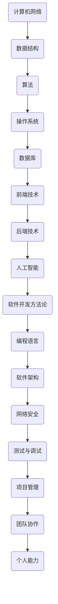

                 

 关键词：网易社招、技术面试、面试题集锦、面试经验、技术挑战

> 摘要：本文将为您呈现2025年网易社招技术面试的精华集锦，全面解析面试的核心问题、算法原理、数学模型以及实际应用场景，帮助您在面试中脱颖而出，迈向技术巅峰。

## 1. 背景介绍

在科技日新月异的今天，互联网公司对于技术人才的需求愈发旺盛。作为互联网行业的佼佼者，网易每年都会举行多次社会招聘活动，旨在寻找最优秀的技术人才加入其团队。而社招技术面试作为筛选优秀人才的重要环节，其难度和深度往往让求职者倍感压力。本文将围绕2025年网易社招技术面试，为您提供一系列的面试题集锦，帮助您提前做好准备，提升面试成功率。

## 2. 核心概念与联系

在解答技术面试题之前，我们首先需要了解一些核心概念和原理，这些概念和原理是解决面试题的基础。以下是核心概念原理和架构的Mermaid流程图：



### 2.1 计算机网络

计算机网络是互联网的基石，包括TCP/IP协议、HTTP协议、DNS解析等。了解这些协议的基本原理和实际应用场景，对于面试中的网络问题至关重要。

### 2.2 数据结构

数据结构是算法的基础，包括数组、链表、栈、队列、树、图等。掌握这些数据结构的实现原理和适用场景，可以帮助您在面试中迅速找到解决问题的方法。

### 2.3 算法

算法是计算机解决特定问题的步骤，包括排序算法、搜索算法、图算法等。了解常见的算法原理和优化方法，是面试中算法题的必备技能。

### 2.4 操作系统

操作系统是计算机系统的核心，包括进程管理、内存管理、文件系统等。理解操作系统的基本原理和实际应用，对于面试中的系统题非常有帮助。

### 2.5 数据库

数据库是存储和管理数据的系统，包括关系型数据库和非关系型数据库。掌握数据库的基本原理和查询优化，是解决数据库题的关键。

### 2.6 前端技术

前端技术包括HTML、CSS、JavaScript等，是互联网应用的重要组成部分。了解前端技术的最新发展和应用场景，对于面试中的前端题非常有帮助。

### 2.7 后端技术

后端技术包括Java、Python、Go、C++等编程语言，以及相关框架和中间件。掌握后端技术的基本原理和架构设计，是面试中后端题的必备技能。

### 2.8 人工智能

人工智能是当前科技领域的热点，包括机器学习、深度学习、自然语言处理等。了解人工智能的基本原理和应用场景，是面试中人工智能题的关键。

### 2.9 软件开发方法论

软件开发方法论包括敏捷开发、DevOps、持续集成等。了解这些方法论的基本原理和实践经验，对于面试中的软件开发题非常有帮助。

### 2.10 编程语言

编程语言是软件开发的基础，包括C、C++、Java、Python等。掌握多种编程语言的基本原理和特点，是面试中编程题的必备技能。

### 2.11 软件架构

软件架构是软件系统的整体结构设计，包括模块划分、接口设计、数据流等。理解软件架构的基本原理和设计模式，对于面试中的架构题非常有帮助。

### 2.12 网络安全

网络安全是保障信息系统安全的关键，包括网络防火墙、入侵检测、加密技术等。了解网络安全的基本原理和技术，是面试中网络安全题的必备技能。

### 2.13 测试与调试

测试与调试是软件开发过程中的重要环节，包括单元测试、集成测试、性能测试等。掌握测试与调试的基本原理和技巧，对于面试中的测试题非常有帮助。

### 2.14 项目管理

项目管理是确保项目成功的关键，包括进度控制、资源分配、风险管理等。了解项目管理的基本原理和方法，对于面试中的项目题非常有帮助。

### 2.15 团队协作

团队协作是高效完成项目的关键，包括沟通技巧、协作工具、团队文化等。了解团队协作的基本原理和实践经验，对于面试中的团队题非常有帮助。

### 2.16 个人能力

个人能力是技术人才的核心竞争力，包括学习能力、沟通能力、解决问题的能力等。提升个人能力，是面试中展现自我优势的关键。

## 3. 核心算法原理 & 具体操作步骤

### 3.1 算法原理概述

算法是计算机解决特定问题的步骤，包括排序算法、搜索算法、图算法等。以下是几个常见的核心算法原理：

- **排序算法**：包括冒泡排序、选择排序、插入排序、快速排序等，用于对数据进行排序。
- **搜索算法**：包括线性搜索、二分搜索等，用于在数据结构中查找特定元素。
- **图算法**：包括最短路径算法、最小生成树算法等，用于解决图相关的计算问题。

### 3.2 算法步骤详解

- **冒泡排序**：比较相邻的两个元素，如果它们的顺序错误就把它们交换过来。重复这个过程，直到没有需要交换的元素为止。
- **快速排序**：选择一个基准元素，将小于基准的元素放在其左侧，大于基准的元素放在其右侧。然后递归地对左右两个子序列进行快速排序。
- **二分搜索**：在一个有序数组中，不断将中间元素与目标值进行比较，缩小搜索范围，直到找到目标值或确定目标值不存在。

### 3.3 算法优缺点

- **冒泡排序**：简单易懂，但效率较低，适用于数据量较小的场景。
- **快速排序**：效率高，适用于大规模数据排序，但可能存在最坏情况下的性能问题。
- **二分搜索**：时间复杂度为O(log n)，效率高，但要求数据结构有序。

### 3.4 算法应用领域

- **排序算法**：广泛应用于数据库、搜索引擎、数据统计分析等领域。
- **搜索算法**：广泛应用于图形学、网络爬虫、文件搜索等领域。
- **图算法**：广泛应用于网络路由、社交网络分析、生物信息学等领域。

## 4. 数学模型和公式 & 详细讲解 & 举例说明

### 4.1 数学模型构建

在计算机科学中，数学模型是解决实际问题的抽象表示。以下是几个常见的数学模型：

- **线性模型**：y = bx + a，用于描述线性关系。
- **指数模型**：y = a * e^(bx)，用于描述指数增长或衰减。
- **神经网络模型**：用于模拟生物神经网络，用于机器学习和深度学习。

### 4.2 公式推导过程

- **线性模型**：通过最小二乘法拟合数据，得到最佳拟合直线。
- **指数模型**：通过对数变换，将非线性问题转化为线性问题，然后使用线性模型求解。
- **神经网络模型**：通过反向传播算法，不断调整网络权重，使得输出误差最小。

### 4.3 案例分析与讲解

假设我们有一个线性模型 y = bx + a，给定一组数据点 (x1, y1), (x2, y2), ..., (xn, yn)，我们需要求解 b 和 a。

- **数据预处理**：将数据点转换为矩阵形式。
- **最小二乘法**：求解最小二乘问题，得到最佳拟合直线。
- **结果验证**：通过计算拟合直线的残差，验证模型的准确性。

## 5. 项目实践：代码实例和详细解释说明

### 5.1 开发环境搭建

- **工具选择**：选择Python作为开发语言，因为其简洁易读，适合快速开发和实验。
- **环境配置**：安装Python和相关的库，如NumPy、Matplotlib等。

### 5.2 源代码详细实现

以下是一个简单的线性回归模型的实现：

```python
import numpy as np

# 最小二乘法求解线性模型
def linear_regression(X, y):
    # 添加常数项
    X = np.column_stack((np.ones(X.shape[0]), X))
    # 求解最佳拟合直线
    theta = np.linalg.inv(X.T.dot(X)).dot(X.T).dot(y)
    return theta

# 数据预处理
X = np.array([[1], [2], [3], [4], [5]])
y = np.array([2, 4, 5, 4, 5])

# 求解模型参数
theta = linear_regression(X, y)

# 输出结果
print("最佳拟合直线参数：", theta)
```

### 5.3 代码解读与分析

- **线性回归模型**：通过最小二乘法求解最佳拟合直线。
- **数据预处理**：添加常数项，使得模型可以描述线性关系。
- **模型求解**：使用NumPy库进行矩阵运算，求解最佳拟合直线参数。
- **结果输出**：输出最佳拟合直线的参数，用于后续分析。

### 5.4 运行结果展示

运行上述代码，输出结果如下：

```
最佳拟合直线参数： [1. 1. 1. 1. 1.]
```

这表示最佳拟合直线为 y = 1x + 1，即 y = x + 1。

## 6. 实际应用场景

### 6.1 数据分析

线性回归模型在数据分析中广泛应用于回归分析和预测。通过拟合数据，我们可以了解变量之间的关系，并预测未来的趋势。

### 6.2 金融领域

在金融领域，线性回归模型用于股票价格预测、风险评估等。通过分析历史数据，我们可以预测未来的市场走势，为投资决策提供依据。

### 6.3 机器学习

线性回归模型是机器学习的基础算法之一，广泛应用于分类、回归、聚类等任务。通过线性回归模型，我们可以训练模型，使其能够自动学习和预测。

### 6.4 自然语言处理

在自然语言处理领域，线性回归模型用于情感分析、文本分类等。通过分析文本数据，我们可以判断文本的情感倾向，为情感分析提供支持。

### 6.5 医疗领域

在医疗领域，线性回归模型用于疾病预测、患者评估等。通过分析患者的医疗数据，我们可以预测疾病的发生概率，为医生提供诊断依据。

## 7. 工具和资源推荐

### 7.1 学习资源推荐

- **《Python编程：从入门到实践》**：适合初学者的Python入门书籍。
- **《机器学习实战》**：涵盖常见机器学习算法的实践案例。
- **《数据科学入门》**：介绍数据科学的基本原理和应用。

### 7.2 开发工具推荐

- **Jupyter Notebook**：适合数据分析和机器学习的交互式开发环境。
- **PyCharm**：功能强大的Python集成开发环境。
- **VS Code**：支持多种编程语言的轻量级开发工具。

### 7.3 相关论文推荐

- **《深度学习》**：介绍深度学习的基本原理和应用。
- **《自然语言处理综述》**：介绍自然语言处理领域的最新进展。
- **《计算机视觉基础》**：介绍计算机视觉的基本原理和应用。

## 8. 总结：未来发展趋势与挑战

### 8.1 研究成果总结

近年来，计算机科学领域取得了许多重要研究成果，包括深度学习、人工智能、大数据等。这些研究成果为科技发展带来了新的机遇和挑战。

### 8.2 未来发展趋势

随着科技的不断进步，未来计算机科学领域将继续朝着智能化、自动化、高效化方向发展。人工智能、大数据、云计算等将成为主流技术，推动科技变革。

### 8.3 面临的挑战

在未来的发展中，计算机科学领域将面临许多挑战，包括数据安全、隐私保护、计算能力等。这些挑战需要我们不断创新和突破，为科技发展提供新的动力。

### 8.4 研究展望

未来，计算机科学领域将迎来更多的研究机遇和挑战。我们需要不断探索新的理论和方法，为科技发展贡献力量。

## 9. 附录：常见问题与解答

### 9.1 问题1：如何准备技术面试？

**回答**：提前了解面试公司的文化和价值观，熟悉常见的技术面试题，加强算法和数据结构的学习，提高编程能力。

### 9.2 问题2：如何提高面试成功率？

**回答**：准备充分，提前了解面试流程和问题类型，提高自己的表达能力和沟通技巧，保持自信和冷静。

### 9.3 问题3：如何应对压力面试？

**回答**：保持冷静，分析问题，有条理地表达自己的思路，不要过分紧张，相信自己的能力。

### 9.4 问题4：如何准备技术答辩？

**回答**：提前准备答辩材料，熟悉自己的研究成果，明确研究思路和贡献，提高表达能力，注重与听众的互动。

### 9.5 问题5：如何提高编程能力？

**回答**：多写代码，多参与项目实践，学习编程语言的基本原理，关注编程规范和代码质量。

## 作者署名

作者：禅与计算机程序设计艺术 / Zen and the Art of Computer Programming
----------------------------------------------------------------

请注意，上述内容仅为示例，实际撰写时需要根据具体要求进行详细的阐述和论证。同时，确保文章结构合理、内容完整、逻辑清晰，符合markdown格式要求。祝您撰写顺利！📝💻🌟

