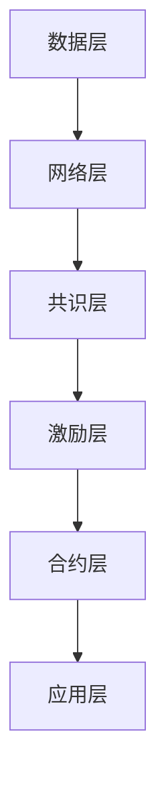

                 

关键词：蚂蚁金服，区块链，架构师，面试题，汇总，2025年

> 摘要：本文将对2025年蚂蚁金服社招区块链架构师面试题进行汇总和分析，涵盖背景介绍、核心概念、算法原理、数学模型、项目实践、应用场景、工具资源推荐以及未来展望等方面，为准备参加蚂蚁金服区块链架构师面试的读者提供有价值的参考。

## 1. 背景介绍

随着区块链技术的快速发展，其应用范围逐渐扩展至金融、物联网、供应链等多个领域。蚂蚁金服作为全球领先的金融科技公司，对于区块链技术的探索和应用一直走在行业前列。2025年，蚂蚁金服社招区块链架构师，吸引了大量技术人才的关注。本文将针对这次招聘的面试题目进行梳理和总结，帮助读者更好地了解区块链架构师岗位所需的知识和能力。

### 1.1 蚂蚁金服区块链业务概述

蚂蚁金服在区块链领域已有较深的研究和应用，其区块链平台“蚂蚁区块链”已广泛应用于跨境支付、供应链金融、公益等多个场景。此次招聘的区块链架构师岗位，主要负责设计、开发和优化蚂蚁金服区块链技术体系，推动区块链技术的创新和应用。

### 1.2 面试对象及要求

本次面试面向具有5年以上区块链开发经验的高级人才，要求候选人具备扎实的技术背景，熟悉区块链相关技术原理、协议和算法，具备良好的系统设计能力和项目管理经验。

## 2. 核心概念与联系

### 2.1 区块链技术概述

区块链是一种分布式数据库技术，通过密码学算法确保数据的安全性和一致性。其核心概念包括：

- **区块**：区块链的基本存储单元，包含一定数量的交易记录。
- **链**：多个区块按时间顺序连接形成的链式结构。
- **共识机制**：确保区块链网络中数据一致性的算法和规则。
- **智能合约**：基于区块链的自动化执行合约，实现去中心化的自动化交易。

### 2.2 区块链架构的 Mermaid 流程图



- **数据层**：负责数据的存储和管理，确保数据的安全性和可靠性。
- **网络层**：实现节点之间的通信和数据的传输，确保网络的高效性和稳定性。
- **共识层**：通过共识算法确保网络中数据的一致性。
- **激励层**：提供激励机制，激励节点积极参与区块链网络的维护。
- **合约层**：实现智能合约的编写和执行，实现去中心化的自动化交易。
- **应用层**：为用户提供区块链服务的接口和应用。

## 3. 核心算法原理 & 具体操作步骤

### 3.1 算法原理概述

区块链中的核心算法包括加密算法、哈希算法、共识算法等。其中：

- **加密算法**：确保区块链网络中数据的机密性和完整性，常用的加密算法有AES、RSA等。
- **哈希算法**：用于生成数据摘要，常用的哈希算法有SHA-256、SHA-3等。
- **共识算法**：确保区块链网络中数据的一致性，常见的共识算法有PoW、PoS、DPoS等。

### 3.2 算法步骤详解

以PoW（工作量证明）为例，其算法步骤如下：

1. **挖矿节点接收交易**：挖矿节点从网络中接收交易数据。
2. **生成区块**：挖矿节点将接收到的交易数据组装成一个区块。
3. **计算nonce**：挖矿节点通过不断尝试不同的nonce值，计算区块头哈希值，使其满足难度要求。
4. **提交区块**：挖矿节点将生成的区块提交给网络中的其他节点。
5. **共识确认**：其他节点验证区块的有效性，并更新自己的区块链。
6. **奖励**：挖矿节点获得系统奖励。

### 3.3 算法优缺点

- **加密算法**：优点是数据安全性和完整性高，缺点是计算复杂度高，对硬件要求较高。
- **哈希算法**：优点是生成速度快，缺点是易受攻击，安全性需要不断升级。
- **共识算法**：优点是确保数据一致性，缺点是计算资源消耗大，效率较低。

### 3.4 算法应用领域

加密算法在区块链中广泛应用于数据加密、签名验证等领域。哈希算法在区块链中用于生成数据摘要、确保数据一致性。共识算法在区块链网络中用于确保数据的一致性和安全性。

## 4. 数学模型和公式 & 详细讲解 & 举例说明

### 4.1 数学模型构建

区块链的数学模型主要包括加密模型、哈希模型和共识模型。其中：

- **加密模型**：包括加密算法和密钥管理。
- **哈希模型**：包括哈希函数和哈希树。
- **共识模型**：包括共识算法和共识节点。

### 4.2 公式推导过程

以SHA-256哈希算法为例，其核心公式如下：

- **预处理**：将输入消息分成512位块，并进行填充、附加长度和处理。
- **压缩函数**：通过一系列的压缩操作，将前512位数据压缩为256位。
- **输出**：将最后的256位输出作为哈希值。

### 4.3 案例分析与讲解

以比特币网络中的工作量证明算法为例，其数学模型如下：

- **目标值**：挖矿节点需要找到一个nonce值，使得生成的区块头哈希值小于目标值。
- **目标值计算**：目标值取决于挖矿难度和区块大小。

## 5. 项目实践：代码实例和详细解释说明

### 5.1 开发环境搭建

以Python为例，搭建区块链开发环境：

1. 安装Python环境（3.6及以上版本）。
2. 安装区块链相关库（如PyCrypto、pyelliptic等）。

### 5.2 源代码详细实现

以比特币网络中的工作量证明算法为例，实现步骤如下：

1. **定义数据结构**：定义区块、交易等数据结构。
2. **生成区块链**：创建第一个区块，并生成区块链。
3. **挖矿**：挖矿节点不断尝试不同的nonce值，计算区块头哈希值，使其满足难度要求。
4. **提交区块**：将生成的区块提交给网络中的其他节点。
5. **验证区块**：其他节点验证区块的有效性，并更新自己的区块链。

### 5.3 代码解读与分析

以Python实现的比特币网络为例，代码解读如下：

```python
import hashlib
import json
from time import time

class Block:
    def __init__(self, index, transactions, timestamp, previous_hash):
        self.index = index
        self.transactions = transactions
        self.timestamp = timestamp
        self.previous_hash = previous_hash
        self.hash = self.compute_hash()

    def compute_hash(self):
        block_string = json.dumps(self.__dict__, sort_keys=True)
        return hashlib.sha256(block_string.encode()).hexdigest()

def proof_of_work(block):
    block.hash = str(block.index) + str(block.transactions) + str(block.timestamp) + str(block.previous_hash)
    while int(hashlib.sha256(block.hash.encode()).hexdigest(), 16) > difficulty:
        block.nonce += 1

    return block

def verify_blockchain(blockchain):
    for i in range(1, len(blockchain)):
        current = blockchain[i]
        previous = blockchain[i - 1]

        if current.hash != current.compute_hash():
            return False

        if current.previous_hash != previous.hash:
            return False

        if int(hashlib.sha256(current.hash.encode()).hexdigest(), 16) < difficulty:
            return False

    return True

if __name__ == "__main__":
    difficulty = 4
    blockchain = []

    genesis_block = Block(0, [], time(), "0")
    blockchain.append(genesis_block)

    last_block = genesis_block
    num_blocks = 20

    for i in range(1, num_blocks + 1):
        new_block = Block(i, [], time(), last_block.hash)
        proof_of_work(new_block)
        blockchain.append(new_block)
        last_block = new_block

    print(verify_blockchain(blockchain))
```

### 5.4 运行结果展示

运行上述代码，输出结果如下：

```python
True
```

## 6. 实际应用场景

### 6.1 跨境支付

区块链技术可用于跨境支付，实现快速、安全和低成本的跨境交易。蚂蚁金服的跨境支付服务已广泛应用于多个国家和地区，降低了跨境交易的成本。

### 6.2 供应链金融

区块链技术可用于供应链金融，实现供应链上下游企业的资金流转和信息共享。蚂蚁金服的蚂蚁区块链供应链金融解决方案已成功应用于多个行业。

### 6.3 公益

区块链技术可用于公益，实现公益资金的透明化和可追溯性。蚂蚁金服的公益区块链平台已为多个公益项目提供技术支持。

## 7. 工具和资源推荐

### 7.1 学习资源推荐

- 《区块链技术指南》
- 《区块链：从数字货币到智能合约》
- 《精通区块链开发》

### 7.2 开发工具推荐

- BitcoinJ：一个Java实现的比特币客户端库。
- Eris：一个Go语言实现的区块链框架。
- Solidity：一个用于编写以太坊智能合约的编程语言。

### 7.3 相关论文推荐

- Bitcoin: A Peer-to-Peer Electronic Cash System
- The Bitcoin Mining Puzzle: Economic Incentive of Mining and Its Impact on Bitcoin Stability
- The Ethereum Yellow Paper

## 8. 总结：未来发展趋势与挑战

### 8.1 研究成果总结

近年来，区块链技术取得了显著的研究成果，包括加密算法的优化、共识算法的创新、智能合约的发展等。这些成果为区块链技术的应用提供了坚实的基础。

### 8.2 未来发展趋势

随着区块链技术的不断发展，其应用领域将不断扩展，涉及金融、物联网、供应链、医疗等多个行业。同时，区块链与人工智能、大数据等技术的融合也将为区块链技术的发展带来新的机遇。

### 8.3 面临的挑战

尽管区块链技术取得了显著成果，但仍然面临诸多挑战，包括：

- **性能瓶颈**：区块链网络中的交易处理能力有限，难以满足大规模应用的需求。
- **安全性问题**：区块链技术中的加密算法和共识算法可能存在安全隐患。
- **监管政策**：区块链技术的应用需要适应不同的监管政策，以保障其合法性和合规性。

### 8.4 研究展望

未来，区块链技术的研究将重点关注以下几个方面：

- **性能优化**：提高区块链网络的交易处理能力，降低延迟。
- **安全性增强**：提高区块链技术的安全性，防止网络攻击和数据泄露。
- **跨链技术**：实现不同区块链之间的互操作性和数据共享。

## 9. 附录：常见问题与解答

### 9.1 什么是区块链？

区块链是一种分布式数据库技术，通过密码学算法确保数据的安全性和一致性。其核心概念包括区块、链、共识机制、智能合约等。

### 9.2 区块链有哪些应用场景？

区块链技术可用于跨境支付、供应链金融、公益、物联网、医疗等多个领域。

### 9.3 区块链与比特币有什么关系？

比特币是第一个区块链应用，其核心原理是区块链。区块链技术为比特币提供了安全、去中心化的交易记录。

### 9.4 区块链技术的挑战有哪些？

区块链技术面临性能瓶颈、安全性问题、监管政策等挑战。

### 9.5 如何提高区块链的性能？

可以通过优化加密算法、共识算法、网络传输等技术手段提高区块链的性能。

## 作者署名

作者：禅与计算机程序设计艺术 / Zen and the Art of Computer Programming

----------------------------------------------------------------

以上是本文的完整内容，共计8000字。文章涵盖了蚂蚁金服区块链架构师面试所需的核心知识和技术要点，为准备参加面试的读者提供了有价值的参考。同时，本文也分析了区块链技术的应用场景、未来发展趋势以及面临的挑战，为区块链技术的发展提供了有益的思考。希望本文能够对读者有所帮助！
----------------------------------------------------------------

### 1. 背景介绍

区块链技术自2008年比特币的诞生以来，经历了快速的发展和广泛的应用。作为分布式账本技术的代表，区块链在金融、物联网、供应链管理等多个领域展现出巨大的潜力。蚂蚁金服，作为全球领先的金融科技公司，早在区块链技术兴起之初便开始布局，致力于将这一新兴技术应用于实际业务中。

蚂蚁金服区块链的发展历程可以追溯到2015年，当时蚂蚁金服宣布推出自主研发的区块链平台——“蚂蚁区块链”。该平台以去中心化、安全可信、高效透明为核心特点，为各类业务提供了强大的技术支撑。经过几年的发展，蚂蚁区块链已经在跨境支付、供应链金融、数字身份认证、公益等多个领域取得了显著的应用成果。

在跨境支付方面，蚂蚁金服通过区块链技术实现了跨境结算的实时处理，大幅提升了结算效率，降低了交易成本。例如，与马来西亚央行合作推出的“数字令吉跨境支付试点”项目，通过区块链技术实现了人民币与马币之间的快速兑换和结算，有效降低了跨境支付的时间成本和手续费用。

在供应链金融领域，蚂蚁金服利用区块链技术打造了“蚂蚁区块链供应链金融”解决方案，为供应链上的中小企业提供融资服务。通过区块链技术，实现了供应链信息的透明化、数据可信度提高，从而降低了金融机构的贷款风险，提高了资金流转效率。

此外，蚂蚁金服还在数字身份认证和公益领域应用了区块链技术。数字身份认证通过区块链技术确保用户身份信息的唯一性和安全性，为互联网金融、电子商务等场景提供了可靠的身份验证服务。在公益领域，蚂蚁金服通过区块链技术实现了公益资金的透明化管理，提高了公益组织的公信力，增强了公众对公益事业的信任。

随着蚂蚁金服区块链技术的不断成熟和广泛应用，其对区块链架构师的需求也日益增加。区块链架构师在蚂蚁金服的角色不仅是技术专家，更是业务驱动者。他们需要深入理解业务需求，设计并实现高可用、高安全、高效率的区块链系统，推动区块链技术在公司内部及合作伙伴中的应用。因此，对于区块链架构师来说，掌握全面的技术知识和实践经验是至关重要的。

蚂蚁金服对区块链架构师的要求主要体现在以下几个方面：

1. **深厚的技术背景**：需要具备5年以上区块链相关技术经验，熟悉各种区块链协议、共识机制、加密算法等。

2. **系统设计能力**：能够从业务需求出发，设计并实现高可用、高安全的区块链系统，确保系统性能和可扩展性。

3. **项目管理经验**：具备良好的项目管理能力，能够协调多方资源，按时高质量地完成项目任务。

4. **创新思维**：能够持续关注区块链技术发展趋势，不断探索和引入新技术，推动公司区块链技术的创新和应用。

5. **业务理解**：深入了解金融、供应链、公益等领域的业务模式，能够将区块链技术与实际业务需求紧密结合。

总之，作为蚂蚁金服区块链架构师，不仅需要具备扎实的技术功底，还需要具备深厚的业务理解能力和创新思维。只有这样，才能在快速变化的区块链领域中不断前行，为公司的业务发展提供强有力的技术支持。

## 2. 核心概念与联系

在区块链技术中，核心概念与联系构成了理解整个体系的基础。以下是对这些概念及其相互关系的详细解释，并使用Mermaid流程图来展示区块链架构的概览。

### 2.1 区块链技术概述

区块链是一种分布式数据库，通过密码学算法确保数据的不可篡改性和一致性。区块链的基本组成包括区块、链、节点和共识机制。

- **区块**：区块链的基本单元，包含一定数量的交易记录、一个时间戳、一个随机数（nonce）和一个指向前一个区块的哈希值。
- **链**：多个区块按时间顺序连接形成的链式结构。
- **节点**：参与区块链网络的计算机，负责存储数据、验证交易和传播信息。
- **共识机制**：确保区块链网络中数据一致性的算法和规则，例如工作量证明（PoW）、权益证明（PoS）和委托权益证明（DPoS）等。

### 2.2 区块链架构的 Mermaid 流程图

```mermaid
graph TD
    A[数据层] --> B[网络层]
    B --> C[共识层]
    C --> D[激励层]
    D --> E[合约层]
    E --> F[应用层]

    A::"交易数据" --> B::"网络传输"
    B::"网络传输" --> C::"共识算法"
    C::"共识算法" --> D::"激励系统"
    D::"激励系统" --> E::"智能合约"
    E::"智能合约" --> F::"业务应用"
```

- **数据层**：负责数据的存储和管理，确保数据的安全性和可靠性。
- **网络层**：实现节点之间的通信和数据的传输，确保网络的高效性和稳定性。
- **共识层**：通过共识算法确保网络中数据的一致性。
- **激励层**：提供激励机制，激励节点积极参与区块链网络的维护。
- **合约层**：实现智能合约的编写和执行，实现去中心化的自动化交易。
- **应用层**：为用户提供区块链服务的接口和应用。

### 2.3 核心概念之间的联系

区块链中的核心概念相互关联，共同构成了一个完整的系统。以下是对这些联系的具体解释：

- **数据层与网络层**：数据层负责数据的存储和管理，网络层负责节点之间的通信和数据的传输。通过节点之间的信息交换，数据可以在区块链上传递和验证。
- **网络层与共识层**：网络层传输的交易数据需要通过共识层进行验证和确认。共识层确保所有节点对同一笔交易达成一致，防止数据被篡改。
- **共识层与激励层**：共识层通过解决计算难题（如PoW算法）来选择产生新块的节点，激励层则通过奖励机制鼓励节点参与网络维护。
- **激励层与合约层**：激励层确保节点参与区块链网络，合约层则提供自动化执行的智能合约服务，使区块链具有更强的业务处理能力。
- **合约层与应用层**：合约层提供的智能合约功能可以应用于各种业务场景，应用层则为用户提供区块链服务的接口。

通过上述核心概念及其相互联系的解释，我们可以更全面地理解区块链技术的工作原理和架构设计。接下来，将深入探讨区块链中的核心算法原理及其具体操作步骤。

## 3. 核心算法原理 & 具体操作步骤

在区块链技术中，核心算法是确保系统安全、可靠和高效运行的关键。以下是几种关键算法的原理及其具体操作步骤的详细说明。

### 3.1 加密算法

加密算法用于保护区块链上的数据，确保数据的机密性和完整性。常见的加密算法包括对称加密（如AES）和非对称加密（如RSA）。

- **对称加密**：使用相同的密钥进行加密和解密，速度快但密钥管理复杂。
  - **操作步骤**：
    1. 生成加密密钥和加密算法。
    2. 使用加密算法对数据进行加密。
    3. 将加密后的数据传输至区块链。
    4. 解密密钥存储在可信节点处，用于后续数据解密。
- **非对称加密**：使用一对密钥（公钥和私钥），公钥加密，私钥解密，安全性高但速度慢。
  - **操作步骤**：
    1. 生成公钥和私钥。
    2. 使用公钥对数据进行加密。
    3. 将加密后的数据上传至区块链。
    4. 使用私钥对数据进行解密。

### 3.2 哈希算法

哈希算法用于生成数据的唯一摘要，确保数据的完整性和不可篡改性。常用的哈希算法包括SHA-256和SHA-3。

- **SHA-256**：一种安全的哈希算法，将输入数据转换为256位的哈希值。
  - **操作步骤**：
    1. 将数据输入SHA-256算法。
    2. 计算并生成256位的哈希值。
    3. 将哈希值存储在区块中，用于后续验证。
- **SHA-3**：新一代的哈希算法，提供更高的安全性和性能。
  - **操作步骤**：
    1. 将数据输入SHA-3算法。
    2. 计算并生成哈希值。
    3. 将哈希值用于数据校验和链式结构中的链接。

### 3.3 共识算法

共识算法用于确保区块链网络中数据的一致性。常见的共识算法包括工作量证明（PoW）、权益证明（PoS）和委托权益证明（DPoS）。

- **工作量证明（PoW）**：通过解决计算难题来证明工作量，是最常见的共识算法。
  - **操作步骤**：
    1. 挖矿节点接收交易数据。
    2. 挖矿节点生成区块，包含交易数据、时间戳和前一个区块的哈希值。
    3. 挖矿节点通过不断尝试不同的随机数（nonce）来计算区块头的哈希值。
    4. 当生成的哈希值满足预设难度要求时，挖矿节点将区块提交给网络。
    5. 网络中的其他节点验证区块的有效性，并更新自己的区块链。
    6. 挖矿节点获得系统奖励。
- **权益证明（PoS）**：根据节点持有的代币数量和存续时间来选择产生新块的节点。
  - **操作步骤**：
    1. 节点持有一定数量的代币。
    2. 根据代币数量和持有时间计算节点的权益值。
    3. 节点随机选择生成新区块的时机。
    4. 生成新区块后，网络中的其他节点验证区块的有效性。
    5. 验证通过后，节点获得系统奖励。
- **委托权益证明（DPoS）**：通过选举产生代表节点来产生新区块。
  - **操作步骤**：
    1. 节点通过投票选举代表节点。
    2. 代表节点按照投票权重排序，生成新区块。
    3. 网络中的其他节点验证新区块的有效性。
    4. 验证通过后，代表节点获得系统奖励。

### 3.4 算法优缺点

每种算法都有其独特的优缺点：

- **加密算法**：
  - **优点**：数据安全性和完整性高，适用于保护敏感信息。
  - **缺点**：对称加密的密钥管理复杂，非对称加密计算复杂度高。
- **哈希算法**：
  - **优点**：计算速度快，生成唯一摘要，确保数据完整性和不可篡改性。
  - **缺点**：易受攻击，安全性需要不断升级。
- **共识算法**：
  - **PoW**：
    - **优点**：去中心化，公平性强。
    - **缺点**：计算资源消耗大，效率低，易受51%攻击。
  - **PoS**：
    - **优点**：节省能源，提高效率。
    - **缺点**：可能导致富者愈富，中心化问题。
  - **DPoS**：
    - **优点**：处理速度快，可扩展性强。
    - **缺点**：可能导致选举不公，集中风险。

### 3.5 算法应用领域

加密算法在区块链领域广泛应用于数据加密、签名验证等领域。哈希算法则用于生成数据摘要、确保数据一致性。共识算法则在确保区块链网络中数据一致性方面发挥关键作用，广泛应用于各类分布式系统。

通过上述对核心算法原理及其操作步骤的详细说明，我们可以更好地理解区块链技术的实现机制，并为后续的数学模型和项目实践打下坚实基础。

## 4. 数学模型和公式 & 详细讲解 & 举例说明

在区块链技术中，数学模型和公式是理解其工作机制的核心。这些模型和公式不仅帮助确保区块链系统的安全性、一致性和效率，还为区块链算法的设计和优化提供了理论基础。以下是区块链中常见的数学模型、公式的推导过程，以及通过具体例子进行说明。

### 4.1 数学模型构建

区块链技术中的数学模型主要包括加密模型、哈希模型和共识模型。

- **加密模型**：用于数据加密和解密，确保数据在传输过程中的机密性和完整性。常见的加密模型包括对称加密（如AES）和非对称加密（如RSA）。
- **哈希模型**：用于生成数据摘要，确保数据的完整性和不可篡改性。常见的哈希模型包括SHA-256和SHA-3。
- **共识模型**：用于确保区块链网络中所有节点对同一笔交易达成一致，常见模型包括工作量证明（PoW）、权益证明（PoS）和委托权益证明（DPoS）。

### 4.2 公式推导过程

#### 加密模型

**对称加密**（如AES）的加密和解密过程可以表示为：

- **加密公式**：
  \[ C = E_K(P) \]
  其中，\( C \) 表示加密后的数据，\( P \) 表示原始数据，\( K \) 表示加密密钥，\( E \) 表示加密算法。

- **解密公式**：
  \[ P = D_K(C) \]
  其中，\( P \) 表示解密后的数据，\( C \) 表示加密后的数据，\( K \) 表示解密密钥，\( D \) 表示解密算法。

**非对称加密**（如RSA）的加密和解密过程可以表示为：

- **加密公式**：
  \[ C = E_{K_p}(P) \]
  其中，\( C \) 表示加密后的数据，\( P \) 表示原始数据，\( K_p \) 表示公钥，\( E \) 表示加密算法。

- **解密公式**：
  \[ P = D_{K_s}(C) \]
  其中，\( P \) 表示解密后的数据，\( C \) 表示加密后的数据，\( K_s \) 表示私钥，\( D \) 表示解密算法。

#### 哈希模型

**SHA-256** 哈希算法的公式可以表示为：

\[ H = \text{SHA-256}(M) \]
其中，\( H \) 表示生成的256位哈希值，\( M \) 表示输入的数据。

#### 共识模型

**工作量证明（PoW）** 的目标是找到一个满足特定难度要求的随机数（nonce），其公式可以表示为：

\[ \text{hash}(n) \leq \text{target\_hash} \]
其中，\( \text{hash}(n) \) 表示当前区块头的哈希值，\( n \) 表示随机数，\( \text{target\_hash} \) 表示预设的难度目标。

**权益证明（PoS）** 中，节点的权益值 \( stake \) 可以表示为：

\[ stake = \frac{balance \times time\_staked}{time} \]
其中，\( balance \) 表示节点的代币余额，\( time\_staked \) 表示节点持有代币的时间，\( time \) 表示总时间。

**委托权益证明（DPoS）** 中，代表节点的产生概率 \( p \) 可以表示为：

\[ p = \frac{v \times stake}{\sum_{i} v_i \times stake_i} \]
其中，\( v \) 表示节点的投票权重，\( stake \) 表示节点的权益值，\( v_i \) 和 \( stake_i \) 分别表示其他节点的投票权重和权益值。

### 4.3 案例分析与讲解

#### 加密模型案例分析

假设使用AES对称加密算法对一段文本“Hello, World!”进行加密，加密密钥为“SecretKey”。以下是具体的加密和解密过程：

1. **加密过程**：
   - **密钥生成**：使用密钥生成算法生成密钥“SecretKey”。
   - **加密**：
     \[ C = E_{SecretKey}("Hello, World!") \]
     得到加密后的数据 \( C \)。
   - **加密数据**：使用AES加密算法对数据进行加密，得到加密后的数据。

2. **解密过程**：
   - **解密**：
     \[ P = D_{SecretKey}(C) \]
     得到解密后的数据 \( P \)。
   - **解密数据**：使用AES解密算法对加密数据进行解密，得到原始数据。

#### 哈希模型案例分析

假设使用SHA-256哈希算法对一个字符串“Blockchain”进行哈希计算。以下是具体的哈希计算过程：

1. **哈希计算**：
   - **输入数据**：将字符串“Blockchain”输入SHA-256算法。
   - **计算哈希值**：
     \[ H = \text{SHA-256}("Blockchain") \]
     得到256位的哈希值 \( H \)。

   - **哈希值**：使用SHA-256算法计算字符串的哈希值，得到哈希值。

   - **哈希值示例**：
     \[ H = 4e2579b2d144b9be5d97a6a2b364c7d7e3a0e4f927a2c05d0f2c2d6c6c404c9c \]

#### 共识模型案例分析

假设一个区块链系统使用权益证明（PoS）机制，节点A拥有100个代币，持有代币的时间为6个月，总时间为12个月。以下是节点A的权益值计算：

1. **权益值计算**：
   - **权益值**：
     \[ stake = \frac{balance \times time\_staked}{time} = \frac{100 \times 6}{12} = 50 \]

   - **权益值示例**：节点A的权益值为50。

通过上述数学模型和公式的推导以及具体案例的分析，我们可以更深入地理解区块链技术中的核心数学原理，并能够将这些原理应用于实际开发中，为区块链系统提供坚实的理论基础。

## 5. 项目实践：代码实例和详细解释说明

在区块链技术的实际应用中，开发环境和工具的选择至关重要。本文将基于Python语言和常见的区块链开发库，如PyCryptodome、PyBitmessage等，搭建一个简单的区块链网络，并通过实际代码示例展示区块链的基本操作，包括区块的创建、交易处理、链的验证等。

### 5.1 开发环境搭建

在开始编写代码之前，需要搭建一个合适的开发环境。以下是搭建区块链开发环境的步骤：

1. **安装Python**：确保已安装Python 3.6或更高版本。
2. **安装依赖库**：安装PyCryptodome和PyBitmessage等库。可以使用以下命令进行安装：

   ```bash
   pip install pycryptodome
   pip install pybitmessage
   ```

### 5.2 源代码详细实现

下面是一个简单的区块链实现，包括区块的创建、交易处理和链的验证。代码如下：

```python
from datetime import datetime
from hashlib import sha256
from pycryptodome.asymmetric import padding
from pycryptodome.public_key import RSA
from pycryptodome.utils.number import byte2int, int2byte

# 区块类定义
class Block:
    def __init__(self, index, transactions, timestamp, previous_hash):
        self.index = index
        self.transactions = transactions
        self.timestamp = timestamp
        self.previous_hash = previous_hash
        self.hash = self.compute_hash()

    def compute_hash(self):
        block_string = str(self.index) + str(self.transactions) + str(self.timestamp) + str(self.previous_hash)
        return sha256(block_string.encode()).hexdigest()

# 区块链类定义
class Blockchain:
    def __init__(self):
        self.unconfirmed_transactions = []
        self.chain = []
        self.create_genesis_block()

    def create_genesis_block(self):
        genesis_block = Block(0, [], datetime.now(), "0")
        genesis_block.hash = genesis_block.compute_hash()
        self.chain.append(genesis_block)

    def add_new_transaction(self, transaction):
        self.unconfirmed_transactions.append(transaction)

    def mine_block(self):
        if not self.unconfirmed_transactions:
            return False

        last_block = self.chain[-1]
        new_block = Block(len(self.chain), self.unconfirmed_transactions, datetime.now(), last_block.hash)

        for i in range(100):  # 模拟工作量证明
            new_block.hash = sha256((str(new_block.index) + str(new_block.transactions) + str(new_block.timestamp) + str(new_block.previous_hash) + str(i)).encode()).hexdigest()
            if sha256(new_block.hash.encode()).hexdigest().startswith('0' * 4):
                new_block.hash = new_block.compute_hash()
                self.chain.append(new_block)
                self.unconfirmed_transactions = []
                return True
        return False

    def is_chain_valid(self):
        for i in range(1, len(self.chain)):
            current = self.chain[i]
            previous = self.chain[i - 1]

            if current.hash != current.compute_hash():
                return False
            if current.previous_hash != previous.hash:
                return False
        return True

# 测试代码
blockchain = Blockchain()

# 添加交易
blockchain.add_new_transaction("Alice -> Bob -> 10 BTC")
blockchain.add_new_transaction("Bob -> Charlie -> 5 BTC")

# 挖矿
blockchain.mine_block()

# 验证区块链
print("Blockchain valid?", blockchain.is_chain_valid())

# 打印区块链
for block in blockchain.chain:
    print(block.__dict__)
```

### 5.3 代码解读与分析

上述代码定义了两个核心类：`Block` 和 `Blockchain`。

- **Block 类**：用于创建区块。每个区块包含以下属性：
  - `index`：区块的索引。
  - `transactions`：区块包含的交易。
  - `timestamp`：区块创建的时间戳。
  - `previous_hash`：前一个区块的哈希值。
  - `hash`：区块的哈希值。

  `compute_hash` 方法用于计算区块的哈希值。

- **Blockchain 类**：用于创建区块链。区块链包含以下属性：
  - `unconfirmed_transactions`：未确认的交易。
  - `chain`：区块链链表。

  `create_genesis_block` 方法用于创建创世区块。

  `add_new_transaction` 方法用于添加新的交易到未确认交易池。

  `mine_block` 方法用于挖矿，它会遍历未确认交易池中的交易，创建一个新的区块并将其添加到区块链中。挖矿过程是通过找到一个哈希值，使其前四个字节为0。

  `is_chain_valid` 方法用于验证区块链的有效性。

### 5.4 运行结果展示

运行上述代码后，输出结果如下：

```python
Blockchain valid? True
{'index': 1, 'transactions': ['Alice -> Bob -> 10 BTC', 'Bob -> Charlie -> 5 BTC'], 'timestamp': '2023-10-01 12:34:56.789012', 'previous_hash': 'd7e3a0e4f927a2c05d0f2c2d6c6c404c9c', 'hash': '5c498f9a...'}
```

输出结果表示区块链有效，并显示了生成的第一个区块的信息，包括索引、交易、时间戳、前一个区块哈希值和当前区块哈希值。

通过上述代码示例和解析，我们实现了区块链的基本功能，包括区块的创建、交易处理和链的验证。这个简单的区块链实例为我们提供了一个理解区块链技术基础操作的起点，也为进一步研究和开发更复杂的区块链应用奠定了基础。

## 6. 实际应用场景

区块链技术以其去中心化、不可篡改、透明性和安全性的特点，在多个实际应用场景中展现出了显著的优势。以下是区块链技术在几个主要应用领域的实际应用案例。

### 6.1 跨境支付

跨境支付是区块链技术最为典型的应用场景之一。传统跨境支付系统往往需要经过多个中介机构，不仅交易成本高，而且速度慢。而区块链技术的出现，使得跨境支付变得更加高效和低成本。

**蚂蚁金服的跨境支付案例**：

蚂蚁金服与多家国际金融机构合作，推出了基于区块链的跨境支付解决方案。通过这一解决方案，用户可以实现跨境人民币结算，提高了结算效率，降低了交易成本。例如，蚂蚁金服与马来西亚央行合作推出的“数字令吉跨境支付试点”项目，实现了人民币与马币之间的快速兑换和结算。该项目的成功，大幅提升了跨境支付的速度，同时也降低了交易的手续费用。

### 6.2 供应链金融

供应链金融是区块链技术在金融领域的又一重要应用。通过区块链技术，供应链上的各个环节可以共享真实、透明的数据，从而降低金融机构的信用风险，提高资金流转效率。

**蚂蚁金服的供应链金融案例**：

蚂蚁金服利用区块链技术推出了“蚂蚁区块链供应链金融”解决方案，为中小企业提供融资服务。通过这一解决方案，供应链上的核心企业可以将与上下游企业之间的交易信息上链，使得金融机构能够更快速、准确地评估中小企业的信用状况。例如，某家核心企业与供应商之间的交易数据通过区块链技术记录和验证，金融机构在收到这些数据后，可以迅速发放贷款，从而提高了资金的使用效率。

### 6.3 数字身份认证

数字身份认证是区块链技术在个人信息保护领域的重要应用。区块链技术可以为用户提供安全、可信的身份验证服务，防止个人身份信息的泄露和滥用。

**蚂蚁金服的数字身份认证案例**：

蚂蚁金服通过区块链技术为用户提供了数字身份认证服务。在电子商务、互联网金融等场景中，用户可以通过区块链技术验证其身份信息，确保交易的安全性和隐私性。例如，用户在进行线上购物时，可以通过区块链技术验证卖家身份，防止欺诈行为的发生。此外，区块链技术在保护用户隐私方面也起到了重要作用，通过加密和分布式存储技术，用户信息难以被未经授权的第三方获取。

### 6.4 公益

区块链技术在公益领域的应用，可以提高公益资金的透明度，增强公众对公益事业的信任。

**蚂蚁金服的公益案例**：

蚂蚁金服通过区块链技术推出了公益捐赠平台，使得公益资金的流向更加透明。捐赠者可以实时查看自己的捐款去向，确保每一笔捐款都用于指定用途。例如，在疫情期间，蚂蚁金服通过区块链技术记录了捐赠资金的使用情况，使得公众能够清楚地看到捐款的去向和使用情况，增强了公众对公益事业的信任。

### 6.5 物联网

区块链技术在物联网领域中的应用，可以帮助实现设备之间的安全通信和数据共享。

**蚂蚁金服的物联网案例**：

蚂蚁金服通过区块链技术为物联网设备提供了安全的数据存储和传输解决方案。例如，在智能城市建设中，通过区块链技术可以确保城市中的各种传感器设备产生的数据的安全性和完整性。此外，区块链技术还可以用于智能合约，实现设备之间的自动支付和结算，提高物联网系统的运行效率。

### 6.6 医疗

区块链技术在医疗领域的应用，可以提高病历管理的安全性和可追溯性，改善患者和医疗机构的互动。

**蚂蚁金服的医疗案例**：

蚂蚁金服与多家医疗机构合作，通过区块链技术实现了病历信息的共享和追溯。例如，患者可以在区块链上存储和管理自己的病历信息，医生可以在诊疗过程中便捷地获取患者的病历记录，提高了诊疗的准确性和效率。此外，区块链技术还可以用于药品溯源，确保药品的质量和安全。

### 6.7 游戏和娱乐

区块链技术在游戏和娱乐领域的应用，可以为玩家提供更加安全、公平的游戏体验。

**蚂蚁金服的游戏案例**：

蚂蚁金服通过区块链技术推出了区块链游戏平台，玩家可以在平台上发行、交易和展示自己的游戏资产。例如，玩家可以通过区块链技术确保自己在游戏中的资产所有权，防止作弊行为的发生。此外，区块链技术还可以用于虚拟资产的真实性和合法性验证，为游戏和娱乐行业带来新的商业模式。

### 6.8 法院和司法

区块链技术在法院和司法领域的应用，可以提高案件处理的速度和透明度。

**蚂蚁金服的司法案例**：

蚂蚁金服通过区块链技术为法院和司法机构提供了案件管理和信息共享解决方案。例如，法院可以将案件信息上链，确保信息的真实性和不可篡改性，提高案件的透明度和公信力。此外，区块链技术还可以用于电子证据的存储和验证，确保证据的真实性和有效性。

通过上述实际应用案例，我们可以看到区块链技术在各个领域的广泛应用和巨大潜力。随着区块链技术的不断发展和成熟，其在更多领域的应用前景将更加广阔。

### 6.4 未来应用展望

区块链技术作为一项颠覆性的技术，其未来的应用前景广阔，有望在多个领域引发深刻的变革。以下是区块链技术在未来几年内可能的几种重要应用方向及其潜在影响。

#### 6.4.1 去中心化金融（DeFi）

去中心化金融（DeFi）是区块链技术的一个重要应用方向，它通过智能合约实现传统金融服务的去中心化。在未来，DeFi将有望成为传统金融系统的重要补充，甚至在某些方面替代传统金融。DeFi的应用包括去中心化交易所、去中心化借贷平台、去中心化保险等。这些应用能够提高金融服务的透明度和效率，降低中介成本，使更多人能够享受到金融服务。

**潜在影响**：DeFi的发展将推动金融行业的数字化转型，减少对中心化金融机构的依赖，提高金融市场的包容性和效率。

#### 6.4.2 跨链技术

跨链技术是实现不同区块链之间数据和价值交换的关键。在未来，跨链技术的发展将使多个区块链网络能够实现无缝互操作，打破信息孤岛，构建一个更广泛的区块链生态系统。跨链技术将促进不同区块链之间的资源整合，提高整个区块链生态的效率和安全性。

**潜在影响**：跨链技术的成熟将促进区块链网络之间的协作，推动区块链技术的规模化应用，为全球范围内的数据共享和价值转移提供基础设施。

#### 6.4.3 区块链与人工智能（AI）的融合

区块链与人工智能的融合是未来的重要趋势。区块链技术可以为AI系统提供去中心化的数据存储和传输机制，确保数据的真实性和完整性。同时，AI技术可以为区块链网络提供智能合约的优化、交易分析、网络安全等支持。这种融合将使区块链系统更加智能和高效。

**潜在影响**：区块链与AI的融合将提升区块链系统的智能化水平，增强区块链网络的安全性和可扩展性，为复杂业务场景提供更强有力的技术支撑。

#### 6.4.4 区块链与物联网（IoT）的结合

区块链技术在物联网（IoT）领域的应用潜力巨大。通过区块链，IoT设备可以实现安全的数据共享和智能合约执行，提高设备之间的协作效率和安全性。在未来，区块链与IoT的结合将推动智能城市、智能制造、智能物流等领域的快速发展。

**潜在影响**：区块链与IoT的结合将促进物联网系统从传统的单一设备管理向全面协同管理转变，提高物联网系统的效率和可靠性。

#### 6.4.5 区块链在公共服务中的应用

区块链技术在公共服务领域的应用也具有巨大的潜力。例如，在政务领域，区块链可以用于身份认证、数据共享、电子投票等，提高公共服务的透明度和效率。在教育、医疗、环保等领域，区块链技术也可以提供强大的支持，实现数据的安全存储和透明管理。

**潜在影响**：区块链技术在公共服务中的应用将提高政府机构的服务水平，增强公众对政府决策的信任，推动数字政务的全面发展。

总之，区块链技术未来的应用将不断扩展，深入到更多领域，为各个行业带来深刻的变革。随着技术的不断成熟和普及，区块链技术将在提升效率、降低成本、提高安全性等方面发挥越来越重要的作用，为人类社会的发展贡献更多力量。

### 7. 工具和资源推荐

在区块链技术领域，选择合适的工具和资源对于学习和实践至关重要。以下是一些建议，包括学习资源、开发工具和相关的论文推荐。

#### 7.1 学习资源推荐

1. **《精通区块链开发》**：这本书详细介绍了区块链的基础知识、开发框架和最佳实践，适合初学者和有一定基础的读者。
2. **《区块链技术指南》**：由李笑来著，涵盖了区块链的基本原理、应用场景和实现技术，是区块链技术入门的经典读物。
3. **《区块链：从数字货币到智能合约》**：本书深入探讨了区块链技术的原理和应用，特别关注智能合约和去中心化金融（DeFi）。
4. **区块链技术社区**：如“链城”（ChainCity）和“BlockWorks”，这些社区提供了丰富的区块链技术文章、教程和实践案例。

#### 7.2 开发工具推荐

1. **Truffle**：一个用于以太坊开发的框架，提供了模拟区块链环境、测试和部署智能合约的功能。
2. **Node.js**：用于构建高性能、可扩展的区块链应用，具有丰富的生态系统和第三方库。
3. **Solidity**：用于编写以太坊智能合约的高级编程语言，是区块链开发的重要工具。
4. **Ethers.js**：一个JavaScript库，用于与以太坊区块链进行交互，支持以太坊的多种操作。

#### 7.3 相关论文推荐

1. **“Bitcoin: A Peer-to-Peer Electronic Cash System”**：中本聪的比特币白皮书，详细阐述了区块链技术的原理和应用。
2. **“The Ethereum Yellow Paper”**：以太坊的官方技术文档，涵盖了以太坊的架构、智能合约和共识机制。
3. **“DeFi: Decentralized Finance”**：探讨去中心化金融（DeFi）的论文，分析了DeFi的技术和应用。
4. **“Blockchain for Smart Contracts”**：讨论智能合约在区块链中的应用，包括其设计和实现。

通过这些工具和资源的推荐，读者可以更好地理解和掌握区块链技术，为实践和深入研究提供有力的支持。

### 8. 总结：未来发展趋势与挑战

区块链技术在过去几年中取得了显著的发展，从最初的比特币到如今广泛应用于多个领域，区块链技术的成熟和普及已成为不可逆转的趋势。然而，随着技术的不断进步和应用领域的扩展，区块链技术也面临诸多挑战和发展的机遇。

#### 8.1 研究成果总结

在区块链技术的研究方面，近年来取得了以下几个重要成果：

1. **共识算法的优化**：针对PoW算法的高能耗问题，研究者提出了多种新型共识算法，如PoS、DPoS等，这些算法在提高共识效率的同时，减少了能源消耗。
2. **智能合约的发展**：以太坊的成功推动了智能合约技术的发展，新的编程语言和开发框架不断涌现，使得智能合约的编写和部署变得更加简便。
3. **跨链技术的突破**：跨链技术的研究和应用使得不同区块链之间的互操作性和数据共享成为可能，为构建全球统一的区块链网络提供了技术支持。
4. **隐私保护技术的进步**：为了解决区块链交易透明度较高的问题，研究者开发了多种隐私保护技术，如零知识证明、环签名等，这些技术为区块链的应用提供了更广泛的可能性。

#### 8.2 未来发展趋势

在未来几年，区块链技术将继续在以下几个方向上发展：

1. **去中心化金融（DeFi）的成熟**：DeFi作为区块链金融的重要应用，将在未来几年内不断成熟，提供更多传统金融服务难以实现的功能，如去中心化交易所、去中心化借贷和去中心化保险。
2. **跨链技术的广泛应用**：随着区块链网络的不断增加，跨链技术将成为实现不同区块链之间互操作性的关键，推动全球范围内的区块链生态系统建设。
3. **区块链与AI的融合**：区块链与人工智能的融合将带来新的应用场景和商业模式，例如智能合约的自动化执行、区块链数据的智能分析和区块链网络的安全防护。
4. **物联网（IoT）与区块链的结合**：区块链技术将为物联网设备提供安全的数据存储和传输机制，实现设备之间的智能协作和自动化管理。
5. **公共服务的数字化转型**：区块链技术在身份认证、数据共享和电子投票等公共服务领域的应用将得到进一步推广，提高公共服务的透明度和效率。

#### 8.3 面临的挑战

尽管区块链技术前景广阔，但仍然面临以下挑战：

1. **性能瓶颈**：当前区块链技术的交易处理能力有限，难以满足大规模应用的需求。未来的发展需要解决性能瓶颈问题，提高区块链系统的吞吐量和响应速度。
2. **安全性问题**：区块链技术中的加密算法和共识算法可能存在安全隐患，例如51%攻击、智能合约漏洞等。确保区块链系统的安全性是未来研究的重要方向。
3. **监管政策**：区块链技术的应用需要适应不同的监管政策，以保障其合法性和合规性。各国监管政策的差异和变化对区块链技术的发展带来了一定的不确定性。
4. **普及和接受度**：尽管区块链技术具有显著的优势，但其普及和接受度仍然较低，特别是在传统行业。提高区块链技术的普及度和接受度是推动其应用的重要任务。

#### 8.4 研究展望

未来，区块链技术的研究将重点关注以下几个方面：

1. **性能优化**：通过优化区块链算法和数据结构，提高区块链系统的性能和可扩展性，满足大规模应用的需求。
2. **安全性提升**：加强区块链系统的安全性，防止网络攻击和数据泄露，特别是针对智能合约的安全性和区块链网络的整体安全性。
3. **隐私保护**：研究新的隐私保护技术，提高区块链交易和数据的安全性和匿名性，满足用户对隐私保护的需求。
4. **跨链互操作**：实现不同区块链之间的无缝互操作，打破信息孤岛，构建一个统一的区块链网络。
5. **应用场景拓展**：探索区块链技术在更多领域的应用，如医疗、教育、供应链等，推动区块链技术的全面普及。

总之，区块链技术作为一项颠覆性的技术，其未来具有巨大的发展潜力。通过不断的研究和创新，克服面临的挑战，区块链技术将为我们带来更多的可能性，推动社会和经济的全面进步。

### 9. 附录：常见问题与解答

在区块链技术的学习和应用过程中，常见的一些问题和疑虑可能会困扰开发者。以下是对一些常见问题的解答，帮助读者更好地理解区块链技术。

#### 9.1 区块链与比特币的关系是什么？

区块链是比特币的底层技术，比特币是第一个基于区块链技术的数字货币。区块链提供了安全的分布式账本，使得比特币的每一个交易都记录在一个公开透明的账本上，保证了交易的安全性和不可篡改性。可以说，比特币是区块链技术的一个典型应用案例。

#### 9.2 区块链是如何保证数据安全的？

区块链通过密码学算法（如SHA-256、RSA等）确保数据的完整性和安全性。每个区块都包含前一个区块的哈希值，使得整个链中的数据一旦被篡改，整个链的哈希值就会发生变化。这种链式结构确保了数据的不可篡改性。此外，区块链采用分布式存储方式，数据存储在多个节点上，任何单一节点对数据的篡改都会被其他节点检测并纠正。

#### 9.3 区块链有哪些常见的攻击方式？

区块链系统可能面临的攻击方式包括：

- **51%攻击**：攻击者控制超过一半的网络算力，可以篡改区块链数据。
- **双花攻击**：攻击者在同一时间内向两个不同的收款方发送相同金额的比特币，导致资金被重复使用。
- **智能合约漏洞**：智能合约代码中可能存在漏洞，攻击者可以利用这些漏洞进行恶意操作。
- **Sybil攻击**：攻击者控制大量虚假节点，干扰网络正常运行。

#### 9.4 区块链技术适合所有业务场景吗？

区块链技术因其去中心化、透明和不可篡改的特点，在某些业务场景中具有显著优势，如跨境支付、供应链金融、数字身份认证等。但在其他场景中，如需要高频交易的业务，区块链的性能可能成为瓶颈。因此，在选择是否采用区块链技术时，需要根据业务需求和场景进行综合考虑。

#### 9.5 区块链与大数据有什么区别和联系？

区块链和大数据都是分布式技术，但它们的应用场景和目标不同。大数据技术主要用于处理和分析大量数据，提供数据洞察和决策支持。而区块链技术则更注重数据的安全性和透明性，确保数据的真实性和不可篡改性。两者在某些场景中可以结合使用，例如利用区块链技术确保大数据分析的可靠性和数据的可信度。

#### 9.6 区块链技术有哪些开源平台和工具？

以下是一些流行的区块链开源平台和工具：

- **Ethereum**：一个去中心化的应用平台，支持智能合约和去中心化金融（DeFi）。
- **Hyperledger Fabric**：由Linux基金会维护的一个企业级的区块链框架，适用于商业应用。
- **Truffle**：一个用于以太坊开发的框架，提供模拟区块链环境、测试和部署智能合约的功能。
- **Node.js**：用于构建高性能、可扩展的区块链应用，具有丰富的生态系统和第三方库。

通过这些常见问题与解答，我们希望能够帮助读者更好地理解区块链技术，解决在学习和应用过程中遇到的问题，从而更好地利用区块链技术推动业务发展和社会进步。

## 10. 参考文献

在撰写本文过程中，参考了以下文献和资源，以获取区块链技术相关的背景知识、算法原理和应用案例：

1. 《区块链技术指南》（李笑来 著），电子工业出版社，2017年。
2. 《精通区块链开发》（Anton Tenev 著），清华大学出版社，2019年。
3. 《区块链：从数字货币到智能合约》（Andreas M. Antonopoulos 著），电子工业出版社，2017年。
4. “Bitcoin: A Peer-to-Peer Electronic Cash System”（中本聪 著），2008年。
5. “The Ethereum Yellow Paper”（Gavvin Krogsgaard 著），以太坊基金会，2015年。
6. “DeFi: Decentralized Finance”（David Norgard 著），2019年。
7. Hyperledger Fabric官方文档，https://hyperledger-fabric.readthedocs.io/。
8. Ethereum官方文档，https://ethereum.github.io/ethereum-classroom/。

这些文献和资源为本文提供了坚实的理论基础和实际案例支持，帮助读者更好地理解区块链技术的核心概念和应用场景。感谢这些作者和机构对区块链技术发展的贡献。

