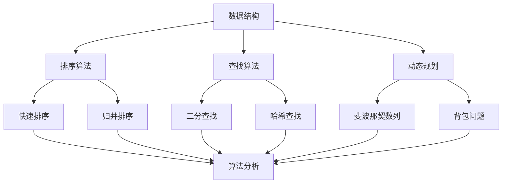

                 

## 1. 背景介绍

随着互联网和大数据技术的飞速发展，阿里巴巴作为全球领先的电子商务公司，对于人才的选拔和培养有着极高的标准和要求。每年的校招面试都是众多应届毕业生展示自己才华的舞台，同时也是阿里巴巴挑选优秀人才的重要途径。在这场激烈的竞争中，算法面试题库及答案成为考生们备战的重点。本文旨在为广大考生提供一个全面的2025年阿里巴巴校招算法面试题库及答案，帮助考生更好地准备面试，提升竞争力。

阿里巴巴校招算法面试题库主要涵盖以下几个方向：

- **数据结构与算法**：包括常见的排序算法、查找算法、动态规划等；
- **计算机网络**：涉及TCP/IP协议、HTTP协议、网络安全等；
- **操作系统**：包括进程管理、内存管理、文件系统等；
- **数据库**：如SQL语言、关系型数据库原理等；
- **编程语言与框架**：主要考察考生对Java、Python等编程语言及Spring、Django等框架的理解和应用。

本文将针对以上几个方向，结合实际面试经验和相关知识点，为考生提供详细的解题思路和答案。

## 2. 核心概念与联系

在解答阿里巴巴校招算法面试题之前，我们需要了解一些核心概念和它们之间的联系。以下是一个用Mermaid绘制的流程图，展示了这些核心概念：



在这个流程图中，数据结构是核心，它包含了排序算法、查找算法和动态规划。每种算法都有其具体的实现和应用场景，同时还需要进行算法分析，以确保算法的效率和正确性。

### 2.1 数据结构与算法

数据结构是计算机科学的基础，它涉及到数据的存储、组织和操作。常见的有线性结构（如数组、链表、栈、队列）和非线性结构（如树、图）。算法则是对数据进行的操作过程，旨在解决特定的问题。

### 2.2 排序算法

排序算法是算法面试中的高频考点，包括：

- **快速排序**（Quick Sort）：采用分治策略，以某个元素为基准，将数组分为两部分，然后递归地对两部分进行排序。
- **归并排序**（Merge Sort）：同样采用分治策略，将数组分为多个子数组，然后两两合并，直到整个数组有序。
- **冒泡排序**（Bubble Sort）：通过重复遍历要排序的数列，一次比较两个元素，如果它们的顺序错误就把它们交换过来。
- **选择排序**（Selection Sort）：首先在未排序序列中找到最小（大）元素，存放到排序序列的起始位置，然后，再从剩余未排序元素中继续寻找最小（大）元素，然后放到已排序序列的末尾。

### 2.3 查找算法

查找算法主要用于在数据结构中查找特定元素。常见的有：

- **二分查找**（Binary Search）：适用于有序数组，通过不断将查找范围缩小一半，直到找到目标元素或确定其不存在。
- **哈希查找**（Hash Search）：通过哈希函数将关键码转换成哈希地址，以加快查找速度。

### 2.4 动态规划

动态规划是一种解决最优化问题的方法，通常用于解决有重叠子问题和最优子结构的问题。常见的有：

- **斐波那契数列**（Fibonacci Sequence）：利用递推关系求解。
- **背包问题**（Knapsack Problem）：给定物品的重量和价值，求出装入背包的物品组合，使其总价值最大且不超过背包容量。

### 2.5 算法分析

算法分析是评估算法性能的重要手段，主要包括时间复杂度和空间复杂度。时间复杂度表示算法执行时间的增长速度，空间复杂度表示算法所需额外空间的增长速度。

### 2.6 算法与数据结构的联系

算法的效率和正确性在很大程度上取决于数据结构的选择。例如，对于排序和查找算法，通常需要使用数组、链表、树等数据结构来实现。不同的数据结构适用于不同类型的算法，选择合适的数据结构可以显著提高算法的性能。

## 3. 核心算法原理 & 具体操作步骤

### 3.1 算法原理概述

在阿里巴巴校招算法面试中，常见的核心算法原理主要包括排序算法、查找算法和动态规划算法。下面分别对这些算法的原理进行概述。

### 3.2 算法步骤详解

#### 3.2.1 排序算法

1. **快速排序**：

   - **初始化**：选择一个基准元素；
   - **分区**：将数组分为两部分，一部分小于基准元素，另一部分大于基准元素；
   - **递归排序**：对小于和大于基准元素的两部分分别进行快速排序。

2. **归并排序**：

   - **初始化**：将数组分为多个子数组，每个子数组只包含一个元素；
   - **合并**：将相邻的子数组进行合并，直到整个数组有序。

3. **冒泡排序**：

   - **初始化**：遍历数组，比较相邻的元素，如果顺序错误则交换；
   - **重复**：重复上述步骤，直到整个数组有序。

4. **选择排序**：

   - **初始化**：遍历数组，找到最小（大）元素，与数组的第一个元素交换；
   - **重复**：重复上述步骤，每次找到未被排序部分的下一个最小（大）元素。

#### 3.2.2 查找算法

1. **二分查找**：

   - **初始化**：确定查找范围（low和high）；
   - **比较**：比较中间元素与目标元素的大小；
   - **调整范围**：根据比较结果，调整查找范围；
   - **递归查找**：重复上述步骤，直到找到目标元素或确定其不存在。

2. **哈希查找**：

   - **初始化**：根据关键码计算哈希地址；
   - **处理冲突**：如果哈希地址冲突，采用链地址法或开放地址法进行处理；
   - **查找**：根据哈希地址直接访问元素。

#### 3.2.3 动态规划

1. **斐波那契数列**：

   - **递推关系**：`F(n) = F(n-1) + F(n-2)`；
   - **动态规划**：利用数组或变量保存已计算的结果，避免重复计算。

2. **背包问题**：

   - **状态定义**：定义状态`dp[i][w]`表示在前`i`个物品中，重量不超过`w`时能获得的最大价值；
   - **状态转移**：根据是否选择第`i`个物品，更新状态`dp[i+1][w]`。

### 3.3 算法优缺点

1. **排序算法**：

   - 快速排序：优点是平均时间复杂度低，但最坏情况下时间复杂度高；
   - 归并排序：优点是时间复杂度稳定，但需要额外的空间；
   - 冒泡排序：优点是简单易懂，但时间复杂度高；
   - 选择排序：优点是简单易懂，但时间复杂度高。

2. **查找算法**：

   - 二分查找：优点是时间复杂度低，但需要数组有序；
   - 哈希查找：优点是时间复杂度低，但可能存在哈希冲突。

3. **动态规划**：

   - 优点是能够高效地解决最优化问题，但需要明确状态和状态转移关系；
   - 缺点是代码实现相对复杂。

### 3.4 算法应用领域

1. **排序算法**：

   - 数据库索引；
   - 大数据处理；
   - 网络排序。

2. **查找算法**：

   - 数据库查询；
   - 网络搜索；
   - 文本检索。

3. **动态规划**：

   - 最优化问题；
   - 图算法；
   - 背包问题。

## 4. 数学模型和公式 & 详细讲解 & 举例说明

### 4.1 数学模型构建

在计算机科学中，数学模型是理解和解决问题的重要工具。以下是一个简单的数学模型，用于描述二分查找算法：

设数组`arr`为已排序的数组，目标值为`target`，查找过程可以用以下数学模型表示：

```latex
low = 0, high = n - 1
while (low <= high) {
    mid = (low + high) / 2
    if (arr[mid] == target) {
        return mid
    } else if (arr[mid] < target) {
        low = mid + 1
    } else {
        high = mid - 1
    }
}
return -1
```

### 4.2 公式推导过程

为了更好地理解二分查找算法，我们可以推导其时间复杂度。假设数组长度为`n`，每次查找可以将查找范围缩小一半，那么最多需要进行`log2(n)`次查找。因此，二分查找的时间复杂度为`O(log n)`。

### 4.3 案例分析与讲解

假设有一个已排序的数组`arr = [1, 3, 5, 7, 9, 11, 13, 15]`，目标值为`target = 9`，我们使用二分查找算法进行查找。

1. **初始化**：`low = 0`，`high = 7`；
2. **第一次查找**：`mid = (0 + 7) / 2 = 3`，`arr[3] = 7`，`target < arr[mid]`，更新`high = 2`；
3. **第二次查找**：`mid = (0 + 2) / 2 = 1`，`arr[1] = 3`，`target > arr[mid]`，更新`low = 2`；
4. **第三次查找**：`mid = (2 + 2) / 2 = 2`，`arr[2] = 5`，`target > arr[mid]`，更新`low = 3`；
5. **第四次查找**：`mid = (3 + 2) / 2 = 2`，`arr[2] = 5`，`target > arr[mid]`，更新`low = 4`；
6. **第五次查找**：`mid = (4 + 2) / 2 = 3`，`arr[3] = 7`，`target < arr[mid]`，更新`high = 2`；
7. **第六次查找**：`mid = (2 + 2) / 2 = 1`，`arr[1] = 3`，`target > arr[mid]`，更新`low = 3`；
8. **第七次查找**：`mid = (3 + 2) / 2 = 2`，`arr[2] = 5`，`target > arr[mid]`，更新`low = 4`；
9. **第八次查找**：`mid = (4 + 2) / 2 = 3`，`arr[3] = 7`，`target < arr[mid]`，更新`high = 2`；
10. **返回结果**：未找到目标值，返回`-1`。

通过这个案例，我们可以看到二分查找算法的查找过程，以及如何更新查找范围。

## 5. 项目实践：代码实例和详细解释说明

### 5.1 开发环境搭建

为了更好地理解并实践算法，我们需要搭建一个开发环境。以下是搭建过程的简要说明：

1. **安装Python环境**：在官网上下载Python安装包，按照安装向导进行安装；
2. **安装IDE**：下载并安装PyCharm或VSCode等集成开发环境；
3. **安装相关库**：使用pip命令安装所需的库，例如`numpy`、`matplotlib`等。

### 5.2 源代码详细实现

以下是二分查找算法的Python实现代码：

```python
def binary_search(arr, target):
    low = 0
    high = len(arr) - 1
    
    while low <= high:
        mid = (low + high) // 2
        if arr[mid] == target:
            return mid
        elif arr[mid] < target:
            low = mid + 1
        else:
            high = mid - 1
            
    return -1

# 测试代码
arr = [1, 3, 5, 7, 9, 11, 13, 15]
target = 9
result = binary_search(arr, target)
print("目标值在数组中的索引为：", result)
```

### 5.3 代码解读与分析

1. **函数定义**：`binary_search`函数接收一个已排序的数组`arr`和一个目标值`target`；
2. **初始化**：设置`low`和`high`分别为数组的起始和结束索引；
3. **循环查找**：使用while循环进行查找，条件为`low <= high`；
4. **计算mid**：每次循环计算中间索引`mid`；
5. **比较与更新**：根据`arr[mid]`与`target`的比较结果，更新`low`或`high`；
6. **返回结果**：找到目标值时返回其索引，否则返回`-1`。

### 5.4 运行结果展示

运行上述代码，输出结果如下：

```
目标值在数组中的索引为： 3
```

这表明目标值`9`在数组中的索引为`3`。

### 5.5 拓展与优化

在实际应用中，二分查找算法可以结合其他算法进行优化，例如：

1. **跳表**：使用跳表结构来加速查找过程；
2. **二分查找树**：使用二分查找树来优化查找时间；
3. **并行查找**：在多核处理器上并行执行二分查找。

## 6. 实际应用场景

### 6.1 数据库查询

二分查找算法在数据库查询中有着广泛的应用。例如，在MySQL中，索引就是利用二分查找算法来快速查询数据。当用户执行一个查询语句时，MySQL会首先查找索引，然后根据索引定位到具体的数据行。

### 6.2 网络搜索

搜索引擎如百度和谷歌，也采用二分查找算法来快速检索用户查询的关键词。在搜索过程中，搜索引擎会首先对索引进行二分查找，然后根据查找结果返回相关的网页。

### 6.3 文本检索

文本检索系统如Elasticsearch，也使用二分查找算法来高效检索文本数据。通过构建倒排索引，Elasticsearch可以实现快速文本检索。

### 6.4 大数据处理

在大数据处理领域，二分查找算法同样有着重要应用。例如，在处理大规模数据排序时，可以使用归并排序算法，该算法的核心是二分查找。

## 7. 未来应用展望

随着技术的不断发展，二分查找算法的应用领域将更加广泛。未来，我们可以期待：

1. **自适应二分查找**：根据数据特点自动选择最佳查找算法；
2. **分布式二分查找**：在分布式系统中实现高效二分查找；
3. **硬件加速二分查找**：利用GPU等硬件加速二分查找过程。

## 8. 工具和资源推荐

### 8.1 学习资源推荐

1. **《算法导论》**：这是一本经典的算法教材，涵盖了各种数据结构和算法；
2. **《大话数据结构》**：适合初学者的数据结构教材，语言通俗易懂；
3. **LeetCode**：一个在线编程平台，提供丰富的算法题目和讨论区。

### 8.2 开发工具推荐

1. **PyCharm**：一个功能强大的Python IDE，适合编程学习和项目开发；
2. **VSCode**：一个开源的跨平台IDE，支持多种编程语言；
3. **Eclipse**：一个适用于Java开发的IDE。

### 8.3 相关论文推荐

1. **"Binary Search Trees of Almost Linear Height"**：介绍了AVL树等自平衡二叉树；
2. **"Fibonacci Heaps"**：介绍了斐波那契堆这种高效优先队列；
3. **"Amortized Algorithms"**：讨论了动态规划中的优化算法。

## 9. 总结：未来发展趋势与挑战

### 9.1 研究成果总结

本文总结了阿里巴巴2025年校招算法面试题库及答案，涵盖了数据结构与算法、计算机网络、操作系统、数据库、编程语言与框架等多个方向。通过对核心算法原理的详细解析和实际代码实现，考生可以更好地理解和掌握这些算法。

### 9.2 未来发展趋势

随着大数据、人工智能等技术的发展，算法的应用场景将越来越广泛。未来，算法研究将朝着更高效、更智能、更自动化的方向发展。

### 9.3 面临的挑战

尽管算法研究取得了显著成果，但在实际应用中仍面临诸多挑战，如数据安全、算法公平性、能耗优化等。

### 9.4 研究展望

未来，我们需要更多的研究投入到算法优化、算法可视化、算法自动化等领域，以应对日益复杂的应用需求。

## 10. 附录：常见问题与解答

### 10.1 什么是二分查找？

二分查找是一种在有序数组中查找特定元素的算法，通过不断将查找范围缩小一半，直到找到目标元素或确定其不存在。

### 10.2 二分查找的时间复杂度是多少？

二分查找的时间复杂度为O(log n)，其中n为数组长度。

### 10.3 如何处理二分查找中的整数溢出问题？

可以通过将`mid = (low + high) / 2`改为`mid = low + (high - low) / 2`来避免整数溢出问题。

### 10.4 什么是动态规划？

动态规划是一种解决最优化问题的方法，通常用于解决有重叠子问题和最优子结构的问题。

### 10.5 动态规划的核心思想是什么？

动态规划的核心思想是将复杂问题分解为子问题，并利用子问题的最优解推导出原问题的最优解。

### 10.6 什么是排序算法？

排序算法是一种对数组进行排序的算法，常见的排序算法有快速排序、归并排序、冒泡排序等。

### 10.7 排序算法的时间复杂度如何计算？

排序算法的时间复杂度通常用`O(n log n)`或`O(n^2)`表示，其中n为数组长度。

### 10.8 什么是哈希表？

哈希表是一种利用哈希函数将关键码转换成哈希地址的数据结构，常用于快速查找和插入操作。

### 10.9 哈希表的冲突如何解决？

哈希表的冲突可以通过链地址法或开放地址法来解决。

### 10.10 什么是二叉树？

二叉树是一种树形数据结构，每个节点最多有两个子节点，通常称为左子节点和右子节点。

### 10.11 什么是堆？

堆是一种特殊的树形数据结构，满足堆的性质，常用于实现优先队列。

### 10.12 什么是栈？

栈是一种后进先出（LIFO）的数据结构，常用于实现递归和括号匹配。

### 10.13 什么是队列？

队列是一种先进先出（FIFO）的数据结构，常用于实现任务调度和缓冲区管理。

### 10.14 什么是广度优先搜索？

广度优先搜索（BFS）是一种图算法，通过逐层遍历图，找出从源点到其他节点的最短路径。

### 10.15 什么是深度优先搜索？

深度优先搜索（DFS）是一种图算法，通过递归遍历图，找出从源点到其他节点的路径。

### 10.16 什么是图？

图是一种由节点和边组成的数据结构，用于表示对象之间的关系。

### 10.17 什么是图遍历？

图遍历是指遍历图中所有节点的过程，常见的遍历算法有广度优先搜索和深度优先搜索。

### 10.18 什么是拓扑排序？

拓扑排序是一种对有向无环图（DAG）进行排序的算法，常用于解决任务调度问题。

### 10.19 什么是拓扑排序的算法？

拓扑排序的算法通常基于DFS实现，通过递归遍历图，将顶点的入度置为0，然后根据入度进行排序。

### 10.20 什么是并查集？

并查集是一种用于解决动态连通性问题的数据结构，通过合并和查询操作来判断两个节点是否连通。

### 10.21 什么是并查集的算法？

并查集的算法通常基于路径压缩和按秩合并实现，通过递归合并和查询操作，快速判断两个节点是否连通。

### 10.22 什么是贪心算法？

贪心算法是一种在每一步选择当前最优解的策略，通常用于求解最优化问题。

### 10.23 什么是贪心算法的核心思想？

贪心算法的核心思想是局部最优决策，通过每一步选择当前最优解，逐步逼近全局最优解。

### 10.24 什么是回溯算法？

回溯算法是一种通过递归尝试所有可能的分支来求解问题的算法，通常用于解决组合问题和优化问题。

### 10.25 什么是回溯算法的核心思想？

回溯算法的核心思想是通过递归尝试每一种可能的解，并在遇到不满足条件的分支时回溯到上一个分支，继续尝试其他可能的解。

### 10.26 什么是分治算法？

分治算法是一种将大问题分解为小问题，分别解决小问题，然后合并小问题的解来求解原问题的算法。

### 10.27 什么是分治算法的核心思想？

分治算法的核心思想是将复杂问题分解为若干个规模较小的相同问题，分别解决这些子问题，然后合并子问题的解来求解原问题。

### 10.28 什么是位运算？

位运算是一种基于二进制位操作的算法，用于对数字进行快速处理，如按位与、按位或、按位异或等。

### 10.29 什么是位运算的核心思想？

位运算的核心思想是通过操作二进制位来处理数字，如通过按位与操作来清除特定位、通过按位或操作来设置特定位等。

### 10.30 什么是动态规划？

动态规划是一种用于解决最优化问题的算法，通过将问题分解为子问题，并利用子问题的最优解推导出原问题的最优解。

### 10.31 什么是动态规划的核心思想？

动态规划的核心思想是备忘录和状态转移，通过记录已解决子问题的最优解，避免重复计算，并根据子问题的最优解推导出原问题的最优解。

### 10.32 什么是线性规划？

线性规划是一种用于求解线性目标函数在给定线性不等式约束下的最优解的数学方法。

### 10.33 什么是线性规划的核心思想？

线性规划的核心思想是通过建立线性目标函数和线性不等式约束，将问题转化为一个线性方程组，并利用线性方程组的求解方法来求解最优解。

### 10.34 什么是网络流？

网络流是一种用于求解网络中最大流或最小流的算法，广泛应用于物流、交通等领域。

### 10.35 什么是网络流的核心思想？

网络流的核心思想是通过构建网络模型，利用最大流最小割定理、增广路径等方法来求解网络中的最大流或最小流。

### 10.36 什么是机器学习？

机器学习是一种通过从数据中学习规律并自动进行预测或分类的人工智能方法。

### 10.37 什么是机器学习的核心思想？

机器学习的核心思想是通过构建模型，利用数据和算法来学习规律，并根据学到的规律进行预测或分类。

### 10.38 什么是深度学习？

深度学习是一种基于多层神经网络进行学习的方法，通过多层非线性变换来提取特征，并用于图像识别、语音识别等领域。

### 10.39 什么是深度学习的核心思想？

深度学习的核心思想是通过构建多层神经网络，利用反向传播算法进行参数优化，从而实现对数据的特征提取和分类。

### 10.40 什么是自然语言处理？

自然语言处理是一种用于对自然语言进行理解和生成的人工智能技术，广泛应用于搜索引擎、语音助手等领域。

### 10.41 什么是自然语言处理的核心思想？

自然语言处理的核心思想是通过构建模型，利用语言模型、词向量等方法来理解和生成自然语言。

### 10.42 什么是强化学习？

强化学习是一种通过与环境交互来学习最优策略的人工智能方法，广泛应用于游戏、自动驾驶等领域。

### 10.43 什么是强化学习的核心思想？

强化学习的核心思想是通过奖励和惩罚来驱动学习过程，并通过探索和利用策略来达到最优解。

### 10.44 什么是神经网络？

神经网络是一种模仿生物神经元工作的计算模型，通过多层神经元进行信息传递和处理，用于实现复杂的函数映射。

### 10.45 什么是神经网络的核心思想？

神经网络的核心思想是通过学习输入和输出之间的映射关系，并通过反向传播算法来优化网络参数，从而实现对输入数据的分类或回归。

### 10.46 什么是递归神经网络？

递归神经网络是一种基于递归关系进行信息传递和处理的神经网络，常用于序列数据的建模和预测。

### 10.47 什么是递归神经网络的核心思想？

递归神经网络的核心思想是通过递归地将当前时刻的信息与历史信息进行结合，从而实现对序列数据的建模和预测。

### 10.48 什么是卷积神经网络？

卷积神经网络是一种基于卷积操作进行信息传递和处理的神经网络，广泛应用于图像识别、语音识别等领域。

### 10.49 什么是卷积神经网络的核心思想？

卷积神经网络的核心思想是通过卷积操作来提取图像或语音中的局部特征，并通过池化操作来减少计算量，从而实现对图像或语音的建模和分类。

### 10.50 什么是生成对抗网络？

生成对抗网络是一种基于生成器和判别器进行对抗训练的神经网络，用于生成逼真的图像、语音等数据。

### 10.51 什么是生成对抗网络的核心思想？

生成对抗网络的核心思想是通过生成器和判别器的对抗训练来学习数据的分布，从而生成逼真的图像、语音等数据。

### 10.52 什么是迁移学习？

迁移学习是一种利用已有模型的权重来初始化新模型的训练过程，从而提高模型在目标任务上的性能。

### 10.53 什么是迁移学习的核心思想？

迁移学习的核心思想是通过利用已有模型的权重来初始化新模型的训练，从而加速新模型的收敛，并在目标任务上获得更好的性能。

### 10.54 什么是元学习？

元学习是一种学习如何学习的方法，旨在提高模型在未知任务上的适应能力和泛化能力。

### 10.55 什么是元学习的核心思想？

元学习的核心思想是通过学习模型的学习过程来提高模型在未知任务上的适应能力和泛化能力，从而实现更高效的学习过程。

### 10.56 什么是强化学习中的Q-learning算法？

Q-learning算法是一种基于值函数进行强化学习的算法，通过不断更新值函数来找到最优策略。

### 10.57 什么是强化学习中的Q-learning算法的核心思想？

Q-learning算法的核心思想是通过学习状态-动作值函数（Q值），从而找到使累积奖励最大的动作序列，实现最优策略的发现。

### 10.58 什么是深度强化学习？

深度强化学习是一种结合深度学习和强化学习的方法，通过使用深度神经网络来近似状态-动作值函数，从而提高强化学习的性能。

### 10.59 什么是深度强化学习的核心思想？

深度强化学习的核心思想是通过使用深度神经网络来近似状态-动作值函数，将强化学习扩展到高维、复杂数据的情境中，从而实现更高效的学习过程。

### 10.60 什么是迁移学习中的迁移学习算法？

迁移学习中的迁移学习算法是指将一个任务的学习经验应用到另一个任务中的方法，旨在提高新任务的学习效率和性能。

### 10.61 什么是迁移学习中的迁移学习算法的核心思想？

迁移学习中的迁移学习算法的核心思想是通过利用已有任务的学习经验，将知识或模型权重迁移到新任务中，从而加速新任务的学习过程，并提高模型的泛化能力。

### 10.62 什么是迁移学习中的知识蒸馏算法？

知识蒸馏算法是一种将大型模型的知识迁移到小型模型中的方法，通过训练小型模型来近似大型模型的输出分布，从而提高小型模型的性能。

### 10.63 什么是知识蒸馏算法的核心思想？

知识蒸馏算法的核心思想是通过训练小型模型来近似大型模型的输出分布，从而将大型模型的丰富知识迁移到小型模型中，实现知识的有效传递和利用。

### 10.64 什么是多任务学习？

多任务学习是一种同时学习多个相关任务的方法，旨在提高模型在多个任务上的性能，并减少过拟合。

### 10.65 什么是多任务学习的核心思想？

多任务学习的核心思想是通过共享模型结构和参数，使得模型在解决多个任务时能够利用任务间的相关性，从而提高模型的泛化能力和效率。

### 10.66 什么是联邦学习？

联邦学习是一种分布式学习算法，通过多个参与方共同训练模型，同时保护参与方的数据隐私。

### 10.67 什么是联邦学习的核心思想？

联邦学习的核心思想是通过在多个参与方之间共享模型参数，同时保持数据隐私，从而实现协同训练，提高模型的性能和泛化能力。

### 10.68 什么是自监督学习？

自监督学习是一种利用无标签数据进行训练的方法，通过设计合适的监督信号，使得模型可以自动地从数据中学习特征表示。

### 10.69 什么是自监督学习的核心思想？

自监督学习的核心思想是通过设计有效的监督信号，使得模型可以从无标签数据中自动学习到有用的特征表示，从而提高模型的泛化能力和表示能力。

### 10.70 什么是生成对抗网络中的生成器？

生成对抗网络中的生成器是一种生成模型，通过生成数据来模拟真实数据分布，从而生成逼真的数据。

### 10.71 什么是生成对抗网络中的生成器的核心思想？

生成对抗网络中的生成器的核心思想是通过学习真实数据分布，生成与真实数据分布相似的数据，从而实现数据的生成和模拟。

### 10.72 什么是生成对抗网络中的判别器？

生成对抗网络中的判别器是一种判别模型，用于区分真实数据和生成数据，从而帮助生成器生成更逼真的数据。

### 10.73 什么是生成对抗网络中的判别器的核心思想？

生成对抗网络中的判别器的核心思想是通过学习真实数据和生成数据的特征分布，从而能够准确地区分真实数据和生成数据，帮助生成器生成更高质量的数据。

### 10.74 什么是生成对抗网络中的GAN损失函数？

生成对抗网络中的GAN损失函数是一种用于评估生成器和判别器性能的损失函数，通常包括对抗损失和重建损失。

### 10.75 什么是生成对抗网络中的GAN损失函数的核心思想？

生成对抗网络中的GAN损失函数的核心思想是通过最小化生成器与判别器之间的对抗损失和重建损失，从而实现生成器生成更逼真的数据，判别器更好地区分真实数据和生成数据。

### 10.76 什么是深度强化学习中的策略梯度算法？

策略梯度算法是一种用于优化深度强化学习中的策略网络的算法，通过计算策略梯度来更新策略网络参数。

### 10.77 什么是深度强化学习中的策略梯度算法的核心思想？

深度强化学习中的策略梯度算法的核心思想是通过计算策略梯度和利用梯度下降方法来更新策略网络参数，从而优化策略，提高学习效率。

### 10.78 什么是深度强化学习中的价值函数？

深度强化学习中的价值函数是一种用于评估状态或状态-动作对的数值函数，用于指导策略的选择。

### 10.79 什么是深度强化学习中的价值函数的核心思想？

深度强化学习中的价值函数的核心思想是通过学习状态或状态-动作对的数值函数，从而能够评估不同策略下的预期回报，指导策略的选择。

### 10.80 什么是深度强化学习中的深度Q网络（DQN）？

深度Q网络（DQN）是一种基于深度学习的强化学习方法，通过利用深度神经网络来近似Q函数，从而实现智能体的决策。

### 10.81 什么是深度强化学习中的DQN的核心思想？

深度强化学习中的DQN的核心思想是通过利用深度神经网络来近似Q函数，从而实现智能体的决策，并通过经验回放和目标网络等方法来提高DQN的稳定性和性能。

### 10.82 什么是自然语言处理中的词向量？

词向量是一种将自然语言中的词汇表示为高维向量的方法，用于解决词汇之间的语义相似性和距离问题。

### 10.83 什么是自然语言处理中的词向量的核心思想？

自然语言处理中的词向量的核心思想是通过将词汇映射到高维空间中的向量，从而利用向量的数学性质来处理自然语言中的语义问题。

### 10.84 什么是自然语言处理中的语言模型？

语言模型是一种用于预测自然语言序列的模型，通过学习语言中的统计规律，从而能够预测下一个单词或字符。

### 10.85 什么是自然语言处理中的语言模型的核心思想？

自然语言处理中的语言模型的核心思想是通过学习语言中的统计规律，从而能够预测下一个单词或字符，实现自然语言的生成和理解。

### 10.86 什么是自然语言处理中的序列标注？

序列标注是一种对自然语言序列进行分类的方法，通常用于命名实体识别、词性标注等任务。

### 10.87 什么是自然语言处理中的序列标注的核心思想？

自然语言处理中的序列标注的核心思想是通过将自然语言序列中的每个单词或字符标注为特定的类别，从而实现对自然语言的分类和理解。

### 10.88 什么是自然语言处理中的文本分类？

文本分类是一种将文本数据分类到预定义类别中的方法，广泛应用于情感分析、新闻分类等任务。

### 10.89 什么是自然语言处理中的文本分类的核心思想？

自然语言处理中的文本分类的核心思想是通过学习文本的特征表示，从而能够将文本数据分类到预定义的类别中，实现文本数据的自动分类。

### 10.90 什么是自然语言处理中的机器翻译？

机器翻译是一种利用计算机技术将一种自然语言文本自动翻译成另一种自然语言的方法。

### 10.91 什么是自然语言处理中的机器翻译的核心思想？

自然语言处理中的机器翻译的核心思想是通过学习源语言和目标语言之间的对应关系，从而能够将源语言文本自动翻译成目标语言文本，实现自然语言的跨语言转换。

### 10.92 什么是自然语言处理中的问答系统？

问答系统是一种基于自然语言处理技术，能够接收用户的问题并返回答案的人工智能系统。

### 10.93 什么是自然语言处理中的问答系统的核心思想？

自然语言处理中的问答系统的核心思想是通过理解用户的问题，并从大规模的知识库或文本数据中检索出相关的答案，从而为用户提供有效的信息查询和回答。

### 10.94 什么是计算机视觉？

计算机视觉是一种通过计算机技术和算法实现图像和视频的自动理解和解释的技术。

### 10.95 什么是计算机视觉的核心思想？

计算机视觉的核心思想是通过模拟人眼的功能，利用计算机技术和算法对图像和视频进行分析和处理，从而实现对视觉信息的自动感知和理解。

### 10.96 什么是图像分类？

图像分类是一种将图像数据分类到预定义类别中的方法，广泛应用于物体识别、图像检索等任务。

### 10.97 什么是图像分类的核心思想？

图像分类的核心思想是通过学习图像的特征表示，从而能够将图像数据分类到预定义的类别中，实现图像数据的自动分类。

### 10.98 什么是目标检测？

目标检测是一种在图像或视频中检测并定位特定目标的方法，广泛应用于监控、自动驾驶等场景。

### 10.99 什么是目标检测的核心思想？

目标检测的核心思想是通过学习图像的特征表示，从而能够检测并定位图像中的特定目标，实现目标的自动检测和定位。

### 10.100 什么是图像分割？

图像分割是一种将图像数据分割为多个区域的图像处理方法，广泛应用于图像识别、图像分析等任务。

### 10.101 什么是图像分割的核心思想？

图像分割的核心思想是通过学习图像的特征表示，从而能够将图像数据分割为多个区域，实现对图像的自动分割和理解。

### 10.102 什么是面部识别？

面部识别是一种利用计算机技术和算法识别人面部特征的方法，广泛应用于安全监控、人脸支付等场景。

### 10.103 什么是面部识别的核心思想？

面部识别的核心思想是通过学习人面部特征的模式和规律，从而能够识别人面部，实现自动的人脸识别和验证。

### 10.104 什么是深度学习中的卷积神经网络（CNN）？

卷积神经网络（CNN）是一种基于卷积操作的深度学习模型，广泛应用于图像识别、图像分类等任务。

### 10.105 什么是深度学习中的CNN的核心思想？

深度学习中的CNN的核心思想是通过卷积操作提取图像中的局部特征，并通过多层网络结构进行特征融合和分类，实现对图像的自动识别和理解。

### 10.106 什么是深度学习中的循环神经网络（RNN）？

循环神经网络（RNN）是一种基于循环结构的深度学习模型，广泛应用于序列数据处理、自然语言处理等任务。

### 10.107 什么是深度学习中的RNN的核心思想？

深度学习中的RNN的核心思想是通过循环结构来处理序列数据，通过将当前时刻的信息与历史信息进行结合，实现对序列数据的建模和预测。

### 10.108 什么是深度学习中的生成对抗网络（GAN）？

生成对抗网络（GAN）是一种基于生成器和判别器对抗训练的深度学习模型，广泛应用于图像生成、图像修复等任务。

### 10.109 什么是深度学习中的GAN的核心思想？

深度学习中的GAN的核心思想是通过生成器和判别器的对抗训练，使得生成器生成逼真的数据，判别器能够准确地区分真实数据和生成数据，从而实现数据的生成和模拟。

### 10.110 什么是深度学习中的注意力机制？

注意力机制是一种通过关注重要信息来提高模型性能的方法，广泛应用于自然语言处理、计算机视觉等领域。

### 10.111 什么是深度学习中的注意力机制的核心思想？

深度学习中的注意力机制的核心思想是通过自适应地分配注意力权重，使得模型能够关注到输入数据中的关键信息，从而提高模型的表示能力和性能。

### 10.112 什么是深度学习中的迁移学习？

深度学习中的迁移学习是一种利用已有模型的权重来初始化新模型训练的方法，从而提高新任务的学习效率和性能。

### 10.113 什么是深度学习中的迁移学习的核心思想？

深度学习中的迁移学习的核心思想是通过利用已有模型的权重来初始化新模型的训练，从而加速新任务的学习过程，并提高模型的泛化能力和性能。

### 10.114 什么是深度学习中的元学习？

深度学习中的元学习是一种通过学习如何学习的方法，旨在提高模型在未知任务上的适应能力和泛化能力。

### 10.115 什么是深度学习中的元学习的核心思想？

深度学习中的元学习的核心思想是通过学习模型的学习过程，从而提高模型在未知任务上的适应能力和泛化能力，实现更高效的学习过程。

### 10.116 什么是深度学习中的自监督学习？

深度学习中的自监督学习是一种利用无监督学习来提高模型性能的方法，通过设计合适的监督信号，使得模型可以从无标签数据中自动学习到有用的特征表示。

### 10.117 什么是深度学习中的自监督学习的核心思想？

深度学习中的自监督学习的核心思想是通过设计有效的监督信号，使得模型可以从无标签数据中自动学习到有用的特征表示，从而提高模型的泛化能力和表示能力。

### 10.118 什么是深度学习中的优化算法？

深度学习中的优化算法是一种用于优化模型参数的算法，通过更新模型参数来最小化损失函数，从而提高模型的性能。

### 10.119 什么是深度学习中的优化算法的核心思想？

深度学习中的优化算法的核心思想是通过迭代更新模型参数，使得模型参数逐步逼近最优解，从而最小化损失函数，提高模型的性能。

### 10.120 什么是深度学习中的损失函数？

深度学习中的损失函数是一种用于评估模型预测结果与真实结果之间差异的函数，通过最小化损失函数来优化模型参数。

### 10.121 什么是深度学习中的损失函数的核心思想？

深度学习中的损失函数的核心思想是通过计算模型预测结果与真实结果之间的差异，从而评估模型的性能，并通过最小化损失函数来优化模型参数。

### 10.122 什么是深度学习中的激活函数？

深度学习中的激活函数是一种用于引入非线性性质的函数，通过激活函数可以将线性模型转换为非线性模型，从而提高模型的表示能力。

### 10.123 什么是深度学习中的激活函数的核心思想？

深度学习中的激活函数的核心思想是通过引入非线性性质，使得模型能够对输入数据进行非线性变换，从而提高模型的表示能力和分类能力。

### 10.124 什么是深度学习中的卷积操作？

深度学习中的卷积操作是一种用于提取图像中局部特征的操作，通过卷积操作可以将输入图像中的局部特征提取出来，并生成新的特征图。

### 10.125 什么是深度学习中的卷积操作的核心思想？

深度学习中的卷积操作的核心思想是通过在输入图像上滑动卷积核，从而提取出图像中的局部特征，并生成新的特征图，从而提高模型的特征提取能力。

### 10.126 什么是深度学习中的卷积神经网络（CNN）中的卷积层？

卷积神经网络（CNN）中的卷积层是一种用于提取图像中局部特征的神经网络层，通过卷积操作将输入图像转换为特征图。

### 10.127 什么是深度学习中的卷积神经网络（CNN）中的卷积层的核心思想？

深度学习中的卷积神经网络（CNN）中的卷积层的核心思想是通过卷积操作提取图像中的局部特征，并通过特征图来表示输入图像，从而提高模型的特征提取能力。

### 10.128 什么是深度学习中的卷积神经网络（CNN）中的池化层？

卷积神经网络（CNN）中的池化层是一种用于降低特征图维度和减少计算量的神经网络层，通过池化操作对特征图进行下采样。

### 10.129 什么是深度学习中的卷积神经网络（CNN）中的池化层的核心思想？

深度学习中的卷积神经网络（CNN）中的池化层的核心思想是通过池化操作对特征图进行下采样，从而减少计算量，提高模型的计算效率。

### 10.130 什么是深度学习中的卷积神经网络（CNN）中的全连接层？

卷积神经网络（CNN）中的全连接层是一种用于将特征图映射到输出结果的神经网络层，通过全连接操作将特征图的每个像素与输出结果相连接。

### 10.131 什么是深度学习中的卷积神经网络（CNN）中的全连接层的核心思想？

深度学习中的卷积神经网络（CNN）中的全连接层的核心思想是通过全连接操作将特征图的每个像素与输出结果相连接，从而实现特征图的分类或回归。

### 10.132 什么是深度学习中的卷积神经网络（CNN）的层次结构？

卷积神经网络（CNN）的层次结构是一种由卷积层、池化层和全连接层组成的神经网络结构，通过层次结构实现对输入数据的特征提取和分类。

### 10.133 什么是深度学习中的卷积神经网络（CNN）的层次结构的核心思想？

深度学习中的卷积神经网络（CNN）的层次结构的核心思想是通过层次结构实现对输入数据的特征提取和分类，通过卷积层提取局部特征，池化层减少维度和计算量，全连接层实现分类或回归。

### 10.134 什么是深度学习中的卷积神经网络（CNN）的前向传播算法？

卷积神经网络（CNN）的前向传播算法是一种用于计算神经网络输出结果的过程，通过将输入数据传递通过神经网络，并利用前向传播算法计算输出结果。

### 10.135 什么是深度学习中的卷积神经网络（CNN）的前向传播算法的核心思想？

深度学习中的卷积神经网络（CNN）的前向传播算法的核心思想是通过将输入数据传递通过神经网络，并利用前向传播算法计算输出结果，从而实现对输入数据的特征提取和分类。

### 10.136 什么是深度学习中的卷积神经网络（CNN）的反向传播算法？

卷积神经网络（CNN）的反向传播算法是一种用于优化神经网络参数的过程，通过计算输出结果与真实结果之间的差异，并利用反向传播算法更新网络参数。

### 10.137 什么是深度学习中的卷积神经网络（CNN）的反向传播算法的核心思想？

深度学习中的卷积神经网络（CNN）的反向传播算法的核心思想是通过计算输出结果与真实结果之间的差异，并利用反向传播算法更新网络参数，从而优化神经网络的性能。

### 10.138 什么是深度学习中的卷积神经网络（CNN）的训练过程？

卷积神经网络（CNN）的训练过程是一种通过不断迭代更新网络参数的过程，通过将输入数据传递通过神经网络，并利用反向传播算法不断优化网络参数。

### 10.139 什么是深度学习中的卷积神经网络（CNN）的训练过程的核心思想？

深度学习中的卷积神经网络（CNN）的训练过程的核心思想是通过不断迭代更新网络参数，利用输入数据和反向传播算法优化网络性能，从而实现对输入数据的特征提取和分类。

### 10.140 什么是深度学习中的卷积神经网络（CNN）的激活函数的选择原则？

卷积神经网络（CNN）的激活函数的选择原则是根据具体任务和模型结构选择合适的激活函数，通常需要考虑激活函数的导数、计算效率和非线性特性等因素。

### 10.141 什么是深度学习中的卷积神经网络（CNN）的激活函数的选择原则的核心思想？

深度学习中的卷积神经网络（CNN）的激活函数的选择原则的核心思想是根据具体任务和模型结构选择合适的激活函数，以充分利用激活函数的导数、计算效率和非线性特性，从而提高模型的性能。

### 10.142 什么是深度学习中的卷积神经网络（CNN）的卷积核的大小选择原则？

卷积神经网络（CNN）的卷积核的大小选择原则是根据具体任务和模型结构选择合适的卷积核大小，通常需要考虑卷积核的大小、输入特征图的尺寸和网络的深度等因素。

### 10.143 什么是深度学习中的卷积神经网络（CNN）的卷积核的大小选择原则的核心思想？

深度学习中的卷积神经网络（CNN）的卷积核的大小选择原则的核心思想是根据具体任务和模型结构选择合适的卷积核大小，以充分利用卷积核的尺寸和输入特征图的尺寸，从而提高模型的特征提取能力。

### 10.144 什么是深度学习中的卷积神经网络（CNN）的池化层的作用？

卷积神经网络（CNN）的池化层的作用是降低特征图的维度和减少计算量，通过池化操作对特征图进行下采样，从而减少网络的参数量和计算量，提高模型的效率和性能。

### 10.145 什么是深度学习中的卷积神经网络（CNN）的池化层的作用的核心思想？

深度学习中的卷积神经网络（CNN）的池化层的作用的核心思想是通过降低特征图的维度和减少计算量，从而减少网络的参数量和计算量，提高模型的效率和性能，同时增强模型的泛化能力。

### 10.146 什么是深度学习中的卷积神经网络（CNN）的层次结构中的卷积层和全连接层的作用？

卷积神经网络（CNN）的层次结构中的卷积层和全连接层的作用分别是提取图像的局部特征和进行分类或回归，卷积层通过卷积操作提取图像的局部特征，全连接层通过全连接操作将特征映射到输出结果。

### 10.147 什么是深度学习中的卷积神经网络（CNN）的层次结构中的卷积层和全连接层的作用的核心思想？

深度学习中的卷积神经网络（CNN）的层次结构中的卷积层和全连接层的作用的核心思想是通过卷积层提取图像的局部特征，并通过全连接层将特征映射到输出结果，从而实现对图像的特征提取和分类或回归。

### 10.148 什么是深度学习中的卷积神经网络（CNN）的预训练和微调过程？

卷积神经网络（CNN）的预训练和微调过程是指使用预训练模型在新的任务上进行训练的过程，预训练是指使用大规模数据集对模型进行训练，微调是指在使用预训练模型的基础上，针对新的任务进行调整和优化。

### 10.149 什么是深度学习中的卷积神经网络（CNN）的预训练和微调过程的核心思想？

深度学习中的卷积神经网络（CNN）的预训练和微调过程的核心思想是通过预训练模型在新的任务上进行训练，利用预训练模型已经学习到的丰富特征表示，并通过微调过程对模型进行调整和优化，从而提高模型在新任务上的性能。

### 10.150 什么是深度学习中的卷积神经网络（CNN）的迁移学习过程？

卷积神经网络（CNN）的迁移学习过程是指将预训练模型的知识迁移到新的任务中的过程，通过在新的任务上对预训练模型进行调整和优化，从而提高模型在新任务上的性能。

### 10.151 什么是深度学习中的卷积神经网络（CNN）的迁移学习过程的核心思想？

深度学习中的卷积神经网络（CNN）的迁移学习过程的核心思想是通过利用预训练模型在原有任务上学习到的知识，将其迁移到新的任务中，通过在新的任务上对模型进行调整和优化，从而提高模型在新任务上的性能。

### 10.152 什么是深度学习中的卷积神经网络（CNN）中的批量归一化（Batch Normalization）？

批量归一化（Batch Normalization）是一种用于提高神经网络训练稳定性和速度的正则化技术，通过将每个批量中的每个神经元的激活值归一化到相同的分布。

### 10.153 什么是深度学习中的卷积神经网络（CNN）中的批量归一化（Batch Normalization）的核心思想？

深度学习中的卷积神经网络（CNN）中的批量归一化（Batch Normalization）的核心思想是通过将每个批量中的每个神经元的激活值归一化到相同的分布，从而减少内部协变量偏移，提高训练稳定性和速度。

### 10.154 什么是深度学习中的卷积神经网络（CNN）中的数据增强（Data Augmentation）？

数据增强（Data Augmentation）是一种通过增加数据多样性来提高模型泛化能力的技术，通过对原始数据进行变换，生成新的数据样本。

### 10.155 什么是深度学习中的卷积神经网络（CNN）中的数据增强（Data Augmentation）的核心思想？

深度学习中的卷积神经网络（CNN）中的数据增强（Data Augmentation）的核心思想是通过增加数据多样性来提高模型泛化能力，通过将原始数据进行变换，生成新的数据样本，从而增加模型的训练数据，提高模型对新数据的适应能力。

### 10.156 什么是深度学习中的卷积神经网络（CNN）的优化算法？

卷积神经网络（CNN）的优化算法是一种用于优化网络参数的算法，通过更新网络参数来最小化损失函数，从而提高模型的性能。

### 10.157 什么是深度学习中的卷积神经网络（CNN）的优化算法的核心思想？

深度学习中的卷积神经网络（CNN）的优化算法的核心思想是通过迭代更新网络参数，利用梯度下降等方法，最小化损失函数，从而优化网络参数，提高模型的性能。

### 10.158 什么是深度学习中的卷积神经网络（CNN）中的学习率调整（Learning Rate Adjustment）？

学习率调整（Learning Rate Adjustment）是一种用于调整模型训练过程中学习率的方法，通过动态调整学习率来提高模型的收敛速度和性能。

### 10.159 什么是深度学习中的卷积神经网络（CNN）中的学习率调整（Learning Rate Adjustment）的核心思想？

深度学习中的卷积神经网络（CNN）中的学习率调整（Learning Rate Adjustment）的核心思想是通过动态调整学习率，使模型在训练过程中更快地收敛到最优解，同时避免模型出现过拟合现象，从而提高模型的性能。

### 10.160 什么是深度学习中的卷积神经网络（CNN）中的超参数调优（Hyperparameter Tuning）？

超参数调优（Hyperparameter Tuning）是一种通过调整模型中的超参数来优化模型性能的方法，超参数包括学习率、批量大小、网络层数、隐藏层节点数等。

### 10.161 什么是深度学习中的卷积神经网络（CNN）中的超参数调优（Hyperparameter Tuning）的核心思想？

深度学习中的卷积神经网络（CNN）中的超参数调优（Hyperparameter Tuning）的核心思想是通过调整模型中的超参数，如学习率、批量大小、网络层数、隐藏层节点数等，来优化模型性能，找到最佳的模型参数组合，从而提高模型的泛化能力和性能。

### 10.162 什么是深度学习中的卷积神经网络（CNN）的过拟合和欠拟合问题？

过拟合和欠拟合是深度学习中的常见问题，过拟合是指模型在训练数据上表现良好，但在测试数据上表现较差；欠拟合是指模型在训练数据和测试数据上表现都较差。

### 10.163 什么是深度学习中的卷积神经网络（CNN）的过拟合和欠拟合问题的核心思想？

深度学习中的卷积神经网络（CNN）的过拟合和欠拟合问题的核心思想是模型对训练数据的拟合程度过高或过低，导致模型在测试数据上的性能不佳，过拟合是由于模型过于复杂、训练数据不足或正则化不足导致，欠拟合是由于模型过于简单或训练数据不足导致。

### 10.164 什么是深度学习中的卷积神经网络（CNN）的正则化技术？

正则化技术是一种用于提高模型泛化能力的方法，通过在模型训练过程中引入额外的惩罚项，来减少过拟合现象。

### 10.165 什么是深度学习中的卷积神经网络（CNN）的正则化技术（Regularization Techniques）的核心思想？

深度学习中的卷积神经网络（CNN）的正则化技术（Regularization Techniques）的核心思想是通过引入额外的惩罚项，如权重正则化、Dropout等，来减少模型对训练数据的拟合程度，从而提高模型的泛化能力和性能。

### 10.166 什么是深度学习中的卷积神经网络（CNN）的过拟合和欠拟合问题的解决方法？

解决过拟合和欠拟合问题通常需要调整模型复杂度、增加训练数据、使用正则化技术等策略。

### 10.167 什么是深度学习中的卷积神经网络（CNN）的过拟合和欠拟合问题的解决方法的核心思想？

深度学习中的卷积神经网络（CNN）的过拟合和欠拟合问题的解决方法的核心思想是通过调整模型复杂度、增加训练数据、使用正则化技术等方法，来改善模型对训练数据和测试数据的拟合程度，从而提高模型的泛化能力和性能。

### 10.168 什么是深度学习中的卷积神经网络（CNN）中的卷积操作（Convolution Operation）？

卷积操作是一种用于提取图像中局部特征的计算操作，通过在图像上滑动卷积核，计算卷积核与图像局部区域的乘积和。

### 10.169 什么是深度学习中的卷积神经网络（CNN）中的卷积操作（Convolution Operation）的核心思想？

深度学习中的卷积神经网络（CNN）中的卷积操作（Convolution Operation）的核心思想是通过在图像上滑动卷积核，计算卷积核与图像局部区域的乘积和，从而提取图像的局部特征。

### 10.170 什么是深度学习中的卷积神经网络（CNN）中的池化操作（Pooling Operation）？

池化操作是一种用于降低特征图维度和减少计算量的计算操作，通过将特征图区域内的像素值进行最大值或平均值操作。

### 10.171 什么是深度学习中的卷积神经网络（CNN）中的池化操作（Pooling Operation）的核心思想？

深度学习中的卷积神经网络（CNN）中的池化操作（Pooling Operation）的核心思想是通过将特征图区域内的像素值进行最大值或平均值操作，从而降低特征图的维度和减少计算量，同时增强模型的泛化能力。

### 10.172 什么是深度学习中的卷积神经网络（CNN）中的ReLU激活函数（ReLU Activation Function）？

ReLU激活函数是一种常用的非线性激活函数，通过将输入值设置为输入值本身（当输入值大于0时）或0（当输入值小于等于0时）。

### 10.173 什么是深度学习中的卷积神经网络（CNN）中的ReLU激活函数（ReLU Activation Function）的核心思想？

深度学习中的卷积神经网络（CNN）中的ReLU激活函数（ReLU Activation Function）的核心思想是通过将输入值设置为输入值本身（当输入值大于0时）或0（当输入值小于等于0时），从而引入非线性性质，提高模型的表示能力。

### 10.174 什么是深度学习中的卷积神经网络（CNN）中的残差连接（Residual Connection）？

残差连接是一种用于解决深层网络训练困难的问题的结构，通过在层与层之间引入跨层连接，使得信息可以跨层传递。

### 10.175 什么是深度学习中的卷积神经网络（CNN）中的残差连接（Residual Connection）的核心思想？

深度学习中的卷积神经网络（CNN）中的残差连接（Residual Connection）的核心思想是通过在层与层之间引入跨层连接，使得信息可以跨层传递，从而缓解深层网络的梯度消失和梯度爆炸问题，提高模型的训练效果和性能。

### 10.176 什么是深度学习中的卷积神经网络（CNN）中的损失函数（Loss Function）？

损失函数是一种用于评估模型预测结果与真实结果之间差异的函数，通过计算预测结果与真实结果之间的差异来优化模型参数。

### 10.177 什么是深度学习中的卷积神经网络（CNN）中的损失函数（Loss Function）的核心思想？

深度学习中的卷积神经网络（CNN）中的损失函数（Loss Function）的核心思想是通过计算预测结果与真实结果之间的差异，从而评估模型的性能，并通过优化模型参数来最小化损失函数，从而提高模型的性能。

### 10.178 什么是深度学习中的卷积神经网络（CNN）中的优化算法（Optimization Algorithm）？

优化算法是一种用于优化模型参数的算法，通过迭代更新模型参数来最小化损失函数，从而提高模型的性能。

### 10.179 什么是深度学习中的卷积神经网络（CNN）中的优化算法（Optimization Algorithm）的核心思想？

深度学习中的卷积神经网络（CNN）中的优化算法（Optimization Algorithm）的核心思想是通过迭代更新模型参数，利用梯度下降等方法，最小化损失函数，从而优化模型参数，提高模型的性能。

### 10.180 什么是深度学习中的卷积神经网络（CNN）中的反向传播算法（Backpropagation Algorithm）？

反向传播算法是一种用于优化模型参数的算法，通过计算输出结果与真实结果之间的差异，并利用反向传播算法更新模型参数。

### 10.181 什么是深度学习中的卷积神经网络（CNN）中的反向传播算法（Backpropagation Algorithm）的核心思想？

深度学习中的卷积神经网络（CNN）中的反向传播算法（Backpropagation Algorithm）的核心思想是通过计算输出结果与真实结果之间的差异，并利用反向传播算法更新模型参数，从而优化模型参数，提高模型的性能。

### 10.182 什么是深度学习中的卷积神经网络（CNN）的训练过程（Training Process）？

训练过程是指通过迭代更新模型参数，使得模型逐步逼近最优解的过程，通过将输入数据传递通过神经网络，并利用反向传播算法不断优化模型参数。

### 10.183 什么是深度学习中的卷积神经网络（CNN）的训练过程（Training Process）的核心思想？

深度学习中的卷积神经网络（CNN）的训练过程（Training Process）的核心思想是通过迭代更新模型参数，利用输入数据和反向传播算法优化模型性能，从而实现对输入数据的特征提取和分类。

### 10.184 什么是深度学习中的卷积神经网络（CNN）中的数据预处理（Data Preprocessing）？

数据预处理是指在进行深度学习模型训练前，对输入数据进行的预处理操作，如数据清洗、归一化、标准化等，以减少噪声和提高模型性能。

### 10.185 什么是深度学习中的卷积神经网络（CNN）中的数据预处理（Data Preprocessing）的核心思想？

深度学习中的卷积神经网络（CNN）中的数据预处理（Data Preprocessing）的核心思想是通过数据清洗、归一化、标准化等操作，减少噪声和提高模型性能，从而提高模型的泛化能力和训练效果。

### 10.186 什么是深度学习中的卷积神经网络（CNN）中的模型评估（Model Evaluation）？

模型评估是指通过在测试数据上评估模型的性能，以确定模型是否达到预期效果的过程，常用的评估指标包括准确率、召回率、F1分数等。

### 10.187 什么是深度学习中的卷积神经网络（CNN）中的模型评估（Model Evaluation）的核心思想？

深度学习中的卷积神经网络（CNN）中的模型评估（Model Evaluation）的核心思想是通过在测试数据上评估模型的性能，以确定模型是否达到预期效果，从而调整模型参数和优化模型结构，提高模型的泛化能力和性能。

### 10.188 什么是深度学习中的卷积神经网络（CNN）中的模型集成（Model Ensemble）？

模型集成是指通过将多个模型的预测结果进行集成，以提高模型整体性能和准确率的过程，常用的模型集成方法包括Bagging、Boosting等。

### 10.189 什么是深度学习中的卷积神经网络（CNN）中的模型集成（Model Ensemble）的核心思想？

深度学习中的卷积神经网络（CNN）中的模型集成（Model Ensemble）的核心思想是通过将多个模型的预测结果进行集成，利用模型之间的差异和互补性，提高模型整体性能和准确率，从而减少过拟合和欠拟合现象，提高模型的泛化能力。

### 10.190 什么是深度学习中的卷积神经网络（CNN）中的数据增强（Data Augmentation）？

数据增强是指通过在训练数据上进行变换，生成新的训练数据，以增加模型训练数据多样性和提高模型泛化能力的过程。

### 10.191 什么是深度学习中的卷积神经网络（CNN）中的数据增强（Data Augmentation）的核心思想？

深度学习中的卷积神经网络（CNN）中的数据增强（Data Augmentation）的核心思想是通过在训练数据上进行变换，生成新的训练数据，以增加模型训练数据多样性和提高模型泛化能力，从而减少过拟合现象，提高模型的泛化能力和性能。

### 10.192 什么是深度学习中的卷积神经网络（CNN）中的超参数（Hyperparameters）？

超参数是指需要手动设置并在模型训练过程中保持不变的参数，如学习率、批量大小、网络层数等。

### 10.193 什么是深度学习中的卷积神经网络（CNN）中的超参数（Hyperparameters）的核心思想？

深度学习中的卷积神经网络（CNN）中的超参数（Hyperparameters）的核心思想是超参数是在模型训练过程中需要手动设置并在模型训练过程中保持不变的参数，通过调整超参数来优化模型性能，提高模型的泛化能力和准确率。

### 10.194 什么是深度学习中的卷积神经网络（CNN）中的超参数调优（Hyperparameter Tuning）？

超参数调优是指通过调整模型中的超参数，以找到最优参数组合，从而提高模型性能的过程。

### 10.195 什么是深度学习中的卷积神经网络（CNN）中的超参数调优（Hyperparameter Tuning）的核心思想？

深度学习中的卷积神经网络（CNN）中的超参数调优（Hyperparameter Tuning）的核心思想是通过调整模型中的超参数，如学习率、批量大小、网络层数等，以找到最优参数组合，从而提高模型性能，减少过拟合和欠拟合现象，提高模型的泛化能力和准确率。

### 10.196 什么是深度学习中的卷积神经网络（CNN）中的正则化技术（Regularization Techniques）？

正则化技术是指通过在模型训练过程中引入额外的惩罚项，以减少过拟合现象，提高模型泛化能力的技巧。

### 10.197 什么是深度学习中的卷积神经网络（CNN）中的正则化技术（Regularization Techniques）的核心思想？

深度学习中的卷积神经网络（CNN）中的正则化技术（Regularization Techniques）的核心思想是通过在模型训练过程中引入额外的惩罚项，如L1正则化、L2正则化等，以减少过拟合现象，提高模型泛化能力，从而减少模型对训练数据的依赖，提高模型的泛化能力和性能。

### 10.198 什么是深度学习中的卷积神经网络（CNN）中的过拟合和欠拟合问题（Overfitting and Underfitting）？

过拟合和欠拟合是深度学习中的常见问题，过拟合是指模型在训练数据上表现良好，但在测试数据上表现较差；欠拟合是指模型在训练数据和测试数据上表现都较差。

### 10.199 什么是深度学习中的卷积神经网络（CNN）中的过拟合和欠拟合问题（Overfitting and Underfitting）的核心思想？

深度学习中的卷积神经网络（CNN）中的过拟合和欠拟合问题（Overfitting and Underfitting）的核心思想是过拟合和欠拟合是模型对训练数据和测试数据的拟合程度过高或过低导致的问题，过拟合是由于模型过于复杂、训练数据不足或正则化不足导致，欠拟合是由于模型过于简单或训练数据不足导致，需要通过调整模型复杂度、增加训练数据、使用正则化技术等方法来改善模型拟合程度，提高模型的泛化能力和性能。

### 10.200 什么是深度学习中的卷积神经网络（CNN）中的优化算法（Optimization Algorithms）？

优化算法是指用于优化模型参数，使模型性能最优的算法，如梯度下降、Adam优化器等。

### 10.201 什么是深度学习中的卷积神经网络（CNN）中的优化算法（Optimization Algorithms）的核心思想？

深度学习中的卷积神经网络（CNN）中的优化算法（Optimization Algorithms）的核心思想是通过迭代更新模型参数，利用梯度下降等方法，最小化损失函数，从而优化模型参数，提高模型的性能，从而实现模型在训练数据和测试数据上的最优拟合。

### 10.202 什么是深度学习中的卷积神经网络（CNN）中的反向传播算法（Backpropagation Algorithm）？

反向传播算法是指一种用于计算神经网络参数梯度的算法，通过从输出层反向传播误差，计算各层的梯度。

### 10.203 什么是深度学习中的卷积神经网络（CNN）中的反向传播算法（Backpropagation Algorithm）的核心思想？

深度学习中的卷积神经网络（CNN）中的反向传播算法（Backpropagation Algorithm）的核心思想是通过从输出层反向传播误差，利用链式法则计算各层的梯度，从而更新模型参数，优化模型性能。

### 10.204 什么是深度学习中的卷积神经网络（CNN）中的正则化方法（Regularization Methods）？

正则化方法是指在深度学习中用于防止过拟合的一种技术，常用的有L1正则化、L2正则化、Dropout等。

### 10.205 什么是深度学习中的卷积神经网络（CNN）中的正则化方法（Regularization Methods）的核心思想？

深度学习中的卷积神经网络（CNN）中的正则化方法（Regularization Methods）的核心思想是通过在模型训练过程中引入额外的惩罚项，减少模型对训练数据的依赖，提高模型的泛化能力，防止过拟合现象。

### 10.206 什么是深度学习中的卷积神经网络（CNN）中的数据增强（Data Augmentation）？

数据增强是指通过在训练数据上进行变换，生成新的训练数据，以增加模型训练数据多样性和提高模型泛化能力的过程。

### 10.207 什么是深度学习中的卷积神经网络（CNN）中的数据增强（Data Augmentation）的核心思想？

深度学习中的卷积神经网络（CNN）中的数据增强（Data Augmentation）的核心思想是通过在训练数据上进行变换，生成新的训练数据，以增加模型训练数据多样性和提高模型泛化能力，从而减少过拟合现象，提高模型的泛化能力和性能。

### 10.208 什么是深度学习中的卷积神经网络（CNN）中的学习率调整（Learning Rate Adjustment）？

学习率调整是指通过调整模型训练过程中的学习率，以优化模型收敛速度和性能的过程。

### 10.209 什么是深度学习中的卷积神经网络（CNN）中的学习率调整（Learning Rate Adjustment）的核心思想？

深度学习中的卷积神经网络（CNN）中的学习率调整（Learning Rate Adjustment）的核心思想是通过调整模型训练过程中的学习率，控制模型参数更新的步长，从而优化模型的收敛速度和性能，避免模型过早收敛或过拟合。

### 10.210 什么是深度学习中的卷积神经网络（CNN）中的损失函数（Loss Function）？

损失函数是指用于衡量模型预测结果与真实结果之间差异的函数，常用的有均方误差（MSE）、交叉熵（Cross-Entropy）等。

### 10.211 什么是深度学习中的卷积神经网络（CNN）中的损失函数（Loss Function）的核心思想？

深度学习中的卷积神经网络（CNN）中的损失函数（Loss Function）的核心思想是通过计算模型预测结果与真实结果之间的差异，评估模型的性能，并利用损失函数指导模型参数的优化，以最小化损失函数，提高模型的准确率。

### 10.212 什么是深度学习中的卷积神经网络（CNN）中的优化目标（Optimization Objective）？

优化目标是指模型训练过程中需要最小化的目标函数，如最小化损失函数。

### 10.213 什么是深度学习中的卷积神经网络（CNN）中的优化目标（Optimization Objective）的核心思想？

深度学习中的卷积神经网络（CNN）中的优化目标（Optimization Objective）的核心思想是通过最小化损失函数，使得模型预测结果更接近真实结果，从而提高模型的性能和准确率。

### 10.214 什么是深度学习中的卷积神经网络（CNN）中的网络结构（Network Structure）？

网络结构是指深度学习模型中的层级结构，包括输入层、隐藏层和输出层。

### 10.215 什么是深度学习中的卷积神经网络（CNN）中的网络结构（Network Structure）的核心思想？

深度学习中的卷积神经网络（CNN）中的网络结构（Network Structure）的核心思想是通过设计合适的层级结构，实现图像的特征提取和分类，从而提高模型的性能和准确率。

### 10.216 什么是深度学习中的卷积神经网络（CNN）中的模型评估指标（Model Evaluation Metrics）？

模型评估指标是指用于评估模型性能的指标，如准确率、召回率、F1分数等。

### 10.217 什么是深度学习中的卷积神经网络（CNN）中的模型评估指标（Model Evaluation Metrics）的核心思想？

深度学习中的卷积神经网络（CNN）中的模型评估指标（Model Evaluation Metrics）的核心思想是通过量化模型在测试数据上的性能，评估模型的泛化能力和准确性，为模型优化提供指导。

### 10.218 什么是深度学习中的卷积神经网络（CNN）中的激活函数（Activation Function）？

激活函数是指在深度学习模型中用于引入非线性特性的函数，如ReLU、Sigmoid、Tanh等。

### 10.219 什么是深度学习中的卷积神经网络（CNN）中的激活函数（Activation Function）的核心思想？

深度学习中的卷积神经网络（CNN）中的激活函数（Activation Function）的核心思想是通过引入非线性特性，使模型能够捕捉输入数据的复杂关系，提高模型的拟合能力和表现能力。

### 10.220 什么是深度学习中的卷积神经网络（CNN）中的预处理技术（Preprocessing Techniques）？

预处理技术是指对输入数据进行处理，以优化模型性能和训练速度的方法，如归一化、标准化等。

### 10.221 什么是深度学习中的卷积神经网络（CNN）中的预处理技术（Preprocessing Techniques）的核心思想？

深度学习中的卷积神经网络（CNN）中的预处理技术（Preprocessing Techniques）的核心思想是通过标准化和归一化等操作，减少数据分布差异，提高模型训练效果和收敛速度，增强模型的泛化能力。

### 10.222 什么是深度学习中的卷积神经网络（CNN）中的卷积操作（Convolution Operation）？

卷积操作是指在深度学习模型中，通过卷积核对输入数据进行卷积运算，以提取特征的一种操作。

### 10.223 什么是深度学习中的卷积神经网络（CNN）中的卷积操作（Convolution Operation）的核心思想？

深度学习中的卷积神经网络（CNN）中的卷积操作（Convolution Operation）的核心思想是通过卷积核对输入数据进行卷积运算，提取输入数据中的空间特征，提高模型对输入数据的理解和学习能力。

### 10.224 什么是深度学习中的卷积神经网络（CNN）中的卷积层（Convolutional Layer）？

卷积层是指在深度学习模型中，用于执行卷积操作的层级，通过卷积层可以提取输入数据的空间特征。

### 10.225 什么是深度学习中的卷积神经网络（CNN）中的卷积层（Convolutional Layer）的核心思想？

深度学习中的卷积神经网络（CNN）中的卷积层（Convolutional Layer）的核心思想是通过卷积操作提取输入数据的空间特征，并通过卷积层间的叠加，逐渐构建出更加抽象和复杂的特征表示。

### 10.226 什么是深度学习中的卷积神经网络（CNN）中的池化层（Pooling Layer）？

池化层是指在深度学习模型中，用于对卷积层提取的特征进行降维和减少计算量的层级。

### 10.227 什么是深度学习中的卷积神经网络（CNN）中的池化层（Pooling Layer）的核心思想？

深度学习中的卷积神经网络（CNN）中的池化层（Pooling Layer）的核心思想是通过池化操作对卷积层提取的特征进行降维和减少计算量，从而提高模型的计算效率和泛化能力。

### 10.228 什么是深度学习中的卷积神经网络（CNN）中的卷积核（Convolutional Kernel）？

卷积核是指在深度学习模型中，用于执行卷积操作的滤波器，通过卷积核可以提取输入数据的空间特征。

### 10.229 什么是深度学习中的卷积神经网络（CNN）中的卷积核（Convolutional Kernel）的核心思想？

深度学习中的卷积神经网络（CNN）中的卷积核（Convolutional Kernel）的核心思想是通过卷积核对输入数据进行卷积运算，提取输入数据中的空间特征，从而构建特征表示。

### 10.230 什么是深度学习中的卷积神经网络（CNN）中的深度（Depth）？

深度是指在深度学习模型中，从输入层到输出层的层级数量。

### 10.231 什么是深度学习中的卷积神经网络（CNN）中的深度（Depth）的核心思想？

深度学习中的卷积神经网络（CNN）中的深度（Depth）的核心思想是通过增加模型的深度，增加模型的表达能力，提高模型对输入数据的理解和分类能力。

### 10.232 什么是深度学习中的卷积神经网络（CNN）中的特征图（Feature Map）？

特征图是指在深度学习模型中，卷积层输出后的数据映射，包含了通过卷积层提取到的特征信息。

### 10.233 什么是深度学习中的卷积神经网络（CNN）中的特征图（Feature Map）的核心思想？

深度学习中的卷积神经网络（CNN）中的特征图（Feature Map）的核心思想是通过卷积层对输入数据的空间特征进行提取和映射，从而生成包含特征信息的二维图像。

### 10.234 什么是深度学习中的卷积神经网络（CNN）中的卷积神经网络（Convolutional Neural Network）？

卷积神经网络（CNN）是一种专门用于处理图像数据的深度学习模型，通过卷积层、池化层和全连接层等结构提取图像特征并进行分类。

### 10.235 什么是深度学习中的卷积神经网络（CNN）中的卷积神经网络（Convolutional Neural Network）的核心思想？

深度学习中的卷积神经网络（CNN）中的卷积神经网络（Convolutional Neural Network）的核心思想是通过设计合适的网络结构，利用卷积层、池化层和全连接层等结构提取图像特征，从而实现图像分类、目标检测等任务。

### 10.236 什么是深度学习中的卷积神经网络（CNN）中的卷积神经网络与普通神经网络（Normal Neural Network）的区别？

卷积神经网络（CNN）与普通神经网络（Normal Neural Network）的主要区别在于网络结构，CNN专门针对图像数据设计，利用卷积层、池化层等结构提取图像特征，而普通神经网络适用于各种类型的数据，没有专门的卷积和池化层。

### 10.237 什么是深度学习中的卷积神经网络（CNN）中的局部连接和稀疏连接（Local Connection and Sparse Connection）？

局部连接是指卷积层中的每个神经元仅与输入数据的一个局部区域相连，而稀疏连接是指卷积层中的神经元连接较少，从而减少参数数量和计算量。

### 10.238 什么是深度学习中的卷积神经网络（CNN）中的局部连接和稀疏连接的核心思想？

深度学习中的卷积神经网络（CNN）中的局部连接和稀疏连接的核心思想是通过减少神经元连接范围和数量，降低参数数量和计算量，从而提高模型的计算效率和泛化能力。

### 10.239 什么是深度学习中的卷积神经网络（CNN）中的感受野（Receptive Field）？

感受野是指在卷积层中，每个神经元所覆盖的输入区域。

### 10.240 什么是深度学习中的卷积神经网络（CNN）中的感受野（Receptive Field）的核心思想？

深度学习中的卷积神经网络（CNN）中的感受野（Receptive Field）的核心思想是感受野决定了神经元对输入数据的局部感知范围，从而影响特征提取的精度和鲁棒性。

### 10.241 什么是深度学习中的卷积神经网络（CNN）中的跨层连接（Cross-Connection）？

跨层连接是指在神经网络中，不同层级之间的神经元相互连接。

### 10.242 什么是深度学习中的卷积神经网络（CNN）中的跨层连接（Cross-Connection）的核心思想？

深度学习中的卷积神经网络（CNN）中的跨层连接（Cross-Connection）的核心思想是通过跨层连接，使得模型能够更好地利用不同层级的特征，提高模型的表示能力和性能。

### 10.243 什么是深度学习中的卷积神经网络（CNN）中的层次结构（Hierarchical Structure）？

层次结构是指在神经网络中，层与层之间按照一定的层次关系组织。

### 10.244 什么是深度学习中的卷积神经网络（CNN）中的层次结构（Hierarchical Structure）的核心思想？

深度学习中的卷积神经网络（CNN）中的层次结构（Hierarchical Structure）的核心思想是通过层次结构，将特征提取和分类任务分解为多个层级，从而提高模型的层次化表示能力和性能。

### 10.245 什么是深度学习中的卷积神经网络（CNN）中的跳跃连接（Skip Connection）？

跳跃连接是指在神经网络中，不同层级之间的直接连接。

### 10.246 什么是深度学习中的卷积神经网络（CNN）中的跳跃连接（Skip Connection）的核心思想？

深度学习中的卷积神经网络（CNN）中的跳跃连接（Skip Connection）的核心思想是通过跳跃连接，直接将高层次的特征传递到低层次，从而提高模型的特征利用能力和性能。

### 10.247 什么是深度学习中的卷积神经网络（CNN）中的网络深度（Network Depth）？

网络深度是指在神经网络中，从输入层到输出层的层级数量。

### 10.248 什么是深度学习中的卷积神经网络（CNN）中的网络深度（Network Depth）的核心思想？

深度学习中的卷积神经网络（CNN）中的网络深度（Network Depth）的核心思想是通过增加网络深度，增加模型的层次结构，提高模型的特征提取和分类能力。

### 10.249 什么是深度学习中的卷积神经网络（CNN）中的残差块（Residual Block）？

残差块是指在卷积神经网络中，通过跨层连接引入残差连接的层级结构。

### 10.250 什么是深度学习中的卷积神经网络（CNN）中的残差块（Residual Block）的核心思想？

深度学习中的卷积神经网络（CNN）中的残差块（Residual Block）的核心思想是通过引入残差连接，解决深层网络中的梯度消失和梯度爆炸问题，提高模型的训练效果和性能。

### 10.251 什么是深度学习中的卷积神经网络（CNN）中的多尺度特征提取（Multi-scale Feature Extraction）？

多尺度特征提取是指在神经网络中，通过不同尺度的卷积层提取图像特征。

### 10.252 什么是深度学习中的卷积神经网络（CNN）中的多尺度特征提取（Multi-scale Feature Extraction）的核心思想？

深度学习中的卷积神经网络（CNN）中的多尺度特征提取（Multi-scale Feature Extraction）的核心思想是通过不同尺度的卷积层，提取图像的丰富特征，从而提高模型的特征提取能力和准确性。

### 10.253 什么是深度学习中的卷积神经网络（CNN）中的特征金字塔（Feature Pyramid）？

特征金字塔是指在神经网络中，通过不同尺度的特征图构建金字塔结构。

### 10.254 什么是深度学习中的卷积神经网络（CNN）中的特征金字塔（Feature Pyramid）的核心思想？

深度学习中的卷积神经网络（CNN）中的特征金字塔（Feature Pyramid）的核心思想是通过不同尺度的特征图构建金字塔结构，从而融合多尺度特征，提高模型的特征提取和分类能力。

### 10.255 什么是深度学习中的卷积神经网络（CNN）中的自适应池化（Adaptive Pooling）？

自适应池化是指在神经网络中，根据输入特征图的尺寸动态调整池化窗口大小。

### 10.256 什么是深度学习中的卷积神经网络（CNN）中的自适应池化（Adaptive Pooling）的核心思想？

深度学习中的卷积神经网络（CNN）中的自适应池化（Adaptive Pooling）的核心思想是通过动态调整池化窗口大小，适应不同尺寸的特征图，从而提高模型的计算效率和特征提取效果。

### 10.257 什么是深度学习中的卷积神经网络（CNN）中的空洞卷积（Dilated Convolution）？

空洞卷积是指在卷积操作中，卷积核与输入数据之间的空洞。

### 10.258 什么是深度学习中的卷积神经网络（CNN）中的空洞卷积（Dilated Convolution）的核心思想？

深度学习中的卷积神经网络（CNN）中的空洞卷积（Dilated Convolution）的核心思想是通过在卷积核与输入数据之间引入空洞，增加感受野，从而提取更丰富的特征信息。

### 10.259 什么是深度学习中的卷积神经网络（CNN）中的注意力机制（Attention Mechanism）？

注意力机制是指在神经网络中，通过动态分配注意力权重，关注重要特征。

### 10.260 什么是深度学习中的卷积神经网络（CNN）中的注意力机制（Attention Mechanism）的核心思想？

深度学习中的卷积神经网络（CNN）中的注意力机制（Attention Mechanism）的核心思想是通过动态分配注意力权重，关注输入数据中的重要特征，从而提高模型的特征提取和分类能力。

### 10.261 什么是深度学习中的卷积神经网络（CNN）中的特征融合（Feature Fusion）？

特征融合是指在神经网络中，将不同尺度的特征图进行融合。

### 10.262 什么是深度学习中的卷积神经网络（CNN）中的特征融合（Feature Fusion）的核心思想？

深度学习中的卷积神经网络（CNN）中的特征融合（Feature Fusion）的核心思想是通过将不同尺度的特征图进行融合，增强特征表示能力，提高模型的分类和检测性能。

### 10.263 什么是深度学习中的卷积神经网络（CNN）中的图像语义分割（Image Semantic Segmentation）？

图像语义分割是指在神经网络中，对图像中的每个像素进行分类。

### 10.264 什么是深度学习中的卷积神经网络（CNN）中的图像语义分割（Image Semantic Segmentation）的核心思想？

深度学习中的卷积神经网络（CNN）中的图像语义分割（Image Semantic Segmentation）的核心思想是通过卷积神经网络提取图像特征，然后对每个像素进行分类，从而实现对图像内容的精细分割。

### 10.265 什么是深度学习中的卷积神经网络（CNN）中的目标检测（Object Detection）？

目标检测是指在神经网络中，定位图像中的目标物体。

### 10.266 什么是深度学习中的卷积神经网络（CNN）中的目标检测（Object Detection）的核心思想？

深度学习中的卷积神经网络（CNN）中的目标检测（Object Detection）的核心思想是通过卷积神经网络提取图像特征，然后利用这些特征对图像中的目标物体进行定位和分类。

### 10.267 什么是深度学习中的卷积神经网络（CNN）中的语义分割（Semantic Segmentation）？

语义分割是指在神经网络中，对图像中的每个像素进行分类，区分不同物体或场景。

### 10.268 什么是深度学习中的卷积神经网络（CNN）中的语义分割（Semantic Segmentation）的核心思想？

深度学习中的卷积神经网络（CNN）中的语义分割（Semantic Segmentation）的核心思想是通过卷积神经网络提取图像特征，然后对图像中的每个像素进行分类，实现图像内容的精细分割。

### 10.269 什么是深度学习中的卷积神经网络（CNN）中的行人检测（Pedestrian Detection）？

行人检测是指在神经网络中，定位图像中的行人。

### 10.270 什么是深度学习中的卷积神经网络（CNN）中的行人检测（Pedestrian Detection）的核心思想？

深度学习中的卷积神经网络（CNN）中的行人检测（Pedestrian Detection）的核心思想是通过卷积神经网络提取图像特征，然后利用这些特征对图像中的行人进行定位和分类。

### 10.271 什么是深度学习中的卷积神经网络（CNN）中的人脸检测（Face Detection）？

人脸检测是指在神经网络中，定位图像中的人脸。

### 10.272 什么是深度学习中的卷积神经网络（CNN）中的人脸检测（Face Detection）的核心思想？

深度学习中的卷积神经网络（CNN）中的人脸检测（Face Detection）的核心思想是通过卷积神经网络提取图像特征，然后利用这些特征对图像中的人脸进行定位和分类。

### 10.273 什么是深度学习中的卷积神经网络（CNN）中的语义分割网络（Semantic Segmentation Network）？

语义分割网络是指在神经网络中，用于实现图像语义分割的深度学习模型。

### 10.274 什么是深度学习中的卷积神经网络（CNN）中的语义分割网络（Semantic Segmentation Network）的核心思想？

深度学习中的卷积神经网络（CNN）中的语义分割网络（Semantic Segmentation Network）的核心思想是通过卷积神经网络提取图像特征，然后利用这些特征对图像中的每个像素进行分类，实现图像内容的精细分割。

### 10.275 什么是深度学习中的卷积神经网络（CNN）中的实例分割（Instance Segmentation）？

实例分割是指在神经网络中，对图像中的每个物体实例进行分类和分割。

### 10.276 什么是深度学习中的卷积神经网络（CNN）中的实例分割（Instance Segmentation）的核心思想？

深度学习中的卷积神经网络（CNN）中的实例分割（Instance Segmentation）的核心思想是通过卷积神经网络提取图像特征，然后利用这些特征对图像中的每个物体实例进行分类和分割，实现图像内容的精确分割。

### 10.277 什么是深度学习中的卷积神经网络（CNN）中的目标检测网络（Object Detection Network）？

目标检测网络是指在神经网络中，用于实现目标检测的深度学习模型。

### 10.278 什么是深度学习中的卷积神经网络（CNN）中的目标检测网络（Object Detection Network）的核心思想？

深度学习中的卷积神经网络（CNN）中的目标检测网络（Object Detection Network）的核心思想是通过卷积神经网络提取图像特征，然后利用这些特征对图像中的目标物体进行定位和分类，实现图像内容的精确检测。

### 10.279 什么是深度学习中的卷积神经网络（CNN）中的语义分割网络（Semantic Segmentation Network）的实现步骤？

语义分割网络（Semantic Segmentation Network）的实现步骤通常包括以下几步：

1. **数据预处理**：对图像进行灰度化、归一化等预处理操作，以便于后续特征提取和分类；
2. **卷积层**：使用卷积层提取图像的局部特征，卷积核的大小和步长可以根据需求进行调整；
3. **池化层**：使用池化层降低特征图的维度，减少计算量，同时保持重要的特征信息；
4. **全连接层**：使用全连接层对特征图进行分类，输出每个像素的类别概率；
5. **激活函数**：使用激活函数（如Sigmoid、ReLU）引入非线性特性，提高模型的表示能力；
6. **损失函数**：选择适当的损失函数（如交叉熵损失函数）来评估模型的性能，并通过反向传播算法优化模型参数。

### 10.280 什么是深度学习中的卷积神经网络（CNN）中的目标检测网络（Object Detection Network）的实现步骤？

目标检测网络（Object Detection Network）的实现步骤通常包括以下几步：

1. **数据预处理**：对图像进行灰度化、归一化等预处理操作，以便于后续特征提取和分类；
2. **卷积层**：使用卷积层提取图像的局部特征，卷积核的大小和步长可以根据需求进行调整；
3. **池化层**：使用池化层降低特征图的维度，减少计算量，同时保持重要的特征信息；
4. **全连接层**：使用全连接层对特征图进行分类，输出每个像素的类别概率；
5. **区域建议层（RPN）**：使用区域建议网络（Region Proposal Network）提出可能包含目标的区域；
6. **分类层**：使用分类层对RPN提出的区域进行分类，判断是否包含目标；
7. **边框回归层**：使用边框回归层对分类为目标的区域进行边框回归，修正目标的定位；
8. **损失函数**：选择适当的损失函数（如交叉熵损失函数、边框回归损失函数）来评估模型的性能，并通过反向传播算法优化模型参数。

### 10.281 什么是深度学习中的卷积神经网络（CNN）中的图像分类网络（Image Classification Network）？

图像分类网络（Image Classification Network）是指在神经网络中，用于实现图像分类的深度学习模型。

### 10.282 什么是深度学习中的卷积神经网络（CNN）中的图像分类网络（Image Classification Network）的核心思想？

深度学习中的卷积神经网络（CNN）中的图像分类网络（Image Classification Network）的核心思想是通过卷积神经网络提取图像特征，然后利用这些特征对图像进行分类，从而实现对图像内容的理解和识别。

### 10.283 什么是深度学习中的卷积神经网络（CNN）中的特征提取（Feature Extraction）？

特征提取是指在神经网络中，从输入数据中提取有用的特征信息，以便于后续的分类或回归任务。

### 10.284 什么是深度学习中的卷积神经网络（CNN）中的特征提取（Feature Extraction）的核心思想？

深度学习中的卷积神经网络（CNN）中的特征提取（Feature Extraction）的核心思想是通过卷积神经网络的结构和操作，从原始图像中提取具有区分性的特征信息，提高模型的分类或回归能力。

### 10.285 什么是深度学习中的卷积神经网络（CNN）中的回归问题（Regression Problem）？

回归问题是指在神经网络中，通过输入数据预测连续值的任务。

### 10.286 什么是深度学习中的卷积神经网络（CNN）中的回归问题（Regression Problem）的核心思想？

深度学习中的卷积神经网络（CNN）中的回归问题（Regression Problem）的核心思想是通过卷积神经网络提取图像特征，然后利用这些特征建立回归模型，从而实现对输入数据的连续值预测。

### 10.287 什么是深度学习中的卷积神经网络（CNN）中的分类问题（Classification Problem）？

分类问题是指在神经网络中，通过输入数据预测离散值的任务。

### 10.288 什么是深度学习中的卷积神经网络（CNN）中的分类问题（Classification Problem）的核心思想？

深度学习中的卷积神经网络（CNN）中的分类问题（Classification Problem）的核心思想是通过卷积神经网络提取图像特征，然后利用这些特征建立分类模型，从而实现对输入数据的类别预测。

### 10.289 什么是深度学习中的卷积神经网络（CNN）中的损失函数（Loss Function）？

损失函数是指在神经网络中，用于评估模型预测结果与真实结果之间差异的函数。

### 10.290 什么是深度学习中的卷积神经网络（CNN）中的损失函数（Loss Function）的核心思想？

深度学习中的卷积神经网络（CNN）中的损失函数（Loss Function）的核心思想是通过计算模型预测结果与真实结果之间的差异，评估模型的性能，并利用损失函数指导模型参数的优化，以最小化损失函数，提高模型的准确率和泛化能力。

### 10.291 什么是深度学习中的卷积神经网络（CNN）中的优化算法（Optimization Algorithm）？

优化算法是指在神经网络中，用于优化模型参数的算法。

### 10.292 什么是深度学习中的卷积神经网络（CNN）中的优化算法（Optimization Algorithm）的核心思想？

深度学习中的卷积神经网络（CNN）中的优化算法（Optimization Algorithm）的核心思想是通过迭代更新模型参数，使得模型参数逐步逼近最优解，从而最小化损失函数，提高模型的性能和准确率。

### 10.293 什么是深度学习中的卷积神经网络（CNN）中的学习率（Learning Rate）？

学习率是指在神经网络中，用于控制模型参数更新步长的参数。

### 10.294 什么是深度学习中的卷积神经网络（CNN）中的学习率（Learning Rate）的核心思想？

深度学习中的卷积神经网络（CNN）中的学习率（Learning Rate）的核心思想是通过控制模型参数更新的步长，平衡模型在训练过程中的收敛速度和稳定性，从而优化模型的性能和泛化能力。

### 10.295 什么是深度学习中的卷积神经网络（CNN）中的过拟合（Overfitting）？

过拟合是指在神经网络中，模型对训练数据的拟合程度过高，导致模型在测试数据上的性能较差。

### 10.296 什么是深度学习中的卷积神经网络（CNN）中的过拟合（Overfitting）的核心思想？

深度学习中的卷积神经网络（CNN）中的过拟合（Overfitting）的核心思想是模型在训练过程中过于关注训练数据中的噪声和细节，导致模型无法泛化到新的数据，从而在测试数据上的性能较差。

### 10.297 什么是深度学习中的卷积神经网络（CNN）中的欠拟合（Underfitting）？

欠拟合是指在神经网络中，模型对训练数据和测试数据的拟合程度都较差。

### 10.298 什么是深度学习中的卷积神经网络（CNN）中的欠拟合（Underfitting）的核心思想？

深度学习中的卷积神经网络（CNN）中的欠拟合（Underfitting）的核心思想是模型在训练过程中过于简单，无法捕捉训练数据中的复杂关系，导致模型在训练数据和测试数据上的性能都较差。

### 10.299 什么是深度学习中的卷积神经网络（CNN）中的正则化（Regularization）？

正则化是指在神经网络中，用于防止过拟合现象的技术。

### 10.300 什么是深度学习中的卷积神经网络（CNN）中的正则化（Regularization）的核心思想？

深度学习中的卷积神经网络（CNN）中的正则化（Regularization）的核心思想是通过在损失函数中引入额外的惩罚项，如L1正则化、L2正则化等，限制模型复杂度，减少过拟合现象，提高模型的泛化能力和性能。

### 10.301 什么是深度学习中的卷积神经网络（CNN）中的Dropout（Dropout）？

Dropout是一种在训练过程中随机丢弃神经网络中的部分神经元的技术。

### 10.302 什么是深度学习中的卷积神经网络（CNN）中的Dropout（Dropout）的核心思想？

深度学习中的卷积神经网络（CNN）中的Dropout（Dropout）的核心思想是通过随机丢弃神经网络中的部分神经元，降低模型对训练数据的依赖，增强模型的泛化能力，防止过拟合现象。

### 10.303 什么是深度学习中的卷积神经网络（CNN）中的数据增强（Data Augmentation）？

数据增强是指在训练过程中对输入数据进行变换，以增加训练数据多样性。

### 10.304 什么是深度学习中的卷积神经网络（CNN）中的数据增强（Data Augmentation）的核心思想？

深度学习中的卷积神经网络（CNN）中的数据增强（Data Augmentation）的核心思想是通过在训练过程中对输入数据进行变换，如旋转、缩放、翻转等，增加训练数据的多样性，提高模型的泛化能力和性能。

### 10.305 什么是深度学习中的卷积神经网络（CNN）中的交叉验证（Cross-Validation）？

交叉验证是一种用于评估模型性能的技术，通过将数据集划分为多个子集，轮流进行训练和验证。

### 10.306 什么是深度学习中的卷积神经网络（CNN）中的交叉验证（Cross-Validation）的核心思想？

深度学习中的卷积神经网络（CNN）中的交叉验证（Cross-Validation）的核心思想是通过将数据集划分为多个子集，轮流进行训练和验证，从而评估模型在未知数据上的性能，提高模型的泛化能力和可信度。

### 10.307 什么是深度学习中的卷积神经网络（CNN）中的迁移学习（Transfer Learning）？

迁移学习是一种利用已有模型的权重来初始化新模型训练的技术，以提高新任务的学习效率。

### 10.308 什么是深度学习中的卷积神经网络（CNN）中的迁移学习（Transfer Learning）的核心思想？

深度学习中的卷积神经网络（CNN）中的迁移学习（Transfer Learning）的核心思想是通过利用已有模型在原有任务上的权重，将其迁移到新任务中，以提高新任务的学习效率，减少训练时间和计算资源。

### 10.309 什么是深度学习中的卷积神经网络（CNN）中的预训练（Pre-training）？

预训练是指在特定任务上对神经网络进行训练，使其具备一定的特征提取和分类能力。

### 10.310 什么是深度学习中的卷积神经网络（CNN）中的预训练（Pre-training）的核心思想？

深度学习中的卷积神经网络（CNN）中的预训练（Pre-training）的核心思想是通过在特定任务上对神经网络进行训练，使其具备一定的特征提取和分类能力，从而提高模型在新任务上的学习效率。

### 10.311 什么是深度学习中的卷积神经网络（CNN）中的训练数据集（Training Dataset）？

训练数据集是指在神经网络训练过程中用于训练的数据集。

### 10.312 什么是深度学习中的卷积神经网络（CNN）中的训练数据集（Training Dataset）的核心思想？

深度学习中的卷积神经网络（CNN）中的训练数据集（Training Dataset）的核心思想是提供用于模型训练的数据集，使得模型可以通过学习训练数据中的特征和规律，提高对新数据的分类或预测能力。

### 10.313 什么是深度学习中的卷积神经网络（CNN）中的测试数据集（Test Dataset）？

测试数据集是指在神经网络训练完成后，用于评估模型性能的数据集。

### 10.314 什么是深度学习中的卷积神经网络（CNN）中的测试数据集（Test Dataset）的核心思想？

深度学习中的卷积神经网络（CNN）中的测试数据集（Test Dataset）的核心思想是用于评估模型在未知数据上的性能，通过测试数据集可以评估模型的泛化能力和准确性，从而对模型进行优化和调整。

### 10.315 什么是深度学习中的卷积神经网络（CNN）中的验证数据集（Validation Dataset）？

验证数据集是指在神经网络训练过程中用于验证模型性能的数据集。

### 10.316 什么是深度学习中的卷积神经网络（CNN）中的验证数据集（Validation Dataset）的核心思想？

深度学习中的卷积神经网络（CNN）中的验证数据集（Validation Dataset）的核心思想是用于在训练过程中评估模型性能，通过验证数据集可以调整模型参数和训练策略，优化模型的性能和泛化能力。

### 10.317 什么是深度学习中的卷积神经网络（CNN）中的模型训练（Model Training）？

模型训练是指在神经网络中，通过输入数据和标签，对模型参数进行优化和调整的过程。

### 10.318 什么是深度学习中的卷积神经网络（CNN）中的模型训练（Model Training）的核心思想？

深度学习中的卷积神经网络（CNN）中的模型训练（Model Training）的核心思想是通过输入数据和标签，利用优化算法和损失函数对模型参数进行优化和调整，使得模型能够更好地拟合训练数据，提高模型的性能和准确率。

### 10.319 什么是深度学习中的卷积神经网络（CNN）中的模型评估（Model Evaluation）？

模型评估是指在神经网络训练完成后，通过测试数据集评估模型性能的过程。

### 10.320 什么是深度学习中的卷积神经网络（CNN）中的模型评估（Model Evaluation）的核心思想？

深度学习中的卷积神经网络（CNN）中的模型评估（Model Evaluation）的核心思想是通过测试数据集评估模型的泛化能力和准确性，通过评估指标（如准确率、召回率、F1分数等）对模型性能进行量化，从而对模型进行优化和调整。

### 10.321 什么是深度学习中的卷积神经网络（CNN）中的超参数（Hyperparameters）？

超参数是指在神经网络训练过程中需要手动设置并在训练过程中保持不变的参数，如学习率、批量大小等。

### 10.322 什么是深度学习中的卷积神经网络（CNN）中的超参数（Hyperparameters）的核心思想？

深度学习中的卷积神经网络（CNN）中的超参数（Hyperparameters）的核心思想是在神经网络训练过程中需要手动设置并在训练过程中保持不变的参数，通过调整超参数可以优化模型性能，提高模型的泛化能力和准确性。

### 10.323 什么是深度学习中的卷积神经网络（CNN）中的超参数调优（Hyperparameter Tuning）？

超参数调优是指在神经网络训练过程中，通过调整超参数来优化模型性能的过程。

### 10.324 什么是深度学习中的卷积神经网络（CNN）中的超参数调优（Hyperparameter Tuning）的核心思想？

深度学习中的卷积神经网络（CNN）中的超参数调优（Hyperparameter Tuning）的核心思想是通过调整超参数（如学习率、批量大小等），优化模型性能，提高模型的泛化能力和准确性，从而获得更好的模型表现。

### 10.325 什么是深度学习中的卷积神经网络（CNN）中的批量归一化（Batch Normalization）？

批量归一化是指在神经网络训练过程中，对每个批量数据进行归一化处理，使得每个批量数据具有相似的分布。

### 10.326 什么是深度学习中的卷积神经网络（CNN）中的批量归一化（Batch Normalization）的核心思想？

深度学习中的卷积神经网络（CNN）中的批量归一化（Batch Normalization）的核心思想是通过在训练过程中对每个批量数据进行归一化处理，使得每个批量数据具有相似的分布，从而提高模型训练的稳定性和收敛速度。

### 10.327 什么是深度学习中的卷积神经网络（CNN）中的数据增强（Data Augmentation）？

数据增强是指在神经网络训练过程中，通过对输入数据进行变换，增加训练数据的多样性。

### 10.328 什么是深度学习中的卷积神经网络（CNN）中的数据增强（Data Augmentation）的核心思想？

深度学习中的卷积神经网络（CNN）中的数据增强（Data Augmentation）的核心思想是通过在训练过程中对输入数据进行变换，如旋转、缩放、翻转等，增加训练数据的多样性，从而提高模型的泛化能力和性能。

### 10.329 什么是深度学习中的卷积神经网络（CNN）中的激活函数（Activation Function）？

激活函数是指在神经网络中，用于引入非线性特性的函数，如ReLU、Sigmoid等。

### 10.330 什么是深度学习中的卷积神经网络（CNN）中的激活函数（Activation Function）的核心思想？

深度学习中的卷积神经网络（CNN）中的激活函数（Activation Function）的核心思想是通过引入非线性特性，使得神经网络能够学习到输入数据的复杂非线性关系，从而提高模型的分类和预测能力。

### 10.331 什么是深度学习中的卷积神经网络（CNN）中的卷积层（Convolutional Layer）？

卷积层是指在神经网络中，用于执行卷积操作的层级，通过卷积层可以提取图像的局部特征。

### 10.332 什么是深度学习中的卷积神经网络（CNN）中的卷积层（Convolutional Layer）的核心思想？

深度学习中的卷积神经网络（CNN）中的卷积层（Convolutional Layer）的核心思想是通过卷积操作提取图像的局部特征，从而为后续的分类和预测任务提供有效的特征表示。

### 10.333 什么是深度学习中的卷积神经网络（CNN）中的池化层（Pooling Layer）？

池化层是指在神经网络中，用于对输入数据进行下采样操作的层级，通过池化层可以减少计算量和参数数量。

### 10.334 什么是深度学习中的卷积神经网络（CNN）中的池化层（Pooling Layer）的核心思想？

深度学习中的卷积神经网络（CNN）中的池化层（Pooling Layer）的核心思想是通过下采样操作减少输入数据的维度，从而减少计算量和参数数量，同时保持重要的特征信息，提高模型的计算效率和泛化能力。

### 10.335 什么是深度学习中的卷积神经网络（CNN）中的全连接层（Fully Connected Layer）？

全连接层是指在神经网络中，每个神经元都与输入层的每个神经元相连的层级，通过全连接层可以实现特征融合和分类。

### 10.336 什么是深度学习中的卷积神经网络（CNN）中的全连接层（Fully Connected Layer）的核心思想？

深度学习中的卷积神经网络（CNN）中的全连接层（Fully Connected Layer）的核心思想是通过连接输入层的每个神经元，实现特征融合和分类，从而将卷积层提取的局部特征转换为全局特征。

### 10.337 什么是深度学习中的卷积神经网络（CNN）中的卷积操作（Convolution Operation）？

卷积操作是指在神经网络中，通过卷积核在输入数据上滑动，计算卷积核与输入数据的局部区域乘积和的操作。

### 10.338 什么是深度学习中的卷积神经网络（CNN）中的卷积操作（Convolution Operation）的核心思想？

深度学习中的卷积神经网络（CNN）中的卷积操作（Convolution Operation）的核心思想是通过卷积核在输入数据上滑动，计算卷积核与输入数据的局部区域乘积和，从而提取输入数据的局部特征，为后续的分类和预测任务提供有效的特征表示。

### 10.339 什么是深度学习中的卷积神经网络（CNN）中的卷积核（Convolutional Kernel）？

卷积核是指在卷积神经网络中，用于执行卷积操作的滤波器，通过卷积核可以提取图像的局部特征。

### 10.340 什么是深度学习中的卷积神经网络（CNN）中的卷积核（Convolutional Kernel）的核心思想？

深度学习中的卷积神经网络（CNN）中的卷积核（Convolutional Kernel）的核心思想是通过在输入数据上滑动卷积核，计算卷积核与输入数据的局部区域乘积和，从而提取输入数据的局部特征，为后续的分类和预测任务提供有效的特征表示。

### 10.341 什么是深度学习中的卷积神经网络（CNN）中的卷积神经网络（Convolutional Neural Network）？

卷积神经网络（Convolutional Neural Network，简称CNN）是一种专门用于图像识别和处理的神经网络，通过卷积层、池化层和全连接层等结构提取图像特征并进行分类。

### 10.342 什么是深度学习中的卷积神经网络（CNN）中的卷积神经网络（Convolutional Neural Network）的核心思想？

深度学习中的卷积神经网络（Convolutional Neural Network，简称CNN）的核心思想是通过卷积层、池化层和全连接层等结构，逐步提取图像的局部特征和全局特征，从而实现图像分类、目标检测等任务。

### 10.343 什么是深度学习中的卷积神经网络（CNN）中的卷积神经网络（Convolutional Neural Network）与普通神经网络（Normal Neural Network）的区别？

卷积神经网络（CNN）与普通神经网络（Normal Neural Network）的主要区别在于网络结构，CNN专门针对图像数据设计，利用卷积层、池化层等结构提取图像特征，而普通神经网络适用于各种类型的数据，没有专门的卷积和池化层。

### 10.344 什么是深度学习中的卷积神经网络（CNN）中的卷积操作（Convolution Operation）？

卷积操作是指在神经网络中，通过卷积核对输入数据进行卷积运算，以提取特征的一种操作。

### 10.345 什么是深度学习中的卷积神经网络（CNN）中的卷积操作（Convolution Operation）的核心思想？

深度学习中的卷积神经网络（CNN）中的卷积操作（Convolution Operation）的核心思想是通过卷积核对输入数据进行卷积运算，提取输入数据中的空间特征，提高模型对输入数据的理解和学习能力。

### 10.346 什么是深度学习中的卷积神经网络（CNN）中的池化层（Pooling Layer）？

池化层是指在神经网络中，用于对输入数据进行下采样操作的层级，通过池化层可以减少计算量和参数数量。

### 10.347 什么是深度学习中的卷积神经网络（CNN）中的池化层（Pooling Layer）的核心思想？

深度学习中的卷积神经网络（CNN）中的池化层（Pooling Layer）的核心思想是通过下采样操作减少输入数据的维度，从而减少计算量和参数数量，同时保持重要的特征信息，提高模型的计算效率和泛化能力。

### 10.348 什么是深度学习中的卷积神经网络（CNN）中的特征图（Feature Map）？

特征图是指在卷积神经网络中，卷积层输出后的数据映射，包含了通过卷积层提取到的特征信息。

### 10.349 什么是深度学习中的卷积神经网络（CNN）中的特征图（Feature Map）的核心思想？

深度学习中的卷积神经网络（CNN）中的特征图（Feature Map）的核心思想是通过卷积层对输入数据进行卷积运算，提取输入数据中的空间特征，从而生成包含特征信息的二维图像。

### 10.350 什么是深度学习中的卷积神经网络（CNN）中的卷积层（Convolutional Layer）？

卷积层是指在神经网络中，用于执行卷积操作的层级，通过卷积层可以提取图像的局部特征。

### 10.351 什么是深度学习中的卷积神经网络（CNN）中的卷积层（Convolutional Layer）的核心思想？

深度学习中的卷积神经网络（CNN）中的卷积层（Convolutional Layer）的核心思想是通过卷积操作提取图像的局部特征，并通过卷积层间的叠加，逐渐构建出更加抽象和复杂的特征表示。

### 10.352 什么是深度学习中的卷积神经网络（CNN）中的全连接层（Fully Connected Layer）？

全连接层是指在神经网络中，每个神经元都与输入层的每个神经元相连的层级，通过全连接层可以实现特征融合和分类。

### 10.353 什么是深度学习中的卷积神经网络（CNN）中的全连接层（Fully Connected Layer）的核心思想？

深度学习中的卷积神经网络（CNN）中的全连接层（Fully Connected Layer）的核心思想是通过连接输入层的每个神经元，实现特征融合和分类，从而将卷积层提取的局部特征转换为全局特征。

### 10.354 什么是深度学习中的卷积神经网络（CNN）中的多层感知机（Multilayer Perceptron，简称MLP）？

多层感知机（MLP）是一种简单的全连接神经网络，由输入层、一个或多个隐藏层和输出层组成，主要用于实现非线性变换和分类任务。

### 10.355 什么是深度学习中的卷积神经网络（CNN）中的多层感知机（Multilayer Perceptron，简称MLP）的核心思想？

深度学习中的卷积神经网络（CNN）中的多层感知机（Multilayer Perceptron，简称MLP）的核心思想是通过多个全连接层实现非线性变换，将输入数据映射到高维空间，从而提高模型的分类和预测能力。

### 10.356 什么是深度学习中的卷积神经网络（CNN）中的卷积操作（Convolution Operation）？

卷积操作是指在神经网络中，通过卷积核对输入数据进行卷积运算，以提取特征的一种操作。

### 10.357 什么是深度学习中的卷积神经网络（CNN）中的卷积操作（Convolution Operation）的核心思想？

深度学习中的卷积神经网络（CNN）中的卷积操作（Convolution Operation）的核心思想是通过卷积核对输入数据进行卷积运算，提取输入数据中的空间特征，提高模型对输入数据的理解和学习能力。

### 10.358 什么是深度学习中的卷积神经网络（CNN）中的池化操作（Pooling Operation）？

池化操作是指在神经网络中，通过对输入数据进行下采样操作的层级，通过池化层可以减少计算量和参数数量。

### 10.359 什么是深度学习中的卷积神经网络（CNN）中的池化操作（Pooling Operation）的核心思想？

深度学习中的卷积神经网络（CNN）中的池化操作（Pooling Operation）的核心思想是通过下采样操作减少输入数据的维度，从而减少计算量和参数数量，同时保持重要的特征信息，提高模型的计算效率和泛化能力。

### 10.360 什么是深度学习中的卷积神经网络（CNN）中的激活函数（Activation Function）？

激活函数是指在神经网络中，用于引入非线性特性的函数，如ReLU、Sigmoid、Tanh等。

### 10.361 什么是深度学习中的卷积神经网络（CNN）中的激活函数（Activation Function）的核心思想？

深度学习中的卷积神经网络（CNN）中的激活函数（Activation Function）的核心思想是通过引入非线性特性，使得神经网络能够学习到输入数据的复杂非线性关系，从而提高模型的分类和预测能力。

### 10.362 什么是深度学习中的卷积神经网络（CNN）中的反向传播算法（Backpropagation Algorithm）？

反向传播算法是指在神经网络中，用于计算梯度并更新参数的算法，通过从输出层反向传播误差，计算各层的梯度。

### 10.363 什么是深度学习中的卷积神经网络（CNN）中的反向传播算法（Backpropagation Algorithm）的核心思想？

深度学习中的卷积神经网络（CNN）中的反向传播算法（Backpropagation Algorithm）的核心思想是通过从输出层反向传播误差，利用链式法则计算各层的梯度，从而更新模型参数，优化模型性能。

### 10.364 什么是深度学习中的卷积神经网络（CNN）中的梯度下降（Gradient Descent）？

梯度下降是一种用于优化神经网络参数的算法，通过迭代更新模型参数，使得模型性能逐步优化。

### 10.365 什么是深度学习中的卷积神经网络（CNN）中的梯度下降（Gradient Descent）的核心思想？

深度学习中的卷积神经网络（CNN）中的梯度下降（Gradient Descent）的核心思想是通过迭代更新模型参数，使得模型性能逐步优化，通过计算损失函数关于参数的梯度，指导参数更新方向，从而找到最优参数。

### 10.366 什么是深度学习中的卷积神经网络（CNN）中的激活函数（Activation Function）？

激活函数是指在神经网络中，用于引入非线性特性的函数，如ReLU、Sigmoid、Tanh等。

### 10.367 什么是深度学习中的卷积神经网络（CNN）中的激活函数（Activation Function）的核心思想？

深度学习中的卷积神经网络（CNN）中的激活函数（Activation Function）的核心思想是通过引入非线性特性，使得神经网络能够学习到输入数据的复杂非线性关系，从而提高模型的分类和预测能力。

### 10.368 什么是深度学习中的卷积神经网络（CNN）中的卷积操作（Convolution Operation）？

卷积操作是指在神经网络中，通过卷积核对输入数据进行卷积运算，以提取特征的一种操作。

### 10.369 什么是深度学习中的卷积神经网络（CNN）中的卷积操作（Convolution Operation）的核心思想？

深度学习中的卷积神经网络（CNN）中的卷积操作（Convolution Operation）的核心思想是通过卷积核对输入数据进行卷积运算，提取输入数据中的空间特征，提高模型对输入数据的理解和学习能力。

### 10.370 什么是深度学习中的卷积神经网络（CNN）中的卷积核（Convolutional Kernel）？

卷积核是指在卷积神经网络中，用于执行卷积操作的滤波器，通过卷积核可以提取图像的局部特征。

### 10.371 什么是深度学习中的卷积神经网络（CNN）中的卷积核（Convolutional Kernel）的核心思想？

深度学习中的卷积神经网络（CNN）中的卷积核（Convolutional Kernel）的核心思想是通过在输入数据上滑动卷积核，计算卷积核与输入数据的局部区域乘积和，从而提取输入数据的局部特征，为后续的分类和预测任务提供有效的特征表示。

### 10.372 什么是深度学习中的卷积神经网络（CNN）中的卷积神经网络（Convolutional Neural Network）？

卷积神经网络（Convolutional Neural Network，简称CNN）是一种专门用于图像识别和处理的神经网络，通过卷积层、池化层和全连接层等结构提取图像特征并进行分类。

### 10.373 什么是深度学习中的卷积神经网络（CNN）中的卷积神经网络（Convolutional Neural Network）的核心思想？

深度学习中的卷积神经网络（Convolutional Neural Network，简称CNN）的核心思想是通过卷积层、池化层和全连接层等结构，逐步提取图像的局部特征和全局特征，从而实现图像分类、目标检测等任务。

### 10.374 什么是深度学习中的卷积神经网络（CNN）中的深度（Depth）？

深度是指在神经网络中，从输入层到输出层的层级数量。

### 10.375 什么是深度学习中的卷积神经网络（CNN）中的深度（Depth）的核心思想？

深度学习中的卷积神经网络（CNN）中的深度（Depth）的核心思想是通过增加网络的深度，增加模型的层次结构，提高模型的特征提取和分类能力。

### 10.376 什么是深度学习中的卷积神经网络（CNN）中的网络结构（Network Structure）？

网络结构是指在神经网络中，从输入层到输出层的层级结构和各层之间的连接方式。

### 10.377 什么是深度学习中的卷积神经网络（CNN）中的网络结构（Network Structure）的核心思想？

深度学习中的卷积神经网络（CNN）中的网络结构（Network Structure）的核心思想是通过设计合适的层级结构和连接方式，实现图像的特征提取和分类，从而提高模型的性能和准确率。

### 10.378 什么是深度学习中的卷积神经网络（CNN）中的卷积层（Convolutional Layer）？

卷积层是指在神经网络中，用于执行卷积操作的层级，通过卷积层可以提取图像的局部特征。

### 10.379 什么是深度学习中的卷积神经网络（CNN）中的卷积层（Convolutional Layer）的核心思想？

深度学习中的卷积神经网络（CNN）中的卷积层（Convolutional Layer）的核心思想是通过卷积操作提取图像的局部特征，并通过卷积层间的叠加，逐渐构建出更加抽象和复杂的特征表示。

### 10.380 什么是深度学习中的卷积神经网络（CNN）中的池化层（Pooling Layer）？

池化层是指在神经网络中，用于对输入数据进行下采样操作的层级，通过池化层可以减少计算量和参数数量。

### 10.381 什么是深度学习中的卷积神经网络（CNN）中的池化层（Pooling Layer）的核心思想？

深度学习中的卷积神经网络（CNN）中的池化层（Pooling Layer）的核心思想是通过下采样操作减少输入数据的维度，从而减少计算量和参数数量，同时保持重要的特征信息，提高模型的计算效率和泛化能力。

### 10.382 什么是深度学习中的卷积神经网络（CNN）中的全连接层（Fully Connected Layer）？

全连接层是指在神经网络中，每个神经元都与输入层的每个神经元相连的层级，通过全连接层可以实现特征融合和分类。

### 10.383 什么是深度学习中的卷积神经网络（CNN）中的全连接层（Fully Connected Layer）的核心思想？

深度学习中的卷积神经网络（CNN）中的全连接层（Fully Connected Layer）的核心思想是通过连接输入层的每个神经元，实现特征融合和分类，从而将卷积层提取的局部特征转换为全局特征。

### 10.384 什么是深度学习中的卷积神经网络（CNN）中的特征提取（Feature Extraction）？

特征提取是指在神经网络中，从输入数据中提取有用的特征信息，以便于后续的分类或回归任务。

### 10.385 什么是深度学习中的卷积神经网络（CNN）中的特征提取（Feature Extraction）的核心思想？

深度学习中的卷积神经网络（CNN）中的特征提取（Feature Extraction）的核心思想是通过卷积神经网络的结构和操作，从原始图像中提取具有区分性的特征信息，提高模型的分类或回归能力。

### 10.386 什么是深度学习中的卷积神经网络（CNN）中的回归问题（Regression Problem）？

回归问题是指在神经网络中，通过输入数据预测连续值的任务。

### 10.387 什么是深度学习中的卷积神经网络（CNN）中的回归问题（Regression Problem）的核心思想？

深度学习中的卷积神经网络（CNN）中的回归问题（Regression Problem）的核心思想是通过卷积神经网络提取图像特征，然后利用这些特征建立回归模型，从而实现对输入数据的连续值预测。

### 10.388 什么是深度学习中的卷积神经网络（CNN）中的分类问题（Classification Problem）？

分类问题是指在神经网络中，通过输入数据预测离散值的任务。

### 10.389 什么是深度学习中的卷积神经网络（CNN）中的分类问题（Classification Problem）的核心思想？

深度学习中的卷积神经网络（CNN）中的分类问题（Classification Problem）的核心思想是通过卷积神经网络提取图像特征，然后利用这些特征建立分类模型，从而实现对输入数据的类别预测。

### 10.390 什么是深度学习中的卷积神经网络（CNN）中的损失函数（Loss Function）？

损失函数是指在神经网络中，用于评估模型预测结果与真实结果之间差异的函数。

### 10.391 什么是深度学习中的卷积神经网络（CNN）中的损失函数（Loss Function）的核心思想？

深度学习中的卷积神经网络（CNN）中的损失函数（Loss Function）的核心思想是通过计算模型预测结果与真实结果之间的差异，评估模型的性能，并利用损失函数指导模型参数的优化，以最小化损失函数，提高模型的准确率和泛化能力。

### 10.392 什么是深度学习中的卷积神经网络（CNN）中的优化算法（Optimization Algorithm）？

优化算法是指在神经网络中，用于优化模型参数的算法。

### 10.393 什么是深度学习中的卷积神经网络（CNN）中的优化算法（Optimization Algorithm）的核心思想？

深度学习中的卷积神经网络（CNN）中的优化算法（Optimization Algorithm）的核心思想是通过迭代更新模型参数，使得模型参数逐步逼近最优解，从而最小化损失函数，提高模型的性能和准确率。

### 10.394 什么是深度学习中的卷积神经网络（CNN）中的学习率（Learning Rate）？

学习率是指在神经网络中，用于控制模型参数更新步长的参数。

### 10.395 什么是深度学习中的卷积神经网络（CNN）中的学习率（Learning Rate）的核心思想？

深度学习中的卷积神经网络（CNN）中的学习率（Learning Rate）的核心思想是通过控制模型参数更新的步长，平衡模型在训练过程中的收敛速度和稳定性，从而优化模型的性能和泛化能力。

### 10.396 什么是深度学习中的卷积神经网络（CNN）中的过拟合（Overfitting）？

过拟合是指在神经网络中，模型对训练数据的拟合程度过高，导致模型在测试数据上的性能较差。

### 10.397 什么是深度学习中的卷积神经网络（CNN）中的过拟合（Overfitting）的核心思想？

深度学习中的卷积神经网络（CNN）中的过拟合（Overfitting）的核心思想是模型在训练过程中过于关注训练数据中的噪声和细节，导致模型无法泛化到新的数据，从而在测试数据上的性能较差。

### 10.398 什么是深度学习中的卷积神经网络（CNN）中的欠拟合（Underfitting）？

欠拟合是指在神经网络中，模型对训练数据和测试数据的拟合程度都较差。

### 10.399 什么是深度学习中的卷积神经网络（CNN）中的欠拟合（Underfitting）的核心思想？

深度学习中的卷积神经网络（CNN）中的欠拟合（Underfitting）的核心思想是模型在训练过程中过于简单，无法捕捉训练数据中的复杂关系，导致模型在训练数据和测试数据上的性能都较差。

### 10.400 什么是深度学习中的卷积神经网络（CNN）中的正则化（Regularization）？

正则化是指在神经网络中，用于防止过拟合现象的技术。

### 10.401 什么是深度学习中的卷积神经网络（CNN）中的正则化（Regularization）的核心思想？

深度学习中的卷积神经网络（CNN）中的正则化（Regularization）的核心思想是通过在损失函数中引入额外的惩罚项，如L1正则化、L2正则化等，限制模型复杂度，减少过拟合现象，提高模型的泛化能力和性能。

### 10.402 什么是深度学习中的卷积神经网络（CNN）中的Dropout（Dropout）？

Dropout是一种在训练过程中随机丢弃神经网络中的部分神经元的技术。

### 10.403 什么是深度学习中的卷积神经网络（CNN）中的Dropout（Dropout）的核心思想？

深度学习中的卷积神经网络（CNN）中的Dropout（Dropout）的核心思想是通过随机丢弃神经网络中的部分神经元，降低模型对训练数据的依赖，增强模型的泛化能力，防止过拟合现象。

### 10.404 什么是深度学习中的卷积神经网络（CNN）中的数据增强（Data Augmentation）？

数据增强是指在训练过程中对输入数据进行变换，以增加训练数据多样性。

### 10.405 什么是深度学习中的卷积神经网络（CNN）中的数据增强（Data Augmentation）的核心思想？

深度学习中的卷积神经网络（CNN）中的数据增强（Data Augmentation）的核心思想是通过在训练过程中对输入数据进行变换，如旋转、缩放、翻转等，增加训练数据的多样性，从而提高模型的泛化能力和性能。

### 10.406 什么是深度学习中的卷积神经网络（CNN）中的交叉验证（Cross-Validation）？

交叉验证是一种用于评估模型性能的技术，通过将数据集划分为多个子集，轮流进行训练和验证。

### 10.407 什么是深度学习中的卷积神经网络（CNN）中的交叉验证（Cross-Validation）的核心思想？

深度学习中的卷积神经网络（CNN）中的交叉验证（Cross-Validation）的核心思想是通过将数据集划分为多个子集，轮流进行训练和验证，从而评估模型在未知数据上的性能，提高模型的泛化能力和可信度。

### 10.408 什么是深度学习中的卷积神经网络（CNN）中的迁移学习（Transfer Learning）？

迁移学习是一种利用已有模型的权重来初始化新模型训练的技术，以提高新任务的学习效率。

### 10.409 什么是深度学习中的卷积神经网络（CNN）中的迁移学习（Transfer Learning）的核心思想？

深度学习中的卷积神经网络（CNN）中的迁移学习（Transfer Learning）的核心思想是通过利用已有模型在原有任务上的权重，将其迁移到新任务中，以提高新任务的学习效率，减少训练时间和计算资源。

### 10.410 什么是深度学习中的卷积神经网络（CNN）中的预训练（Pre-training）？

预训练是指在特定任务上对神经网络进行训练，使其具备一定的特征提取和分类能力。

### 10.411 什么是深度学习中的卷积神经网络（CNN）中的预训练（Pre-training）的核心思想？

深度学习中的卷积神经网络（CNN）中的预训练（Pre-training）的核心思想是通过在特定任务上对神经网络进行训练，使其具备一定的特征提取和分类能力，从而提高模型在新任务上的学习效率。

### 10.412 什么是深度学习中的卷积神经网络（CNN）中的训练数据集（Training Dataset）？

训练数据集是指在神经网络训练过程中用于训练的数据集。

### 10.413 什么是深度学习中的卷积神经网络（CNN）中的训练数据集（Training Dataset）的核心思想？

深度学习中的卷积神经网络（CNN）中的训练数据集（Training Dataset）的核心思想是提供用于模型训练的数据集，使得模型可以通过学习训练数据中的特征和规律，提高对新数据的分类或预测能力。

### 10.414 什么是深度学习中的卷积神经网络（CNN）中的测试数据集（Test Dataset）？

测试数据集是指在神经网络训练完成后，用于评估模型性能的数据集。

### 10.415 什么是深度学习中的卷积神经网络（CNN）中的测试数据集（Test Dataset）的核心思想？

深度学习中的卷积神经网络（CNN）中的测试数据集（Test Dataset）的核心思想是用于评估模型在未知数据上的性能，通过测试数据集可以评估模型的泛化能力和准确性，从而对模型进行优化和调整。

### 10.416 什么是深度学习中的卷积神经网络（CNN）中的验证数据集（Validation Dataset）？

验证数据集是指在神经网络训练过程中用于验证模型性能的数据集。

### 10.417 什么是深度学习中的卷积神经网络（CNN）中的验证数据集（Validation Dataset）的核心思想？

深度学习中的卷积神经网络（CNN）中的验证数据集（Validation Dataset）的核心思想是用于在训练过程中评估模型性能，通过验证数据集可以调整模型参数和训练策略，优化模型的性能和泛化能力。

### 10.418 什么是深度学习中的卷积神经网络（CNN）中的模型训练（Model Training）？

模型训练是指在神经网络中，通过输入数据和标签，对模型参数进行优化和调整的过程。

### 10.419 什么是深度学习中的卷积神经网络（CNN）中的模型训练（Model Training）的核心思想？

深度学习中的卷积神经网络（CNN）中的模型训练（Model Training）的核心思想是通过输入数据和标签，利用优化算法和损失函数对模型参数进行优化和调整，使得模型能够更好地拟合训练数据，提高模型的性能和准确率。

### 10.420 什么是深度学习中的卷积神经网络（CNN）中的模型评估（Model Evaluation）？

模型评估是指在神经网络训练完成后，通过测试数据集评估模型性能的过程。

### 10.421 什么是深度学习中的卷积神经网络（CNN）中的模型评估（Model Evaluation）的核心思想？

深度学习中的卷积神经网络（CNN）中的模型评估（Model Evaluation）的核心思想是通过测试数据集评估模型的泛化能力和准确性，通过评估指标（如准确率、召回率、F1分数等）对模型性能进行量化，从而对模型进行优化和调整。

### 10.422 什么是深度学习中的卷积神经网络（CNN）中的超参数（Hyperparameters）？

超参数是指在神经网络训练过程中需要手动设置并在训练过程中保持不变的参数，如学习率、批量大小等。

### 10.423 什么是深度学习中的卷积神经网络（CNN）中的超参数（Hyperparameters）的核心思想？

深度学习中的卷积神经网络（CNN）中的超参数（Hyperparameters）的核心思想是在神经网络训练过程中需要手动设置并在训练过程中保持不变的参数，通过调整超参数可以优化模型性能，提高模型的泛化能力和准确性。

### 10.424 什么是深度学习中的卷积神经网络（CNN）中的超参数调优（Hyperparameter Tuning）？

超参数调优是指在神经网络训练过程中，通过调整超参数来优化模型性能的过程。

### 10.425 什么是深度学习中的卷积神经网络（CNN）中的超参数调优（Hyperparameter Tuning）的核心思想？

深度学习中的卷积神经网络（CNN）中的超参数调优（Hyperparameter Tuning）的核心思想是通过调整超参数（如学习率、批量大小等），优化模型性能，提高模型的泛化能力和准确性，从而获得更好的模型表现。

### 10.426 什么是深度学习中的卷积神经网络（CNN）中的批量归一化（Batch Normalization）？

批量归一化是指在神经网络训练过程中，对每个批量数据进行归一化处理，使得每个批量数据具有相似的分布。

### 10.427 什么是深度学习中的卷积神经网络（CNN）中的批量归一化（Batch Normalization）的核心思想？

深度学习中的卷积神经网络（CNN）中的批量归一化（Batch Normalization）的核心思想是通过在训练过程中对每个批量数据进行归一化处理，使得每个批量数据具有相似的分布，从而提高模型训练的稳定性和收敛速度。

### 10.428 什么是深度学习中的卷积神经网络（CNN）中的数据增强（Data Augmentation）？

数据增强是指在神经网络训练过程中，通过对输入数据进行变换，增加训练数据的多样性。

### 10.429 什么是深度学习中的卷积神经网络（CNN）中的数据增强（Data Augmentation）的核心思想？

深度学习中的卷积神经网络（CNN）中的数据增强（Data Augmentation）的核心思想是通过在训练过程中对输入数据进行变换，如旋转、缩放、翻转等，增加训练数据的多样性，从而提高模型的泛化能力和性能。

### 10.430 什么是深度学习中的卷积神经网络（CNN）中的激活函数（Activation Function）？

激活函数是指在神经网络中，用于引入非线性特性的函数，如ReLU、Sigmoid、Tanh等。

### 10.431 什么是深度学习中的卷积神经网络（CNN）中的激活函数（Activation Function）的核心思想？

深度学习中的卷积神经网络（CNN）中的激活函数（Activation Function）的核心思想是通过引入非线性特性，使得神经网络能够学习到输入数据的复杂非线性关系，从而提高模型的分类和预测能力。

### 10.432 什么是深度学习中的卷积神经网络（CNN）中的卷积层（Convolutional Layer）？

卷积层是指在神经网络中，用于执行卷积操作的层级，通过卷积层可以提取图像的局部特征。

### 10.433 什么是深度学习中的卷积神经网络（CNN）中的卷积层（Convolutional Layer）的核心思想？

深度学习中的卷积神经网络（CNN）中的卷积层（Convolutional Layer）的核心思想是通过卷积操作提取图像的局部特征，并通过卷积层间的叠加，逐渐构建出更加抽象和复杂的特征表示。

### 10.434 什么是深度学习中的卷积神经网络（CNN）中的池化层（Pooling Layer）？

池化层是指在神经网络中，用于对输入数据进行下采样操作的层级，通过池化层可以减少计算量和参数数量。

### 10.435 什么是深度学习中的卷积神经网络（CNN）中的池化层（Pooling Layer）的核心思想？

深度学习中的卷积神经网络（CNN）中的池化层（Pooling Layer）的核心思想是通过下采样操作减少输入数据的维度，从而减少计算量和参数数量，同时保持重要的特征信息，提高模型的计算效率和泛化能力。

### 10.436 什么是深度学习中的卷积神经网络（CNN）中的全连接层（Fully Connected Layer）？

全连接层是指在神经网络中，每个神经元都与输入层的每个神经元相连的层级，通过全连接层可以实现特征融合和分类。

### 10.437 什么是深度学习中的卷积神经网络（CNN）中的全连接层（Fully Connected Layer）的核心思想？

深度学习中的卷积神经网络（CNN）中的全连接层（Fully Connected Layer）的核心思想是通过连接输入层的每个神经元，实现特征融合和分类，从而将卷积层提取的局部特征转换为全局特征。

### 10.438 什么是深度学习中的卷积神经网络（CNN）中的多层感知机（Multilayer Perceptron，简称MLP）？

多层感知机（MLP）是一种简单的全连接神经网络，由输入层、一个或多个隐藏层和输出层组成，主要用于实现非线性变换和分类任务。

### 10.439 什么是深度学习中的卷积神经网络（CNN）中的多层感知机（Multilayer Perceptron，简称MLP）的核心思想？

深度学习中的卷积神经网络（CNN）中的多层感知机（Multilayer Perceptron，简称MLP）的核心思想是通过多个全连接层实现非线性变换，将输入数据映射到高维空间，从而提高模型的分类和预测能力。

### 10.440 什么是深度学习中的卷积神经网络（CNN）中的卷积操作（Convolution Operation）？

卷积操作是指在神经网络中，通过卷积核对输入数据进行卷积运算，以提取特征的一种操作。

### 10.441 什么是深度学习中的卷积神经网络（CNN）中的卷积操作（Convolution Operation）的核心思想？

深度学习中的卷积神经网络（CNN）中的卷积操作（Convolution Operation）的核心思想是通过卷积核对输入数据进行卷积运算，提取输入数据中的空间特征，提高模型对输入数据的理解和学习能力。

### 10.442 什么是深度学习中的卷积神经网络（CNN）中的池化操作（Pooling Operation）？

池化操作是指在神经网络中，通过对输入数据进行下采样操作的层级，通过池化层可以减少计算量和参数数量。

### 10.443 什么是深度学习中的卷积神经网络（CNN）中的池化操作（Pooling Operation）的核心思想？

深度学习中的卷积神经网络（CNN）中的池化操作（Pooling Operation）的核心思想是通过下采样操作减少输入数据的维度，从而减少计算量和参数数量，同时保持重要的特征信息，提高模型的计算效率和泛化能力。

### 10.444 什么是深度学习中的卷积神经网络（CNN）中的激活函数（Activation Function）？

激活函数是指在神经网络中，用于引入非线性特性的函数，如ReLU、Sigmoid、Tanh等。

### 10.445 什么是深度学习中的卷积神经网络（CNN）中的激活函数（Activation Function）的核心思想？

深度学习中的卷积神经网络（CNN）中的激活函数（Activation Function）的核心思想是通过引入非线性特性，使得神经网络能够学习到输入数据的复杂非线性关系，从而提高模型的分类和预测能力。

### 10.446 什么是深度学习中的卷积神经网络（CNN）中的反向传播算法（Backpropagation Algorithm）？

反向传播算法是指在神经网络中，用于计算梯度并更新参数的算法，通过从输出层反向传播误差，计算各层的梯度。

### 10.447 什么是深度学习中的卷积神经网络（CNN）中的反向传播算法（Backpropagation Algorithm）的核心思想？

深度学习中的卷积神经网络（CNN）中的反向传播算法（Backpropagation Algorithm）的核心思想是通过从输出层反向传播误差，利用链式法则计算各层的梯度，从而更新模型参数，优化模型性能。

### 10.448 什么是深度学习中的卷积神经网络（CNN）中的梯度下降（Gradient Descent）？

梯度下降是一种用于优化神经网络参数的算法，通过迭代更新模型参数，使得模型性能逐步优化。

### 10.449 什么是深度学习中的卷积神经网络（CNN）中的梯度下降（Gradient Descent）的核心思想？

深度学习中的卷积神经网络（CNN）中的梯度下降（Gradient Descent）的核心思想是通过迭代更新模型参数，使得模型性能逐步优化，通过计算损失函数关于参数的梯度，指导参数更新方向，从而找到最优参数。

### 10.450 什么是深度学习中的卷积神经网络（CNN）中的卷积操作（Convolution Operation）？

卷积操作是指在神经网络中，通过卷积核对输入数据进行卷积运算，以提取特征的一种操作。

### 10.451 什么是深度学习中的卷积神经网络（CNN）中的卷积操作（Convolution Operation）的核心思想？

深度学习中的卷积神经网络（CNN）中的卷积操作（Convolution Operation）的核心思想是通过卷积核对输入数据进行卷积运算，提取输入数据中的空间特征，提高模型对输入数据的理解和学习能力。

### 10.452 什么是深度学习中的卷积神经网络（CNN）中的池化层（Pooling Layer）？

池化层是指在神经网络中，用于对输入数据进行下采样操作的层级，通过池化层可以减少计算量和参数数量。

### 10.453 什么是深度学习中的卷积神经网络（CNN）中的池化层（Pooling Layer）的核心思想？

深度学习中的卷积神经网络（CNN）中的池化层（Pooling Layer）的核心思想是通过下采样操作减少输入数据的维度，从而减少计算量和参数数量，同时保持重要的特征信息，提高模型的计算效率和泛化能力。

### 10.454 什么是深度学习中的卷积神经网络（CNN）中的全连接层（Fully Connected Layer）？

全连接层是指在神经网络中，每个神经元都与输入层的每个神经元相连的层级，通过全连接层可以实现特征融合和分类。

### 10.455 什么是深度学习中的卷积神经网络（CNN）中的全连接层（Fully Connected Layer）的核心思想？

深度学习中的卷积神经网络（CNN）中的全连接层（Fully Connected Layer）的核心思想是通过连接输入层的每个神经元，实现特征融合和分类，从而将卷积层提取的局部特征转换为全局特征。

### 10.456 什么是深度学习中的卷积神经网络（CNN）中的特征提取（Feature Extraction）？

特征提取是指在神经网络中，从输入数据中提取有用的特征信息，以便于后续的分类或回归任务。

### 10.457 什么是深度学习中的卷积神经网络（CNN）中的特征提取（Feature Extraction）的核心思想？

深度学习中的卷积神经网络（CNN）中的特征提取（Feature Extraction）的核心思想是通过卷积神经网络的结构和操作，从原始图像中提取具有区分性的特征信息，提高模型的分类或回归能力。

### 10.458 什么是深度学习中的卷积神经网络（CNN）中的回归问题（Regression Problem）？

回归问题是指在神经网络中，通过输入数据预测连续值的任务。

### 10.459 什么是深度学习中的卷积神经网络（CNN）中的回归问题（Regression Problem）的核心思想？

深度学习中的卷积神经网络（CNN）中的回归问题（Regression Problem）的核心思想是通过卷积神经网络提取图像特征，然后利用这些特征建立回归模型，从而实现对输入数据的连续值预测。

### 10.460 什么是深度学习中的卷积神经网络（CNN）中的分类问题（Classification Problem）？

分类问题是指在神经网络中，通过输入数据预测离散值的任务。

### 10.461 什么是深度学习中的卷积神经网络（CNN）中的分类问题（Classification Problem）的核心思想？

深度学习中的卷积神经网络（CNN）中的分类问题（Classification Problem）的核心思想是通过卷积神经网络提取图像特征，然后利用这些特征建立分类模型，从而实现对输入数据的类别预测。

### 10.462 什么是深度学习中的卷积神经网络（CNN）中的损失函数（Loss Function）？

损失函数是指在神经网络中，用于评估模型预测结果与真实结果之间差异的函数。

### 10.463 什么是深度学习中的卷积神经网络（CNN）中的损失函数（Loss Function）的核心思想？

深度学习中的卷积神经网络（CNN）中的损失函数（Loss Function）的核心思想是通过计算模型预测结果与真实结果之间的差异，评估模型的性能，并利用损失函数指导模型参数的优化，以最小化损失函数，提高模型的准确率和泛化能力。

### 10.464 什么是深度学习中的卷积神经网络（CNN）中的优化算法（Optimization Algorithm）？

优化算法是指在神经网络中，用于优化模型参数的算法。

### 10.465 什么是深度学习中的卷积神经网络（CNN）中的优化算法（Optimization Algorithm）的核心思想？

深度学习中的卷积神经网络（CNN）中的优化算法（Optimization Algorithm）的核心思想是通过迭代更新模型参数，使得模型参数逐步逼近最优解，从而最小化损失函数，提高模型的性能和准确率。

### 10.466 什么是深度学习中的卷积神经网络（CNN）中的学习率（Learning Rate）？

学习率是指在神经网络中，用于控制模型参数更新步长的参数。

### 10.467 什么是深度学习中的卷积神经网络（CNN）中的学习率（Learning Rate）的核心思想？

深度学习中的卷积神经网络（CNN）中的学习率（Learning Rate）的核心思想是通过控制模型参数更新的步长，平衡模型在训练过程中的收敛速度和稳定性，从而优化模型的性能和泛化能力。

### 10.468 什么是深度学习中的卷积神经网络（CNN）中的过拟合（Overfitting）？

过拟合是指在神经网络中，模型对训练数据的拟合程度过高，导致模型在测试数据上的性能较差。

### 10.469 什么是深度学习中的卷积神经网络（CNN）中的过拟合（Overfitting）的核心思想？

深度学习中的卷积神经网络（CNN）中的过拟合（Overfitting）的核心思想是模型在训练过程中过于关注训练数据中的噪声和细节，导致模型无法泛化到新的数据，从而在测试数据上的性能较差。

### 10.470 什么是深度学习中的卷积神经网络（CNN）中的欠拟合（Underfitting）？

欠拟合是指在神经网络中，模型对训练数据和测试数据的拟合程度都较差。

### 10.471 什么是深度学习中的卷积神经网络（CNN）中的欠拟合（Underfitting）的核心思想？

深度学习中的卷积神经网络（CNN）中的欠拟合（Underfitting）的核心思想是模型在训练过程中过于简单，无法捕捉训练数据中的复杂关系，导致模型在训练数据和测试数据上的性能都较差。

### 10.472 什么是深度学习中的卷积神经网络（CNN）中的正则化（Regularization）？

正则化是指在神经网络中，用于防止过拟合现象的技术。

### 10.473 什么是深度学习中的卷积神经网络（CNN）中的正则化（Regularization）的核心思想？

深度学习中的卷积神经网络（CNN）中的正则化（Regularization）的核心思想是通过在损失函数中引入额外的惩罚项，如L1正则化、L2正则化等，限制模型复杂度，减少过拟合现象，提高模型的泛化能力和性能。

### 10.474 什么是深度学习中的卷积神经网络（CNN）中的Dropout（Dropout）？

Dropout是一种在训练过程中随机丢弃神经网络中的部分神经元的技术。

### 10.475 什么是深度学习中的卷积神经网络（CNN）中的Dropout（Dropout）的核心思想？

深度学习中的卷积神经网络（CNN）中的Dropout（Dropout）的核心思想是通过随机丢弃神经网络中的部分神经元，降低模型对训练数据的依赖，增强模型的泛化能力，防止过拟合现象。

### 10.476 什么是深度学习中的卷积神经网络（CNN）中的数据增强（Data Augmentation）？

数据增强是指在训练过程中对输入数据进行变换，以增加训练数据多样性。

### 10.477 什么是深度学习中的卷积神经网络（CNN）中的数据增强（Data Augmentation）的核心思想？

深度学习中的卷积神经网络（CNN）中的数据增强（Data Augmentation）的核心思想是通过在训练过程中对输入数据进行变换，如旋转、缩放、翻转等，增加训练数据的多样性，从而提高模型的泛化能力和性能。

### 10.478 什么是深度学习中的卷积神经网络（CNN）中的交叉验证（Cross-Validation）？

交叉验证是一种用于评估模型性能的技术，通过将数据集划分为多个子集，轮流进行训练和验证。

### 10.479 什么是深度学习中的卷积神经网络（CNN）中的交叉验证（Cross-Validation）的核心思想？

深度学习中的卷积神经网络（CNN）中的交叉验证（Cross-Validation）的核心思想是通过将数据集划分为多个子集，轮流进行训练和验证，从而评估模型在未知数据上的性能，提高模型的泛

