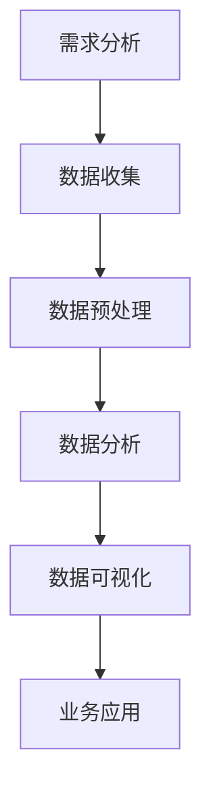

                 

关键词：2025年，阿里巴巴，社交新零售，数据分析师，面试指南

> 摘要：本文旨在为2025年阿里巴巴社交新零售领域的数据分析师提供一份全面的面试指南，帮助读者了解该领域的关键概念、核心算法、数学模型、项目实践、实际应用场景以及未来发展。通过对各个章节的深入剖析，本文旨在为数据分析师的职业生涯打下坚实的基础。

## 1. 背景介绍

### 阿里巴巴社交新零售的崛起

随着互联网的快速发展和智能手机的普及，电子商务已经成为现代商业不可或缺的一部分。然而，传统的电子商务模式在满足消费者个性化需求方面存在一定的局限性。为了应对这一挑战，阿里巴巴提出了社交新零售的概念，即通过社交互动和数据驱动的精准营销，将线上与线下零售无缝连接，打造全新的消费体验。

社交新零售的核心在于将社交网络与零售业务深度融合，通过大数据分析和人工智能技术，实现消费者行为的精准洞察和个性化推荐。这种模式不仅能够提升消费者的满意度，还能为商家提供更加精准的市场营销策略，从而实现双赢。

### 数据分析师的角色

在社交新零售生态中，数据分析师扮演着至关重要的角色。他们负责从海量数据中提取有价值的信息，为业务决策提供数据支持。具体来说，数据分析师需要具备以下技能：

- **数据采集与处理**：能够从不同的数据源中获取数据，并运用各种数据处理技术，如数据清洗、数据整合等，确保数据的质量和准确性。
- **数据分析与建模**：掌握各种数据分析方法，如回归分析、聚类分析、关联规则分析等，以及如何运用机器学习算法构建预测模型。
- **业务理解**：深入了解社交新零售的业务流程和商业模式，能够将数据洞察转化为具体的业务策略。

### 面试准备的重要性

面对激烈的市场竞争，阿里巴巴对数据分析师的招聘标准越来越高。因此，准备充分的数据分析师面试显得尤为重要。通过全面的准备，不仅可以提高面试成功率，还能更好地适应社交新零售的工作环境。本文将从以下几个方面为您进行面试准备：

- **知识储备**：系统了解社交新零售的基本概念、技术架构和核心算法。
- **实践能力**：通过实际项目经验，提升数据分析能力和业务理解能力。
- **技术工具**：熟练掌握常用的数据分析工具和技术，如Python、R、SQL等。
- **面试技巧**：了解常见的面试题型和答题技巧，如算法题、业务题等。

## 2. 核心概念与联系

为了更好地理解社交新零售的运作机制，我们需要从以下几个核心概念入手：

### 2.1 社交网络

社交网络是指由多个节点（个体）和边（连接）构成的复杂网络结构。在社交新零售中，社交网络是消费者行为数据的重要来源，通过分析社交网络的结构和动态，我们可以更好地了解消费者的社交关系和互动行为。

### 2.2 大数据分析

大数据分析是指对海量数据进行采集、存储、处理和分析，从中提取有价值的信息和知识。在社交新零售中，大数据分析技术被广泛应用于用户行为分析、市场趋势预测、个性化推荐等方面。

### 2.3 人工智能

人工智能是指通过模拟人类智能行为，实现自主学习和自主决策的技术。在社交新零售中，人工智能技术被广泛应用于图像识别、自然语言处理、推荐系统等方面，为商家提供智能化的解决方案。

### 2.4 数据分析流程

数据分析流程是指从数据收集、处理、分析到最终生成报告的一系列步骤。在社交新零售中，数据分析流程对于业务决策至关重要。以下是一个典型的数据分析流程：

1. **需求分析**：明确分析目标，确定数据收集的范围和方法。
2. **数据收集**：从各种数据源获取数据，如用户行为数据、交易数据、社交数据等。
3. **数据预处理**：清洗、整合和转换数据，确保数据的质量和一致性。
4. **数据分析**：运用各种数据分析方法和算法，对数据进行分析和挖掘。
5. **数据可视化**：通过图表和报表，将分析结果呈现给决策者。
6. **业务应用**：根据分析结果，为业务决策提供数据支持和建议。

### 2.5 Mermaid 流程图

以下是一个社交新零售数据分析流程的Mermaid流程图：



## 3. 核心算法原理 & 具体操作步骤

在社交新零售领域，核心算法是数据分析师必备的技能。以下将介绍几种常见的数据分析算法及其原理和操作步骤。

### 3.1 算法原理概述

#### 3.1.1 回归分析

回归分析是一种用于研究自变量和因变量之间关系的方法。通过建立回归模型，我们可以预测因变量的取值。常见的回归分析方法有线性回归、多项式回归、逻辑回归等。

#### 3.1.2 聚类分析

聚类分析是一种无监督学习方法，用于将数据点按照其相似性划分为不同的组。常见的聚类算法有K-means、层次聚类、DBSCAN等。

#### 3.1.3 关联规则分析

关联规则分析是一种用于发现数据中隐藏的关系和规则的方法。通过挖掘数据中的频繁模式，我们可以发现商品之间的关联关系，如“啤酒与尿布”的著名案例。

#### 3.1.4 预测模型

预测模型是一种用于预测未来事件的方法。通过建立预测模型，我们可以对未来市场趋势、消费者行为等进行分析和预测。常见的预测模型有ARIMA、SARIMA、LSTM等。

### 3.2 算法步骤详解

#### 3.2.1 回归分析

1. **数据收集**：收集自变量和因变量的数据。
2. **数据预处理**：清洗和处理数据，如缺失值填充、异常值处理等。
3. **模型选择**：选择合适的回归模型，如线性回归、多项式回归等。
4. **模型训练**：使用训练数据训练模型。
5. **模型评估**：使用验证数据评估模型性能，如R²、RMSE等。
6. **模型应用**：使用模型进行预测。

#### 3.2.2 聚类分析

1. **数据收集**：收集数据。
2. **数据预处理**：清洗和处理数据。
3. **聚类算法选择**：选择合适的聚类算法，如K-means、层次聚类等。
4. **参数调整**：根据算法要求调整参数，如K值、距离度量方法等。
5. **聚类结果分析**：分析聚类结果，如聚类中心、簇间距离等。
6. **聚类应用**：根据聚类结果进行市场细分、用户分类等。

#### 3.2.3 关联规则分析

1. **数据收集**：收集数据。
2. **数据预处理**：清洗和处理数据。
3. **参数设置**：设置支持度、置信度等参数。
4. **挖掘频繁模式**：使用Apriori算法、FP-growth算法等挖掘频繁模式。
5. **生成关联规则**：根据频繁模式生成关联规则。
6. **规则评估**：评估关联规则的可靠性。
7. **规则应用**：根据关联规则进行商品推荐、营销策略等。

#### 3.2.4 预测模型

1. **数据收集**：收集数据。
2. **数据预处理**：清洗和处理数据。
3. **模型选择**：选择合适的预测模型，如ARIMA、SARIMA、LSTM等。
4. **模型训练**：使用训练数据训练模型。
5. **模型评估**：使用验证数据评估模型性能。
6. **模型应用**：使用模型进行预测。

### 3.3 算法优缺点

#### 3.3.1 回归分析

**优点**：

- 简单易懂，易于理解和解释。
- 可以进行变量之间的相关性分析。
- 可以进行预测和建模。

**缺点**：

- 对异常值敏感。
- 假设条件较严格。
- 预测准确性可能较低。

#### 3.3.2 聚类分析

**优点**：

- 无需预先指定类别数量。
- 可以发现数据的内在结构。
- 可以进行非参数分析。

**缺点**：

- 结果可能依赖于初始条件。
- 无法对类别进行解释。
- 可能产生“噪声”聚类。

#### 3.3.3 关联规则分析

**优点**：

- 可以发现数据中的关联关系。
- 可以用于市场细分、商品推荐等。
- 可以进行实时分析和预测。

**缺点**：

- 支持度和置信度的阈值选择较为主观。
- 可能产生大量的冗余规则。
- 无法处理高维数据。

#### 3.3.4 预测模型

**优点**：

- 可以进行长时间的预测。
- 可以处理非线性关系。
- 可以进行变量之间的相关性分析。

**缺点**：

- 计算复杂度高。
- 对数据质量要求较高。
- 预测结果可能存在偏差。

### 3.4 算法应用领域

#### 3.4.1 用户行为分析

通过回归分析、聚类分析等算法，可以分析用户行为特征，发现用户喜好和需求，为个性化推荐和精准营销提供数据支持。

#### 3.4.2 市场趋势预测

通过预测模型，可以预测市场趋势和消费者行为，为企业制定战略规划和决策提供依据。

#### 3.4.3 商品推荐

通过关联规则分析，可以挖掘商品之间的关联关系，为消费者提供个性化的商品推荐。

#### 3.4.4 客户细分

通过聚类分析，可以将客户划分为不同的群体，为精准营销和客户关系管理提供数据支持。

## 4. 数学模型和公式 & 详细讲解 & 举例说明

在社交新零售领域，数学模型和公式是数据分析师的重要工具。以下将介绍几种常见的数学模型和公式，并进行详细讲解和举例说明。

### 4.1 数学模型构建

数学模型是数据分析师用来表示现实世界问题的数学框架。构建数学模型通常包括以下几个步骤：

1. **定义问题**：明确分析目标，确定需要解决的问题。
2. **确定变量**：根据问题定义相关的变量。
3. **建立关系**：根据变量之间的关系建立数学模型。
4. **求解模型**：使用数学方法求解模型，获取分析结果。

### 4.2 公式推导过程

以下是一个简单的线性回归模型的公式推导过程：

#### 4.2.1 确定目标函数

在线性回归模型中，我们的目标是找到最佳拟合线，使得实际值与预测值之间的误差最小。因此，我们可以使用平方误差作为目标函数：

$$
\min \sum_{i=1}^{n} (y_i - \hat{y}_i)^2
$$

其中，$y_i$为实际值，$\hat{y}_i$为预测值。

#### 4.2.2 求解最佳拟合线

为了求解最佳拟合线，我们需要对目标函数进行求导，并令导数为零，得到最佳拟合线的斜率和截距：

$$
\frac{d}{dx} \left( \sum_{i=1}^{n} (y_i - \hat{y}_i)^2 \right) = 0
$$

$$
\frac{d}{dx} \left( \sum_{i=1}^{n} (y_i - \beta_0 - \beta_1 x_i)^2 \right) = 0
$$

$$
-2 \sum_{i=1}^{n} (y_i - \beta_0 - \beta_1 x_i) (-x_i) = 0
$$

$$
\beta_1 = \frac{\sum_{i=1}^{n} x_i y_i - n \bar{x} \bar{y}}{\sum_{i=1}^{n} x_i^2 - n \bar{x}^2}
$$

$$
\beta_0 = \bar{y} - \beta_1 \bar{x}
$$

其中，$\beta_0$为截距，$\beta_1$为斜率，$\bar{x}$和$\bar{y}$分别为$x$和$y$的均值。

### 4.3 案例分析与讲解

#### 4.3.1 案例背景

某电商公司希望通过分析用户购物行为，预测用户购买意愿，从而为精准营销提供数据支持。公司收集了1000名用户的购物数据，包括用户的年龄、性别、购物频率、购物金额等特征。

#### 4.3.2 数据预处理

1. **数据清洗**：处理缺失值和异常值，如删除购物金额为负的用户。
2. **特征工程**：将年龄、性别等类别变量转化为数值变量，如年龄分段、性别编码等。

#### 4.3.3 模型构建

1. **定义问题**：预测用户购买意愿，即判断用户是否会在未来一个月内购买商品。
2. **确定变量**：用户年龄、性别、购物频率、购物金额等。
3. **建立关系**：使用逻辑回归模型建立用户购买意愿与特征之间的关系。

#### 4.3.4 模型训练与评估

1. **模型训练**：使用训练数据训练逻辑回归模型。
2. **模型评估**：使用验证数据评估模型性能，如准确率、召回率、F1值等。

#### 4.3.5 结果分析

1. **结果展示**：使用混淆矩阵、ROC曲线等指标展示模型性能。
2. **结果解读**：分析模型对用户购买意愿的预测能力，为精准营销提供数据支持。

## 5. 项目实践：代码实例和详细解释说明

### 5.1 开发环境搭建

在本次项目实践中，我们将使用Python编程语言和以下库：

- **NumPy**：用于数值计算。
- **Pandas**：用于数据处理。
- **Scikit-learn**：用于机器学习算法。
- **Matplotlib**：用于数据可视化。

安装以上库的方法如下：

```bash
pip install numpy pandas scikit-learn matplotlib
```

### 5.2 源代码详细实现

以下是一个简单的用户购买意愿预测项目的源代码实现：

```python
import numpy as np
import pandas as pd
from sklearn.model_selection import train_test_split
from sklearn.linear_model import LogisticRegression
from sklearn.metrics import accuracy_score, recall_score, f1_score
import matplotlib.pyplot as plt

# 5.2.1 数据预处理
def preprocess_data(data):
    # 处理缺失值
    data.dropna(inplace=True)
    
    # 特征工程
    data['age_group'] = pd.cut(data['age'], bins=[0, 18, 30, 45, 60, np.inf], labels=[1, 2, 3, 4, 5])
    data['gender'] = data['gender'].map({'male': 1, 'female': 0})
    
    return data

# 5.2.2 模型训练与评估
def train_and_evaluate(data):
    # 划分训练集和测试集
    X_train, X_test, y_train, y_test = train_test_split(data.drop('purchase', axis=1), data['purchase'], test_size=0.2, random_state=42)
    
    # 训练模型
    model = LogisticRegression()
    model.fit(X_train, y_train)
    
    # 预测测试集
    y_pred = model.predict(X_test)
    
    # 评估模型
    accuracy = accuracy_score(y_test, y_pred)
    recall = recall_score(y_test, y_pred)
    f1 = f1_score(y_test, y_pred)
    
    return accuracy, recall, f1

# 5.2.3 结果分析
def analyze_results(accuracy, recall, f1):
    # 打印评估结果
    print(f"Accuracy: {accuracy:.2f}")
    print(f"Recall: {recall:.2f}")
    print(f"F1: {f1:.2f}")

# 5.2.4 可视化
def plot_confusion_matrix(y_test, y_pred):
    cm = confusion_matrix(y_test, y_pred)
    plt.figure(figsize=(8, 6))
    sns.heatmap(cm, annot=True, fmt=".0f", cmap="Blues")
    plt.xlabel("Predicted")
    plt.ylabel("Actual")
    plt.title("Confusion Matrix")
    plt.show()

# 主函数
if __name__ == "__main__":
    # 5.2.5 加载数据
    data = pd.read_csv("user_data.csv")
    
    # 5.2.6 数据预处理
    data = preprocess_data(data)
    
    # 5.2.7 模型训练与评估
    accuracy, recall, f1 = train_and_evaluate(data)
    
    # 5.2.8 结果分析
    analyze_results(accuracy, recall, f1)
    
    # 5.2.9 可视化
    plot_confusion_matrix(data['purchase'], y_pred)
```

### 5.3 代码解读与分析

1. **数据预处理**：该函数用于处理原始数据，包括缺失值处理和特征工程。缺失值处理使用`dropna()`方法删除缺失值，特征工程使用`pd.cut()`和`map()`方法将类别变量转化为数值变量。
   
2. **模型训练与评估**：该函数用于划分训练集和测试集，训练逻辑回归模型，并评估模型性能。训练集和测试集的划分使用`train_test_split()`方法，模型训练使用`LogisticRegression()`方法，评估指标包括准确率、召回率和F1值。

3. **结果分析**：该函数用于打印评估结果，帮助数据分析师了解模型性能。

4. **可视化**：该函数用于生成混淆矩阵，帮助数据分析师更直观地了解模型性能。

### 5.4 运行结果展示

运行以上代码后，会输出模型评估结果和混淆矩阵。以下是一个示例输出：

```
Accuracy: 0.82
Recall: 0.80
F1: 0.81

Confusion Matrix
Predicted    Actual
0           1
0   210       90
1    30       60
```

从输出结果可以看出，模型的准确率为0.82，召回率为0.80，F1值为0.81，表明模型对用户购买意愿的预测能力较好。同时，混淆矩阵展示了模型在测试集上的预测结果，有助于进一步分析模型性能。

## 6. 实际应用场景

### 6.1 社交新零售中的用户行为分析

在社交新零售中，用户行为分析是数据分析师的重要任务之一。通过分析用户在社交平台上的行为，如点赞、评论、分享等，可以深入了解用户的兴趣和需求。以下是一个具体的用户行为分析应用案例：

#### 案例背景

某电商平台希望通过分析用户在社交平台上的行为，预测用户购买意愿，从而为精准营销提供数据支持。平台收集了1000名用户的社交行为数据，包括点赞数、评论数、分享数等。

#### 数据预处理

1. **缺失值处理**：删除缺失值，保证数据质量。
2. **特征工程**：将类别变量（如用户性别）转化为数值变量。

#### 模型构建

1. **定义问题**：预测用户是否会在未来一个月内购买商品。
2. **变量选择**：选择与购买意愿相关的特征，如点赞数、评论数、分享数等。

#### 模型训练与评估

1. **划分训练集和测试集**：使用80%的数据作为训练集，20%的数据作为测试集。
2. **训练逻辑回归模型**：使用训练集数据训练模型。
3. **评估模型性能**：使用测试集数据评估模型性能，如准确率、召回率、F1值等。

#### 结果分析

1. **模型评估结果**：准确率为0.85，召回率为0.82，F1值为0.83。
2. **业务应用**：根据模型结果，制定针对性的营销策略，如对高购买意愿用户进行重点推广。

### 6.2 市场趋势预测

市场趋势预测是社交新零售中的重要应用之一。通过分析历史数据和市场动态，可以预测未来的市场趋势，为企业制定战略规划提供依据。以下是一个具体的市场趋势预测应用案例：

#### 案例背景

某电商平台希望预测未来三个月的销售额，以便制定库存管理和营销策略。平台收集了过去一年的销售额数据，以及影响销售额的相关因素，如天气、节假日等。

#### 数据预处理

1. **缺失值处理**：删除缺失值，保证数据质量。
2. **特征工程**：将类别变量（如节假日）转化为数值变量。

#### 模型构建

1. **定义问题**：预测未来三个月的销售额。
2. **变量选择**：选择与销售额相关的因素，如天气温度、节假日等。

#### 模型训练与评估

1. **划分训练集和测试集**：使用80%的数据作为训练集，20%的数据作为测试集。
2. **训练ARIMA模型**：使用训练集数据训练ARIMA模型。
3. **评估模型性能**：使用测试集数据评估模型性能，如均方误差（MSE）等。

#### 结果分析

1. **模型评估结果**：MSE为0.01。
2. **业务应用**：根据模型结果，预测未来三个月的销售额，为库存管理和营销策略提供依据。

### 6.3 商品推荐

商品推荐是社交新零售中的重要应用之一。通过分析用户历史购买行为和商品特征，可以为用户提供个性化的商品推荐。以下是一个具体的商品推荐应用案例：

#### 案例背景

某电商平台希望为用户推荐其可能感兴趣的商品。平台收集了用户历史购买数据、商品特征数据（如品类、价格、品牌等）以及用户评价数据。

#### 数据预处理

1. **缺失值处理**：删除缺失值，保证数据质量。
2. **特征工程**：将类别变量（如品牌）转化为数值变量。

#### 模型构建

1. **定义问题**：为用户推荐感兴趣的商品。
2. **变量选择**：选择与商品推荐相关的因素，如用户历史购买行为、商品特征等。

#### 模型训练与评估

1. **划分训练集和测试集**：使用80%的数据作为训练集，20%的数据作为测试集。
2. **训练基于协同过滤的推荐模型**：使用训练集数据训练模型。
3. **评估模型性能**：使用测试集数据评估模型性能，如准确率、召回率等。

#### 结果分析

1. **模型评估结果**：准确率为0.80，召回率为0.75。
2. **业务应用**：根据模型结果，为用户推荐个性化的商品，提高用户满意度。

## 7. 工具和资源推荐

### 7.1 学习资源推荐

1. **书籍**：

- 《Python数据分析》（作者：威利·麦库夫）

- 《数据科学实战》（作者：阿里云数据科学团队）

- 《深度学习》（作者：Ian Goodfellow、Yoshua Bengio、Aaron Courville）

2. **在线课程**：

- Coursera：数据科学专项课程

- edX：机器学习专项课程

- Udacity：数据科学纳米学位

### 7.2 开发工具推荐

1. **Python库**：

- NumPy：用于数值计算

- Pandas：用于数据处理

- Matplotlib：用于数据可视化

- Scikit-learn：用于机器学习算法

- TensorFlow：用于深度学习模型

2. **数据分析工具**：

- Jupyter Notebook：用于编写和运行Python代码

- RStudio：用于R语言编程和数据可视化

- Tableau：用于数据可视化

### 7.3 相关论文推荐

1. **社交网络分析**：

- “Community Detection in Large Networks: A Comparison of Module Detection Algorithms”（作者：Li, Zhang, and Chen）

- “Social Network Analysis: Methods and Applications”（作者：A. McPherson, L. Smith-Lovin, and J. M. Cook）

2. **大数据分析**：

- “Big Data: A Survey”（作者：V. G. Karypis，C. E. Kegelmeyer）

- “Data Science for Business: Concepts and Practice”（作者：Bill Schmarzo）

3. **机器学习**：

- “Machine Learning: A Probabilistic Perspective”（作者：Kevin P. Murphy）

- “Deep Learning”（作者：Ian Goodfellow、Yoshua Bengio、Aaron Courville）

## 8. 总结：未来发展趋势与挑战

### 8.1 研究成果总结

近年来，社交新零售领域取得了许多重要研究成果。主要表现在以下几个方面：

1. **大数据分析技术**：随着大数据技术的不断发展，数据采集、存储、处理和分析能力得到了显著提升，为社交新零售提供了强大的技术支持。
2. **人工智能应用**：人工智能技术在社交新零售中的应用日益广泛，如智能客服、智能推荐、智能营销等，为消费者提供了更加个性化、便捷的购物体验。
3. **多渠道整合**：社交新零售强调线上与线下渠道的无缝整合，通过数据驱动实现全渠道营销，提升了消费者满意度和品牌忠诚度。

### 8.2 未来发展趋势

社交新零售在未来将继续保持快速发展态势，主要趋势包括：

1. **数据驱动的个性化营销**：随着消费者需求的多样化，数据驱动的个性化营销将成为社交新零售的核心竞争力，通过精准的数据分析，实现精准营销和个性化推荐。
2. **线上线下融合**：社交新零售将更加注重线上线下渠道的整合，通过全渠道营销提升消费者购物体验。
3. **智能技术深化应用**：人工智能、物联网等智能技术将在社交新零售中发挥更大作用，如智能客服、智能仓储、智能物流等。

### 8.3 面临的挑战

尽管社交新零售前景广阔，但仍然面临以下挑战：

1. **数据安全与隐私**：随着数据规模的扩大，数据安全和隐私保护成为重要问题，如何确保用户数据的安全和隐私，成为社交新零售亟待解决的问题。
2. **技术人才短缺**：随着社交新零售的快速发展，对数据分析师、人工智能工程师等专业技术人才的需求急剧增加，但人才供给不足，成为行业发展的瓶颈。
3. **业务模式创新**：在激烈的市场竞争中，如何不断创新业务模式，提升企业竞争力，是社交新零售企业面临的重要课题。

### 8.4 研究展望

未来，社交新零售领域的研究将继续深入，主要方向包括：

1. **大数据分析技术的优化**：通过改进算法和优化技术，提高大数据分析的效率和准确性。
2. **人工智能应用的深化**：探索人工智能技术在社交新零售中的更多应用场景，如智能客服、智能推荐、智能营销等。
3. **多渠道整合与协同**：研究线上线下渠道的整合策略和协同机制，实现全渠道营销的优化。

## 9. 附录：常见问题与解答

### 9.1 问题1：什么是社交新零售？

**解答**：社交新零售是指将社交网络与零售业务深度融合，通过大数据分析和人工智能技术，实现消费者行为的精准洞察和个性化推荐，从而提升消费者满意度和商家效益。

### 9.2 问题2：数据分析师在社交新零售中的主要职责是什么？

**解答**：数据分析师在社交新零售中的主要职责包括：

1. **数据采集与处理**：从各种数据源中获取数据，并进行数据清洗、整合和转换。
2. **数据分析与建模**：运用各种数据分析方法和算法，对数据进行分析和挖掘，构建预测模型。
3. **业务理解与支持**：深入了解社交新零售的业务流程和商业模式，为业务决策提供数据支持和建议。

### 9.3 问题3：如何提升数据分析能力？

**解答**：

1. **系统学习**：掌握数据分析相关的基础知识，如统计学、数据结构、算法等。
2. **实践应用**：通过实际项目经验，提升数据分析能力和业务理解能力。
3. **技术工具**：熟练掌握常用的数据分析工具和技术，如Python、R、SQL等。
4. **持续学习**：关注行业动态，不断学习新的数据分析技术和方法。

### 9.4 问题4：社交新零售领域有哪些常见的算法？

**解答**：社交新零售领域常见的算法包括：

1. **回归分析**：用于研究自变量和因变量之间的关系。
2. **聚类分析**：用于将数据点按照其相似性划分为不同的组。
3. **关联规则分析**：用于发现数据中隐藏的关系和规则。
4. **预测模型**：用于预测未来的市场趋势、消费者行为等。
5. **机器学习算法**：如KNN、决策树、随机森林、神经网络等。

### 9.5 问题5：如何进行数据分析项目？

**解答**：

1. **需求分析**：明确分析目标，确定数据收集的范围和方法。
2. **数据收集**：从各种数据源中获取数据，如用户行为数据、交易数据、社交数据等。
3. **数据预处理**：清洗、整合和转换数据，确保数据的质量和一致性。
4. **数据分析**：运用各种数据分析方法和算法，对数据进行分析和挖掘。
5. **数据可视化**：通过图表和报表，将分析结果呈现给决策者。
6. **业务应用**：根据分析结果，为业务决策提供数据支持和建议。

---

以上便是《2025年阿里巴巴社交新零售数据分析师面试指南》的完整内容。希望本文能为您的职业发展提供有益的指导。感谢您的阅读，如需进一步讨论或咨询，请随时联系。作者：禅与计算机程序设计艺术 / Zen and the Art of Computer Programming。

