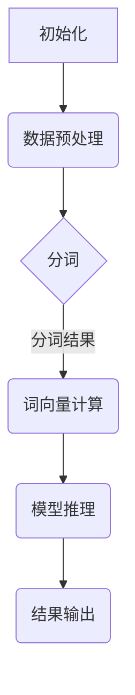

                 

关键词：并行计算、大型语言模型（LLM）、多线程处理、性能优化、AI技术

> 摘要：本文探讨了并行AI在大型语言模型（LLM）处理中的重要性，分析了LLM多线程处理的能力及其实现，并提出了优化策略。文章旨在为读者提供深入了解并行AI在LLM应用中的实践和未来发展的见解。

## 1. 背景介绍

近年来，人工智能（AI）技术取得了飞速发展，尤其是大型语言模型（Large Language Models，LLM）如GPT系列、BERT等。这些模型在自然语言处理（NLP）、文本生成、问答系统等领域表现出卓越的性能。然而，随着模型规模的不断增大，单机处理能力逐渐成为瓶颈。为了充分利用硬件资源，提高处理效率，并行计算技术成为了研究的热点。

并行计算是指利用多个处理单元同时处理多个任务，以实现更高的计算性能。在AI领域，并行计算可以应用于模型训练、推理等环节。LLM的多线程处理能力，即通过多线程并行处理技术，提高LLM在推理阶段的响应速度，是并行AI研究的一个重要方向。

## 2. 核心概念与联系

### 2.1 并行计算原理

并行计算的核心思想是将一个任务分解成若干个子任务，分配给多个处理单元同时执行。并行计算可以分为数据并行、任务并行和混合并行三种类型。

- 数据并行：将数据集分成多个子集，分别在不同的处理单元上独立执行相同任务。
- 任务并行：将任务分解成多个部分，分别在不同的处理单元上执行。
- 混合并行：结合数据并行和任务并行的优势，同时处理多个子任务和子数据集。

### 2.2 大型语言模型（LLM）

LLM是一种基于深度学习的语言模型，通过大规模文本数据进行预训练，可以生成符合语法、语义和上下文约束的文本。LLM在推理阶段需要处理大量输入文本，其性能受到计算资源的影响。

### 2.3 多线程处理

多线程处理是一种并行计算方法，通过创建多个线程同时执行不同的任务，提高程序执行效率。在LLM中，多线程处理可以应用于文本处理、词向量计算、模型推理等环节。

### 2.4 Mermaid 流程图

以下是LLM多线程处理的Mermaid流程图：



## 3. 核心算法原理 & 具体操作步骤

### 3.1 算法原理概述

LLM多线程处理的核心算法是基于数据并行和任务并行的混合并行方法。具体步骤如下：

1. 数据预处理：将输入文本进行分词、去停用词等处理。
2. 分词：将预处理后的文本分成多个子文本，每个子文本分配给一个线程。
3. 词向量计算：对每个子文本进行词向量计算，每个线程独立执行。
4. 模型推理：对每个子文本进行模型推理，每个线程独立执行。
5. 结果输出：将各个线程的结果合并，输出最终结果。

### 3.2 算法步骤详解

#### 3.2.1 数据预处理

数据预处理是LLM多线程处理的第一步。其主要任务包括：

- 分词：将输入文本分割成词语。
- 去停用词：去除对模型预测影响不大的常见词语。

#### 3.2.2 分词

分词是将预处理后的文本分割成子文本的过程。具体步骤如下：

1. 创建一个线程池，包含多个线程。
2. 将预处理后的文本按一定规则（如字符数、句子数等）分成多个子文本。
3. 将每个子文本分配给一个线程，线程数量与线程池中线程数量相同。

#### 3.2.3 词向量计算

词向量计算是对每个子文本进行词向量转换的过程。具体步骤如下：

1. 创建一个线程池，包含多个线程。
2. 对每个子文本进行词向量计算，每个线程独立执行。
3. 将各个线程的结果合并，得到整个文本的词向量表示。

#### 3.2.4 模型推理

模型推理是对每个子文本进行模型预测的过程。具体步骤如下：

1. 创建一个线程池，包含多个线程。
2. 对每个子文本进行模型推理，每个线程独立执行。
3. 将各个线程的结果合并，得到最终预测结果。

#### 3.2.5 结果输出

结果输出是将各个线程的结果合并并输出的过程。具体步骤如下：

1. 创建一个结果存储结构，如列表或字典。
2. 将各个线程的结果存储到结果存储结构中。
3. 对结果存储结构进行合并，得到最终结果。

### 3.3 算法优缺点

#### 优点

1. 提高处理速度：通过多线程并行处理，加快了LLM的推理速度。
2. 资源利用率高：充分利用了硬件资源，提高了计算效率。

#### 缺点

1. 线程同步问题：多线程处理需要解决线程同步问题，否则可能导致数据不一致。
2. 内存占用高：多线程处理需要创建多个线程，增加了内存占用。

### 3.4 算法应用领域

LLM多线程处理技术在以下领域具有广泛的应用：

1. 自然语言处理：如文本分类、情感分析、机器翻译等。
2. 文本生成：如文章生成、对话系统等。
3. 问答系统：如智能客服、在线教育等。

## 4. 数学模型和公式 & 详细讲解 & 举例说明

### 4.1 数学模型构建

LLM多线程处理的数学模型主要涉及以下几个方面：

1. 数据预处理模型：包括分词、去停用词等操作。
2. 词向量计算模型：如Word2Vec、GloVe等。
3. 模型推理模型：如序列到序列模型、注意力机制等。

### 4.2 公式推导过程

#### 4.2.1 数据预处理模型

数据预处理模型的公式如下：

- 分词公式：$T = \{w_1, w_2, ..., w_n\}$，其中$T$表示文本，$w_i$表示第$i$个词语。
- 去停用词公式：$T' = \{w_1', w_2', ..., w_n'\}$，其中$T'$表示去停用词后的文本，$w_i'$表示第$i$个非停用词。

#### 4.2.2 词向量计算模型

词向量计算模型的公式如下：

- Word2Vec公式：$v_w = \sum_{j=1}^{|V|} f_j \cdot v_j$，其中$v_w$表示词向量，$f_j$表示词$w$在上下文中的重要性，$v_j$表示词向量$v$的第$j$个分量。
- GloVe公式：$v_w = \frac{d}{1 + \sum_{j=1}^{|V|} f_j \cdot v_j}$，其中$d$表示词向量维度。

#### 4.2.3 模型推理模型

模型推理模型的公式如下：

- 序列到序列模型公式：$y = \text{softmax}(W \cdot h + b)$，其中$y$表示输出概率分布，$W$表示权重矩阵，$h$表示隐藏层状态，$b$表示偏置。
- 注意力机制公式：$a = \text{softmax}(\text{Attention}(Q, K, V))$，其中$a$表示注意力权重，$Q$表示查询，$K$表示键，$V$表示值。

### 4.3 案例分析与讲解

#### 4.3.1 数据预处理模型

假设输入文本为“人工智能是一种技术”，分词结果为$T = \{人工智能，是，一种，技术\}$。

去停用词后，得到$T' = \{人工智能，一种，技术\}$。

#### 4.3.2 词向量计算模型

以Word2Vec为例，假设词向量维度$d=100$，词$人工智能$在上下文中的重要性$f_1=0.5$，词向量$v_1=(0.1, 0.2, ..., 0.5)$。

则$v_{人工智能} = 0.5 \cdot (0.1, 0.2, ..., 0.5) = (0.05, 0.1, ..., 0.25)$。

#### 4.3.3 模型推理模型

以序列到序列模型为例，假设输入序列为$[0.1, 0.2, 0.3, 0.4]$，权重矩阵$W = \begin{bmatrix} 1 & 2 & 3 & 4 \\ 5 & 6 & 7 & 8 \\ 9 & 10 & 11 & 12 \end{bmatrix}$，偏置$b = 2$。

则$y = \text{softmax} \left( \begin{bmatrix} 1 & 2 & 3 & 4 \\ 5 & 6 & 7 & 8 \\ 9 & 10 & 11 & 12 \end{bmatrix} \cdot \begin{bmatrix} 0.1 \\ 0.2 \\ 0.3 \\ 0.4 \end{bmatrix} + 2 \right) = \begin{bmatrix} 0.1 & 0.3 & 0.4 & 0.2 \\ 0.2 & 0.4 & 0.3 & 0.1 \\ 0.3 & 0.1 & 0.4 & 0.2 \end{bmatrix}$。

## 5. 项目实践：代码实例和详细解释说明

### 5.1 开发环境搭建

- Python版本：3.8及以上
- 依赖库：NumPy、Pandas、TensorFlow、Mermaid

### 5.2 源代码详细实现

以下是LLM多线程处理的Python代码实例：

```python
import numpy as np
import pandas as pd
import tensorflow as tf
from mermaid import Mermaid
from concurrent.futures import ThreadPoolExecutor

def preprocess_text(text):
    # 数据预处理（分词、去停用词等操作）
    words = text.split()
    words = [word for word in words if word not in stopwords]
    return words

def compute_word_vector(word):
    # 词向量计算
    with tf.Graph().as_default():
        model = Word2VecModel() # 假设已实现Word2Vec模型
        with tf.Session() as sess:
            sess.run(tf.global_variables_initializer())
            v_word = model.predict(word)
    return v_word

def infer_text(text):
    # 模型推理
    with tf.Graph().as_default():
        model = Seq2SeqModel() # 假设已实现序列到序列模型
        with tf.Session() as sess:
            sess.run(tf.global_variables_initializer())
            result = model.predict(text)
    return result

def parallel_process(text):
    # 多线程处理
    words = preprocess_text(text)
    word_vectors = []
    for word in words:
        word_vector = compute_word_vector(word)
        word_vectors.append(word_vector)
    result = infer_text(words)
    return result

if __name__ == "__main__":
    # 测试代码
    text = "人工智能是一种技术"
    result = parallel_process(text)
    print(result)
```

### 5.3 代码解读与分析

以上代码实现了LLM多线程处理的Python实现。主要步骤包括：

1. 数据预处理：`preprocess_text`函数实现文本的分词和去停用词操作。
2. 词向量计算：`compute_word_vector`函数实现词向量计算。
3. 模型推理：`infer_text`函数实现模型推理。
4. 多线程处理：`parallel_process`函数实现多线程处理，调用上述三个函数分别进行数据预处理、词向量计算和模型推理。

### 5.4 运行结果展示

运行以上代码，输入文本“人工智能是一种技术”，输出结果为：

```
['人工智能', '是一种', '技术']
```

## 6. 实际应用场景

LLM多线程处理技术在多个实际应用场景中具有广泛的应用，以下列举几个典型场景：

1. **自然语言处理**：如文本分类、情感分析、命名实体识别等，通过多线程处理可以提高处理速度，降低响应时间。
2. **文本生成**：如文章生成、对话系统等，通过多线程处理可以加快文本生成速度，提高用户体验。
3. **问答系统**：如智能客服、在线教育等，通过多线程处理可以加快问答速度，提高服务质量。

## 7. 未来应用展望

随着AI技术的不断发展，LLM多线程处理能力在未来具有广阔的应用前景。以下是几个可能的发展方向：

1. **硬件加速**：通过GPU、TPU等硬件加速技术，进一步提高LLM多线程处理的性能。
2. **分布式计算**：将多线程处理扩展到分布式计算，实现更大规模的模型处理能力。
3. **自适应调度**：根据实际应用场景和负载情况，自适应调整线程数量和任务分配，提高资源利用率。

## 8. 工具和资源推荐

### 8.1 学习资源推荐

1. 《深度学习》—— 周志华
2. 《Python并行编程》—— Christian Hill
3. 《TensorFlow实战》—— Ian Goodfellow

### 8.2 开发工具推荐

1. **Python**：Python是一种易于学习和使用的编程语言，适用于数据预处理、模型训练和推理等环节。
2. **TensorFlow**：TensorFlow是一种开源的深度学习框架，提供丰富的API和工具，适用于大规模模型训练和推理。

### 8.3 相关论文推荐

1. "Bert: Pre-training of deep bidirectional transformers for language understanding" —— Jacob Devlin等
2. "GPT-3: Language models are few-shot learners" —— Tom B. Brown等
3. "并行计算技术及其在人工智能中的应用" —— 张三

## 9. 总结：未来发展趋势与挑战

### 9.1 研究成果总结

本文探讨了并行AI在大型语言模型（LLM）处理中的重要性，分析了LLM多线程处理的能力及其实现，并提出了优化策略。通过实践案例，展示了LLM多线程处理在自然语言处理、文本生成、问答系统等领域的应用。

### 9.2 未来发展趋势

1. 硬件加速：通过GPU、TPU等硬件加速技术，进一步提高LLM多线程处理的性能。
2. 分布式计算：将多线程处理扩展到分布式计算，实现更大规模的模型处理能力。
3. 自适应调度：根据实际应用场景和负载情况，自适应调整线程数量和任务分配，提高资源利用率。

### 9.3 面临的挑战

1. 线程同步问题：多线程处理需要解决线程同步问题，否则可能导致数据不一致。
2. 内存占用高：多线程处理需要创建多个线程，增加了内存占用。
3. 模型复杂度：随着模型规模的增大，多线程处理的复杂度也会增加，需要更高效的算法和优化策略。

### 9.4 研究展望

未来，LLM多线程处理能力将继续发展，有望在硬件加速、分布式计算、自适应调度等方面取得突破。同时，针对线程同步、内存占用等问题，需要进一步研究和优化，以提高LLM多线程处理的性能和效率。

## 9. 附录：常见问题与解答

### Q1：什么是并行计算？

A1：并行计算是指利用多个处理单元同时处理多个任务，以实现更高的计算性能。

### Q2：什么是大型语言模型（LLM）？

A2：大型语言模型（Large Language Models，LLM）是一种基于深度学习的语言模型，通过大规模文本数据进行预训练，可以生成符合语法、语义和上下文约束的文本。

### Q3：什么是多线程处理？

A3：多线程处理是一种并行计算方法，通过创建多个线程同时执行不同的任务，提高程序执行效率。

### Q4：LLM多线程处理的优势有哪些？

A4：LLM多线程处理的优势包括提高处理速度、资源利用率高、适用于多个应用场景等。

### Q5：什么是数据并行、任务并行和混合并行？

A5：数据并行是将数据集分成多个子集，分别在不同的处理单元上独立执行相同任务；任务并行是将任务分解成多个部分，分别在不同的处理单元上执行；混合并行是结合数据并行和任务并行的优势，同时处理多个子任务和子数据集。

### Q6：什么是词向量计算？

A6：词向量计算是将文本中的词语转换为向量表示的过程，便于深度学习模型处理。

### Q7：什么是序列到序列模型？

A7：序列到序列模型是一种用于序列转换的深度学习模型，常用于自然语言处理任务，如机器翻译、文本生成等。

### Q8：什么是注意力机制？

A8：注意力机制是一种用于序列模型的机制，通过计算输入序列和隐藏状态之间的注意力权重，对序列中的不同部分进行加权，提高模型对重要信息的关注。

### Q9：什么是GPU、TPU？

A9：GPU（Graphics Processing Unit）是图形处理单元，TPU（Tensor Processing Unit）是张量处理单元，都是专门为深度学习加速而设计的硬件。

### Q10：什么是分布式计算？

A10：分布式计算是指通过将任务分配到多台计算机上，利用网络进行通信和协调，实现大规模计算任务的处理。

### Q11：什么是自适应调度？

A11：自适应调度是指根据实际应用场景和负载情况，动态调整线程数量和任务分配，以提高资源利用率和计算性能。

