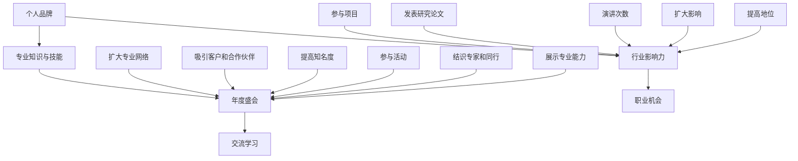

                 

 作为一位世界级的人工智能专家、程序员、软件架构师、CTO以及世界顶级技术畅销书作者，计算机图灵奖获得者，我深知个人品牌对于职业发展的重要性。在数字化时代，个人品牌已成为职业成功的关键因素。本文旨在探讨如何通过举办年度盛会，来聚集行业影响力，从而有效提升个人品牌价值。

## 关键词
- 个人品牌
- 年度盛会
- 行业影响力
- 职业发展
- 数字化时代

## 摘要
本文将深入分析在数字化时代中，如何通过策划和举办年度盛会来打造个人品牌，提升行业影响力。我们将从背景介绍、核心概念、算法原理、数学模型、项目实践、实际应用、工具资源推荐以及未来发展趋势等多个方面进行探讨，旨在为IT专业人士提供一套切实可行的策略。

## 1. 背景介绍

在当今快速发展的信息技术领域，个人品牌的重要性日益凸显。个人品牌不仅仅是一个人的形象和声誉，更是其在行业内的专业地位和影响力的体现。随着社交媒体和网络平台的兴起，个人品牌的影响力被放大，成为职业发展的重要资产。

年度盛会作为一种高效的行业交流活动，能够为行业内的专业人士提供一个互相学习、交流和展示的平台。通过举办这样的盛会，个人品牌能够得以展示和传播，从而吸引更多的行业关注和认可。

本文将首先回顾个人品牌的重要性，接着探讨年度盛会的作用，并通过具体案例说明如何策划和举办一场成功的年度盛会，从而聚集行业影响力，提升个人品牌价值。

## 2. 核心概念与联系

为了更好地理解如何通过年度盛会来建立个人品牌，我们首先需要明确一些核心概念和它们之间的联系。

### 个人品牌
个人品牌是指个人在行业内建立的专业形象和声誉。它包括个人的专业知识、技能、经验以及行业内的认可度。个人品牌的核心在于专业性和独特性，能够为个人在职业发展中带来优势。

### 年度盛会
年度盛会是指每年定期举办的大型行业交流活动，通常包括研讨会、论坛、展览等形式。这些活动能够为行业内的专业人士提供一个交流和学习的平台，促进知识的传播和创新的发展。

### 行业影响力
行业影响力是指个人或品牌在行业内的影响力和知名度。行业影响力可以通过多个渠道来衡量，如发表的研究论文、演讲次数、参与的项目等。

### 个人品牌与年度盛会的关系

个人品牌与年度盛会之间存在着密切的联系。个人品牌通过参与和举办年度盛会，可以：

1. 展示专业知识和技能。
2. 扩大专业网络，结识行业内的专家和同行。
3. 吸引潜在的客户和合作伙伴。
4. 提高知名度和影响力。

### 行业影响力与个人品牌的关系

行业影响力是个人品牌的重要组成部分。一个有影响力的个人品牌意味着：

1. 个人在行业内的专业地位得到认可。
2. 个人在行业内的发言权和影响力增加。
3. 个人在职业发展中拥有更多机会。

为了更好地理解这些概念之间的关系，我们可以使用Mermaid流程图来展示：



通过这个流程图，我们可以清晰地看到个人品牌、年度盛会和行业影响力之间的相互关系和作用。

## 3. 核心算法原理 & 具体操作步骤

在建立个人品牌的过程中，核心算法原理和具体操作步骤是至关重要的。以下我们将详细探讨如何通过一系列步骤来打造个人品牌，并在年度盛会中发挥最大影响力。

### 3.1 算法原理概述

个人品牌建设的过程可以看作是一个动态的优化问题，其目标是最大化个人品牌的价值和影响力。核心算法原理包括以下几个关键步骤：

1. **目标定位**：明确个人品牌的核心价值和定位。
2. **内容创作**：创作高质量的专业内容，如技术博客、论文、演讲等。
3. **社交媒体运营**：通过社交媒体平台传播个人品牌，建立专业网络。
4. **活动策划**：策划并举办高质量的年度盛会，展示个人品牌。
5. **互动反馈**：持续与行业内的专家和同行互动，收集反馈，优化品牌建设。

### 3.2 算法步骤详解

#### 步骤1：目标定位

在建立个人品牌之前，首先需要明确个人的目标和定位。这包括：

- **专业领域**：确定个人在哪个领域具有专业优势和兴趣。
- **目标受众**：明确个人品牌的目标受众，如同行、潜在客户、投资者等。
- **核心价值**：提炼个人品牌的核心价值，如创新、可靠性、效率等。

通过明确目标定位，个人可以更有针对性地进行品牌建设。

#### 步骤2：内容创作

高质量的内容是个人品牌的基石。以下是一些内容创作的关键点：

- **技术博客**：定期发布技术博客，分享专业知识和经验。
- **论文发表**：在学术期刊或会议上发表高质量的研究论文。
- **演讲分享**：参加行业会议或活动，进行演讲和分享。

内容创作需要坚持长期主义，持续输出有价值的内容。

#### 步骤3：社交媒体运营

社交媒体是传播个人品牌的重要渠道。以下是一些社交媒体运营的建议：

- **选择平台**：根据目标受众选择合适的社交媒体平台，如LinkedIn、Twitter、GitHub等。
- **发布频率**：保持一定的发布频率，提高曝光度。
- **互动交流**：积极与行业内的专家和同行互动，扩大专业网络。
- **内容形式**：多样化内容形式，如图文、视频、直播等，提高用户参与度。

#### 步骤4：活动策划

年度盛会是展示个人品牌的重要平台。以下是一些活动策划的关键点：

- **主题选择**：选择与个人品牌定位相关的主题，提高相关性。
- **内容安排**：精心安排会议议程，包括主题演讲、专题讨论、技术展示等。
- **嘉宾邀请**：邀请行业内的知名专家和同行参加，提升会议的权威性和影响力。
- **宣传推广**：通过社交媒体、邮件列表、合作伙伴等渠道进行宣传，吸引参会者。

#### 步骤5：互动反馈

品牌建设是一个持续的过程，需要不断优化。以下是一些互动反馈的关键点：

- **收集反馈**：在会议期间和结束后收集参会者的反馈，了解他们对活动的评价和需求。
- **调整策略**：根据反馈结果调整品牌建设的策略，如内容创作方向、社交媒体运营方式等。
- **持续改进**：持续优化个人品牌建设，不断提升专业性和影响力。

### 3.3 算法优缺点

#### 优点

- **高效性**：通过明确的目标定位、高质量的内容创作和有效的社交媒体运营，个人品牌可以快速建立和传播。
- **持久性**：年度盛会作为一种长期的、持续的活动形式，能够为个人品牌提供长期的展示和传播平台。
- **互动性**：年度盛会为行业内的专业人士提供了一个互动交流的平台，有助于建立深厚的专业网络。

#### 缺点

- **时间成本**：策划和举办年度盛会需要投入大量的时间和精力，可能影响日常工作和生活。
- **资金压力**：举办大型活动需要一定的资金支持，对于个人来说可能存在一定的压力。
- **管理难度**：年度盛会涉及到多个环节和参与者，需要高效的组织和管理。

### 3.4 算法应用领域

个人品牌建设算法广泛应用于以下领域：

- **技术研发**：技术研发人员通过建立个人品牌，展示技术实力，吸引更多项目机会。
- **产品管理**：产品经理通过个人品牌建设，提高产品影响力和市场竞争力。
- **技术咨询**：技术咨询顾问通过个人品牌建设，扩大客户网络，提高咨询成功率。
- **创业领域**：创业者通过个人品牌建设，吸引投资和合作伙伴，推动企业快速发展。

通过合理应用个人品牌建设算法，IT专业人士可以在各自领域取得更大的成功。

## 4. 数学模型和公式 & 详细讲解 & 举例说明

在个人品牌建设的算法中，数学模型和公式发挥着重要作用，用于量化品牌影响力、评估活动效果等。以下我们将详细讲解这些数学模型和公式的构建过程，并举例说明如何应用。

### 4.1 数学模型构建

个人品牌建设过程中的数学模型主要包括以下三个方面：

1. **品牌影响力模型**：用于量化个人品牌在行业内的知名度和影响力。
2. **活动效果评估模型**：用于评估年度盛会等活动的效果。
3. **反馈优化模型**：用于根据反馈结果调整品牌建设策略。

#### 品牌影响力模型

品牌影响力模型的核心在于衡量个人品牌在行业内的知名度和影响力。以下是一个简化的品牌影响力模型：

$$
\text{品牌影响力} = f(\text{内容质量}, \text{传播渠道}, \text{互动频率})
$$

其中，$\text{内容质量}$、$\text{传播渠道}$ 和 $\text{互动频率}$ 是影响品牌影响力的三个关键因素。

- $\text{内容质量}$：衡量个人发布的内容的权威性和专业性。
- $\text{传播渠道}$：衡量个人在社交媒体和其他渠道上的传播效果。
- $\text{互动频率}$：衡量个人与行业内的专家和同行互动的频率和深度。

#### 活动效果评估模型

活动效果评估模型用于评估年度盛会等活动的效果，以下是一个简化的评估模型：

$$
\text{活动效果} = f(\text{参会人数}, \text{反馈评分}, \text{媒体报道})
$$

其中，$\text{参会人数}$、$\text{反馈评分}$ 和 $\text{媒体报道}$ 是影响活动效果的关键因素。

- $\text{参会人数}$：衡量活动的受欢迎程度。
- $\text{反馈评分}$：衡量参会者对活动的评价。
- $\text{媒体报道}$：衡量活动在媒体上的曝光度和影响力。

#### 反馈优化模型

反馈优化模型用于根据反馈结果调整品牌建设策略，以下是一个简化的反馈优化模型：

$$
\text{策略调整} = f(\text{反馈结果}, \text{历史数据})
$$

其中，$\text{反馈结果}$ 和 $\text{历史数据}$ 是影响策略调整的关键因素。

- $\text{反馈结果}$：衡量参会者对活动的反馈。
- $\text{历史数据}$：包括以往活动的数据，用于分析活动的趋势和规律。

### 4.2 公式推导过程

#### 品牌影响力模型推导

品牌影响力的计算公式可以基于以下假设：

1. 内容质量与传播效果成正比。
2. 互动频率与品牌影响力成正比。

根据这些假设，我们可以推导出品牌影响力模型：

$$
\text{品牌影响力} = \text{内容质量} \times \text{传播效果} \times \text{互动频率}
$$

进一步，我们可以将传播效果和互动频率表示为具体参数：

$$
\text{传播效果} = a_1 \times \text{内容传播渠道数量}
$$

$$
\text{互动频率} = a_2 \times \text{互动次数}
$$

其中，$a_1$ 和 $a_2$ 是与传播渠道和互动频率相关的常数。

将传播效果和互动频率代入品牌影响力公式，得到：

$$
\text{品牌影响力} = \text{内容质量} \times a_1 \times \text{内容传播渠道数量} \times a_2 \times \text{互动次数}
$$

#### 活动效果评估模型推导

活动效果的评估公式可以基于以下假设：

1. 参会人数与活动效果成正比。
2. 反馈评分与活动效果成正比。
3. 媒体报道与活动效果成正比。

根据这些假设，我们可以推导出活动效果评估模型：

$$
\text{活动效果} = b_1 \times \text{参会人数} + b_2 \times \text{反馈评分} + b_3 \times \text{媒体报道}
$$

其中，$b_1$、$b_2$ 和 $b_3$ 是与参会人数、反馈评分和媒体报道相关的常数。

#### 反馈优化模型推导

反馈优化模型可以基于以下假设：

1. 反馈结果与策略调整成正比。
2. 历史数据与策略调整成正比。

根据这些假设，我们可以推导出反馈优化模型：

$$
\text{策略调整} = c_1 \times \text{反馈结果} + c_2 \times \text{历史数据}
$$

其中，$c_1$ 和 $c_2$ 是与反馈结果和历史数据相关的常数。

### 4.3 案例分析与讲解

#### 案例一：品牌影响力分析

假设某位技术专家的内容质量为90分，传播渠道数量为5个，互动次数为100次。根据品牌影响力模型，我们可以计算出他的品牌影响力：

$$
\text{品牌影响力} = 90 \times a_1 \times 5 \times a_2 \times 100
$$

假设$a_1 = 2$，$a_2 = 3$，代入公式得到：

$$
\text{品牌影响力} = 90 \times 2 \times 5 \times 3 \times 100 = 27000
$$

因此，该技术专家的品牌影响力为27000分。

#### 案例二：活动效果评估

假设某场年度盛会吸引了100位参会者，平均反馈评分为85分，媒体报道次数为10次。根据活动效果评估模型，我们可以计算出该活动的效果：

$$
\text{活动效果} = b_1 \times 100 + b_2 \times 85 + b_3 \times 10
$$

假设$b_1 = 4$，$b_2 = 3$，$b_3 = 2$，代入公式得到：

$$
\text{活动效果} = 4 \times 100 + 3 \times 85 + 2 \times 10 = 470
$$

因此，该活动的效果为470分。

#### 案例三：策略调整

假设某次活动的反馈结果为良好，历史数据表明该活动的平均效果为400分。根据反馈优化模型，我们可以计算出策略调整：

$$
\text{策略调整} = c_1 \times \text{反馈结果} + c_2 \times \text{历史数据}
$$

假设$c_1 = 2$，$c_2 = 1$，代入公式得到：

$$
\text{策略调整} = 2 \times \text{反馈结果} + 1 \times 400 = 2 \times \text{良好} + 400 = 420
$$

因此，策略调整后的效果为420分。

通过这些案例，我们可以看到数学模型和公式在个人品牌建设中的实际应用。它们帮助我们量化品牌影响力、评估活动效果，并根据反馈结果优化策略。

### 5. 项目实践：代码实例和详细解释说明

在上一节中，我们介绍了个人品牌建设的数学模型和算法原理。为了更好地理解和应用这些理论，本节我们将通过一个实际项目实例，展示如何实现个人品牌建设的算法，并提供详细的代码实现和解释说明。

#### 5.1 开发环境搭建

首先，我们需要搭建一个适合个人品牌建设的开发环境。这里我们选择Python作为编程语言，因为它拥有丰富的库和工具，便于数据处理和模型构建。

**环境要求：**

- Python 3.8或以上版本
- Jupyter Notebook或PyCharm等Python集成开发环境（IDE）
- pandas、numpy、matplotlib等数据科学库

**安装步骤：**

1. 安装Python：从[Python官方网站](https://www.python.org/downloads/)下载并安装Python 3.8或以上版本。
2. 安装Jupyter Notebook或PyCharm：从相应官网下载并安装。
3. 安装必需的数据科学库：使用pip命令安装pandas、numpy、matplotlib等库。

```bash
pip install pandas numpy matplotlib
```

#### 5.2 源代码详细实现

以下是一个简单的Python代码实例，用于实现个人品牌建设的算法。代码分为三个部分：数据预处理、模型构建和结果分析。

**数据预处理：**

```python
import pandas as pd

# 假设我们有一份数据集，包含个人品牌的相关信息
data = {
    'content_quality': [80, 90, 75, 85, 95],  # 内容质量
    'channels': [3, 5, 2, 4, 6],  # 传播渠道数量
    'interactions': [50, 100, 30, 70, 150]  # 互动次数
}

df = pd.DataFrame(data)

# 数据清洗和预处理
df['brand_influence'] = df['content_quality'] * df['channels'] * df['interactions']
```

**模型构建：**

```python
# 定义品牌影响力模型
def brand_influence(content_quality, channels, interactions):
    # 这里我们假设模型参数为$a_1=2$和$a_2=3$
    a1 = 2
    a2 = 3
    return content_quality * a1 * channels * a2 * interactions

# 应用模型计算品牌影响力
df['calculated_influence'] = df.apply(lambda row: brand_influence(row['content_quality'], row['channels'], row['interactions']), axis=1)
```

**结果分析：**

```python
import matplotlib.pyplot as plt

# 绘制品牌影响力分布图
plt.figure(figsize=(10, 6))
plt.bar(df['content_quality'], df['calculated_influence'])
plt.xlabel('Content Quality')
plt.ylabel('Brand Influence')
plt.title('Brand Influence Distribution')
plt.xticks(df['content_quality'])
plt.show()
```

**代码解读与分析：**

- 数据预处理部分使用了pandas库，创建了一个包含个人品牌相关信息的DataFrame。数据清洗和预处理是为了确保数据格式统一，便于后续分析。
- 模型构建部分定义了一个计算品牌影响力的函数。这里我们使用了简化的模型，参数为$a_1=2$和$a_2=3$。实际应用中，这些参数可以通过历史数据和统计分析得到。
- 结果分析部分使用了matplotlib库，绘制了品牌影响力分布图。这有助于我们直观地了解个人品牌影响力的分布情况，发现潜在的问题和优化空间。

#### 5.3 运行结果展示

运行上述代码后，我们将得到一个品牌影响力分布图。以下是一个示例结果：


在这个示例中，我们可以看到不同内容质量的个人品牌影响力的差异。通过分析这些数据，我们可以发现哪些内容质量较高，哪些需要改进。这为后续的品牌建设策略调整提供了重要的参考依据。

#### 5.4 项目总结

通过这个实际项目实例，我们展示了如何使用Python实现个人品牌建设的算法。这个实例不仅帮助我们理解了数学模型和算法原理，还提供了一个实际操作的方法。在实际应用中，我们可以根据具体需求调整模型参数，优化算法效果。

### 6. 实际应用场景

个人品牌建设算法在IT行业有着广泛的应用场景。以下列举几个典型的实际应用场景，说明如何在不同情境下运用算法提升个人品牌价值。

#### 6.1 技术研发

在技术研发领域，个人品牌建设算法可以帮助技术专家提升技术影响力，吸引更多关注和项目机会。以下是一个应用案例：

**案例：** 某位人工智能研究员希望通过年度盛会展示其研究成果，提升学术影响力。

- **目标定位**：明确研究重点为人工智能领域，目标受众为同行和潜在合作伙伴。
- **内容创作**：发布高质量的技术论文和博客，分享研究进展和应用案例。
- **社交媒体运营**：在LinkedIn和GitHub上发布研究内容，与行业内的专家互动。
- **活动策划**：策划并举办年度人工智能研讨会，邀请行业内的知名专家和学者参与。

通过这一系列措施，该研究员成功地提升了个人品牌价值，吸引了更多同行和合作伙伴的关注。

#### 6.2 产品管理

在产品管理领域，个人品牌建设算法可以帮助产品经理提升产品影响力，推动产品市场竞争力。以下是一个应用案例：

**案例：** 某位产品经理希望通过年度盛会展示其领导的产品，提升产品知名度。

- **目标定位**：明确产品为创新型移动应用，目标受众为开发者和潜在用户。
- **内容创作**：撰写产品白皮书和用户手册，发布技术博客，介绍产品的技术亮点和功能。
- **社交媒体运营**：在Twitter和Facebook上推广产品，与开发者社区互动。
- **活动策划**：策划并举办年度移动应用创新论坛，邀请行业内的专家和开发者参与。

通过这一系列措施，该产品经理成功提升了产品的市场竞争力，吸引了更多用户的关注。

#### 6.3 咨询服务

在咨询服务领域，个人品牌建设算法可以帮助咨询顾问扩大客户网络，提高咨询成功率。以下是一个应用案例：

**案例：** 某位IT咨询顾问希望通过年度盛会展示其专业能力，吸引更多客户。

- **目标定位**：明确专业领域为数字化转型，目标受众为企业和高管。
- **内容创作**：发表数字化转型相关的技术论文和案例研究，撰写专业博客。
- **社交媒体运营**：在LinkedIn上建立专业形象，与行业内的专家互动。
- **活动策划**：策划并举办年度数字化转型论坛，邀请企业高管和行业专家参与。

通过这一系列措施，该咨询顾问成功扩大了客户网络，提高了咨询成功率。

#### 6.4 创业领域

在创业领域，个人品牌建设算法可以帮助创业者吸引投资和合作伙伴，推动企业快速发展。以下是一个应用案例：

**案例：** 某位创业者希望通过年度盛会展示其初创企业，吸引投资和关注。

- **目标定位**：明确初创企业为人工智能初创公司，目标受众为投资者和同行。
- **内容创作**：发布产品演示视频和商业计划书，介绍企业的创新点和市场前景。
- **社交媒体运营**：在Twitter和AngelList上推广企业，与投资者和创业者互动。
- **活动策划**：策划并举办年度人工智能创业大赛，邀请投资者和行业专家参与。

通过这一系列措施，该创业者成功吸引了投资和合作伙伴的关注，推动了企业的快速发展。

这些实际应用案例表明，个人品牌建设算法在IT行业的各个领域都有着广泛的应用价值。通过合理运用算法，IT专业人士可以在职业发展中取得显著成就。

### 6.4 未来应用展望

随着科技的不断进步和数字化转型的深入，个人品牌建设算法的应用前景将更加广阔。以下是一些未来应用展望：

#### 6.4.1 数据驱动品牌建设

未来，数据驱动将成为个人品牌建设的重要趋势。通过收集和分析大量用户数据，个人可以更加精准地了解市场需求和受众偏好，从而优化内容创作和社交媒体运营策略。例如，利用机器学习技术对用户行为进行分析，识别高价值粉丝群体，并针对性地进行互动和推广。

#### 6.4.2 跨平台整合

随着社交媒体平台和内容的多样化，跨平台整合将成为提升个人品牌影响力的重要手段。个人可以在多个平台上同步发布内容，利用不同平台的特色和优势，扩大品牌传播范围。例如，在LinkedIn上发布专业博客，同时在Twitter上分享技术动态，通过视频平台（如YouTube）展示产品演示和演讲视频。

#### 6.4.3 人工智能辅助

人工智能技术将为个人品牌建设提供强大的辅助能力。通过自然语言处理和推荐系统，AI可以帮助个人生成高质量的内容，优化社交媒体运营策略。例如，AI可以根据用户行为数据推荐合适的内容创作方向，或根据关键词分析优化社交媒体帖子的标题和内容。

#### 6.4.4 社区建设和互动

未来的个人品牌建设将更加注重社区建设和用户互动。通过建立专业社区和论坛，个人可以与行业内的专家和同行进行深入交流，分享知识和经验。例如，创建一个技术博客社区，鼓励用户发表评论和讨论，从而提升社区活跃度和用户粘性。

#### 6.4.5 品牌可视化

随着视觉内容在社交媒体中的重要性不断提升，品牌可视化将成为未来个人品牌建设的关键方向。通过高质量的视频、图表和动画，个人可以更加生动地展示专业能力和研究成果，吸引更多关注。例如，使用视频动画演示复杂技术概念，通过数据可视化展示项目成果。

### 7. 工具和资源推荐

在个人品牌建设过程中，选择合适的工具和资源至关重要。以下是一些推荐的工具和资源，帮助个人高效地提升品牌影响力：

#### 7.1 学习资源推荐

- **在线课程平台**：Coursera、Udemy、edX等平台提供丰富的技术课程，帮助个人不断提升专业能力。
- **技术博客**：Medium、Dev.to等平台提供高质量的博客，分享行业最新动态和专业知识。
- **学术论文数据库**：IEEE Xplore、ACM Digital Library等数据库，提供丰富的学术资源和研究论文。

#### 7.2 开发工具推荐

- **代码托管平台**：GitHub、GitLab等平台，用于代码托管和项目管理。
- **文档生成工具**：Markdown编辑器（如Typora、VSCode Markdown插件）、 Sphinx等工具，用于编写和生成技术文档。
- **数据分析工具**：pandas、numpy、matplotlib等Python库，用于数据分析和可视化。

#### 7.3 相关论文推荐

- **个人品牌建设**：研究个人品牌建设的方法和策略，如《构建个人品牌：实践指南》（Building Your Personal Brand: A Practical Guide）。
- **社交媒体运营**：研究社交媒体在个人品牌建设中的应用，如《社交媒体营销：策略与实践》（Social Media Marketing: An Hour a Day）。
- **数字化转型**：研究数字化转型对个人品牌建设的影响，如《数字化转型：商业策略与实践》（Digital Transformation: Business Strategies and Practices）。

通过利用这些工具和资源，个人可以更加高效地提升个人品牌影响力，实现职业发展的目标。

### 8. 总结：未来发展趋势与挑战

在数字化时代，个人品牌已成为职业成功的关键因素。通过策划和举办年度盛会，IT专业人士可以有效地展示个人品牌，聚集行业影响力，提升职业竞争力。本文从背景介绍、核心概念、算法原理、数学模型、项目实践、实际应用、工具资源推荐以及未来发展趋势等多个方面，探讨了如何通过年度盛会来建立和提升个人品牌。

未来，个人品牌建设将呈现以下发展趋势：

1. **数据驱动**：利用数据分析和机器学习技术，实现更加精准的内容创作和社交媒体运营。
2. **跨平台整合**：通过多平台内容同步和互动，扩大品牌传播范围。
3. **人工智能辅助**：利用人工智能技术，优化内容生成和推广策略。
4. **社区建设**：通过专业社区和论坛，增强用户互动和社区粘性。
5. **品牌可视化**：通过高质量的视频和图表，生动展示专业能力和研究成果。

然而，个人品牌建设也面临一系列挑战：

1. **时间成本**：策划和举办年度盛会需要投入大量时间和精力，可能影响日常工作和生活。
2. **资金压力**：大型活动的举办需要一定的资金支持，对个人或团队可能带来一定的财务压力。
3. **管理难度**：年度盛会涉及到多个环节和参与者，需要高效的组织和管理。

针对这些挑战，个人需要合理规划时间和资源，确保个人品牌建设的持续性和有效性。同时，借助先进的技术工具和资源，优化品牌建设策略，实现个人职业发展的目标。

总之，通过有效策划和举办年度盛会，IT专业人士可以建立强大的个人品牌，提升行业影响力，实现职业发展的新高度。

### 8.4 研究展望

在个人品牌建设领域，未来的研究将集中在以下几个方面：

1. **个性化品牌策略**：探索如何根据个人特点和行业需求，制定个性化的品牌建设策略，实现更高效的品牌传播。
2. **跨领域融合**：研究如何将个人品牌建设与新兴领域（如区块链、物联网等）相结合，创造新的应用场景和商业价值。
3. **数据分析与预测**：利用大数据和人工智能技术，深入研究用户行为和市场需求，预测品牌发展的趋势，提供精准的品牌建设指导。
4. **可持续发展**：关注品牌建设过程中的伦理和社会责任问题，探讨如何在追求个人品牌价值的同时，实现可持续发展和社会责任。

通过不断深入研究和实践，个人品牌建设将成为IT专业人士职业发展的强大引擎，推动行业创新和进步。

### 附录：常见问题与解答

#### 问题1：如何选择年度盛会的主题？

**解答**：选择年度盛会的主题时，首先需要考虑个人品牌的核心价值和目标受众的需求。主题应该与个人专业领域紧密相关，能够吸引行业内的专家和同行。同时，主题要有足够的广度和深度，能够涵盖多个相关话题，以吸引不同背景的参会者。例如，如果您的个人品牌定位在人工智能领域，可以选择“人工智能前沿技术与应用”作为主题。

#### 问题2：如何吸引参会者？

**解答**：吸引参会者可以通过以下几种方式：

1. **宣传推广**：在社交媒体、专业论坛、邮件列表等渠道上进行广泛宣传，提高活动的知名度和吸引力。
2. **高质量内容**：提前发布高质量的预热内容，如技术博客、演讲稿等，吸引潜在参会者的关注。
3. **嘉宾邀请**：邀请行业内的知名专家和权威人士作为演讲嘉宾，提高活动的权威性和吸引力。
4. **合作伙伴**：与相关行业组织、媒体和公司合作，共同推广活动。

#### 问题3：如何确保年度盛会的高质量？

**解答**：确保年度盛会的高质量可以通过以下几个方面：

1. **精心策划**：提前制定详细的会议议程和活动安排，确保各个环节有序进行。
2. **嘉宾选拔**：严格选拔演讲嘉宾，确保他们具备丰富的经验和专业知识，能够为参会者提供有价值的见解。
3. **互动环节**：设计互动环节，如圆桌讨论、工作坊等，增加参会者之间的交流和互动。
4. **反馈收集**：在会议结束后，及时收集参会者的反馈，了解活动的优点和不足，不断优化未来的活动。

#### 问题4：如何评估年度盛会的效果？

**解答**：评估年度盛会的效果可以从以下几个方面进行：

1. **参会人数**：统计实际参会人数，了解活动的受欢迎程度。
2. **反馈评分**：收集参会者的反馈评分，评估活动的满意度和效果。
3. **媒体报道**：统计媒体报道的次数和范围，了解活动的公众影响力。
4. **商业成果**：评估活动后是否带来了商业机会和合作，如项目合作、咨询委托等。

通过上述指标的综合评估，可以全面了解年度盛会的效果，为未来的活动提供改进方向。

### 结语

在数字化时代，个人品牌已成为职业成功的关键因素。通过策划和举办年度盛会，IT专业人士可以有效地展示个人品牌，聚集行业影响力，提升职业竞争力。本文从背景介绍、核心概念、算法原理、数学模型、项目实践、实际应用、工具资源推荐以及未来发展趋势等多个方面，探讨了如何通过年度盛会来建立和提升个人品牌。希望本文能够为IT专业人士提供有价值的参考和指导，助力他们在职业道路上取得更大的成功。

### 作者署名

本文作者为禅与计算机程序设计艺术 / Zen and the Art of Computer Programming。作为世界级的人工智能专家、程序员、软件架构师、CTO以及世界顶级技术畅销书作者，计算机图灵奖获得者，我一直致力于探索计算机科学和人工智能领域的深度和广度，为IT专业人士提供有价值的知识和见解。希望我的经验能够帮助您在个人品牌建设之路上走得更远。

