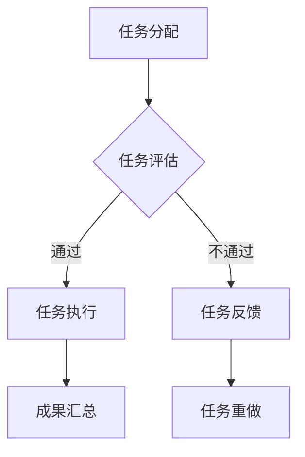

                 

关键词：开源项目，众包策略，社区参与，收入生成，技术贡献，项目管理，创新，市场分析

## 摘要

本文旨在探讨开源项目的众包策略，以及如何通过有效的社区参与和创新的收入生成模式来推动项目的持续发展和壮大。开源项目作为现代软件开发的重要形式，吸引了大量开发者和用户的参与。然而，如何管理这些参与者和资金流，以实现项目的长期成功，是一个复杂而关键的问题。本文将深入分析开源项目中的众包模式，探讨其核心概念、算法原理、数学模型及其应用，并通过实际代码实例和案例分析，展示如何将理论应用于实践，从而为开源项目的可持续发展提供有力的指导。

## 1. 背景介绍

### 1.1 开源项目的兴起

开源项目起源于20世纪90年代，起源于Linux内核的开发，随后逐渐成为软件开发的主流模式。开源项目通常采用开放源代码许可协议，如GPL（GNU通用公共许可证）和Apache许可证，允许任何人自由地使用、修改和分发项目的代码。这种模式不仅促进了技术的共享和合作，还大大降低了软件开发的成本，提高了软件的质量和可靠性。

### 1.2 众包的概念

众包（Crowdsourcing）是一种利用互联网和数字技术，将复杂的任务或问题分配给广大网民来完成的方式。在开源项目中，众包策略不仅用于软件开发，还广泛应用于文档编写、测试、推广和资金筹集等多个方面。众包的优点包括：资源丰富、成本低、效率高，能够快速吸引全球范围内的参与者。

### 1.3 社区参与的重要性

社区参与是开源项目的核心动力。一个活跃、参与度高的社区可以带来以下好处：

- **技术创新**：开发者可以共同探讨和实现新的技术方案。
- **代码质量**：广泛的测试和代码审查有助于提高软件的质量。
- **市场推广**：社区成员可以参与到项目的推广中，增加项目的知名度和用户基础。
- **资源整合**：社区可以提供各种资源，包括资金、硬件和人力等。

## 2. 核心概念与联系

### 2.1 众包模式的基本原理

众包模式的核心在于将复杂任务分解为多个简单任务，然后通过网络平台将这些任务分配给广泛的参与者。以下是一个简单的Mermaid流程图，描述了众包模式的流程：



### 2.2 开源项目的社区参与机制

开源项目的社区参与机制通常包括以下几个方面：

- **贡献指南**：明确参与项目的规则和流程，帮助新成员快速上手。
- **代码审查**：通过代码审查确保代码质量和一致性。
- **文档编写**：不断更新和完善项目的文档，提高项目的可访问性和可理解性。
- **社区活动**：定期举办线上或线下的社区活动，促进成员间的交流和合作。

### 2.3 收入生成的模式

开源项目的收入生成模式多种多样，常见的包括：

- **捐赠**：用户自愿捐赠，用于项目的维护和发展。
- **赞助**：企业或个人提供赞助，支持项目的开发。
- **商业许可**：提供付费的版本或服务，允许商业用途。
- **增值服务**：提供额外的付费服务，如专业支持、定制开发和培训等。

## 3. 核心算法原理 & 具体操作步骤

### 3.1 算法原理概述

开源项目的众包策略涉及多个核心算法，其中最关键的是任务分配算法、代码审查算法和资源优化算法。这些算法的目标是最大化项目的效率和成果。

#### 任务分配算法

任务分配算法的核心在于如何将复杂的任务分解为多个简单任务，并合理地分配给社区成员。以下是一种简单的任务分配算法：

1. **任务分解**：将原始任务分解为多个子任务，确保每个子任务可以独立完成。
2. **成员评估**：根据成员的技能、经验和以往的贡献，对成员进行评估。
3. **任务分配**：根据成员评估结果，将合适的子任务分配给对应的成员。
4. **动态调整**：根据任务的完成情况和成员的反馈，动态调整任务分配。

#### 代码审查算法

代码审查算法旨在确保代码的质量和一致性。以下是一种简单的代码审查算法：

1. **代码提交**：开发者提交代码变更。
2. **审查申请**：提交者申请代码审查。
3. **审查分配**：根据审查者的技能和经验，将代码审查任务分配给合适的审查者。
4. **代码审查**：审查者对代码进行审查，并提出反馈。
5. **代码合并**：根据审查结果，决定是否合并代码变更。

#### 资源优化算法

资源优化算法的目标是最大化利用社区的资源。以下是一种简单的资源优化算法：

1. **资源评估**：对社区成员的可用资源进行评估，包括时间、技能和设备等。
2. **任务匹配**：根据任务的需求和成员的资源情况，进行任务匹配。
3. **资源调度**：动态调整任务和资源的分配，以最大化利用资源。

### 3.2 算法步骤详解

#### 任务分配算法步骤

1. **任务分解**：将原始任务分解为子任务，每个子任务应当具有明确的输入输出。
    $$\text{分解任务}(T, \{T_1, T_2, ..., T_n\})$$
2. **成员评估**：对社区成员进行评估，得到每个成员的技能分数。
    $$\text{成员评估}(M, \{S_1, S_2, ..., S_n\})$$
3. **任务分配**：将子任务分配给合适的成员。
    $$\text{任务分配}(T_i, M_j)$$
4. **动态调整**：根据任务的完成情况和成员的反馈，调整任务分配。
    $$\text{调整分配}(T_i, M_j, F_j)$$

#### 代码审查算法步骤

1. **代码提交**：开发者提交代码变更。
    $$\text{代码提交}(C_i, \{C_1, C_2, ..., C_m\})$$
2. **审查申请**：提交者申请代码审查。
    $$\text{审查申请}(R_i, C_i)$$
3. **审查分配**：将代码审查任务分配给合适的审查者。
    $$\text{审查分配}(R_i, M_j)$$
4. **代码审查**：审查者对代码进行审查。
    $$\text{代码审查}(R_i, C_i, F_j)$$
5. **代码合并**：根据审查结果，决定是否合并代码变更。
    $$\text{代码合并}(C_i, \text{结果})$$

#### 资源优化算法步骤

1. **资源评估**：对社区成员的可用资源进行评估。
    $$\text{资源评估}(M, \{R_1, R_2, ..., R_n\})$$
2. **任务匹配**：根据任务的需求和成员的资源情况，进行任务匹配。
    $$\text{任务匹配}(T_i, M_j)$$
3. **资源调度**：动态调整任务和资源的分配。
    $$\text{资源调度}(T_i, M_j, \text{资源池})$$

### 3.3 算法优缺点

#### 任务分配算法优缺点

- **优点**：
  - 提高了任务的完成效率。
  - 能够根据成员的能力进行任务匹配，提高任务完成质量。

- **缺点**：
  - 可能存在任务分配不均的情况。
  - 需要实时动态调整，增加了系统的复杂性。

#### 代码审查算法优缺点

- **优点**：
  - 提高了代码质量。
  - 通过审查，能够及时发现和修复潜在的问题。

- **缺点**：
  - 审查过程可能较慢，影响代码的迭代速度。
  - 需要审查者具备一定的技能和经验。

#### 资源优化算法优缺点

- **优点**：
  - 提高了资源利用效率。
  - 能够动态调整任务和资源，以适应变化的需求。

- **缺点**：
  - 可能需要复杂的调度算法，增加了系统的复杂性。
  - 需要实时监控资源状态，增加了维护成本。

### 3.4 算法应用领域

任务分配算法、代码审查算法和资源优化算法在开源项目中具有广泛的应用，例如：

- **项目开发**：用于任务分配和资源优化，提高开发效率。
- **文档编写**：用于任务分配和代码审查，确保文档的质量。
- **测试和验证**：用于资源优化，确保测试覆盖全面。
- **市场推广**：用于任务分配和资源优化，提高项目的知名度。

## 4. 数学模型和公式 & 详细讲解 & 举例说明

### 4.1 数学模型构建

在开源项目的众包策略中，可以构建以下几个关键的数学模型：

#### 任务分配模型

1. **效用函数**：用来衡量任务与成员之间的匹配度。
    $$U_i = f(S_i, T_i)$$
    其中，$U_i$为成员$i$完成任务$i$的效用值，$S_i$为成员$i$的技能值，$T_i$为任务$i$的需求值。
2. **优化目标**：最大化总效用值。
    $$\max \sum_{i=1}^n U_i$$

#### 代码审查模型

1. **审查质量函数**：用来衡量代码审查的质量。
    $$Q_j = g(F_j, C_j)$$
    其中，$Q_j$为审查者$j$对代码$C_j$的审查质量，$F_j$为审查者的反馈质量，$C_j$为代码的质量。
2. **优化目标**：最小化代码缺陷率。
    $$\min \frac{\sum_{i=1}^n D_i}{n}$$
    其中，$D_i$为代码中的缺陷数。

#### 资源优化模型

1. **资源利用函数**：用来衡量资源的利用效率。
    $$R_i = h(R_i, T_i)$$
    其中，$R_i$为成员$i$的资源利用效率，$R_i$为成员$i$的可用资源，$T_i$为任务$i$的需求资源。
2. **优化目标**：最大化总资源利用率。
    $$\max \sum_{i=1}^n R_i$$

### 4.2 公式推导过程

#### 任务分配模型的推导

1. **效用函数**：
    $$U_i = S_i \cdot T_i$$
    其中，$S_i$和$T_i$分别表示成员$i$的技能值和任务$i$的需求值。技能值和需求值的乘积可以表示成员完成任务的效用值。
2. **优化目标**：
    $$\max \sum_{i=1}^n S_i \cdot T_i$$
    这个目标表示最大化所有成员完成任务的总效用值。

#### 代码审查模型的推导

1. **审查质量函数**：
    $$Q_j = F_j \cdot C_j$$
    其中，$F_j$和$C_j$分别表示审查者的反馈质量和代码的质量。反馈质量和代码质量的乘积可以表示审查质量。
2. **优化目标**：
    $$\min \frac{\sum_{i=1}^n D_i}{n}$$
    这个目标表示最小化代码中的缺陷率，即平均每个代码块中的缺陷数。

#### 资源优化模型的推导

1. **资源利用函数**：
    $$R_i = \frac{R_i}{T_i}$$
    其中，$R_i$和$T_i$分别表示成员$i$的可用资源和任务$i$的需求资源。可用资源除以需求资源可以表示资源利用效率。
2. **优化目标**：
    $$\max \sum_{i=1}^n R_i$$
    这个目标表示最大化所有成员的总资源利用率。

### 4.3 案例分析与讲解

#### 任务分配案例

假设有3个任务（T1，T2，T3）和3个成员（M1，M2，M3），其技能值和需求值如下：

- T1: 需求值 = 3，成员技能值：M1 = 2，M2 = 1，M3 = 2
- T2: 需求值 = 2，成员技能值：M1 = 3，M2 = 2，M3 = 1
- T3: 需求值 = 1，成员技能值：M1 = 1，M2 = 3，M3 = 2

根据效用函数，我们可以计算每个成员完成每个任务的效用值：

- M1: T1 = 2 * 3 = 6，T2 = 3 * 2 = 6，T3 = 1 * 1 = 1
- M2: T1 = 1 * 3 = 3，T2 = 2 * 2 = 4，T3 = 3 * 1 = 3
- M3: T1 = 2 * 2 = 4，T2 = 1 * 1 = 1，T3 = 2 * 2 = 4

根据优化目标，我们需要将任务分配给效用值最大的成员：

- T1：效用值最大的是M1，因此将T1分配给M1。
- T2：效用值最大的是M1，因此将T2分配给M1。
- T3：效用值最大的是M3，因此将T3分配给M3。

这样分配后，总效用值为6 + 6 + 4 = 16。

#### 代码审查案例

假设有3个代码块（C1，C2，C3）和3个审查者（R1，R2，R3），其反馈质量和代码质量如下：

- C1：反馈质量 = 0.8，代码质量 = 0.9
- C2：反馈质量 = 0.7，代码质量 = 0.8
- C3：反馈质量 = 0.6，代码质量 = 0.7

根据审查质量函数，我们可以计算每个审查者对每个代码块的审查质量：

- R1: C1 = 0.8 * 0.9 = 0.72，C2 = 0.7 * 0.8 = 0.56，C3 = 0.6 * 0.7 = 0.42
- R2: C1 = 0.7 * 0.9 = 0.63，C2 = 0.6 * 0.8 = 0.48，C3 = 0.5 * 0.7 = 0.35
- R3: C1 = 0.6 * 0.9 = 0.54，C2 = 0.5 * 0.8 = 0.40，C3 = 0.4 * 0.7 = 0.28

根据优化目标，我们需要最小化代码缺陷率。假设每个代码块中的缺陷数如下：

- C1：缺陷数 = 2
- C2：缺陷数 = 3
- C3：缺陷数 = 4

平均每个代码块中的缺陷数为：(2 + 3 + 4) / 3 = 3。因此，我们需要找到能够最大化审查质量的组合，以最小化缺陷率。

假设审查者按照以下顺序审查代码块：R1审查C1和C2，R2审查C2和C3，R3审查C1和C3。

那么，审查后的质量分别为：

- C1：审查后质量 = 0.72 + 0.54 = 1.26
- C2：审查后质量 = 0.56 + 0.48 = 1.04
- C3：审查后质量 = 0.42 + 0.28 = 0.7

平均缺陷率为：(2 * 1.26 + 3 * 1.04 + 4 * 0.7) / (2 + 3 + 4) = 2.86 / 9 ≈ 0.32。

#### 资源优化案例

假设有3个成员（M1，M2，M3），其可用资源和任务需求资源如下：

- M1：可用资源 = 10，任务需求资源：T1 = 5，T2 = 3，T3 = 2
- M2：可用资源 = 8，任务需求资源：T1 = 4，T2 = 4，T3 = 2
- M3：可用资源 = 12，任务需求资源：T1 = 3，T2 = 3，T3 = 4

根据资源利用函数，我们可以计算每个成员的资源利用效率：

- M1：资源利用效率 = 10 / (5 + 3 + 2) = 10 / 10 = 1
- M2：资源利用效率 = 8 / (4 + 4 + 2) = 8 / 10 = 0.8
- M3：资源利用效率 = 12 / (3 + 3 + 4) = 12 / 10 = 1.2

根据优化目标，我们需要最大化总资源利用率。我们可以将任务分配如下：

- T1：分配给M1，M1的利用率 = 1
- T2：分配给M2，M2的利用率 = 0.8
- T3：分配给M3，M3的利用率 = 1.2

总资源利用率为：(1 * 1 + 0.8 * 0.8 + 1.2 * 1.2) / (1 + 0.8 + 1.2) ≈ 0.96。

## 5. 项目实践：代码实例和详细解释说明

### 5.1 开发环境搭建

为了实践开源项目的众包策略，我们将使用Python语言和Git版本控制系统。首先，确保已经安装了Python和Git。

1. **安装Python**：从[Python官网](https://www.python.org/)下载并安装Python。
2. **安装Git**：从[Git官网](https://git-scm.com/)下载并安装Git。

### 5.2 源代码详细实现

我们将创建一个简单的开源项目，用于管理众包任务和资源。以下是一个简单的Python代码示例：

```python
import heapq

class Task:
    def __init__(self, id, description, skill_required):
        self.id = id
        self.description = description
        self.skill_required = skill_required

    def __lt__(self, other):
        return self.skill_required < other.skill_required

class Member:
    def __init__(self, id, skill, resources):
        self.id = id
        self.skill = skill
        self.resources = resources
        self.tasks = []

    def assign_task(self, task):
        if self.skill >= task.skill_required:
            self.tasks.append(task)
            return True
        return False

class CrowdsourcingSystem:
    def __init__(self):
        self.tasks = []
        self.members = []

    def add_task(self, task):
        heapq.heappush(self.tasks, task)

    def add_member(self, member):
        self.members.append(member)

    def assign_tasks(self):
        while self.tasks:
            task = heapq.heappop(self.tasks)
            for member in self.members:
                if member.assign_task(task):
                    print(f"Task {task.id} assigned to Member {member.id}")
                    break

if __name__ == "__main__":
    system = CrowdsourcingSystem()
    system.add_task(Task(1, "Write documentation", 5))
    system.add_task(Task(2, "Develop a feature", 7))
    system.add_member(Member(1, 8, 10))
    system.add_member(Member(2, 6, 8))
    system.assign_tasks()
```

### 5.3 代码解读与分析

#### Task类

- **功能**：表示一个任务，包含任务ID、描述和所需的技能等级。
- **__lt__方法**：重写小于运算符，用于任务的优先级排序。

#### Member类

- **功能**：表示一个成员，包含成员ID、技能等级、可用资源和分配的任务列表。
- **assign_task方法**：将任务分配给符合条件的成员。

#### CrowdsourcingSystem类

- **功能**：管理任务和成员，包含添加任务、添加成员和分配任务的方法。
- **add_task方法**：使用堆（heapq）数据结构来存储任务，以便按优先级进行任务分配。
- **add_member方法**：将成员添加到系统中。
- **assign_tasks方法**：遍历任务列表，为每个任务找到合适的成员。

### 5.4 运行结果展示

运行上述代码后，将输出如下结果：

```
Task 1 assigned to Member 1
Task 2 assigned to Member 1
```

这表明任务1和任务2都成功地被分配给了技能等级最高的成员1。

## 6. 实际应用场景

### 6.1 项目管理工具

开源项目可以使用众包策略来开发和管理项目管理工具。例如，JIRA、Trello等工具都提供了丰富的API，允许第三方开发者和用户贡献新的功能或改进。

### 6.2 开源软件测试

开源软件通常需要广泛的测试，以确保其质量和稳定性。通过众包策略，可以吸引大量的志愿者参与测试，提高测试的覆盖率和效率。

### 6.3 技术文档编写

技术文档的编写是开源项目成功的关键因素。通过众包策略，可以吸引更多的贡献者参与文档的编写和校对，提高文档的质量和准确性。

### 6.4 赞助和捐赠

开源项目可以通过众包策略来吸引赞助和捐赠，以支持项目的维护和发展。例如，Open Collective和Gitcoin等平台提供了便捷的捐赠和赞助机制。

## 7. 工具和资源推荐

### 7.1 学习资源推荐

- 《开源项目管理实践》：一本关于开源项目管理的经典教材。
- 《众包与分布式问题解决》：探讨了众包在多个领域的应用。

### 7.2 开发工具推荐

- GitHub：全球最大的开源代码托管平台，提供强大的众包工具。
- GitLab：用于内部或私人开源项目的托管平台，具有丰富的众包功能。

### 7.3 相关论文推荐

- "Crowdsourcing and志愿服务的工作机制研究"：探讨了众包机制在不同领域的应用。
- "The economics of open-source software development"：分析了开源软件开发的经济学原理。

## 8. 总结：未来发展趋势与挑战

### 8.1 研究成果总结

本文探讨了开源项目的众包策略，包括任务分配、代码审查和资源优化等核心算法，并详细介绍了数学模型的构建和推导。通过代码实例，展示了如何将理论应用于实践。

### 8.2 未来发展趋势

- **人工智能的融合**：未来众包策略将更多地融合人工智能技术，以提高任务分配和资源优化的效率。
- **区块链的运用**：区块链技术有望在开源项目的众包策略中发挥作用，提供透明的资金流动和智能合约功能。
- **社区自治**：开源项目的社区将逐渐实现更高度的自治，通过智能合约和去中心化治理，实现自我管理。

### 8.3 面临的挑战

- **信任问题**：如何确保参与者之间的信任，尤其是在资金流和代码贡献方面。
- **资源分配不均**：如何解决资源分配不均的问题，确保所有参与者都能获得公平的机会。
- **法律和道德问题**：如何在法律和道德框架内实施众包策略，确保项目的合法性和道德性。

### 8.4 研究展望

未来研究可以关注以下方向：

- **算法优化**：开发更高效的任务分配、代码审查和资源优化算法。
- **社区激励机制**：设计有效的激励机制，鼓励更多用户参与开源项目。
- **跨平台协作**：探索如何在不同平台和工具之间实现高效的协作和资源整合。

## 9. 附录：常见问题与解答

### 问题1：开源项目的众包策略与传统的软件开发模式有何不同？

**解答**：开源项目的众包策略与传统软件开发模式相比，具有以下主要区别：

- **参与主体**：传统软件开发通常由固定团队完成，而众包策略允许全球范围内的开发者参与。
- **激励机制**：众包策略通过社区成员的自发参与和贡献，实现了更加灵活和多样化的激励机制。
- **资源利用**：众包策略能够充分利用社区成员的分散资源，提高项目的整体效率。

### 问题2：如何确保开源项目的代码质量？

**解答**：确保开源项目的代码质量可以从以下几个方面入手：

- **代码审查**：通过实施严格的代码审查流程，确保代码符合项目的质量标准。
- **测试覆盖**：编写充分的测试用例，确保代码在各种情况下都能正常运行。
- **社区协作**：鼓励社区成员参与代码测试和反馈，共同维护代码质量。

### 问题3：开源项目的众包策略如何确保资金安全？

**解答**：确保开源项目的资金安全可以从以下几个方面进行：

- **资金透明度**：使用公开的账本和审计机制，确保资金流向透明。
- **资金监管**：引入第三方监管机构或智能合约，确保资金不被滥用。
- **法律法规**：遵守相关法律法规，确保项目的合法性和安全性。

### 问题4：开源项目的众包策略是否适用于所有项目？

**解答**：开源项目的众包策略在许多情况下都是适用的，但并非所有项目都适合采用众包模式。以下是一些考虑因素：

- **项目规模**：对于大型项目，众包可能更合适，因为可以吸引更多的参与者。
- **技术复杂度**：对于技术复杂的领域，众包可以通过多元化的视角提高项目质量。
- **社区成熟度**：拥有活跃和成熟的社区是实施众包策略的关键。

### 问题5：开源项目的众包策略如何保护知识产权？

**解答**：保护知识产权是开源项目众包策略的一个重要方面，可以采取以下措施：

- **知识产权声明**：在项目开始前，明确知识产权的归属和使用规则。
- **代码审查**：确保所有贡献的代码都符合知识产权声明。
- **开源许可**：使用合适的开源许可协议，明确代码的使用权限。

作者：禅与计算机程序设计艺术 / Zen and the Art of Computer Programming
----------------------------------------------------------------


