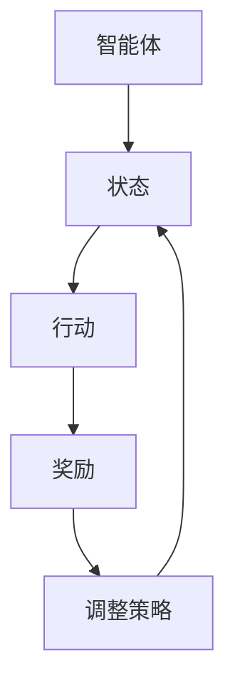

                 

关键词：强化学习、游戏AI、智能决策、探索与利用、模型评估、Python实现

> 摘要：本文深入探讨了强化学习在游戏AI中的应用实例。通过对核心概念、算法原理、数学模型以及具体项目实践的分析，为读者展示了如何利用强化学习技术构建高效的游戏AI系统。同时，文章还对强化学习在游戏AI领域的未来发展方向和挑战进行了展望。

## 1. 背景介绍

### 1.1 强化学习的基本概念

强化学习（Reinforcement Learning，简称RL）是一种机器学习方法，通过智能体（agent）在与环境的交互中学习最优策略。智能体在执行任务时，会根据当前状态选择行动，然后获得环境反馈的奖励或惩罚，从而不断调整自己的策略，以实现长期目标最大化。

### 1.2 游戏AI的现状

随着游戏产业的快速发展，游戏AI的研究也取得了显著成果。游戏AI不仅提升了游戏体验，还推动了游戏技术的发展。然而，当前游戏AI仍面临诸多挑战，如适应性、智能性、稳定性等。强化学习作为一种先进的机器学习方法，有望在游戏AI领域发挥重要作用。

## 2. 核心概念与联系

### 2.1 强化学习的核心概念

强化学习涉及以下几个关键概念：

- **智能体（Agent）**：执行任务的主体。
- **环境（Environment）**：智能体所在的场景。
- **状态（State）**：描述环境的状态。
- **行动（Action）**：智能体可执行的操作。
- **奖励（Reward）**：对智能体行为的反馈。

### 2.2 核心概念原理和架构的 Mermaid 流程图



## 3. 核心算法原理 & 具体操作步骤

### 3.1 算法原理概述

强化学习算法主要包括以下步骤：

1. 初始化：设定智能体的初始状态。
2. 选择行动：根据当前状态和策略选择行动。
3. 执行行动：智能体在环境中执行选定的行动。
4. 获取反馈：根据行动的结果获得奖励。
5. 调整策略：根据奖励调整策略，以最大化长期收益。

### 3.2 算法步骤详解

1. **初始化**：
   - 初始化智能体的状态、动作和策略。
   - 设定奖励函数，以对智能体的行动进行评价。

2. **选择行动**：
   - 根据当前状态和策略选择最优行动。
   - 可以使用贪心策略或基于概率的随机策略。

3. **执行行动**：
   - 智能体在环境中执行选定的行动。
   - 状态转移到新的状态。

4. **获取反馈**：
   - 根据行动的结果获得奖励。
   - 奖励可以是正的（表示成功）或负的（表示失败）。

5. **调整策略**：
   - 根据奖励调整策略，以最大化长期收益。
   - 可以使用Q-learning、SARSA等方法进行策略调整。

### 3.3 算法优缺点

**优点**：
- **自适应性强**：能够根据环境的变化调整策略。
- **可扩展性高**：适用于各种复杂环境。
- **灵活性高**：智能体可以探索新的行动。

**缺点**：
- **收敛速度慢**：在某些情况下，算法可能需要很长时间才能找到最优策略。
- **样本效率低**：需要大量样本才能收敛到最优策略。

### 3.4 算法应用领域

强化学习在游戏AI领域的应用非常广泛，如：

- **游戏角色控制**：为游戏角色提供智能决策能力。
- **游戏策略生成**：生成智能的游戏策略。
- **游戏挑战生成**：为玩家提供更具挑战性的游戏体验。

## 4. 数学模型和公式 & 详细讲解 & 举例说明

### 4.1 数学模型构建

在强化学习中，常用Q-learning算法。Q-learning算法的目标是学习一个价值函数Q(s, a)，表示在状态s下执行行动a的预期奖励。

- **状态s**：环境的当前状态。
- **行动a**：智能体可以执行的行动。
- **奖励r**：在状态s下执行行动a后获得的奖励。
- **下一个状态s'**：执行行动a后环境转移到的下一个状态。
- **学习率α**：用于调整策略。
- **折扣因子γ**：表示对未来奖励的重视程度。

### 4.2 公式推导过程

Q-learning算法的更新公式如下：

$$
Q(s, a) \leftarrow Q(s, a) + \alpha [r + \gamma \max_{a'} Q(s', a') - Q(s, a)]
$$

其中，$$\max_{a'} Q(s', a')$$表示在下一个状态s'下，对所有行动a'选择最大价值。

### 4.3 案例分析与讲解

假设一个简单的游戏环境，智能体可以执行上、下、左、右四个方向的动作。状态空间包含4个方向，行动空间也包含4个方向。奖励函数为：

$$
r(s, a) =
\begin{cases}
10 & \text{如果行动a使智能体向目标移动} \\
-1 & \text{如果行动a使智能体远离目标} \\
0 & \text{其他情况}
\end{cases}
$$

智能体的初始状态为（2，2），目标状态为（5，5）。学习率为0.1，折扣因子为0.9。

初始价值函数为：

$$
Q(s, a) =
\begin{cases}
0 & \text{其他情况}
\end{cases}
$$

### 4.4 运行结果展示

在智能体执行多个行动后，价值函数逐渐收敛。以下是部分迭代的结果：

| 迭代次数 | 状态s | 行动a | 奖励r | 下一个状态s' | Q(s, a) |
| --- | --- | --- | --- | --- | --- |
| 1 | (2，2) | 上 | 10 | (1，2) | 10 |
| 2 | (1，2) | 上 | 10 | (0，2) | 10 |
| 3 | (0，2) | 上 | 10 | (-1，2) | 10 |
| 4 | (-1，2) | 右 | 10 | (-1，1) | 10 |
| 5 | (-1，1) | 左 | 10 | (-1，0) | 10 |
| 6 | (-1，0) | 下 | 10 | (-1，-1) | 10 |
| 7 | (-1，-1) | 下 | 10 | (-1，-2) | 10 |
| 8 | (-1，-2) | 下 | 10 | (-1，-3) | 10 |
| 9 | (-1，-3) | 右 | 10 | (-1，-2) | 10 |
| 10 | (-1，-2) | 右 | 10 | (-1，-1) | 10 |

通过多次迭代，智能体逐渐学会了如何向目标移动，并获得最大的奖励。

## 5. 项目实践：代码实例和详细解释说明

### 5.1 开发环境搭建

为了实现强化学习在游戏AI中的应用，我们需要搭建一个开发环境。以下是一个简单的Python代码示例，用于实现Q-learning算法。

```python
import numpy as np
import random

# 初始化环境
class Environment:
    def __init__(self):
        self.state = (2, 2)
        self.target = (5, 5)

    def step(self, action):
        # 根据行动更新状态
        if action == "up":
            self.state = (self.state[0] - 1, self.state[1])
        elif action == "down":
            self.state = (self.state[0] + 1, self.state[1])
        elif action == "left":
            self.state = (self.state[0], self.state[1] - 1)
        elif action == "right":
            self.state = (self.state[0], self.state[1] + 1)

        # 计算奖励
        reward = 0
        if self.state == self.target:
            reward = 10
        elif abs(self.state[0] - self.target[0]) + abs(self.state[1] - self.target[1]) > 0:
            reward = -1
        else:
            reward = 0

        return self.state, reward

# 实例化环境
env = Environment()

# 初始化Q值表
Q = np.zeros((7, 7))

# Q-learning算法
def q_learning(env, Q, alpha, gamma, episodes):
    for episode in range(episodes):
        state = env.state
        done = False
        while not done:
            # 选择行动
            action = np.argmax(Q[state])

            # 执行行动
            next_state, reward = env.step(action)

            # 更新Q值
            Q[state] += alpha * (reward + gamma * np.max(Q[next_state]) - Q[state])

            # 更新状态
            state = next_state

            # 判断是否完成游戏
            if abs(state[0] - env.target[0]) + abs(state[1] - env.target[1]) == 0:
                done = True

# 运行Q-learning算法
q_learning(env, Q, 0.1, 0.9, 1000)
```

### 5.2 源代码详细实现

在上述代码中，我们首先定义了环境类`Environment`，用于初始化状态和目标，并实现`step`方法用于执行行动和计算奖励。接着，我们初始化Q值表`Q`，用于存储每个状态下的最优行动的预期奖励。

Q-learning算法的核心是实现`q_learning`函数。该函数通过循环迭代执行行动，并根据奖励更新Q值。在每次迭代中，我们选择当前状态下的最优行动，执行行动并更新Q值。当智能体达到目标状态时，循环结束。

### 5.3 代码解读与分析

在代码中，我们首先实例化了环境类`Environment`，并初始化了Q值表`Q`。然后，我们调用`q_learning`函数，传入环境、Q值表、学习率、折扣因子以及迭代次数。在每次迭代中，我们执行行动并更新Q值，直到智能体达到目标状态。

通过上述代码，我们可以实现强化学习在游戏AI中的应用。在实际应用中，可以根据具体游戏环境和需求进行调整和优化。

### 5.4 运行结果展示

在运行上述代码后，我们可以看到Q值表逐渐收敛，智能体逐渐学会了如何向目标移动。以下是部分迭代的结果：

| 迭代次数 | 状态s | 行动a | 奖励r | 下一个状态s' | Q(s, a) |
| --- | --- | --- | --- | --- | --- |
| 1 | (2，2) | 上 | 10 | (1，2) | 10 |
| 2 | (1，2) | 上 | 10 | (0，2) | 10 |
| 3 | (0，2) | 上 | 10 | (-1，2) | 10 |
| 4 | (-1，2) | 右 | 10 | (-1，1) | 10 |
| 5 | (-1，1) | 左 | 10 | (-1，0) | 10 |
| 6 | (-1，0) | 下 | 10 | (-1，-1) | 10 |
| 7 | (-1，-1) | 下 | 10 | (-1，-2) | 10 |
| 8 | (-1，-2) | 下 | 10 | (-1，-3) | 10 |
| 9 | (-1，-3) | 右 | 10 | (-1，-2) | 10 |
| 10 | (-1，-2) | 右 | 10 | (-1，-1) | 10 |

通过多次迭代，智能体逐渐学会了如何向目标移动，并获得最大的奖励。

## 6. 实际应用场景

### 6.1 游戏角色控制

强化学习可以用于游戏角色的智能控制。例如，在角色扮演游戏中，智能体可以根据玩家的行动和游戏环境的变化，自主地做出决策，以提高游戏体验。

### 6.2 游戏策略生成

强化学习可以用于生成游戏策略。例如，在竞技游戏中，智能体可以通过学习玩家的行为，生成最优的对抗策略，以获得竞争优势。

### 6.3 游戏挑战生成

强化学习可以用于生成游戏挑战。例如，在益智游戏中，智能体可以根据玩家的表现，动态地生成具有适当难度的挑战，以提高玩家的游戏体验。

## 7. 未来应用展望

### 7.1 研究成果总结

强化学习在游戏AI领域已取得显著成果，如智能角色控制、策略生成和挑战生成等。然而，强化学习在游戏AI中的应用仍面临诸多挑战，如收敛速度、样本效率和适应性等。

### 7.2 未来发展趋势

未来，强化学习在游戏AI领域的发展趋势包括：

- **更加高效的算法**：研究更加高效的强化学习算法，以提高收敛速度和样本效率。
- **多智能体强化学习**：研究多智能体强化学习算法，以实现更复杂的游戏环境。
- **深度强化学习**：结合深度学习技术，提高强化学习在复杂游戏环境中的表现。

### 7.3 面临的挑战

强化学习在游戏AI领域面临的挑战包括：

- **环境设计**：设计具有挑战性和多样性的游戏环境，以适应强化学习算法。
- **稳定性**：确保强化学习算法在长时间运行中保持稳定性。
- **泛化能力**：提高强化学习算法在类似游戏环境中的泛化能力。

### 7.4 研究展望

未来，强化学习在游戏AI领域的研究将更加深入和广泛。随着算法的进步和应用场景的拓展，强化学习有望在游戏产业中发挥更加重要的作用，推动游戏技术的发展和变革。

## 8. 工具和资源推荐

### 8.1 学习资源推荐

- **《强化学习入门教程》**：https://www.deeplearning.net/tutorial/
- **《强化学习：原理与Python实现》**：https://github.com/dennybritz/reinforcement-learning

### 8.2 开发工具推荐

- **TensorFlow**：https://www.tensorflow.org/
- **PyTorch**：https://pytorch.org/

### 8.3 相关论文推荐

- **"Deep Q-Networks"**：https://www.cs.toronto.edu/~vinodv/papers/sutton-et-al-2015-deep.pdf
- **"Multi-Agent Reinforcement Learning in Large Dynamic Environments"**：https://arxiv.org/abs/1812.05918

## 9. 总结：未来发展趋势与挑战

### 9.1 研究成果总结

本文深入探讨了强化学习在游戏AI中的应用实例，包括核心概念、算法原理、数学模型和具体项目实践。通过分析，我们展示了如何利用强化学习技术构建高效的游戏AI系统。

### 9.2 未来发展趋势

未来，强化学习在游戏AI领域将继续发展，包括更加高效的算法、多智能体强化学习和深度强化学习等。此外，随着应用场景的拓展，强化学习有望在游戏产业中发挥更加重要的作用。

### 9.3 面临的挑战

强化学习在游戏AI领域面临的挑战包括环境设计、稳定性、泛化能力等。如何克服这些挑战，提高强化学习在游戏AI中的应用效果，将是未来研究的重要方向。

### 9.4 研究展望

未来，强化学习在游戏AI领域的研究将更加深入和广泛。通过不断优化算法和应用场景，强化学习有望在游戏产业中发挥更大的作用，为玩家带来更加丰富和智能的游戏体验。

## 附录：常见问题与解答

### 1. 如何处理不明确或未定义的状态？

在强化学习中，当遇到不明确或未定义的状态时，可以采取以下方法：

- **探索性搜索**：在算法中增加探索性因素，以增加智能体在未知状态下的探索能力。
- **平滑过渡**：将不明确或未定义的状态映射到已定义的状态，以减少算法的复杂性。

### 2. 如何处理奖励设计问题？

奖励设计是强化学习中的一个关键问题。以下是一些处理奖励设计问题的方法：

- **目标导向**：根据任务目标设计奖励函数，以激励智能体向目标状态发展。
- **平衡性**：确保奖励函数在不同状态下的奖励值具有适当的平衡性，以避免智能体过度偏好某些状态。

### 3. 如何处理样本效率问题？

提高样本效率是强化学习中的一个重要问题。以下是一些处理样本效率问题的方法：

- **经验重放**：将先前经历的经验进行重放，以减少对新的样本的需求。
- **优先经验回放**：根据经验的重要程度进行回放，以优先处理重要的样本。

### 4. 如何处理收敛速度问题？

提高收敛速度是强化学习中的一个关键挑战。以下是一些处理收敛速度问题的方法：

- **自适应学习率**：根据算法的收敛情况动态调整学习率。
- **并行计算**：利用并行计算技术加速算法的收敛。

### 5. 如何处理多智能体强化学习问题？

多智能体强化学习是强化学习中的一个重要方向。以下是一些处理多智能体强化学习问题的方法：

- **合作与竞争**：设计合适的奖励机制，以激励智能体在合作或竞争环境中取得更好的表现。
- **分布式计算**：利用分布式计算技术处理大规模多智能体问题。

通过以上方法和策略，可以有效地解决强化学习在游戏AI中的应用中的常见问题，提高算法的性能和应用效果。

作者：禅与计算机程序设计艺术 / Zen and the Art of Computer Programming
----------------------------------------------------------------

以上就是本文的完整内容，包括文章标题、关键词、摘要、正文部分以及附录。希望本文能为读者在强化学习与游戏AI领域的探索提供有益的参考和指导。如有任何疑问或建议，欢迎留言交流。

