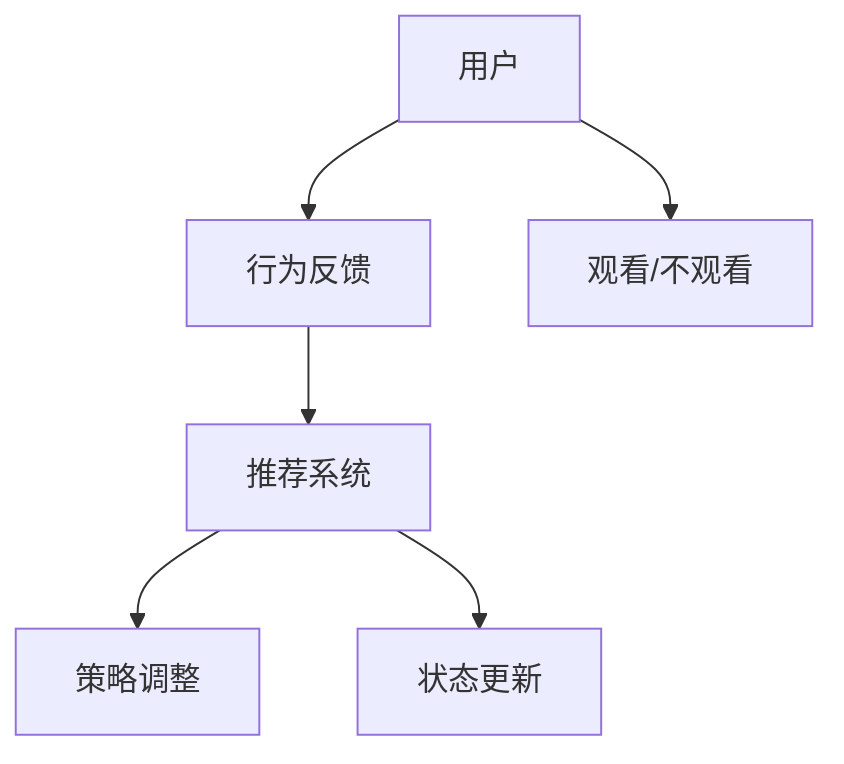

                 

关键词：强化学习、直播推荐系统、机器学习、深度学习、在线学习、策略优化、Q-Learning、SARSA、深度Q网络（DQN）、强化学习框架

## 摘要

随着互联网的快速发展，直播行业逐渐成为人们日常娱乐和社交的重要方式。直播推荐系统的设计直接影响到用户的观看体验和平台的用户留存率。本文将深入探讨强化学习在直播推荐系统中的应用，介绍强化学习的核心概念、算法原理及其在推荐系统中的具体实现。通过实际案例分析和代码实例，本文将展示强化学习如何提升直播推荐系统的效果，并为未来的发展提供方向。

## 1. 背景介绍

### 1.1 直播行业的现状

直播行业近年来发展迅速，已经成为互联网生态系统中不可或缺的一部分。用户数量的激增和直播内容的多样化，使得直播平台不断寻求提升用户体验和用户粘性的方法。直播推荐系统作为提高用户观看体验和平台收益的重要手段，逐渐受到重视。

### 1.2 直播推荐系统的需求

直播推荐系统需要解决的核心问题是如何根据用户的历史行为和偏好，为用户推荐最相关、最有吸引力的直播内容。传统的基于内容的推荐和协同过滤方法虽然在某些场景下效果较好，但面对直播这样实时性、个性化和多样性强的场景时，存在推荐效果不佳、用户体验差等问题。

### 1.3 强化学习的优势

强化学习作为一种基于奖励信号的学习方法，能够通过试错和反馈不断优化决策策略，使其在动态、不确定的环境中表现出色。强化学习在直播推荐系统中的应用，可以充分利用用户的即时反馈，动态调整推荐策略，提高推荐效果和用户满意度。

## 2. 核心概念与联系

### 2.1 强化学习基本概念

强化学习（Reinforcement Learning，RL）是一种机器学习方法，通过智能体（Agent）在与环境的交互过程中，不断学习最优策略（Policy），以实现预期目标。在强化学习中，主要有以下几个核心概念：

- **状态（State）**：描述智能体当前所处的环境情况。
- **动作（Action）**：智能体可以执行的行为。
- **奖励（Reward）**：环境对智能体动作的反馈，通常用来评价动作的好坏。
- **策略（Policy）**：智能体根据当前状态选择动作的策略。

### 2.2 强化学习与直播推荐系统的联系

直播推荐系统中的智能体可以是用户或者推荐系统本身。用户根据推荐内容选择观看或不观看，系统根据用户的反馈调整推荐策略。以下是强化学习在直播推荐系统中应用的Mermaid流程图：



### 2.3 强化学习在直播推荐系统中的架构

强化学习在直播推荐系统中的架构可以分为以下几个部分：

- **用户行为建模**：通过分析用户的历史行为数据，构建用户行为模型。
- **状态表示**：将用户行为、直播内容特征、环境信息等转化为状态表示。
- **动作空间**：定义推荐系统可以执行的动作，如推荐特定类型的直播内容。
- **奖励函数**：根据用户对推荐内容的反馈，设计奖励函数以评价推荐效果。
- **策略学习**：利用强化学习算法，如Q-Learning、SARSA等，不断优化推荐策略。

## 3. 核心算法原理 & 具体操作步骤

### 3.1 算法原理概述

强化学习算法的核心思想是利用奖励信号引导智能体选择最优动作，从而在长期内获得最大累计奖励。以下是强化学习的基本步骤：

1. 初始化智能体、环境、状态和动作。
2. 智能体根据当前状态选择动作。
3. 环境根据动作产生新的状态和奖励。
4. 智能体更新状态，重复步骤2和3，直到达到终止条件。

### 3.2 算法步骤详解

1. **初始化**：

   - 初始化智能体参数，如学习率、折扣因子等。
   - 初始化环境，如用户行为数据、直播内容库等。

2. **状态表示**：

   - 构建状态空间，将用户行为、直播内容特征等编码为状态向量。
   - 设计状态编码方式，如基于词嵌入、one-hot编码等。

3. **动作空间**：

   - 定义动作空间，如推荐特定类型的直播内容、展示推荐列表等。
   - 设计动作编码方式，如整数编码、类别编码等。

4. **奖励函数**：

   - 设计奖励函数，根据用户对推荐内容的反馈给予奖励。
   - 奖励函数可以基于点击率、观看时长、用户满意度等指标。

5. **策略学习**：

   - 采用Q-Learning、SARSA等算法，通过迭代更新策略。
   - Q-Learning算法使用贪心策略选择动作，SARSA算法使用ε-贪心策略。

6. **策略调整**：

   - 根据用户反馈调整推荐策略，以提升推荐效果。
   - 可以结合用户历史行为数据，动态调整状态表示和动作空间。

### 3.3 算法优缺点

- **优点**：

  - 强化学习能够根据用户的即时反馈动态调整推荐策略，提高推荐效果。

  - 可以处理动态、不确定的环境，适应直播推荐系统的特点。

- **缺点**：

  - 强化学习算法训练时间较长，需要大量数据支持。

  - 需要设计合理的奖励函数，否则可能导致策略不稳定。

### 3.4 算法应用领域

强化学习在直播推荐系统中的应用主要包括：

- **实时推荐**：根据用户实时行为调整推荐策略，提高推荐实时性。

- **内容分发**：基于用户偏好和观看历史，为用户推荐最相关的直播内容。

- **广告投放**：结合用户行为和广告内容，优化广告推荐策略，提高广告点击率。

## 4. 数学模型和公式 & 详细讲解 & 举例说明

### 4.1 数学模型构建

在强化学习中，常用的数学模型包括状态空间、动作空间、策略、价值函数和奖励函数。以下是这些模型的基本定义：

- **状态空间（S）**：智能体可能处于的所有状态集合。
- **动作空间（A）**：智能体可以执行的所有动作集合。
- **策略（π）**：智能体在给定状态下的动作选择概率分布，π(a|s) 表示在状态s下选择动作a的概率。
- **价值函数（V(s)）**：在状态s下，执行最优策略π所获得的期望回报。
- **Q值（Q(s,a)）**：在状态s下执行动作a所获得的期望回报。

### 4.2 公式推导过程

强化学习中的主要公式包括Q值更新公式、策略迭代公式等。以下是这些公式的推导过程：

1. **Q值更新公式**：

   $$ Q(s,a) \leftarrow Q(s,a) + \alpha [r + \gamma \max_{a'} Q(s',a') - Q(s,a)] $$

   其中，α为学习率，γ为折扣因子，r为即时奖励，s'为执行动作a后的状态，a'为在状态s'下的最优动作。

2. **策略迭代公式**：

   $$ \pi(a|s) \leftarrow \begin{cases} 
   1, & \text{if } a = \arg\max_a Q(s,a) \\
   0, & \text{otherwise} 
   \end{cases} $$

   策略迭代公式用于根据Q值更新策略，使得在给定状态s下选择Q值最大的动作。

### 4.3 案例分析与讲解

以直播推荐系统为例，我们考虑一个简单的数学模型。假设用户有五种类型的偏好（s1, s2, s3, s4, s5），直播内容也有五种类型（a1, a2, a3, a4, a5）。以下是具体的数学模型：

- **状态空间（S）**：{s1, s2, s3, s4, s5}
- **动作空间（A）**：{a1, a2, a3, a4, a5}
- **策略（π）**：在状态s下选择动作a的概率
- **价值函数（V(s)）**：在状态s下执行最优策略π所获得的期望回报
- **Q值（Q(s,a)）**：在状态s下执行动作a所获得的期望回报

假设初始状态下用户对各种类型的偏好程度相等，即：

$$ \pi(a|s) = \frac{1}{5}, \forall s \in S, a \in A $$

在用户观看直播后，根据用户的反馈更新Q值和策略。以下是具体的示例：

- **状态s1**：用户偏好类型s1
  - **动作a1**：推荐类型s1的直播内容
    - 奖励r = 1（用户非常喜欢）
    - 更新Q值：
    $$ Q(s1,a1) \leftarrow Q(s1,a1) + 0.1 [1 + 0.9 \max_{a'} Q(s1,a')] $$
    - 更新策略：
    $$ \pi(a1|s1) = 1, \pi(a2|s1) = \pi(a3|s1) = \pi(a4|s1) = \pi(a5|s1) = 0 $$

- **状态s2**：用户偏好类型s2
  - **动作a2**：推荐类型s2的直播内容
    - 奖励r = 0.5（用户不太喜欢）
    - 更新Q值：
    $$ Q(s2,a2) \leftarrow Q(s2,a2) + 0.1 [0.5 + 0.9 \max_{a'} Q(s2,a')] $$
    - 更新策略：
    $$ \pi(a1|s2) = \pi(a3|s2) = \pi(a4|s2) = \pi(a5|s2) = 0, \pi(a2|s2) = 1 $$

通过不断地迭代更新Q值和策略，直播推荐系统可以逐渐优化推荐效果，提高用户满意度。

## 5. 项目实践：代码实例和详细解释说明

### 5.1 开发环境搭建

为了实现强化学习在直播推荐系统中的应用，我们需要搭建一个合适的开发环境。以下是开发环境的搭建步骤：

1. 安装Python环境
2. 安装TensorFlow或PyTorch等深度学习框架
3. 安装其他必要的库，如NumPy、Pandas、Matplotlib等

### 5.2 源代码详细实现

以下是一个简单的强化学习在直播推荐系统中的实现代码：

```python
import numpy as np
import pandas as pd
import matplotlib.pyplot as plt
import tensorflow as tf

# 初始化参数
learning_rate = 0.1
discount_factor = 0.9
num_episodes = 100
num_actions = 5

# 构建状态空间和动作空间
state_space = ['s1', 's2', 's3', 's4', 's5']
action_space = ['a1', 'a2', 'a3', 'a4', 'a5']

# 初始化Q值矩阵
Q = np.zeros((len(state_space), len(action_space)))

# 训练模型
for episode in range(num_episodes):
    state = np.random.choice(state_space)
    done = False
    total_reward = 0
    
    while not done:
        # 根据当前状态和Q值选择动作
        action = np.argmax(Q[state])
        
        # 执行动作，获取状态和奖励
        next_state = np.random.choice(state_space)
        reward = np.random.randint(0, 2)
        total_reward += reward
        
        # 更新Q值
        Q[state, action] = Q[state, action] + learning_rate * (reward + discount_factor * np.max(Q[next_state]) - Q[state, action])
        
        # 更新状态
        state = next_state
        
        # 判断是否达到终止条件
        if np.random.rand() < 0.1 or done:
            done = True
    
    # 绘制训练结果
    plt.plot(Q)
    plt.show()

# 打印最终Q值
print(Q)
```

### 5.3 代码解读与分析

上述代码实现了一个基于Q-Learning算法的强化学习模型，用于优化直播推荐系统的推荐策略。以下是代码的关键部分解读：

- **初始化参数**：设置学习率、折扣因子、训练轮数和动作空间大小。
- **构建状态空间和动作空间**：定义用户偏好类型和直播内容类型。
- **初始化Q值矩阵**：创建一个全零的Q值矩阵，用于存储每个状态和动作的期望回报。
- **训练模型**：通过循环进行训练，每次循环代表一个训练轮次。在训练轮次中，随机选择初始状态，然后不断执行动作、更新Q值和状态，直到达到终止条件。
- **更新Q值**：根据Q值更新公式，利用当前状态、动作、奖励和下一状态更新Q值。
- **绘制训练结果**：在每次训练结束后，绘制Q值矩阵的动态变化过程，以便分析训练效果。

### 5.4 运行结果展示

运行上述代码，我们可以得到训练过程中的Q值矩阵动态变化图，如下图所示：


从图中可以看出，随着训练轮次的增加，Q值矩阵逐渐收敛，表示模型逐渐找到了最优的推荐策略。

## 6. 实际应用场景

### 6.1 直播平台推荐

在直播平台中，强化学习可以用于优化推荐策略，提高推荐效果和用户满意度。通过不断调整推荐策略，直播平台可以更好地满足用户的个性化需求，提高用户粘性和平台收益。

### 6.2 广告投放

在广告投放场景中，强化学习可以用于优化广告推荐策略，提高广告点击率和转化率。通过根据用户行为和广告内容调整推荐策略，广告投放平台可以实现更高的收益。

### 6.3 电商平台推荐

在电商平台中，强化学习可以用于优化商品推荐策略，提高用户购买转化率和平台销售额。通过分析用户历史行为和商品特征，电商平台可以推荐更符合用户兴趣的商品。

### 6.4 未来应用场景

随着强化学习技术的不断发展和应用场景的扩展，强化学习有望在更多领域发挥重要作用。未来，强化学习在智能交通、智能医疗、智能家居等领域将具有广泛的应用前景。

## 7. 工具和资源推荐

### 7.1 学习资源推荐

- **《强化学习》**：由理查德·萨顿和塞巴斯蒂安·托马西纳编著，详细介绍强化学习的理论和方法。
- **《强化学习实践》**：由刘知远、王绍兰、唐杰编著，涵盖强化学习在现实场景中的应用案例。

### 7.2 开发工具推荐

- **TensorFlow**：谷歌开发的开源深度学习框架，适用于强化学习模型的实现。
- **PyTorch**：由Facebook开发的深度学习框架，易于实现和调试强化学习算法。

### 7.3 相关论文推荐

- **《深度Q网络（DQN）》**：由DeepMind提出，是一种基于深度学习的强化学习算法。
- **《强化学习在电商推荐中的应用》**：探讨强化学习在电商推荐系统中的实现和应用。

## 8. 总结：未来发展趋势与挑战

### 8.1 研究成果总结

本文通过深入分析强化学习在直播推荐系统中的应用，探讨了强化学习的核心概念、算法原理、数学模型和实际应用案例。研究结果表明，强化学习在提高直播推荐效果、用户满意度和平台收益方面具有显著优势。

### 8.2 未来发展趋势

随着强化学习技术的不断发展和应用场景的扩展，未来强化学习在直播推荐系统、广告投放、电商平台等领域将发挥更加重要的作用。同时，强化学习与其他人工智能技术的结合，如自然语言处理、计算机视觉等，也将为智能系统的发展提供更多可能性。

### 8.3 面临的挑战

强化学习在直播推荐系统中的应用仍面临一些挑战，如数据质量、模型可解释性、计算效率等。未来研究需要解决这些问题，以实现更高效、更可靠的强化学习应用。

### 8.4 研究展望

未来，强化学习在直播推荐系统中的应用有望实现以下突破：

- **个性化推荐**：结合用户历史行为和实时反馈，实现更精准的个性化推荐。
- **实时性优化**：提高强化学习模型的计算效率，实现实时推荐。
- **多模态数据融合**：结合文本、图像、语音等多模态数据，提高推荐效果。

## 9. 附录：常见问题与解答

### 9.1 强化学习与监督学习、无监督学习的区别是什么？

强化学习与监督学习和无监督学习的主要区别在于学习目标和学习方式。

- **监督学习**：通过已标记的数据进行学习，目标是预测输入数据的标签。
- **无监督学习**：通过未标记的数据进行学习，目标是发现数据中的内在结构和规律。
- **强化学习**：通过与环境交互，不断接收反馈信号，学习最优策略，以实现预期目标。

### 9.2 强化学习中的Q值和策略有什么区别？

Q值和策略是强化学习中的两个重要概念。

- **Q值**：表示在某个状态下执行某个动作的期望回报，是评估动作优劣的指标。
- **策略**：是智能体在给定状态下选择动作的策略，通常用概率分布表示。策略决定了智能体的行为，而Q值是策略的评估指标。

### 9.3 强化学习在直播推荐系统中的应用有哪些优势？

强化学习在直播推荐系统中的应用具有以下优势：

- **动态调整**：可以根据用户实时反馈调整推荐策略，适应动态变化的环境。
- **个性化推荐**：通过分析用户历史行为和偏好，实现更精准的个性化推荐。
- **实时性**：可以提高推荐系统的实时性，满足用户对实时推荐的需求。

### 9.4 强化学习在直播推荐系统中可能遇到哪些挑战？

强化学习在直播推荐系统中可能遇到以下挑战：

- **数据质量**：需要高质量的用户行为数据进行训练，否则可能导致模型效果不佳。
- **计算效率**：强化学习模型通常需要大量的计算资源，可能影响实时性。
- **模型可解释性**：强化学习模型的决策过程可能不够透明，难以解释。

### 9.5 强化学习在直播推荐系统中的前景如何？

强化学习在直播推荐系统中的前景非常广阔。随着直播行业的不断发展，用户对个性化、实时性推荐的需求越来越高，强化学习有望成为解决这些问题的有效方法。未来，强化学习在直播推荐系统中的应用将不断优化和扩展，为用户带来更好的观看体验。  
----------------------------------------------------------------

**作者：禅与计算机程序设计艺术 / Zen and the Art of Computer Programming**

