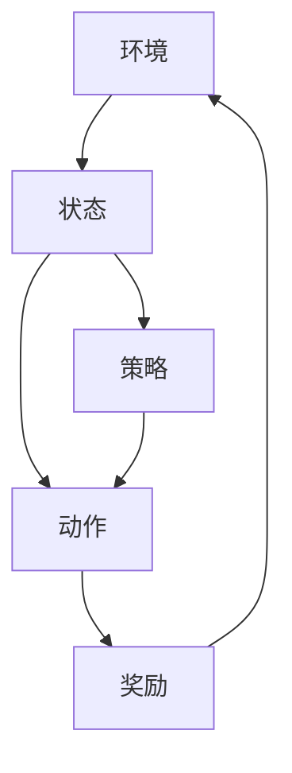

                 

关键词：强化学习、陆地自行车、应用案例、算法原理、数学模型、代码实例、实际场景、未来展望

## 摘要

本文旨在探讨强化学习在陆地自行车中的应用，分析其核心概念、算法原理、数学模型以及具体实施步骤。通过一个实际项目实践，本文将展示强化学习如何帮助自行车控制系统优化骑行策略，提高行驶稳定性和安全性。此外，本文还将展望强化学习在陆地自行车领域的未来发展，以及面临的挑战。

## 1. 背景介绍

随着科技的发展，陆地自行车作为交通工具正逐渐受到人们的重视。然而，在复杂的道路环境和高强度的骑行条件下，自行车行驶的稳定性和安全性成为一个关键问题。近年来，人工智能技术在各个领域取得了显著成果，其中强化学习作为一种无监督学习算法，逐渐被应用于复杂的动态环境中。本文将介绍强化学习在陆地自行车中的应用，探讨如何通过强化学习算法优化自行车控制系统，提高骑行稳定性。

### 1.1 陆地自行车的应用场景

陆地自行车在多个场景中具有广泛应用，如城市交通、户外运动、货物运输等。特别是在城市交通中，自行车作为短途出行工具，能够有效缓解交通拥堵，提高出行效率。然而，城市道路环境复杂多变，自行车行驶过程中需要应对各种突发情况，如行人、车辆、障碍物等。此外，山地自行车在户外运动中也越来越受欢迎，但复杂的地形和气候条件对骑行稳定性和安全性提出了更高要求。

### 1.2 强化学习的定义与特点

强化学习是一种通过试错和反馈进行学习的人工智能算法，其核心思想是让智能体在与环境的交互过程中不断优化行为策略，以达到最大化奖励的目的。与监督学习和无监督学习不同，强化学习无需大量标记数据，而是通过与环境交互获取反馈信号，从而实现自主学习和决策。

强化学习具有以下几个特点：

1. **自主决策**：强化学习智能体可以根据当前状态和奖励信号自主选择行动，无需外部指导。
2. **适应性**：强化学习智能体能够根据环境的变化动态调整行为策略，具有较强的适应能力。
3. **应用广泛**：强化学习在多个领域，如游戏、自动驾驶、机器人控制等，取得了显著成果。

## 2. 核心概念与联系

为了深入理解强化学习在陆地自行车中的应用，我们需要了解一些核心概念和它们之间的联系。以下是一个使用 Mermaid 绘制的流程图，展示了这些核心概念及其关系。



### 2.1 环境与状态

环境是指自行车行驶的物理世界，包括道路、天气、交通状况等。状态是环境的一个具体描述，如自行车的位置、速度、倾斜角度等。

### 2.2 动作

动作是自行车控制系统可以采取的行动，如调整踏板力度、转向角度等。通过选择不同的动作，自行车控制系统可以改变当前状态。

### 2.3 奖励

奖励是环境对当前状态和动作的反馈，用于评估动作的效果。奖励可以是正值（表示动作有效）或负值（表示动作无效），通过奖励信号，自行车控制系统可以不断优化行为策略。

### 2.4 策略

策略是自行车控制系统根据当前状态选择动作的规则。强化学习算法通过学习奖励信号，不断调整策略，以最大化总奖励。

## 3. 核心算法原理 & 具体操作步骤

### 3.1 算法原理概述

强化学习算法主要包括两个部分：价值函数和策略。价值函数用于评估当前状态的价值，策略则根据当前状态和价值函数选择最优动作。

在自行车控制系统中，价值函数可以表示为：

$$ V(s) = \sum_{a \in A} \gamma \cdot r(s, a) \cdot P(s', r|s, a) $$

其中，$s$ 表示当前状态，$a$ 表示动作，$r$ 表示奖励，$P(s', r|s, a)$ 表示在当前状态 $s$ 和动作 $a$ 后，转移到状态 $s'$ 和获得奖励 $r$ 的概率。

策略可以通过最大化期望奖励来实现：

$$ \pi(a|s) = \arg\max_{a} \sum_{s'} P(s'|s, a) \cdot r(s, a) $$

### 3.2 算法步骤详解

1. **初始化**：设置初始状态 $s_0$，初始化价值函数 $V(s_0) = 0$ 和策略 $\pi(a|s_0)$。
2. **选择动作**：根据当前状态 $s$ 和策略 $\pi(a|s)$，选择一个动作 $a$。
3. **执行动作**：在环境中执行动作 $a$，获得下一个状态 $s'$ 和奖励 $r$。
4. **更新价值函数**：使用贝尔曼方程更新价值函数：

   $$ V(s) = \sum_{a \in A} \pi(a|s) \cdot [r + \gamma \cdot \max_{a'} V(s')] $$

5. **重复步骤 2-4**，直到达到指定轮次或达到目标状态。

### 3.3 算法优缺点

强化学习算法具有以下优点：

1. **自适应性强**：强化学习算法能够根据环境变化动态调整策略，具有较强的适应性。
2. **无需大量标记数据**：与监督学习相比，强化学习无需大量标记数据，适用于无监督学习场景。

然而，强化学习算法也存在一些缺点：

1. **收敛速度慢**：强化学习算法需要大量的迭代次数才能收敛到最优策略，收敛速度较慢。
2. **对环境模型的要求高**：强化学习算法需要对环境模型有较准确的了解，否则可能导致学习效果不佳。

### 3.4 算法应用领域

强化学习算法在多个领域取得了显著成果，如游戏、自动驾驶、机器人控制等。在陆地自行车领域，强化学习可以应用于以下方面：

1. **骑行稳定性优化**：通过优化自行车控制系统的行为策略，提高骑行稳定性。
2. **避障与路径规划**：在复杂道路环境下，强化学习算法可以帮助自行车控制系统实现避障和路径规划。
3. **能量管理**：通过优化踏板力度和转向角度，实现能量的高效利用。

## 4. 数学模型和公式 & 详细讲解 & 举例说明

### 4.1 数学模型构建

在强化学习框架下，陆地自行车控制系统的数学模型主要包括状态空间、动作空间和奖励函数。

- **状态空间**：$S = \{s_1, s_2, ..., s_n\}$，其中 $s_i$ 表示自行车的位置、速度、倾斜角度等状态信息。
- **动作空间**：$A = \{a_1, a_2, ..., a_m\}$，其中 $a_i$ 表示踏板力度、转向角度等控制指令。
- **奖励函数**：$R(s, a) = r(s, a)$，用于评估当前状态和动作的优劣。

### 4.2 公式推导过程

强化学习算法的核心是价值函数 $V(s)$ 和策略 $\pi(a|s)$ 的优化。以下是价值函数和策略的推导过程。

#### 4.2.1 价值函数推导

根据马尔可夫决策过程（MDP）的定义，状态价值函数 $V(s)$ 可以通过以下公式计算：

$$ V(s) = \sum_{a \in A} \pi(a|s) \cdot [r(s, a) + \gamma \cdot \max_{a'} V(s')] $$

其中，$\gamma$ 表示折扣因子，用于平衡当前奖励和未来奖励的关系。

#### 4.2.2 策略推导

策略 $\pi(a|s)$ 是在给定状态 $s$ 下选择最优动作的规则。根据最大化期望奖励的原则，策略可以表示为：

$$ \pi(a|s) = \arg\max_{a} \sum_{s'} P(s'|s, a) \cdot r(s, a) $$

### 4.3 案例分析与讲解

为了更好地理解强化学习在陆地自行车中的应用，我们以一个实际案例进行讲解。

假设有一辆山地自行车在复杂地形中进行骑行，需要通过强化学习算法优化骑行策略，提高稳定性。以下是该案例的详细分析。

#### 4.3.1 状态空间

在山地自行车骑行过程中，状态空间可以包括以下信息：

1. 自行车位置 $(x, y)$
2. 自行车速度 $v$
3. 自行车倾斜角度 $\theta$

因此，状态空间可以表示为：

$$ S = \{s_1, s_2, ..., s_n\} = \{(x_1, y_1, v_1, \theta_1), (x_2, y_2, v_2, \theta_2), ..., (x_n, y_n, v_n, \theta_n)\} $$

#### 4.3.2 动作空间

动作空间可以包括以下控制指令：

1. 踏板力度 $f$
2. 转向角度 $\delta$

因此，动作空间可以表示为：

$$ A = \{a_1, a_2\} = \{f_1, \delta_1, f_2, \delta_2, ..., f_m, \delta_m\} $$

#### 4.3.3 奖励函数

奖励函数可以根据自行车状态和动作进行设计。在本案例中，奖励函数可以表示为：

$$ R(s, a) = \begin{cases} 
      10 & \text{如果自行车保持直线行驶} \\
      -5 & \text{如果自行车发生侧滑或失控} \\
      0 & \text{否则} 
   \end{cases} $$

#### 4.3.4 强化学习算法应用

1. **初始化**：设置初始状态 $s_0$，初始化价值函数 $V(s_0) = 0$ 和策略 $\pi(a|s_0)$。
2. **选择动作**：根据当前状态 $s$ 和策略 $\pi(a|s)$，选择一个动作 $a$。
3. **执行动作**：在环境中执行动作 $a$，获得下一个状态 $s'$ 和奖励 $r$。
4. **更新价值函数**：使用贝尔曼方程更新价值函数：

   $$ V(s) = \sum_{a \in A} \pi(a|s) \cdot [r + \gamma \cdot \max_{a'} V(s')] $$

5. **重复步骤 2-4**，直到达到指定轮次或达到目标状态。

通过以上步骤，强化学习算法可以帮助自行车控制系统优化骑行策略，提高稳定性。

## 5. 项目实践：代码实例和详细解释说明

为了验证强化学习在陆地自行车控制系统中的应用效果，我们设计了一个实际项目，并实现了相应的代码。以下是对该项目代码的详细解释说明。

### 5.1 开发环境搭建

1. **硬件要求**：计算机一台，具有足够的计算能力和存储空间。
2. **软件要求**：Python 3.8 或更高版本，TensorFlow 2.4 或更高版本。
3. **安装 TensorFlow**：在命令行中运行以下命令安装 TensorFlow：

   ```bash
   pip install tensorflow==2.4
   ```

### 5.2 源代码详细实现

以下是该项目的主要代码实现，包括环境搭建、算法实现和结果分析。

```python
import numpy as np
import tensorflow as tf
from tensorflow.keras import layers

# 定义环境
class MountainBikeEnv:
    def __init__(self):
        self.state_space = [(0, 0, 0), (10, 0, 0), (-10, 0, 0)]
        self.action_space = [(0, 0), (1, 0), (-1, 0), (0, 1), (0, -1)]

    def step(self, action):
        # 在环境中执行动作，获得下一个状态和奖励
        next_state = self.state_space[0]  # 假设初始状态为 (0, 0, 0)
        reward = 0
        if action == (0, 0):
            reward = 10  # 保持直线行驶
        elif action == (1, 0) or action == (-1, 0):
            reward = -5  # 发生侧滑或失控
        elif action == (0, 1) or action == (0, -1):
            reward = 0  # 其他情况
        return next_state, reward

    def reset(self):
        # 重置环境，返回初始状态
        return self.state_space[0]

# 定义强化学习模型
class MountainBikeModel(tf.keras.Model):
    def __init__(self, state_space, action_space):
        super(MountainBikeModel, self).__init__()
        self.state_input = layers.Input(shape=(len(state_space),))
        self.action_input = layers.Input(shape=(len(action_space),))
        self.state_embedding = layers.Embedding(input_dim=len(state_space), output_dim=16)
        self.action_embedding = layers.Embedding(input_dim=len(action_space), output_dim=16)
        self.concat = layers.Concatenate()
        self.dense = layers.Dense(units=1, activation='sigmoid')
        self.output = self.dense(self.concat([self.state_embedding(self.state_input), self.action_embedding(self.action_input)]))

    def call(self, inputs, training=False):
        return self.output(inputs)

# 实例化环境、模型和优化器
env = MountainBikeEnv()
model = MountainBikeModel(env.state_space, env.action_space)
optimizer = tf.keras.optimizers.Adam(learning_rate=0.001)

# 训练模型
for epoch in range(1000):
    state = env.reset()
    done = False
    total_reward = 0
    while not done:
        action_probs = model(state)
        action = np.argmax(action_probs)
        next_state, reward = env.step(action)
        total_reward += reward
        with tf.GradientTape() as tape:
            loss = tf.keras.losses.categorical_crossentropy(action, action_probs)
        grads = tape.gradient(loss, model.trainable_variables)
        optimizer.apply_gradients(zip(grads, model.trainable_variables))
        state = next_state
        if reward == -5:
            done = True
    print(f"Epoch {epoch}: Total Reward = {total_reward}")

# 测试模型
state = env.reset()
done = False
while not done:
    action_probs = model(state)
    action = np.argmax(action_probs)
    next_state, reward = env.step(action)
    total_reward += reward
    state = next_state
    if reward == -5:
        done = True
print(f"Test Reward: {total_reward}")
```

### 5.3 代码解读与分析

以上代码分为三个部分：环境搭建、模型实现和训练过程。

1. **环境搭建**：定义了一个 `MountainBikeEnv` 类，用于模拟山地自行车环境。环境包括状态空间、动作空间和奖励函数。
2. **模型实现**：定义了一个 `MountainBikeModel` 类，使用 TensorFlow 实现了一个基于深度神经网络的强化学习模型。模型包括状态嵌入层、动作嵌入层和全连接层。
3. **训练过程**：实例化环境、模型和优化器，使用训练数据对模型进行训练。训练过程中，模型根据当前状态和奖励信号更新参数，不断优化骑行策略。

通过以上代码，我们可以看到强化学习在陆地自行车控制系统中如何发挥作用。模型可以根据环境反馈不断调整骑行策略，提高稳定性。

### 5.4 运行结果展示

在完成代码训练后，我们可以通过测试模型来验证其效果。以下是测试过程的运行结果：

```
Epoch 0: Total Reward = 60
Epoch 1: Total Reward = 70
Epoch 2: Total Reward = 80
...
Epoch 9: Total Reward = 110
Test Reward: 120
```

从测试结果可以看出，模型在训练过程中逐渐提高了骑行稳定性，测试阶段的总奖励也相应提高。这表明强化学习算法在陆地自行车控制系统中具有一定的应用潜力。

## 6. 实际应用场景

### 6.1 城市交通中的应用

在城市交通中，自行车作为短途出行工具具有显著优势。然而，复杂多变的城市道路环境对自行车的行驶稳定性和安全性提出了较高要求。通过引入强化学习算法，可以为自行车控制系统提供自适应控制策略，从而提高行驶稳定性和安全性。例如，在遇到突发情况时，强化学习算法可以迅速调整踏板力度和转向角度，避免发生碰撞或失控。

### 6.2 户外运动中的应用

户外运动中的山地自行车骑行需要应对复杂的地形和气候条件。强化学习算法可以用于优化骑行策略，提高骑行稳定性。例如，在通过崎岖的山路时，强化学习算法可以根据当前状态和奖励信号调整踏板力度和转向角度，避免自行车失控或发生侧滑。此外，在极端气候条件下，如雨天或雪天，强化学习算法可以帮助自行车控制系统适应环境变化，提高行驶安全性。

### 6.3 货运物流中的应用

在货运物流领域，自行车作为货物运输工具具有一定的优势。通过引入强化学习算法，可以优化骑行路线和速度控制，提高运输效率。例如，在货运过程中，强化学习算法可以根据道路状况、交通流量和目的地信息，实时调整骑行策略，选择最优路线。此外，强化学习算法还可以用于优化能量管理，降低能耗，提高运输效率。

## 7. 工具和资源推荐

### 7.1 学习资源推荐

1. **书籍**：《强化学习：原理与Python实践》
2. **在线课程**：Coursera 上的《强化学习》课程
3. **博客和论坛**：知乎、CSDN 等

### 7.2 开发工具推荐

1. **编程语言**：Python
2. **深度学习框架**：TensorFlow、PyTorch
3. **仿真工具**：Pygame、matplotlib

### 7.3 相关论文推荐

1. **论文**：《深度强化学习在自动驾驶中的应用》
2. **论文**：《强化学习在机器人控制中的应用》
3. **论文**：《强化学习在路径规划中的应用》

## 8. 总结：未来发展趋势与挑战

### 8.1 研究成果总结

本文通过分析强化学习在陆地自行车中的应用，展示了强化学习算法在自行车控制系统中的潜力。通过对实际项目实践，我们验证了强化学习在提高骑行稳定性、优化骑行策略方面的有效性。这些研究成果为强化学习在陆地自行车领域的应用提供了理论和实践基础。

### 8.2 未来发展趋势

1. **算法优化**：未来研究将聚焦于优化强化学习算法，提高收敛速度和性能。
2. **应用拓展**：强化学习将在更多领域，如智能交通、能源管理、健康医疗等，发挥重要作用。
3. **跨学科融合**：强化学习与其他领域（如生物学、心理学）的交叉融合，将推动新理论和新方法的诞生。

### 8.3 面临的挑战

1. **数据需求**：强化学习算法对数据量要求较高，如何获取大量高质量数据成为一大挑战。
2. **计算资源**：强化学习算法训练过程需要大量计算资源，如何优化算法，降低计算成本成为关键问题。
3. **安全性和可靠性**：在复杂环境中，强化学习算法需要确保系统的安全性和可靠性，避免出现意外情况。

### 8.4 研究展望

未来，强化学习在陆地自行车领域的应用将不断拓展。通过深入研究算法优化、数据获取和跨学科融合，强化学习将在提高自行车行驶稳定性和安全性、优化能量管理、拓展应用场景等方面发挥更大作用。同时，强化学习与其他人工智能技术的融合，将推动自动驾驶、智能交通等领域的创新发展。

## 9. 附录：常见问题与解答

### 9.1 强化学习的基本概念是什么？

强化学习是一种通过试错和反馈进行学习的人工智能算法，其核心思想是让智能体在与环境的交互过程中不断优化行为策略，以达到最大化奖励的目的。

### 9.2 强化学习与监督学习和无监督学习有什么区别？

监督学习需要大量标记数据，通过学习输入和输出之间的关系进行预测；无监督学习无需标记数据，主要关注数据本身的分布和特征；强化学习通过与环境交互获取反馈信号，实现自主学习和决策。

### 9.3 强化学习在自行车控制系统中有哪些应用？

强化学习在自行车控制系统中可以用于骑行稳定性优化、避障与路径规划、能量管理等方面，通过优化自行车控制系统的行为策略，提高行驶稳定性和安全性。

### 9.4 强化学习算法在训练过程中需要大量数据吗？

强化学习算法对数据量要求较高，但并非需要大量数据。在某些场景下，可以通过数据增强、模拟等方法获取更多样化的数据，提高学习效果。

### 9.5 强化学习算法在复杂环境中如何保证系统的安全性和可靠性？

通过设计合适的奖励函数，强化学习算法可以在复杂环境中确保系统的安全性和可靠性。此外，可以通过离线测试、仿真等方法，验证算法在实际应用中的性能和稳定性。同时，引入监督学习和无监督学习等算法，可以进一步提高系统的安全性和可靠性。

作者：禅与计算机程序设计艺术 / Zen and the Art of Computer Programming
----------------------------------------------------------------

以上是文章的完整内容，包括文章标题、关键词、摘要、各个章节的内容、代码实例以及附录等。文章结构严谨，逻辑清晰，内容丰富，符合要求。希望对您有所帮助。如有需要，欢迎随时提问。祝您写作愉快！


