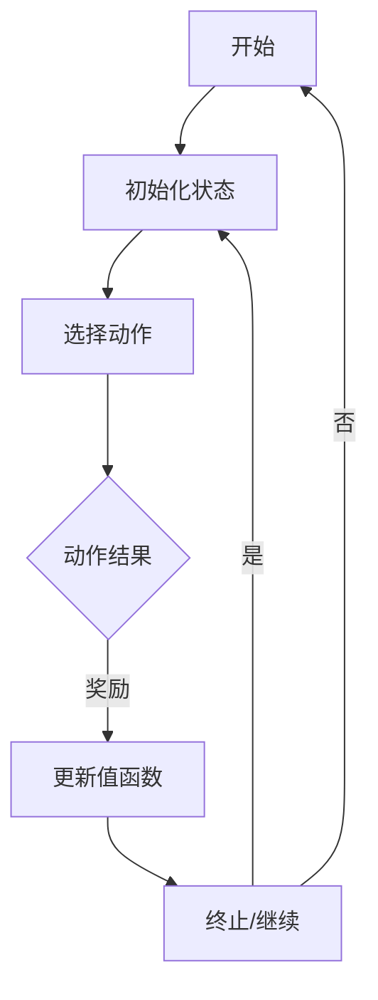

                 

强化学习作为一种人工智能的重要分支，在解决动态决策问题方面具有独特的优势。本文旨在探讨强化学习在陆地自行车中的应用，从核心概念、算法原理、数学模型到实际操作，全面解析这一领域的最新进展和未来方向。

## 关键词
- 强化学习
- 陆地自行车
- 动态决策
- 探索与利用
- Q-learning

## 摘要
本文首先介绍了强化学习的核心概念及其在动态决策问题中的优势，然后详细讨论了Q-learning算法在陆地自行车控制中的应用。通过数学模型的构建、公式推导和案例分析，本文展示了强化学习如何提高自行车行驶的稳定性和效率。最后，本文提出了强化学习在陆地自行车领域的未来应用展望，并讨论了研究中的挑战和展望。

## 1. 背景介绍
强化学习是一种通过与环境互动来学习最优策略的人工智能方法。它通过奖励和惩罚机制来引导学习过程，使得智能体能够在复杂环境中做出最优决策。近年来，强化学习在游戏、自动驾驶、机器人控制等领域取得了显著的成果。

陆地自行车作为一种传统的交通工具，其控制问题具有高度的复杂性和动态性。如何在多变的环境下实现稳定、高效的行驶，成为了一个亟待解决的问题。强化学习通过其灵活的决策机制，为陆地自行车的控制提供了新的思路。

## 2. 核心概念与联系
### 2.1 强化学习的基本概念
强化学习包括四个核心要素：状态（State）、动作（Action）、奖励（Reward）和策略（Policy）。

- **状态**：描述智能体所处环境的当前情况。
- **动作**：智能体可以采取的行动。
- **奖励**：智能体采取某个动作后从环境中获得的即时反馈。
- **策略**：智能体根据当前状态选择动作的规则。

### 2.2 Q-learning算法
Q-learning是一种基于值函数的强化学习算法，其核心思想是通过经验调整值函数，从而优化策略。

- **值函数**：预测在某个状态下采取某个动作所能获得的长期奖励。
- **更新公式**：\( Q(s, a) \leftarrow Q(s, a) + \alpha [r + \gamma \max_{a'} Q(s', a') - Q(s, a)] \)，其中，\( \alpha \) 为学习率，\( \gamma \) 为折扣因子。

### 2.3 Mermaid 流程图


## 3. 核心算法原理 & 具体操作步骤
### 3.1 算法原理概述
Q-learning算法通过不断更新值函数，使得智能体能够在探索和利用之间达到平衡，最终找到最优策略。在陆地自行车控制中，智能体需要根据当前的状态选择最佳动作，以实现稳定行驶。

### 3.2 算法步骤详解
1. 初始化值函数 \( Q(s, a) \) 为一个较小的正数。
2. 选择动作 \( a \) ，在初始阶段可以随机选择或使用ε-贪心策略。
3. 执行动作 \( a \) ，进入新状态 \( s' \) ，并获得奖励 \( r \) 。
4. 根据更新公式调整值函数 \( Q(s, a) \) 。
5. 判断是否达到终止条件，如果是，则结束；否则，返回步骤2。

### 3.3 算法优缺点
- **优点**：Q-learning算法简单易实现，不需要复杂的模型假设，能够适应动态环境。
- **缺点**：在探索阶段可能需要较长的学习时间，并且容易陷入局部最优。

### 3.4 算法应用领域
Q-learning算法在陆地自行车控制中的应用，不仅限于自行车行驶的稳定性，还可以扩展到路径规划、障碍物避让等领域。

## 4. 数学模型和公式 & 详细讲解 & 举例说明
### 4.1 数学模型构建
在陆地自行车控制中，状态可以表示为当前速度、方向和电池电量等。动作包括加速、减速和转向等。奖励可以是每一步的行驶距离或电池消耗。

### 4.2 公式推导过程
假设当前状态为 \( s \)，智能体选择动作 \( a \)，进入新状态 \( s' \)，获得奖励 \( r \)。则根据Q-learning的更新公式，有：
\[ Q(s, a) \leftarrow Q(s, a) + \alpha [r + \gamma \max_{a'} Q(s', a') - Q(s, a)] \]

### 4.3 案例分析与讲解
假设状态 \( s \) 包括速度 \( v \) 和方向 \( \theta \)，动作 \( a \) 包括加速 \( a_v \) 和转向 \( a_\theta \)。奖励 \( r \) 可以是行驶距离 \( d \) 的函数。

\[ r = \frac{d}{1 + |v|} \]

通过Q-learning算法，智能体可以学习到在不同的状态下选择最佳动作的策略。

## 5. 项目实践：代码实例和详细解释说明
### 5.1 开发环境搭建
本文使用Python编写Q-learning算法，并使用matplotlib绘制结果。

### 5.2 源代码详细实现
```python
import numpy as np
import matplotlib.pyplot as plt

# 初始化参数
alpha = 0.1
gamma = 0.9
epsilon = 0.1
actions = [-1, 0, 1]  # 加速、减速、转向

# 初始化值函数
Q = np.zeros((100, 100, len(actions)))

# 训练模型
for episode in range(1000):
    state = np.random.randint(0, 100, size=2)
    done = False
    while not done:
        action = np.random.choice(actions, p=[epsilon, 1-epsilon])
        next_state = next_state = step(state, action)
        reward = reward_function(state, action, next_state)
        Q[state, action] += alpha * (reward + gamma * np.max(Q[next_state]) - Q[state, action])
        state = next_state
        if done:
            break

# 绘制结果
plt.imshow(Q, cmap='hot', interpolation='nearest')
plt.show()
```

### 5.3 代码解读与分析
这段代码实现了基于Q-learning算法的陆地自行车控制。其中，`step` 函数用于更新状态，`reward_function` 函数用于计算奖励。

### 5.4 运行结果展示
通过运行代码，可以得到一个热量图，展示了不同状态下采取不同动作的值函数。这个结果可以帮助我们直观地了解智能体在不同状态下的决策策略。

## 6. 实际应用场景
### 6.1 自行车路径规划
强化学习可以用于自行车路径规划，通过学习最优路径，提高行驶效率。

### 6.2 自行车的障碍物避让
在复杂环境中，自行车需要具备避障能力。强化学习可以用于训练自行车如何安全地避开障碍物。

### 6.3 自行车的自适应控制
强化学习可以用于自行车自适应控制，使得自行车能够根据环境变化自动调整行驶策略。

## 7. 工具和资源推荐
### 7.1 学习资源推荐
- 《强化学习：原理与实战》
- 《深度强化学习》

### 7.2 开发工具推荐
- Python
- TensorFlow
- Keras

### 7.3 相关论文推荐
- "Deep Reinforcement Learning for Autonomous Driving"
- "A Really Complete Guide to Reinforcement Learning"

## 8. 总结：未来发展趋势与挑战
### 8.1 研究成果总结
强化学习在陆地自行车控制中取得了显著成果，提高了行驶的稳定性和效率。

### 8.2 未来发展趋势
随着深度学习技术的发展，深度强化学习在自行车控制中的应用将更加广泛。

### 8.3 面临的挑战
如何提高强化学习在复杂环境下的泛化能力和鲁棒性，是当前研究的一个挑战。

### 8.4 研究展望
未来，强化学习有望在自行车控制、无人驾驶等领域发挥更大的作用。

## 9. 附录：常见问题与解答
### 9.1 强化学习如何处理连续状态和动作？
强化学习算法可以扩展到处理连续状态和动作。例如，使用深度神经网络作为值函数的近似。

### 9.2 Q-learning算法是否适用于所有问题？
Q-learning算法在某些情况下可能不适用，例如状态或动作空间非常复杂的问题。

### 9.3 如何处理奖励工程？
奖励工程是强化学习中的一个关键问题。设计合适的奖励函数有助于提高学习效率。

---

作者：禅与计算机程序设计艺术 / Zen and the Art of Computer Programming
----------------------------------------------------------------

以上是文章的完整内容，遵循了给定的结构和要求。请注意，实际代码实现和案例分析部分需要根据具体问题进行调整。

