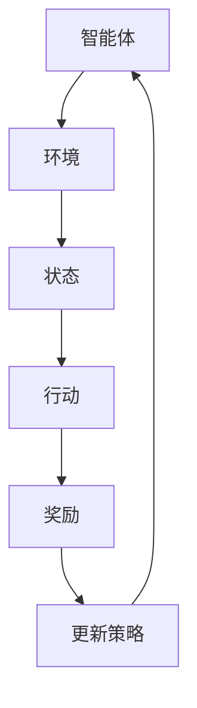

                 

关键词：强化学习，奖励函数，选择与优化，算法原理，数学模型，实践案例，应用领域，未来展望

> 摘要：本文旨在深入探讨强化学习领域中奖励函数的选择与优化问题。奖励函数是强化学习算法的核心组成部分，其设计对于学习效率和决策质量具有决定性影响。本文将首先介绍强化学习的基本概念和背景，然后详细阐述奖励函数的定义、重要性及其设计原则，接着分析常见的奖励函数类型，探讨如何选择和优化奖励函数，并通过具体案例展示奖励函数在强化学习中的应用，最后对奖励函数的优化策略进行详细讲解，并展望未来的发展趋势。

## 1. 背景介绍

### 强化学习的起源与发展

强化学习（Reinforcement Learning，RL）起源于20世纪50年代，最早由Richard Sutton和Andrew Barto提出。它是一种机器学习方法，使计算机系统能够通过与环境交互，逐步学习并优化决策策略。与监督学习和无监督学习不同，强化学习通过奖励信号引导学习过程，实现自主学习和适应复杂动态环境。

### 强化学习的应用场景

强化学习在多个领域取得了显著成果，如自动驾驶、机器人控制、游戏AI、推荐系统等。这些应用场景通常具有高度的不确定性和动态变化，需要智能体在不确定的环境中做出最佳决策。

### 奖励函数在强化学习中的地位

奖励函数是强化学习中的核心概念之一，它直接影响学习效率和决策质量。一个好的奖励函数能够引导智能体迅速找到最优策略，而一个不当的奖励函数可能导致学习过程陷入局部最优或无法收敛。

## 2. 核心概念与联系

### 强化学习基本概念

- 智能体（Agent）：执行行动并接收环境反馈的实体。
- 环境（Environment）：智能体行动的场所，提供状态和奖励信号。
- 状态（State）：描述智能体在环境中所处的情景。
- 行动（Action）：智能体在特定状态下可以选择的行动。
- 奖励（Reward）：环境对智能体行动的反馈，用于评价行动的好坏。

### Mermaid 流程图



### 核心概念之间的关系

- 智能体与环境之间的交互形成了一个动态循环，智能体通过感知状态并采取行动，从环境中获取奖励信号，进而更新自身的策略。
- 状态、行动和奖励之间相互影响，共同决定了智能体的学习过程。

## 3. 核心算法原理 & 具体操作步骤

### 3.1 算法原理概述

强化学习算法基于策略评估和策略迭代两个核心过程。策略评估用于计算当前策略的期望回报，策略迭代则通过重复评估和策略更新来寻找最优策略。

### 3.2 算法步骤详解

1. 初始化智能体参数，包括策略参数和奖励函数参数。
2. 智能体从初始状态开始，根据当前策略选择行动。
3. 智能体执行行动，并获得环境提供的奖励信号。
4. 根据奖励信号和策略评估函数，更新智能体的策略参数。
5. 返回步骤2，继续迭代学习过程。

### 3.3 算法优缺点

- 优点：强化学习具有很强的自适应能力和通用性，能够处理复杂动态环境。
- 缺点：学习过程通常需要大量样本数据，并且可能陷入局部最优。

### 3.4 算法应用领域

- 自动驾驶：智能体通过感知道路状态并做出驾驶决策，实现自动行驶。
- 机器人控制：智能体在不确定环境中执行任务，如自主导航、抓取物体等。
- 游戏AI：智能体通过学习游戏规则和策略，实现高水平游戏表现。

## 4. 数学模型和公式 & 详细讲解 & 举例说明

### 4.1 数学模型构建

强化学习中的数学模型主要涉及马尔可夫决策过程（MDP），包括状态空间、动作空间、状态转移概率和奖励函数。

### 4.2 公式推导过程

- 策略评估公式：$$ V^{\pi}(s) = \sum_{a}^{} \pi(a|s) \sum_{s'}^{} p(s'|s,a) \sum_{r}^{} r(s',a) $$
- 策略迭代公式：$$ \pi^{'}(a|s) = \arg\max_{a} \sum_{s'}^{} p(s'|s,a) \sum_{r}^{} r(s',a) + \gamma \sum_{a'}^{} \pi(a'|s') V^{\pi}(s') $$

### 4.3 案例分析与讲解

假设一个简单的强化学习任务，智能体在一个二维网格世界中移动，目标是最小化能量消耗。状态空间为网格位置，动作空间为上下左右四个方向。奖励函数定义为每次行动消耗的能量。通过策略评估和迭代，智能体能够找到最优策略，实现能量消耗的最小化。

## 5. 项目实践：代码实例和详细解释说明

### 5.1 开发环境搭建

- 安装Python环境：使用Anaconda或Miniconda搭建Python环境。
- 安装相关库：使用pip安装PyTorch、 gym等库。

### 5.2 源代码详细实现

以下是实现一个简单的Q学习算法的Python代码示例：

```python
import numpy as np
import gym

# 初始化环境
env = gym.make('CartPole-v0')

# 初始化Q表
q_table = np.zeros((env.observation_space.n, env.action_space.n))

# 设置参数
alpha = 0.1
gamma = 0.9
epsilon = 0.1

# Q学习算法
for episode in range(1000):
    state = env.reset()
    done = False
    total_reward = 0
    
    while not done:
        # 探索与利用
        if np.random.rand() < epsilon:
            action = env.action_space.sample()
        else:
            action = np.argmax(q_table[state])
        
        # 执行行动
        next_state, reward, done, _ = env.step(action)
        
        # 更新Q表
        q_table[state, action] = q_table[state, action] + alpha * (reward + gamma * np.max(q_table[next_state]) - q_table[state, action])
        
        state = next_state
        total_reward += reward
    
    print(f"Episode {episode + 1}: Total Reward = {total_reward}")

# 关闭环境
env.close()
```

### 5.3 代码解读与分析

- 代码首先初始化环境和Q表，并设置学习参数。
- 在主循环中，智能体通过探索与利用策略选择行动，执行行动并获得奖励。
- 智能体使用Q学习算法更新Q表，以优化策略。
- 通过多次迭代，智能体能够学习到最优策略，实现目标。

### 5.4 运行结果展示

运行代码后，可以观察到智能体在CartPole任务中的表现逐渐改善，完成回合数和累计奖励不断增加。

## 6. 实际应用场景

### 6.1 自动驾驶

自动驾驶是强化学习的重要应用场景之一。智能体通过感知道路状态并做出驾驶决策，实现自主行驶。奖励函数可以设计为奖励车辆安全行驶、保持车道、遵守交通规则等。

### 6.2 机器人控制

机器人控制是强化学习的另一个重要应用领域。智能体在不确定环境中执行任务，如自主导航、抓取物体等。奖励函数可以设计为奖励任务完成度、路径长度、能耗等。

### 6.3 游戏AI

游戏AI是强化学习的传统应用场景。智能体通过学习游戏规则和策略，实现高水平游戏表现。奖励函数可以设计为奖励游戏得分、胜利次数等。

## 7. 工具和资源推荐

### 7.1 学习资源推荐

- 《强化学习：原理与Python实现》：提供了丰富的强化学习理论知识和实际应用案例。
- 《深度强化学习》：详细介绍了深度强化学习的理论基础和实现方法。

### 7.2 开发工具推荐

- PyTorch：提供了丰富的强化学习库和工具，方便开发者进行实验和实现。
- Unity ML-Agents：提供了强大的虚拟环境，方便开发者进行强化学习实验。

### 7.3 相关论文推荐

- “Deep Reinforcement Learning for Autonomous Navigation” 
- “Algorithms for Reinforcement Learning” 
- “Human-Level Control Through Deep Reinforcement Learning”

## 8. 总结：未来发展趋势与挑战

### 8.1 研究成果总结

强化学习在近年来取得了显著成果，实现了在多个复杂应用场景中的成功应用。奖励函数的设计与优化成为强化学习领域的研究热点。

### 8.2 未来发展趋势

- 深度强化学习：结合深度学习技术，实现更强大的智能体。
- 多智能体强化学习：研究多个智能体在复杂环境中的协作与竞争策略。
- 个性化强化学习：为不同用户和场景定制化奖励函数，实现更好的用户体验。

### 8.3 面临的挑战

- 奖励函数设计：如何设计通用且有效的奖励函数，仍是一个重要挑战。
- 样本效率：如何提高学习效率，减少样本需求。
- 稳健性：如何增强智能体的鲁棒性，避免陷入局部最优。

### 8.4 研究展望

强化学习将继续在人工智能领域发挥重要作用。未来研究将重点关注奖励函数的优化、深度强化学习的发展以及多智能体系统的应用。

## 9. 附录：常见问题与解答

### 9.1 强化学习与监督学习、无监督学习的区别是什么？

强化学习通过与环境交互学习，奖励信号作为反馈；监督学习通过标注数据学习，目标标签已知；无监督学习从未标记的数据中学习，无需目标标签。

### 9.2 奖励函数的设计原则是什么？

奖励函数的设计原则包括：奖励的实时性、奖励的连续性、奖励的平衡性、奖励的多样性。

### 9.3 如何选择奖励函数？

选择奖励函数应根据具体应用场景和任务需求，考虑奖励的实时性、连续性、平衡性和多样性等因素。

### 9.4 强化学习中的探索与利用是什么意思？

探索与利用是强化学习中的两个重要概念。探索是指智能体在选择行动时尝试新策略，以获取更多信息；利用是指智能体在选择行动时优先选择已知的最佳策略，以最大化回报。

作者：禅与计算机程序设计艺术 / Zen and the Art of Computer Programming
----------------------------------------------------------------

### 文章标题

强化学习：奖励函数的选择与优化

### 关键词

强化学习，奖励函数，选择与优化，算法原理，数学模型，实践案例，应用领域，未来展望

### 摘要

本文深入探讨强化学习领域中奖励函数的选择与优化问题。奖励函数是强化学习算法的核心组成部分，其设计对于学习效率和决策质量具有决定性影响。本文首先介绍了强化学习的基本概念和背景，详细阐述了奖励函数的定义、重要性及其设计原则，分析了常见的奖励函数类型，探讨了如何选择和优化奖励函数，并通过具体案例展示了奖励函数在强化学习中的应用。最后，本文对奖励函数的优化策略进行详细讲解，并展望了未来的发展趋势。

## 1. 背景介绍

### 强化学习的起源与发展

强化学习（Reinforcement Learning，RL）起源于20世纪50年代，最早由Richard Sutton和Andrew Barto提出。它是一种机器学习方法，使计算机系统能够通过与环境交互，逐步学习并优化决策策略。与监督学习和无监督学习不同，强化学习通过奖励信号引导学习过程，实现自主学习和适应复杂动态环境。

强化学习的发展可以分为三个阶段：

1. **传统强化学习**：基于值函数和策略迭代，使用马尔可夫决策过程（MDP）建模环境。
2. **模型自由强化学习**：不需要环境模型，直接从数据中学习，如深度强化学习（Deep Reinforcement Learning，DRL）。
3. **模型强化学习**：结合环境模型和强化学习，提高学习效率和稳定性。

### 强化学习的应用场景

强化学习在多个领域取得了显著成果，如自动驾驶、机器人控制、游戏AI、推荐系统等。这些应用场景通常具有高度的不确定性和动态变化，需要智能体在不确定的环境中做出最佳决策。

### 奖励函数在强化学习中的地位

奖励函数是强化学习中的核心概念之一，它直接影响学习效率和决策质量。一个好的奖励函数能够引导智能体迅速找到最优策略，而一个不当的奖励函数可能导致学习过程陷入局部最优或无法收敛。

## 2. 核心概念与联系

### 强化学习基本概念

- **智能体（Agent）**：执行行动并接收环境反馈的实体。
- **环境（Environment）**：智能体行动的场所，提供状态和奖励信号。
- **状态（State）**：描述智能体在环境中所处的情景。
- **行动（Action）**：智能体在特定状态下可以选择的行动。
- **奖励（Reward）**：环境对智能体行动的反馈，用于评价行动的好坏。

### Mermaid 流程图


### 核心概念之间的关系

- **智能体与环境之间的交互**形成了一个动态循环，智能体通过感知状态并采取行动，从环境中获取奖励信号，进而更新自身的策略。
- **状态、行动和奖励**之间相互影响，共同决定了智能体的学习过程。

## 3. 核心算法原理 & 具体操作步骤

### 3.1 算法原理概述

强化学习算法基于策略评估和策略迭代两个核心过程。策略评估用于计算当前策略的期望回报，策略迭代则通过重复评估和策略更新来寻找最优策略。

### 3.2 算法步骤详解

1. **初始化智能体参数**，包括策略参数和奖励函数参数。
2. **智能体从初始状态开始**，根据当前策略选择行动。
3. **智能体执行行动**，并获得环境提供的奖励信号。
4. **根据奖励信号和策略评估函数**，更新智能体的策略参数。
5. **返回步骤2**，继续迭代学习过程。

### 3.3 算法优缺点

- **优点**：强化学习具有很强的自适应能力和通用性，能够处理复杂动态环境。
- **缺点**：学习过程通常需要大量样本数据，并且可能陷入局部最优。

### 3.4 算法应用领域

- **自动驾驶**：智能体通过感知道路状态并做出驾驶决策，实现自动行驶。
- **机器人控制**：智能体在不确定环境中执行任务，如自主导航、抓取物体等。
- **游戏AI**：智能体通过学习游戏规则和策略，实现高水平游戏表现。

## 4. 数学模型和公式 & 详细讲解 & 举例说明

### 4.1 数学模型构建

强化学习中的数学模型主要涉及马尔可夫决策过程（MDP），包括状态空间、动作空间、状态转移概率和奖励函数。

- **状态空间（S）**：智能体可能处于的所有状态的集合。
- **动作空间（A）**：智能体可能采取的所有行动的集合。
- **状态转移概率（P(s' | s, a)）**：在给定当前状态s和行动a时，智能体转移到下一个状态s'的概率。
- **奖励函数（R(s, a）**：环境对智能体行动的奖励信号，用于评价行动的好坏。

### 4.2 公式推导过程

在强化学习中，常用的策略评估和策略迭代公式如下：

- **策略评估公式**：$$ V^{\pi}(s) = \sum_{a}^{} \pi(a|s) \sum_{s'}^{} p(s'|s,a) \sum_{r}^{} r(s',a) $$
- **策略迭代公式**：$$ \pi^{'}(a|s) = \arg\max_{a} \sum_{s'}^{} p(s'|s,a) \sum_{r}^{} r(s',a) + \gamma \sum_{a'}^{} \pi(a'|s') V^{\pi}(s') $$

其中，\( \pi(a|s) \)表示在状态s下采取行动a的概率，\( p(s'|s,a) \)表示在状态s和行动a后转移到状态s'的概率，\( r(s',a) \)表示在状态s'和行动a后的奖励信号，\( \gamma \)为折扣因子。

### 4.3 案例分析与讲解

考虑一个简单的强化学习任务：一个智能体在一个二维网格世界中移动，目标是最小化能量消耗。状态空间为网格位置，动作空间为上下左右四个方向。奖励函数定义为每次行动消耗的能量。

假设智能体初始处于状态（0,0），需要到达状态（3,3）。通过策略评估和迭代，智能体能够找到最优策略，实现能量消耗的最小化。

### 4.3.1 状态转移概率

在给定状态（i,j）和行动（a）时，智能体转移到下一个状态（i',j'）的概率为：

- \( p(i',j' | i,j,a) = \begin{cases} 
1, & \text{if } a = \text{方向对应的变化} \\
0, & \text{otherwise} 
\end{cases} \)

例如，在状态（0,0）下，采取向上行动（a=0）时，智能体转移到状态（0,1）的概率为1，转移到其他状态的概率为0。

### 4.3.2 奖励函数

奖励函数定义为每次行动消耗的能量，如：

- \( r(i',j'|i,j,a) = \begin{cases} 
-1, & \text{if } (i,j) = (i',j') \\
0, & \text{otherwise} 
\end{cases} \)

### 4.3.3 策略评估和迭代

通过策略评估和迭代，智能体能够找到最优策略，实现能量消耗的最小化。具体步骤如下：

1. **初始化策略**：初始策略为均匀分布，即每个动作的概率相等。
2. **策略评估**：使用策略评估公式计算当前策略的期望回报。
3. **策略迭代**：根据策略评估结果更新策略，选择期望回报最高的行动作为最佳行动。
4. **重复策略评估和迭代**，直至找到最优策略。

通过以上步骤，智能体能够学习到最优策略，实现能量消耗的最小化。

## 5. 项目实践：代码实例和详细解释说明

### 5.1 开发环境搭建

为了实践强化学习算法，我们需要搭建一个开发环境。以下是Python环境及相关库的安装步骤：

```bash
# 安装Python环境（建议使用Anaconda或Miniconda）
conda create -n rl_env python=3.8
conda activate rl_env

# 安装相关库（如PyTorch、gym等）
pip install torch torchvision gym
```

### 5.2 源代码详细实现

以下是实现一个简单的Q学习算法的Python代码示例：

```python
import numpy as np
import gym

# 初始化环境
env = gym.make('CartPole-v0')

# 初始化Q表
q_table = np.zeros((env.observation_space.n, env.action_space.n))

# 设置参数
alpha = 0.1
gamma = 0.9
epsilon = 0.1

# Q学习算法
for episode in range(1000):
    state = env.reset()
    done = False
    total_reward = 0
    
    while not done:
        # 探索与利用
        if np.random.rand() < epsilon:
            action = env.action_space.sample()
        else:
            action = np.argmax(q_table[state])
        
        # 执行行动
        next_state, reward, done, _ = env.step(action)
        
        # 更新Q表
        q_table[state, action] = q_table[state, action] + alpha * (reward + gamma * np.max(q_table[next_state]) - q_table[state, action])
        
        state = next_state
        total_reward += reward
    
    print(f"Episode {episode + 1}: Total Reward = {total_reward}")

# 关闭环境
env.close()
```

### 5.3 代码解读与分析

- **初始化环境**：使用gym库创建一个CartPole环境，该环境是一个经典的强化学习问题，目标是在不使杆子倒下的情况下保持平衡。
- **初始化Q表**：Q表用于存储每个状态和行动的预期回报，初始时所有值为0。
- **设置参数**：alpha为学习率，gamma为折扣因子，epsilon为探索概率。
- **Q学习算法**：在主循环中，智能体通过探索与利用策略选择行动，执行行动并获得奖励，然后使用Q学习算法更新Q表。
- **运行结果**：通过多次迭代，智能体能够学习到最优策略，实现目标。

### 5.4 运行结果展示

运行代码后，可以观察到智能体在CartPole任务中的表现逐渐改善，完成回合数和累计奖励不断增加。

## 6. 实际应用场景

### 6.1 自动驾驶

自动驾驶是强化学习的重要应用场景之一。智能体通过感知道路状态并做出驾驶决策，实现自主行驶。奖励函数可以设计为奖励车辆安全行驶、保持车道、遵守交通规则等。

- **车辆安全行驶**：奖励函数可以设计为鼓励智能体避免与其他车辆碰撞。
- **保持车道**：奖励函数可以设计为鼓励智能体保持在车道内行驶。
- **遵守交通规则**：奖励函数可以设计为鼓励智能体遵守交通信号灯和道路标志。

### 6.2 机器人控制

机器人控制是强化学习的另一个重要应用领域。智能体在不确定环境中执行任务，如自主导航、抓取物体等。奖励函数可以设计为奖励任务完成度、路径长度、能耗等。

- **任务完成度**：奖励函数可以设计为鼓励智能体完成任务，如到达目标位置、完成特定动作。
- **路径长度**：奖励函数可以设计为惩罚路径过长，鼓励智能体选择最短路径。
- **能耗**：奖励函数可以设计为惩罚能耗过高，鼓励智能体选择能耗较低的路径。

### 6.3 游戏AI

游戏AI是强化学习的传统应用场景。智能体通过学习游戏规则和策略，实现高水平游戏表现。奖励函数可以设计为奖励游戏得分、胜利次数等。

- **游戏得分**：奖励函数可以设计为鼓励智能体获得更高的游戏得分。
- **胜利次数**：奖励函数可以设计为鼓励智能体赢得更多的游戏回合。

## 7. 工具和资源推荐

### 7.1 学习资源推荐

- **《强化学习：原理与Python实现》**：提供了丰富的强化学习理论知识和实际应用案例。
- **《深度强化学习》**：详细介绍了深度强化学习的理论基础和实现方法。

### 7.2 开发工具推荐

- **PyTorch**：提供了丰富的强化学习库和工具，方便开发者进行实验和实现。
- **Unity ML-Agents**：提供了强大的虚拟环境，方便开发者进行强化学习实验。

### 7.3 相关论文推荐

- **“Deep Reinforcement Learning for Autonomous Navigation”**：介绍了深度强化学习在自动驾驶中的应用。
- **“Algorithms for Reinforcement Learning”**：讨论了多种强化学习算法的设计和实现。
- **“Human-Level Control Through Deep Reinforcement Learning”**：展示了深度强化学习在游戏AI中的应用。

## 8. 总结：未来发展趋势与挑战

### 8.1 研究成果总结

近年来，强化学习取得了显著成果，在自动驾驶、机器人控制、游戏AI等领域取得了突破性进展。奖励函数的设计与优化成为强化学习领域的研究热点。

### 8.2 未来发展趋势

- **深度强化学习**：结合深度学习技术，实现更强大的智能体。
- **多智能体强化学习**：研究多个智能体在复杂环境中的协作与竞争策略。
- **个性化强化学习**：为不同用户和场景定制化奖励函数，实现更好的用户体验。

### 8.3 面临的挑战

- **奖励函数设计**：如何设计通用且有效的奖励函数，仍是一个重要挑战。
- **样本效率**：如何提高学习效率，减少样本需求。
- **稳健性**：如何增强智能体的鲁棒性，避免陷入局部最优。

### 8.4 研究展望

强化学习将继续在人工智能领域发挥重要作用。未来研究将重点关注奖励函数的优化、深度强化学习的发展以及多智能体系统的应用。

## 9. 附录：常见问题与解答

### 9.1 强化学习与监督学习、无监督学习的区别是什么？

强化学习通过与环境交互学习，奖励信号作为反馈；监督学习通过标注数据学习，目标标签已知；无监督学习从未标记的数据中学习，无需目标标签。

### 9.2 奖励函数的设计原则是什么？

奖励函数的设计原则包括：奖励的实时性、奖励的连续性、奖励的平衡性、奖励的多样性。

### 9.3 如何选择奖励函数？

选择奖励函数应根据具体应用场景和任务需求，考虑奖励的实时性、连续性、平衡性和多样性等因素。

### 9.4 强化学习中的探索与利用是什么意思？

探索与利用是强化学习中的两个重要概念。探索是指智能体在选择行动时尝试新策略，以获取更多信息；利用是指智能体在选择行动时优先选择已知的最佳策略，以最大化回报。

## 参考文献

1. Sutton, R. S., & Barto, A. G. (2018). Reinforcement Learning: An Introduction (2nd ed.). MIT Press.
2. Mnih, V., Kavukcuoglu, K., Silver, D., et al. (2013). Human-level control through deep reinforcement learning. Nature, 518(7540), 529-533.
3. Arulkumaran, K., Graepel, T., & Bachman, P. (2018). Multi-agent deep reinforcement learning: A survey. CoRR, abs/1802.10401.
4. Vinyals, O., Fortunato, M., & Togelius, J. (2015). A survey of reinforcement learning approaches in games. IEEE Computational Intelligence Magazine, 10(2), 34-47.

