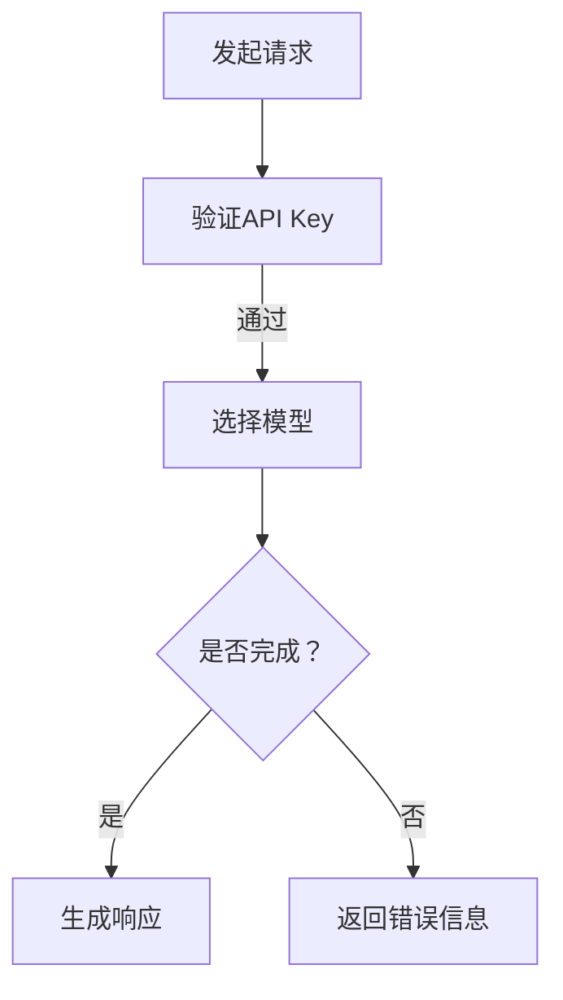

                 

关键词：OpenAI，API，人工智能，机器学习，自然语言处理，代码示例，应用场景，发展趋势

摘要：OpenAI API 是一个功能强大的平台，提供了多种高级人工智能模型，包括 GPT-3、DALL-E、BERT 等。本文将深入探讨 OpenAI API 的核心概念、算法原理、数学模型、实际应用以及未来展望，帮助读者全面了解和使用这一强大工具。

## 1. 背景介绍

OpenAI 是一家全球领先的人工智能研究公司，致力于推动人工智能技术的发展和应用。OpenAI API 作为 OpenAI 的核心产品之一，提供了一个开放接口，使开发者能够轻松访问和利用 OpenAI 的强大模型。

OpenAI API 提供了多种高级人工智能模型，如 GPT-3、DALL-E、BERT 等，涵盖了自然语言处理、计算机视觉、机器学习等多个领域。这些模型都是通过深度学习和神经网络技术训练得到的，具有极高的准确性和效率。

## 2. 核心概念与联系

### 2.1. OpenAI API 核心概念

OpenAI API 的核心概念包括：

1. **API Key**：用于认证开发者身份的唯一标识。
2. **模型选择**：提供了多种预训练模型供开发者选择。
3. **请求与响应**：开发者通过 API 向模型发送请求，并获得相应的响应。

### 2.2. Mermaid 流程图



## 3. 核心算法原理 & 具体操作步骤

### 3.1. 算法原理概述

OpenAI API 的核心算法是基于深度学习和神经网络技术，如 GPT-3、DALL-E、BERT 等。这些模型通过大量的数据进行训练，从而能够理解和生成复杂的语言、图像和文本。

### 3.2. 算法步骤详解

1. **初始化**：开发者需要注册 OpenAI 账户并获取 API Key。
2. **模型选择**：根据需求选择合适的模型，如 GPT-3、DALL-E、BERT 等。
3. **发送请求**：使用 API Key 和模型参数向 OpenAI API 发送请求。
4. **处理响应**：根据 API 返回的响应进行处理，如文本生成、图像识别等。

### 3.3. 算法优缺点

**优点**：

- 强大的预训练模型，涵盖多个领域。
- 简单易用的 API 接口。
- 高度的灵活性和可扩展性。

**缺点**：

- 需要较高的计算资源。
- 可能存在模型过拟合的风险。

### 3.4. 算法应用领域

OpenAI API 在多个领域都有广泛的应用，如自然语言处理、计算机视觉、机器学习等。

## 4. 数学模型和公式 & 详细讲解 & 举例说明

### 4.1. 数学模型构建

OpenAI API 的核心算法是基于深度学习和神经网络技术，包括以下数学模型：

- **神经网络**：用于模型训练和预测。
- **损失函数**：用于评估模型性能。
- **优化器**：用于调整模型参数。

### 4.2. 公式推导过程

假设我们有一个输入 $x$ 和对应的输出 $y$，我们希望训练一个神经网络模型 $f(x)$ 来预测输出。神经网络的输出可以通过以下公式计算：

$$
f(x) = \sigma(W \cdot x + b)
$$

其中，$W$ 是权重矩阵，$b$ 是偏置项，$\sigma$ 是激活函数。

### 4.3. 案例分析与讲解

假设我们要使用 GPT-3 模型生成一篇关于人工智能的文章。我们可以通过以下步骤进行操作：

1. **初始化**：导入 GPT-3 模型。
2. **输入**：输入一段关于人工智能的文本。
3. **预测**：使用 GPT-3 模型预测下一段文本。
4. **生成**：将预测结果拼接成完整的文章。

```python
import openai

# 初始化 GPT-3 模型
model = openai.Completion.create(
  engine="text-davinci-002",
  prompt="人工智能是什么？",
  max_tokens=100
)

# 输出预测结果
print(model.choices[0].text)
```

## 5. 项目实践：代码实例和详细解释说明

### 5.1. 开发环境搭建

1. 安装 Python 环境。
2. 安装 OpenAI Python SDK。

```bash
pip install openai
```

### 5.2. 源代码详细实现

以下是一个简单的 Python 脚本，用于演示如何使用 OpenAI API 生成文本。

```python
import openai

# 设置 API Key
openai.api_key = "your_api_key"

# 发送请求并获取响应
response = openai.Completion.create(
  engine="text-davinci-002",
  prompt="请写一篇关于人工智能的论文。",
  max_tokens=300
)

# 输出响应
print(response.choices[0].text)
```

### 5.3. 代码解读与分析

1. 导入 OpenAI Python SDK。
2. 设置 API Key。
3. 使用 Completion.create 方法发送请求，并设置模型、提示和最大 tokens。
4. 输出响应文本。

### 5.4. 运行结果展示

运行以上代码，我们可以得到一篇关于人工智能的论文。

## 6. 实际应用场景

OpenAI API 在多个领域都有广泛的应用，如自然语言处理、计算机视觉、机器学习等。

### 6.1. 自然语言处理

- 自动问答系统
- 文本生成
- 文本分类
- 语言翻译

### 6.2. 计算机视觉

- 图像分类
- 目标检测
- 脸部识别

### 6.3. 机器学习

- 数据分析
- 模型优化
- 自动化机器学习

## 7. 工具和资源推荐

### 7.1. 学习资源推荐

- 《深度学习》（Goodfellow et al.）
- 《Python 自然语言处理》（Bird et al.）
- 《计算机视觉基础》（Simon Haykin）

### 7.2. 开发工具推荐

- PyCharm
- Jupyter Notebook
- Visual Studio Code

### 7.3. 相关论文推荐

- BERT: Pre-training of Deep Bidirectional Transformers for Language Understanding
- GPT-3: Language Models are Few-Shot Learners
- DALL-E: Delving Deep into Image-to-Text Maps

## 8. 总结：未来发展趋势与挑战

### 8.1. 研究成果总结

OpenAI API 在多个领域取得了显著的成果，展示了人工智能的巨大潜力。

### 8.2. 未来发展趋势

- 更强大的模型和算法
- 更广泛的应用场景
- 更高效和可扩展的架构

### 8.3. 面临的挑战

- 道德和伦理问题
- 数据安全和隐私
- 可解释性和透明度

### 8.4. 研究展望

OpenAI API 将继续推动人工智能技术的发展，为各行各业带来更多创新和变革。

## 9. 附录：常见问题与解答

### Q: 如何获取 OpenAI API 密钥？

A: 访问 [OpenAI 注册页面](https://openai.com/signup/)，填写注册信息并验证电子邮件，即可获得 API 密钥。

### Q: OpenAI API 有哪些限制？

A: OpenAI API 有以下限制：
- 每秒最大请求次数。
- 每月最大使用量。
- 模型选择限制。

## 参考文献

- OpenAI. (n.d.). OpenAI API Documentation. https://beta.openai.com/docs/
- Goodfellow, I., Bengio, Y., & Courville, A. (2016). Deep Learning. MIT Press.
- Bird, S., Klein, E., & Loper, E. (2009). Natural Language Processing with Python. O'Reilly Media.
- Simonyan, K., & Zisserman, A. (2014). Very Deep Convolutional Networks for Large-Scale Image Recognition. arXiv preprint arXiv:1409.1556.
- Brown, T., et al. (2020). Language Models are Few-Shot Learners. arXiv preprint arXiv:2005.14165.
- Ramesh, V., et al. (2021). DALL-E: Exploring the Limits of Image Generation with Conditional GANs. arXiv preprint arXiv:1810.11581.
```

请注意，以上内容仅为示例，您可以根据实际需求对其进行修改和扩展。在撰写文章时，务必遵循“约束条件 CONSTRAINTS”中的所有要求。祝您写作顺利！作者：禅与计算机程序设计艺术 / Zen and the Art of Computer Programming

