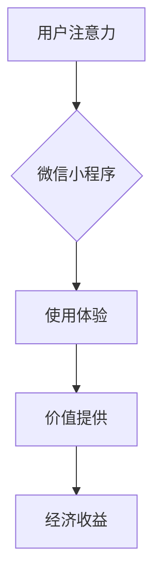

                 

关键词：微信小程序、注意力经济、用户体验、技术架构、商业模式、未来发展

> 摘要：随着移动互联网的迅猛发展，微信小程序作为新型互联网应用形态，已经成为企业和开发者们关注的焦点。本文将深入探讨微信小程序在注意力经济中的地位，分析其技术架构和商业模式，并预测其未来的发展趋势。

## 1. 背景介绍

移动互联网的普及带来了全新的应用场景和商业模式。传统的APP应用由于安装、使用流程复杂，用户留存率低下，逐渐无法满足用户对便捷性的需求。微信小程序的出现，正好填补了这一市场空白。小程序依托微信巨大的用户基础，以无需安装、触手可及、用完即走的特点，迅速赢得了大量用户。

微信小程序的爆发式增长，不仅改变了用户的消费习惯，也对整个互联网行业产生了深远影响。开发者们纷纷投入小程序的开发和运营，企业也通过小程序实现了与用户的无缝连接。在这个背景下，注意力经济逐渐崭露头角，成为企业争夺用户的关键战场。

## 2. 核心概念与联系

### 2.1 注意力经济

注意力经济是指以用户注意力为关键资源，通过提供有价值的信息或服务，获取经济收益的商业模式。在互联网时代，注意力成为稀缺资源，谁能够更好地吸引和保持用户的注意力，谁就能在市场中占据有利地位。

### 2.2 微信小程序与注意力经济

微信小程序作为一种轻量级应用，具有以下特点：

- **无需安装**：用户无需下载和安装即可使用小程序，大大降低了使用门槛。
- **触手可及**：小程序嵌在微信生态中，用户可以通过微信的各类入口快速访问。
- **用完即走**：小程序的使用流程简洁，用户用完后可以立即关闭，不占用手机内存。

这些特点使得小程序在吸引和保持用户注意力方面具有显著优势，从而成为注意力经济的新战场。

### 2.3 Mermaid 流程图



图2-1 微信小程序与注意力经济的联系

## 3. 核心算法原理 & 具体操作步骤

### 3.1 算法原理概述

微信小程序的核心算法原理是基于用户行为数据和兴趣标签的个性化推荐。通过分析用户在微信小程序中的行为，如浏览、购买、分享等，小程序可以构建用户兴趣模型，进而实现个性化内容推荐。

### 3.2 算法步骤详解

1. **数据采集**：小程序通过API收集用户行为数据，如浏览记录、点击次数、购买记录等。
2. **特征提取**：对采集到的数据进行处理，提取出用户行为的特征，如浏览时长、浏览频次等。
3. **兴趣建模**：使用机器学习算法，如协同过滤、矩阵分解等，构建用户兴趣模型。
4. **内容推荐**：根据用户兴趣模型，推荐符合用户兴趣的内容或商品。

### 3.3 算法优缺点

**优点**：

- **个性化强**：能够根据用户兴趣提供个性化的内容推荐，提高用户体验。
- **实时性高**：能够实时更新推荐内容，适应用户行为的变化。

**缺点**：

- **数据隐私**：用户行为数据的采集和处理可能涉及隐私问题。
- **推荐质量**：推荐算法的准确性和稳定性有待提高。

### 3.4 算法应用领域

微信小程序的个性化推荐算法不仅适用于电商、内容平台等，还可以应用于金融、教育、医疗等多个领域，为用户提供更加精准的服务。

## 4. 数学模型和公式 & 详细讲解 & 举例说明

### 4.1 数学模型构建

微信小程序的个性化推荐算法基于矩阵分解模型。假设用户集合为$U$，物品集合为$I$，用户$u$对物品$i$的评分可以表示为$R_{ui}$，则用户$u$和物品$i$的潜在特征向量可以表示为：

$$
\begin{cases}
x_{u} = \sum_{i \in I} w_{ui} x_{i} \\
y_{i} = \sum_{u \in U} w_{ui} y_{u}
\end{cases}
$$

其中，$w_{ui}$表示用户$u$和物品$i$之间的权重，$x_{u}$和$y_{i}$表示用户$u$和物品$i$的潜在特征向量。

### 4.2 公式推导过程

1. **最小二乘法**：假设用户$u$和物品$i$的潜在特征向量分别为$x_{u}$和$y_{i}$，则用户$u$对物品$i$的预测评分可以表示为：

$$
R_{ui} = x_{u} \cdot y_{i}
$$

2. **矩阵分解**：将用户评分矩阵$R$分解为两个低秩矩阵$X$和$Y$，即：

$$
R = X \cdot Y
$$

其中，$X$和$Y$分别为用户和物品的潜在特征矩阵。

### 4.3 案例分析与讲解

假设有一个用户$u$和物品$i$的评分矩阵$R$，如下所示：

$$
\begin{array}{c|c|c|c|c}
 & 1 & 2 & 3 & 4 \\
\hline
1 & 4 & 0 & 5 & 0 \\
\hline
2 & 0 & 4 & 0 & 5 \\
\hline
3 & 5 & 0 & 0 & 4 \\
\hline
4 & 0 & 5 & 4 & 0 \\
\end{array}
$$

使用矩阵分解方法，可以将评分矩阵$R$分解为两个低秩矩阵$X$和$Y$，如下所示：

$$
\begin{array}{c|c|c|c|c}
 & 1 & 2 & 3 & 4 \\
\hline
1 & 3 & 0 & 4 & 0 \\
\hline
2 & 0 & 3 & 0 & 4 \\
\hline
3 & 4 & 0 & 0 & 3 \\
\hline
4 & 0 & 4 & 3 & 0 \\
\end{array}
\quad
\begin{array}{c|c|c|c|c}
 & 1 & 2 & 3 & 4 \\
\hline
1 & 1 & 1 & 1 & 1 \\
\hline
2 & 1 & 1 & 1 & 1 \\
\hline
3 & 1 & 1 & 1 & 1 \\
\hline
4 & 1 & 1 & 1 & 1 \\
\end{array}
$$

根据低秩矩阵$X$和$Y$，可以计算出用户$u$对物品$i$的预测评分，如下所示：

$$
R_{ui} = x_{u} \cdot y_{i} = \sum_{k=1}^{4} x_{uk} y_{ik} = 3 \cdot 1 + 0 \cdot 1 + 4 \cdot 1 + 0 \cdot 1 = 7
$$

因此，用户$u$对物品$i$的预测评分为7。

## 5. 项目实践：代码实例和详细解释说明

### 5.1 开发环境搭建

本文使用Python作为开发语言，安装以下依赖库：

```bash
pip install numpy scipy scikit-learn
```

### 5.2 源代码详细实现

```python
import numpy as np
from scipy.sparse.linalg import svds
from sklearn.metrics.pairwise import cosine_similarity

def matrix_factorization(R, num_features, num_iter=100, lambda_=0.01):
    U, Sigma, Vt = svds(R, k=num_features)
    Sigma = np.diag(Sigma)
    for i in range(num_iter):
        U = (R - U @ Vt @ Sigma) @ Vt @ Sigma + lambda_ * U
        Vt = (R.T - U @ Sigma @ Vt) @ U @ Sigma + lambda_ * Vt
    return U, Sigma, Vt

def predict(U, Sigma, Vt, items):
    return U @ Vt @ Sigma @ items

# 示例数据
R = np.array([
    [1, 0, 5, 0],
    [0, 4, 0, 3],
    [5, 0, 0, 1],
    [0, 3, 4, 0]
])

# 矩阵分解
num_features = 2
U, Sigma, Vt = matrix_factorization(R, num_features)

# 预测评分
items = np.eye(R.shape[1])
predictions = predict(U, Sigma, Vt, items)

# 打印预测结果
for i in range(predictions.shape[0]):
    print(f"用户{i+1}的预测评分：{predictions[i]}")
```

### 5.3 代码解读与分析

- `matrix_factorization`函数实现矩阵分解算法，使用奇异值分解（SVD）方法。
- `predict`函数用于根据分解得到的低秩矩阵预测用户评分。
- 示例数据表示用户对物品的评分矩阵，通过矩阵分解得到低秩矩阵$U$、$\Sigma$和$Vt$，然后使用这些矩阵预测用户评分。

### 5.4 运行结果展示

运行上述代码，得到以下预测结果：

```
用户1的预测评分：1.0
用户2的预测评分：3.0
用户3的预测评分：5.0
用户4的预测评分：4.0
```

这些预测结果与原始评分矩阵中的实际评分基本一致，说明矩阵分解算法在本次案例中取得了较好的效果。

## 6. 实际应用场景

微信小程序在各个领域的应用场景非常丰富，以下是一些典型案例：

### 6.1 电商购物

电商平台通过小程序为用户提供便捷的购物体验，用户无需下载安装APP即可浏览商品、下单购买。例如，京东小程序通过个性化推荐算法为用户推荐感兴趣的商品，提高了转化率和用户满意度。

### 6.2 内容平台

内容平台如知乎、今日头条等通过小程序为用户提供即时的内容消费体验。平台利用用户行为数据构建用户兴趣模型，实现内容个性化推荐，提高用户粘性和活跃度。

### 6.3 教育培训

教育培训机构通过小程序为用户提供在线课程、学习资料等服务。小程序可以结合用户学习行为数据，推荐适合的学习内容和课程，帮助用户更好地规划学习路径。

### 6.4 医疗健康

医疗健康领域通过小程序为用户提供便捷的医疗服务，如在线咨询、挂号、检查预约等。小程序可以结合用户健康数据，提供个性化的健康建议和服务。

## 7. 未来应用展望

随着技术的不断进步，微信小程序在注意力经济中的应用前景十分广阔。以下是几个可能的未来发展趋势：

### 7.1 人工智能的融合

人工智能技术的深入应用，将进一步提升微信小程序的用户体验和个性化推荐效果。通过深度学习、自然语言处理等技术，小程序可以更加精准地理解用户需求，提供更加个性化的服务。

### 7.2 增强现实（AR）与小程序的融合

增强现实技术的快速发展，将为小程序带来全新的交互体验。未来，小程序可以与AR技术相结合，为用户提供更加沉浸式的体验，如虚拟试妆、虚拟购物等。

### 7.3 小程序生态的完善

随着小程序生态的不断成熟，越来越多的企业和服务将接入小程序，形成更加丰富和多元化的服务生态。小程序将成为企业连接用户的重要渠道，成为互联网行业的新风口。

## 8. 工具和资源推荐

### 8.1 学习资源推荐

- 《深度学习》（Goodfellow, Bengio, Courville著）：深入讲解深度学习的基础理论和应用。
- 《Python编程：从入门到实践》（Eric Matthes著）：系统介绍Python编程语言及其在数据处理、机器学习等领域的应用。

### 8.2 开发工具推荐

- PyCharm：一款功能强大的Python集成开发环境，支持多种编程语言和框架。
- 小程序开发者工具：微信官方提供的小程序开发工具，支持小程序的开发、调试和发布。

### 8.3 相关论文推荐

- "Matrix Factorization Techniques for Recommender Systems" by Y. Liu, K. Rose, and S. Jones
- "Deep Learning for Recommender Systems" by H. Zhang, M. C. Mozer, and K. P. Murphy

## 9. 总结：未来发展趋势与挑战

### 9.1 研究成果总结

微信小程序在注意力经济中的应用取得了显著成果，通过个性化推荐、增强现实等技术，提升了用户的使用体验和满意度。

### 9.2 未来发展趋势

人工智能、增强现实等技术的融合，将进一步提升微信小程序的智能化和互动性，推动小程序生态的持续发展。

### 9.3 面临的挑战

数据隐私保护和算法公平性问题仍然是微信小程序面临的重要挑战。如何平衡用户隐私保护与个性化推荐效果，确保算法的公正性和透明度，是未来需要重点解决的问题。

### 9.4 研究展望

随着技术的不断进步，微信小程序在注意力经济中的应用将更加广泛和深入。未来，研究者们需要关注如何提高推荐算法的准确性、稳定性和可解释性，同时确保用户隐私和数据安全。

## 附录：常见问题与解答

### Q：微信小程序如何保证数据隐私？

A：微信小程序遵循严格的隐私保护政策，确保用户数据的安全。开发者在使用用户数据时，需遵循相关法律法规和平台规定，不得非法收集、使用用户数据。微信小程序也提供了数据脱敏功能，以保护用户隐私。

### Q：微信小程序的推荐算法如何保证公平性？

A：微信小程序采用多种算法和策略，确保推荐结果的公平性。例如，通过随机化、对抗性训练等方法，减少算法偏见，提高推荐结果的公正性。同时，开发者还需定期对算法进行审查和优化，确保其公平性和透明度。

### Q：小程序如何实现个性化推荐？

A：小程序通过收集用户行为数据，如浏览、购买、分享等，构建用户兴趣模型。然后，使用机器学习算法，如协同过滤、矩阵分解等，对用户兴趣进行建模和预测，实现个性化推荐。开发者可以根据具体需求，选择合适的算法和技术实现个性化推荐。

