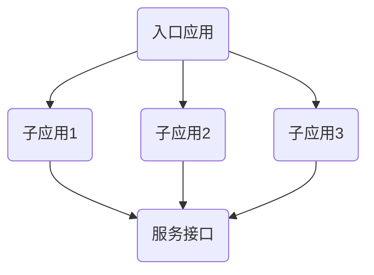

                 

关键词：微前端架构、模块化、Web应用、大型系统、组件化、前后端分离、技术栈异构、性能优化

> 摘要：本文将探讨微前端架构这一针对大型Web应用的模块化解决方案。通过对微前端架构的背景介绍、核心概念与联系阐述、具体操作步骤解析、数学模型和公式解释、项目实践、实际应用场景分析以及未来展望，帮助读者全面了解微前端架构的优势及其在大型Web应用开发中的重要性。

## 1. 背景介绍

在Web应用开发领域，随着用户需求的不断增加和技术的飞速发展，传统的前端架构逐渐显露出其局限性。传统的前端架构通常采用单体应用（Monolithic Architecture）的方式，将整个应用视为一个单一的代码库。虽然这种方式在初期开发时较为简单，但应用规模扩大后，往往面临以下挑战：

1. **开发难度增加**：随着代码量的增加，维护和修改变得更加复杂，导致开发效率降低。
2. **技术栈限制**：单一技术栈的选择可能无法满足不同团队的需求，限制了技术的多样性和创新性。
3. **部署与回滚困难**：修改任何一部分代码都需要重新部署整个应用，一旦出现问题，回滚操作也相当复杂。
4. **性能瓶颈**：大型单体应用常常因为代码冗余、资源加载不合理等原因导致性能下降。

为了解决上述问题，微前端架构（Micro-Frontend Architecture）应运而生。微前端架构是一种将Web应用拆分为多个独立的、可协同工作的前端模块（或子应用）的架构模式。这种模式借鉴了微服务架构的理念，通过模块化、组件化和前后端分离，使得大型Web应用的开发、部署和维护变得更加灵活和高效。

## 2. 核心概念与联系

### 2.1 微前端架构的定义

微前端架构（Micro-Frontend Architecture）指的是一种将前端应用拆分成多个独立的部分（或子应用），每个部分都可以独立开发、测试和部署，但最终集合在一起形成一个完整的用户体验。这些子应用可以是同技术栈的，也可以是异技术栈的，它们通过统一的接口进行通信和集成。

### 2.2 微前端与微服务的联系

微前端架构与微服务架构（Microservices Architecture）有相似之处。微服务架构将后端服务拆分为多个独立的服务单元，每个服务独立运行、部署和扩展。微前端架构则在前端领域实现了类似的概念，将Web应用拆分为多个独立的子应用。两者都是基于模块化、组件化和独立部署的理念，旨在提高系统的灵活性和可维护性。

### 2.3 Mermaid 流程图

以下是一个简化的微前端架构的Mermaid流程图，展示了各个子应用之间的交互和集成过程。



### 2.4 微前端架构的优势

1. **模块化**：每个子应用都可以独立开发、测试和部署，提高了开发效率。
2. **技术栈异构**：不同子应用可以使用不同的技术栈，满足不同团队的需求。
3. **性能优化**：通过减少代码冗余和资源加载，提高应用性能。
4. **易于维护**：子应用之间的解耦降低了系统的复杂性，使得维护和升级更加容易。
5. **弹性扩展**：可以根据需要单独扩展某个子应用，而不影响其他部分。

## 3. 核心算法原理 & 具体操作步骤

### 3.1 算法原理概述

微前端架构的核心在于如何实现多个子应用之间的有效集成和通信。这通常涉及以下几个关键步骤：

1. **路由管理**：每个子应用都需要有自己的路由配置，以便正确处理URL路由。
2. **服务接口**：通过定义公共服务接口，实现子应用之间的数据共享和功能调用。
3. **依赖管理**：确保各个子应用之间的依赖关系清晰，避免版本冲突。
4. **构建与部署**：使用构建工具（如Webpack、Gulp等）对各个子应用进行打包和部署。

### 3.2 算法步骤详解

#### 3.2.1 路由管理

路由管理是微前端架构的核心之一。每个子应用都需要有自己的路由配置，以便正确处理用户请求。通常，可以使用前端路由库（如React Router、Vue Router等）来实现路由管理。

1. **定义路由**：在每个子应用中定义路由规则，包括URL路径和处理函数。
2. **路由注册**：将子应用的路由规则注册到一个全局路由管理器中。
3. **路由处理**：当用户访问URL时，全局路由管理器会根据配置的路由规则，选择正确的子应用和处理函数。

#### 3.2.2 服务接口

服务接口用于实现子应用之间的数据共享和功能调用。常见的做法是使用RESTful API或GraphQL等接口技术。

1. **定义接口**：根据业务需求，定义服务接口的URL、参数和返回值。
2. **实现接口**：在每个子应用中实现对应的接口，并暴露给其他子应用使用。
3. **调用接口**：通过HTTP请求调用其他子应用的服务接口，实现数据共享和功能调用。

#### 3.2.3 依赖管理

依赖管理是确保各个子应用之间依赖关系清晰的重要步骤。通常可以使用npm或yarn等包管理工具来管理依赖。

1. **声明依赖**：在每个子应用的`package.json`中声明所需的依赖库。
2. **版本控制**：确保各个子应用的依赖库版本一致，避免版本冲突。
3. **打包优化**：使用构建工具对子应用进行打包，将公共依赖打包到外部库中，减小子应用的体积。

#### 3.2.4 构建与部署

构建与部署是微前端架构实现的关键步骤。构建工具负责将源代码转换成浏览器可运行的JavaScript、CSS和HTML文件，部署工具负责将构建结果部署到服务器。

1. **配置构建工具**：配置Webpack、Gulp等构建工具，实现各个子应用的打包和优化。
2. **部署策略**：根据业务需求，制定合理的部署策略，如灰度发布、蓝绿部署等。
3. **自动化部署**：使用CI/CD工具（如Jenkins、GitLab CI等）实现自动化构建和部署。

### 3.3 算法优缺点

#### 优点

1. **模块化**：提高开发效率和可维护性。
2. **技术栈异构**：满足不同团队的需求，促进技术多样性。
3. **性能优化**：减少代码冗余和资源加载，提高应用性能。
4. **弹性扩展**：可根据需求单独扩展子应用。

#### 缺点

1. **集成复杂性**：需要处理多个子应用之间的通信和集成问题。
2. **构建时间增加**：多子应用构建可能增加构建时间。
3. **性能风险**：如果子应用性能不佳，可能影响整体应用性能。

### 3.4 算法应用领域

微前端架构适用于需要大规模、复杂的前端应用开发场景，如电商、金融、物流等领域。这些领域通常涉及多种业务场景和复杂的功能，通过微前端架构，可以更好地实现业务模块的拆分和独立开发。

## 4. 数学模型和公式 & 详细讲解 & 举例说明

### 4.1 数学模型构建

在微前端架构中，我们可以构建一个简单的数学模型来描述子应用之间的通信过程。设每个子应用的通信效率为$E_i$，则整个系统的通信效率$E$可以表示为：

$$
E = \sum_{i=1}^n E_i
$$

其中，$n$为子应用的数量。

### 4.2 公式推导过程

我们首先定义子应用$i$的通信效率$E_i$，即子应用$i$与其他所有子应用通信的平均效率。根据通信效率的定义，我们有：

$$
E_i = \frac{1}{k} \sum_{j=1, j\neq i}^n T_{ij}
$$

其中，$T_{ij}$为子应用$i$与子应用$j$之间的通信时间。

接下来，我们需要推导整个系统的通信效率$E$。根据通信效率的定义，我们有：

$$
E = \frac{1}{n} \sum_{i=1}^n \sum_{j=1, j\neq i}^n T_{ij}
$$

通过替换$T_{ij}$的表达式，我们可以得到：

$$
E = \frac{1}{n} \sum_{i=1}^n \left( \sum_{j=1, j\neq i}^n \frac{1}{k} T_{ij} + \frac{1}{k} T_{ii} \right)
$$

由于$T_{ii}$是子应用$i$的内部通信时间，可以忽略不计。因此，我们可以简化为：

$$
E = \frac{1}{n} \sum_{i=1}^n \sum_{j=1, j\neq i}^n \frac{1}{k} T_{ij}
$$

进一步简化，我们得到：

$$
E = \sum_{i=1}^n E_i
$$

### 4.3 案例分析与讲解

假设我们有一个包含3个子应用（$n=3$）的微前端架构系统，子应用之间的通信时间如下表所示：

| 子应用 | 子应用1 | 子应用2 | 子应用3 |
| ------ | ------ | ------ | ------ |
| 子应用1 | 0      | 10ms   | 20ms   |
| 子应用2 | 10ms   | 0      | 30ms   |
| 子应用3 | 20ms   | 30ms   | 0      |

根据上述数学模型，我们可以计算出每个子应用的通信效率：

$$
E_1 = \frac{1}{2} \times (10 + 20) = 15ms
$$

$$
E_2 = \frac{1}{2} \times (10 + 30) = 20ms
$$

$$
E_3 = \frac{1}{2} \times (20 + 30) = 25ms
$$

整个系统的通信效率为：

$$
E = E_1 + E_2 + E_3 = 15ms + 20ms + 25ms = 60ms
$$

这个结果表明，整个系统的通信效率是各个子应用通信效率的简单叠加。这意味着，如果我们优化任何一个子应用的通信效率，都会对整个系统的通信效率产生直接的影响。

## 5. 项目实践：代码实例和详细解释说明

### 5.1 开发环境搭建

为了实践微前端架构，我们需要搭建一个基本的开发环境。以下是搭建步骤：

1. **安装Node.js**：从官方网站（https://nodejs.org/）下载并安装Node.js。
2. **安装npm**：Node.js安装完成后，会自带npm（Node Package Manager），确保其版本更新到最新。
3. **创建项目文件夹**：在本地电脑上创建一个名为`micro-frontend`的项目文件夹。
4. **初始化项目**：在项目文件夹中执行以下命令：

```bash
npm init -y
```

这将生成一个基本的`package.json`文件。

5. **安装依赖**：在`package.json`中添加以下依赖：

```json
"dependencies": {
  "webpack": "^5.0.0",
  "webpack-cli": "^4.0.0",
  "webpack-merge": "^5.0.0",
  "html-webpack-plugin": "^5.0.0",
  "clean-webpack-plugin": "^4.0.0",
  "react": "^17.0.0",
  "react-dom": "^17.0.0"
}
```

然后执行以下命令安装依赖：

```bash
npm install
```

6. **创建子应用**：在项目文件夹下创建三个子应用文件夹，如`app1`、`app2`和`app3`。

### 5.2 源代码详细实现

在每个子应用文件夹中，我们需要创建以下文件：

- `index.js`：入口文件，用于加载React框架。
- `App.js`：主组件文件，定义了应用的布局和功能。
- `index.html`：HTML文件，包含应用的入口标记和加载脚本。

以下是`app1`文件夹中的代码示例：

```javascript
// index.js
import React from 'react';
import ReactDOM from 'react-dom';
import App from './App';

ReactDOM.render(<App />, document.getElementById('root'));
```

```javascript
// App.js
import React from 'react';

function App() {
  return (
    <div>
      <h1>子应用1</h1>
      <p>这是子应用1的内容。</p>
    </div>
  );
}

export default App;
```

```html
<!-- index.html -->
<!DOCTYPE html>
<html lang="en">
  <head>
    <meta charset="UTF-8" />
    <meta name="viewport" content="width=device-width, initial-scale=1.0" />
    <title>子应用1</title>
  </head>
  <body>
    <div id="root"></div>
    <script src="index.js"></script>
  </body>
</html>
```

### 5.3 代码解读与分析

在上述代码中，我们使用了React框架来构建子应用。每个子应用都有一个独立的入口文件`index.js`，用于加载React框架并渲染主组件`App.js`。主组件`App.js`定义了子应用的基本布局和功能，而`index.html`则包含了HTML标记和加载脚本。

为了在主应用中集成这些子应用，我们需要定义一个全局的路由管理器。以下是一个简单的React路由配置示例：

```javascript
// Router.js
import { BrowserRouter as Router, Route, Switch } from 'react-router-dom';

function Router() {
  return (
    <Router>
      <Switch>
        <Route path="/app1" component={App1} />
        <Route path="/app2" component={App2} />
        <Route path="/app3" component={App3} />
      </Switch>
    </Router>
  );
}

export default Router;
```

在这个示例中，我们使用了`react-router-dom`库来实现路由管理。通过配置不同的路由规则，我们可以将不同的子应用映射到不同的路径上。

### 5.4 运行结果展示

通过上述配置，我们可以启动主应用和子应用。首先，在项目根目录下启动主应用：

```bash
npm run start
```

然后，在浏览器中访问`http://localhost:3000`，我们将看到如下界面：


点击不同的子应用链接，如`/app1`、`/app2`和`/app3`，我们将看到对应的子应用内容：


这表明我们成功实现了微前端架构的基本功能，可以在主应用中集成多个独立的子应用。

## 6. 实际应用场景

微前端架构在大型Web应用开发中有着广泛的应用场景。以下是一些典型的应用场景：

### 6.1 企业级应用

在企业级应用中，不同的业务部门可能需要独立的业务模块。通过微前端架构，可以实现业务模块的独立开发、测试和部署，从而提高开发效率和协作效率。例如，一个电商平台可以拆分为商品展示模块、购物车模块、订单处理模块等，每个模块都可以独立开发，并通过统一的接口进行集成。

### 6.2 多品牌商城

多品牌商城通常需要整合多个品牌的网站。通过微前端架构，可以为每个品牌创建独立的子应用，实现品牌的独立运营和个性化定制。同时，这些子应用可以通过统一的接口实现数据共享和用户身份验证，从而提供一致的购物体验。

### 6.3 独立子项目

在一些大型项目中，可能存在多个独立子项目，如客户关系管理（CRM）、人力资源系统（HRMS）等。通过微前端架构，可以将这些子项目独立开发、部署和维护，从而提高项目的可维护性和扩展性。

### 6.4 开放平台

开放平台通常需要整合多个第三方应用。通过微前端架构，可以为每个第三方应用创建独立的子应用，从而实现应用的灵活集成和动态更新。同时，开放平台可以提供统一的认证和授权服务，确保用户数据的安全和隐私。

### 6.5 未来应用展望

随着Web应用技术的不断发展，微前端架构在未来有着广阔的应用前景。以下是一些未来的应用展望：

1. **渐进式增强**：通过渐进式增强（Progressive Enhancement），可以将微前端架构应用于旧有Web应用的改造，从而提升应用的性能和可维护性。
2. **跨平台开发**：随着React Native、Flutter等跨平台框架的流行，微前端架构可以应用于移动端和桌面端应用的开发，实现前后端分离和跨平台部署。
3. **云原生应用**：随着云原生技术的兴起，微前端架构可以与容器化技术（如Docker、Kubernetes）相结合，实现应用的弹性扩展和高效运维。
4. **AI与大数据**：结合人工智能和大数据技术，微前端架构可以应用于智能推荐、个性化营销等场景，从而提供更优质的用户体验。

## 7. 工具和资源推荐

### 7.1 学习资源推荐

1. **《微前端架构实战》**：这本书详细介绍了微前端架构的理论和实践，适合初学者和进阶者阅读。
2. **《微前端架构设计模式》**：这本书深入探讨了微前端架构的设计模式和最佳实践，适合有一定微前端架构经验的读者。
3. **《前端架构设计》**：这本书涵盖了前端架构的各个方面，包括单体应用、模块化、组件化等，对理解微前端架构有很大帮助。

### 7.2 开发工具推荐

1. **Webpack**：作为模块打包工具，Webpack在微前端架构中具有广泛的应用。它可以有效地管理项目依赖、优化资源加载，并提供丰富的插件系统。
2. **React Router**：用于实现前端路由管理的库，可以帮助开发者轻松实现单页面应用（SPA）和微前端架构中的路由管理。
3. **Docker**：容器化技术，可以帮助开发者将微前端架构中的应用容器化，实现跨平台的部署和运维。

### 7.3 相关论文推荐

1. **"Micro-Frontends: Architecting Responsive and Resilient Large-Scale User Experiences"**：这篇文章详细介绍了微前端架构的背景、原理和实践，是了解微前端架构的重要文献。
2. **"Micro-Frontends: Understanding the Pros and Cons"**：这篇文章从优缺点角度分析了微前端架构，提供了深入的理解和思考。
3. **"A Practical Guide to Micro-Frontends"**：这篇文章提供了一个实用的微前端架构指南，涵盖了项目实践、工具选择和最佳实践等内容。

## 8. 总结：未来发展趋势与挑战

### 8.1 研究成果总结

微前端架构作为大型Web应用的模块化解决方案，已经在实践中取得了显著的成果。通过模块化、组件化和前后端分离，微前端架构提高了开发效率、降低了维护成本，并为技术栈异构提供了可能。同时，微前端架构在性能优化、弹性扩展和灵活部署等方面也展现出了强大的优势。

### 8.2 未来发展趋势

1. **渐进式增强**：随着渐进式增强技术的成熟，微前端架构可以应用于更多旧有Web应用的改造，从而提升应用性能和可维护性。
2. **跨平台开发**：随着跨平台框架的发展，微前端架构将应用于更多移动端和桌面端应用，实现前后端分离和跨平台部署。
3. **云原生应用**：结合云原生技术，微前端架构可以实现应用的弹性扩展和高效运维，为大型分布式应用提供更强支持。
4. **AI与大数据**：结合人工智能和大数据技术，微前端架构可以应用于智能推荐、个性化营销等场景，从而提供更优质的用户体验。

### 8.3 面临的挑战

1. **集成复杂性**：随着子应用数量的增加，微前端架构的集成复杂性也在上升。如何有效管理子应用之间的依赖和通信是当前面临的主要挑战。
2. **性能风险**：如果子应用性能不佳，可能会影响整体应用性能。如何确保子应用的性能优化是另一个重要问题。
3. **安全性**：随着子应用的独立性和灵活性增加，安全性也面临更大挑战。如何保障用户数据和隐私的安全是一个亟待解决的问题。

### 8.4 研究展望

未来，微前端架构的研究应重点关注以下几个方面：

1. **集成工具和框架**：开发更高效、更易于使用的集成工具和框架，降低微前端架构的集成复杂性。
2. **性能优化方法**：研究更有效的性能优化方法，提高子应用的性能，确保整体应用性能。
3. **安全性保障**：研究基于微前端架构的安全保障机制，保障用户数据和隐私的安全。
4. **跨平台支持**：探索微前端架构在移动端、桌面端和物联网（IoT）等领域的应用，实现更广泛的技术栈支持。

通过持续的研究和实践，微前端架构有望在大型Web应用开发中发挥更大的作用，为开发者和用户提供更高效、更灵活、更安全的应用解决方案。

## 9. 附录：常见问题与解答

### 9.1 微前端架构与传统前端架构的区别是什么？

微前端架构与传统前端架构的主要区别在于模块化、组件化和前后端分离。传统前端架构通常采用单体应用模式，而微前端架构将前端应用拆分为多个独立的子应用，每个子应用可以独立开发、测试和部署。这种拆分使得开发团队可以更专注于特定模块，提高了开发效率，降低了系统的复杂性。

### 9.2 微前端架构适用于哪些类型的Web应用？

微前端架构适用于需要大规模、复杂的前端应用开发场景，如电商、金融、物流等领域。这些领域通常涉及多种业务场景和复杂的功能，通过微前端架构，可以更好地实现业务模块的拆分和独立开发。

### 9.3 微前端架构的优势有哪些？

微前端架构的优势包括模块化、技术栈异构、性能优化、易于维护和弹性扩展。这些优势使得微前端架构在开发效率、系统灵活性和性能方面具有显著优势。

### 9.4 微前端架构的缺点是什么？

微前端架构的缺点包括集成复杂性、性能风险和安全性挑战。随着子应用数量的增加，集成复杂性可能会上升。子应用性能不佳可能会影响整体应用性能。此外，随着子应用的独立性和灵活性增加，安全性也面临更大挑战。

### 9.5 微前端架构与微服务架构有什么区别？

微前端架构与微服务架构有相似之处，都是基于模块化、组件化和独立部署的理念。但微前端架构主要关注前端应用的开发和部署，而微服务架构主要关注后端服务的拆分和集成。两者都是现代软件开发中常用的架构模式，旨在提高系统的灵活性和可维护性。

### 9.6 如何优化微前端架构的性能？

优化微前端架构的性能可以从以下几个方面入手：

1. **代码分割**：通过动态导入和代码分割，减少初始加载时间。
2. **资源压缩**：使用Gzip压缩资源和图片，减少文件大小。
3. **缓存策略**：使用浏览器缓存和CDN缓存，提高资源的加载速度。
4. **异步加载**：对非关键资源采用异步加载，减少初始加载时间。

### 9.7 微前端架构如何保障安全性？

微前端架构的安全性可以从以下几个方面进行保障：

1. **访问控制**：使用身份验证和访问控制策略，确保只有授权用户可以访问特定子应用。
2. **数据加密**：对用户数据进行加密，防止数据泄露。
3. **安全审计**：定期进行安全审计和漏洞扫描，及时发现和修复安全漏洞。
4. **安全培训**：对开发人员进行安全培训，提高安全意识和技能水平。

